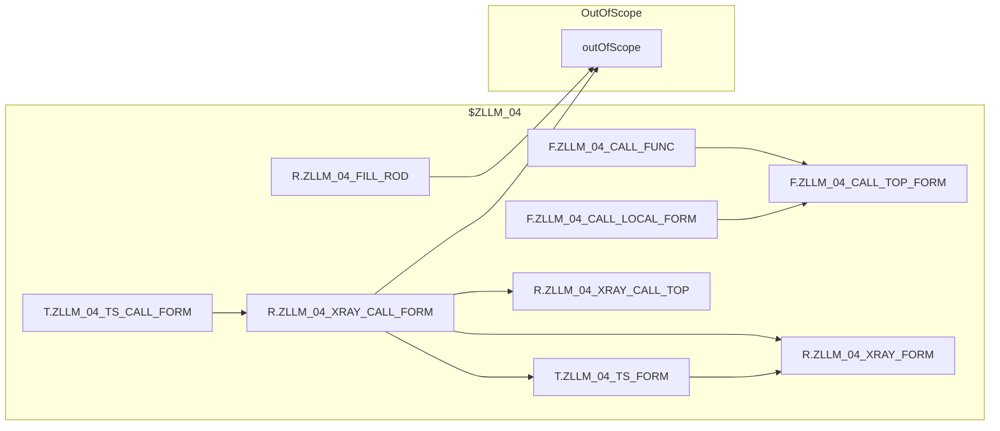
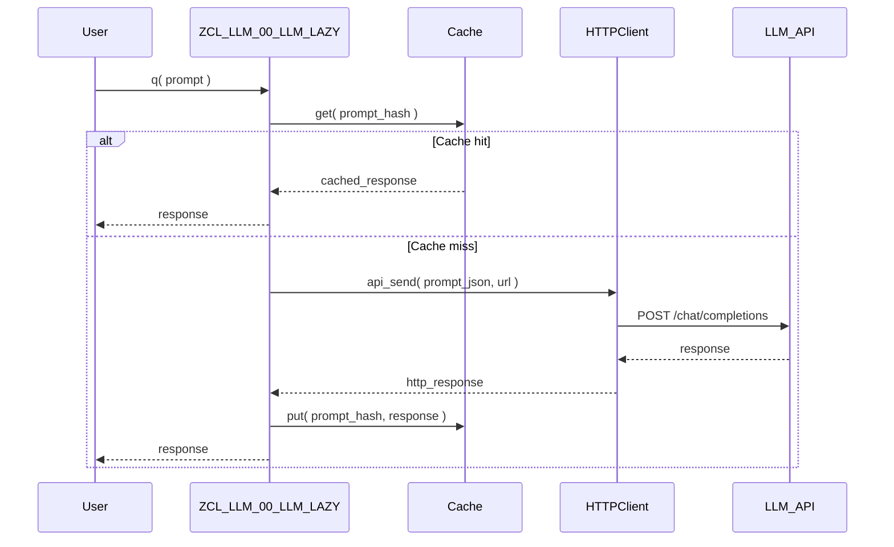

# DEVC Documentation

This file contains all unique DEVC documentation files.
Total files: 10

---

## DEVC.$ZLLM_00.CHAT-20250605-182440.MD

Q: Explain this, What is it for?
==== CHAT SESSION ====
Timestamp: 20250605-182440
Step: QNA

=== QUERY ===
Explain this, What is it for?

=== RESPONSE ===
Конечно! Вот подробное объяснение — что это такое и для чего предназначен пакет $ZLLM_04, исходя из всей предоставленной документации и структуры компонентов.

---

# 📌 Что это такое? Для чего нужен пакет $ZLLM_04?

---

## 1. Краткое описание

**$ZLLM_04** — это кастомный пакет в SAP, предназначенный для:
- Поддержки разработки, тестирования и демонстрации современных ABAP-подходов (ООП, рекурсия, интерфейсы, обработка исключений).
- Быстрого наполнения пользовательских таблиц тестовыми данными.
- Оркестрации пользовательских процессов через форм-рутины, логирование и запуск транзакций.
- Предоставления шаблонов и утилит для обучения ABAP-разработчиков и ускорения прототипирования.

---

## 2. Основные задачи и назначение

### 2.1 Для чего используется?

- **Автоматизация подготовки тестовых данных**  
  Быстрое массовое заполнение пользовательских таблиц уникальными идентификаторами (например, для тестирования или миграции).

- **Оркестрация пользовательских процессов**  
  Запуск цепочек форм-рутин, инициализация логирования/аналитики и переход к пользовательским транзакциям.

- **Демонстрация и обучение**  
  Предоставление примеров для демонстрации ООП, рекурсии, интерфейсных вызовов и обработки исключений в ABAP.

- **Техническая модульность**  
  Использование функциональных групп и форм для построения расширяемых и переиспользуемых решений.

---

## 3. Как это работает? (структура и взаимодействие)

### 3.1 Ключевые компоненты

- **ZLLM_04_FILL_ROD**  
  Заполняет таблицу ZLLM_04_ROD 15 уникальными записями (GUID).

- **ZLLM_04_XRAY_CALL_FORM**  
  Оркестратор: вызывает форм-рутины, инициализирует объекты логирования/аналитики, запускает кастомную транзакцию.

- **ZLLM_04_XRAY_FORM**  
  Демонстрационный отчёт: выводит имя текущей и вызывающей программы.

- **ZLLM_00_XRAY_03_TABLES_ROWS**  
  Извлекает все строки из таблицы ZLOC_I_CDS_UNION для анализа.

- **ZCL_LLM_00_TEST / ZCL_LLM_00_TEST_INTERFACE**  
  Классы для демонстрации ООП, рекурсии, вызова интерфейсов и обработки исключений.

- **ZLLM_04 Function Group**  
  Содержит форм-рутины и функциональные модули для вызова локальных и верхнеуровневых форм.

---

### 3.2 Визуализация (Mermaid-диаграмма)



---

## 4. Кому и когда это нужно?

- **ABAP-разработчикам** — для обучения, тестирования и быстрого прототипирования.
- **Техническим консультантам** — для подготовки тестовых данных и демонстрации архитектурных паттернов.
- **Тестировщикам** — для наполнения таблиц и проверки бизнес-логики.
- **Бизнес-аналитикам** — для запуска кастомных процессов и анализа данных.

---

## 5. Краткое резюме

- **$ZLLM_04** — это технический и учебный набор компонентов для поддержки разработки, тестирования и демонстрации в SAP.
- Обеспечивает автоматизацию тестовых данных, оркестрацию процессов и обучение современным ABAP-подходам.
- Не содержит сложной бизнес-логики, но идеально подходит для разработки, тестирования и обучения.

---

**Если нужна детализация по отдельному компоненту или расширенная визуализация — дайте знать!**
==== END CHAT ====

---

## DEVC.$ZLLM_00.CHAT-20250605-210156.MD

Q: Explain the purpose of these classes and their connection (data flow and
control flow)

==== CHAT SESSION ====
Timestamp: 20250605-210156
Step: QNA

=== QUERY ===
Explain the purpose of these classes and their connection (data flow and
control flow)


=== RESPONSE ===

==== END CHAT ====

---

## DEVC.$ZLLM_00.CHAT-20250607-102131.MD

Q: Explain Code

==== CHAT SESSION ====
Timestamp: 20250607-102131
Step: QNA

=== QUERY ===
Explain Code


=== RESPONSE ===
Certainly! Here’s a detailed, step-by-step explanation of the ABAP class **ZCL_LLM_00_LLM_LAZY** and its test class, based on the provided code.

---

## 1. **Purpose and Context**

- **ZCL_LLM_00_LLM_LAZY** is an ABAP class designed to act as a "lazy" interface to Large Language Models (LLMs), such as OpenAI's GPT or Azure OpenAI endpoints.
- It provides methods to send prompts (chat or reasoning) to LLM APIs, handle caching, manage throttling (rate limiting), and process responses.
- The class is designed for flexibility: it can be configured for different LLM providers and models, and supports both caching and rate limiting.

---

## 2. **Key Interfaces and Dependencies**

- **zif_llm_00_types**: Provides type definitions (e.g., environment, chat input).
- **zif_llm_00_llm_lazy**: The main interface for this class.
- **zif_llm_00_cache**: Interface for caching responses.
- **zif_llm_00_file**: Interface for reading configuration from files.
- **zif_llm_00_trace**: For debugging/tracing requests.
- **if_http_client**: SAP standard HTTP client for making API calls.
- **zcx_s**: Custom exception class for error handling.

---

## 3. **Main Attributes**

- **ms_env**: Holds environment/configuration (API keys, URLs, etc.).
- **mv_url, mv_url_embed**: URLs for chat and embedding endpoints.
- **mv_model**: Model name (e.g., "gpt-4").
- **ms_**: LLM configuration structure.
- **mo_cache**: Reference to the cache object.
- **mv_llm_id, mv_llm_hash**: Identifiers for the LLM instance (used for throttling).
- **ms_lim, gt_lim**: Throttling/rate limit configuration and table.
- **gv_debug, go_trace**: Debugging flags and trace object.
- **gv_msg**: Last error message.

---

## 4. **Key Methods**

### **Constructor**

- Initializes the class with environment and cache.
- Determines the model type (GPT, Mistral, etc.) and sets the correct API URLs.
- Sets up throttling if required.

### **new / new_from_file (Class Methods)**

- Factory methods to create an instance from environment structure or from a file (e.g., .env).
- Ensures a cache object is always present.

### **api_send**

- Handles the actual HTTP POST to the LLM API.
- Applies throttling if configured (waits after N requests).
- Sets headers (Content-Type, API key).
- Sends the JSON payload.
- Handles errors via `raise_last_error`.

### **_api_receive**

- Placeholder for receiving and processing the HTTP response.
- Actual logic is delegated to the response class.

### **raise_last_error**

- Extracts the last error from the HTTP client and raises a custom exception.

### **q (Query)**

- Main method to send a prompt to the LLM.
- Serializes the input to JSON.
- Checks the cache first; if found, returns cached response.
- Otherwise, sends the request and wraps the response.

### **a (Answer)**

- Extracts the answer from the response object.

### **_throttle**

- Updates or adds throttling configuration for a given LLM instance.

### **Debug/Trace Methods (_debug, _in, _out)**

- Enable/disable debug mode and trace requests/responses.

---

## 5. **Test Class (lcl_)**

- **setup**: Prepares file list, loads environment, and creates the class under test.
- **cc, cc_local, cc_azure, cc_azure2, cc_azure_o4**: Test various chat completion scenarios (local, Azure, different models).
- **cc_cache, cc_cache_bypass**: Test caching behavior (should return same/different results).
- **cc_json_forced, cc_json_explicit**: Test JSON response handling.
- **Other methods** (commented out): For embeddings, function calling, etc.

---

## 6. **How It Works: High-Level Flow**

1. **Initialization**:  
   - Load environment/config (API key, URL, model).
   - Set up cache and throttling.

2. **Sending a Prompt**:  
   - Serialize input (chat or reasoning) to JSON.
   - Check cache for previous response.
   - If not cached, send HTTP POST to LLM API.
   - Handle throttling if needed.
   - Receive and wrap the response.

3. **Getting the Answer**:  
   - Extract the answer from the response object.

4. **Testing**:  
   - Automated tests cover various scenarios, including caching, different models, and error handling.

---

## 7. **Mermaid Diagram: High-Level Sequence**



---

## 8. **Summary Table**

| Method             | Purpose                                                      |
|--------------------|-------------------------------------------------------------|
| constructor        | Initialize with config, set URLs, model, throttling         |
| new/new_from_file  | Factory methods to create instance                          |
| api_send           | Send HTTP POST to LLM API                                   |
| _api_receive       | (Placeholder) Receive/process HTTP response                 |
| raise_last_error   | Raise exception on HTTP error                               |
| q                  | Main entry: send prompt, use cache, return response         |
| a                  | Extract answer from response                                |
| _throttle          | Set/update throttling config                                |
| _debug/_in/_out    | Debugging/tracing                                           |

---

## 9. **Key Points**

- **Flexible**: Supports different LLM providers and models.
- **Efficient**: Uses caching to avoid redundant API calls.
- **Robust**: Handles errors and rate limiting.
- **Tested**: Includes comprehensive ABAP Unit tests.

---

**In summary:**  
**ZCL_LLM_00_LLM_LAZY** is a robust, flexible ABAP class for interacting with LLM APIs, with built-in caching, throttling, and error handling, and is thoroughly tested for various scenarios.
==== END CHAT ====

---

## DEVC.$ZLLM_00.CHAT-20250607-102159.MD

Q: Explain Code
==== CHAT SESSION ====
Timestamp: 20250607-102159
Step: QNA

=== QUERY ===
Explain Code

=== RESPONSE ===
Certainly! Here’s a detailed explanation of the provided ABAP code for the three classes:

---

## 1. **ZCL_LLM_00_FLOW_RESULT**
**Purpose:**  
Represents the result of a sequence of "steps" (likely in a workflow or pipeline), collecting and aggregating their outputs.

**Key Features:**
- Implements two interfaces: `zif_llm_00_string` and `zif_llm_00_step_result`.
- Holds a table (`mt_`) of references to step results.
- Provides a static constructor (`new`) to create an instance from a table of step results.
- Aggregates results via the `collect` method, which loops through all steps, collects their results, and flattens them (possibly for JSON serialization).
- Caches string and data representations for efficiency.
- Implements methods to:
  - Predict token count of the result as a string.
  - Convert the result to a string.
  - Check if the result is a JSON structure.

**Key Methods:**
- `new`: Static factory, returns a new instance.
- `zif_llm_00_step_result~collect`: Aggregates results from all steps.
- `zif_llm_00_string~to_string`: Converts the result to a string, with caching.
- `zif_llm_00_string~predict_tokens`: Returns the predicted token count for the string representation.
- `zif_llm_00_step_result~is_json`: Checks if the collected result is a JSON structure.

---

## 2. **ZCL_LLM_00_FORMULA**
**Purpose:**  
Represents a "prompt formula"—a template or pattern for generating prompts, combining a system pattern and a user pattern.

**Key Features:**
- Implements the `zif_llm_00_formula` interface.
- Holds references to system and user patterns (`mo_pat_sys`, `mo_pat_usr`), as well as formatting options (prefix, postfix, name, root).
- Provides multiple static constructors to create a formula from:
  - Patterns directly.
  - Files (system/user).
  - File lists and names.
  - Ad-hoc system/user strings.
- The `apply` method applies both system and user patterns to a given input.
- Provides accessors for name, system pattern, and user pattern.

**Key Methods:**
- `new_from_pats`: Creates a formula from pattern objects.
- `new_from_files`: Creates a formula from file objects.
- `new_from_name`: Looks up files by name and creates a formula.
- `new_from_usr_and_sys`: Creates a formula from user/system strings.
- `zif_llm_00_formula~apply`: Applies both patterns to input data.
- `zif_llm_00_formula~get_name`, `get_sys`, `get_usr`: Accessors.

---

## 3. **ZCL_LLM_00_FORMULA_LIST**
**Purpose:**  
Manages a list of formulas, providing ways to construct, filter, and retrieve them.

**Key Features:**
- Implements the `zif_llm_00_formula_list` interface.
- Holds a table of formulas (`mt_`).
- Provides static constructors to create a list from:
  - A table of formulas.
  - A file list (with filtering and deduplication).
  - A folder (commented out, but intended for local file system).
  - A package (from SAP repository objects).
- Provides methods to filter the list, get all formulas, or get a formula by name.

**Key Methods:**
- `new`: Static factory from a table.
- `new_from_fl`: Builds the list from a file list, deduplicating by name.
- `new_from_folder`: (Commented out) Intended to build from a directory.
- `new_from_package`: Builds from SAP repository objects.
- `zif_llm_00_formula_list~filter`: Filters formulas by name/mask.
- `zif_llm_00_formula_list~get`: Returns all formulas.
- `zif_llm_00_formula_list~get_by_name`: Returns a formula by name.

---

## **How They Work Together**

- **Formulas** are templates for prompts, built from patterns (system/user) that can be loaded from files, strings, or objects.
- **Formula lists** manage collections of these formulas, supporting filtering and retrieval.
- **Flow results** aggregate the outputs of a sequence of steps (which could include applying formulas), and provide utilities for string conversion, token prediction, and JSON handling.

---

## **High-Level Flow (Mermaid Diagram)**

```mermaid
flowchart TD
    subgraph Formula Construction
        A1[Pattern (System)] --> B1[Formula]
        A2[Pattern (User)] --> B1
        A3[File (System)] --> C1[Pattern (System)]
        A4[File (User)] --> C2[Pattern (User)]
        C1 --> B1
        C2 --> B1
        D1[File List] --> E1[Formula List]
        B1 --> E1
    end
    subgraph Step Execution
        F1[Step 1] --> G1[Flow Result]
        F2[Step 2] --> G1
        F3[Step N] --> G1
    end
    E1 --> F1
    E1 --> F2
    E1 --> F3
    G1 --> H1[String Output]
    G1 --> H2[JSON Output]
    G1 --> H3[Token Prediction]
```

---

## **Summary Table**

| Class                        | Purpose                                      | Key Data/Methods                                      |
|------------------------------|----------------------------------------------|-------------------------------------------------------|
| ZCL_LLM_00_FLOW_RESULT       | Aggregates step results                      | `collect`, `to_string`, `predict_tokens`, `is_json`   |
| ZCL_LLM_00_FORMULA           | Represents a prompt formula                  | `apply`, `get_name`, `get_sys`, `get_usr`             |
| ZCL_LLM_00_FORMULA_LIST      | Manages a list of formulas                   | `filter`, `get`, `get_by_name`, `new_from_fl`         |

---

## **In Plain English**

- **ZCL_LLM_00_FLOW_RESULT**: Collects and processes the results of a sequence of steps, making it easy to get the combined output as a string or JSON.
- **ZCL_LLM_00_FORMULA**: Defines how to build prompts/templates by combining system and user patterns, which can be loaded from various sources.
- **ZCL_LLM_00_FORMULA_LIST**: Lets you manage and retrieve multiple formulas, supporting filtering and construction from files or packages.

If you have a specific method or part you want explained in more detail, let me know!
==== END CHAT ====

---

## DEVC.$ZLLM_00.CHAT-20250607-125749.MD

Q: please explain this family of classes
==== CHAT SESSION ====
Timestamp: 20250607-125749
Step: QNA

=== QUERY ===
please explain this family of classes

=== RESPONSE ===
Below is a high-level summary of how these classes hang together to provide a pluggable, cache-aware, throttled, testable “lazy” LLM client in ABAP.

1. Common Interface  
   • zif_llm_00_llm_lazy  
     – Defines two key operations:  
       • q( io_    ): send a JSON payload and get back a zif_llm_00_llm_response  
       • a( io_    ): extract the “answer” from a zif_llm_00_llm_response  
     – Also exposes get_config( ) to retrieve model name, max tokens, split limit, etc.  

2. Core HTTP-backed Client  
   • zcl_llm_00_llm_lazy  
     – Factory methods new( ts_env ) and new_from_file( zif_llm_00_file )  
     – constructor builds the appropriate OpenAI/Azure URL, reads API key, model, throttling limits  
     – api_send( iv_json, iv_url )  
       • Creates and configures an if_http_client, sets headers, payload, applies per-model rate-limits (pause after N requests)  
     – q( io_json_wrapper )  
       • Serializes to JSON, checks cache by key, else calls api_send + returns zcl_llm_00_llm_response  
     – a( lo_response ) simply calls lo_response–>v( )  
     – Supports debug tracing via _debug / _in / _out  

3. HTTP-Response Wrapper & Caching  
   • zcl_llm_00_llm_response  
     – Wraps if_http_client and cache  
     – api_receive handles receive/ retry-on-429 logic, extracts cdata, closes connection  
     – v( ) method returns cached or freshly fetched JSON, storing into cache if needed  
     – k( ) returns the cache key  

4. Simple Mock for Unit Tests  
   • zcl_llm_00_llm_lazy_mock  
     – Implements the same interface  
     – On q( ), skips HTTP and returns zcl_llm_00_llm_response initialized with a fixed iv_v  
     – Ideal for deterministic ABAP unit tests  

5. Alternative HTTP Wrapper (e.g. Azure Functions)  
   • zcl_llm_00_llm_lazy_wrap  
     – Very similar to Lazy but uses different headers (x-functions-key) and endpoint URL format  
     – Otherwise shares caching and interface  

6. Load-Balancing Across Multiple LLMs  
   • zcl_llm_00_llm_lazy_balancer  
     – Accepts a table of REF TO zif_llm_00_llm_lazy  
     – Groups them by max_token, maintains round-robin counters per group  
     – Uses zcl_llm_00_predictoken to predict token usage of the outgoing JSON  
     – Picks the smallest group whose max_token ≥ predicted tokens, cycles within the group  
     – Swaps the JSON “model” field dynamically before forwarding to the chosen LLM via its q( )  

7. Composite “Cheap vs Expensive” LLM Selector  
   • zcl_llm_00_llm_lazy_composite  
     – Wraps two LLM implementations: a “light” and an “expensive” one  
     – Has a numeric threshold (token count)  
     – Uses predictoken to estimate outgoing token count: if ≤ threshold, rewrites model to light LLM and sends there, else forwards to expensive LLM  

8. Utility for Parsing Lists/Ranges  
   • zcl_llm_00_list  
     – Converts a TABLE OF string or a delimited string into ABAP range tables (RANGES) of type string or tvarvc  
     – Recognizes “!” prefix for exclusion, “*” or “+” suffix for pattern match (CP) vs exact (EQ)  
     – Used by file-list or environment readers to pick up sets of extensions or file names  

Diagram (simplified Mermaid, “implements” arrow →):

```
interface zif_llm_00_llm_lazy
   zcl_llm_00_llm_lazy
   zcl_llm_00_llm_lazy_wrap
   zcl_llm_00_llm_lazy_mock
   zcl_llm_00_llm_lazy_balancer
   zcl_llm_00_llm_lazy_composite

zif_llm_00_llm_lazy → zcl_llm_00_llm_response  "response wrapper & cache"
```

Key flows:  
• Caller builds a chat/embedding JSON via the payload adapter → passes to LLM.q( ) → receives a zcl_llm_00_llm_response → calls LLM.a( ) to get the text.  
• Behind the scenes you get HTTP client creation, header setup, throttling, retry-on-429, caching, pluggable endpoints (OpenAI vs Azure), load-balancing or composite selection, and mock implementations for tests.
==== END CHAT ====

---

## DEVC.$ZLLM_00.DOCUMENT.MD

# ABAP Component Documentation: $ZLLM_00 Package

## 1. Component Overview

- **Type**: ABAP Package
- **Technical Category**: Foundation/Utility Package for Lightweight LLM (Large Language Model) Module
- **System Role**: Core technical infrastructure for graph-based code analysis, dependency mapping, and AI/LLM-driven code intelligence within SAP

### Description

- **Package Name**: $ZLLM_00
- **Description**: Lightweight LLM Module common
- **Parent Package**: $ZLLM
- **Relative Level**: 0

This package serves as the foundational layer for the Lightweight LLM (Large Language Model) module in SAP, providing common utilities, data models, and technical infrastructure for advanced code analysis, dependency mapping, and AI-driven code intelligence. It is designed to be modular, extensible, and primarily analytical in nature.

---

## 2. Technical Analysis

### 2.1 Core Functionality

The $ZLLM_00 package provides:

- **Graph Data Model**: Centralized node/edge tables for representing ABAP objects and their relationships.
- **Caching and Binary Storage**: Temporary tables for caching intermediate results and storing binary artifacts (e.g., serialized graphs, model checkpoints).
- **Analytics Support**: Structures for tracking object usage, deprecation candidates, and lifecycle management.
- **Documentation Support**: Tables for storing metadata and documentation for graph nodes.
- **Utility Classes**: Common classes for file handling, encoding/decoding, JSON processing, and LLM orchestration.

### 2.2 Technical Architecture

#### Interfaces

- **Internal**: Provides APIs and data structures for other $ZLLM_00 subcomponents (e.g., classes for cache, codec, file handling).
- **External**: Serves as the technical backbone for higher-level LLM modules and analytical tools.

#### Dependencies

- **Parent Package**: $ZLLM (higher-level LLM orchestration)
- **Subpackages**: $ZLLM_00_BIN (deprecated), and others for specialized functionality.
- **Database Tables**: ZLLM_00_NODE, ZLLM_00_EDGE, ZLLM_00_CACHE, ZLLM_00_BIN, ZLLM_00_CCLM, ZLLM_00_DOC.

#### Data Flow

- **Node/Edge Tables**: Capture ABAP object metadata and relationships.
- **Cache/Bin Tables**: Store intermediate and binary data for performance and extensibility.
- **Analytics/Documentation Tables**: Support lifecycle management and maintainability.

### 2.3 Implementation Details

- **Design Patterns**: Graph modeling (node/edge), caching, adapter patterns for file and codec handling.
- **Database Interactions**: High-volume operations on ZLLM_00_NODE; moderate on ZLLM_00_EDGE, ZLLM_00_CACHE, ZLLM_00_BIN.
- **Extensibility**: Designed for easy addition of new analytics, documentation, and AI-driven features.
- **Performance**: Focus on efficient graph traversal, caching, and temporary storage.
- **Security**: No direct business data; technical/analytical focus reduces risk, but access should be restricted to technical users.

---

## 3. Business Context

### 3.1 Business Purpose

- **Objective**: Enable advanced code analysis, dependency mapping, and AI/LLM-driven insights for ABAP codebases.
- **Significance**: Supports maintainability, technical debt reduction, and modernization initiatives by providing deep insights into code structure and usage.

### 3.2 Process Integration

- **Integration Points**: Used by analytical tools, code quality dashboards, and AI/LLM modules for code intelligence.
- **Workflow Support**: Facilitates code review, refactoring, and lifecycle management processes.

### 3.3 Operational Impact

- **Impact**: Improves codebase transparency, supports technical debt management, and enables AI-driven automation in code analysis.
- **Risk**: As a technical/analytical package, operational risk is low, but performance and data integrity are critical for accurate analysis.

---

## 4. Support & Maintenance

### 4.1 Configuration

- **No direct business configuration**; technical setup may include:
  - Table indexing for ZLLM_00_NODE and ZLLM_00_EDGE.
  - Scheduled cleanup jobs for cache and bin tables.
  - Access control for technical users.

### 4.2 Monitoring

- **Key Monitoring Points**:
  - Growth of ZLLM_00_NODE (primary volume driver).
  - Cache/bin table size and cleanup frequency.
  - Data integrity between node, edge, and documentation tables.

### 4.3 Common Issues

- **Potential Issues**:
  - Performance degradation due to large node/edge tables.
  - Stale or orphaned cache/bin entries.
  - Incomplete documentation or analytics data.
- **Resolutions**:
  - Implement regular archiving and cleanup.
  - Enforce foreign key relationships where possible.
  - Encourage population of documentation and analytics tables.

---

## 5. Additional Information

- **Author**: [Not specified]
- **Last Updated**: [Not specified]
- **Version**: [Not specified]

---

### References & Related Components

- **Related Tables**: ZLLM_00_NODE, ZLLM_00_EDGE, ZLLM_00_CACHE, ZLLM_00_BIN, ZLLM_00_CCLM, ZLLM_00_DOC
- **Parent Package**: $ZLLM
- **Subpackages**: $ZLLM_00_BIN (deprecated)
- **Key Classes**: ZCL_LLM, ZCL_LLM_00_CACHE, ZCL_LLM_00_CODEC, ZCL_LLM_00_FILE_LIST_BIN, ZCL_LLM_00_LLM_LAZY, etc.
- **Process Flow**: See related Mermaid diagrams and flowcharts for technical integration points.

---

## Summary Table (from Data Model Analysis)

| Table Name      | Row Count | Functional Area         | Description                                      |
|-----------------|-----------|------------------------|--------------------------------------------------|
| ZLLM_00_NODE    | 15,604    | Core Graph Data        | Graph nodes (objects, metadata)                   |
| ZLLM_00_EDGE    | 499       | Core Graph Data        | Graph edges (relationships)                       |
| ZLLM_00_CACHE   | 747       | Caching/Auxiliary      | K/V cache for intermediate results                |
| ZLLM_00_BIN     | 250       | Caching/Auxiliary      | Binary storage (files, blobs)                     |
| ZLLM_00_CCLM    | 0         | Analytics/Lifecycle    | Suspects for deprecation (usage analytics)        |
| ZLLM_00_DOC     | 0         | Documentation/Metadata | Node documentation                               |

---

## Recommendations

- Monitor ZLLM_00_NODE for growth and performance.
- Schedule periodic cleanup for cache and bin tables.
- Populate documentation and analytics tables to maximize maintainability and code quality.
- Establish and enforce data integrity relationships between core tables.

---

**Overall, the $ZLLM_00 package is a robust, extensible technical foundation for graph-based code analysis and AI-driven code intelligence in SAP ABAP environments.**

---

## DEVC.$ZLLM_00.LLM-DM.MD

# Data Model Analysis: ZLLM_00 Lightweight LLM Module

This analysis covers the ZLLM_00* table set, which appears to support a lightweight graph-based module for SAP, likely related to code analysis, dependency mapping, or AI/LLM-driven code intelligence. All tables are marked as "Temporary" and reside in the $ZLLM_00 package, indicating a modular, possibly experimental or analytical subsystem.

---

## 1. HIGH VOLUME OPERATIONAL TABLES

### 1.1 Core Graph Data Structures

#### ZLLM_00_NODE (15,604 rows)
- **Purpose:** Represents nodes in a graph structure, likely corresponding to ABAP objects (programs, classes, includes, etc.) and their metadata.
- **Key fields:** SEED (graph seed/context), NODE (node identifier), OBJ_TYPE/OBJ_NAME (object type/name), ENCL_OBJ_TYPE/ENCL_OBJ_NAME (enclosing object), DEVCLASS (package), INCLUDE (program/include), timestamps.
- **Relationships:** Central to the graph; likely referenced by edges and documentation tables.

#### ZLLM_00_EDGE (499 rows)
- **Purpose:** Represents edges (relationships) between nodes in the graph, such as dependencies, calls, or associations.
- **Key fields:** ETYPE (edge type/relation), SEED (context), timestamps.
- **Relationships:** Connects nodes (ZLLM_00_NODE); ETYPE defines the nature of the relationship.

---

## 2. SUPPORTING/REFERENCE TABLES

### 2.1 Caching and Auxiliary Data

#### ZLLM_00_CACHE (747 rows)
- **Purpose:** Key/Value cache for storing intermediate or computed results, possibly for performance optimization or temporary storage during graph analysis.
- **Key fields:** SEED (context), CDATE/ADATE (creation/access dates), ACCESSED (access counter), TSTime (timestamp).
- **Usage:** Supports fast lookups and reduces redundant computation.

#### ZLLM_00_BIN (250 rows)
- **Purpose:** Stores binary files or blobs, possibly for storing serialized graph data, model artifacts, or related files.
- **Key fields:** BIN (binary key), NAME (file name), timestamps.
- **Usage:** Auxiliary storage for non-relational data associated with the graph.

---

## 3. CONFIGURATION & ANALYTICS TABLES

### 3.1 Deprecation and Usage Analytics

#### ZLLM_00_CCLM (0 rows)
- **Purpose:** Tracks objects suspected for deprecation, including last usage and age metrics (years, months, days).
- **Key fields:** OBJ_TYPE/OBJ_NAME (object), NODE, LAST_USED, AGE_Y/M/D (age in years/months/days), DEVCLASS, SYSID (system), BUS_01 (business text).
- **Usage:** Supports code cleanup, technical debt analysis, and lifecycle management.

---

## 4. DOCUMENTATION TABLES

### 4.1 Node Documentation

#### ZLLM_00_DOC (0 rows)
- **Purpose:** Stores documentation or metadata for graph nodes.
- **Key fields:** NODE (node identifier), timestamps.
- **Usage:** Provides descriptive or explanatory text for nodes, supporting maintainability and knowledge sharing.

---

# Cohort Analysis

## Cohort 1: Graph Structure & Core Data

**Tables:**  
- ZLLM_00_NODE  
- ZLLM_00_EDGE  

**Explanation:**  
These tables form the backbone of the graph model, representing entities (nodes) and their relationships (edges). The high row count in ZLLM_00_NODE indicates a detailed, granular mapping of ABAP objects or code elements. ZLLM_00_EDGE, while smaller, is critical for expressing dependencies and associations.

**Key patterns:**  
- Graph-based modeling of code or business objects.
- Centralized node/edge paradigm.
- SEED field enables multi-graph or context partitioning.

**Volume considerations:**  
- ZLLM_00_NODE is the largest table and likely the most performance-critical.
- ZLLM_00_EDGE volume is moderate but may grow with increased relationship tracking.

---

## Cohort 2: Caching & Auxiliary Storage

**Tables:**  
- ZLLM_00_CACHE  
- ZLLM_00_BIN  

**Explanation:**  
These tables support the main graph by providing fast-access caches and binary storage. ZLLM_00_CACHE is used for temporary K/V storage, possibly for memoization or session data. ZLLM_00_BIN stores binary artifacts, which could include serialized graphs, model checkpoints, or attachments.

**Key patterns:**  
- Temporary, high-churn data.
- Not directly part of the business graph, but essential for performance and extensibility.

**Volume considerations:**  
- Moderate row counts; may require periodic cleanup or archiving.

---

## Cohort 3: Analytics & Lifecycle Management

**Tables:**  
- ZLLM_00_CCLM  

**Explanation:**  
This table is designed for tracking objects that are candidates for deprecation, including usage statistics and age. It supports technical debt management and codebase hygiene.

**Key patterns:**  
- Analytical, not operational.
- Currently empty, suggesting either new functionality or periodic population.

**Volume considerations:**  
- Expected to remain small; only tracks objects flagged for review.

---

## Cohort 4: Documentation & Metadata

**Tables:**  
- ZLLM_00_DOC  

**Explanation:**  
Stores documentation for nodes, supporting maintainability and knowledge transfer. Currently empty, but structurally important for future extensibility.

**Key patterns:**  
- Textual/metadata support for core graph entities.

**Volume considerations:**  
- Low volume; grows with documentation efforts.

---

# Mindmap Visualization

```
ZLLM_00 Lightweight LLM Module
|
|-- Graph Structure & Core Data
|   |-- ZLLM_00_NODE (15,604) : Graph nodes (ABAP objects, metadata)
|   |-- ZLLM_00_EDGE (499)    : Graph edges (relationships, dependencies)
|
|-- Caching & Auxiliary Storage
|   |-- ZLLM_00_CACHE (747)   : K/V cache for intermediate results
|   |-- ZLLM_00_BIN (250)     : Binary storage (files, blobs)
|
|-- Analytics & Lifecycle Management
|   |-- ZLLM_00_CCLM (0)      : Suspects for deprecation (usage analytics)
|
|-- Documentation & Metadata
    |-- ZLLM_00_DOC (0)       : Node documentation
```

---

# Key Insights

- **Graph-centric design:** The data model is built around a node/edge paradigm, suitable for code analysis, dependency mapping, or AI-driven code intelligence.
- **Temporary/analytical focus:** All tables are marked as temporary, suggesting use in analytical, experimental, or batch-processing contexts rather than core transactional processing.
- **Volume drivers:** ZLLM_00_NODE is the primary volume driver, indicating a detailed mapping of code or business objects.
- **Extensibility:** The presence of documentation and deprecation tracking tables suggests a forward-looking design, supporting maintainability and lifecycle management.
- **No classic text/reference tables:** No _T or language-dependent tables are present; all tables are technical/analytical in nature.

---

## Summary Table

| Table Name      | Row Count | Functional Area         | Description                                      |
|-----------------|-----------|------------------------|--------------------------------------------------|
| ZLLM_00_NODE    | 15,604    | Core Graph Data        | Graph nodes (objects, metadata)                   |
| ZLLM_00_EDGE    | 499       | Core Graph Data        | Graph edges (relationships)                       |
| ZLLM_00_CACHE   | 747       | Caching/Auxiliary      | K/V cache for intermediate results                |
| ZLLM_00_BIN     | 250       | Caching/Auxiliary      | Binary storage (files, blobs)                     |
| ZLLM_00_CCLM    | 0         | Analytics/Lifecycle    | Suspects for deprecation (usage analytics)        |
| ZLLM_00_DOC     | 0         | Documentation/Metadata | Node documentation                               |

---

## Recommendations

- **Monitor ZLLM_00_NODE for growth:** As the central table, ensure indexing and archiving strategies are in place.
- **Periodic cleanup of cache/bin tables:** As temporary storage, these may require regular maintenance.
- **Leverage documentation and analytics tables:** Populate ZLLM_00_DOC and ZLLM_00_CCLM to enhance maintainability and code quality.
- **Consider relationships:** If not already enforced, foreign key relationships between nodes, edges, and documentation should be established for data integrity.

---

**Overall, the ZLLM_00 data model is a well-structured, graph-oriented analytical subsystem, supporting advanced code analysis, dependency mapping, and lifecycle management within SAP ABAP environments.**

---

## DEVC.$ZLLM_00.MERMAID.MD

flowchart LR
ME.ZCL_LLM\ME:CONSTRUCTOR --> ME.ZCL_LLM_00_CACHE\ME:NEW
ME.ZCL_LLM\ME:CONSTRUCTOR --> ME.ZCL_LLM_00_CODEC\ME:NEW
ME.ZCL_LLM\ME:CONSTRUCTOR --> ME.ZCL_LLM_00_FILE_LIST_BIN\ME:NEW_FROM_BIN
ME.ZCL_LLM\ME:CONSTRUCTOR --> ME.ZCL_LLM_00_LLM_LAZY\ME:NEW_FROM_FILE
ME.ZCL_LLM\ME:CONSTRUCTOR --> ME.ZIF_LLM_00_FILE_LIST\ME:GET_BY_NAME
ME.ZCL_LLM\ME:CONSTRUCTOR --> outOfScope
ME.ZCL_LLM\ME:GET_DEFAULT_FOLDER --> outOfScope
ME.ZCL_LLM\ME:GET_FLOW --> ME.ZCL_LLM_00_FLOW_LAZY\ME:NEW
ME.ZCL_LLM\ME:GET_FLOW --> ME.ZCL_LLM_00_FORMULA\ME:NEW_FROM_NAME
ME.ZCL_LLM\ME:GET_FLOW --> ME.ZCL_LLM_00_STEP_LAZY\ME:NEW_FROM_FORMULA
ME.ZCL_LLM\ME:GET_LLM --> ME.ZCL_LLM_00_LLM_LAZY\ME:NEW_FROM_FILE
ME.ZCL_LLM\ME:GET_LLM --> ME.ZIF_LLM_00_FILE_LIST\ME:GET_BY_NAME
ME.ZCL_LLM\ME:GET_PAT --> ME.ZCL_LLM_00_PAT\ME:NEW_FROM_NAME
ME.ZCL_LLM\ME:GET_PREDICTOKEN --> ME.ZCL_LLM_00_PREDICTOKEN\ME:NEW_FOR_MODEL_TYPE
ME.ZCL_LLM\ME:GET_STEP --> ME.ZCL_LLM_00_FLOW_LAZY\ME:NEW
ME.ZCL_LLM\ME:GET_STEP --> ME.ZCL_LLM_00_FORMULA\ME:NEW_FROM_NAME
ME.ZCL_LLM\ME:GET_STEP --> ME.ZCL_LLM_00_STEP_LAZY\ME:NEW_FROM_FORMULA
ME.ZCL_LLM\ME:GET_STEP_PARALLEL --> ME.ZCL_LLM_00_FORMULA\ME:NEW_FROM_NAME
ME.ZCL_LLM\ME:GET_STEP_PARALLEL --> ME.ZCL_LLM_00_STEP_LAZY_PARALLEL\ME:NEW_FROM_FORMULA
ME.ZCL_LLM\ME:GUID --> outOfScope
ME.ZCL_LLM\ME:NEW --> ME.ZCL_LLM\ME:CONSTRUCTOR
ME.ZCL_LLM\ME:PREDICT_TOKENS_FOR_STRING --> ME.ZCL_LLM\ME:GET_PREDICTOKEN
ME.ZCL_LLM\ME:PREDICT_TOKENS_FOR_STRING --> ME.ZCL_LLM_00_PREDICTOKEN\ME:PREDICT
ME.ZCL_LLM\ME:PREDICT_TOKENS_FOR_TAB --> ME.ZCL_LLM\ME:GET_PREDICTOKEN
ME.ZCL_LLM\ME:PREDICT_TOKENS_FOR_TAB --> ME.ZCL_LLM\ME:TAB_TO_STRING
ME.ZCL_LLM\ME:PREDICT_TOKENS_FOR_TAB --> ME.ZCL_LLM_00_PREDICTOKEN\ME:PREDICT
ME.ZCL_LLM\ME:RAND_INT --> outOfScope
ME.ZCL_LLM\ME:STRING_HASH --> outOfScope
ME.ZCL_LLM\ME:STRING_TO_XSTRING --> outOfScope
ME.ZCL_LLM\ME:TSTRING_HASH --> outOfScope
ME.ZCL_LLM\ME:TSTRING_TO_XSTRING --> ME.ZCL_LLM\ME:TAB_TO_STRING
ME.ZCL_LLM\ME:TSTRING_TO_XSTRING --> outOfScope
ME.ZCL_LLM\ME:XSTRING_HASH --> outOfScope
ME.ZCL_LLM\ME:XSTRING_TO_MIME --> outOfScope
ME.ZCL_LLM\ME:XSTRING_TO_STRING --> outOfScope
ME.ZCL_LLM_00_CACHE\ME:NEW --> ME.ZCL_LLM_00_CACHE\ME:CONSTRUCTOR
ME.ZCL_LLM_00_CACHE\ME:ZIF_LLM_00_CACHE-CLEAR --> ME.ZCL_LLM_00_CACHE\ME:COMMIT
ME.ZCL_LLM_00_CACHE\ME:ZIF_LLM_00_CACHE-CLEAR --> ME.ZIF_LLM_00_CACHE\ME:CLEAR
ME.ZCL_LLM_00_CACHE\ME:ZIF_LLM_00_CACHE-CLEAR_FOR_SEED --> ME.ZCL_LLM_00_CACHE\ME:COMMIT
ME.ZCL_LLM_00_CACHE\ME:ZIF_LLM_00_CACHE-CLEAR_FOR_SEED --> ME.ZIF_LLM_00_CACHE\ME:CLEAR_FOR_SEED
ME.ZCL_LLM_00_CACHE\ME:ZIF_LLM_00_CACHE-GET --> ME.ZCL_LLM\ME:STRING_HASH
ME.ZCL_LLM_00_CACHE\ME:ZIF_LLM_00_CACHE-GET --> ME.ZCL_LLM\ME:XSTRING_TO_STRING
ME.ZCL_LLM_00_CACHE\ME:ZIF_LLM_00_CACHE-GET --> ME.ZCL_LLM_00_CACHE\ME:COMMIT
ME.ZCL_LLM_00_CACHE\ME:ZIF_LLM_00_CACHE-GET --> ME.ZIF_LLM_00_CACHE\ME:GET
ME.ZCL_LLM_00_CACHE\ME:ZIF_LLM_00_CACHE-GET --> ME.ZIF_LLM_00_CODEC\ME:DECODE
ME.ZCL_LLM_00_CACHE\ME:ZIF_LLM_00_CACHE-INVALIDATE --> ME.ZCL_LLM\ME:STRING_HASH
ME.ZCL_LLM_00_CACHE\ME:ZIF_LLM_00_CACHE-INVALIDATE --> ME.ZCL_LLM_00_CACHE\ME:COMMIT
ME.ZCL_LLM_00_CACHE\ME:ZIF_LLM_00_CACHE-INVALIDATE --> ME.ZIF_LLM_00_CACHE\ME:INVALIDATE
ME.ZCL_LLM_00_CACHE\ME:ZIF_LLM_00_CACHE-PUT --> ME.ZCL_LLM\ME:STRING_HASH
ME.ZCL_LLM_00_CACHE\ME:ZIF_LLM_00_CACHE-PUT --> ME.ZCL_LLM\ME:STRING_TO_XSTRING
ME.ZCL_LLM_00_CACHE\ME:ZIF_LLM_00_CACHE-PUT --> ME.ZCL_LLM_00_CACHE\ME:COMMIT
ME.ZCL_LLM_00_CACHE\ME:ZIF_LLM_00_CACHE-PUT --> ME.ZIF_LLM_00_CACHE\ME:PUT
ME.ZCL_LLM_00_CACHE\ME:ZIF_LLM_00_CACHE-PUT --> ME.ZIF_LLM_00_CODEC\ME:ENCODE
ME.ZCL_LLM_00_CACHE\ME:ZIF_LLM_00_CACHE-TRIM --> ME.ZIF_LLM_00_CACHE\ME:TRIM
ME.ZCL_LLM_00_CACHE_NEVER\ME:NEW --> ME.ZCL_LLM_00_CACHE_NEVER\ME:CONSTRUCTOR
ME.ZCL_LLM_00_CACHE_NEVER\ME:ZIF_LLM_00_CACHE-CLEAR --> ME.ZIF_LLM_00_CACHE\ME:CLEAR
ME.ZCL_LLM_00_CACHE_NEVER\ME:ZIF_LLM_00_CACHE-CLEAR_FOR_SEED --> ME.ZIF_LLM_00_CACHE\ME:CLEAR_FOR_SEED
ME.ZCL_LLM_00_CACHE_NEVER\ME:ZIF_LLM_00_CACHE-GET --> ME.ZIF_LLM_00_CACHE\ME:GET
ME.ZCL_LLM_00_CACHE_NEVER\ME:ZIF_LLM_00_CACHE-INVALIDATE --> ME.ZIF_LLM_00_CACHE\ME:INVALIDATE
ME.ZCL_LLM_00_CACHE_NEVER\ME:ZIF_LLM_00_CACHE-PUT --> ME.ZIF_LLM_00_CACHE\ME:PUT
ME.ZCL_LLM_00_CACHE_NEVER\ME:ZIF_LLM_00_CACHE-TRIM --> ME.ZIF_LLM_00_CACHE\ME:TRIM
ME.ZCL_LLM_00_CHAT_IN\ME:NEW --> ME.ZCL_LLM_00_CHAT_IN\ME:CONSTRUCTOR
ME.ZCL_LLM_00_CHAT_IN\ME:NEW_FROM_JSON --> ME.ZCL_LLM_00_CHAT_IN\ME:CONSTRUCTOR
ME.ZCL_LLM_00_CHAT_IN\ME:NEW_FROM_JSON --> ME.ZCL_LLM_00_JSON\ME:FROM_JSON
ME.ZCL_LLM_00_CHAT_IN\ME:ZIF_LLM_00_JSON-TO_JSON --> ME.ZCL_LLM_00_JSON\ME:TO_JSON
ME.ZCL_LLM_00_CHAT_IN\ME:ZIF_LLM_00_JSON-TO_JSON --> ME.ZIF_LLM_00_JSON\ME:TO_JSON
ME.ZCL_LLM_00_CHAT_OUT\ME:GET_FUNCTION --> ME.ZCL_LLM_00_CHAT_OUT\ME:GET_FUNCTION_NAME
ME.ZCL_LLM_00_CHAT_OUT\ME:GET_FUNCTION --> ME.ZCL_LLM_00_CHAT_OUT\ME:IS_FUNCTION_CALL
ME.ZCL_LLM_00_CHAT_OUT\ME:GET_FUNCTION --> ME.ZCL_LLM_00_FUNCTION\ME:NEW
ME.ZCL_LLM_00_CHAT_OUT\ME:NEW --> ME.ZCL_LLM_00_CHAT_OUT\ME:CONSTRUCTOR
ME.ZCL_LLM_00_CHAT_OUT\ME:NEW_FROM_JSON --> ME.ZCL_LLM_00_CHAT_OUT\ME:CONSTRUCTOR
ME.ZCL_LLM_00_CHAT_OUT\ME:NEW_FROM_JSON --> ME.ZCL_LLM_00_JSON\ME:FROM_JSON
ME.ZCL_LLM_00_CHAT_OUT\ME:ZIF_LLM_00_JSON-TO_JSON --> ME.ZCL_LLM_00_JSON\ME:TO_JSON
ME.ZCL_LLM_00_CHAT_OUT\ME:ZIF_LLM_00_JSON-TO_JSON --> ME.ZIF_LLM_00_JSON\ME:TO_JSON
ME.ZCL_LLM_00_CODEC\ME:NEW --> ME.ZCL_LLM\ME:STRING_HASH
ME.ZCL_LLM_00_CODEC\ME:NEW --> ME.ZCL_LLM\ME:XSTRING_HASH
ME.ZCL_LLM_00_CODEC\ME:NEW --> ME.ZCL_LLM_00_CODEC\ME:CONSTRUCTOR
ME.ZCL_LLM_00_CODEC\ME:ZIF_LLM_00_CODEC-DECODE --> ME.ZCL_LLM_00_CODEC\IN:ZIF_LLM_00_CODEC\ME:ENCODE
ME.ZCL_LLM_00_CODEC\ME:ZIF_LLM_00_CODEC-DECODE --> ME.ZIF_LLM_00_CODEC\ME:DECODE
ME.ZCL_LLM_00_CODEC\ME:ZIF_LLM_00_CODEC-DECODE --> ME.ZIF_LLM_00_CODEC\ME:ENCODE
ME.ZCL_LLM_00_CODEC\ME:ZIF_LLM_00_CODEC-ENCODE --> ME.ZIF_LLM_00_CODEC\ME:ENCODE
ME.ZCL_LLM_00_CODEC\ME:ZIF_LLM_00_CODEC-ENCODE --> outOfScope
ME.ZCL_LLM_00_CODEC_MOCK\ME:ZIF_LLM_00_CODEC-DECODE --> ME.ZIF_LLM_00_CODEC\ME:DECODE
ME.ZCL_LLM_00_CODEC_MOCK\ME:ZIF_LLM_00_CODEC-ENCODE --> ME.ZIF_LLM_00_CODEC\ME:ENCODE
ME.ZCL_LLM_00_DOTENV\ME:CONSTRUCTOR --> ME.ZCL_LLM_00_DOTENV\ME:PARSE
ME.ZCL_LLM_00_DOTENV\ME:GET_AZURE_OPENAI --> ME.ZCL_LLM_00_DOTENV\ME:CONSTRUCTOR
ME.ZCL_LLM_00_DOTENV\ME:GET_AZURE_OPENAI --> ME.ZCL_LLM_00_DOTENV\ME:V
ME.ZCL_LLM_00_DOTENV\ME:GET_CONFIG --> ME.ZCL_LLM_00_DOTENV\ME:PARSE_AZURE_FULL_URL
ME.ZCL_LLM_00_DOTENV\ME:GET_CONFIG --> ME.ZCL_LLM_00_DOTENV\ME:V
ME.ZCL_LLM_00_DOTENV\ME:GET_DEFAULT_ENV_PATH --> outOfScope
ME.ZCL_LLM_00_DOTENV\ME:NEW --> ME.ZCL_LLM_00_DOTENV\ME:CONSTRUCTOR
ME.ZCL_LLM_00_DOTENV\ME:NEW --> ME.ZIF_LLM_00_FILE\ME:GET_STRING
ME.ZCL_LLM_00_DOTENV\ME:NEW_FROM_PATH --> ME.ZCL_LLM_00_DOTENV\ME:CONSTRUCTOR
ME.ZCL_LLM_00_DOTENV\ME:NEW_FROM_PATH --> ME.ZCL_LLM_00_DOTENV\ME:GET_DEFAULT_ENV_PATH
ME.ZCL_LLM_00_DOTENV\ME:NEW_FROM_PATH --> ME.ZCL_LLM_00_FILE_LOCAL\ME:NEW
ME.ZCL_LLM_00_DOTENV\ME:NEW_FROM_PATH --> ME.ZIF_LLM_00_FILE\ME:GET_STRING
ME.ZCL_LLM_00_DOTENV\ME:NEW_FROM_STRING --> ME.ZCL_LLM_00_DOTENV\ME:CONSTRUCTOR
ME.ZCL_LLM_00_EMBEDDING\ME:ANSWER_AND_SAVE --> ME.ZCL_LLM_00_EMBEDDING\ME:ANSWER
ME.ZCL_LLM_00_EMBEDDING\ME:ANSWER_AND_SAVE --> outOfScope
ME.ZCL_LLM_00_EMBEDDING\ME:CONSTRUCTOR --> ME.ZCL_LLM_00_DOTENV\ME:NEW
ME.ZCL_LLM_00_EMBEDDING\ME:CONSTRUCTOR --> ME.ZCL_LLM_00_DOTENV\ME:V
ME.ZCL_LLM_00_EMBEDDING\ME:CONSTRUCTOR --> outOfScope
ME.ZCL_LLM_00_EMBEDDING\ME:EMBED_AND_SAVE --> ME.ZCL_LLM_00_EMBEDDING\ME:EMBED
ME.ZCL_LLM_00_EMBEDDING\ME:EMBED_AND_SAVE --> outOfScope
ME.ZCL_LLM_00_EMBEDDING\ME:NEW --> ME.ZCL_LLM_00_EMBEDDING\ME:CONSTRUCTOR
ME.ZCL_LLM_00_EMBED_IN\ME:NEW --> ME.ZCL_LLM_00_EMBED_IN\ME:CONSTRUCTOR
ME.ZCL_LLM_00_EMBED_IN\ME:NEW_FROM_JSON --> ME.ZCL_LLM_00_EMBED_IN\ME:CONSTRUCTOR
ME.ZCL_LLM_00_EMBED_IN\ME:NEW_FROM_JSON --> ME.ZCL_LLM_00_JSON\ME:FROM_JSON
ME.ZCL_LLM_00_EMBED_IN\ME:ZIF_LLM_00_JSON-TO_JSON --> ME.ZCL_LLM_00_JSON\ME:TO_JSON
ME.ZCL_LLM_00_EMBED_IN\ME:ZIF_LLM_00_JSON-TO_JSON --> ME.ZIF_LLM_00_JSON\ME:TO_JSON
ME.ZCL_LLM_00_FILE\ME:ZIF_LLM_00_FILE-GET_NAME --> ME.ZIF_LLM_00_FILE\ME:GET_NAME
ME.ZCL_LLM_00_FILE\ME:ZIF_LLM_00_FILE-GET_STRING --> ME.ZCL_LLM_00_FILE\IN:ZIF_LLM_00_FILE\ME:GET_XSTRING
ME.ZCL_LLM_00_FILE\ME:ZIF_LLM_00_FILE-GET_STRING --> ME.ZIF_LLM_00_FILE\ME:GET_STRING
ME.ZCL_LLM_00_FILE\ME:ZIF_LLM_00_FILE-GET_STRING --> ME.ZIF_LLM_00_FILE\ME:GET_XSTRING
ME.ZCL_LLM_00_FILE\ME:ZIF_LLM_00_FILE-GET_STRING --> outOfScope
ME.ZCL_LLM_00_FILE\ME:ZIF_LLM_00_FILE-GET_XSTRING --> ME.ZIF_LLM_00_FILE\ME:GET_XSTRING
ME.ZCL_LLM_00_FILE\ME:ZIF_LLM_00_FILE-TO_O_STRING --> ME.ZCL_LLM_00_FILE\IN:ZIF_LLM_00_FILE\ME:GET_STRING
ME.ZCL_LLM_00_FILE\ME:ZIF_LLM_00_FILE-TO_O_STRING --> ME.ZCL_LLM_00_STRING\ME:NEW_FROM_STRING
ME.ZCL_LLM_00_FILE\ME:ZIF_LLM_00_FILE-TO_O_STRING --> ME.ZIF_LLM_00_FILE\ME:GET_STRING
ME.ZCL_LLM_00_FILE\ME:ZIF_LLM_00_FILE-TO_O_STRING --> ME.ZIF_LLM_00_FILE\ME:TO_O_STRING
ME.ZCL_LLM_00_FILE_LIST_BIN\ME:NEW --> ME.ZCL_LLM_00_FILE_LIST_BIN\ME:CONSTRUCTOR
ME.ZCL_LLM_00_FILE_LIST_BIN\ME:NEW_FROM_BIN --> ME.ZCL_LLM_00_FILE_BIN\ME:NEW
ME.ZCL_LLM_00_FILE_LIST_BIN\ME:NEW_FROM_BIN --> ME.ZCL_LLM_00_FILE_LIST_BIN\ME:CONSTRUCTOR
ME.ZCL_LLM_00_FILE_LIST_BIN\ME:NEW_FROM_BIN --> ME.ZCL_LLM_00_LIST\ME:NEW_FROM_STRING
ME.ZCL_LLM_00_FILE_LIST_BIN\ME:NEW_FROM_BIN --> ME.ZCL_LLM_00_LIST\ME:R
ME.ZCL_LLM_00_FILE_LIST_BIN\ME:NEW_FROM_BIN --> ME.ZIF_LLM_00_FILE\ME:GET_NAME
ME.ZCL_LLM_00_FILE_LIST_BIN\ME:ZIF_LLM_00_FILE_LIST-FILTER --> ME.ZCL_LLM_00_LIST\ME:NEW_FROM_STRING
ME.ZCL_LLM_00_FILE_LIST_BIN\ME:ZIF_LLM_00_FILE_LIST-FILTER --> ME.ZCL_LLM_00_LIST\ME:R
ME.ZCL_LLM_00_FILE_LIST_BIN\ME:ZIF_LLM_00_FILE_LIST-FILTER --> ME.ZIF_LLM_00_FILE_LIST\ME:FILTER
ME.ZCL_LLM_00_FILE_LIST_BIN\ME:ZIF_LLM_00_FILE_LIST-GET --> ME.ZIF_LLM_00_FILE_LIST\ME:GET
ME.ZCL_LLM_00_FILE_LIST_BIN\ME:ZIF_LLM_00_FILE_LIST-GET_BY_NAME --> ME.ZIF_LLM_00_FILE_LIST\ME:GET_BY_NAME
ME.ZCL_LLM_00_FILE_LIST_BIN\ME:ZIF_LLM_00_FILE_LIST-SAVE --> ME.ZCL_LLM_00_CODEC\ME:NEW
ME.ZCL_LLM_00_FILE_LIST_BIN\ME:ZIF_LLM_00_FILE_LIST-SAVE --> ME.ZCL_LLM_00_FILE_LIST_BIN\ME:COMMIT
ME.ZCL_LLM_00_FILE_LIST_BIN\ME:ZIF_LLM_00_FILE_LIST-SAVE --> ME.ZIF_LLM_00_CODEC\ME:ENCODE
ME.ZCL_LLM_00_FILE_LIST_BIN\ME:ZIF_LLM_00_FILE_LIST-SAVE --> ME.ZIF_LLM_00_FILE\ME:GET_NAME
ME.ZCL_LLM_00_FILE_LIST_BIN\ME:ZIF_LLM_00_FILE_LIST-SAVE --> ME.ZIF_LLM_00_FILE\ME:GET_XSTRING
ME.ZCL_LLM_00_FILE_LIST_BIN\ME:ZIF_LLM_00_FILE_LIST-SAVE --> ME.ZIF_LLM_00_FILE_LIST\ME:SAVE
ME.ZCL_LLM_00_FILE_LIST_LOCAL\ME:CLASS_CONSTRUCTOR --> ME.ZCL_LLM\ME:GET_DEFAULT_FOLDER
ME.ZCL_LLM_00_FILE_LIST_LOCAL\ME:NEW --> ME.ZCL_LLM_00_FILE_LIST_LOCAL\ME:CONSTRUCTOR
ME.ZCL_LLM_00_FILE_LIST_LOCAL\ME:NEW_FROM_FOLDER --> ME.ZCL_LLM_00_FILE_LIST_LOCAL\ME:CONSTRUCTOR
ME.ZCL_LLM_00_FILE_LIST_LOCAL\ME:NEW_FROM_FOLDER --> ME.ZCL_LLM_00_FILE_LOCAL\ME:NEW
ME.ZCL_LLM_00_FILE_LIST_LOCAL\ME:NEW_FROM_FOLDER --> ME.ZCL_LLM_00_LIST\ME:NEW_FROM_STRING
ME.ZCL_LLM_00_FILE_LIST_LOCAL\ME:NEW_FROM_FOLDER --> ME.ZCL_LLM_00_LIST\ME:R
ME.ZCL_LLM_00_FILE_LIST_LOCAL\ME:NEW_FROM_FOLDER --> ME.ZIF_LLM_00_FILE\ME:GET_NAME
ME.ZCL_LLM_00_FILE_LIST_LOCAL\ME:NEW_FROM_FOLDER --> outOfScope
ME.ZCL_LLM_00_FILE_LIST_LOCAL\ME:ZIF_LLM_00_FILE_LIST-FILTER --> ME.ZCL_LLM_00_LIST\ME:NEW_FROM_STRING
ME.ZCL_LLM_00_FILE_LIST_LOCAL\ME:ZIF_LLM_00_FILE_LIST-FILTER --> ME.ZCL_LLM_00_LIST\ME:R
ME.ZCL_LLM_00_FILE_LIST_LOCAL\ME:ZIF_LLM_00_FILE_LIST-FILTER --> ME.ZIF_LLM_00_FILE_LIST\ME:FILTER
ME.ZCL_LLM_00_FILE_LIST_LOCAL\ME:ZIF_LLM_00_FILE_LIST-GET --> ME.ZIF_LLM_00_FILE_LIST\ME:GET
ME.ZCL_LLM_00_FILE_LIST_LOCAL\ME:ZIF_LLM_00_FILE_LIST-GET_BY_NAME --> ME.ZIF_LLM_00_FILE_LIST\ME:GET_BY_NAME
ME.ZCL_LLM_00_FILE_LIST_LOCAL\ME:ZIF_LLM_00_FILE_LIST-SAVE --> ME.ZCL_LLM\ME:XSTRING_TO_MIME
ME.ZCL_LLM_00_FILE_LIST_LOCAL\ME:ZIF_LLM_00_FILE_LIST-SAVE --> ME.ZIF_LLM_00_FILE\ME:GET_NAME
ME.ZCL_LLM_00_FILE_LIST_LOCAL\ME:ZIF_LLM_00_FILE_LIST-SAVE --> ME.ZIF_LLM_00_FILE\ME:GET_XSTRING
ME.ZCL_LLM_00_FILE_LIST_LOCAL\ME:ZIF_LLM_00_FILE_LIST-SAVE --> ME.ZIF_LLM_00_FILE_LIST\ME:SAVE
ME.ZCL_LLM_00_FILE_LIST_LOCAL\ME:ZIF_LLM_00_FILE_LIST-SAVE --> outOfScope
ME.ZCL_LLM_00_FILE_MOCK\ME:CONSTRUCTOR --> ME.ZCL_LLM_00_FILE\ME:EXTRACT_NAME_FROM_PATH
ME.ZCL_LLM_00_FILE_MOCK\ME:NEW --> ME.ZCL_LLM_00_FILE_MOCK\ME:CONSTRUCTOR
ME.ZCL_LLM_00_FILE_MOCK\ME:ZIF_LLM_00_FILE-GET_STRING --> ME.ZCL_LLM_00_FILE\IN:ZIF_LLM_00_FILE\ME:GET_STRING
ME.ZCL_LLM_00_FILE_MOCK\ME:ZIF_LLM_00_FILE-GET_STRING --> ME.ZIF_LLM_00_FILE\ME:GET_STRING
ME.ZCL_LLM_00_FILE_MOCK\ME:ZIF_LLM_00_FILE-GET_XSTRING --> ME.ZCL_LLM_00_FILE\IN:ZIF_LLM_00_FILE\ME:GET_XSTRING
ME.ZCL_LLM_00_FILE_MOCK\ME:ZIF_LLM_00_FILE-GET_XSTRING --> ME.ZIF_LLM_00_FILE\ME:GET_XSTRING
ME.ZCL_LLM_00_FILE_MOCK\ME:ZIF_LLM_00_FILE-GET_XSTRING --> outOfScope
ME.ZCL_LLM_00_FLOW_LAZY\ME:CONSTRUCTOR --> ME.ZCL_LLM_00_STEP_LAZY\ME:NEW_FROM_FORMULA
ME.ZCL_LLM_00_FLOW_LAZY\ME:CONSTRUCTOR --> ME.ZCL_LLM_00_STEP_LAZY\ME:NEW_FROM_PAT
ME.ZCL_LLM_00_FLOW_LAZY\ME:CONSTRUCTOR --> ME.ZIF_LLM_00_FORMULA_LIST\ME:GET
ME.ZCL_LLM_00_FLOW_LAZY\ME:CONSTRUCTOR --> ME.ZIF_LLM_00_PAT_LIST\ME:GET
ME.ZCL_LLM_00_FLOW_LAZY\ME:NEW --> ME.ZCL_LLM_00_FLOW_LAZY\ME:CONSTRUCTOR
ME.ZCL_LLM_00_FLOW_LAZY\ME:NEW_FROM_FORMULA_LIST --> ME.ZCL_LLM_00_FLOW_LAZY\ME:CONSTRUCTOR
ME.ZCL_LLM_00_FLOW_LAZY\ME:NEW_FROM_PAT_LIST --> ME.ZCL_LLM_00_FLOW_LAZY\ME:CONSTRUCTOR
ME.ZCL_LLM_00_FLOW_LAZY\ME:ZIF_LLM_00_FLOW_LAZY-GO --> ME.ZCL_LLM_00_FLOW_LAZY\IN:ZIF_LLM_00_STEP_LAZY\ME:EXEC
ME.ZCL_LLM_00_FLOW_LAZY\ME:ZIF_LLM_00_FLOW_LAZY-GO --> ME.ZIF_LLM_00_FLOW_LAZY\ME:GO
ME.ZCL_LLM_00_FLOW_LAZY\ME:ZIF_LLM_00_FLOW_LAZY-GO --> ME.ZIF_LLM_00_STEP_LAZY\ME:EXEC
ME.ZCL_LLM_00_FLOW_LAZY\ME:ZIF_LLM_00_FLOW_LAZY-NEXT --> ME.ZIF_LLM_00_FLOW_LAZY\ME:NEXT
ME.ZCL_LLM_00_FLOW_LAZY\ME:ZIF_LLM_00_FLOW_LAZY-NEXT --> ME.ZIF_LLM_00_STEP_LAZY\ME:EXEC
ME.ZCL_LLM_00_FLOW_LAZY\ME:ZIF_LLM_00_FLOW_LAZY-TO_STEP --> ME.ZIF_LLM_00_FLOW_LAZY\ME:TO_STEP
ME.ZCL_LLM_00_FLOW_LAZY\ME:ZIF_LLM_00_STEP_LAZY-COLLECT --> ME.ZIF_LLM_00_STEP_LAZY\ME:COLLECT
ME.ZCL_LLM_00_FLOW_LAZY_PARALLEL\ME:CONSTRUCTOR --> ME.ZCL_LLM_00_STEP_LAZY\ME:NEW_FROM_FORMULA
ME.ZCL_LLM_00_FLOW_LAZY_PARALLEL\ME:CONSTRUCTOR --> ME.ZCL_LLM_00_STEP_LAZY\ME:NEW_FROM_PAT
ME.ZCL_LLM_00_FLOW_LAZY_PARALLEL\ME:CONSTRUCTOR --> ME.ZIF_LLM_00_FORMULA_LIST\ME:GET
ME.ZCL_LLM_00_FLOW_LAZY_PARALLEL\ME:CONSTRUCTOR --> ME.ZIF_LLM_00_PAT_LIST\ME:GET
ME.ZCL_LLM_00_FLOW_LAZY_PARALLEL\ME:NEW --> ME.ZCL_LLM_00_FLOW_LAZY_PARALLEL\ME:CONSTRUCTOR
ME.ZCL_LLM_00_FLOW_LAZY_PARALLEL\ME:NEW_FROM_FORMULA_LIST --> ME.ZCL_LLM_00_FLOW_LAZY_PARALLEL\ME:CONSTRUCTOR
ME.ZCL_LLM_00_FLOW_LAZY_PARALLEL\ME:NEW_FROM_PAT_LIST --> ME.ZCL_LLM_00_FLOW_LAZY_PARALLEL\ME:CONSTRUCTOR
ME.ZCL_LLM_00_FLOW_RESULT\ME:NEW --> ME.ZCL_LLM_00_FLOW_RESULT\ME:CONSTRUCTOR
ME.ZCL_LLM_00_FLOW_RESULT\ME:ZIF_LLM_00_STEP_RESULT-COLLECT --> ME.ZCL_LLM_00_JSON\ME:FLATTEN_DREF
ME.ZCL_LLM_00_FLOW_RESULT\ME:ZIF_LLM_00_STEP_RESULT-COLLECT --> ME.ZIF_LLM_00_STEP_RESULT\ME:COLLECT
ME.ZCL_LLM_00_FLOW_RESULT\ME:ZIF_LLM_00_STEP_RESULT-IS_JSON --> ME.ZCL_LLM_00_FLOW_RESULT\IN:ZIF_LLM_00_STEP_RESULT\ME:COLLECT
ME.ZCL_LLM_00_FLOW_RESULT\ME:ZIF_LLM_00_STEP_RESULT-IS_JSON --> ME.ZCL_LLM_00_JSON\ME:IS_STRUCTURE
ME.ZCL_LLM_00_FLOW_RESULT\ME:ZIF_LLM_00_STEP_RESULT-IS_JSON --> ME.ZIF_LLM_00_STEP_RESULT\ME:COLLECT
ME.ZCL_LLM_00_FLOW_RESULT\ME:ZIF_LLM_00_STEP_RESULT-IS_JSON --> ME.ZIF_LLM_00_STEP_RESULT\ME:IS_JSON
ME.ZCL_LLM_00_FLOW_RESULT\ME:ZIF_LLM_00_STRING-PREDICT_TOKENS --> ME.ZCL_LLM_00_FLOW_RESULT\IN:ZIF_LLM_00_STRING\ME:TO_STRING
ME.ZCL_LLM_00_FLOW_RESULT\ME:ZIF_LLM_00_STRING-PREDICT_TOKENS --> ME.ZCL_LLM_00_STRING\ME:NEW
ME.ZCL_LLM_00_FLOW_RESULT\ME:ZIF_LLM_00_STRING-PREDICT_TOKENS --> ME.ZIF_LLM_00_STRING\ME:PREDICT_TOKENS
ME.ZCL_LLM_00_FLOW_RESULT\ME:ZIF_LLM_00_STRING-PREDICT_TOKENS --> ME.ZIF_LLM_00_STRING\ME:TO_STRING
ME.ZCL_LLM_00_FLOW_RESULT\ME:ZIF_LLM_00_STRING-TO_STRING --> ME.ZCL_LLM_00_FLOW_RESULT\IN:ZIF_LLM_00_STEP_RESULT\ME:COLLECT
ME.ZCL_LLM_00_FLOW_RESULT\ME:ZIF_LLM_00_STRING-TO_STRING --> ME.ZCL_LLM_00_STRING\ME:NEW
ME.ZCL_LLM_00_FLOW_RESULT\ME:ZIF_LLM_00_STRING-TO_STRING --> ME.ZIF_LLM_00_STEP_RESULT\ME:COLLECT
ME.ZCL_LLM_00_FLOW_RESULT\ME:ZIF_LLM_00_STRING-TO_STRING --> ME.ZIF_LLM_00_STRING\ME:TO_STRING
ME.ZCL_LLM_00_FLOW_RESULT\ME:ZIF_LLM_00_STRING-TO_STRING --> outOfScope
ME.ZCL_LLM_00_FUNCTION\ME:CONSTRUCTOR --> ME.ZCL_LLM_00_FUNCTION\ME:GET_DESC
ME.ZCL_LLM_00_FUNCTION\ME:CONSTRUCTOR --> outOfScope
ME.ZCL_LLM_00_FUNCTION\ME:GET_DESC --> ME.ZCL_LLM_00_PARAMETERS\ME:NEW
ME.ZCL_LLM_00_FUNCTION\ME:GET_DESC --> outOfScope
ME.ZCL_LLM_00_FUNCTION\ME:NEW --> ME.ZCL_LLM_00_FUNCTION\ME:CONSTRUCTOR
ME.ZCL_LLM_00_FUNCTION\ME:ZIF_LLM_00_FUNCTION-INVOKE --> ME.ZIF_LLM_00_FUNCTION\ME:INVOKE
ME.ZCL_LLM_00_FUNCTION\ME:ZIF_LLM_00_JSON-TO_JSON --> ME.ZCL_LLM_00_JSON\ME:TO_JSON
ME.ZCL_LLM_00_FUNCTION\ME:ZIF_LLM_00_JSON-TO_JSON --> ME.ZIF_LLM_00_JSON\ME:TO_JSON
ME.ZCL_LLM_00_JSON\ME:DEREF --> <-.
ME.ZCL_LLM_00_JSON\ME:DEREF --> outOfScope
ME.ZCL_LLM_00_JSON\ME:DUMP_INT --> ME.ZIF_LLM_00_JSON\ME:TO_JSON
ME.ZCL_LLM_00_JSON\ME:DUMP_INT --> outOfScope
ME.ZCL_LLM_00_JSON\ME:FIELD_UNPACKED --> ME.ZCL_LLM_00_JSON\ME:IS_STRUCTURE
ME.ZCL_LLM_00_JSON\ME:FLATTEN_DREF --> ME.ZCL_LLM_00_JSON\ME:IS_EVENTUALLY_TABLE
ME.ZCL_LLM_00_JSON\ME:FLATTEN_DREF --> ME.ZCL_LLM_00_JSON\ME:_FLATTEN_TABLE
ME.ZCL_LLM_00_JSON\ME:FLATTEN_DREF --> outOfScope
ME.ZCL_LLM_00_JSON\ME:FLATTEN_TABLE --> ME.ZCL_LLM_00_JSON\ME:IS_EVENTUALLY_TABLE
ME.ZCL_LLM_00_JSON\ME:FLATTEN_TABLE --> ME.ZCL_LLM_00_JSON\ME:_FLATTEN_TABLE
ME.ZCL_LLM_00_JSON\ME:FLATTEN_TABLE --> outOfScope
ME.ZCL_LLM_00_JSON\ME:FROM_JSON --> outOfScope
ME.ZCL_LLM_00_JSON\ME:HAS_FIELD --> ME.ZCL_LLM_00_JSON\ME:IS_STRUCTURE
ME.ZCL_LLM_00_JSON\ME:IS_EVENTUALLY_TABLE --> ME.ZCL_LLM_00_JSON\ME:IS_TABLE
ME.ZCL_LLM_00_JSON\ME:IS_EVENTUALLY_TABLE --> outOfScope
ME.ZCL_LLM_00_JSON\ME:IS_REFERENCE --> outOfScope
ME.ZCL_LLM_00_JSON\ME:IS_REFERENCE_TO_TABLE --> ME.ZCL_LLM_00_JSON\ME:IS_TABLE
ME.ZCL_LLM_00_JSON\ME:IS_REFERENCE_TO_TABLE --> outOfScope
ME.ZCL_LLM_00_JSON\ME:IS_STRING --> <-.
ME.ZCL_LLM_00_JSON\ME:IS_STRING --> outOfScope
ME.ZCL_LLM_00_JSON\ME:IS_STRUCTURE --> <-.
ME.ZCL_LLM_00_JSON\ME:IS_STRUCTURE --> outOfScope
ME.ZCL_LLM_00_JSON\ME:IS_TABLE --> <-.
ME.ZCL_LLM_00_JSON\ME:IS_TABLE --> outOfScope
ME.ZCL_LLM_00_JSON\ME:JS_TO_DREF --> outOfScope
ME.ZCL_LLM_00_JSON\ME:TO_JSON --> outOfScope
ME.ZCL_LLM_00_JSON\ME:TO_KV --> ME.ZCL_LLM_00_JSON\ME:FLATTEN_DREF
ME.ZCL_LLM_00_JSON\ME:TO_KV --> ME.ZCL_LLM_00_JSON\ME:FROM_JSON
ME.ZCL_LLM_00_JSON\ME:TO_KV --> ME.ZCL_LLM_00_JSON\ME:TO_JSON
ME.ZCL_LLM_00_JSON\ME:_FLATTEN_DREF --> ME.ZCL_LLM_00_JSON\ME:IS_EVENTUALLY_TABLE
ME.ZCL_LLM_00_JSON\ME:_FLATTEN_DREF --> outOfScope
ME.ZCL_LLM_00_JSON\ME:_FLATTEN_TABLE --> ME.ZCL_LLM_00_JSON\ME:DEREF
ME.ZCL_LLM_00_JSON\ME:_FLATTEN_TABLE --> ME.ZCL_LLM_00_JSON\ME:IS_EVENTUALLY_TABLE
ME.ZCL_LLM_00_JSON\ME:_FLATTEN_TABLE --> outOfScope
ME.ZCL_LLM_00_LLM_LAZY\ME:API_SEND --> ME.ZCL_LLM_00_LLM_LAZY\ME:RAISE_LAST_ERROR
ME.ZCL_LLM_00_LLM_LAZY\ME:API_SEND --> ME.ZCL_LLM_00_LLM_LAZY\ME:_IN
ME.ZCL_LLM_00_LLM_LAZY\ME:API_SEND --> outOfScope
ME.ZCL_LLM_00_LLM_LAZY\ME:CONSTRUCTOR --> ME.ZCL_LLM\ME:STRING_HASH
ME.ZCL_LLM_00_LLM_LAZY\ME:NEW --> ME.ZCL_LLM_00_CACHE\ME:NEW
ME.ZCL_LLM_00_LLM_LAZY\ME:NEW --> ME.ZCL_LLM_00_LLM_LAZY\ME:CONSTRUCTOR
ME.ZCL_LLM_00_LLM_LAZY\ME:NEW_FROM_FILE --> ME.ZCL_LLM_00_CACHE\ME:NEW
ME.ZCL_LLM_00_LLM_LAZY\ME:NEW_FROM_FILE --> ME.ZCL_LLM_00_DOTENV\ME:GET_CONFIG
ME.ZCL_LLM_00_LLM_LAZY\ME:NEW_FROM_FILE --> ME.ZCL_LLM_00_DOTENV\ME:NEW
ME.ZCL_LLM_00_LLM_LAZY\ME:NEW_FROM_FILE --> ME.ZCL_LLM_00_LLM_LAZY\ME:NEW
ME.ZCL_LLM_00_LLM_LAZY\ME:RAISE_LAST_ERROR --> outOfScope
ME.ZCL_LLM_00_LLM_LAZY\ME:ZIF_LLM_00_LLM_LAZY-A --> ME.ZIF_LLM_00_LLM_LAZY\ME:A
ME.ZCL_LLM_00_LLM_LAZY\ME:ZIF_LLM_00_LLM_LAZY-A --> ME.ZIF_LLM_00_LLM_RESPONSE\ME:V
ME.ZCL_LLM_00_LLM_LAZY\ME:ZIF_LLM_00_LLM_LAZY-GET_CONFIG --> ME.ZIF_LLM_00_LLM_LAZY\ME:GET_CONFIG
ME.ZCL_LLM_00_LLM_LAZY\ME:ZIF_LLM_00_LLM_LAZY-GET_PAYLOAD_ADAPTER --> ME.ZCL_LLM_00_PAYLOAD_ADAPTER\ME:NEW
ME.ZCL_LLM_00_LLM_LAZY\ME:ZIF_LLM_00_LLM_LAZY-GET_PAYLOAD_ADAPTER --> ME.ZIF_LLM_00_LLM_LAZY\ME:GET_PAYLOAD_ADAPTER
ME.ZCL_LLM_00_LLM_LAZY\ME:ZIF_LLM_00_LLM_LAZY-Q --> ME.ZCL_LLM_00_LLM_LAZY\ME:API_SEND
ME.ZCL_LLM_00_LLM_LAZY\ME:ZIF_LLM_00_LLM_LAZY-Q --> ME.ZCL_LLM_00_LLM_RESPONSE\ME:NEW
ME.ZCL_LLM_00_LLM_LAZY\ME:ZIF_LLM_00_LLM_LAZY-Q --> ME.ZIF_LLM_00_CACHE\ME:GET
ME.ZCL_LLM_00_LLM_LAZY\ME:ZIF_LLM_00_LLM_LAZY-Q --> ME.ZIF_LLM_00_JSON\ME:TO_JSON
ME.ZCL_LLM_00_LLM_LAZY\ME:ZIF_LLM_00_LLM_LAZY-Q --> ME.ZIF_LLM_00_LLM_LAZY\ME:Q
ME.ZCL_LLM_00_LLM_LAZY\ME:_API_RECEIVE --> ME.ZCL_LLM_00_LLM_RESPONSE\ME:NEW
ME.ZCL_LLM_00_LLM_LAZY\ME:_API_RECEIVE --> ME.ZIF_LLM_00_LLM_RESPONSE\ME:V
ME.ZCL_LLM_00_LLM_LAZY\ME:_IN --> ME.ZIF_LLM_00_TRACE\ME:IN
ME.ZCL_LLM_00_LLM_LAZY\ME:_OUT --> ME.ZIF_LLM_00_TRACE\ME:OUT
ME.ZCL_LLM_00_LLM_LAZY\ME:_THROTTLE --> ME.ZCL_LLM\ME:STRING_HASH
ME.ZCL_LLM_00_LLM_LAZY_BALANCER\ME:ADD_PDT_FOR_LLM --> ME.ZCL_LLM_00_PREDICTOKEN\ME:NEW_FOR_MODEL_TYPE
ME.ZCL_LLM_00_LLM_LAZY_BALANCER\ME:ADD_PDT_FOR_LLM --> ME.ZIF_LLM_00_LLM_LAZY\ME:GET_CONFIG
ME.ZCL_LLM_00_LLM_LAZY_BALANCER\ME:API_RECEIVE --> ME.ZCL_LLM_00_LLM_LAZY_BALANCER\ME:RAISE_LAST_ERROR
ME.ZCL_LLM_00_LLM_LAZY_BALANCER\ME:API_RECEIVE --> outOfScope
ME.ZCL_LLM_00_LLM_LAZY_BALANCER\ME:CONSTRUCTOR --> ME.ZCL_LLM_00_LLM_LAZY_BALANCER\ME:ADD_PDT_FOR_LLM
ME.ZCL_LLM_00_LLM_LAZY_BALANCER\ME:CONSTRUCTOR --> ME.ZCL_LLM_00_PREDICTOKEN\ME:NEW
ME.ZCL_LLM_00_LLM_LAZY_BALANCER\ME:CONSTRUCTOR --> ME.ZIF_LLM_00_LLM_LAZY\ME:GET_CONFIG
ME.ZCL_LLM_00_LLM_LAZY_BALANCER\ME:NEW --> ME.ZCL_LLM_00_LLM_LAZY_BALANCER\ME:CONSTRUCTOR
ME.ZCL_LLM_00_LLM_LAZY_BALANCER\ME:RAISE_LAST_ERROR --> outOfScope
ME.ZCL_LLM_00_LLM_LAZY_BALANCER\ME:ZIF_LLM_00_LLM_LAZY-A --> ME.ZIF_LLM_00_LLM_LAZY\ME:A
ME.ZCL_LLM_00_LLM_LAZY_BALANCER\ME:ZIF_LLM_00_LLM_LAZY-A --> ME.ZIF_LLM_00_LLM_RESPONSE\ME:V
ME.ZCL_LLM_00_LLM_LAZY_BALANCER\ME:ZIF_LLM_00_LLM_LAZY-GET_CONFIG --> ME.ZIF_LLM_00_LLM_LAZY\ME:GET_CONFIG
ME.ZCL_LLM_00_LLM_LAZY_BALANCER\ME:ZIF_LLM_00_LLM_LAZY-GET_PAYLOAD_ADAPTER --> ME.ZCL_LLM_00_PAYLOAD_ADAPTER\ME:NEW
ME.ZCL_LLM_00_LLM_LAZY_BALANCER\ME:ZIF_LLM_00_LLM_LAZY-GET_PAYLOAD_ADAPTER --> ME.ZIF_LLM_00_LLM_LAZY\ME:GET_PAYLOAD_ADAPTER
ME.ZCL_LLM_00_LLM_LAZY_BALANCER\ME:ZIF_LLM_00_LLM_LAZY-Q --> ME.ZCL_LLM_00_JSON_MOCK\ME:NEW
ME.ZCL_LLM_00_LLM_LAZY_BALANCER\ME:ZIF_LLM_00_LLM_LAZY-Q --> ME.ZCL_LLM_00_LLM_LAZY_BALANCER\ME:GET_NEXT_LLM_IN_GROUP
ME.ZCL_LLM_00_LLM_LAZY_BALANCER\ME:ZIF_LLM_00_LLM_LAZY-Q --> ME.ZCL_LLM_00_PREDICTOKEN\ME:PREDICT
ME.ZCL_LLM_00_LLM_LAZY_BALANCER\ME:ZIF_LLM_00_LLM_LAZY-Q --> ME.ZIF_LLM_00_JSON\ME:TO_JSON
ME.ZCL_LLM_00_LLM_LAZY_BALANCER\ME:ZIF_LLM_00_LLM_LAZY-Q --> ME.ZIF_LLM_00_LLM_LAZY\ME:GET_CONFIG
ME.ZCL_LLM_00_LLM_LAZY_BALANCER\ME:ZIF_LLM_00_LLM_LAZY-Q --> ME.ZIF_LLM_00_LLM_LAZY\ME:Q
ME.ZCL_LLM_00_LLM_LAZY_COMPOSITE\ME:CONSTRUCTOR --> ME.ZCL_LLM_00_PREDICTOKEN\ME:NEW_FOR_LLM
ME.ZCL_LLM_00_LLM_LAZY_COMPOSITE\ME:CONSTRUCTOR --> ME.ZIF_LLM_00_LLM_LAZY\ME:GET_CONFIG
ME.ZCL_LLM_00_LLM_LAZY_COMPOSITE\ME:NEW --> ME.ZCL_LLM_00_LLM_LAZY_COMPOSITE\ME:CONSTRUCTOR
ME.ZCL_LLM_00_LLM_LAZY_COMPOSITE\ME:ZIF_LLM_00_LLM_LAZY-A --> ME.ZIF_LLM_00_LLM_LAZY\ME:A
ME.ZCL_LLM_00_LLM_LAZY_COMPOSITE\ME:ZIF_LLM_00_LLM_LAZY-A --> ME.ZIF_LLM_00_LLM_RESPONSE\ME:V
ME.ZCL_LLM_00_LLM_LAZY_COMPOSITE\ME:ZIF_LLM_00_LLM_LAZY-GET_CONFIG --> ME.ZIF_LLM_00_LLM_LAZY\ME:GET_CONFIG
ME.ZCL_LLM_00_LLM_LAZY_COMPOSITE\ME:ZIF_LLM_00_LLM_LAZY-GET_PAYLOAD_ADAPTER --> ME.ZCL_LLM_00_PAYLOAD_ADAPTER\ME:NEW
ME.ZCL_LLM_00_LLM_LAZY_COMPOSITE\ME:ZIF_LLM_00_LLM_LAZY-GET_PAYLOAD_ADAPTER --> ME.ZIF_LLM_00_LLM_LAZY\ME:GET_PAYLOAD_ADAPTER
ME.ZCL_LLM_00_LLM_LAZY_COMPOSITE\ME:ZIF_LLM_00_LLM_LAZY-Q --> ME.ZCL_LLM_00_JSON_MOCK\ME:NEW
ME.ZCL_LLM_00_LLM_LAZY_COMPOSITE\ME:ZIF_LLM_00_LLM_LAZY-Q --> ME.ZCL_LLM_00_PREDICTOKEN\ME:PREDICT
ME.ZCL_LLM_00_LLM_LAZY_COMPOSITE\ME:ZIF_LLM_00_LLM_LAZY-Q --> ME.ZIF_LLM_00_JSON\ME:TO_JSON
ME.ZCL_LLM_00_LLM_LAZY_COMPOSITE\ME:ZIF_LLM_00_LLM_LAZY-Q --> ME.ZIF_LLM_00_LLM_LAZY\ME:Q
ME.ZCL_LLM_00_LLM_LAZY_MOCK\ME:NEW --> ME.ZCL_LLM_00_LLM_LAZY_MOCK\ME:CONSTRUCTOR
ME.ZCL_LLM_00_LLM_LAZY_MOCK\ME:ZIF_LLM_00_LLM_LAZY-A --> ME.ZIF_LLM_00_LLM_LAZY\ME:A
ME.ZCL_LLM_00_LLM_LAZY_MOCK\ME:ZIF_LLM_00_LLM_LAZY-GET_CONFIG --> ME.ZIF_LLM_00_LLM_LAZY\ME:GET_CONFIG
ME.ZCL_LLM_00_LLM_LAZY_MOCK\ME:ZIF_LLM_00_LLM_LAZY-GET_PAYLOAD_ADAPTER --> ME.ZCL_LLM_00_PAYLOAD_ADAPTER\ME:NEW
ME.ZCL_LLM_00_LLM_LAZY_MOCK\ME:ZIF_LLM_00_LLM_LAZY-GET_PAYLOAD_ADAPTER --> ME.ZIF_LLM_00_LLM_LAZY\ME:GET_PAYLOAD_ADAPTER
ME.ZCL_LLM_00_LLM_LAZY_MOCK\ME:ZIF_LLM_00_LLM_LAZY-Q --> ME.ZCL_LLM_00_LLM_RESPONSE\ME:NEW
ME.ZCL_LLM_00_LLM_LAZY_MOCK\ME:ZIF_LLM_00_LLM_LAZY-Q --> ME.ZIF_LLM_00_JSON\ME:TO_JSON
ME.ZCL_LLM_00_LLM_LAZY_MOCK\ME:ZIF_LLM_00_LLM_LAZY-Q --> ME.ZIF_LLM_00_LLM_LAZY\ME:Q
ME.ZCL_LLM_00_LLM_LAZY_WRAP\ME:API_SEND --> ME.ZCL_LLM_00_LLM_LAZY_WRAP\ME:RAISE_LAST_ERROR
ME.ZCL_LLM_00_LLM_LAZY_WRAP\ME:API_SEND --> ME.ZCL_LLM_00_LLM_LAZY_WRAP\ME:_IN
ME.ZCL_LLM_00_LLM_LAZY_WRAP\ME:API_SEND --> outOfScope
ME.ZCL_LLM_00_LLM_LAZY_WRAP\ME:NEW --> ME.ZCL_LLM_00_CACHE\ME:NEW
ME.ZCL_LLM_00_LLM_LAZY_WRAP\ME:NEW --> ME.ZCL_LLM_00_LLM_LAZY_WRAP\ME:CONSTRUCTOR
ME.ZCL_LLM_00_LLM_LAZY_WRAP\ME:NEW_FROM_FILE --> ME.ZCL_LLM_00_CACHE\ME:NEW
ME.ZCL_LLM_00_LLM_LAZY_WRAP\ME:NEW_FROM_FILE --> ME.ZCL_LLM_00_DOTENV\ME:GET_CONFIG
ME.ZCL_LLM_00_LLM_LAZY_WRAP\ME:NEW_FROM_FILE --> ME.ZCL_LLM_00_DOTENV\ME:NEW
ME.ZCL_LLM_00_LLM_LAZY_WRAP\ME:NEW_FROM_FILE --> ME.ZCL_LLM_00_LLM_LAZY_WRAP\ME:NEW
ME.ZCL_LLM_00_LLM_LAZY_WRAP\ME:RAISE_LAST_ERROR --> outOfScope
ME.ZCL_LLM_00_LLM_LAZY_WRAP\ME:ZIF_LLM_00_LLM_LAZY-A --> ME.ZIF_LLM_00_LLM_LAZY\ME:A
ME.ZCL_LLM_00_LLM_LAZY_WRAP\ME:ZIF_LLM_00_LLM_LAZY-A --> ME.ZIF_LLM_00_LLM_RESPONSE\ME:V
ME.ZCL_LLM_00_LLM_LAZY_WRAP\ME:ZIF_LLM_00_LLM_LAZY-GET_CONFIG --> ME.ZIF_LLM_00_LLM_LAZY\ME:GET_CONFIG
ME.ZCL_LLM_00_LLM_LAZY_WRAP\ME:ZIF_LLM_00_LLM_LAZY-GET_PAYLOAD_ADAPTER --> ME.ZCL_LLM_00_PAYLOAD_ADAPTER\ME:NEW
ME.ZCL_LLM_00_LLM_LAZY_WRAP\ME:ZIF_LLM_00_LLM_LAZY-GET_PAYLOAD_ADAPTER --> ME.ZIF_LLM_00_LLM_LAZY\ME:GET_PAYLOAD_ADAPTER
ME.ZCL_LLM_00_LLM_LAZY_WRAP\ME:ZIF_LLM_00_LLM_LAZY-Q --> ME.ZCL_LLM_00_LLM_LAZY_WRAP\ME:API_SEND
ME.ZCL_LLM_00_LLM_LAZY_WRAP\ME:ZIF_LLM_00_LLM_LAZY-Q --> ME.ZCL_LLM_00_LLM_RESPONSE\ME:NEW
ME.ZCL_LLM_00_LLM_LAZY_WRAP\ME:ZIF_LLM_00_LLM_LAZY-Q --> ME.ZIF_LLM_00_CACHE\ME:GET
ME.ZCL_LLM_00_LLM_LAZY_WRAP\ME:ZIF_LLM_00_LLM_LAZY-Q --> ME.ZIF_LLM_00_JSON\ME:TO_JSON
ME.ZCL_LLM_00_LLM_LAZY_WRAP\ME:ZIF_LLM_00_LLM_LAZY-Q --> ME.ZIF_LLM_00_LLM_LAZY\ME:Q
ME.ZCL_LLM_00_LLM_LAZY_WRAP\ME:_API_RECEIVE --> ME.ZCL_LLM_00_LLM_RESPONSE\ME:NEW
ME.ZCL_LLM_00_LLM_LAZY_WRAP\ME:_API_RECEIVE --> ME.ZIF_LLM_00_LLM_RESPONSE\ME:V
ME.ZCL_LLM_00_LLM_LAZY_WRAP\ME:_IN --> ME.ZIF_LLM_00_TRACE\ME:IN
ME.ZCL_LLM_00_LLM_LAZY_WRAP\ME:_OUT --> ME.ZIF_LLM_00_TRACE\ME:OUT
ME.ZCL_LLM_00_LLM_RESPONSE\ME:API_RECEIVE --> <-.
ME.ZCL_LLM_00_LLM_RESPONSE\ME:API_RECEIVE --> ME.ZCL_LLM\ME:RAND_INT
ME.ZCL_LLM_00_LLM_RESPONSE\ME:API_RECEIVE --> ME.ZCL_LLM_00_LLM_RESPONSE\ME:RAISE_LAST_ERROR
ME.ZCL_LLM_00_LLM_RESPONSE\ME:API_RECEIVE --> ME.ZCL_LLM_00_LLM_RESPONSE\ME:_OUT
ME.ZCL_LLM_00_LLM_RESPONSE\ME:API_RECEIVE --> outOfScope
ME.ZCL_LLM_00_LLM_RESPONSE\ME:CONSTRUCTOR --> ME.ZCL_LLM_00_TVARVC\ME:GET_INTEGER_BY_NAME
ME.ZCL_LLM_00_LLM_RESPONSE\ME:CONSTRUCTOR --> ME.ZIF_LLM_00_CACHE\ME:GET
ME.ZCL_LLM_00_LLM_RESPONSE\ME:NEW --> ME.ZCL_LLM_00_LLM_RESPONSE\ME:CONSTRUCTOR
ME.ZCL_LLM_00_LLM_RESPONSE\ME:RAISE_LAST_ERROR --> outOfScope
ME.ZCL_LLM_00_LLM_RESPONSE\ME:ZIF_LLM_00_LLM_RESPONSE-K --> ME.ZIF_LLM_00_LLM_RESPONSE\ME:K
ME.ZCL_LLM_00_LLM_RESPONSE\ME:ZIF_LLM_00_LLM_RESPONSE-V --> ME.ZCL_LLM_00_LLM_RESPONSE\ME:API_RECEIVE
ME.ZCL_LLM_00_LLM_RESPONSE\ME:ZIF_LLM_00_LLM_RESPONSE-V --> ME.ZIF_LLM_00_CACHE\ME:PUT
ME.ZCL_LLM_00_LLM_RESPONSE\ME:ZIF_LLM_00_LLM_RESPONSE-V --> ME.ZIF_LLM_00_LLM_RESPONSE\ME:V
ME.ZCL_LLM_00_LLM_RESPONSE\ME:_IN --> ME.ZIF_LLM_00_TRACE\ME:IN
ME.ZCL_LLM_00_LLM_RESPONSE\ME:_OUT --> ME.ZIF_LLM_00_TRACE\ME:OUT
ME.ZCL_LLM_00_MARKDOWN\ME:BLOCK_HEADER --> ME.ZCL_LLM_00_MARKDOWN\ME:TRIM
ME.ZCL_LLM_00_MARKDOWN\ME:BLOCK_LIST_CONTINUE --> ME.ZCL_LLM_00_MARKDOWN\ME:BLOCK_REFERENCE
ME.ZCL_LLM_00_MARKDOWN\ME:BLOCK_MARKUP --> ME.ZCL_LLM_00_MARKDOWN\ME:TRIM
ME.ZCL_LLM_00_MARKDOWN\ME:BLOCK_MARKUP --> outOfScope
ME.ZCL_LLM_00_MARKDOWN\ME:BLOCK_REFERENCE --> outOfScope
ME.ZCL_LLM_00_MARKDOWN\ME:BLOCK_TABLE --> ME.ZCL_LLM_00_MARKDOWN\ME:TRIM
ME.ZCL_LLM_00_MARKDOWN\ME:BLOCK_TABLE_CONTINUE --> ME.ZCL_LLM_00_MARKDOWN\ME:TRIM
ME.ZCL_LLM_00_MARKDOWN\ME:CONSTRUCTOR --> outOfScope
ME.ZCL_LLM_00_MARKDOWN\ME:ELEMENT --> ME.ZCL_LLM_00_MARKDOWN\ME:MAGIC_MOVE
ME.ZCL_LLM_00_MARKDOWN\ME:ELEMENT --> ME.ZCL_LLM_00_MARKDOWN\ME:SANITISE_ELEMENT
ME.ZCL_LLM_00_MARKDOWN\ME:ELEMENT --> ME.ZCL_LLM_00_MARKDOWN\ME:_ESCAPE
ME.ZCL_LLM_00_MARKDOWN\ME:ELEMENTS --> ME.ZCL_LLM_00_MARKDOWN\ME:ELEMENT
ME.ZCL_LLM_00_MARKDOWN\ME:FILTER_UNSAFE_URL_IN_ATTRIBUTE --> ME.ZCL_LLM_00_MARKDOWN\ME:STRI_AT_START
ME.ZCL_LLM_00_MARKDOWN\ME:INLINE_CODE --> ME.ZCL_LLM_00_MARKDOWN\ME:MATCH_MARKED_STRING
ME.ZCL_LLM_00_MARKDOWN\ME:INLINE_EMPHASIS --> outOfScope
ME.ZCL_LLM_00_MARKDOWN\ME:INLINE_ESCAPESEQUENCE --> outOfScope
ME.ZCL_LLM_00_MARKDOWN\ME:INLINE_IMAGE --> ME.ZCL_LLM_00_MARKDOWN\ME:INLINE_LINK
ME.ZCL_LLM_00_MARKDOWN\ME:INLINE_LINK --> outOfScope
ME.ZCL_LLM_00_MARKDOWN\ME:LI --> ME.ZCL_LLM_00_MARKDOWN\ME:TRIM
ME.ZCL_LLM_00_MARKDOWN\ME:LI --> ME.ZCL_LLM_00_MARKDOWN\ME:_LINES
ME.ZCL_LLM_00_MARKDOWN\ME:LINE --> ME.ZCL_LLM_00_MARKDOWN\ME:ELEMENT
ME.ZCL_LLM_00_MARKDOWN\ME:LINE --> ME.ZCL_LLM_00_MARKDOWN\ME:UNMARKED_TEXT
ME.ZCL_LLM_00_MARKDOWN\ME:LINE --> outOfScope
ME.ZCL_LLM_00_MARKDOWN\ME:MAGIC_MOVE --> <-.
ME.ZCL_LLM_00_MARKDOWN\ME:MAGIC_MOVE --> outOfScope
ME.ZCL_LLM_00_MARKDOWN\ME:NEW --> ME.ZCL_LLM_00_MARKDOWN\ME:CONSTRUCTOR
ME.ZCL_LLM_00_MARKDOWN\ME:SANITISE_ELEMENT --> ME.ZCL_LLM_00_MARKDOWN\ME:FILTER_UNSAFE_URL_IN_ATTRIBUTE
ME.ZCL_LLM_00_MARKDOWN\ME:SANITISE_ELEMENT --> ME.ZCL_LLM_00_MARKDOWN\ME:STRI_AT_START
ME.ZCL_LLM_00_MARKDOWN\ME:TEXT --> ME.ZCL_LLM_00_MARKDOWN\ME:TRIM
ME.ZCL_LLM_00_MARKDOWN\ME:TEXT --> ME.ZCL_LLM_00_MARKDOWN\ME:_LINES
ME.ZCL_LLM_00_MARKDOWN\ME:TEXT --> outOfScope
ME.ZCL_LLM_00_MARKDOWN\ME:_ESCAPE --> ME.ZCL_LLM_00_MARKDOWN\ME:HTMLSPECIALCHARS
ME.ZCL_LLM_00_MARKDOWN\ME:_LINES --> ME.ZCL_LLM_00_MARKDOWN\ME:ELEMENT
ME.ZCL_LLM_00_MARKDOWN\ME:_LINES --> ME.ZCL_LLM_00_MARKDOWN\ME:PARAGRAPH
ME.ZCL_LLM_00_MARKDOWN\ME:_LINES --> outOfScope
ME.ZCL_LLM_00_PAT\ME:APPLY_DREF --> <-.
ME.ZCL_LLM_00_PAT\ME:APPLY_DREF --> ME.ZCL_LLM_00_PAT\ME:APPLY_SCALAR
ME.ZCL_LLM_00_PAT\ME:APPLY_DREF --> ME.ZCL_LLM_00_PAT\ME:APPLY_STRUCT
ME.ZCL_LLM_00_PAT\ME:APPLY_DREF --> ME.ZCL_LLM_00_PAT\ME:APPLY_TABLE
ME.ZCL_LLM_00_PAT\ME:APPLY_DREF --> outOfScope
ME.ZCL_LLM_00_PAT\ME:APPLY_STRUCT --> <-.
ME.ZCL_LLM_00_PAT\ME:APPLY_STRUCT --> ME.ZCL_LLM_00_PAT\ME:APPLY_DREF
ME.ZCL_LLM_00_PAT\ME:APPLY_STRUCT --> ME.ZCL_LLM_00_PAT\ME:APPLY_SCALAR
ME.ZCL_LLM_00_PAT\ME:APPLY_STRUCT --> ME.ZCL_LLM_00_PAT\ME:APPLY_TABLE
ME.ZCL_LLM_00_PAT\ME:APPLY_STRUCT --> outOfScope
ME.ZCL_LLM_00_PAT\ME:APPLY_TABLE --> ME.ZCL_LLM_00_PAT\ME:APPLY_TABLE_OF_DREF
ME.ZCL_LLM_00_PAT\ME:APPLY_TABLE --> ME.ZCL_LLM_00_PAT\ME:APPLY_TABLE_OF_SCALAR
ME.ZCL_LLM_00_PAT\ME:APPLY_TABLE --> ME.ZCL_LLM_00_PAT\ME:APPLY_TABLE_OF_STRUCT
ME.ZCL_LLM_00_PAT\ME:APPLY_TABLE --> outOfScope
ME.ZCL_LLM_00_PAT\ME:APPLY_TABLE_OF_DREF --> ME.ZCL_LLM_00_PAT\ME:APPLY_TABLE_OF_DREF_TO_SCALAR
ME.ZCL_LLM_00_PAT\ME:APPLY_TABLE_OF_DREF --> ME.ZCL_LLM_00_PAT\ME:APPLY_TABLE_OF_DREF_TO_STRUCT
ME.ZCL_LLM_00_PAT\ME:APPLY_TABLE_OF_DREF --> outOfScope
ME.ZCL_LLM_00_PAT\ME:APPLY_TABLE_OF_DREF_TO_SCALAR --> ME.ZCL_LLM_00_PAT\ME:GET_SCOPE_S
ME.ZCL_LLM_00_PAT\ME:APPLY_TABLE_OF_DREF_TO_SCALAR --> ME.ZCL_LLM_00_PAT\ME:RENDER_TABLE_OF_DREF_TO_SCALAR
ME.ZCL_LLM_00_PAT\ME:APPLY_TABLE_OF_DREF_TO_SCALAR --> outOfScope
ME.ZCL_LLM_00_PAT\ME:APPLY_TABLE_OF_DREF_TO_STRUCT --> ME.ZCL_LLM_00_PAT\ME:GET_SCOPE
ME.ZCL_LLM_00_PAT\ME:APPLY_TABLE_OF_DREF_TO_STRUCT --> ME.ZCL_LLM_00_PAT\ME:RENDER_TABLE_OF_DREF_TO_STRUCT
ME.ZCL_LLM_00_PAT\ME:APPLY_TABLE_OF_DREF_TO_STRUCT --> outOfScope
ME.ZCL_LLM_00_PAT\ME:APPLY_TABLE_OF_SCALAR --> ME.ZCL_LLM_00_PAT\ME:GET_SCOPE_S
ME.ZCL_LLM_00_PAT\ME:APPLY_TABLE_OF_SCALAR --> ME.ZCL_LLM_00_PAT\ME:RENDER_TABLE_OF_SCALAR
ME.ZCL_LLM_00_PAT\ME:APPLY_TABLE_OF_SCALAR --> outOfScope
ME.ZCL_LLM_00_PAT\ME:APPLY_TABLE_OF_STRUCT --> ME.ZCL_LLM_00_PAT\ME:GET_SCOPE
ME.ZCL_LLM_00_PAT\ME:APPLY_TABLE_OF_STRUCT --> ME.ZCL_LLM_00_PAT\ME:RENDER_TABLE_OF_STRUCT
ME.ZCL_LLM_00_PAT\ME:APPLY_TABLE_OF_STRUCT --> outOfScope
ME.ZCL_LLM_00_PAT\ME:GET_FIELDS --> ME.ZCL_LLM_00_PAT\ME:GET_LINE_BY_OFFSET
ME.ZCL_LLM_00_PAT\ME:GET_LINE_BY_OFFSET --> ME.ZCL_LLM_00_PAT\ME:GET_OFFSETS
ME.ZCL_LLM_00_PAT\ME:GET_SCOPE --> ME.ZCL_LLM_00_PAT\ME:GET_LINE_BY_OFFSET
ME.ZCL_LLM_00_PAT\ME:GET_SCOPE --> ME.ZCL_LLM_00_PAT\ME:GET_SCOPE_MULTILINE
ME.ZCL_LLM_00_PAT\ME:GET_SCOPE_MULTILINE --> ME.ZCL_LLM_00_PAT\ME:GET_OFFSETS
ME.ZCL_LLM_00_PAT\ME:GET_SCOPE_MULTILINE --> ME.ZCL_LLM_00_PAT\ME:GET_SCOPE_SINGLE_LINE
ME.ZCL_LLM_00_PAT\ME:GET_SCOPE_MULTILINE --> ME.ZCL_LLM_00_PAT\ME:SPACE
ME.ZCL_LLM_00_PAT\ME:GET_SCOPE_S --> ME.ZCL_LLM_00_PAT\ME:GET_LINE_BY_OFFSET
ME.ZCL_LLM_00_PAT\ME:GET_SCOPE_S --> ME.ZCL_LLM_00_PAT\ME:GET_SCOPE_MULTILINE
ME.ZCL_LLM_00_PAT\ME:GET_SCOPE_SINGLE_LINE --> ME.ZCL_LLM_00_PAT\ME:GET_LINE_BY_OFFSET
ME.ZCL_LLM_00_PAT\ME:GET_SCOPE_SINGLE_LINE --> ME.ZCL_LLM_00_PAT\ME:GET_OFFSETS
ME.ZCL_LLM_00_PAT\ME:NEW --> ME.ZCL_LLM_00_PAT\ME:CONSTRUCTOR
ME.ZCL_LLM_00_PAT\ME:NEW_FOR_FCAT --> ME.ZCL_LLM_00_PAT\ME:CONSTRUCTOR
ME.ZCL_LLM_00_PAT\ME:NEW_FOR_FCAT --> ME.ZCL_LLM_00_PAT\ME:PAD
ME.ZCL_LLM_00_PAT\ME:NEW_FROM_FILE --> ME.ZCL_LLM_00_PAT\ME:CONSTRUCTOR
ME.ZCL_LLM_00_PAT\ME:NEW_FROM_FILE --> ME.ZIF_LLM_00_FILE\ME:GET_STRING
ME.ZCL_LLM_00_PAT\ME:NEW_FROM_NAME --> ME.ZCL_LLM_00_PAT\ME:CONSTRUCTOR
ME.ZCL_LLM_00_PAT\ME:NEW_FROM_NAME --> ME.ZIF_LLM_00_FILE\ME:GET_STRING
ME.ZCL_LLM_00_PAT\ME:NEW_FROM_NAME --> ME.ZIF_LLM_00_FILE_LIST\ME:GET_BY_NAME
ME.ZCL_LLM_00_PAT\ME:RENDER_TABLE_OF_DREF_TO_SCALAR --> ME.ZCL_LLM_00_PAT\ME:APPLY_SCALAR
ME.ZCL_LLM_00_PAT\ME:RENDER_TABLE_OF_DREF_TO_SCALAR --> ME.ZCL_LLM_00_PAT\ME:TAB_TO_STRING_S
ME.ZCL_LLM_00_PAT\ME:RENDER_TABLE_OF_DREF_TO_STRUCT --> ME.ZCL_LLM_00_PAT\ME:APPLY_STRUCT
ME.ZCL_LLM_00_PAT\ME:RENDER_TABLE_OF_DREF_TO_STRUCT --> ME.ZCL_LLM_00_PAT\ME:TAB_TO_STRING
ME.ZCL_LLM_00_PAT\ME:RENDER_TABLE_OF_SCALAR --> ME.ZCL_LLM_00_PAT\ME:APPLY_SCALAR
ME.ZCL_LLM_00_PAT\ME:RENDER_TABLE_OF_SCALAR --> ME.ZCL_LLM_00_PAT\ME:TAB_TO_STRING_S
ME.ZCL_LLM_00_PAT\ME:RENDER_TABLE_OF_STRUCT --> ME.ZCL_LLM_00_PAT\ME:APPLY_STRUCT
ME.ZCL_LLM_00_PAT\ME:RENDER_TABLE_OF_STRUCT --> ME.ZCL_LLM_00_PAT\ME:TAB_TO_STRING
ME.ZCL_LLM_00_PAT\ME:ZIF_LLM_00_PAT-APPLY --> ME.ZCL_LLM_00_PAT\ME:APPLY_DREF
ME.ZCL_LLM_00_PAT\ME:ZIF_LLM_00_PAT-APPLY --> ME.ZIF_LLM_00_PAT\ME:APPLY
ME.ZCL_LLM_00_PAT\ME:ZIF_LLM_00_PAT-GET_NAME --> ME.ZIF_LLM_00_PAT\ME:GET_NAME
ME.ZCL_LLM_00_PAT_LIST\ME:NEW --> ME.ZCL_LLM_00_PAT_LIST\ME:CONSTRUCTOR
ME.ZCL_LLM_00_PAT_LIST\ME:NEW_FROM_FL --> ME.ZCL_LLM_00_PAT\ME:NEW_FROM_FILE
ME.ZCL_LLM_00_PAT_LIST\ME:NEW_FROM_FL --> ME.ZCL_LLM_00_PAT_LIST\ME:NEW
ME.ZCL_LLM_00_PAT_LIST\ME:NEW_FROM_FL --> ME.ZIF_LLM_00_PAT\ME:GET_NAME
ME.ZCL_LLM_00_PAT_LIST\ME:NEW_FROM_FOLDER --> ME.ZCL_LLM_00_FILE_LOCAL\ME:NEW
ME.ZCL_LLM_00_PAT_LIST\ME:NEW_FROM_FOLDER --> ME.ZCL_LLM_00_FILE_MOCK\ME:NEW
ME.ZCL_LLM_00_PAT_LIST\ME:NEW_FROM_FOLDER --> ME.ZCL_LLM_00_LIST\ME:NEW_FROM_STRING
ME.ZCL_LLM_00_PAT_LIST\ME:NEW_FROM_FOLDER --> ME.ZCL_LLM_00_LIST\ME:R
ME.ZCL_LLM_00_PAT_LIST\ME:NEW_FROM_FOLDER --> ME.ZCL_LLM_00_PAT_LIST\ME:NEW_FROM_FL
ME.ZCL_LLM_00_PAT_LIST\ME:NEW_FROM_FOLDER --> ME.ZIF_LLM_00_FILE\ME:GET_NAME
ME.ZCL_LLM_00_PAT_LIST\ME:NEW_FROM_FOLDER --> outOfScope
ME.ZCL_LLM_00_PAT_LIST\ME:NEW_FROM_PACKAGE --> ME.ZCL_LLM_00_FILE_MOCK\ME:NEW
ME.ZCL_LLM_00_PAT_LIST\ME:NEW_FROM_PACKAGE --> ME.ZCL_LLM_00_FILE_SMW0\ME:NEW
ME.ZCL_LLM_00_PAT_LIST\ME:NEW_FROM_PACKAGE --> ME.ZCL_LLM_00_LIST\ME:NEW_FROM_STRING
ME.ZCL_LLM_00_PAT_LIST\ME:NEW_FROM_PACKAGE --> ME.ZCL_LLM_00_LIST\ME:R
ME.ZCL_LLM_00_PAT_LIST\ME:NEW_FROM_PACKAGE --> ME.ZCL_LLM_00_PAT_LIST\ME:NEW_FROM_FL
ME.ZCL_LLM_00_PAT_LIST\ME:NEW_FROM_PACKAGE --> ME.ZIF_LLM_00_FILE\ME:GET_NAME
ME.ZCL_LLM_00_PAT_LIST\ME:ZIF_LLM_00_PAT_LIST-FILTER --> ME.ZCL_LLM_00_LIST\ME:NEW_FROM_STRING
ME.ZCL_LLM_00_PAT_LIST\ME:ZIF_LLM_00_PAT_LIST-FILTER --> ME.ZCL_LLM_00_LIST\ME:R
ME.ZCL_LLM_00_PAT_LIST\ME:ZIF_LLM_00_PAT_LIST-FILTER --> ME.ZIF_LLM_00_PAT_LIST\ME:FILTER
ME.ZCL_LLM_00_PAT_LIST\ME:ZIF_LLM_00_PAT_LIST-GET --> ME.ZIF_LLM_00_PAT_LIST\ME:GET
ME.ZCL_LLM_00_PAT_LIST\ME:ZIF_LLM_00_PAT_LIST-GET_BY_NAME --> ME.ZIF_LLM_00_PAT_LIST\ME:GET_BY_NAME
ME.ZCL_LLM_00_PAYLOAD_ADAPTER\ME:NEW --> ME.ZCL_LLM_00_PAYLOAD_ADAPTER_4O\ME:NEW
ME.ZCL_LLM_00_PAYLOAD_ADAPTER\ME:NEW --> ME.ZCL_LLM_00_PAYLOAD_ADAPTER_O3\ME:NEW
ME.ZCL_LLM_00_PAYLOAD_ADAPTER\ME:NEW --> ME.ZIF_LLM_00_LLM_LAZY\ME:GET_CONFIG
ME.ZCL_LLM_00_PAYLOAD_ADAPTER_4O\ME:CONSTRUCTOR --> ME.ZIF_LLM_00_LLM_LAZY\ME:GET_CONFIG
ME.ZCL_LLM_00_PAYLOAD_ADAPTER_4O\ME:NEW --> ME.ZCL_LLM_00_PAYLOAD_ADAPTER_4O\ME:CONSTRUCTOR
ME.ZCL_LLM_00_PAYLOAD_ADAPTER_4O\ME:ZIF_LLM_00_PAYLOAD_ADAPTER-INPUT --> ME.ZCL_LLM_00_CHAT_IN\ME:NEW
ME.ZCL_LLM_00_PAYLOAD_ADAPTER_4O\ME:ZIF_LLM_00_PAYLOAD_ADAPTER-INPUT --> ME.ZCL_LLM_00_KV\ME:NEW
ME.ZCL_LLM_00_PAYLOAD_ADAPTER_4O\ME:ZIF_LLM_00_PAYLOAD_ADAPTER-INPUT --> ME.ZIF_LLM_00_PAYLOAD_ADAPTER\ME:INPUT
ME.ZCL_LLM_00_PAYLOAD_ADAPTER_4O\ME:ZIF_LLM_00_PAYLOAD_ADAPTER-OUTPUT --> ME.ZCL_LLM_00_CHAT_OUT\ME:GET_REPLY
ME.ZCL_LLM_00_PAYLOAD_ADAPTER_4O\ME:ZIF_LLM_00_PAYLOAD_ADAPTER-OUTPUT --> ME.ZCL_LLM_00_CHAT_OUT\ME:NEW_FROM_JSON
ME.ZCL_LLM_00_PAYLOAD_ADAPTER_4O\ME:ZIF_LLM_00_PAYLOAD_ADAPTER-OUTPUT --> ME.ZIF_LLM_00_PAYLOAD_ADAPTER\ME:OUTPUT
ME.ZCL_LLM_00_PAYLOAD_ADAPTER_O3\ME:CONSTRUCTOR --> ME.ZIF_LLM_00_LLM_LAZY\ME:GET_CONFIG
ME.ZCL_LLM_00_PAYLOAD_ADAPTER_O3\ME:NEW --> ME.ZCL_LLM_00_PAYLOAD_ADAPTER_O3\ME:CONSTRUCTOR
ME.ZCL_LLM_00_PAYLOAD_ADAPTER_O3\ME:ZIF_LLM_00_PAYLOAD_ADAPTER-INPUT --> ME.ZCL_LLM_00_KV\ME:NEW
ME.ZCL_LLM_00_PAYLOAD_ADAPTER_O3\ME:ZIF_LLM_00_PAYLOAD_ADAPTER-INPUT --> ME.ZCL_LLM_00_REASONING_IN\ME:NEW
ME.ZCL_LLM_00_PAYLOAD_ADAPTER_O3\ME:ZIF_LLM_00_PAYLOAD_ADAPTER-INPUT --> ME.ZIF_LLM_00_PAYLOAD_ADAPTER\ME:INPUT
ME.ZCL_LLM_00_PAYLOAD_ADAPTER_O3\ME:ZIF_LLM_00_PAYLOAD_ADAPTER-OUTPUT --> ME.ZCL_LLM_00_REASONING_OUT\ME:GET_REPLY
ME.ZCL_LLM_00_PAYLOAD_ADAPTER_O3\ME:ZIF_LLM_00_PAYLOAD_ADAPTER-OUTPUT --> ME.ZCL_LLM_00_REASONING_OUT\ME:NEW_FROM_JSON
ME.ZCL_LLM_00_PAYLOAD_ADAPTER_O3\ME:ZIF_LLM_00_PAYLOAD_ADAPTER-OUTPUT --> ME.ZIF_LLM_00_PAYLOAD_ADAPTER\ME:OUTPUT
ME.ZCL_LLM_00_PREDICTOKEN\ME:NEW --> ME.ZCL_LLM_00_PREDICTOKEN\ME:CONSTRUCTOR
ME.ZCL_LLM_00_PREDICTOKEN\ME:NEW_FOR_LLM --> ME.ZCL_LLM_00_PREDICTOKEN\ME:NEW_FOR_MODEL_TYPE
ME.ZCL_LLM_00_PREDICTOKEN\ME:NEW_FOR_LLM --> ME.ZIF_LLM_00_LLM_LAZY\ME:GET_CONFIG
ME.ZCL_LLM_00_PREDICTOKEN\ME:NEW_FOR_MODEL_TYPE --> ME.ZCL_LLM_00_PREDICTOKEN\ME:NEW
ME.ZCL_LLM_00_PREDICTOKEN\ME:PREDICT --> ME.ZCL_LLM_00_PREDICTOKEN\ME:EXTRACT_FEATURES
ME.ZCL_LLM_00_PREDICTOKEN\ME:PREDICT --> ME.ZCL_LLM_00_PREDICTOKEN\ME:PREDICT_TOKENS
ME.ZCL_LLM_00_PREDICTOKEN\ME:PREDICT_FOR_ITAB --> ME.ZCL_LLM_00_PREDICTOKEN\ME:PREDICT
ME.ZCL_LLM_00_REASONING_IN\ME:NEW --> ME.ZCL_LLM_00_REASONING_IN\ME:CONSTRUCTOR
ME.ZCL_LLM_00_REASONING_IN\ME:NEW_FROM_JSON --> ME.ZCL_LLM_00_JSON\ME:FROM_JSON
ME.ZCL_LLM_00_REASONING_IN\ME:NEW_FROM_JSON --> ME.ZCL_LLM_00_REASONING_IN\ME:CONSTRUCTOR
ME.ZCL_LLM_00_REASONING_IN\ME:ZIF_LLM_00_JSON-TO_JSON --> ME.ZCL_LLM_00_JSON\ME:TO_JSON
ME.ZCL_LLM_00_REASONING_IN\ME:ZIF_LLM_00_JSON-TO_JSON --> ME.ZIF_LLM_00_JSON\ME:TO_JSON
ME.ZCL_LLM_00_REASONING_OUT\ME:NEW --> ME.ZCL_LLM_00_REASONING_OUT\ME:CONSTRUCTOR
ME.ZCL_LLM_00_REASONING_OUT\ME:NEW_FROM_JSON --> ME.ZCL_LLM_00_JSON\ME:FROM_JSON
ME.ZCL_LLM_00_REASONING_OUT\ME:NEW_FROM_JSON --> ME.ZCL_LLM_00_REASONING_OUT\ME:CONSTRUCTOR
ME.ZCL_LLM_00_REASONING_OUT\ME:NEW_FROM_JSON --> outOfScope
ME.ZCL_LLM_00_REASONING_OUT\ME:ZIF_LLM_00_JSON-TO_JSON --> ME.ZCL_LLM_00_JSON\ME:TO_JSON
ME.ZCL_LLM_00_REASONING_OUT\ME:ZIF_LLM_00_JSON-TO_JSON --> ME.ZIF_LLM_00_JSON\ME:TO_JSON
ME.ZCL_LLM_00_SLICE\ME:NEW --> ME.ZCL_LLM_00_SLICE\ME:CONSTRUCTOR
ME.ZCL_LLM_00_SLICE_PROGRESS\ME:LAST --> outOfScope
ME.ZCL_LLM_00_SLICE_PROGRESS\ME:NEW --> ME.ZCL_LLM_00_SLICE_PROGRESS\ME:CONSTRUCTOR
ME.ZCL_LLM_00_SLICE_PROGRESS\ME:NEW_FOR_TABLE --> ME.ZCL_LLM_00_SLICE_PROGRESS\ME:CONSTRUCTOR
ME.ZCL_LLM_00_SLICE_PROGRESS\ME:NEW_FOR_TABLE --> outOfScope
ME.ZCL_LLM_00_SLICE_PROGRESS\ME:NEXT --> outOfScope
ME.ZCL_LLM_00_SPL\ME:ADJUST --> ME.ZCL_LLM_00_SPL\ME:HEAD
ME.ZCL_LLM_00_SPL\ME:ADJUST --> ME.ZCL_LLM_00_SPL\ME:TAIL
ME.ZCL_LLM_00_SPL\ME:SPLIT --> <-.
ME.ZCL_LLM_00_SPL\ME:SPLIT --> ME.ZCL_LLM_00_SPL\ME:GET_LEAFS
ME.ZCL_LLM_00_SPL\ME:SPLIT --> ME.ZCL_LLM_00_SPL\ME:HEAD
ME.ZCL_LLM_00_SPL\ME:SPLIT --> ME.ZCL_LLM_00_SPL\ME:SPLIT_1X3
ME.ZCL_LLM_00_SPL\ME:SPLIT --> ME.ZCL_LLM_00_SPL\ME:SPLIT_2X2
ME.ZCL_LLM_00_SPL\ME:SPLIT --> ME.ZCL_LLM_00_SPL\ME:SPLIT_3X3
ME.ZCL_LLM_00_SPL\ME:SPLIT --> ME.ZCL_LLM_00_SPL\ME:SPLIT_5X4
ME.ZCL_LLM_00_SPL\ME:SPLIT --> ME.ZCL_LLM_00_SPL\ME:SPLIT_H
ME.ZCL_LLM_00_SPL\ME:SPLIT --> ME.ZCL_LLM_00_SPL\ME:SPLIT_H_N
ME.ZCL_LLM_00_SPL\ME:SPLIT --> ME.ZCL_LLM_00_SPL\ME:SPLIT_H_THIRD
ME.ZCL_LLM_00_SPL\ME:SPLIT --> ME.ZCL_LLM_00_SPL\ME:SPLIT_V
ME.ZCL_LLM_00_SPL\ME:SPLIT --> ME.ZCL_LLM_00_SPL\ME:SPLIT_V_N
ME.ZCL_LLM_00_SPL\ME:SPLIT --> ME.ZCL_LLM_00_SPL\ME:SPLIT_V_THIRD
ME.ZCL_LLM_00_SPL\ME:SPLIT --> ME.ZCL_LLM_00_SPL\ME:TAIL
ME.ZCL_LLM_00_SPL\ME:SPLIT_1X3 --> ME.ZCL_LLM_00_SPL\ME:ADJUST
ME.ZCL_LLM_00_SPL\ME:SPLIT_1X3 --> outOfScope
ME.ZCL_LLM_00_SPL\ME:SPLIT_2X2 --> ME.ZCL_LLM_00_SPL\ME:ADJUST
ME.ZCL_LLM_00_SPL\ME:SPLIT_2X2 --> outOfScope
ME.ZCL_LLM_00_SPL\ME:SPLIT_3X3 --> ME.ZCL_LLM_00_SPL\ME:ADJUST
ME.ZCL_LLM_00_SPL\ME:SPLIT_3X3 --> outOfScope
ME.ZCL_LLM_00_SPL\ME:SPLIT_5X4 --> ME.ZCL_LLM_00_SPL\ME:ADJUST
ME.ZCL_LLM_00_SPL\ME:SPLIT_5X4 --> outOfScope
ME.ZCL_LLM_00_SPL\ME:SPLIT_FLEX_INTO --> ME.ZCL_LLM_00_SPL\ME:GET_LEAFS
ME.ZCL_LLM_00_SPL\ME:SPLIT_FLEX_INTO --> ME.ZCL_LLM_00_SPL\ME:SPLIT_H_N
ME.ZCL_LLM_00_SPL\ME:SPLIT_FLEX_INTO --> ME.ZCL_LLM_00_SPL\ME:SPLIT_V_N
ME.ZCL_LLM_00_SPL\ME:SPLIT_H --> ME.ZCL_LLM_00_SPL\ME:ADJUST
ME.ZCL_LLM_00_SPL\ME:SPLIT_H --> outOfScope
ME.ZCL_LLM_00_SPL\ME:SPLIT_H_INTO --> ME.ZCL_LLM_00_SPL\ME:GET_LEAFS
ME.ZCL_LLM_00_SPL\ME:SPLIT_H_INTO --> ME.ZCL_LLM_00_SPL\ME:SPLIT_H_N
ME.ZCL_LLM_00_SPL\ME:SPLIT_H_N --> ME.ZCL_LLM_00_SPL\ME:ADJUST
ME.ZCL_LLM_00_SPL\ME:SPLIT_H_N --> outOfScope
ME.ZCL_LLM_00_SPL\ME:SPLIT_H_THIRD --> ME.ZCL_LLM_00_SPL\ME:ADJUST
ME.ZCL_LLM_00_SPL\ME:SPLIT_H_THIRD --> outOfScope
ME.ZCL_LLM_00_SPL\ME:SPLIT_V --> ME.ZCL_LLM_00_SPL\ME:ADJUST
ME.ZCL_LLM_00_SPL\ME:SPLIT_V --> outOfScope
ME.ZCL_LLM_00_SPL\ME:SPLIT_V_INTO --> ME.ZCL_LLM_00_SPL\ME:GET_LEAFS
ME.ZCL_LLM_00_SPL\ME:SPLIT_V_INTO --> ME.ZCL_LLM_00_SPL\ME:SPLIT_V_N
ME.ZCL_LLM_00_SPL\ME:SPLIT_V_N --> ME.ZCL_LLM_00_SPL\ME:ADJUST
ME.ZCL_LLM_00_SPL\ME:SPLIT_V_N --> outOfScope
ME.ZCL_LLM_00_SPL\ME:SPLIT_V_THIRD --> ME.ZCL_LLM_00_SPL\ME:ADJUST
ME.ZCL_LLM_00_SPL\ME:SPLIT_V_THIRD --> outOfScope
ME.ZCL_LLM_00_STEP_LAZY\ME:CONSTRUCTOR --> ME.ZIF_LLM_00_LLM_LAZY\ME:GET_PAYLOAD_ADAPTER
ME.ZCL_LLM_00_STEP_LAZY\ME:NEW_FROM_FORMULA --> ME.ZCL_LLM_00_STEP_LAZY\ME:CONSTRUCTOR
ME.ZCL_LLM_00_STEP_LAZY\ME:NEW_FROM_FORMULA --> ME.ZIF_LLM_00_FORMULA\ME:GET_SYS
ME.ZCL_LLM_00_STEP_LAZY\ME:NEW_FROM_FORMULA --> ME.ZIF_LLM_00_FORMULA\ME:GET_USR
ME.ZCL_LLM_00_STEP_LAZY\ME:NEW_FROM_PAT --> ME.ZCL_LLM_00_STEP_LAZY\ME:CONSTRUCTOR
ME.ZCL_LLM_00_STEP_LAZY\ME:NEW_FROM_STRING --> ME.ZCL_LLM_00_PAT\ME:NEW
ME.ZCL_LLM_00_STEP_LAZY\ME:NEW_FROM_STRING --> ME.ZCL_LLM_00_STEP_LAZY\ME:CONSTRUCTOR
ME.ZCL_LLM_00_STEP_LAZY\ME:ZIF_LLM_00_STEP_LAZY-COLLECT --> ME.ZCL_LLM_00_STEP_LAZY\ME:_OUT
ME.ZCL_LLM_00_STEP_LAZY\ME:ZIF_LLM_00_STEP_LAZY-COLLECT --> ME.ZIF_LLM_00_PAT\ME:GET_NAME
ME.ZCL_LLM_00_STEP_LAZY\ME:ZIF_LLM_00_STEP_LAZY-COLLECT --> ME.ZIF_LLM_00_STEP_LAZY\ME:COLLECT
ME.ZCL_LLM_00_STEP_LAZY\ME:ZIF_LLM_00_STEP_LAZY-COLLECT --> ME.ZIF_LLM_00_STEP_RESULT\ME:COLLECT
ME.ZCL_LLM_00_STEP_LAZY\ME:ZIF_LLM_00_STEP_LAZY-EXEC --> ME.ZCL_LLM_00_STEP_LAZY\IN:ZIF_LLM_00_STEP_LAZY\ME:COLLECT
ME.ZCL_LLM_00_STEP_LAZY\ME:ZIF_LLM_00_STEP_LAZY-EXEC --> ME.ZCL_LLM_00_STEP_LAZY\IN:ZIF_LLM_00_STEP_LAZY\ME:START
ME.ZCL_LLM_00_STEP_LAZY\ME:ZIF_LLM_00_STEP_LAZY-EXEC --> ME.ZIF_LLM_00_STEP_LAZY\ME:COLLECT
ME.ZCL_LLM_00_STEP_LAZY\ME:ZIF_LLM_00_STEP_LAZY-EXEC --> ME.ZIF_LLM_00_STEP_LAZY\ME:EXEC
ME.ZCL_LLM_00_STEP_LAZY\ME:ZIF_LLM_00_STEP_LAZY-EXEC --> ME.ZIF_LLM_00_STEP_LAZY\ME:START
ME.ZCL_LLM_00_STEP_LAZY\ME:ZIF_LLM_00_STEP_LAZY-START --> ME.ZCL_LLM_00_JSON\ME:TO_JSON
ME.ZCL_LLM_00_STEP_LAZY\ME:ZIF_LLM_00_STEP_LAZY-START --> ME.ZCL_LLM_00_STEP_LAZY\ME:DETECT_JSON
ME.ZCL_LLM_00_STEP_LAZY\ME:ZIF_LLM_00_STEP_LAZY-START --> ME.ZCL_LLM_00_STEP_LAZY\ME:_IN
ME.ZCL_LLM_00_STEP_LAZY\ME:ZIF_LLM_00_STEP_LAZY-START --> ME.ZCL_LLM_00_STEP_RESULT\ME:NEW
ME.ZCL_LLM_00_STEP_LAZY\ME:ZIF_LLM_00_STEP_LAZY-START --> ME.ZIF_LLM_00_PAT\ME:APPLY
ME.ZCL_LLM_00_STEP_LAZY\ME:ZIF_LLM_00_STEP_LAZY-START --> ME.ZIF_LLM_00_PAT\ME:GET_NAME
ME.ZCL_LLM_00_STEP_LAZY\ME:ZIF_LLM_00_STEP_LAZY-START --> ME.ZIF_LLM_00_PAYLOAD_ADAPTER\ME:INPUT
ME.ZCL_LLM_00_STEP_LAZY\ME:ZIF_LLM_00_STEP_LAZY-START --> ME.ZIF_LLM_00_STEP_LAZY\ME:START
ME.ZCL_LLM_00_STEP_LAZY\ME:ZIF_LLM_00_STEP_LAZY-START --> ME.ZIF_LLM_00_STEP_RESULT\ME:COLLECT
ME.ZCL_LLM_00_STEP_LAZY\ME:_IN --> ME.ZCL_LLM_00_JSON\ME:TO_JSON
ME.ZCL_LLM_00_STEP_LAZY\ME:_IN --> ME.ZIF_LLM_00_TRACE\ME:IN
ME.ZCL_LLM_00_STEP_LAZY\ME:_OUT --> ME.ZCL_LLM_00_JSON\ME:TO_JSON
ME.ZCL_LLM_00_STEP_LAZY\ME:_OUT --> ME.ZIF_LLM_00_TRACE\ME:OUT
ME.ZCL_LLM_00_STEP_LAZY_PARALLEL\ME:NEW_FROM_FORMULA --> ME.ZCL_LLM_00_STEP_LAZY_PARALLEL\ME:CONSTRUCTOR
ME.ZCL_LLM_00_STEP_LAZY_PARALLEL\ME:NEW_FROM_FORMULA --> ME.ZIF_LLM_00_FORMULA\ME:GET_SYS
ME.ZCL_LLM_00_STEP_LAZY_PARALLEL\ME:NEW_FROM_FORMULA --> ME.ZIF_LLM_00_FORMULA\ME:GET_USR
ME.ZCL_LLM_00_STEP_LAZY_PARALLEL\ME:NEW_FROM_PAT --> ME.ZCL_LLM_00_STEP_LAZY_PARALLEL\ME:CONSTRUCTOR
ME.ZCL_LLM_00_STEP_LAZY_PARALLEL\ME:START_FOR_SCALAR --> ME.ZIF_LLM_00_PAT\ME:APPLY
ME.ZCL_LLM_00_STEP_LP_SPLIT\ME:NEW --> ME.ZCL_LLM_00_STEP_LP_SPLIT\ME:CONSTRUCTOR
ME.ZCL_LLM_00_STEP_LP_SPLIT\ME:ZIF_LLM_00_STEP_LAZY-COLLECT --> ME.ZIF_LLM_00_STEP_LAZY\ME:COLLECT
ME.ZCL_LLM_00_STEP_LP_SPLIT\ME:ZIF_LLM_00_STEP_LAZY-COLLECT --> ME.ZIF_LLM_00_STEP_RESULT\ME:COLLECT
ME.ZCL_LLM_00_STEP_LP_SPLIT\ME:ZIF_LLM_00_STEP_LAZY-EXEC --> ME.ZCL_LLM_00_STEP_LP_SPLIT\IN:ZIF_LLM_00_STEP_LAZY\ME:COLLECT
ME.ZCL_LLM_00_STEP_LP_SPLIT\ME:ZIF_LLM_00_STEP_LAZY-EXEC --> ME.ZCL_LLM_00_STEP_LP_SPLIT\IN:ZIF_LLM_00_STEP_LAZY\ME:START
ME.ZCL_LLM_00_STEP_LP_SPLIT\ME:ZIF_LLM_00_STEP_LAZY-EXEC --> ME.ZIF_LLM_00_STEP_LAZY\ME:COLLECT
ME.ZCL_LLM_00_STEP_LP_SPLIT\ME:ZIF_LLM_00_STEP_LAZY-EXEC --> ME.ZIF_LLM_00_STEP_LAZY\ME:EXEC
ME.ZCL_LLM_00_STEP_LP_SPLIT\ME:ZIF_LLM_00_STEP_LAZY-EXEC --> ME.ZIF_LLM_00_STEP_LAZY\ME:START
ME.ZCL_LLM_00_STEP_LP_SPLIT\ME:ZIF_LLM_00_STEP_LAZY-START --> ME.ZCL_LLM_00_STEP_LP_SPLIT_RES\ME:NEW
ME.ZCL_LLM_00_STEP_LP_SPLIT\ME:ZIF_LLM_00_STEP_LAZY-START --> ME.ZIF_LLM_00_STEP_LAZY\ME:START
ME.ZCL_LLM_00_STEP_LP_SPLIT_RES\ME:CONSTRUCTOR --> ME.ZCL_LLM_00_PREDICTOKEN\ME:NEW_FOR_LLM
ME.ZCL_LLM_00_STEP_LP_SPLIT_RES\ME:CONSTRUCTOR --> ME.ZIF_LLM_00_LLM_LAZY\ME:GET_CONFIG
ME.ZCL_LLM_00_STEP_LP_SPLIT_RES\ME:NEW --> <-.
ME.ZCL_LLM_00_STEP_LP_SPLIT_RES\ME:NEW --> ME.ZCL_LLM_00_STEP_LP_SPLIT_RES\ME:CONSTRUCTOR
ME.ZCL_LLM_00_STEP_LP_SPLIT_RES\ME:NEW --> ME.ZCL_LLM_00_STEP_LP_SPLIT_RES\ME:NEW_FROM_STRING
ME.ZCL_LLM_00_STEP_LP_SPLIT_RES\ME:NEW --> ME.ZCL_LLM_00_STEP_LP_SPLIT_RES\ME:NEW_FROM_TABLE
ME.ZCL_LLM_00_STEP_LP_SPLIT_RES\ME:NEW --> outOfScope
ME.ZCL_LLM_00_STEP_LP_SPLIT_RES\ME:NEW_FROM_STRING --> ME.ZCL_LLM_00_STEP_LP_SPLIT_RES\ME:CONSTRUCTOR
ME.ZCL_LLM_00_STEP_LP_SPLIT_RES\ME:NEW_FROM_TABLE --> ME.ZCL_LLM_00_STEP_LP_SPLIT_RES\ME:CONSTRUCTOR
ME.ZCL_LLM_00_STEP_LP_SPLIT_RES\ME:SPLIT_ON --> ME.ZCL_LLM_00_STEP_LP_SPLIT_RES\ME:SPLIT_AT
ME.ZCL_LLM_00_STEP_LP_SPLIT_RES\ME:SPLIT_STEP_RESULT --> ME.ZCL_LLM_00_STEP_LP_SPLIT_RES\ME:SPLIT_STRING
ME.ZCL_LLM_00_STEP_LP_SPLIT_RES\ME:SPLIT_STEP_RESULT --> ME.ZIF_LLM_00_STEP_RESULT\ME:TO_STRING
ME.ZCL_LLM_00_STEP_LP_SPLIT_RES\ME:SPLIT_STEP_RESULT --> ME.ZIF_LLM_00_STRING\ME:TO_STRING
ME.ZCL_LLM_00_STEP_LP_SPLIT_RES\ME:SPLIT_STRING --> ME.ZCL_LLM_00_PREDICTOKEN\ME:PREDICT
ME.ZCL_LLM_00_STEP_LP_SPLIT_RES\ME:SPLIT_STRING --> ME.ZCL_LLM_00_STEP_LP_SPLIT_RES\ME:SPLIT_TABLE
ME.ZCL_LLM_00_STEP_LP_SPLIT_RES\ME:SPLIT_STRING_IN_TWO_AND_ADJUST --> ME.ZCL_LLM_00_PREDICTOKEN\ME:PREDICT
ME.ZCL_LLM_00_STEP_LP_SPLIT_RES\ME:SPLIT_STRING_IN_TWO_AND_ADJUST --> ME.ZCL_LLM_00_STEP_LP_SPLIT_RES\ME:SPLIT_AT
ME.ZCL_LLM_00_STEP_LP_SPLIT_RES\ME:SPLIT_STRING_IN_TWO_AND_ADJUST --> ME.ZCL_LLM_00_STEP_LP_SPLIT_RES\ME:SPLIT_ON
ME.ZCL_LLM_00_STEP_LP_SPLIT_RES\ME:SPLIT_TABLE --> <-.
ME.ZCL_LLM_00_STEP_LP_SPLIT_RES\ME:SPLIT_TABLE --> ME.ZCL_LLM_00_STEP_LP_SPLIT_RES\ME:SPLIT_STRING_IN_TWO_AND_ADJUST
ME.ZCL_LLM_00_STEP_LP_SPLIT_RES\ME:SPLIT_TABLE --> ME.ZCL_LLM_00_STEP_LP_SPLIT_RES\ME:TOKENS
ME.ZCL_LLM_00_STEP_LP_SPLIT_RES\ME:TOKENS --> ME.ZCL_LLM_00_PREDICTOKEN\ME:PREDICT
ME.ZCL_LLM_00_STEP_LP_SPLIT_RES\ME:ZIF_LLM_00_STEP_RESULT-COLLECT --> ME.ZCL_LLM_00_STEP_LP_SPLIT_RES\ME:SPLIT_STEP_RESULT
ME.ZCL_LLM_00_STEP_LP_SPLIT_RES\ME:ZIF_LLM_00_STEP_RESULT-COLLECT --> ME.ZCL_LLM_00_STEP_LP_SPLIT_RES\ME:SPLIT_STRING
ME.ZCL_LLM_00_STEP_LP_SPLIT_RES\ME:ZIF_LLM_00_STEP_RESULT-COLLECT --> ME.ZCL_LLM_00_STEP_LP_SPLIT_RES\ME:SPLIT_TABLE
ME.ZCL_LLM_00_STEP_LP_SPLIT_RES\ME:ZIF_LLM_00_STEP_RESULT-COLLECT --> ME.ZIF_LLM_00_STEP_RESULT\ME:COLLECT
ME.ZCL_LLM_00_STEP_LP_SPLIT_RES\ME:ZIF_LLM_00_STEP_RESULT-IS_JSON --> ME.ZCL_LLM_00_JSON\ME:IS_STRUCTURE
ME.ZCL_LLM_00_STEP_LP_SPLIT_RES\ME:ZIF_LLM_00_STEP_RESULT-IS_JSON --> ME.ZCL_LLM_00_STEP_LP_SPLIT_RES\IN:ZIF_LLM_00_STEP_RESULT\ME:COLLECT
ME.ZCL_LLM_00_STEP_LP_SPLIT_RES\ME:ZIF_LLM_00_STEP_RESULT-IS_JSON --> ME.ZIF_LLM_00_STEP_RESULT\ME:COLLECT
ME.ZCL_LLM_00_STEP_LP_SPLIT_RES\ME:ZIF_LLM_00_STEP_RESULT-IS_JSON --> ME.ZIF_LLM_00_STEP_RESULT\ME:IS_JSON
ME.ZCL_LLM_00_STEP_LP_SPLIT_RES\ME:ZIF_LLM_00_STRING-PREDICT_TOKENS --> ME.ZCL_LLM_00_STEP_LP_SPLIT_RES\IN:ZIF_LLM_00_STRING\ME:TO_STRING
ME.ZCL_LLM_00_STEP_LP_SPLIT_RES\ME:ZIF_LLM_00_STRING-PREDICT_TOKENS --> ME.ZCL_LLM_00_STRING\ME:NEW
ME.ZCL_LLM_00_STEP_LP_SPLIT_RES\ME:ZIF_LLM_00_STRING-PREDICT_TOKENS --> ME.ZIF_LLM_00_STRING\ME:PREDICT_TOKENS
ME.ZCL_LLM_00_STEP_LP_SPLIT_RES\ME:ZIF_LLM_00_STRING-PREDICT_TOKENS --> ME.ZIF_LLM_00_STRING\ME:TO_STRING
ME.ZCL_LLM_00_STEP_LP_SPLIT_RES\ME:ZIF_LLM_00_STRING-TO_STRING --> ME.ZCL_LLM_00_STEP_LP_SPLIT_RES\IN:ZIF_LLM_00_STEP_RESULT\ME:COLLECT
ME.ZCL_LLM_00_STEP_LP_SPLIT_RES\ME:ZIF_LLM_00_STRING-TO_STRING --> ME.ZCL_LLM_00_STRING\ME:NEW
ME.ZCL_LLM_00_STEP_LP_SPLIT_RES\ME:ZIF_LLM_00_STRING-TO_STRING --> ME.ZIF_LLM_00_STEP_RESULT\ME:COLLECT
ME.ZCL_LLM_00_STEP_LP_SPLIT_RES\ME:ZIF_LLM_00_STRING-TO_STRING --> ME.ZIF_LLM_00_STRING\ME:TO_STRING
ME.ZCL_LLM_00_STEP_LP_SPLIT_RES\ME:ZIF_LLM_00_STRING-TO_STRING --> outOfScope
ME.ZCL_LLM_00_STEP_RESULT\ME:CONSTRUCTOR --> ME.ZIF_LLM_00_LLM_LAZY\ME:Q
ME.ZCL_LLM_00_STEP_RESULT\ME:NEW --> ME.ZCL_LLM_00_STEP_RESULT\ME:CONSTRUCTOR
ME.ZCL_LLM_00_STEP_RESULT\ME:NEW_FROM_HTTP --> ME.ZCL_LLM_00_STEP_RESULT\ME:CONSTRUCTOR
ME.ZCL_LLM_00_STEP_RESULT\ME:NEW_FROM_STRING --> ME.ZCL_LLM_00_STEP_RESULT\ME:CONSTRUCTOR
ME.ZCL_LLM_00_STEP_RESULT\ME:NEW_FROM_STRUCTURE --> ME.ZCL_LLM_00_STEP_RESULT\ME:CONSTRUCTOR
ME.ZCL_LLM_00_STEP_RESULT\ME:NEW_FROM_TABLE --> ME.ZCL_LLM_00_STEP_RESULT\ME:CONSTRUCTOR
ME.ZCL_LLM_00_STEP_RESULT\ME:ZIF_LLM_00_STEP_RESULT-COLLECT --> ME.ZCL_LLM_00_JSON\ME:FIELD_UNPACKED
ME.ZCL_LLM_00_STEP_RESULT\ME:ZIF_LLM_00_STEP_RESULT-COLLECT --> ME.ZCL_LLM_00_JSON\ME:FLATTEN_DREF
ME.ZCL_LLM_00_STEP_RESULT\ME:ZIF_LLM_00_STEP_RESULT-COLLECT --> ME.ZCL_LLM_00_JSON\ME:HAS_FIELD
ME.ZCL_LLM_00_STEP_RESULT\ME:ZIF_LLM_00_STEP_RESULT-COLLECT --> ME.ZCL_LLM_00_JSON\ME:IS_STRUCTURE
ME.ZCL_LLM_00_STEP_RESULT\ME:ZIF_LLM_00_STEP_RESULT-COLLECT --> ME.ZIF_LLM_00_LLM_LAZY\ME:GET_PAYLOAD_ADAPTER
ME.ZCL_LLM_00_STEP_RESULT\ME:ZIF_LLM_00_STEP_RESULT-COLLECT --> ME.ZIF_LLM_00_LLM_RESPONSE\ME:V
ME.ZCL_LLM_00_STEP_RESULT\ME:ZIF_LLM_00_STEP_RESULT-COLLECT --> ME.ZIF_LLM_00_PAYLOAD_ADAPTER\ME:OUTPUT
ME.ZCL_LLM_00_STEP_RESULT\ME:ZIF_LLM_00_STEP_RESULT-COLLECT --> ME.ZIF_LLM_00_STEP_RESULT\ME:COLLECT
ME.ZCL_LLM_00_STEP_RESULT\ME:ZIF_LLM_00_STEP_RESULT-COLLECT --> outOfScope
ME.ZCL_LLM_00_STEP_RESULT\ME:ZIF_LLM_00_STEP_RESULT-COLLECT_EMBED --> ME.ZCL_LLM_00_EMBED_OUT\ME:NEW_FROM_JSON
ME.ZCL_LLM_00_STEP_RESULT\ME:ZIF_LLM_00_STEP_RESULT-COLLECT_EMBED --> ME.ZIF_LLM_00_LLM_RESPONSE\ME:V
ME.ZCL_LLM_00_STEP_RESULT\ME:ZIF_LLM_00_STEP_RESULT-COLLECT_EMBED --> ME.ZIF_LLM_00_STEP_RESULT\ME:COLLECT_EMBED
ME.ZCL_LLM_00_STEP_RESULT\ME:ZIF_LLM_00_STEP_RESULT-COLLECT_RAW --> ME.ZIF_LLM_00_LLM_RESPONSE\ME:V
ME.ZCL_LLM_00_STEP_RESULT\ME:ZIF_LLM_00_STEP_RESULT-COLLECT_RAW --> ME.ZIF_LLM_00_STEP_RESULT\ME:COLLECT_RAW
ME.ZCL_LLM_00_STEP_RESULT\ME:ZIF_LLM_00_STEP_RESULT-IS_JSON --> ME.ZIF_LLM_00_STEP_RESULT\ME:IS_JSON
ME.ZCL_LLM_00_STEP_RESULT\ME:ZIF_LLM_00_STRING-PREDICT_TOKENS --> ME.ZCL_LLM_00_STEP_RESULT\IN:ZIF_LLM_00_STRING\ME:TO_STRING
ME.ZCL_LLM_00_STEP_RESULT\ME:ZIF_LLM_00_STRING-PREDICT_TOKENS --> ME.ZCL_LLM_00_STRING\ME:NEW
ME.ZCL_LLM_00_STEP_RESULT\ME:ZIF_LLM_00_STRING-PREDICT_TOKENS --> ME.ZIF_LLM_00_STRING\ME:PREDICT_TOKENS
ME.ZCL_LLM_00_STEP_RESULT\ME:ZIF_LLM_00_STRING-PREDICT_TOKENS --> ME.ZIF_LLM_00_STRING\ME:TO_STRING
ME.ZCL_LLM_00_STEP_RESULT\ME:ZIF_LLM_00_STRING-TO_STRING --> ME.ZCL_LLM_00_STEP_RESULT\IN:ZIF_LLM_00_STEP_RESULT\ME:COLLECT
ME.ZCL_LLM_00_STEP_RESULT\ME:ZIF_LLM_00_STRING-TO_STRING --> ME.ZCL_LLM_00_STRING\ME:NEW
ME.ZCL_LLM_00_STEP_RESULT\ME:ZIF_LLM_00_STRING-TO_STRING --> ME.ZIF_LLM_00_STEP_RESULT\ME:COLLECT
ME.ZCL_LLM_00_STEP_RESULT\ME:ZIF_LLM_00_STRING-TO_STRING --> ME.ZIF_LLM_00_STRING\ME:TO_STRING
ME.ZCL_LLM_00_STEP_RESULT\ME:ZIF_LLM_00_STRING-TO_STRING --> outOfScope
ME.ZCL_LLM_00_STRING\ME:CONSTRUCTOR --> outOfScope
ME.ZCL_LLM_00_STRING\ME:NEW --> ME.ZCL_LLM_00_STRING\ME:CONSTRUCTOR
ME.ZCL_LLM_00_STRING\ME:NEW_FROM_STRING --> ME.ZCL_LLM_00_STRING\ME:CONSTRUCTOR
ME.ZCL_LLM_00_STRING\ME:NEW_FROM_STRING_T --> ME.ZCL_LLM_00_STRING\ME:CONSTRUCTOR
ME.ZCL_LLM_00_STRING\ME:ZIF_LLM_00_STRING-PREDICT_TOKENS --> ME.ZCL_LLM_00_PREDICTOKEN\ME:NEW_FOR_MODEL_TYPE
ME.ZCL_LLM_00_STRING\ME:ZIF_LLM_00_STRING-PREDICT_TOKENS --> ME.ZCL_LLM_00_PREDICTOKEN\ME:PREDICT
ME.ZCL_LLM_00_STRING\ME:ZIF_LLM_00_STRING-PREDICT_TOKENS --> ME.ZCL_LLM_00_STRING\IN:ZIF_LLM_00_STRING\ME:TO_STRING
ME.ZCL_LLM_00_STRING\ME:ZIF_LLM_00_STRING-PREDICT_TOKENS --> ME.ZIF_LLM_00_STRING\ME:PREDICT_TOKENS
ME.ZCL_LLM_00_STRING\ME:ZIF_LLM_00_STRING-PREDICT_TOKENS --> ME.ZIF_LLM_00_STRING\ME:TO_STRING
ME.ZCL_LLM_00_STRING\ME:ZIF_LLM_00_STRING-TO_STRING --> ME.ZCL_LLM_00_STRING\ME:_TO_STRING
ME.ZCL_LLM_00_STRING\ME:ZIF_LLM_00_STRING-TO_STRING --> ME.ZIF_LLM_00_STRING\ME:TO_STRING
ME.ZCL_LLM_00_STRING\ME:ZIF_LLM_00_STRING-TO_XSTRING --> ME.ZCL_LLM_00_STRING\IN:ZIF_LLM_00_STRING\ME:TO_STRING
ME.ZCL_LLM_00_STRING\ME:ZIF_LLM_00_STRING-TO_XSTRING --> ME.ZIF_LLM_00_STRING\ME:TO_STRING
ME.ZCL_LLM_00_STRING\ME:ZIF_LLM_00_STRING-TO_XSTRING --> ME.ZIF_LLM_00_STRING\ME:TO_XSTRING
ME.ZCL_LLM_00_STRING\ME:ZIF_LLM_00_STRING-TO_XSTRING --> outOfScope
ME.ZCL_LLM_00_STRING\ME:_TO_STRING --> <-.
ME.ZCL_LLM_00_STRING\ME:_TO_STRING --> ME.ZCL_LLM_00_JSON\ME:FLATTEN_DREF
ME.ZCL_LLM_00_STRING\ME:_TO_STRING --> ME.ZCL_LLM_00_JSON\ME:TO_JSON
ME.ZCL_LLM_00_STRING\ME:_TO_STRING --> outOfScope
ME.ZCL_LLM_00_STRING\ME:_TO_STRING_NODEPEND --> ME.ZCL_LLM_00_JSON\ME:IS_STRING
ME.ZCL_LLM_00_STRING\ME:_TO_STRING_NODEPEND --> ME.ZCL_LLM_00_JSON\ME:IS_TABLE
ME.ZCL_LLM_00_STRING\ME:_TO_STRING_NODEPEND --> ME.ZCL_LLM_00_JSON\ME:TO_JSON
ME.ZCL_LLM_00_STRING\ME:_TO_STRING_NODEPEND --> ME.ZCL_LLM_00_PAT\ME:NEW
ME.ZCL_LLM_00_STRING\ME:_TO_STRING_NODEPEND --> ME.ZCL_LLM_00_STRING\ME:_TO_STRING
ME.ZCL_LLM_00_STRING\ME:_TO_STRING_NODEPEND --> ME.ZIF_LLM_00_PAT\ME:APPLY
ME.ZCL_LLM_00_STRING\ME:_TO_STRING_NODEPEND --> outOfScope
ME.ZCL_LLM_00_STR_TO_TED\ME:NEW --> ME.ZCL_LLM_00_SPL\ME:NEW
ME.ZCL_LLM_00_STR_TO_TED\ME:NEW --> ME.ZCL_LLM_00_SPL\ME:SPLIT
ME.ZCL_LLM_00_STR_TO_TED\ME:NEW --> ME.ZCL_LLM_00_TED_EVENT_HANDLER\ME:HANDLE_DOUBLE_CLICK
ME.ZCL_LLM_00_STR_TO_TED\ME:NEW --> ME.ZCL_LLM_00_TED_EVENT_HANDLER\ME:HANDLE_F1
ME.ZCL_LLM_00_STR_TO_TED\ME:NEW --> ME.ZCL_LLM_00_TED_EVENT_HANDLER\ME:NEW
ME.ZCL_LLM_00_STR_TO_TED\ME:NEW --> outOfScope
ME.ZCL_LLM_00_STR_TO_TED\ME:UPDATE_FROM_VER --> ME.ZCL_LLM_00_TED_EVENT_HANDLER\ME:UPDATE_FROM_REF
ME.ZCL_LLM_00_STR_TO_TED\ME:UPDATE_FROM_VER --> outOfScope
ME.ZCL_LLM_00_TED_EVENT_HANDLER\ME:HANDLE_DOUBLE_CLICK --> outOfScope
ME.ZCL_LLM_00_TED_EVENT_HANDLER\ME:HANDLE_F1 --> outOfScope
ME.ZCL_LLM_00_TED_EVENT_HANDLER\ME:SET_MODIFIED_TO --> outOfScope
ME.ZCL_LLM_00_TED_EVENT_HANDLER\ME:SET_TEXT --> outOfScope
ME.ZCL_LLM_00_TED_EVENT_HANDLER\ME:SYNC_TEXT --> outOfScope
ME.ZCL_LLM_00_TED_EVENT_HANDLER\ME:UPDATE_FROM_REF --> outOfScope
ME.ZCL_LLM_00_TVARVC\ME:EA --> ME.ZCL_LLM_00_TVARVC\ME:GET_IMPOSSIBLE_RANGE
ME.ZCL_LLM_00_TVARVC\ME:GET_INTEGER_BY_NAME --> ME.ZCL_LLM_00_TVARVC\ME:GET_PARAMETER_BY_NAME
ME.ZCL_LLM_00_TVARVC\ME:GET_INTEGER_BY_NAME --> ME.ZCL_LLM_00_TVARVC\ME:TO_I_OR_DEFAULT
ME.ZCL_LLM_00_TVARVC\ME:GET_RANGE_BY_NAME --> ME.ZCL_LLM_00_TVARVC\ME:GET_DEFAULT_RANGE
ME.ZCL_LLM_00_TVARVC\ME:I --> ME.ZCL_LLM_00_TVARVC\ME:P
ME.ZCL_LLM_00_TVARVC\ME:I --> ME.ZCL_LLM_00_TVARVC\ME:TO_I_OR_DEFAULT
ME.ZCL_LLM_00_TVARVC\ME:IR --> ME.ZCL_LLM_00_TVARVC\ME:GET_IMPOSSIBLE_RANGE
ME.ZCL_LLM_00_TVARVC\ME:NEW_FOR_LANGUAGE --> ME.ZCL_LLM_00_TVARVC\ME:NEW_FOR_POSTFIX
ME.ZCL_LLM_00_TVARVC\ME:NEW_FOR_LANGUAGE --> outOfScope
ME.ZCL_LLM_00_TVARVC\ME:NEW_FOR_PACKAGE --> ME.ZCL_LLM_00_TVARVC\ME:GET_PACKAGE_BY_PROG
ME.ZCL_LLM_00_TVARVC\ME:NEW_FOR_PACKAGE --> ME.ZCL_LLM_00_TVARVC\ME:NEW_FOR_CONTEXT
ME.ZCL_LLM_00_TVARVC\ME:NEW_FOR_POSTFIX --> ME.ZCL_LLM_00_TVARVC\ME:NEW_FOR_CONTEXT
ME.ZCL_LLM_00_TVARVC\ME:P --> ME.ZCL_LLM_00_TVARVC\ME:EXISTS
ME.ZCL_LLM_00_TVARVC\ME:P --> ME.ZCL_LLM_00_TVARVC\ME:GET_PARAMETER_BY_NAME
ME.ZCL_LLM_00_TVARVC\ME:R --> ME.ZCL_LLM_00_TVARVC\ME:EXISTS
ME.ZCL_LLM_00_TVARVC\ME:R --> ME.ZCL_LLM_00_TVARVC\ME:GET_DEFAULT_RANGE
ME.ZCL_LLM_00_TVARVC\ME:R --> ME.ZCL_LLM_00_TVARVC\ME:GET_RANGE_BY_NAME
ME.ZIF_LLM_00_STEP_RESULT\ME:COLLECT --> ME.ZIF_LLM_00_STRING\ME:PREDICT_TOKENS
ME.ZIF_LLM_00_STEP_RESULT\ME:COLLECT --> ME.ZIF_LLM_00_STRING\ME:TO_STRING
R.ZLLM_00_FLOW_DEMO --> ME.ZCL_LLM\ME:GET_LLM
R.ZLLM_00_FLOW_DEMO --> ME.ZCL_LLM\ME:NEW
R.ZLLM_00_FLOW_DEMO --> ME.ZCL_LLM_00_FLOW_LAZY\ME:NEW
R.ZLLM_00_FLOW_DEMO --> ME.ZCL_LLM_00_MARKDOWN\ME:NEW
R.ZLLM_00_FLOW_DEMO --> ME.ZCL_LLM_00_MARKDOWN\ME:TEXT
R.ZLLM_00_FLOW_DEMO --> ME.ZCL_LLM_00_STEP_LAZY\ME:NEW_FROM_STRING
R.ZLLM_00_FLOW_DEMO --> ME.ZIF_LLM_00_FLOW_LAZY\ME:TO_STEP
R.ZLLM_00_FLOW_DEMO --> ME.ZIF_LLM_00_STEP_LAZY\ME:START
R.ZLLM_00_FLOW_DEMO --> ME.ZIF_LLM_00_STEP_RESULT\ME:TO_STRING
R.ZLLM_00_FLOW_DEMO --> ME.ZIF_LLM_00_STRING\ME:TO_STRING
R.ZLLM_00_FLOW_DEMO --> outOfScope
R.ZLLM_00_ONBOARD --> ME.ZCL_LLM\ME:STRING_HASH
R.ZLLM_00_ONBOARD --> ME.ZCL_LLM_00_CACHE_NEVER\ME:NEW
R.ZLLM_00_ONBOARD --> ME.ZCL_LLM_00_DOTENV\ME:GET_CONFIG
R.ZLLM_00_ONBOARD --> ME.ZCL_LLM_00_DOTENV\ME:NEW_FROM_STRING
R.ZLLM_00_ONBOARD --> ME.ZCL_LLM_00_FILE_LIST_BIN\ME:NEW_FROM_BIN
R.ZLLM_00_ONBOARD --> ME.ZCL_LLM_00_FILE_MOCK\ME:NEW
R.ZLLM_00_ONBOARD --> ME.ZCL_LLM_00_LLM_LAZY\ME:NEW
R.ZLLM_00_ONBOARD --> ME.ZCL_LLM_00_PAT\ME:NEW
R.ZLLM_00_ONBOARD --> ME.ZCL_LLM_00_STEP_LAZY\ME:NEW_FROM_PAT
R.ZLLM_00_ONBOARD --> ME.ZIF_LLM_00_FILE_LIST\ME:SAVE
R.ZLLM_00_ONBOARD --> ME.ZIF_LLM_00_STEP_LAZY\ME:EXEC
R.ZLLM_00_ONBOARD --> outOfScope
R.ZLLM_00_PREDICTOKEN_DEMO --> ME.ZCL_LLM_00_PREDICTOKEN\ME:NEW_FOR_MODEL_TYPE
R.ZLLM_00_PREDICTOKEN_DEMO --> ME.ZCL_LLM_00_PREDICTOKEN\ME:PREDICT_FOR_ITAB
R.ZLLM_00_PREDICTOKEN_DEMO --> outOfScope
R.ZLLM_00_REPL --> ME.ZCL_LLM\ME:GET_LLM
R.ZLLM_00_REPL --> ME.ZCL_LLM\ME:NEW
R.ZLLM_00_REPL --> ME.ZCL_LLM\ME:XSTRING_TO_STRING
R.ZLLM_00_REPL --> ME.ZCL_LLM_00_CACHE\ME:NEW
R.ZLLM_00_REPL --> ME.ZCL_LLM_00_CODEC_MOCK\ME:NEW
R.ZLLM_00_REPL --> ME.ZCL_LLM_00_FLOW_LAZY\ME:NEW
R.ZLLM_00_REPL --> ME.ZCL_LLM_00_FLOW_LAZY\ME:_DEBUG
R.ZLLM_00_REPL --> ME.ZCL_LLM_00_FLOW_LAZY_PARALLEL\ME:_DEBUG
R.ZLLM_00_REPL --> ME.ZCL_LLM_00_FORMULA\ME:NEW_FROM_USR_AND_SYS
R.ZLLM_00_REPL --> ME.ZCL_LLM_00_JSON\ME:FROM_JSON
R.ZLLM_00_REPL --> ME.ZCL_LLM_00_JSON\ME:JS_TO_DREF
R.ZLLM_00_REPL --> ME.ZCL_LLM_00_JSON\ME:TO_JSON
R.ZLLM_00_REPL --> ME.ZCL_LLM_00_LIST\ME:NEW_FROM_STRING
R.ZLLM_00_REPL --> ME.ZCL_LLM_00_LIST\ME:R
R.ZLLM_00_REPL --> ME.ZCL_LLM_00_MARKDOWN\ME:NEW
R.ZLLM_00_REPL --> ME.ZCL_LLM_00_MARKDOWN\ME:TEXT
R.ZLLM_00_REPL --> ME.ZCL_LLM_00_PAT\ME:NEW
R.ZLLM_00_REPL --> ME.ZCL_LLM_00_SPL\ME:NEW
R.ZLLM_00_REPL --> ME.ZCL_LLM_00_STEP_LAZY\ME:NEW_FROM_FORMULA
R.ZLLM_00_REPL --> ME.ZCL_LLM_00_STEP_LAZY\ME:_DEBUG
R.ZLLM_00_REPL --> ME.ZCL_LLM_00_STEP_LAZY_PARALLEL\ME:_DEBUG
R.ZLLM_00_REPL --> ME.ZCL_LLM_00_STEP_RESULT\ME:_DEBUG
R.ZLLM_00_REPL --> ME.ZCL_LLM_00_STR_TO_TED\ME:GET_TED
R.ZLLM_00_REPL --> ME.ZCL_LLM_00_STR_TO_TED\ME:NEW
R.ZLLM_00_REPL --> ME.ZCL_LLM_00_TED_EVENT_HANDLER\ME:SYNC_TEXT
R.ZLLM_00_REPL --> ME.ZCL_LLM_00_TED_EVENT_HANDLER\ME:UPDATE_FROM_REF
R.ZLLM_00_REPL --> ME.ZIF_LLM_00_CACHE\ME:GET
R.ZLLM_00_REPL --> ME.ZIF_LLM_00_CACHE\ME:PUT
R.ZLLM_00_REPL --> ME.ZIF_LLM_00_FLOW_LAZY\ME:TO_STEP
R.ZLLM_00_REPL --> ME.ZIF_LLM_00_PAT\ME:APPLY
R.ZLLM_00_REPL --> ME.ZIF_LLM_00_STEP_LAZY\ME:START
R.ZLLM_00_REPL --> ME.ZIF_LLM_00_STEP_RESULT\ME:TO_STRING
R.ZLLM_00_REPL --> ME.ZIF_LLM_00_STRING\ME:TO_STRING
R.ZLLM_00_REPL --> ME.ZIF_LLM_00_TRACE\ME:IN
R.ZLLM_00_REPL --> ME.ZIF_LLM_00_TRACE\ME:OUT
R.ZLLM_00_REPL --> outOfScope
R.ZLLM_00_SYNC --> ME.ZCL_LLM_00_CODEC\ME:NEW
R.ZLLM_00_SYNC --> ME.ZCL_LLM_00_CODEC_MOCK\ME:NEW
R.ZLLM_00_SYNC --> ME.ZCL_LLM_00_FILE_LIST_BIN\ME:NEW_FROM_BIN
R.ZLLM_00_SYNC --> ME.ZCL_LLM_00_FILE_LIST_LOCAL\ME:NEW_FROM_FOLDER
R.ZLLM_00_SYNC --> ME.ZCL_LLM_00_FILE_LIST_SMW0\ME:NEW_FROM_PACKAGE
R.ZLLM_00_SYNC --> ME.ZCL_LLM_00_JSON\ME:TO_JSON
R.ZLLM_00_SYNC --> ME.ZCL_LLM_00_LIST\ME:NEW_FROM_STRING
R.ZLLM_00_SYNC --> ME.ZCL_LLM_00_LIST\ME:R
R.ZLLM_00_SYNC --> ME.ZCL_LLM_00_LIST\ME:RU
R.ZLLM_00_SYNC --> ME.ZIF_LLM_00_FILE_LIST\ME:GET
R.ZLLM_00_SYNC --> ME.ZIF_LLM_00_FILE_LIST\ME:SAVE
R.ZLLM_00_SYNC --> outOfScope
subgraph OutOfScope
outOfScope
end
subgraph $ZLLM_00
ME.ZCL_LLM\ME:CONSTRUCTOR
ME.ZCL_LLM\ME:GET_FLOW
ME.ZCL_LLM\ME:GET_LLM
ME.ZCL_LLM\ME:GET_PAT
ME.ZCL_LLM\ME:GET_STEP
ME.ZCL_LLM\ME:GET_STEP_PARALLEL
ME.ZCL_LLM\ME:NEW
ME.ZCL_LLM_00_DOTENV\ME:PARSE_AZURE_FULL_URL
ME.ZCL_LLM_00_LLM_LAZY\ME:ZIF_LLM_00_LLM_LAZY-GET_PAYLOAD_ADAPTER
ME.ZCL_LLM_00_LLM_LAZY_BALANCER\ME:ZIF_LLM_00_LLM_LAZY-GET_PAYLOAD_ADAPTER
ME.ZCL_LLM_00_LLM_LAZY_COMPOSITE\ME:ZIF_LLM_00_LLM_LAZY-GET_PAYLOAD_ADAPTER
ME.ZCL_LLM_00_LLM_LAZY_MOCK\ME:ZIF_LLM_00_LLM_LAZY-GET_PAYLOAD_ADAPTER
ME.ZCL_LLM_00_LLM_LAZY_WRAP\ME:ZIF_LLM_00_LLM_LAZY-GET_PAYLOAD_ADAPTER
ME.ZCL_LLM_00_MARKDOWN\ME:BLOCK_HEADER
ME.ZCL_LLM_00_MARKDOWN\ME:BLOCK_LIST_CONTINUE
ME.ZCL_LLM_00_MARKDOWN\ME:BLOCK_MARKUP
ME.ZCL_LLM_00_MARKDOWN\ME:BLOCK_REFERENCE
ME.ZCL_LLM_00_MARKDOWN\ME:BLOCK_TABLE
ME.ZCL_LLM_00_MARKDOWN\ME:BLOCK_TABLE_CONTINUE
ME.ZCL_LLM_00_MARKDOWN\ME:CONSTRUCTOR
ME.ZCL_LLM_00_MARKDOWN\ME:ELEMENT
ME.ZCL_LLM_00_MARKDOWN\ME:ELEMENTS
ME.ZCL_LLM_00_MARKDOWN\ME:FILTER_UNSAFE_URL_IN_ATTRIBUTE
ME.ZCL_LLM_00_MARKDOWN\ME:HTMLSPECIALCHARS
ME.ZCL_LLM_00_MARKDOWN\ME:INLINE_CODE
ME.ZCL_LLM_00_MARKDOWN\ME:INLINE_EMPHASIS
ME.ZCL_LLM_00_MARKDOWN\ME:INLINE_ESCAPESEQUENCE
ME.ZCL_LLM_00_MARKDOWN\ME:INLINE_IMAGE
ME.ZCL_LLM_00_MARKDOWN\ME:INLINE_LINK
ME.ZCL_LLM_00_MARKDOWN\ME:LI
ME.ZCL_LLM_00_MARKDOWN\ME:LINE
ME.ZCL_LLM_00_MARKDOWN\ME:MAGIC_MOVE
ME.ZCL_LLM_00_MARKDOWN\ME:MATCH_MARKED_STRING
ME.ZCL_LLM_00_MARKDOWN\ME:NEW
ME.ZCL_LLM_00_MARKDOWN\ME:PARAGRAPH
ME.ZCL_LLM_00_MARKDOWN\ME:SANITISE_ELEMENT
ME.ZCL_LLM_00_MARKDOWN\ME:STRI_AT_START
ME.ZCL_LLM_00_MARKDOWN\ME:TEXT
ME.ZCL_LLM_00_MARKDOWN\ME:TRIM
ME.ZCL_LLM_00_MARKDOWN\ME:UNMARKED_TEXT
ME.ZCL_LLM_00_MARKDOWN\ME:_ESCAPE
ME.ZCL_LLM_00_MARKDOWN\ME:_LINES
ME.ZCL_LLM_00_PAYLOAD_ADAPTER\ME:NEW
ME.ZCL_LLM_00_PAYLOAD_ADAPTER_4O\ME:CONSTRUCTOR
ME.ZCL_LLM_00_PAYLOAD_ADAPTER_4O\ME:NEW
ME.ZCL_LLM_00_PAYLOAD_ADAPTER_4O\ME:ZIF_LLM_00_PAYLOAD_ADAPTER-INPUT
ME.ZCL_LLM_00_PAYLOAD_ADAPTER_4O\ME:ZIF_LLM_00_PAYLOAD_ADAPTER-OUTPUT
ME.ZCL_LLM_00_PAYLOAD_ADAPTER_O3\ME:CONSTRUCTOR
ME.ZCL_LLM_00_PAYLOAD_ADAPTER_O3\ME:NEW
ME.ZCL_LLM_00_PAYLOAD_ADAPTER_O3\ME:ZIF_LLM_00_PAYLOAD_ADAPTER-INPUT
ME.ZCL_LLM_00_PAYLOAD_ADAPTER_O3\ME:ZIF_LLM_00_PAYLOAD_ADAPTER-OUTPUT
ME.ZCL_LLM_00_REASONING_OUT\ME:CONSTRUCTOR
ME.ZCL_LLM_00_REASONING_OUT\ME:GET_REPLY
ME.ZCL_LLM_00_REASONING_OUT\ME:NEW
ME.ZCL_LLM_00_REASONING_OUT\ME:NEW_FROM_JSON
ME.ZCL_LLM_00_REASONING_OUT\ME:ZIF_LLM_00_JSON-TO_JSON
ME.ZCL_LLM_00_SPL\ME:ADJUST
ME.ZCL_LLM_00_SPL\ME:GET_LEAFS
ME.ZCL_LLM_00_SPL\ME:HEAD
ME.ZCL_LLM_00_SPL\ME:NEW
ME.ZCL_LLM_00_SPL\ME:SPLIT
ME.ZCL_LLM_00_SPL\ME:SPLIT_1X3
ME.ZCL_LLM_00_SPL\ME:SPLIT_2X2
ME.ZCL_LLM_00_SPL\ME:SPLIT_3X3
ME.ZCL_LLM_00_SPL\ME:SPLIT_5X4
ME.ZCL_LLM_00_SPL\ME:SPLIT_FLEX_INTO
ME.ZCL_LLM_00_SPL\ME:SPLIT_H
ME.ZCL_LLM_00_SPL\ME:SPLIT_H_INTO
ME.ZCL_LLM_00_SPL\ME:SPLIT_H_N
ME.ZCL_LLM_00_SPL\ME:SPLIT_H_THIRD
ME.ZCL_LLM_00_SPL\ME:SPLIT_V
ME.ZCL_LLM_00_SPL\ME:SPLIT_V_INTO
ME.ZCL_LLM_00_SPL\ME:SPLIT_V_N
ME.ZCL_LLM_00_SPL\ME:SPLIT_V_THIRD
ME.ZCL_LLM_00_SPL\ME:TAIL
ME.ZCL_LLM_00_STEP_LAZY\ME:NEW_FROM_STRING
ME.ZCL_LLM_00_STR_TO_TED\ME:GET_TED
ME.ZCL_LLM_00_STR_TO_TED\ME:NEW
ME.ZCL_LLM_00_STR_TO_TED\ME:UPDATE_FROM_VER
ME.ZCL_LLM_00_TED_EVENT_HANDLER\ME:HANDLE_DOUBLE_CLICK
ME.ZCL_LLM_00_TED_EVENT_HANDLER\ME:HANDLE_F1
ME.ZCL_LLM_00_TED_EVENT_HANDLER\ME:NEW
ME.ZCL_LLM_00_TED_EVENT_HANDLER\ME:SET_MODIFIED_TO
ME.ZCL_LLM_00_TED_EVENT_HANDLER\ME:SET_TEXT
ME.ZCL_LLM_00_TED_EVENT_HANDLER\ME:SYNC_TEXT
ME.ZCL_LLM_00_TED_EVENT_HANDLER\ME:UPDATE_FROM_REF
ME.ZIF_LLM_00_LLM_LAZY\ME:GET_PAYLOAD_ADAPTER
ME.ZIF_LLM_00_PAYLOAD_ADAPTER\ME:INPUT
ME.ZIF_LLM_00_PAYLOAD_ADAPTER\ME:OUTPUT
R.ZLLM_00_FLOW_DEMO
R.ZLLM_00_ONBOARD
R.ZLLM_00_PREDICTOKEN_DEMO
R.ZLLM_00_SYNC
ME.ZCL_LLM_00_DOTENV\ME:GET_AZURE_OPENAI
ME.ZCL_LLM_00_FILE_LOCAL\ME:NEW
ME.ZCL_LLM_00_PAT\ME:CONSTRUCTOR
ME.ZCL_LLM_00_TVARVC\ME:EA
ME.ZCL_LLM_00_TVARVC\ME:EXISTS
ME.ZCL_LLM_00_TVARVC\ME:GET_DEFAULT_RANGE
ME.ZCL_LLM_00_TVARVC\ME:GET_IMPOSSIBLE_RANGE
ME.ZCL_LLM_00_TVARVC\ME:GET_INTEGER_BY_NAME
ME.ZCL_LLM_00_TVARVC\ME:GET_PACKAGE_BY_PROG
ME.ZCL_LLM_00_TVARVC\ME:GET_PARAMETER_BY_NAME
ME.ZCL_LLM_00_TVARVC\ME:GET_RANGE_BY_NAME
ME.ZCL_LLM_00_TVARVC\ME:I
ME.ZCL_LLM_00_TVARVC\ME:IR
ME.ZCL_LLM_00_TVARVC\ME:NEW_FOR_CONTEXT
ME.ZCL_LLM_00_TVARVC\ME:NEW_FOR_LANGUAGE
ME.ZCL_LLM_00_TVARVC\ME:NEW_FOR_PACKAGE
ME.ZCL_LLM_00_TVARVC\ME:NEW_FOR_POSTFIX
ME.ZCL_LLM_00_TVARVC\ME:P
ME.ZCL_LLM_00_TVARVC\ME:R
ME.ZCL_LLM_00_TVARVC\ME:TO_I_OR_DEFAULT
ME.ZCL_LLM\ME:GUID
ME.ZCL_LLM\ME:STRING_HASH
ME.ZCL_LLM\ME:TAB_TO_STRING
ME.ZCL_LLM\ME:XSTRING_HASH
ME.ZCL_LLM_00_CACHE\ME:CONSTRUCTOR
ME.ZCL_LLM_00_CACHE\ME:NEW
ME.ZCL_LLM_00_CACHE_NEVER\ME:CONSTRUCTOR
ME.ZCL_LLM_00_CACHE_NEVER\ME:NEW
ME.ZCL_LLM_00_CODEC\ME:CONSTRUCTOR
ME.ZCL_LLM_00_CODEC\ME:NEW
ME.ZCL_LLM_00_CODEC_MOCK\ME:NEW
ME.ZCL_LLM_00_FILE\ME:EXTRACT_NAME_FROM_PATH
ME.ZCL_LLM_00_FILE_LIST_BIN\ME:NEW_FROM_BIN
ME.ZCL_LLM_00_FILE_LIST_SMW0\ME:NEW_FROM_PACKAGE
ME.ZCL_LLM_00_FILE_MOCK\ME:CONSTRUCTOR
ME.ZCL_LLM_00_FILE_MOCK\ME:NEW
ME.ZCL_LLM_00_FLOW_LAZY\ME:CONSTRUCTOR
ME.ZCL_LLM_00_FLOW_LAZY\ME:NEW
ME.ZCL_LLM_00_FORMULA\ME:NEW_FROM_NAME
ME.ZCL_LLM_00_LLM_LAZY\ME:CONSTRUCTOR
ME.ZCL_LLM_00_LLM_LAZY\ME:NEW
ME.ZCL_LLM_00_LLM_LAZY\ME:NEW_FROM_FILE
ME.ZCL_LLM_00_STEP_LAZY\ME:CONSTRUCTOR
ME.ZCL_LLM_00_STEP_LAZY\ME:NEW_FROM_FORMULA
ME.ZCL_LLM_00_STEP_LAZY\ME:NEW_FROM_PAT
ME.ZCL_LLM_00_STEP_LAZY_PARALLEL\ME:CONSTRUCTOR
ME.ZCL_LLM_00_STEP_LAZY_PARALLEL\ME:NEW_FROM_FORMULA
ME.ZCL_LLM_00_STEP_LP_SPLIT\ME:CONSTRUCTOR
ME.ZCL_LLM_00_STEP_LP_SPLIT\ME:NEW
ME.ZCL_LLM_00_STEP_RESULT\ME:CONSTRUCTOR
ME.ZCL_LLM_00_STEP_RESULT\ME:NEW_FROM_STRING
ME.ZCL_LLM_00_STEP_RESULT\ME:_DEBUG
ME.ZIF_LLM_00_CODEC\ME:ENCODE
ME.ZIF_LLM_00_FILE\ME:GET_XSTRING
ME.ZIF_LLM_00_FILE_LIST\ME:GET
ME.ZIF_LLM_00_FILE_LIST\ME:SAVE
ME.ZIF_LLM_00_FLOW_LAZY\ME:TO_STEP
ME.ZIF_LLM_00_FORMULA\ME:GET_SYS
ME.ZIF_LLM_00_FORMULA\ME:GET_USR
ME.ZIF_LLM_00_FORMULA_LIST\ME:GET
ME.ZIF_LLM_00_LLM_LAZY\ME:Q
ME.ZIF_LLM_00_PAT_LIST\ME:GET
ME.ZIF_LLM_00_STEP_LAZY\ME:START
ME.ZIF_LLM_00_STEP_RESULT\ME:TO_STRING
R.ZLLM_00_REPL
ME.ZCL_LLM\ME:GET_DEFAULT_FOLDER
ME.ZCL_LLM\ME:GET_PREDICTOKEN
ME.ZCL_LLM\ME:PREDICT_TOKENS_FOR_STRING
ME.ZCL_LLM\ME:PREDICT_TOKENS_FOR_TAB
ME.ZCL_LLM\ME:STRING_TO_XSTRING
ME.ZCL_LLM\ME:TSTRING_HASH
ME.ZCL_LLM\ME:TSTRING_TO_XSTRING
ME.ZCL_LLM\ME:XSTRING_TO_MIME
ME.ZCL_LLM\ME:XSTRING_TO_STRING
ME.ZCL_LLM_00_CACHE\ME:COMMIT
ME.ZCL_LLM_00_CACHE\ME:ZIF_LLM_00_CACHE-CLEAR
ME.ZCL_LLM_00_CACHE\ME:ZIF_LLM_00_CACHE-CLEAR_FOR_SEED
ME.ZCL_LLM_00_CACHE\ME:ZIF_LLM_00_CACHE-GET
ME.ZCL_LLM_00_CACHE\ME:ZIF_LLM_00_CACHE-INVALIDATE
ME.ZCL_LLM_00_CACHE\ME:ZIF_LLM_00_CACHE-PUT
ME.ZCL_LLM_00_CACHE\ME:ZIF_LLM_00_CACHE-TRIM
ME.ZCL_LLM_00_CACHE_NEVER\ME:ZIF_LLM_00_CACHE-CLEAR
ME.ZCL_LLM_00_CACHE_NEVER\ME:ZIF_LLM_00_CACHE-CLEAR_FOR_SEED
ME.ZCL_LLM_00_CACHE_NEVER\ME:ZIF_LLM_00_CACHE-GET
ME.ZCL_LLM_00_CACHE_NEVER\ME:ZIF_LLM_00_CACHE-INVALIDATE
ME.ZCL_LLM_00_CACHE_NEVER\ME:ZIF_LLM_00_CACHE-PUT
ME.ZCL_LLM_00_CACHE_NEVER\ME:ZIF_LLM_00_CACHE-TRIM
ME.ZCL_LLM_00_CODEC\IN:ZIF_LLM_00_CODEC\ME:ENCODE
ME.ZCL_LLM_00_CODEC\ME:ZIF_LLM_00_CODEC-DECODE
ME.ZCL_LLM_00_CODEC\ME:ZIF_LLM_00_CODEC-ENCODE
ME.ZCL_LLM_00_CODEC_MOCK\ME:ZIF_LLM_00_CODEC-DECODE
ME.ZCL_LLM_00_CODEC_MOCK\ME:ZIF_LLM_00_CODEC-ENCODE
ME.ZCL_LLM_00_FILE\IN:ZIF_LLM_00_FILE\ME:GET_STRING
ME.ZCL_LLM_00_FILE\IN:ZIF_LLM_00_FILE\ME:GET_XSTRING
ME.ZCL_LLM_00_FILE\ME:ZIF_LLM_00_FILE-GET_NAME
ME.ZCL_LLM_00_FILE\ME:ZIF_LLM_00_FILE-GET_STRING
ME.ZCL_LLM_00_FILE\ME:ZIF_LLM_00_FILE-GET_XSTRING
ME.ZCL_LLM_00_FILE\ME:ZIF_LLM_00_FILE-TO_O_STRING
ME.ZCL_LLM_00_FILE_BIN\ME:NEW
ME.ZCL_LLM_00_FILE_LIST_BIN\ME:COMMIT
ME.ZCL_LLM_00_FILE_LIST_BIN\ME:CONSTRUCTOR
ME.ZCL_LLM_00_FILE_LIST_BIN\ME:NEW
ME.ZCL_LLM_00_FILE_LIST_BIN\ME:ZIF_LLM_00_FILE_LIST-FILTER
ME.ZCL_LLM_00_FILE_LIST_BIN\ME:ZIF_LLM_00_FILE_LIST-GET
ME.ZCL_LLM_00_FILE_LIST_BIN\ME:ZIF_LLM_00_FILE_LIST-GET_BY_NAME
ME.ZCL_LLM_00_FILE_LIST_BIN\ME:ZIF_LLM_00_FILE_LIST-SAVE
ME.ZCL_LLM_00_FILE_LIST_LOCAL\ME:CLASS_CONSTRUCTOR
ME.ZCL_LLM_00_FILE_LIST_LOCAL\ME:CONSTRUCTOR
ME.ZCL_LLM_00_FILE_LIST_LOCAL\ME:NEW
ME.ZCL_LLM_00_FILE_LIST_LOCAL\ME:ZIF_LLM_00_FILE_LIST-FILTER
ME.ZCL_LLM_00_FILE_LIST_LOCAL\ME:ZIF_LLM_00_FILE_LIST-GET
ME.ZCL_LLM_00_FILE_LIST_LOCAL\ME:ZIF_LLM_00_FILE_LIST-GET_BY_NAME
ME.ZCL_LLM_00_FILE_LIST_LOCAL\ME:ZIF_LLM_00_FILE_LIST-SAVE
ME.ZCL_LLM_00_FILE_MOCK\ME:ZIF_LLM_00_FILE-GET_STRING
ME.ZCL_LLM_00_FILE_MOCK\ME:ZIF_LLM_00_FILE-GET_XSTRING
ME.ZCL_LLM_00_FILE_SMW0\ME:NEW
ME.ZCL_LLM_00_FLOW_LAZY\IN:ZIF_LLM_00_STEP_LAZY\ME:EXEC
ME.ZCL_LLM_00_FLOW_LAZY\ME:NEW_FROM_FORMULA_LIST
ME.ZCL_LLM_00_FLOW_LAZY\ME:NEW_FROM_PAT_LIST
ME.ZCL_LLM_00_FLOW_LAZY\ME:ZIF_LLM_00_FLOW_LAZY-GO
ME.ZCL_LLM_00_FLOW_LAZY\ME:ZIF_LLM_00_FLOW_LAZY-NEXT
ME.ZCL_LLM_00_FLOW_LAZY\ME:ZIF_LLM_00_FLOW_LAZY-TO_STEP
ME.ZCL_LLM_00_FLOW_LAZY\ME:ZIF_LLM_00_STEP_LAZY-COLLECT
ME.ZCL_LLM_00_FLOW_LAZY\ME:_DEBUG
ME.ZCL_LLM_00_FLOW_LAZY_PARALLEL\ME:CONSTRUCTOR
ME.ZCL_LLM_00_FLOW_LAZY_PARALLEL\ME:NEW
ME.ZCL_LLM_00_FLOW_LAZY_PARALLEL\ME:NEW_FROM_FORMULA_LIST
ME.ZCL_LLM_00_FLOW_LAZY_PARALLEL\ME:NEW_FROM_PAT_LIST
ME.ZCL_LLM_00_FLOW_LAZY_PARALLEL\ME:_DEBUG
ME.ZCL_LLM_00_FLOW_RESULT\ME:CONSTRUCTOR
ME.ZCL_LLM_00_FLOW_RESULT\ME:NEW
ME.ZCL_LLM_00_FLOW_RESULT\ME:ZIF_LLM_00_STEP_RESULT-COLLECT
ME.ZCL_LLM_00_FLOW_RESULT\ME:ZIF_LLM_00_STRING-PREDICT_TOKENS
ME.ZCL_LLM_00_FLOW_RESULT\ME:ZIF_LLM_00_STRING-TO_STRING
ME.ZCL_LLM_00_FORMULA\ME:NEW_FROM_USR_AND_SYS
ME.ZCL_LLM_00_LIST\ME:NEW_FROM_STRING
ME.ZCL_LLM_00_LIST\ME:R
ME.ZCL_LLM_00_LIST\ME:RU
ME.ZCL_LLM_00_LLM_LAZY\ME:API_SEND
ME.ZCL_LLM_00_LLM_LAZY\ME:RAISE_LAST_ERROR
ME.ZCL_LLM_00_LLM_LAZY\ME:ZIF_LLM_00_LLM_LAZY-A
ME.ZCL_LLM_00_LLM_LAZY\ME:ZIF_LLM_00_LLM_LAZY-GET_CONFIG
ME.ZCL_LLM_00_LLM_LAZY\ME:ZIF_LLM_00_LLM_LAZY-Q
ME.ZCL_LLM_00_LLM_LAZY\ME:_API_RECEIVE
ME.ZCL_LLM_00_LLM_LAZY\ME:_IN
ME.ZCL_LLM_00_LLM_LAZY\ME:_OUT
ME.ZCL_LLM_00_LLM_LAZY\ME:_THROTTLE
ME.ZCL_LLM_00_LLM_LAZY_BALANCER\ME:ADD_PDT_FOR_LLM
ME.ZCL_LLM_00_LLM_LAZY_BALANCER\ME:API_RECEIVE
ME.ZCL_LLM_00_LLM_LAZY_BALANCER\ME:CONSTRUCTOR
ME.ZCL_LLM_00_LLM_LAZY_BALANCER\ME:GET_NEXT_LLM_IN_GROUP
ME.ZCL_LLM_00_LLM_LAZY_BALANCER\ME:NEW
ME.ZCL_LLM_00_LLM_LAZY_BALANCER\ME:RAISE_LAST_ERROR
ME.ZCL_LLM_00_LLM_LAZY_BALANCER\ME:ZIF_LLM_00_LLM_LAZY-A
ME.ZCL_LLM_00_LLM_LAZY_BALANCER\ME:ZIF_LLM_00_LLM_LAZY-GET_CONFIG
ME.ZCL_LLM_00_LLM_LAZY_BALANCER\ME:ZIF_LLM_00_LLM_LAZY-Q
ME.ZCL_LLM_00_LLM_LAZY_COMPOSITE\ME:CONSTRUCTOR
ME.ZCL_LLM_00_LLM_LAZY_COMPOSITE\ME:NEW
ME.ZCL_LLM_00_LLM_LAZY_COMPOSITE\ME:ZIF_LLM_00_LLM_LAZY-A
ME.ZCL_LLM_00_LLM_LAZY_COMPOSITE\ME:ZIF_LLM_00_LLM_LAZY-GET_CONFIG
ME.ZCL_LLM_00_LLM_LAZY_COMPOSITE\ME:ZIF_LLM_00_LLM_LAZY-Q
ME.ZCL_LLM_00_LLM_LAZY_MOCK\ME:CONSTRUCTOR
ME.ZCL_LLM_00_LLM_LAZY_MOCK\ME:NEW
ME.ZCL_LLM_00_LLM_LAZY_MOCK\ME:ZIF_LLM_00_LLM_LAZY-A
ME.ZCL_LLM_00_LLM_LAZY_MOCK\ME:ZIF_LLM_00_LLM_LAZY-GET_CONFIG
ME.ZCL_LLM_00_LLM_LAZY_MOCK\ME:ZIF_LLM_00_LLM_LAZY-Q
ME.ZCL_LLM_00_LLM_LAZY_WRAP\ME:API_SEND
ME.ZCL_LLM_00_LLM_LAZY_WRAP\ME:CONSTRUCTOR
ME.ZCL_LLM_00_LLM_LAZY_WRAP\ME:NEW
ME.ZCL_LLM_00_LLM_LAZY_WRAP\ME:NEW_FROM_FILE
ME.ZCL_LLM_00_LLM_LAZY_WRAP\ME:RAISE_LAST_ERROR
ME.ZCL_LLM_00_LLM_LAZY_WRAP\ME:ZIF_LLM_00_LLM_LAZY-A
ME.ZCL_LLM_00_LLM_LAZY_WRAP\ME:ZIF_LLM_00_LLM_LAZY-GET_CONFIG
ME.ZCL_LLM_00_LLM_LAZY_WRAP\ME:ZIF_LLM_00_LLM_LAZY-Q
ME.ZCL_LLM_00_LLM_LAZY_WRAP\ME:_API_RECEIVE
ME.ZCL_LLM_00_LLM_LAZY_WRAP\ME:_IN
ME.ZCL_LLM_00_LLM_LAZY_WRAP\ME:_OUT
ME.ZCL_LLM_00_LLM_RESPONSE\ME:API_RECEIVE
ME.ZCL_LLM_00_LLM_RESPONSE\ME:CONSTRUCTOR
ME.ZCL_LLM_00_LLM_RESPONSE\ME:NEW
ME.ZCL_LLM_00_LLM_RESPONSE\ME:RAISE_LAST_ERROR
ME.ZCL_LLM_00_LLM_RESPONSE\ME:ZIF_LLM_00_LLM_RESPONSE-K
ME.ZCL_LLM_00_LLM_RESPONSE\ME:ZIF_LLM_00_LLM_RESPONSE-V
ME.ZCL_LLM_00_LLM_RESPONSE\ME:_IN
ME.ZCL_LLM_00_LLM_RESPONSE\ME:_OUT
ME.ZCL_LLM_00_PAT\ME:APPLY_DREF
ME.ZCL_LLM_00_PAT\ME:APPLY_SCALAR
ME.ZCL_LLM_00_PAT\ME:APPLY_STRUCT
ME.ZCL_LLM_00_PAT\ME:APPLY_TABLE
ME.ZCL_LLM_00_PAT\ME:APPLY_TABLE_OF_DREF
ME.ZCL_LLM_00_PAT\ME:APPLY_TABLE_OF_DREF_TO_SCALAR
ME.ZCL_LLM_00_PAT\ME:APPLY_TABLE_OF_DREF_TO_STRUCT
ME.ZCL_LLM_00_PAT\ME:APPLY_TABLE_OF_SCALAR
ME.ZCL_LLM_00_PAT\ME:APPLY_TABLE_OF_STRUCT
ME.ZCL_LLM_00_PAT\ME:GET_FIELDS
ME.ZCL_LLM_00_PAT\ME:GET_LINE_BY_OFFSET
ME.ZCL_LLM_00_PAT\ME:GET_OFFSETS
ME.ZCL_LLM_00_PAT\ME:GET_SCOPE
ME.ZCL_LLM_00_PAT\ME:GET_SCOPE_MULTILINE
ME.ZCL_LLM_00_PAT\ME:GET_SCOPE_S
ME.ZCL_LLM_00_PAT\ME:GET_SCOPE_SINGLE_LINE
ME.ZCL_LLM_00_PAT\ME:NEW_FOR_FCAT
ME.ZCL_LLM_00_PAT\ME:NEW_FROM_NAME
ME.ZCL_LLM_00_PAT\ME:PAD
ME.ZCL_LLM_00_PAT\ME:RENDER_TABLE_OF_DREF_TO_SCALAR
ME.ZCL_LLM_00_PAT\ME:RENDER_TABLE_OF_DREF_TO_STRUCT
ME.ZCL_LLM_00_PAT\ME:RENDER_TABLE_OF_SCALAR
ME.ZCL_LLM_00_PAT\ME:RENDER_TABLE_OF_STRUCT
ME.ZCL_LLM_00_PAT\ME:SPACE
ME.ZCL_LLM_00_PAT\ME:TAB_TO_STRING
ME.ZCL_LLM_00_PAT\ME:TAB_TO_STRING_S
ME.ZCL_LLM_00_PAT\ME:ZIF_LLM_00_PAT-APPLY
ME.ZCL_LLM_00_PAT\ME:ZIF_LLM_00_PAT-GET_NAME
ME.ZCL_LLM_00_PAT_LIST\ME:CONSTRUCTOR
ME.ZCL_LLM_00_PAT_LIST\ME:NEW
ME.ZCL_LLM_00_PAT_LIST\ME:NEW_FROM_FL
ME.ZCL_LLM_00_PAT_LIST\ME:NEW_FROM_FOLDER
ME.ZCL_LLM_00_PAT_LIST\ME:NEW_FROM_PACKAGE
ME.ZCL_LLM_00_PAT_LIST\ME:ZIF_LLM_00_PAT_LIST-FILTER
ME.ZCL_LLM_00_PAT_LIST\ME:ZIF_LLM_00_PAT_LIST-GET
ME.ZCL_LLM_00_PAT_LIST\ME:ZIF_LLM_00_PAT_LIST-GET_BY_NAME
ME.ZCL_LLM_00_PREDICTOKEN\ME:NEW_FOR_LLM
ME.ZCL_LLM_00_PREDICTOKEN\ME:PREDICT_FOR_ITAB
ME.ZCL_LLM_00_REASONING_IN\ME:CONSTRUCTOR
ME.ZCL_LLM_00_REASONING_IN\ME:NEW
ME.ZCL_LLM_00_REASONING_IN\ME:NEW_FROM_JSON
ME.ZCL_LLM_00_REASONING_IN\ME:ZIF_LLM_00_JSON-TO_JSON
ME.ZCL_LLM_00_SLICE\ME:CONSTRUCTOR
ME.ZCL_LLM_00_SLICE\ME:NEW
ME.ZCL_LLM_00_SLICE_PROGRESS\ME:CONSTRUCTOR
ME.ZCL_LLM_00_SLICE_PROGRESS\ME:LAST
ME.ZCL_LLM_00_SLICE_PROGRESS\ME:NEW
ME.ZCL_LLM_00_SLICE_PROGRESS\ME:NEW_FOR_TABLE
ME.ZCL_LLM_00_SLICE_PROGRESS\ME:NEXT
ME.ZCL_LLM_00_STEP_LAZY\IN:ZIF_LLM_00_STEP_LAZY\ME:COLLECT
ME.ZCL_LLM_00_STEP_LAZY\IN:ZIF_LLM_00_STEP_LAZY\ME:START
ME.ZCL_LLM_00_STEP_LAZY\ME:DETECT_JSON
ME.ZCL_LLM_00_STEP_LAZY\ME:ZIF_LLM_00_STEP_LAZY-COLLECT
ME.ZCL_LLM_00_STEP_LAZY\ME:ZIF_LLM_00_STEP_LAZY-EXEC
ME.ZCL_LLM_00_STEP_LAZY\ME:ZIF_LLM_00_STEP_LAZY-START
ME.ZCL_LLM_00_STEP_LAZY\ME:_DEBUG
ME.ZCL_LLM_00_STEP_LAZY\ME:_IN
ME.ZCL_LLM_00_STEP_LAZY\ME:_OUT
ME.ZCL_LLM_00_STEP_LAZY_PARALLEL\ME:NEW_FROM_PAT
ME.ZCL_LLM_00_STEP_LAZY_PARALLEL\ME:START_FOR_SCALAR
ME.ZCL_LLM_00_STEP_LAZY_PARALLEL\ME:_DEBUG
ME.ZCL_LLM_00_STEP_LP_SPLIT\IN:ZIF_LLM_00_STEP_LAZY\ME:COLLECT
ME.ZCL_LLM_00_STEP_LP_SPLIT\IN:ZIF_LLM_00_STEP_LAZY\ME:START
ME.ZCL_LLM_00_STEP_LP_SPLIT\ME:ZIF_LLM_00_STEP_LAZY-COLLECT
ME.ZCL_LLM_00_STEP_LP_SPLIT\ME:ZIF_LLM_00_STEP_LAZY-EXEC
ME.ZCL_LLM_00_STEP_LP_SPLIT\ME:ZIF_LLM_00_STEP_LAZY-START
ME.ZCL_LLM_00_STEP_LP_SPLIT_RES\IN:ZIF_LLM_00_STEP_RESULT\ME:COLLECT
ME.ZCL_LLM_00_STEP_LP_SPLIT_RES\IN:ZIF_LLM_00_STRING\ME:TO_STRING
ME.ZCL_LLM_00_STEP_LP_SPLIT_RES\ME:CONSTRUCTOR
ME.ZCL_LLM_00_STEP_LP_SPLIT_RES\ME:NEW
ME.ZCL_LLM_00_STEP_LP_SPLIT_RES\ME:NEW_FROM_STRING
ME.ZCL_LLM_00_STEP_LP_SPLIT_RES\ME:NEW_FROM_TABLE
ME.ZCL_LLM_00_STEP_LP_SPLIT_RES\ME:SPLIT_AT
ME.ZCL_LLM_00_STEP_LP_SPLIT_RES\ME:SPLIT_ON
ME.ZCL_LLM_00_STEP_LP_SPLIT_RES\ME:SPLIT_STEP_RESULT
ME.ZCL_LLM_00_STEP_LP_SPLIT_RES\ME:SPLIT_STRING
ME.ZCL_LLM_00_STEP_LP_SPLIT_RES\ME:SPLIT_STRING_IN_TWO_AND_ADJUST
ME.ZCL_LLM_00_STEP_LP_SPLIT_RES\ME:SPLIT_TABLE
ME.ZCL_LLM_00_STEP_LP_SPLIT_RES\ME:TOKENS
ME.ZCL_LLM_00_STEP_LP_SPLIT_RES\ME:ZIF_LLM_00_STEP_RESULT-COLLECT
ME.ZCL_LLM_00_STEP_LP_SPLIT_RES\ME:ZIF_LLM_00_STRING-PREDICT_TOKENS
ME.ZCL_LLM_00_STEP_LP_SPLIT_RES\ME:ZIF_LLM_00_STRING-TO_STRING
ME.ZCL_LLM_00_STEP_RESULT\IN:ZIF_LLM_00_STEP_RESULT\ME:COLLECT
ME.ZCL_LLM_00_STEP_RESULT\IN:ZIF_LLM_00_STRING\ME:TO_STRING
ME.ZCL_LLM_00_STEP_RESULT\ME:NEW
ME.ZCL_LLM_00_STEP_RESULT\ME:NEW_FROM_HTTP
ME.ZCL_LLM_00_STEP_RESULT\ME:NEW_FROM_TABLE
ME.ZCL_LLM_00_STEP_RESULT\ME:ZIF_LLM_00_STEP_RESULT-COLLECT
ME.ZCL_LLM_00_STEP_RESULT\ME:ZIF_LLM_00_STEP_RESULT-COLLECT_EMBED
ME.ZCL_LLM_00_STEP_RESULT\ME:ZIF_LLM_00_STEP_RESULT-COLLECT_RAW
ME.ZCL_LLM_00_STEP_RESULT\ME:ZIF_LLM_00_STRING-PREDICT_TOKENS
ME.ZCL_LLM_00_STEP_RESULT\ME:ZIF_LLM_00_STRING-TO_STRING
ME.ZIF_LLM_00_CACHE\ME:CLEAR
ME.ZIF_LLM_00_CACHE\ME:CLEAR_FOR_SEED
ME.ZIF_LLM_00_CACHE\ME:GET
ME.ZIF_LLM_00_CACHE\ME:INVALIDATE
ME.ZIF_LLM_00_CACHE\ME:PUT
ME.ZIF_LLM_00_CACHE\ME:TRIM
ME.ZIF_LLM_00_CODEC\ME:DECODE
ME.ZIF_LLM_00_FILE\ME:GET_NAME
ME.ZIF_LLM_00_FILE\ME:TO_O_STRING
ME.ZIF_LLM_00_FLOW_LAZY\ME:GO
ME.ZIF_LLM_00_FLOW_LAZY\ME:NEXT
ME.ZIF_LLM_00_LLM_LAZY\ME:A
ME.ZIF_LLM_00_LLM_LAZY\ME:GET_CONFIG
ME.ZIF_LLM_00_LLM_RESPONSE\ME:K
ME.ZIF_LLM_00_LLM_RESPONSE\ME:V
ME.ZIF_LLM_00_PAT\ME:GET_NAME
ME.ZIF_LLM_00_PAT_LIST\ME:FILTER
ME.ZIF_LLM_00_PAT_LIST\ME:GET_BY_NAME
ME.ZIF_LLM_00_STEP_LAZY\ME:COLLECT
ME.ZIF_LLM_00_STEP_LAZY\ME:EXEC
ME.ZIF_LLM_00_STEP_RESULT\ME:COLLECT
ME.ZIF_LLM_00_STEP_RESULT\ME:COLLECT_EMBED
ME.ZIF_LLM_00_STEP_RESULT\ME:COLLECT_RAW
ME.ZIF_LLM_00_TRACE\ME:IN
ME.ZIF_LLM_00_TRACE\ME:OUT
ME.ZCL_LLM\ME:RAND_INT
ME.ZCL_LLM_00_FLOW_RESULT\IN:ZIF_LLM_00_STEP_RESULT\ME:COLLECT
ME.ZCL_LLM_00_FLOW_RESULT\IN:ZIF_LLM_00_STRING\ME:TO_STRING
ME.ZCL_LLM_00_FLOW_RESULT\ME:ZIF_LLM_00_STEP_RESULT-IS_JSON
ME.ZCL_LLM_00_STEP_LP_SPLIT_RES\ME:ZIF_LLM_00_STEP_RESULT-IS_JSON
ME.ZCL_LLM_00_STEP_RESULT\ME:NEW_FROM_STRUCTURE
ME.ZCL_LLM_00_STEP_RESULT\ME:ZIF_LLM_00_STEP_RESULT-IS_JSON
ME.ZIF_LLM_00_STEP_RESULT\ME:IS_JSON
ME.ZCL_LLM_00_CHAT_IN\ME:CONSTRUCTOR
ME.ZCL_LLM_00_CHAT_IN\ME:NEW
ME.ZCL_LLM_00_CHAT_IN\ME:NEW_FROM_JSON
ME.ZCL_LLM_00_CHAT_IN\ME:ZIF_LLM_00_JSON-TO_JSON
ME.ZCL_LLM_00_CHAT_OUT\ME:CONSTRUCTOR
ME.ZCL_LLM_00_CHAT_OUT\ME:GET_FUNCTION
ME.ZCL_LLM_00_CHAT_OUT\ME:GET_FUNCTION_NAME
ME.ZCL_LLM_00_CHAT_OUT\ME:GET_REPLY
ME.ZCL_LLM_00_CHAT_OUT\ME:IS_FUNCTION_CALL
ME.ZCL_LLM_00_CHAT_OUT\ME:NEW
ME.ZCL_LLM_00_CHAT_OUT\ME:NEW_FROM_JSON
ME.ZCL_LLM_00_CHAT_OUT\ME:ZIF_LLM_00_JSON-TO_JSON
ME.ZCL_LLM_00_DOTENV\ME:CONSTRUCTOR
ME.ZCL_LLM_00_DOTENV\ME:GET_CONFIG
ME.ZCL_LLM_00_DOTENV\ME:GET_DEFAULT_ENV_PATH
ME.ZCL_LLM_00_DOTENV\ME:NEW
ME.ZCL_LLM_00_DOTENV\ME:NEW_FROM_PATH
ME.ZCL_LLM_00_DOTENV\ME:NEW_FROM_STRING
ME.ZCL_LLM_00_DOTENV\ME:PARSE
ME.ZCL_LLM_00_DOTENV\ME:V
ME.ZCL_LLM_00_EMBEDDING\ME:ANSWER
ME.ZCL_LLM_00_EMBEDDING\ME:ANSWER_AND_SAVE
ME.ZCL_LLM_00_EMBEDDING\ME:CONSTRUCTOR
ME.ZCL_LLM_00_EMBEDDING\ME:EMBED
ME.ZCL_LLM_00_EMBEDDING\ME:EMBED_AND_SAVE
ME.ZCL_LLM_00_EMBEDDING\ME:NEW
ME.ZCL_LLM_00_EMBED_IN\ME:CONSTRUCTOR
ME.ZCL_LLM_00_EMBED_IN\ME:NEW
ME.ZCL_LLM_00_EMBED_IN\ME:NEW_FROM_JSON
ME.ZCL_LLM_00_EMBED_IN\ME:ZIF_LLM_00_JSON-TO_JSON
ME.ZCL_LLM_00_EMBED_OUT\ME:NEW_FROM_JSON
ME.ZCL_LLM_00_FILE_LIST_LOCAL\ME:NEW_FROM_FOLDER
ME.ZCL_LLM_00_FUNCTION\ME:CONSTRUCTOR
ME.ZCL_LLM_00_FUNCTION\ME:GET_DESC
ME.ZCL_LLM_00_FUNCTION\ME:NEW
ME.ZCL_LLM_00_FUNCTION\ME:ZIF_LLM_00_FUNCTION-INVOKE
ME.ZCL_LLM_00_FUNCTION\ME:ZIF_LLM_00_JSON-TO_JSON
ME.ZCL_LLM_00_JSON\ME:DEREF
ME.ZCL_LLM_00_JSON\ME:DUMP_INT
ME.ZCL_LLM_00_JSON\ME:FIELD_UNPACKED
ME.ZCL_LLM_00_JSON\ME:FLATTEN_DREF
ME.ZCL_LLM_00_JSON\ME:FLATTEN_TABLE
ME.ZCL_LLM_00_JSON\ME:FROM_JSON
ME.ZCL_LLM_00_JSON\ME:HAS_FIELD
ME.ZCL_LLM_00_JSON\ME:IS_EVENTUALLY_TABLE
ME.ZCL_LLM_00_JSON\ME:IS_REFERENCE
ME.ZCL_LLM_00_JSON\ME:IS_REFERENCE_TO_TABLE
ME.ZCL_LLM_00_JSON\ME:IS_STRING
ME.ZCL_LLM_00_JSON\ME:IS_STRUCTURE
ME.ZCL_LLM_00_JSON\ME:IS_TABLE
ME.ZCL_LLM_00_JSON\ME:JS_TO_DREF
ME.ZCL_LLM_00_JSON\ME:TO_JSON
ME.ZCL_LLM_00_JSON\ME:TO_KV
ME.ZCL_LLM_00_JSON\ME:_FLATTEN_DREF
ME.ZCL_LLM_00_JSON\ME:_FLATTEN_TABLE
ME.ZCL_LLM_00_JSON_MOCK\ME:NEW
ME.ZCL_LLM_00_KV\ME:NEW
ME.ZCL_LLM_00_PARAMETERS\ME:NEW
ME.ZCL_LLM_00_PAT\ME:NEW
ME.ZCL_LLM_00_PAT\ME:NEW_FROM_FILE
ME.ZCL_LLM_00_PREDICTOKEN\ME:CONSTRUCTOR
ME.ZCL_LLM_00_PREDICTOKEN\ME:EXTRACT_FEATURES
ME.ZCL_LLM_00_PREDICTOKEN\ME:NEW
ME.ZCL_LLM_00_PREDICTOKEN\ME:NEW_FOR_MODEL_TYPE
ME.ZCL_LLM_00_PREDICTOKEN\ME:PREDICT
ME.ZCL_LLM_00_PREDICTOKEN\ME:PREDICT_TOKENS
ME.ZCL_LLM_00_STRING\IN:ZIF_LLM_00_STRING\ME:TO_STRING
ME.ZCL_LLM_00_STRING\ME:CONSTRUCTOR
ME.ZCL_LLM_00_STRING\ME:NEW
ME.ZCL_LLM_00_STRING\ME:NEW_FROM_STRING
ME.ZCL_LLM_00_STRING\ME:NEW_FROM_STRING_T
ME.ZCL_LLM_00_STRING\ME:ZIF_LLM_00_STRING-PREDICT_TOKENS
ME.ZCL_LLM_00_STRING\ME:ZIF_LLM_00_STRING-TO_STRING
ME.ZCL_LLM_00_STRING\ME:ZIF_LLM_00_STRING-TO_XSTRING
ME.ZCL_LLM_00_STRING\ME:_TO_STRING
ME.ZCL_LLM_00_STRING\ME:_TO_STRING_NODEPEND
ME.ZIF_LLM_00_FILE\ME:GET_STRING
ME.ZIF_LLM_00_FILE_LIST\ME:FILTER
ME.ZIF_LLM_00_FILE_LIST\ME:GET_BY_NAME
ME.ZIF_LLM_00_FUNCTION\ME:INVOKE
ME.ZIF_LLM_00_JSON\ME:TO_JSON
ME.ZIF_LLM_00_PAT\ME:APPLY
ME.ZIF_LLM_00_STRING\ME:PREDICT_TOKENS
ME.ZIF_LLM_00_STRING\ME:TO_STRING
ME.ZIF_LLM_00_STRING\ME:TO_XSTRING
end

---

## DEVC.$ZLLM_00.RAW-DM.MD

 Table: ZLLM_00_CACHE : K/V Cache (+seed, +codec)    Records: 747 
 Kind: Temporary  Package $ZLLM_00:Lightweight LLM Module common 
 Fields: <table name=ZLLM_00_CACHE text='K/V Cache (+seed, +codec)'> <fields> 
MANDT Key Cl.
SEED Key INT4
CDATE
ADATE
ACCESSEDINT4
TSTime Stamp
</fields></table>  

 Table: ZLLM_00_NODE : Graph Node    Records: 15604 
 Kind: Temporary  Package $ZLLM_00:Lightweight LLM Module common 
 Fields: <table name=ZLLM_00_NODE text='Graph Node'> <fields> 
MANDT Key Cl.
SEED Key INT4
NODE
CDATE
OBJ_TYPEObj.
ENCL_OBJ_TYPEObj.
OBJ_NAMEObject Name
ENCL_OBJ_NAMEObject Name
DEVCLASSPackage
INCLUDEProgram
TSTime Stamp
</fields></table>  

 Table: ZLLM_00_CCLM : Suspects for Deprecation    Records: 0 
 Kind: Temporary  Package $ZLLM_00:Lightweight LLM Module common 
 Fields: <table name=ZLLM_00_CCLM text='Suspects for Deprecation'> <fields> 
MANDT Key Cl.
SEED Key INT4
OBJ_TYPE Key Obj.
OBJ_NAME Key Object Name
NODE
LAST_USED
AGE_YINT4
AGE_MINT4
AGE_DINT4
ENCL_OBJ_TYPEObj.
OBJ_NAME_FULLObject Name
ENCL_OBJ_NAMEObject Name
DEVCLASSPackage
INCLUDEProgram
SYSIDSAP System
BUS_01Text
</fields></table>  

 Table: ZLLM_00_EDGE : K/V Cache (+seed, +codec)    Records: 499 
 Kind: Temporary  Package $ZLLM_00:Lightweight LLM Module common 
 Fields: <table name=ZLLM_00_EDGE text='K/V Cache (+seed, +codec)'> <fields> 
MANDT Key Cl.
ETYPE Key Edge type (RelationType)
SEED Key INT4
CDATE
TSTime Stamp
</fields></table>  

 Table: ZLLM_00_DOC : Node Doc    Records: 0 
 Kind: Temporary  Package $ZLLM_00:Lightweight LLM Module common 
 Fields: <table name=ZLLM_00_DOC text='Node Doc'> <fields> 
NODE Key 
MANDT Key Cl.
CDATE
TSTime Stamp
</fields></table>  

 Table: ZLLM_00_BIN : File Bins    Records: 250 
 Kind: Temporary  Package $ZLLM_00:Lightweight LLM Module common 
 Fields: <table name=ZLLM_00_BIN text='File Bins'> <fields> 
BIN Key 
MANDT Key Cl.
NAME Key Text
CDATE
TSTime Stamp
</fields></table>  

---

## DEVC.$ZLLM_00.SUM-PACKAGE.MD


---

