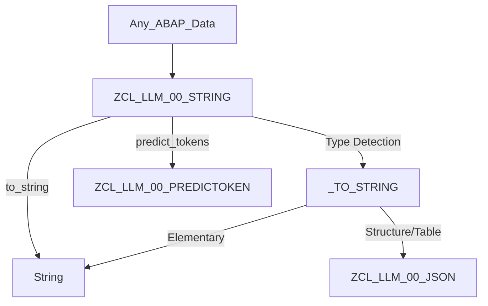
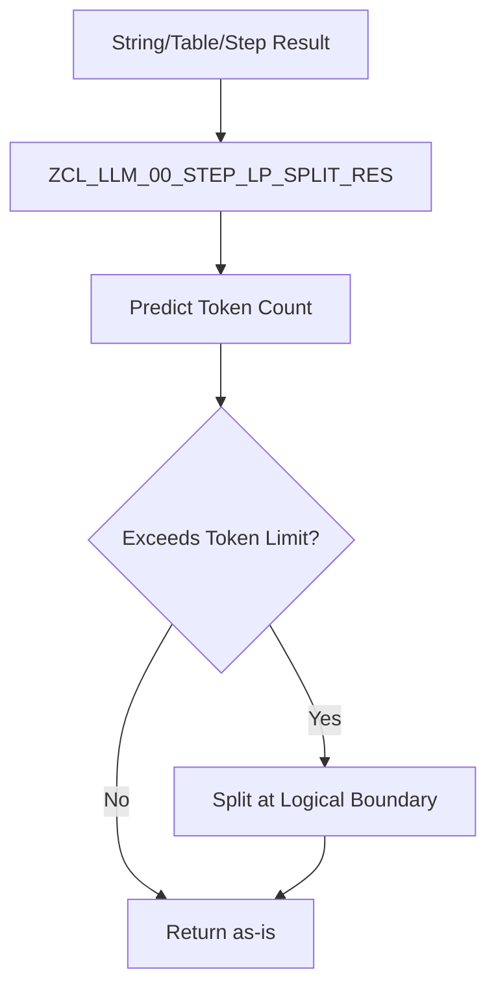
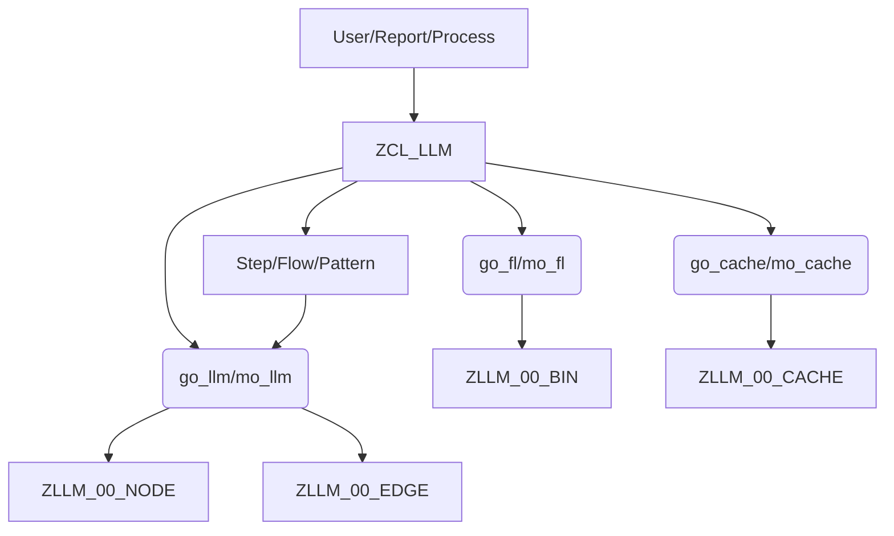
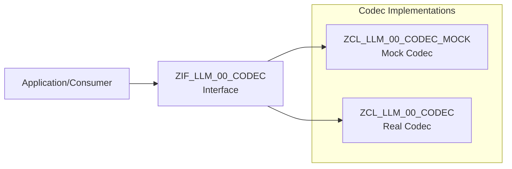

# METH Documentation

This file contains all unique METH documentation files.
Total files: 87

---

## METH.ADJUST.DOCUMENT.MD

# ABAP Component Documentation: ZCL_LLM_00_SPL

## 1. Component Overview

- **Type**: ABAP Class (`ZCL_LLM_00_SPL`)
- **Technical Category**: SAP GUI Control Utility – Dynamic Splitter Container Management
- **System Role**: UI infrastructure/helper class for dynamic layout management in SAP GUI applications, especially for advanced or flexible screen splitting.

### Location & Namespace

- **Namespace**: Z (custom development)
- **Package**: `$ZLLM_00` (Lightweight LLM Module, see [Related Components](#5-additional-information))

### Component Role

This class provides a programmable interface for splitting SAP GUI containers into complex, multi-pane layouts. It abstracts the creation and management of `CL_GUI_SPLITTER_CONTAINER` objects, allowing for dynamic, code-driven UI layouts (e.g., dashboards, editors, or analytic workbenches).

---

## 2. Technical Analysis

### 2.1 Core Functionality

**ZCL_LLM_00_SPL** is a utility class for dynamically splitting a GUI container into various layouts using SAP's `CL_GUI_SPLITTER_CONTAINER`. It supports:

- Horizontal and vertical splits (2-way, 3-way, NxM, etc.)
- Complex grid layouts (e.g., 2x2, 3x3, 5x4)
- Flexible splitting based on input parameters (including thresholds and orientation)
- Hierarchical/recursive splitting (splits within splits)
- Tracking of parent-child relationships between split panes
- Retrieval of "leaf" containers (i.e., those without further splits)
- Head/tail navigation for split nodes

**Key Use Cases:**
- Building advanced SAP GUI screens with dynamic, multi-pane layouts
- Supporting editors, dashboards, or LLM-driven UI components that require flexible screen partitioning

### 2.2 Technical Architecture

#### Interfaces

- **Public Methods**:
  - `NEW`: Factory method to instantiate the splitter manager
  - `SPLIT`: Main entry point for splitting logic, parses a string "pattern" to determine split layout
  - `SPLIT_H`, `SPLIT_V`, `SPLIT_1X3`, `SPLIT_2X2`, `SPLIT_3X3`, `SPLIT_5X4`, etc.: Various split strategies
  - `SPLIT_H_N`, `SPLIT_V_N`: N-way horizontal/vertical splits
  - `SPLIT_H_THIRD`, `SPLIT_V_THIRD`: Two-way splits with custom size ratios
  - `SPLIT_FLEX_INTO`: Flexible NxM splitting with threshold logic
  - `GET_LEAFS`, `GET_NODES`: Retrieve leaf or non-leaf split containers
  - `HEAD`, `TAIL`: Navigation helpers
  - `HEAD_SPLITTER`: Get the top-level splitter container

#### Dependencies

- **SAP GUI Classes**:
  - `CL_GUI_CONTAINER`
  - `CL_GUI_SPLITTER_CONTAINER`
- **Related Z-Classes**:
  - `ZCL_CPU` (used for error handling, e.g., `zcl_cpu=>ok( )`)
- **Data Model**:
  - Internal tables for split nodes and split containers

#### Data Flow

- The class maintains internal tables (`MT_`, `MT_SPLIT`) to track split nodes and their relationships.
- Each split operation creates new containers and updates the internal state.
- The split pattern string is parsed character by character to determine the split sequence and type.

### 2.3 Implementation Details

#### Design Patterns

- **Factory Pattern**: `NEW` method for instantiation
- **Composite/Tree Structure**: Each split node can have children, forming a tree of containers
- **Command/Interpreter Pattern**: The `SPLIT` method interprets a string pattern to execute a sequence of split commands

#### Algorithm Highlights

- **Pattern Parsing**: The `SPLIT` method parses a string (e.g., "-|=+@") where each character triggers a specific split (horizontal, vertical, 1x3, 2x2, etc.).
- **Flexible Splitting**: `SPLIT_FLEX_INTO` dynamically determines the best NxM split based on a threshold, distributing panes as evenly as possible.
- **Parent/Child Tracking**: Each split node records its parent, enabling navigation and hierarchical operations.
- **Leaf/Node Identification**: Methods to distinguish between containers with and without children, supporting recursive UI operations.

#### Error Handling

- Minimal explicit error handling; some methods check for empty tables or invalid references.
- Uses `zcl_cpu=>ok( )` as a generic error handler in splitter configuration (likely a custom utility for logging or error notification).

#### Performance Considerations

- Designed for interactive GUI use; performance is generally not a bottleneck unless creating very large split hierarchies.
- Internal tables are used for fast in-memory tracking of split nodes.

#### Security Implications

- No direct security risks; operates entirely within the SAP GUI client context.
- Does not handle user data, authorization, or backend operations.

---

## 3. Business Context

### 3.1 Business Purpose

This class is a technical utility, not directly tied to a business process. Its purpose is to enable advanced, flexible UI layouts in SAP GUI applications, which can be leveraged by business-facing tools such as:

- Code editors or viewers (e.g., for LLM/code intelligence modules)
- Analytical dashboards
- Custom cockpit screens
- Any application requiring dynamic, multi-pane layouts

### 3.2 Process Integration

- Used as a helper by higher-level components that need to construct complex SAP GUI screens.
- Likely invoked by other Z-classes in the `$ZLLM_00` package, especially those dealing with LLM-driven UI or code analysis tools.

### 3.3 Operational Impact

- Enhances user experience by enabling more sophisticated screen layouts.
- Indirectly supports business operations by making advanced tools (e.g., code analysis, dashboards) more usable and visually organized.

---

## 4. Support & Maintenance

### 4.1 Configuration

- No external configuration required.
- Default parent container is `cl_gui_container=>default_screen` if not specified.

### 4.2 Monitoring

- No runtime monitoring hooks; issues will manifest as UI errors or missing panes.
- For debugging, check the split pattern string and ensure parent containers are valid.

### 4.3 Common Issues

- **Invalid Split Patterns**: Supplying an unrecognized pattern character will be ignored or may cause unexpected layouts.
- **Container Reference Errors**: If parent containers are destroyed or not properly managed, split panes may not render.
- **SAP GUI Limitations**: Excessive nesting or too many panes may hit SAP GUI resource limits.

---

## 5. Additional Information

- **Author**: Not specified
- **Last Updated**: Not specified
- **Version**: Not specified

### Related Components

- **$ZLLM_00 Package**: This class is part of a broader set of utilities supporting lightweight LLM (Large Language Model) modules in SAP, including code analysis, dependency mapping, and advanced UI helpers.
- **Data Model**: See [Related Section](#) for the full data model and other utility classes.
- **Usage**: Referenced by other Z-classes in the package for building dynamic GUIs.

---

### Example Usage

```abap
DATA(lo_split) = zcl_llm_00_spl=>new( io_ = my_container ).
DATA(lt_panes) = lo_split->split( '-|=' ). " Horizontal, then vertical, then 1x3 split
LOOP AT lt_panes INTO DATA(ls_pane).
  " Use ls_pane-gui as a parent for further controls
ENDLOOP.
```

---

### Summary Table of Split Patterns

| Pattern Char | Split Type         | Description                       |
|--------------|-------------------|-----------------------------------|
| `-`          | Horizontal        | 2 rows, 1 column                  |
| `|`          | Vertical          | 1 row, 2 columns                  |
| `=`          | 1x3               | 3 rows, 1 column                  |
| `+`          | 2x2               | 2 rows, 2 columns                 |
| `#`          | 3x3               | 3 rows, 3 columns                 |
| `@`          | 5x4               | 5 rows, 4 columns                 |
| `^`          | Horizontal Third  | 2 rows, 1 column, custom height   |
| `%`          | Vertical Third    | 1 row, 2 columns, custom width    |
| `_`          | Horizontal Third  | 2 rows, 1 column, 67%/33% split   |
| `!`          | Vertical Third    | 1 row, 2 columns, 33%/67% split   |
| `1-9`        | N-way Split       | Horizontal or vertical, N panes   |
| `H`/`T`      | Head/Tail         | Navigation in split sequence      |

---

### Security Considerations

- No sensitive data handled.
- No backend or database operations.
- Only manipulates SAP GUI containers.

---

### Testing Recommendations

- Test with various split patterns and parent containers.
- Validate correct rendering of all panes.
- Test edge cases (e.g., excessive splits, invalid patterns).

---

### References

- [SAP Help: CL_GUI_SPLITTER_CONTAINER](https://help.sap.com/doc/abapdocu_750_index_htm/7.50/en-US/abencl_gui_splitter_container.htm)
- [Related ZLLM_00 Data Model Analysis](#)

---

**In summary:**  
`ZCL_LLM_00_SPL` is a robust, reusable utility for dynamic SAP GUI layout management, essential for advanced custom applications requiring flexible, multi-pane user interfaces. It is a foundational building block in the `$ZLLM_00` package, supporting LLM-driven and analytical SAP GUI tools.

---

## METH.ANSWER.DOCUMENT.MD

# ABAP Component Documentation: ZCL_LLM_00_EMBEDDING

## 1. Component Overview

- **Type**: ABAP Class (`ZCL_LLM_00_EMBEDDING`)
- **Technical Category**: AI/ML Integration, Text Embedding, Vector Database Operations
- **System Role**: Service/utility class for embedding text, generating answers, and integrating with vector databases and LLM (Large Language Model) APIs

### Location & Namespace

- **Namespace**: Z (custom, customer namespace)
- **Package**: `$ZLLM_00` (Lightweight LLM Module, see [Related Components](#5-additional-information))

### Component Role in System Architecture

- Provides a bridge between SAP ABAP and external LLM/embedding services (e.g., Azure OpenAI)
- Handles embedding of text, answer generation, and storage/retrieval of vector representations
- Integrates with vector database library (`ZCL_VDB_002_LIB`) for storing and managing embeddings

---

## 2. Technical Analysis

### 2.1 Core Functionality

`ZCL_LLM_00_EMBEDDING` encapsulates the logic for:

- **Text Embedding**: Converts input text into vector representations using an external LLM embedding service.
- **Answer Generation**: Generates prototype answers to questions using LLM chat completion APIs.
- **RAG (Retrieval-Augmented Generation)**: Constructs prompts from a set of vectors and queries the LLM for context-aware answers.
- **Persistence**: Saves generated embeddings and answers into a vector database for later retrieval and similarity search.

#### Main Methods

- `NEW`: Factory method to instantiate the class with a given vector database ID.
- `ANSWER`: Generates a sample answer to a question and embeds the result.
- `RAG`: Performs retrieval-augmented generation using a set of vectors as context.
- `ANSWER_AND_SAVE`: Generates an answer, embeds it, and saves the result in the vector database.
- `EMBED`: Embeds a given string and returns the quantized vector.
- `EMBED_AND_SAVE`: Embeds a string and saves the vector in the database.

### 2.2 Technical Architecture

#### Interfaces

- **External LLM/Embedding Service**: Communicates with an LLM API (e.g., Azure OpenAI) via SDKs or HTTP.
- **Vector Database Library**: Uses `ZCL_VDB_002_LIB` for vector creation, quantization, and persistence.
- **Environment Configuration**: Reads API keys, URLs, and deployment IDs from environment variables via `ZCL_LLM_00_DOTENV`.

#### Dependencies

- `ZCL_LLM_00_DOTENV`: Loads environment variables for API configuration.
- `ZCL_VDB_002_LIB`: Handles vector operations and persistence.
- `ZCL_LLM_00_SDK_LITE`: Lightweight SDK for LLM/embedding API calls.
- (Commented/Legacy) `ZIF_PENG_AZOAI_SDK`: Full-featured Azure OpenAI SDK (not used in current implementation).

#### Data Flow

1. **Initialization**: Loads environment and vector DB context.
2. **Embedding/Answer Generation**: Calls LLM/embedding API via SDK.
3. **Vector Creation**: Quantizes and stores embeddings using vector DB library.
4. **RAG**: Aggregates context vectors, constructs prompt, queries LLM, and returns answer.

### 2.3 Implementation Details

- **Design Patterns**: Factory method (`NEW`), Dependency Injection (via constructor), Separation of Concerns.
- **Error Handling**: Try-catch blocks for SDK/API exceptions (commented in current code).
- **Persistence**: Uses vector DB library to create and save vectors.
- **API Communication**: Uses a lightweight SDK for LLM/embedding API calls; legacy code for full SDK is commented out.
- **Prompt Engineering**: RAG method constructs prompts with context and question demarcation.

---

## 3. Business Context

### 3.1 Business Purpose

- **Knowledge Management**: Enables SAP systems to embed and store textual information as vectors for semantic search and retrieval.
- **AI-Driven Automation**: Supports use cases like FAQ answering, document similarity, and context-aware assistance.
- **Retrieval-Augmented Generation**: Enhances LLM responses with enterprise-specific context, improving accuracy and relevance.

### 3.2 Process Integration

- **Integration Points**: Can be invoked from ABAP reports, workflows, or UI components needing AI-powered text processing.
- **Typical Scenarios**:
  - Embedding business documents for semantic search.
  - Generating prototype answers for user queries.
  - Augmenting LLM responses with enterprise data.

### 3.3 Operational Impact

- **Improved Search & Retrieval**: Enables advanced search capabilities based on meaning, not just keywords.
- **AI Enablement**: Bridges SAP with modern AI/LLM services, unlocking new automation and intelligence scenarios.
- **Data Enrichment**: Facilitates the creation of knowledge graphs and context-aware business processes.

---

## 4. Support & Maintenance

### 4.1 Configuration

- **Environment Variables**: Requires correct setup of API keys, URLs, deployment IDs in environment (via `ZCL_LLM_00_DOTENV`).
- **Vector DB Setup**: Underlying vector database must be available and configured.

### 4.2 Monitoring

- **API Usage**: Monitor LLM/embedding API usage and quotas.
- **Error Logs**: Check for exceptions in API calls (currently, error handling is minimal in active code).
- **Vector DB Health**: Ensure vector database is operational and not exceeding storage limits.

### 4.3 Common Issues

- **API Credentials**: Incorrect or missing API keys will cause failures in embedding/answer generation.
- **Quota Limits**: Exceeding LLM/embedding API quotas will result in errors.
- **Vector DB Errors**: Issues with vector creation or saving may indicate DB misconfiguration.

---

## 5. Additional Information

- **Author**: _Not specified in code_
- **Last Updated**: _Not specified in code_
- **Version**: _Not specified in code_

### Related Components

- **ZCL_LLM_00_DOTENV**: Loads environment variables for API configuration.
- **ZCL_VDB_002_LIB**: Vector database library for storing and managing embeddings.
- **ZCL_LLM_00_SDK_LITE**: Lightweight SDK for LLM/embedding API calls.
- **ZLLM_00* Tables**: Underlying data model for graph-based code intelligence and analytics (see [Related Data Model Analysis](#related-components)).
- **$ZLLM_00 Package**: Modular package for lightweight LLM integration in SAP.

---

### References

- [Related Data Model Analysis](#related-components): For details on the underlying tables and their roles in the LLM module.
- [Class ZCL_LLM_00_DOTENV](#): For environment variable management.
- [Class ZCL_VDB_002_LIB](#): For vector operations and persistence.

---

## Summary Table

| Method             | Purpose                                                      |
|--------------------|-------------------------------------------------------------|
| `NEW`              | Factory method, creates instance with vector DB context     |
| `ANSWER`           | Generates and embeds a prototype answer to a question       |
| `RAG`              | Retrieval-augmented generation using context vectors        |
| `ANSWER_AND_SAVE`  | Generates, embeds, and saves answer in vector DB            |
| `EMBED`            | Embeds input string, returns quantized vector               |
| `EMBED_AND_SAVE`   | Embeds and saves input string in vector DB                  |

---

## Security Considerations

- **API Key Protection**: Ensure API keys are securely stored and not exposed in logs or UI.
- **Data Privacy**: Be cautious with sensitive data sent to external LLM/embedding services.
- **Access Control**: Restrict usage of embedding/answer generation to authorized users/processes.

---

## Example Usage

```abap
DATA(lo_embed) = zcl_llm_00_embedding=>new( iv_ = <vector_db_id> ).
DATA(lv_vector) = lo_embed->embed( iv_ = 'Sample text to embed' ).
DATA(lv_answer) = lo_embed->answer( iv_ = 'What is SAP?' IMPORTING ev_ = DATA(lv_text) ).
```

---

## Traceability

- **Dependencies**: Propagated from related components (dotenv, vector DB, SDK).
- **Data Model**: Relies on ZLLM_00* tables for graph-based analytics and storage.

---

_This documentation is based on the provided ABAP source code, related component analysis, and standard documentation principles. For further details, refer to the source code and related class documentation._

---

## METH.APPEND.DOCUMENT.MD

# ABAP Component Documentation: ZCL_LLM_00_KV

## 1. Component Overview

- **Type**: ABAP Class (ZCL_LLM_00_KV)
- **Technical Category**: Utility / Data Structure / Serialization
- **System Role**: Lightweight key-value (KV) container with JSON serialization, used as a supporting structure for LLM (Large Language Model) integration and data interchange in the $ZLLM_00 package.

## 2. Technical Analysis

### 2.1 Core Functionality

ZCL_LLM_00_KV is a final, public ABAP class designed to encapsulate a simple key-value (KV) mapping, where both keys and values are strings. Its primary purpose is to provide a lightweight, in-memory, hash-based table structure for storing and manipulating KV pairs, with built-in support for JSON serialization via the ZIF_LLM_00_JSON interface.

Key features:
- **Creation**: Static factory method `NEW` allows instantiation with an optional initial KV table.
- **Appending**: Method `APPEND` adds a new KV pair if the key does not already exist.
- **Serialization**: Implements `TO_JSON` (via interface alias) to serialize the KV table to JSON using the central JSON utility class.
- **Immutability**: The class is designed to be used in a functional style—`APPEND` returns a new instance if a new key is added, otherwise returns the same instance.

### 2.2 Technical Architecture

- **Interfaces**:
  - Implements `ZIF_LLM_00_JSON`, providing a standard `TO_JSON` method for JSON serialization.
- **Dependencies**:
  - Relies on `ZCL_LLM_00_JSON` for JSON conversion.
  - Uses standard ABAP string types and hashed tables.
- **Data Flow**:
  - Internal data is stored in a hashed table (`MT_`) of structure (`TS_`) with fields `K` (key) and `V` (value).
  - Data can be appended and serialized to JSON for downstream processing or API integration.

### 2.3 Implementation Details

- **Data Structures**:
  - `TS_`: Structure with `K` (string key) and `V` (string value).
  - `TT_`: Hashed table of `TS_`, unique on `K`.
- **Methods**:
  - `NEW`: Static factory, returns a new instance with optional initial data.
  - `APPEND`: Adds a new KV pair if the key is not present; otherwise, does nothing.
  - `TO_JSON`: Serializes the internal table to JSON.
- **Design Patterns**:
  - Factory method for instantiation.
  - Functional/immutable style for append operations.
- **Error Handling**:
  - No explicit error handling; relies on ABAP table operations (e.g., `LINE_EXISTS`).
- **Performance**:
  - Uses hashed tables for O(1) key lookup and insertion.
- **Security**:
  - No direct security logic; assumes usage in trusted, internal contexts.

## 3. Business Context

### 3.1 Business Purpose

This class serves as a utility for managing key-value pairs, particularly in the context of LLM (Large Language Model) operations, such as parameter passing, configuration, or lightweight data interchange. It is especially useful for scenarios where data needs to be serialized to JSON for API calls (e.g., OpenAI, Azure OpenAI) or for storing model metadata.

### 3.2 Process Integration

- Used as a supporting structure in LLM-related processes, such as:
  - Preparing payloads for LLM API requests.
  - Storing and transferring configuration or result data between components.
  - Serializing/deserializing data for caching or persistence.
- Integrated with the broader $ZLLM_00 package, which provides graph-based code analysis, LLM orchestration, and related utilities.

### 3.3 Operational Impact

- Facilitates flexible, schema-less data exchange within the LLM module.
- Reduces boilerplate for JSON serialization of simple KV data.
- Supports extensibility and maintainability by standardizing KV handling.

## 4. Support & Maintenance

### 4.1 Configuration

- No explicit configuration required.
- Used as a utility; configuration is typically handled at higher levels (e.g., which KV pairs to store).

### 4.2 Monitoring

- No direct monitoring points; issues would surface in downstream consumers (e.g., if expected keys are missing).

### 4.3 Common Issues

- **Duplicate Keys**: Attempting to append a key that already exists is silently ignored (no overwrite).
- **Serialization**: Relies on `ZCL_LLM_00_JSON`; issues in JSON output may stem from that class.
- **Immutability**: Users must be aware that `APPEND` does not mutate the instance but returns a new one.

## 5. Additional Information

- **Author**: Not specified
- **Last Updated**: Not specified
- **Version**: Not specified

---

### Related Components and Integration

- **ZCL_LLM_00_JSON**: Used for JSON serialization.
- **$ZLLM_00 Package**: This class is part of a larger suite supporting LLM integration, graph-based code analysis, and AI-driven utilities in SAP.
- **LLM API Integration**: Likely used in preparing payloads for OpenAI/Azure OpenAI or similar services.

---

### Example Usage

```abap
DATA(lo_kv) = zcl_llm_00_kv=>new( ).
lo_kv = lo_kv->append( VALUE #( k = 'param1' v = 'value1' ) ).
DATA(json) = lo_kv->to_json( ).
```

---

### Security Considerations

- As a utility class, it does not handle authorization or sensitive data directly.
- Ensure that any sensitive information stored in KV pairs is handled appropriately at higher layers.

---

### Summary

ZCL_LLM_00_KV is a lightweight, efficient, and reusable utility for managing key-value pairs with built-in JSON serialization, supporting the flexible data interchange needs of LLM and AI-driven modules within SAP. Its design emphasizes simplicity, performance, and integration with modern API-driven workflows.

---

## METH.BLOCK_CODE.DOCUMENT.MD

# ABAP Component Documentation: ZCL_LLM_00_MARKDOWN

## 1. Component Overview

- **Type**: ABAP Class (`ZCL_LLM_00_MARKDOWN`)
- **Namespace and Location**: `$ZLLM_00` package (Lightweight LLM Module)
- **Component Role**: Markdown-to-HTML parser and renderer for ABAP systems
- **Technical Category**: Utility/Parsing, Text Processing, UI Support

## 2. Technical Analysis

### 2.1 Core Functionality

`ZCL_LLM_00_MARKDOWN` is a comprehensive ABAP class that parses Markdown-formatted text and converts it into HTML markup. It implements a full Markdown parser, supporting block-level and inline-level elements, including:

- Headers, lists, code blocks, blockquotes, tables, horizontal rules, and paragraphs
- Inline elements: emphasis, strong, code, links, images, strikethrough, special characters, and HTML markup
- Safe mode and URL whitelisting for security
- Customizable options for line breaks, markup escaping, and URL linking

The class is designed to be used as a utility for rendering Markdown content in ABAP-based applications, such as documentation viewers, wikis, or user-generated content platforms.

### 2.2 Technical Architecture

#### Interfaces

- **lif_value_type**: Used for value-type polymorphism in supporting classes (`lcl_string`, `lcl_string_array`, `lcl_hashmap`).

#### Supporting Classes

- **lcl_string**: Simple string wrapper implementing `lif_value_type`.
- **lcl_string_array**: Array of strings with append, delete, and find operations.
- **lcl_hashmap**: Hashmap with string keys and polymorphic value types, supporting recursive/compound types (e.g., nested hashmaps).

#### Data Structures

- Deeply nested types for representing HTML elements, attributes, blocks, lines, inlines, etc.
- Hashmaps and arrays for block/inline type dispatch, special character lists, regex patterns, and whitelists.

#### Dependencies

- No external database or RFC dependencies.
- Uses ABAP standard classes for type description (`cl_abap_typedescr`, `cl_abap_objectdescr`).
- Relies on ABAP regex and string processing.

#### Data Flow

1. **Input**: Markdown text (string)
2. **Processing**:
   - Standardizes line breaks, trims, and splits into lines
   - Iterates through lines, identifies block types, and parses accordingly
   - Handles inline elements within blocks
   - Assembles HTML markup from parsed elements
3. **Output**: HTML markup (string)

#### Error Handling

- Uses ABAP `CHECK` and `RETURN` for flow control.
- Raises custom exception (`not_found`) in `match_marked_string` for regex failures.
- Defensive programming for type casting and structure assignments.

#### Performance Considerations

- In-memory processing; suitable for moderate-sized Markdown documents.
- Uses hashed tables and arrays for efficient lookups and dispatch.
- No persistent storage or database interaction.

#### Security Implications

- **Safe Mode**: Option to sanitize HTML elements and attributes, removing unsafe or event-handler attributes.
- **URL Whitelisting**: Only allows certain URL schemes in links and images.
- **Markup Escaping**: Option to escape HTML markup to prevent injection.

### 2.3 Implementation Details

#### Design Patterns

- **Template/Strategy**: Uses hashmaps to map block/inline markers to handler methods.
- **Polymorphism**: Via `lif_value_type` interface for value containers.
- **Reflection**: Uses `cl_abap_objectdescr` to dynamically collect method names for dispatch.

#### Key Algorithms

- **Block Parsing**: Iterates lines, determines block type via marker and regex, and delegates to handler methods.
- **Inline Parsing**: Scans for inline markers, dispatches to handler methods, and recursively processes nested inlines.
- **Magic Move**: Recursively copies data between structures of different types, supporting flexible data movement.
- **Regex-based Extraction**: Heavy use of ABAP regex for parsing Markdown syntax.

#### Configuration

- Options for line breaks, markup escaping, URL linking, and safe mode are set via setter methods.

#### Extensibility

- New block or inline types can be added by extending the hashmaps and implementing corresponding handler methods.

## 3. Business Context

### 3.1 Business Purpose

Enables ABAP-based applications to render Markdown content as HTML, supporting:

- User-generated content (comments, documentation, wikis)
- Developer documentation and code annotation
- Integration with LLM/AI modules for code intelligence and documentation generation

### 3.2 Process Integration

- Can be called from UI components, workflow steps, or background jobs that need to display or process Markdown content.
- Supports integration with documentation and analytics modules in the `$ZLLM_00` package.

### 3.3 Operational Impact

- Improves user experience by allowing rich text formatting in ABAP applications.
- Reduces need for external Markdown processing tools.
- Enhances maintainability and readability of documentation within SAP systems.

## 4. Support & Maintenance

### 4.1 Configuration

- No external configuration required.
- Options for safe mode, line breaks, markup escaping, and URL linking can be set via class methods.

### 4.2 Monitoring

- No persistent state; no monitoring required.
- Performance can be profiled if used with very large documents.

### 4.3 Common Issues

- **Malformed Markdown**: May result in unexpected HTML; ensure input is well-formed.
- **Security**: If safe mode is not enabled, raw HTML in Markdown may be rendered; enable safe mode for untrusted input.
- **Performance**: For extremely large documents, consider chunking or background processing.

## 5. Additional Information

- **Author**: Not specified in code
- **Last Updated**: Not specified in code
- **Version**: 1.1.0 (as per class constant)
- **Related Components**: 
  - `$ZLLM_00` package (Lightweight LLM Module)
  - Supporting classes: `lcl_string`, `lcl_string_array`, `lcl_hashmap`
- **References**:
  - Markdown specification: https://daringfireball.net/projects/markdown/
  - SAP ABAP documentation for regex and string processing

---

## Code Example

```abap
DATA(lo_markdown) = zcl_llm_00_markdown=>new( ).
DATA(lv_html) = lo_markdown->text( |# Hello World!| ).
" lv_html now contains: <h1>Hello World!</h1>
```

---

## Summary Table

| Feature                | Supported | Notes                                  |
|------------------------|-----------|----------------------------------------|
| Headers                | Yes       | ATX and Setext style                   |
| Lists                  | Yes       | Ordered and unordered                  |
| Code Blocks            | Yes       | Indented and fenced                    |
| Blockquotes            | Yes       |                                        |
| Tables                 | Yes       | GitHub-style                           |
| Inline Formatting      | Yes       | Emphasis, strong, code, links, images  |
| Strikethrough          | Yes       | Tilde syntax                           |
| HTML Markup            | Yes       | With safe mode option                  |
| URL Whitelisting       | Yes       | Configurable schemes                   |
| Markup Escaping        | Yes       | Optional                               |
| Line Breaks            | Yes       | Configurable                           |

---

## Security Recommendations

- **Enable Safe Mode** for any user-generated or untrusted Markdown input.
- **Whitelist URL Schemes** to prevent XSS via links or images.
- **Escape Markup** if displaying raw Markdown content.

---

## Related Data Model

This class is part of the `$ZLLM_00` package, which supports lightweight LLM modules and code intelligence features. It is likely used in conjunction with graph-based code analysis, documentation, and analytics tools within the same package.

---

## Maintenance Notes

- To add new Markdown features, extend the block/inline handler hashmaps and implement corresponding methods.
- For bug fixes, focus on regex patterns and handler logic.
- Ensure ABAP version compatibility, especially for regex and string operations.

---

## Traceability

- **Upstream**: Any ABAP application or module requiring Markdown rendering.
- **Downstream**: HTML output for UI rendering, documentation, or further processing.

---

## Version History

- **1.1.0**: Current version as per class constant.

---

# End of Documentation

---

## METH.CLASS_CONSTRUCTOR.DOCUMENT.MD

# ABAP Component Documentation: ZCL_LLM_00_SPL

## 1. Component Overview

- **Type**: ABAP Class (`ZCL_LLM_00_SPL`)
- **Technical Category**: SAP GUI Control Utility (UI Container Management)
- **System Role**: Utility/helper class for dynamic GUI layout management, specifically for splitting SAP GUI containers into flexible layouts

### Location & Namespace

- **Namespace**: Z (custom development)
- **Package**: $ZLLM_00 (Lightweight LLM Module, as per related documentation)
- **Visibility**: Public (CREATE PUBLIC)

### Component Role in System Architecture

- Provides a programmable interface to split SAP GUI containers into various layouts (horizontal, vertical, grid, etc.)
- Used as a utility within the $ZLLM_00 package, likely supporting advanced UI scenarios for LLM/code analysis tools or similar analytical applications

---

## 2. Technical Analysis

### 2.1 Core Functionality

**ZCL_LLM_00_SPL** is a utility class designed to facilitate the dynamic splitting of SAP GUI containers (`CL_GUI_CONTAINER`) into various sub-containers using the `CL_GUI_SPLITTER_CONTAINER` control. It supports a wide range of split patterns, including:

- Horizontal and vertical splits
- N-way splits (arbitrary number of rows/columns)
- Predefined grid layouts (2x2, 3x3, 5x4, etc.)
- Flexible splitting based on thresholds and orientation
- Custom split patterns via a symbolic string notation

The class maintains internal tables to track created containers and their relationships, enabling hierarchical and recursive splits.

#### Key Use Cases

- Building complex, dynamic SAP GUI layouts at runtime
- Supporting analytical or code intelligence tools that require flexible UI partitioning
- Enabling rapid prototyping of multi-pane SAP GUI applications

### 2.2 Technical Architecture

#### Interfaces

- **Public Methods**:
  - `NEW`: Factory method to instantiate the splitter manager
  - `SPLIT`: Main entry point for splitting using symbolic notation
  - `SPLIT_FLEX_INTO`, `SPLIT_H_INTO`, `SPLIT_V_INTO`: Split into N parts, flexibly or by orientation
  - `GET_LEAFS`, `GET_NODES`: Retrieve leaf or parent nodes of the split tree
  - `HEAD_SPLITTER`: Get the top-level splitter container

- **Protected/Private Methods**:
  - Various helpers for specific split patterns (e.g., `SPLIT_1X3`, `SPLIT_2X2`, `SPLIT_3X3`, etc.)
  - Adjustment and navigation utilities (`ADJUST`, `HEAD`, `TAIL`)

#### Data Structures

- **TS_PARENT**: Structure for parent container reference
- **TS_**: Structure for a split node (id, GUI ref, parent, has_children)
- **TT_**: Table of TS_ (split nodes)
- **TS_SPLIT**: Structure for splitter container reference
- **TT_SPLIT**: Table of TS_SPLIT

#### Dependencies

- **SAP GUI Controls**: Uses `CL_GUI_CONTAINER` and `CL_GUI_SPLITTER_CONTAINER`
- **No direct DB operations**: Purely UI logic
- **Related LLM/analytical modules**: As per package context

#### Data Flow

- The class maintains internal tables (`MT_`, `MT_SPLIT`) to track the split nodes and splitter containers.
- Each split operation creates new containers, updates the split tree, and maintains parent-child relationships for navigation and further splitting.

### 2.3 Implementation Details

#### Symbolic Split Notation

- The `SPLIT` method interprets a symbolic string (e.g., `-|=+@`) to perform a sequence of splits:
  - `-` = horizontal split
  - `|` = vertical split
  - `=` = 1x3 split
  - `+` = 2x2 split
  - `#` = 3x3 split
  - `@` = 5x4 split
  - `!`, `"`, `^`, `_`, `%`, `~` = special splits (thirds, percentages, etc.)
  - Digits = N-way splits
  - `H`, `T` = head/tail navigation in the split tree

#### Split Methods

- Each split method (`SPLIT_H`, `SPLIT_V`, etc.) creates a new `CL_GUI_SPLITTER_CONTAINER` with the specified number of rows/columns, then retrieves and stores references to the resulting sub-containers.
- The `ADJUST` method updates parent/child relationships and marks nodes with children.
- The `GET_LEAFS` and `GET_NODES` methods filter the split tree for leaf or parent nodes.

#### Flexibility

- The `SPLIT_FLEX_INTO` method allows for flexible splitting based on a threshold and orientation, automatically determining the optimal grid layout for a given number of splits.

#### Error Handling

- Minimal explicit error handling; relies on SAP GUI control exceptions and optional references.
- If a splitter/container cannot be created or found, the method returns gracefully.

#### Performance Considerations

- All operations are in-memory and UI-bound; performance is generally not a concern unless creating extremely large split trees.
- No database or network operations.

#### Security Implications

- No direct security implications; operates within the SAP GUI session context.
- Does not handle sensitive data or perform authorization checks.

---

## 3. Business Context

### 3.1 Business Purpose

- **Primary Objective**: Enable dynamic, programmable SAP GUI layouts for advanced analytical or code intelligence tools.
- **Significance**: Supports the rapid development of complex UI scenarios, such as dashboards, code viewers, or multi-pane editors, especially in the context of LLM/code analysis modules.

### 3.2 Process Integration

- Used as a utility/helper within larger analytical or LLM-driven applications.
- Not directly tied to business processes, but enables the UI layer for tools that may support code review, dependency analysis, or AI-assisted development.

### 3.3 Operational Impact

- **User Experience**: Allows end-users (typically developers or analysts) to interact with sophisticated, multi-pane SAP GUI applications.
- **Development Agility**: Reduces the effort required to build and modify complex UI layouts.

---

## 4. Support & Maintenance

### 4.1 Configuration

- No external configuration required.
- The class is self-contained and operates based on method parameters.

### 4.2 Monitoring

- No runtime monitoring required; issues will manifest as UI errors or missing containers.
- For troubleshooting, ensure that the parent containers are valid and that the SAP GUI session is active.

### 4.3 Common Issues

- **GUI Control Exceptions**: If the parent container is invalid or destroyed, split operations will fail.
- **Resource Limits**: Excessive splitting may exhaust GUI resources or result in unusable layouts.
- **Incorrect Symbolic Notation**: Invalid or unsupported symbols in the split string will be ignored or may result in unexpected layouts.

---

## 5. Additional Information

- **Author**: Not specified
- **Last Updated**: Not specified
- **Version**: Not specified

---

### Code Example: Basic Usage

```abap
DATA(lo_split) = zcl_llm_00_spl=>new( io_ = cl_gui_container=>default_screen ).
DATA(lt_nodes) = lo_split->split( '-|=' ). " Horizontal, then vertical, then 1x3 split
LOOP AT lt_nodes INTO DATA(ls_node).
  " Use ls_node-gui as a container for further controls
ENDLOOP.
```

---

### Related Components

- **CL_GUI_CONTAINER**, **CL_GUI_SPLITTER_CONTAINER**: SAP standard GUI controls used for container management.
- **$ZLLM_00 Package**: Analytical/LLM module context; this class is a utility within this package.
- **Other UI Utility Classes**: May be used in conjunction with other layout or control helpers.

---

### Summary Table: Key Methods

| Method             | Purpose                                                      |
|--------------------|-------------------------------------------------------------|
| NEW                | Factory method, creates a splitter manager instance         |
| SPLIT              | Main split method, interprets symbolic split notation       |
| SPLIT_H, SPLIT_V   | Horizontal/vertical split                                   |
| SPLIT_1X3, SPLIT_2X2, SPLIT_3X3, SPLIT_5X4 | Predefined grid splits             |
| SPLIT_H_N, SPLIT_V_N | N-way horizontal/vertical splits                          |
| SPLIT_FLEX_INTO    | Flexible grid split based on threshold/orientation          |
| GET_LEAFS, GET_NODES | Retrieve leaf/parent nodes of the split tree              |
| HEAD, TAIL         | Navigation in the split tree                                |
| ADJUST             | Update parent/child relationships after split               |
| HEAD_SPLITTER      | Get the top-level splitter container                        |

---

### Design Patterns Used

- **Factory Pattern**: `NEW` method for instantiation
- **Composite/Tree Structure**: Internal tracking of split nodes and parent/child relationships
- **Interpreter Pattern**: Symbolic split string parsing in `SPLIT` method

---

### Security Considerations

- No sensitive data handled
- No authorization checks required
- Operates within the SAP GUI session context

---

### Maintenance Notes

- Ensure compatibility with SAP GUI versions and `CL_GUI_SPLITTER_CONTAINER` features
- For custom layouts, extend symbolic notation or add new split methods as needed
- Test with various split patterns to ensure UI usability

---

**In summary:**  
`ZCL_LLM_00_SPL` is a robust, flexible utility class for dynamic SAP GUI container splitting, enabling advanced UI layouts for analytical and LLM-driven applications. It abstracts the complexity of SAP GUI splitter management, allowing developers to rapidly compose multi-pane interfaces using simple symbolic notation or direct method calls.

---

## METH.COMMIT.DOCUMENT.MD

# ABAP Component Documentation: ZCL_LLM_00_FILE_LIST_BIN

## 1. Component Overview

- **Type**: ABAP Class (`ZCL_LLM_00_FILE_LIST_BIN`)
- **Technical Category**: Data Access / File Abstraction / BLOB Management
- **System Role**: Provides an object-oriented interface for managing lists of binary (BLOB) files stored in the temporary table `ZLLM_00_BIN` within the $ZLLM_00 package. It acts as a bridge between the database layer (BLOB storage) and higher-level LLM (Large Language Model) or code intelligence modules.

---

## 2. Technical Analysis

### 2.1 Core Functionality

`ZCL_LLM_00_FILE_LIST_BIN` encapsulates the logic for:
- Creating and managing lists of files stored as BLOBs in the `ZLLM_00_BIN` table.
- Filtering, retrieving, and saving files by name or mask.
- Providing a uniform interface (`ZIF_LLM_00_FILE_LIST`) for file list operations, such as filtering, getting by name, and saving.
- Supporting integration with codecs for encoding/decoding file content.

**Key Operations:**
- **new**: Instantiates a file list from a given binary key and file table.
- **new_from_bin**: Loads a file list from the database, filtered by binary key and file name mask, optionally using a codec for decoding.
- **filter**: Filters the in-memory file list by name or mask.
- **get / get_by_name**: Retrieves files or file references by name.
- **save**: Saves or updates a file in the database and updates the in-memory list.

### 2.2 Technical Architecture

- **Interfaces**:
  - Implements `ZIF_LLM_00_FILE_LIST` (standardizes file list operations).
- **Dependencies**:
  - **Database Table**: `ZLLM_00_BIN` (stores BLOBs/files).
  - **Class**: `ZCL_LLM_00_FILE_BIN` (represents a single file/BLOB).
  - **Class**: `ZCL_LLM_00_LIST` (for handling name masks and filtering).
  - **Class**: `ZCL_LLM_00_CODEC` (for encoding/decoding file content).
  - **Interface**: `ZIF_LLM_00_CODEC` (codec abstraction).
- **Data Flow**:
  - Reads from and writes to `ZLLM_00_BIN` using SELECT/MODIFY.
  - Maintains an internal table (`mt_`) of file objects for fast access and filtering.
  - Uses codecs for content transformation during save/load.

### 2.3 Implementation Details

- **Design Patterns**:
  - Factory methods (`new`, `new_from_bin`) for controlled instantiation.
  - Encapsulation of file list logic and database access.
  - Use of interfaces for abstraction and testability.
- **Database Interactions**:
  - `SELECT ... FROM zllm_00_bin` to load files by binary key and mask.
  - `MODIFY zllm_00_bin FROM ...` to save/update files.
- **Error Handling**:
  - `new_from_bin` can raise a resumable exception (`ZCX_S`).
- **Performance**:
  - In-memory filtering for fast repeated access.
  - Sorting of file lists by name for deterministic order.
- **Security**:
  - No explicit security checks; relies on SAP standard authorization for table access.
  - Codec usage may provide additional content validation or transformation.

---

## 3. Business Context

### 3.1 Business Purpose

This class supports the business need for managing and accessing binary artifacts (such as serialized models, code snapshots, or attachments) in analytical or AI-driven code intelligence scenarios. It abstracts the complexity of BLOB storage and provides a uniform interface for higher-level modules to interact with file lists.

### 3.2 Process Integration

- Used by LLM and code analysis modules to retrieve, filter, and persist binary files.
- Supports scenarios where files are batch-processed, analyzed, or served as part of AI workflows.
- Integrates with caching and auxiliary storage patterns for performance.

### 3.3 Operational Impact

- Enables efficient management of large numbers of binary files in analytical contexts.
- Supports maintainability and extensibility by abstracting file operations.
- Reduces redundant database access through in-memory caching and filtering.

---

## 4. Support & Maintenance

### 4.1 Configuration

- No explicit configuration required for the class itself.
- Relies on the structure and availability of the `ZLLM_00_BIN` table.
- Codec configuration may be relevant if custom encoding/decoding is needed.

### 4.2 Monitoring

- Monitor the growth and cleanup of `ZLLM_00_BIN` to avoid excessive storage usage.
- Track performance of SELECT/MODIFY operations, especially with large file lists.
- Ensure that codecs used for encoding/decoding are compatible with file consumers.

### 4.3 Common Issues

- **File Not Found**: If a requested file is not present in `ZLLM_00_BIN`, the class returns an empty or default object.
- **Encoding/Decoding Errors**: Incompatible codecs may cause failures during save/load.
- **Concurrency**: Simultaneous updates to the same file may lead to inconsistent in-memory and database states.
- **Authorization**: Users must have appropriate permissions to access and modify `ZLLM_00_BIN`.

---

## 5. Additional Information

- **Author**: Not specified
- **Last Updated**: Not specified
- **Version**: Not specified

---

### Related Components and Data Model

- **ZLLM_00_BIN**: Central BLOB storage table for binary files.
- **ZCL_LLM_00_FILE_BIN**: Represents a single file/BLOB.
- **ZCL_LLM_00_LIST**: Used for name mask filtering.
- **ZCL_LLM_00_CODEC**: Handles encoding/decoding of file content.
- **ZIF_LLM_00_FILE_LIST**: Interface for file list operations.

#### Data Model Context

This class is part of the $ZLLM_00 package, which implements a graph-based analytical subsystem for code intelligence, dependency mapping, and AI/LLM-driven analysis. `ZCL_LLM_00_FILE_LIST_BIN` specifically manages the file list abstraction for binary artifacts, supporting extensibility and maintainability in analytical workflows.

---

### Example Usage

```abap
" Load a list of files from a given binary key and mask
DATA(lo_file_list) = zcl_llm_00_file_list_bin=>new_from_bin(
  iv_bin  = 'MODEL_BIN'
  iv_mask = '*.MODEL'
).

" Get a file by name
DATA(lo_file) = lo_file_list->get_by_name( 'MYMODEL.MODEL' ).

" Save a new or updated file
lo_file_list->save( io_ = lo_file ).
```

---

### Security Considerations

- Ensure that only authorized users can access or modify files in `ZLLM_00_BIN`.
- Validate file content and encoding to prevent injection or corruption.
- Consider implementing additional logging or auditing for file operations if used in production.

---

### Traceability

- This class is referenced by higher-level LLM and code analysis modules for file management.
- It is tightly coupled with the `ZLLM_00_BIN` table and related file abstraction classes.
- Changes to the data model or codec logic may impact this class's behavior.

---

**Summary**:  
`ZCL_LLM_00_FILE_LIST_BIN` is a key technical component for managing lists of binary files in the $ZLLM_00 analytical subsystem. It provides robust, extensible, and efficient access to BLOB storage, supporting advanced code intelligence and AI-driven workflows in SAP environments.

---

## METH.CONSTRUCTOR.DOCUMENT.MD

# ABAP Component Documentation: ZCL_LLM_00_STRING

## 1. Component Overview

- **Type**: ABAP Class (`ZCL_LLM_00_STRING`)
- **Technical Category**: Utility / Data Conversion / String Handling
- **System Role**: Core utility class in the $ZLLM_00 package, supporting the Lightweight LLM Module for SAP. Provides a universal "any-to-string" conversion and string-related operations, especially for LLM (Large Language Model) integration.

---

## 2. Technical Analysis

### 2.1 Core Functionality

**ZCL_LLM_00_STRING** is a utility class designed to convert any ABAP data type (elementary, structure, table, reference, or even custom objects) into a string representation. It is a foundational component for the $ZLLM_00 LLM module, enabling flexible serialization and tokenization of ABAP data for AI/LLM processing.

**Key Features:**
- Accepts any ABAP data type and converts it to a string.
- Handles complex types (structures, tables) by serializing them to JSON.
- Integrates with LLM token prediction logic (via ZCL_LLM_00_PREDICTOKEN).
- Supports caching of token counts for performance.
- Provides multiple constructors for different input types (ANY, STRING, STRING_T).
- Implements the `ZIF_LLM_00_STRING` interface for standardized string operations.

### 2.2 Technical Architecture

#### Interfaces

- **ZIF_LLM_00_STRING**: Defines the contract for string conversion and token prediction.
  - `TO_STRING`: Returns the string representation.
  - `TO_XSTRING`: Returns the UTF-8 xstring representation.
  - `PREDICT_TOKENS`: Returns the predicted token count for the string.

#### Dependencies

- **ZCL_LLM_00_PREDICTOKEN**: Used for token prediction (LLM integration).
- **ZCL_LLM_00_JSON**: Used for serializing structures and tables to JSON.
- **ZCL_LLM_00_PAT**: Used for pretty-printing tables of strings.
- **CL_ABAP_TYPEDESCR**: Used for runtime type inspection.
- **zif_col**: Used for newline constants (likely a utility interface).

#### Data Flow

- Input data (ANY type) is analyzed at runtime.
- Depending on its type, it is either:
  - Directly assigned (elementary types, strings).
  - Serialized to JSON (structures, tables).
  - Recursively converted (references, objects).
- Token prediction is performed using the LLM token predictor, with caching for efficiency.

### 2.3 Implementation Details

#### Constructors

- **NEW**: Generic constructor accepting ANY type.
- **NEW_FROM_STRING**: Constructor for a single string.
- **NEW_FROM_STRING_T**: Constructor for a table of strings, concatenates with newlines.

#### String Conversion Logic

- **TO_STRING**: Returns the string value, or delegates to contained ZIF_LLM_00_STRING object, or calls `_TO_STRING`.
- **_TO_STRING**: Handles conversion based on runtime type:
  - Elementary: Direct assignment.
  - Reference: Recursively calls `_TO_STRING`.
  - Structure: Serializes to JSON.
  - Table: Flattens and serializes to JSON.
- **_TO_STRING_NODEPEND**: Similar to `_TO_STRING`, but with special handling for tables of strings (pretty-printing).

#### Token Prediction

- **PREDICT_TOKENS**: Returns cached token count if available; otherwise, uses the LLM token predictor to compute and cache the value.

#### Class Data

- **GV_LLM_TYPE**: Default LLM model type (e.g., 'GPT').
- **GO_PREDICTOKEN**: Singleton instance of the token predictor.

#### Performance

- Caches token counts to avoid redundant computation.
- Uses runtime type inspection for flexibility.

#### Error Handling

- Defensive checks for unassigned references and initial values.
- Returns empty string for unassigned or initial data.

---

## 3. Business Context

### 3.1 Business Purpose

This class is a technical enabler for integrating SAP ABAP data with LLM/AI models. It provides robust, flexible serialization and tokenization, which are essential for:
- Preparing ABAP data for LLM input (e.g., prompts, context).
- Analyzing ABAP code or business objects using AI.
- Supporting code intelligence, documentation, or dependency mapping scenarios.

### 3.2 Process Integration

- Used throughout the $ZLLM_00 module for converting ABAP data to string/JSON for LLM processing.
- Supports business processes that require AI-driven code analysis, documentation generation, or technical debt management.

### 3.3 Operational Impact

- Enables seamless integration between ABAP and AI/LLM services.
- Reduces manual effort in data preparation for AI tasks.
- Supports maintainability and extensibility of AI-driven features in SAP.

---

## 4. Support & Maintenance

### 4.1 Configuration

- **LLM Model Type**: Can be set via `SET_DEFAULT_LLM_TYPE`.
- **Token Predictor**: Uses a singleton pattern for efficiency.

### 4.2 Monitoring

- Monitor for performance bottlenecks if used on large or complex data structures.
- Ensure that the LLM token predictor is correctly configured and up-to-date.

### 4.3 Common Issues

- **Incorrect Type Handling**: If new ABAP types are introduced, ensure `_TO_STRING` logic is updated.
- **Token Prediction Errors**: If the LLM model changes, update `GV_LLM_TYPE` and ensure compatibility.
- **Serialization Issues**: For custom or complex types, verify JSON serialization correctness.

---

## 5. Additional Information

- **Author**: Not specified
- **Last Updated**: Not specified
- **Version**: Not specified

---

## Code Example

```abap
" Convert any ABAP data to string
DATA(lo_string) = zcl_llm_00_string=>new( io_ = <any_data> ).
DATA(lv_string) = lo_string->to_string( ).

" Predict token count for LLM
DATA(lv_tokens) = lo_string->predict_tokens( ).
```

---

## Related Components

- **ZCL_LLM_00_PREDICTOKEN**: Token prediction logic for LLMs.
- **ZCL_LLM_00_JSON**: JSON serialization utility.
- **ZCL_LLM_00_PAT**: Pretty-printing for tables of strings.
- **ZIF_LLM_00_STRING**: Interface for string conversion and tokenization.

---

## Security Considerations

- No direct security implications, but ensure that sensitive data is not inadvertently serialized and exposed to external LLM services.
- Validate and sanitize data before serialization if used in business-critical or sensitive contexts.

---

## Traceability

- Used by many components in the $ZLLM_00 package for data preparation and LLM integration.
- Central to the data flow for AI/LLM-driven features in SAP.

---

**Summary**:  
ZCL_LLM_00_STRING is a foundational utility class in the SAP $ZLLM_00 LLM module, providing robust, flexible, and extensible conversion of any ABAP data to string/JSON, and supporting LLM tokenization. It is critical for enabling AI-driven code analysis, documentation, and technical debt management in SAP environments.

---

## METH.CONVERT_TYPE.DOCUMENT.MD

# ABAP Component Documentation: ZCL_LLM_00_PARAMETERS

## 1. Component Overview

- **Type**: ABAP Class (`zcl_llm_00_parameters`)
- **Technical Category**: Business Logic / Data Transformation
- **System Role**: Parameter Descriptor and Converter for LLM/OpenAI Integration

**Namespace & Location**:  
- Custom namespace (`ZCL_`) in the `$ZLLM_00` package, part of the lightweight LLM (Large Language Model) module for SAP.

**Component Role in System Architecture**:  
- This class acts as a bridge between SAP ABAP function module parameter metadata and the OpenAI/LLM API parameter schema, enabling automated description and invocation of ABAP FMs via LLMs.

---

## 2. Technical Analysis

### 2.1 Core Functionality

`ZCL_LLM_00_PARAMETERS` is responsible for:
- **Describing ABAP Function Module Parameters**: Converts ABAP FM parameter metadata into a JSON schema compatible with OpenAI or similar LLM APIs.
- **Type Conversion**: Maps ABAP data types to OpenAI/JSON schema types (e.g., `i` → `integer`, `string` → `string`, `sap_bool`/`abap_bool` → `boolean`, `f` → `number`).
- **Required/Optional Parameter Handling**: Identifies which parameters are required based on ABAP metadata.
- **Documentation Extraction**: Pulls parameter descriptions from ABAP documentation structures for inclusion in the schema.

### 2.2 Technical Architecture

- **Interfaces**:
  - Implements `zif_llm_00_json`, providing a `to_json` method for serialization.
- **Dependencies**:
  - Uses types from `zif_llm_00_types` and `zif_llm_00_function`.
  - Utilizes `zcl_llm_00_kv` for key-value construction.
  - Relies on `zcl_llm_00_json` for JSON serialization.
  - Exception handling via `zcx_s`.
- **Data Flow**:
  - Input: ABAP FM parameter structure (`ts_par`).
  - Processing: Converts to internal schema (`ts_`), mapping types and extracting documentation.
  - Output: JSON representation of the parameter schema for LLM consumption.

### 2.3 Implementation Details

- **Constructor**: Accepts a parameter structure (`is_`), initializes internal state, and builds the schema:
  - Sets type to `"object"`.
  - Determines required parameters (where `optional` is initial).
  - Builds the `properties` structure, mapping each parameter to its type and description.
- **Type Conversion**: `convert_type` method maps ABAP types to JSON schema types, with explicit handling for common types and a fallback for unsupported types.
- **JSON Serialization**: Implements `to_json` via the interface, delegating to `zcl_llm_00_json=>to_json`.
- **Factory Method**: `new` class-method for instantiation, enforcing private constructor usage.

---

## 3. Business Context

### 3.1 Business Purpose

- **Automated API Schema Generation**: Enables SAP ABAP function modules to be described in a format consumable by LLMs (e.g., OpenAI), facilitating automated code generation, documentation, or remote invocation.
- **Bridging SAP and AI**: Supports scenarios where SAP business logic is exposed to AI-driven tools for automation, integration, or documentation.

### 3.2 Process Integration

- **LLM Integration**: Used in processes where SAP FMs are called or described via LLMs, such as chatbots, code assistants, or automated documentation generators.
- **Parameter Mapping**: Ensures that ABAP parameter semantics (required/optional, type, description) are preserved and communicated to external systems.

### 3.3 Operational Impact

- **Reduces Manual Mapping**: Automates the translation of ABAP FM signatures to LLM-compatible schemas, reducing errors and manual effort.
- **Enables Dynamic Invocation**: Supports dynamic or programmatic invocation of SAP logic from AI/LLM platforms.

---

## 4. Support & Maintenance

### 4.1 Configuration

- **No direct configuration**: Operates on provided ABAP FM metadata structures.
- **Dependencies**: Requires correct population of parameter documentation and types in the source ABAP FM metadata.

### 4.2 Monitoring

- **Error Handling**: Throws `zcx_s` exceptions for unsupported types or constructor issues.
- **Logging**: No explicit logging; errors should be caught and handled by upstream consumers.

### 4.3 Common Issues

- **Unsupported Types**: If a parameter type is not mapped in `convert_type`, the method returns without setting a value (potentially leading to incomplete schemas).
- **Missing Documentation**: If parameter documentation is missing, the description may be empty or omitted.
- **Schema Evolution**: Changes in ABAP FM parameter structures may require updates to type mappings.

---

## 5. Additional Information

- **Author**: Not specified
- **Last Updated**: Not specified
- **Version**: Not specified

---

### Example: Type Conversion Logic

| ABAP Type   | JSON Schema Type |
|-------------|-----------------|
| `i`         | `integer`       |
| `string`    | `string`        |
| `sap_bool`/`abap_bool`/`boolean` | `boolean` |
| `f`         | `number`        |
| *others*    | *not supported* |

---

### Related Components

- **zcl_llm_00_kv**: Used for key-value property construction.
- **zcl_llm_00_json**: Used for JSON serialization.
- **zif_llm_00_function**: Provides parameter type definitions.
- **zif_llm_00_json**: Interface for JSON serialization.
- **zcx_s**: Exception class for error handling.

---

### Security Considerations

- **No direct security logic**: However, exposing ABAP FM signatures to external systems should be controlled and monitored to prevent information leakage.
- **Input Validation**: Ensure that only safe and intended FMs are described and exposed.

---

### Summary

`ZCL_LLM_00_PARAMETERS` is a key utility class in the SAP LLM integration layer, automating the translation of ABAP function module parameter metadata into a format suitable for LLMs like OpenAI. It ensures accurate type mapping, required/optional parameter handling, and documentation extraction, supporting advanced AI-driven automation and integration scenarios within SAP landscapes.

---

## METH.DEREF.DOCUMENT.MD

# ABAP Component Documentation: ZCL_LLM_00_JSON

## 1. Component Overview

- **Type**: ABAP Class (`ZCL_LLM_00_JSON`)
- **Technical Category**: Utility / Serialization / Data Transformation
- **System Role**: JSON serializer/deserializer for ABAP data, with enhancements for LLM (Large Language Model) and custom requirements

### Location & Namespace

- **Namespace**: Z (custom, customer namespace)
- **Package**: $ZLLM_00 (Lightweight LLM Module, see related data model analysis)
- **Inheritance**: Inherits from `/ui2/cl_json` (SAP standard JSON utility class)

### Component Role in System Architecture

- Provides robust, extensible JSON serialization and deserialization for ABAP data structures, supporting advanced features (pretty names, type handling, conversion exits, etc.)
- Used as a core utility in the ZLLM_00 module for data exchange, caching, and integration with AI/LLM-driven processes

---

## 2. Technical Analysis

### 2.1 Core Functionality

**Primary Purpose**:  
Serialize (convert) ABAP data (structures, tables, objects) to JSON, and deserialize JSON back to ABAP data, with advanced options for type handling, naming conventions, and special data types.

**Key Features:**
- **Serialization (`to_json`)**: Converts ABAP data to JSON string, with options for:
  - Compression
  - Pretty naming (various modes: camelCase, snake_case, user-defined, etc.)
  - Type description awareness
  - Handling of associative arrays, includes, conversion exits, and more
  - Special handling for timestamps, numerics, booleans, hex/base64, etc.
- **Deserialization (`from_json`)**: Parses JSON string or xstring into ABAP data, supporting:
  - Pretty name mapping
  - Associative array handling
  - Conversion exits
  - Hex/base64 decoding
- **Type Inspection Utilities**: Methods to check if a reference is a structure, table, string, reference, etc.
- **Flattening Utilities**: Methods to "flatten" nested tables/references for easier serialization.
- **Key-Value Conversion (`to_kv`)**: Converts a structure or table to a key-value table for generic processing.
- **Custom Dumping**: Overridden `dump_int` method to support custom object serialization (e.g., objects implementing `zif_llm_00_json`).

### 2.2 Technical Architecture

#### Interfaces

- **Public Static Methods**: `to_json`, `from_json`, `is_structure`, `has_field`, `field_unpacked`, `is_string`, `deref`, `is_eventually_table`, `is_table`, `is_reference`, `is_reference_to_table`, `flatten_dref`, `to_kv`, `js_to_dref`
- **Instance Methods**: Overridden/protected methods for internal logic

#### Dependencies

- **Superclass**: `/ui2/cl_json` (SAP standard JSON utility)
- **Type Descriptions**: `cl_abap_typedescr` for runtime type inspection
- **Custom Interfaces**: `zif_llm_00_json` for custom object serialization
- **Related Data Model**: Used throughout the ZLLM_00 module for data exchange (see [RELATED] section)

#### Data Flow

- **Input**: ABAP data (any type), JSON string/xstring
- **Output**: JSON string, ABAP data (populated via reference), key-value tables

#### Error Handling

- Uses `TRY...CATCH` blocks for deserialization and conversion exits
- Raises `cx_sy_move_cast_error` for invalid type casts or parsing errors
- Defensive programming: checks for unassigned references, initial values, and type mismatches

#### Performance Considerations

- Efficient handling of large/nested tables via flattening
- Option to compress output and control formatting for performance vs. readability
- Avoids unnecessary conversions when possible

#### Security Implications

- No direct database or external system access
- Handles only in-memory data transformations
- Care should be taken when serializing sensitive data (ensure proper masking or filtering before serialization)

---

### 2.3 Implementation Details

#### Design Patterns

- **Template Method**: Inherits and extends SAP's `/ui2/cl_json` for core logic, overriding where necessary
- **Strategy/Polymorphism**: Uses type inspection and dynamic method calls for flexible serialization
- **Defensive Programming**: Extensive checks for null/initial/unassigned data

#### Key Algorithms

- **Serialization/Deserialization**: Handles all ABAP types, including complex/nested structures, tables, references, and objects
- **Pretty Naming**: Supports multiple naming conventions for JSON keys (camelCase, snake_case, user-defined, etc.)
- **Type Flattening**: Recursively flattens nested tables/references for easier JSON representation
- **Custom Object Handling**: If an object implements `zif_llm_00_json`, delegates serialization to its `to_json` method

#### Database Interactions

- None (purely in-memory data transformation)

#### RFC/API Communications

- None directly; enables JSON-based API integration by providing serialization/deserialization

#### UI Elements

- None (utility class, not UI-facing)

#### Background Processing

- Suitable for use in background jobs, batch processing, or as part of larger workflows

---

## 3. Business Context

### 3.1 Business Purpose

- **Objective**: Enable robust, flexible, and standards-compliant JSON serialization/deserialization for ABAP data, supporting modern integration scenarios (APIs, AI/LLM, analytics)
- **Significance**: Critical for data exchange between SAP and external systems, especially in AI/LLM-driven modules where JSON is the lingua franca

### 3.2 Process Integration

- Used throughout the ZLLM_00 module for:
  - Caching and storing intermediate results (see ZLLM_00_CACHE)
  - Serializing/deserializing graph data (nodes, edges)
  - Integrating with AI/LLM services (input/output in JSON)
  - Supporting documentation and analytics (ZLLM_00_DOC, ZLLM_00_CCLM)

### 3.3 Operational Impact

- **Reliability**: Ensures consistent data transformation, reducing integration errors
- **Extensibility**: Supports future enhancements (custom naming, new data types)
- **Maintainability**: Centralizes JSON logic, simplifying support and troubleshooting

---

## 4. Support & Maintenance

### 4.1 Configuration

- **No explicit configuration required**; options are passed as method parameters
- **Naming Mappings**: Can be provided for custom key mapping in JSON
- **Conversion Exits**: Can be enabled/disabled as needed

### 4.2 Monitoring

- **No direct monitoring hooks**; errors are raised as exceptions
- **Usage**: Monitor indirectly via calling processes (e.g., logs in LLM workflows)

### 4.3 Common Issues

- **Type Mismatches**: Ensure correct type descriptions are provided for complex data
- **Naming Conflicts**: Custom name mappings must be maintained if pretty naming is used
- **Large/Nested Tables**: May require flattening for optimal serialization

---

## 5. Additional Information

- **Author**: [Not specified]
- **Last Updated**: [Not specified]
- **Version**: [Not specified]

---

### References & Related Components

- **Superclass**: `/ui2/cl_json`
- **Custom Interface**: `zif_llm_00_json`
- **Related Tables**: ZLLM_00_NODE, ZLLM_00_EDGE, ZLLM_00_CACHE, etc. (see [RELATED])
- **Used by**: All major ZLLM_00 module components for JSON handling

---

## Example Usage

```abap
DATA: lv_json TYPE string,
      lt_data TYPE TABLE OF zllm_00_node.

" Serialize ABAP table to JSON
lv_json = zcl_llm_00_json=>to_json( data = lt_data ).

" Deserialize JSON to ABAP table
zcl_llm_00_json=>from_json( json = lv_json CHANGING data = lt_data ).
```

---

## Summary

`ZCL_LLM_00_JSON` is a foundational utility class in the ZLLM_00 module, providing advanced, extensible JSON serialization and deserialization for ABAP data. It supports a wide range of data types, naming conventions, and integration scenarios, making it essential for modern SAP development, especially in AI/LLM and API-driven contexts. Its robust design, leveraging SAP standard utilities and extending them for custom needs, ensures reliability, maintainability, and future-proofing for data exchange processes.

---

## METH.DUMP_INT.DOCUMENT.MD

# ABAP Component Documentation: ZCL_LLM_00_JSON

## 1. Component Overview

- **Type**: ABAP Class (`ZCL_LLM_00_JSON`)
- **Technical Category**: Utility / Serialization / Data Transformation
- **System Role**: JSON serializer/deserializer for ABAP data, with enhancements for LLM (Large Language Model) and modern SAP requirements

**Location**: Custom namespace (`ZCL_LLM_00*`), part of the `$ZLLM_00` package, which is a lightweight LLM module for SAP.

**Component Role**:  
This class provides advanced JSON serialization and deserialization for ABAP data structures, extending the standard `/ui2/cl_json` class. It is designed to handle complex ABAP types, including nested references, tables, and custom serialization rules, with options for pretty-printing, name mapping, and special handling for SAP-specific data types.

---

## 2. Technical Analysis

### 2.1 Core Functionality

**Primary Purpose**:  
- Convert ABAP data (structures, tables, references, etc.) to JSON strings and back, supporting a wide range of ABAP types and serialization options.
- Provide utility methods for introspection (e.g., is_structure, is_table, is_string), flattening nested data, and key-value extraction.

**Key Features**:
- **Serialization (`to_json`)**: Converts ABAP data to JSON, with options for compression, pretty names, type descriptors, associative arrays, ISO8601 timestamps, and more.
- **Deserialization (`from_json`)**: Parses JSON or JSONX (xstring) into ABAP data, supporting name mappings and type inference.
- **Type Introspection**: Methods to check if a reference is a structure, table, string, or reference to a table.
- **Flattening**: Methods to flatten nested tables or references for easier serialization.
- **Key-Value Extraction (`to_kv`)**: Converts a structure or table into a key-value table for flexible downstream processing.
- **Customizable Output**: Supports pretty-printing, name mapping (camelCase, snake_case, user-defined), and output formatting.

**Macros**:  
A set of powerful macros is defined at the top of the source to handle common JSON escaping, type dumping, string/xstring conversion, and parsing logic (e.g., `escape_json`, `dump_type`, `eat_string`, `eat_number`, etc.).

### 2.2 Technical Architecture

- **Inheritance**: Inherits from `/ui2/cl_json` (SAP standard JSON utility class), overriding and extending core methods.
- **Interfaces**: Implements and extends methods compatible with `ZIF_JSON` (as per documentation), and is compatible with the broader LLM module.
- **Data Structures**:
  - `ts_kv`/`tt_kv`: Key-value pair and table types for flexible data extraction.
- **Integration Points**:
  - Used by other LLM module classes for serialization/deserialization.
  - Can be used by any ABAP code requiring advanced JSON handling.
- **Error Handling**:
  - Uses ABAP exceptions (e.g., `cx_sy_move_cast_error`) for error scenarios.
  - Macros like `throw_error` encapsulate exception raising for parsing errors.
- **Performance**:
  - Uses efficient field-symbol assignment and type description.
  - Macros optimize common operations (e.g., escaping, type conversion).
- **Security**:
  - No direct security logic, but as a serializer, it must be used carefully to avoid exposing sensitive data.
  - Proper escaping is implemented to prevent JSON injection.

### 2.3 Implementation Details

- **Design Patterns**:
  - **Template Method**: Extends and customizes the serialization/deserialization process from the superclass.
  - **Utility/Helper**: Provides static (class-method) utilities for type checking and data transformation.
- **Algorithmic Highlights**:
  - **Recursive Flattening**: Handles arbitrarily nested tables/references, flattening them for JSON output.
  - **Type-Aware Serialization**: Handles SAP-specific types (e.g., timestamps, dates, booleans) with correct JSON representation.
  - **Macros for Parsing**: Implements a mini-parser for JSON, handling string, number, boolean, and null parsing with proper escaping.
- **Database Interactions**: None directly; operates on in-memory data.
- **RFC/API**: Not directly, but can be used in APIs to serialize/deserialize payloads.
- **UI Elements**: None; backend utility.
- **Background Processing**: Suitable for both synchronous and background jobs.

---

## 3. Business Context

### 3.1 Business Purpose

- **Domain**: Technical utility for SAP ABAP systems, especially where integration with external systems (APIs, LLMs, cloud services) requires JSON data exchange.
- **Objective**: Enable robust, flexible, and standards-compliant JSON serialization/deserialization for ABAP data, supporting modern SAP and AI/LLM use cases.

### 3.2 Process Integration

- **Integration**:  
  - Used by other components in the `$ZLLM_00` package for data exchange with LLMs or external services.
  - Can be leveraged in REST APIs, OData services, or any scenario requiring JSON payloads.
- **Business Scenarios**:
  - Data exchange with AI/LLM services.
  - Export/import of SAP data in JSON format.
  - Interfacing with SAP Fiori/UI5 or non-SAP systems.

### 3.3 Operational Impact

- **Reliability**: Ensures accurate data transformation, reducing integration errors.
- **Flexibility**: Supports a wide range of ABAP types and custom naming conventions.
- **Maintainability**: Centralizes JSON logic, making it easier to update serialization rules as business needs evolve.

---

## 4. Support & Maintenance

### 4.1 Configuration

- **Parameters**:  
  - Many options are available for serialization/deserialization (e.g., pretty_name, compress, assoc_arrays, etc.).
  - Name mappings can be provided for custom field naming.
- **Dependencies**:  
  - Relies on `/ui2/cl_json` (SAP standard class).
  - May depend on other LLM module components for advanced scenarios.

### 4.2 Monitoring

- **Key Points**:
  - Monitor for serialization errors (e.g., type mismatches, parsing errors).
  - Ensure that custom name mappings and type descriptors are maintained as data models evolve.

### 4.3 Common Issues

- **Type Mismatches**:  
  - Ensure that the ABAP data structure matches the expected JSON schema.
- **Unsupported Types**:  
  - Some exotic or custom types may require additional handling.
- **Performance**:  
  - Very large or deeply nested structures may impact performance; consider flattening or simplifying data where possible.
- **Escaping Issues**:  
  - Ensure proper escaping for special characters in strings.

---

## 5. Additional Information

- **Author**: [Not specified in code]
- **Last Updated**: [Not specified in code]
- **Version**: [Not specified in code]

---

### References and Related Components

- **Superclass**: `/ui2/cl_json` (SAP standard JSON utility)
- **Related LLM Components**: Used throughout the `$ZLLM_00` package for data serialization/deserialization.
- **Data Model**: No direct database tables, but interacts with in-memory ABAP data structures.
- **Documentation**:  
  - See SCN Wiki: [One more ABAP to JSON Serializer and Deserializer](http://wiki.scn.sap.com/wiki/display/Snippets/One+more+ABAP+to+JSON+Serializer+and+Deserializer)

---

## Example Usage

```abap
DATA: lv_json TYPE string,
      lt_data TYPE TABLE OF zmy_struct.

lv_json = zcl_llm_00_json=>to_json( data = lt_data pretty_name = pretty_mode-camel_case ).

zcl_llm_00_json=>from_json( json = lv_json CHANGING data = lt_data ).
```

---

## Summary Table

| Method              | Purpose                                                      |
|---------------------|-------------------------------------------------------------|
| `to_json`           | Serialize ABAP data to JSON string                          |
| `from_json`         | Deserialize JSON string/xstring to ABAP data                |
| `is_structure`      | Check if reference is a structure                           |
| `is_table`          | Check if reference is a table                               |
| `is_string`         | Check if reference is a string                              |
| `flatten_dref`      | Flatten nested references/tables                            |
| `to_kv`             | Convert structure/table to key-value table                  |
| `js_to_dref`        | Generate ABAP data reference from JSON string               |
| `has_field`         | Check if structure has a given field                        |
| `field_unpacked`    | Get reference to a field in a structure                     |

---

## Security Considerations

- **Sensitive Data**: Ensure that only non-sensitive data is serialized for external consumption.
- **Injection Risks**: Proper escaping is implemented, but always validate input/output when integrating with external systems.

---

## Traceability

- **Upstream**: Used by LLM module classes for data exchange.
- **Downstream**: Consumed by APIs, integration layers, and potentially UI components requiring JSON.

---

## Maintainability

- **Extensible**: New ABAP types or serialization rules can be added by extending this class.
- **Centralized Logic**: All JSON handling is centralized, simplifying updates and bug fixes.

---

**In summary**, `ZCL_LLM_00_JSON` is a robust, extensible, and feature-rich JSON utility class for ABAP, tailored for modern SAP and AI/LLM integration scenarios. It provides advanced serialization/deserialization, type introspection, and flexible configuration, making it a cornerstone utility for any SAP system requiring reliable JSON data handling.

---

## METH.EA.DOCUMENT.MD

# ABAP Component Documentation: ZCL_LLM_00_TVARVC

## 1. Component Overview

- **Type**: ABAP Class (`ZCL_LLM_00_TVARVC`)
- **Technical Category**: Parameter and Range Management Utility (TVARVC/STVARV Table Abstraction)
- **System Role**: Utility/helper class for reading, writing, and contextualizing parameter and selection range values from the TVARVC table, supporting dynamic configuration and context-aware parameterization in custom and analytical modules.

## 2. Technical Analysis

### 2.1 Core Functionality

`ZCL_LLM_00_TVARVC` is a utility class designed to abstract and simplify access to the SAP TVARVC table (and by extension, STVARV), which stores system-wide parameters and selection options. The class provides:

- **Existence checks** for parameters.
- **Retrieval of single parameter values** (type 'P') and **selection ranges** (type 'S').
- **Default and fallback logic** for missing parameters/ranges.
- **Contextualization**: Ability to resolve parameters/ranges based on prefixes, postfixes, and language/package context.
- **Conversion utilities**: For interpreting parameter values as integers, with robust fallback/default handling.
- **Range construction**: For building default or "impossible" ranges (e.g., for exclusion logic).
- **Support for dynamic configuration**: Enables context-sensitive parameterization, such as language- or package-specific overrides.

### 2.2 Technical Architecture

- **Interfaces**:
  - Public static (class) methods for parameter/range retrieval and context-aware instantiation.
  - Instance methods for context-sensitive parameter/range access.
- **Dependencies**:
  - SAP standard tables: `TVARVC` (parameter storage), `TADIR` (for package lookup).
  - SAP standard class: `CL_I18N_LANGUAGES` (language code conversion).
- **Data Flow**:
  - Reads from `TVARVC` for parameter and range values.
  - Optionally reads from `TADIR` to resolve package names.
  - Uses internal state (`mv_prefix`, `mv_postfix`, etc.) to construct context-specific parameter names.

### 2.3 Implementation Details

- **Parameter Existence**: `exists` checks if a parameter exists in `TVARVC`.
- **Default Range Construction**: `get_default_range` builds a range table, ensuring all entries have sign/option filled.
- **Impossible/Exclude-All Ranges**: `get_impossible_range` and `get_exclude_all` return a range that matches nothing (sign='E', option='CP', low='*').
- **Parameter/Range Retrieval**:
  - `get_parameter_by_name` fetches a single value (type 'P').
  - `get_range_by_name` fetches a range (type 'S'), with fallback to default if not found.
- **Contextualization**:
  - Instance methods (`p`, `r`) use internal context (prefix, postfix, fallback) to resolve the most specific parameter/range, falling back as needed.
  - Context is set via factory methods (`new_for_context`, `new_for_language`, `new_for_package`, `new_for_postfix`).
- **Integer Conversion**: `to_i_or_default` robustly parses a string parameter value to integer, with fallback/default.
- **Package Resolution**: `get_package_by_prog` looks up the development class (package) for a given program.
- **Language Handling**: `new_for_language` uses SAP's language conversion utilities to support language-specific parameterization.

#### Example: Contextual Parameter Resolution

When using `p` or `r` on a context-aware instance, the class attempts to resolve the parameter/range in the following order:
1. `{prefix}{name}{postfix}`
2. `{prefix}{name}{fallback_postfix}`
3. `{prefix}{name}`
4. Fallback to default value/range if none found.

#### Error Handling

- If a parameter/range is not found, the class returns the provided default or constructs a default/impossible range.
- No explicit exception handling; relies on SAP's standard ABAP error handling for DB access.

#### Performance Considerations

- Uses `SELECT SINGLE` for parameter existence and value checks (efficient for indexed TVARVC).
- No caching; each call results in a DB read (acceptable for TVARVC, which is small and indexed).

#### Security Implications

- Read-only access to TVARVC and TADIR.
- No direct user input is written to the database.
- No sensitive data is handled directly.

## 3. Business Context

### 3.1 Business Purpose

- **Dynamic Configuration**: Enables business processes and custom modules to be flexibly configured via TVARVC parameters and ranges, without code changes.
- **Contextualization**: Supports multi-language, multi-package, or environment-specific parameterization, critical for analytical, reporting, or modular frameworks.
- **Fallback Logic**: Ensures robust operation even when parameters are missing, reducing operational risk.

### 3.2 Process Integration

- Used wherever dynamic parameters or selection ranges are required (e.g., reporting, batch jobs, analytical modules).
- Supports context-aware configuration, allowing for business rules to be tailored by language, package, or other context.

### 3.3 Operational Impact

- Reduces need for hard-coded values in custom code.
- Enables business users or administrators to adjust system behavior via TVARVC entries.
- Supports advanced scenarios such as A/B testing, feature toggling, or environment-specific logic.

## 4. Support & Maintenance

### 4.1 Configuration

- Relies on correct maintenance of TVARVC entries (parameters and ranges).
- Contextualization requires consistent naming conventions for parameters (prefixes, postfixes).

### 4.2 Monitoring

- No built-in monitoring; issues typically surface as missing or defaulted parameters in consuming modules.
- TVARVC table should be monitored for consistency and completeness.

### 4.3 Common Issues

- **Missing Parameters**: If a parameter/range is not found, the class returns defaults, which may not be appropriate for all business scenarios.
- **Naming Inconsistencies**: Contextualization logic depends on strict naming conventions; mismatches can lead to unexpected fallbacks.
- **Performance**: Not an issue for TVARVC, but excessive calls in tight loops should be avoided.

## 5. Additional Information

- **Author**: Not specified (Z-namespace, likely custom development)
- **Last Updated**: Not specified
- **Version**: Not specified

---

### Related Components and Integration

- **Data Model**: Part of the `$ZLLM_00` package, supporting lightweight LLM/AI modules and analytical frameworks.
- **Related Classes**: Used by other ZLLM_00 components for configuration and context-sensitive logic.
- **SAP Standard**: Integrates with standard SAP tables (`TVARVC`, `TADIR`) and language utilities (`CL_I18N_LANGUAGES`).

---

## Summary Table of Key Methods

| Method                     | Purpose                                                      |
|----------------------------|--------------------------------------------------------------|
| `exists`                   | Check if parameter exists in TVARVC                          |
| `get_default_range`        | Build a default range table                                  |
| `get_impossible_range`     | Build a range that matches nothing (exclude all)             |
| `get_integer_by_name`      | Retrieve parameter as integer, with default                  |
| `get_package_by_prog`      | Get package for a program                                    |
| `get_parameter_by_name`    | Retrieve parameter value (type 'P')                          |
| `get_range_by_name`        | Retrieve selection range (type 'S')                          |
| `new_for_context`          | Create context-aware instance (prefix/postfix/fallback)      |
| `new_for_language`         | Create language-specific context                             |
| `new_for_package`          | Create package-specific context                              |
| `new_for_postfix`          | Create postfix-specific context                              |
| `to_i_or_default`          | Convert string to integer with fallback                      |
| `p` (instance)             | Context-aware parameter retrieval                            |
| `r` (instance)             | Context-aware range retrieval                                |

---

## Example Usage

```abap
" Retrieve a parameter value, with context (e.g., for language EN)
DATA(lo_tvarvc) = zcl_llm_00_tvarvc=>new_for_language( iv_ = 'EN' ).
DATA(lv_param)  = lo_tvarvc->p( iv_name = 'MY_PARAM' iv_default = 'DEFAULT' ).

" Retrieve a selection range, with package context
DATA(lo_tvarvc) = zcl_llm_00_tvarvc=>new_for_package( iv_ = 'ZMY_PACKAGE' ).
DATA(lt_range)  = lo_tvarvc->r( iv_name = 'MY_RANGE' ).
```

---

## Security and Compliance

- Only reads from standard SAP tables.
- No sensitive data is processed.
- No direct user input is written to the database.

---

## Maintenance Recommendations

- Ensure TVARVC entries are maintained according to naming conventions for context-aware logic.
- Document parameter/range usage in business process documentation.
- Regularly review TVARVC for obsolete or unused entries.

---

## References

- [SAP TVARVC Table Documentation](https://help.sap.com)
- [ZLLM_00 Data Model Analysis](see Related Components section above)

---

**In summary:**  
`ZCL_LLM_00_TVARVC` is a robust, context-aware utility class for managing dynamic parameters and selection ranges in SAP systems, supporting advanced configuration scenarios for analytical and modular frameworks. Its design enables flexible, maintainable, and business-aligned parameterization, critical for modern SAP custom development.

---

## METH.EMBED.DOCUMENT.MD

# ABAP Component Documentation: ZCL_LLM_00_EMBEDDING

## 1. Component Overview

- **Type**: ABAP Class (`ZCL_LLM_00_EMBEDDING`)
- **Technical Category**: AI/ML Integration, Text Embedding, Vector Database Operations
- **System Role**: 
  - Acts as a bridge between SAP ABAP and external AI/LLM (Large Language Model) services for text embedding and retrieval-augmented generation (RAG).
  - Provides methods to embed text, generate answers, and persist vector representations in a vector database.
  - Part of the `$ZLLM_00` package, which is a lightweight, modular LLM (Large Language Model) subsystem for SAP.

## 2. Technical Analysis

### 2.1 Core Functionality

`ZCL_LLM_00_EMBEDDING` encapsulates the logic for:
- **Text Embedding**: Converts input text into vector representations using an external LLM embedding service.
- **Answer Generation**: Generates prototype answers to questions using LLM completions.
- **RAG (Retrieval-Augmented Generation)**: Constructs prompts from a set of relevant vectors and queries the LLM for context-aware answers.
- **Persistence**: Saves generated embeddings and answers into a vector database for later retrieval and analysis.

#### Main Methods:
- `NEW`: Factory method to instantiate the class with a specific vector database context.
- `EMBED`: Embeds a string and returns its quantized vector representation.
- `EMBED_AND_SAVE`: Embeds a string and persists the result in the vector database.
- `ANSWER`: Generates a sample answer to a question and returns its embedding.
- `ANSWER_AND_SAVE`: Generates an answer, embeds it, and saves both the answer and its vector.
- `RAG`: Performs retrieval-augmented generation by constructing a prompt from top-ranked vectors and querying the LLM.

### 2.2 Technical Architecture

- **Interfaces**:
  - Exposes public methods for embedding, answering, and RAG.
  - Uses types and methods from `ZCL_VDB_002_LIB` (vector database library).
  - Integrates with environment/configuration via `ZCL_LLM_00_DOTENV`.
  - (Commented) Integration with Azure OpenAI SDK via `ZIF_PENG_AZOAI_SDK` (not active in current code).

- **Dependencies**:
  - `ZCL_LLM_00_DOTENV`: For environment variables (API keys, URLs, deployment IDs).
  - `ZCL_LLM_00_SDK_LITE`: Lightweight SDK for LLM API calls.
  - `ZCL_VDB_002_LIB`: Vector database operations (create/save vectors).
  - (Commented) `ZIF_PENG_AZOAI_SDK`: Azure OpenAI SDK (not currently used).
  - Types from `ZCL_VDB_002_LIB` (e.g., `TS_VECTOR`, `TT_VECTOR`).

- **Data Flow**:
  1. **Initialization**: Loads environment/configuration and initializes SDK and vector DB library.
  2. **Embedding**: Calls external LLM API to get embedding, quantizes, and returns vector.
  3. **Answering**: Calls LLM API for answer, embeds answer, and returns both.
  4. **RAG**: Selects top vectors, constructs prompt, queries LLM, and returns answer.
  5. **Persistence**: Saves vectors and payloads to vector DB.

### 2.3 Implementation Details

- **Design Patterns**:
  - Factory method (`NEW`) for controlled instantiation.
  - Separation of concerns: environment/config, SDK, and vector DB are encapsulated in their own objects.
  - (Commented) Strategy for switching between SDK implementations.

- **Algorithmic Details**:
  - **RAG**: Sorts input vectors by rank, selects top N, concatenates payloads, constructs a prompt, and queries LLM.
  - **Embedding**: Calls LLM API for embedding, quantizes the result, and optionally saves it.
  - **Answering**: Uses LLM to generate a sample answer, then embeds and saves it.

- **Database Interactions**:
  - Uses `ZCL_VDB_002_LIB` to create and save vectors.
  - No direct SQL; all persistence is via library methods.

- **API Communications**:
  - Calls to LLM APIs are abstracted via `ZCL_LLM_00_SDK_LITE`.
  - (Commented) Azure OpenAI SDK integration is present but not active.

- **Error Handling**:
  - LLM API calls are wrapped in TRY/CATCH blocks (commented out in current code).
  - Returns early if API status code is not 200.
  - Minimal error propagation; errors are mostly ignored or result in early return.

- **Performance Considerations**:
  - RAG method limits prompt size (max 20,000 characters).
  - Only top-ranked vectors are used for prompt construction.

- **Security Implications**:
  - API keys and sensitive config are loaded from environment variables.
  - No explicit logging or masking of sensitive data in this class.
  - Ensure environment/config objects are secured and not exposed.

## 3. Business Context

### 3.1 Business Purpose

- **AI-Driven Text Analysis**: Enables SAP systems to leverage LLMs for embedding, answering, and context-aware retrieval.
- **Knowledge Management**: Supports storing and retrieving vectorized representations of business documents, code, or knowledge artifacts.
- **Prototype/Experimental Use**: Designed for lightweight, temporary, or analytical scenarios (as per `$ZLLM_00` package philosophy).

### 3.2 Process Integration

- **Retrieval-Augmented Generation**: Integrates with business processes that require context-aware AI answers, such as chatbots, helpdesks, or code assistants.
- **Vector Database Operations**: Supports workflows that involve storing and searching for similar documents or answers based on vector similarity.

### 3.3 Operational Impact

- **Enhances Automation**: Automates embedding and answer generation, reducing manual effort in knowledge retrieval.
- **Supports AI Adoption**: Provides a foundation for integrating advanced AI/LLM capabilities into SAP business processes.
- **Temporary/Analytical Focus**: Not intended for core transactional processing; best suited for analytical or experimental use cases.

## 4. Support & Maintenance

### 4.1 Configuration

- **Environment Variables**: Requires correct setup of API URLs, keys, deployment IDs in the environment (via `ZCL_LLM_00_DOTENV`).
- **Vector DB Library**: Depends on `ZCL_VDB_002_LIB` for persistence; ensure this library is configured and available.
- **SDK Configuration**: If switching to full Azure OpenAI SDK, ensure proper credentials and endpoints.

### 4.2 Monitoring

- **API Status Codes**: Monitor for non-200 responses from LLM APIs.
- **Vector DB Growth**: Monitor vector database size and performance.
- **Error Handling**: Consider enhancing error logging and propagation for production use.

### 4.3 Common Issues

- **API Key/Config Errors**: Incorrect environment setup will cause failures in embedding/answering.
- **SDK Integration**: If switching to full SDK, ensure all dependencies are met.
- **Vector DB Persistence**: Failures in `mo_lib->save_vector` may result in data loss; ensure error handling is robust.

## 5. Additional Information

- **Author**: Not specified
- **Last Updated**: Not specified
- **Version**: Not specified

---

### **Related Components and Data Model Context**

- **Data Model**: Integrates with `$ZLLM_00` tables for graph-based code/knowledge representation (see [Related Components] for details).
- **Vector DB**: Uses `ZCL_VDB_002_LIB` for vector storage and retrieval.
- **Environment/Config**: Uses `ZCL_LLM_00_DOTENV` for API/environment configuration.
- **SDK**: Uses `ZCL_LLM_00_SDK_LITE` for lightweight LLM API calls; can be extended to full Azure OpenAI SDK.

---

### **Summary Table of Key Methods**

| Method            | Purpose                                                      |
|-------------------|-------------------------------------------------------------|
| `NEW`             | Factory method for instantiation                            |
| `EMBED`           | Embeds input string, returns quantized vector               |
| `EMBED_AND_SAVE`  | Embeds and saves vector to DB                               |
| `ANSWER`          | Generates answer to question, returns embedding             |
| `ANSWER_AND_SAVE` | Generates answer, embeds, and saves to DB                   |
| `RAG`             | Retrieval-augmented generation using top-ranked vectors     |

---

### **Security Considerations**
- Ensure API keys and sensitive config are protected.
- Consider adding logging and error reporting for production.
- Validate and sanitize all input/output when integrating with external APIs.

---

### **References**
- `$ZLLM_00` Data Model: See [Related Components] for table structure and analytical context.
- Vector DB Library: `ZCL_VDB_002_LIB`
- Environment Config: `ZCL_LLM_00_DOTENV`
- SDK: `ZCL_LLM_00_SDK_LITE` (and optionally `ZIF_PENG_AZOAI_SDK`)

---

**Note:** This class is designed for extensibility and experimentation with LLMs in SAP. For production use, enhance error handling, logging, and security as appropriate.

---

## METH.EXISTS.DOCUMENT.MD

# ABAP Component Documentation: ZCL_LLM_00_TVARVC

## 1. Component Overview

- **Type**: ABAP Class (`ZCL_LLM_00_TVARVC`)
- **Technical Category**: Parameter and Range Management Utility (TVARVC/STVARV Table Abstraction)
- **System Role**: Utility/helper class for reading and managing parameter and selection range values from the TVARVC table, with context-awareness (language, package, postfix, etc.), used in the ZLLM_00 Lightweight LLM Module and related analytical/AI-driven code.

---

## 2. Technical Analysis

### 2.1 Core Functionality

`ZCL_LLM_00_TVARVC` is a utility class that provides a robust, context-aware interface for reading and managing parameter values and selection ranges from the SAP TVARVC table (and by extension, STVARV). This table is commonly used for storing dynamic parameters and ranges for reports, jobs, and custom logic.

Key features:
- **Parameter Retrieval**: Fetches single parameter values (`P` type) and selection ranges (`S` type) by name.
- **Context Sensitivity**: Supports context-based lookups using prefixes, postfixes, and fallback postfixes (e.g., for language, package, or custom context).
- **Default and Impossible Ranges**: Provides methods to generate default or "impossible" selection ranges for use in dynamic selection screens or logic.
- **Integer Conversion**: Safely converts parameter values to integers, with defaulting and input sanitization.
- **Factory Methods**: Offers static constructors for different contexts (by language, package, postfix, etc.).
- **Existence Checks**: Can check if a parameter/range exists in TVARVC.

### 2.2 Technical Architecture

- **Interfaces**: No explicit interface implementation, but acts as a service class for other modules needing parameterization.
- **Dependencies**:
  - **Database Tables**: `TVARVC` (main), `TADIR` (for package lookup)
  - **SAP Standard Class**: `CL_I18N_LANGUAGES` (for language code conversion)
- **Data Flow**:
  - Input: Parameter/range name, context (prefix, postfix, etc.), optional defaults
  - Processing: Contextual name construction, DB lookup, fallback logic, value conversion
  - Output: Parameter value, range table, or integer

### 2.3 Implementation Details

- **Type Definitions**:
  - `ttr_`: Range table type for TVARVC-LOW (selection range)
  - `tsr_`: Single line of the range table

- **Key Methods**:
  - `exists`: Checks if a parameter/range exists in TVARVC by name.
  - `get_parameter_by_name`: Fetches a single parameter value (`P` type).
  - `get_range_by_name`: Fetches a selection range (`S` type).
  - `get_default_range`: Builds a default range table from provided values.
  - `get_impossible_range`: Returns a range that matches nothing (exclude all).
  - `get_integer_by_name`: Fetches a parameter and converts it to integer.
  - `to_i_or_default`: Converts a string to integer, with default fallback.
  - `new_for_context`, `new_for_language`, `new_for_package`, `new_for_postfix`: Factory methods for context-aware instances.
  - Instance methods (`p`, `r`): Context-aware parameter and range retrieval, with fallback logic.

- **Context Handling**:
  - Maintains internal state for prefix, postfix, and fallback postfix.
  - When retrieving a parameter/range, tries combinations in order:
    1. prefix + name + postfix
    2. prefix + name + fallback_postfix
    3. prefix + name
    4. (if all fail) returns default

- **Database Access**:
  - Uses `SELECT SINGLE` for parameter existence and value retrieval.
  - Uses `SELECT ... INTO TABLE` for range retrieval.
  - Uses `TADIR` for package lookup by program name.

- **Error Handling**:
  - No explicit exception raising; returns defaults if not found.
  - Defensive coding for missing/empty values.

- **Performance**:
  - Efficient DB access (single-row or small-table reads).
  - Minimal in-memory processing.

- **Security**:
  - No direct user input/output; relies on trusted TVARVC content.
  - No authority checks (assumes use in trusted system context).

---

## 3. Business Context

### 3.1 Business Purpose

This class abstracts and simplifies the retrieval of dynamic parameters and selection ranges from TVARVC, which is a central mechanism in SAP for parameterizing jobs, reports, and custom logic. By supporting context-aware lookups, it enables more flexible and maintainable configuration, especially in multi-language, multi-package, or multi-scenario environments.

### 3.2 Process Integration

- Used by analytical and AI-driven modules (e.g., ZLLM_00 LLM module) to fetch configuration and control parameters.
- Supports dynamic business logic that adapts to language, package, or other contextual factors.
- Can be leveraged in background jobs, reporting, and custom frameworks requiring parameterization.

### 3.3 Operational Impact

- Reduces hardcoding of parameters in ABAP code.
- Centralizes parameter management for easier maintenance and audit.
- Enables business users or administrators to adjust parameters without code changes.
- Supports advanced scenarios (e.g., language/package-specific settings).

---

## 4. Support & Maintenance

### 4.1 Configuration

- **TVARVC Table**: Parameters and ranges must be maintained in TVARVC (transaction STVARV or direct table maintenance).
- **Naming Conventions**: Prefixes, postfixes, and fallback postfixes should be standardized for context-aware lookups.
- **Language Codes**: For language context, ensure correct SAP language codes are used.

### 4.2 Monitoring

- **Parameter Existence**: Use the `exists` method to verify parameter/range presence.
- **Fallbacks**: Monitor for excessive fallback usage (may indicate missing configuration).
- **Performance**: No significant impact expected; monitor only in high-volume batch scenarios.

### 4.3 Common Issues

- **Missing Parameters**: If a parameter/range is not found, defaults are returned; ensure TVARVC is properly maintained.
- **Context Mismatch**: Incorrect prefix/postfix may lead to unexpected defaults; verify naming conventions.
- **Type Mismatch**: Non-integer values in integer parameters may cause conversion to default (0).

---

## 5. Additional Information

- **Author**: [Not specified]
- **Last Updated**: [Not specified]
- **Version**: [Not specified]

---

## Related Components and Integration

- **ZLLM_00 Data Model**: This class is a utility within the ZLLM_00 package, supporting analytical and AI-driven modules by providing dynamic configuration.
- **Other Utility Classes**: May be used in conjunction with caching, file, and flow management classes in the ZLLM_00 suite.
- **SAP Standard**: Integrates with SAP's TVARVC parameterization infrastructure.

---

## Example Usage

```abap
" Get a parameter value (context-aware)
DATA(lo_tvarvc) = zcl_llm_00_tvarvc=>new_for_language( iv_ = 'DE' ).
DATA(lv_param) = lo_tvarvc->p( iv_name = 'MY_PARAM' iv_default = 'X' ).

" Get a selection range (context-aware)
DATA(lt_range) = lo_tvarvc->r( iv_name = 'MY_RANGE' iv_default = '100' ).
```

---

## Summary Table of Key Methods

| Method                  | Purpose                                                      |
|-------------------------|--------------------------------------------------------------|
| exists                  | Checks if a parameter/range exists in TVARVC                |
| get_parameter_by_name   | Retrieves a single parameter value                           |
| get_range_by_name       | Retrieves a selection range                                  |
| get_default_range       | Builds a default range table                                 |
| get_impossible_range    | Returns a range that matches nothing                         |
| get_integer_by_name     | Retrieves a parameter and converts to integer                |
| to_i_or_default         | Converts string to integer with default fallback             |
| new_for_context         | Factory for context-aware instance (prefix/postfix)          |
| new_for_language        | Factory for language-specific instance                       |
| new_for_package         | Factory for package-specific instance                        |
| new_for_postfix         | Factory for postfix-specific instance                        |
| p (instance)            | Context-aware parameter retrieval                            |
| r (instance)            | Context-aware range retrieval                                |

---

## Security Considerations

- Ensure only authorized users can maintain TVARVC entries.
- No direct user input is processed; relies on system-maintained configuration.

---

## Traceability

- **Related Data Model**: ZLLM_00 analytical subsystem (see [Related Components] section above)
- **Integration Points**: Used by other ZLLM_00 classes for configuration and parameterization

---

**In summary:**  
`ZCL_LLM_00_TVARVC` is a foundational utility class for dynamic, context-aware parameter and range management in SAP, enabling flexible, maintainable, and scalable configuration for analytical and AI-driven modules, with robust support for language, package, and custom contexts.

---

## METH.FIELD_UNPACKED.DOCUMENT.MD

# ABAP Component Documentation: ZCL_LLM_00_JSON

## 1. Component Overview

- **Type**: ABAP Class (`ZCL_LLM_00_JSON`)
- **Technical Category**: Utility / Serialization / Data Transformation
- **System Role**: JSON serializer/deserializer for ABAP data, with enhancements for the ZLLM_00 (Lightweight LLM) module

**Namespace and Location**:  
- Custom namespace (`ZCL_LLM_00_*`), part of the `$ZLLM_00` package, which is a modular, analytical subsystem for code intelligence and graph-based analysis in SAP.

**Component Role in System Architecture**:  
- Provides robust, flexible JSON serialization and deserialization for ABAP data structures, supporting advanced features (pretty names, type handling, conversion exits, etc.) required by the ZLLM_00 module and related analytical processes.

**Technical Classification**:  
- Data transformation, serialization/deserialization, utility class, technical infrastructure.

---

## 2. Technical Analysis

### 2.1 Core Functionality

`ZCL_LLM_00_JSON` is a public, final ABAP class inheriting from `/ui2/cl_json` (SAP's standard JSON utility). It extends and customizes JSON serialization/deserialization for ABAP data, with special attention to:

- **Flexible serialization**: Converts ABAP data (structures, tables, references, etc.) to JSON, with options for compression, pretty-printing, name mapping, and more.
- **Robust deserialization**: Parses JSON or JSONX (binary JSON) into ABAP data, supporting custom name mappings and type handling.
- **Type introspection**: Provides methods to check if a data reference is a structure, table, string, or reference, and to dereference or flatten nested data.
- **Advanced options**: Handles special ABAP types (e.g., timestamps, NUMC, booleans, hex/base64), conversion exits, and formatting.
- **Key-value conversion**: Converts ABAP structures/tables to a key-value table representation for flexible downstream processing.

### 2.2 Technical Architecture

#### Interfaces

- **Public Class Methods**:
  - `to_json`: Serialize ABAP data to JSON string.
  - `from_json`: Deserialize JSON/JSONX to ABAP data.
  - `is_structure`, `is_table`, `is_string`, `is_reference`, `is_reference_to_table`: Type checks for data references.
  - `deref`, `flatten_dref`, `flatten_table`: Dereference and flatten nested data structures/tables.
  - `to_kv`: Convert data to a table of key-value pairs.
  - `js_to_dref`: Generate a data reference from a JSON string.
  - `has_field`, `field_unpacked`: Field existence and extraction utilities.

#### Dependencies

- **Superclass**: `/ui2/cl_json` (SAP standard JSON utility)
- **SAP Kernel Classes**: `cl_abap_typedescr` for runtime type information
- **ZLLM_00 Infrastructure**: Integrates with ZLLM_00 module's data model and conventions (e.g., name mappings, pretty modes)
- **ABAP Dictionary Types**: Uses custom types like `pretty_name_mode`, `name_mappings`, `c_bool`, etc.

#### Data Flow

- **Serialization**: ABAP data → `to_json` → JSON string (with options for formatting, compression, etc.)
- **Deserialization**: JSON string/JSONX → `from_json` → ABAP data (with type mapping, name mapping, etc.)
- **Type Handling**: Uses runtime type information to adapt serialization/deserialization logic for various ABAP types.

### 2.3 Implementation Details

#### Key Technical Aspects

- **Macro Definitions**:  
  The class uses a set of ABAP macros to encapsulate common logic for escaping JSON, type dumping, string/xstring conversion, formatting, and parsing. These macros improve code readability and maintainability.

- **Type-Aware Serialization**:  
  The `dump_type_int` macro and related logic handle various ABAP types (numeric, string, date, time, boolean, hex, etc.), ensuring correct JSON representation (e.g., ISO8601 for timestamps, stringification for NUMC, base64 for hex).

- **Pretty Name Handling**:  
  The `format_name` macro supports multiple naming conventions (camelCase, snake_case, user-defined mappings) for JSON keys, improving interoperability with external systems.

- **Flattening Nested Tables**:  
  The `flatten_dref` and `flatten_table` methods recursively flatten nested tables, which is crucial for serializing complex ABAP data structures into flat JSON arrays.

- **Error Handling**:  
  Uses ABAP exception handling (`TRY...CATCH`) for deserialization and conversion errors, raising standard exceptions (e.g., `cx_sy_move_cast_error`) for invalid operations.

- **Integration with ZLLM_00**:  
  The class is designed to work seamlessly with the ZLLM_00 module's data model and conventions, supporting advanced analytical and code intelligence scenarios.

#### Performance Considerations

- **Efficient Type Checks**:  
  Uses `cl_abap_typedescr` for runtime type introspection, which is efficient and avoids unnecessary data copying.

- **Macro Optimization**:  
  Macros are used to avoid code duplication and improve performance for common operations (e.g., string escaping, type dumping).

#### Security Implications

- **Input Validation**:  
  Deserialization methods should be used with trusted JSON sources, as improper handling could lead to data corruption or injection.

- **No Direct Database Access**:  
  The class operates purely in-memory and does not perform direct database operations.

---

## 3. Business Context

### 3.1 Business Purpose

- **Business Objective**:  
  To provide a robust, flexible, and extensible mechanism for converting ABAP data to/from JSON, enabling integration with modern APIs, analytical tools, and AI/LLM-driven processes.

- **Significance**:  
  Essential for data exchange between SAP and external systems, especially in the context of code analysis, dependency mapping, and AI-driven code intelligence (as supported by the ZLLM_00 module).

### 3.2 Process Integration

- **Role in Business Processes**:  
  - Used in analytical and experimental subsystems for serializing/deserializing ABAP data.
  - Supports code intelligence workflows, such as exporting code metadata, importing analysis results, and integrating with AI/LLM services.

- **Integration Points**:  
  - Consumed by other ZLLM_00 classes (e.g., for graph node/edge serialization).
  - Used in demo and utility reports (e.g., `R.ZLLM_00_FLOW_DEMO`, `R.ZLLM_00_REPL`) for data transformation.

### 3.3 Operational Impact

- **Business Operations**:  
  - Facilitates seamless data exchange and interoperability.
  - Enables advanced analytics and code lifecycle management by providing reliable serialization infrastructure.

---

## 4. Support & Maintenance

### 4.1 Configuration

- **Customizable Options**:  
  - Pretty name modes, name mappings, compression, formatting, conversion exits, and more can be configured via method parameters.

- **Dependencies**:  
  - Relies on SAP standard and ZLLM_00-specific types and conventions.

### 4.2 Monitoring

- **Key Monitoring Points**:  
  - Serialization/deserialization errors (exception handling).
  - Performance for large or complex data structures.

### 4.3 Common Issues

- **Known Issues**:
  - Incorrect type mapping can lead to deserialization errors.
  - Special ABAP types (e.g., timestamps, NUMC, booleans) require correct configuration for accurate JSON representation.
  - Deeply nested or recursive structures may require flattening to avoid serialization issues.

- **Resolutions**:
  - Use provided macros and methods for type handling.
  - Ensure correct configuration of pretty name modes and name mappings.
  - Handle exceptions as per ABAP best practices.

---

## 5. Additional Information

- **Author**: Not specified (custom development, likely by ZLLM_00 module authors)
- **Last Updated**: Not specified (refer to transport or version management)
- **Version**: Not specified (refer to system or package documentation)

---

### References and Related Components

- **Superclass**: `/ui2/cl_json` (SAP standard JSON utility)
- **Related ZLLM_00 Components**:  
  - Used throughout the ZLLM_00 module for data serialization/deserialization.
  - Interacts with graph data model tables (`ZLLM_00_NODE`, `ZLLM_00_EDGE`, etc.) and analytical processes.
- **SAP Standard**:  
  - Uses `cl_abap_typedescr` for runtime type information.

---

## Summary

`ZCL_LLM_00_JSON` is a foundational utility class in the ZLLM_00 module, providing advanced, type-aware JSON serialization and deserialization for ABAP data. It supports a wide range of configuration options, robust error handling, and seamless integration with analytical and AI-driven processes. Its design ensures maintainability, extensibility, and compatibility with both SAP standard and custom business requirements.

---

## METH.FLATTEN_DREF.DOCUMENT.MD

# ABAP Component Documentation: ZCL_LLM_00_JSON

## 1. Component Overview

- **Type**: ABAP Class (`ZCL_LLM_00_JSON`)
- **Namespace and Location**: Custom namespace (`Z*`), package `$ZLLM_00`
- **Technical Category**: Utility / Serialization / Data Transformation
- **System Role**: Provides advanced JSON serialization and deserialization for ABAP data, extending SAP's `/ui2/cl_json` with additional features and compatibility for the ZLLM_00 LLM module.

## 2. Technical Analysis

### 2.1 Core Functionality

`ZCL_LLM_00_JSON` is a utility class for converting ABAP data structures to and from JSON format. It extends `/ui2/cl_json` and adds:
- Enhanced type handling (including references, tables, structures, and special ABAP types)
- Customizable serialization options (pretty-printing, name mapping, compression, conversion exits, etc.)
- Support for special data types (timestamps, booleans, hex/base64, etc.)
- Flattening of nested tables and references for easier JSON representation
- Utility methods for introspection (is_structure, is_table, is_string, etc.)
- Key-value conversion for generic data access

This class is central to the ZLLM_00 module's ability to interface with LLMs and other systems that require JSON-formatted data.

### 2.2 Technical Architecture

#### Interfaces

- **Public Class Methods**:
  - `to_json`: Serializes ABAP data to JSON string
  - `from_json`: Deserializes JSON string/xstring to ABAP data
  - `is_structure`, `is_table`, `is_string`, etc.: Type introspection utilities
  - `to_kv`: Converts data to a key-value table
  - `js_to_dref`: Generates a data reference from a JSON string

- **Inherited Methods**: From `/ui2/cl_json` (SAP standard JSON utility)

#### Dependencies

- **SAP Standard**: `/ui2/cl_json`, `cl_abap_typedescr`, `cl_abap_char_utilities`
- **ZLLM_00 Module**: Used by various LLM and flow components for data exchange
- **Data Model**: No direct DB access; operates on in-memory data

#### Data Flow

- **Serialization**: ABAP data → `to_json` → JSON string
- **Deserialization**: JSON string/xstring → `from_json` → ABAP data
- **Flattening**: Nested tables/references → flat structures for JSON
- **Type Introspection**: Used internally and by other components to determine data handling

### 2.3 Implementation Details

#### Design Patterns

- **Decorator/Extension**: Extends `/ui2/cl_json` with additional logic
- **Template Method**: Overwrites and extends base serialization/deserialization
- **Utility/Helper**: Provides static methods for type checks and conversions

#### Key Algorithms

- **Macros**: Used for repetitive logic (e.g., escaping JSON, type dumping, formatting)
- **Type Handling**: Uses `cl_abap_typedescr` to dynamically inspect and process ABAP types
- **Flattening**: Recursively flattens nested tables/references for JSON compatibility
- **Name Mapping**: Supports pretty-printing and custom name mappings for JSON keys

#### Error Handling

- Uses ABAP exceptions (e.g., `cx_sy_move_cast_error`) for type and parsing errors
- Macros like `throw_error` standardize error raising in parsing routines

#### Performance Considerations

- Uses in-memory operations; no DB access
- Macros optimize common string and type operations
- Flattening logic may be expensive for deeply nested or large tables

#### Security Implications

- No direct DB or external system access; operates on provided data
- Care should be taken when deserializing untrusted JSON (potential for type confusion or resource exhaustion)

## 3. Business Context

### 3.1 Business Purpose

- **Objective**: Enable robust, flexible, and standards-compliant JSON serialization/deserialization for ABAP data, supporting integration with LLMs, APIs, and analytical tools.
- **Significance**: Critical for any scenario where ABAP data must be exchanged with external systems, especially in AI/LLM-driven workflows.

### 3.2 Process Integration

- **Integration Points**: Used by LLM orchestration, flow execution, caching, and analytics components in the ZLLM_00 module.
- **Typical Scenarios**:
  - Sending ABAP data to LLMs for processing
  - Receiving and parsing LLM responses
  - Storing and retrieving analytical results in JSON format

### 3.3 Operational Impact

- **Reliability**: Ensures consistent data exchange format across the module
- **Extensibility**: Supports new data types and structures as business needs evolve
- **Maintainability**: Centralizes JSON logic, reducing duplication and errors

## 4. Support & Maintenance

### 4.1 Configuration

- **Serialization Options**: Many options are parameterized (e.g., pretty_name, compress, name_mappings)
- **Custom Name Mappings**: Can be provided for user-friendly or API-compliant JSON keys

### 4.2 Monitoring

- **Error Handling**: Exceptions are raised for parsing/type errors; should be logged by calling components
- **Performance**: Monitor for large or deeply nested data structures, which may impact serialization speed

### 4.3 Common Issues

- **Type Mismatches**: Ensure that ABAP data types match expected JSON structures
- **Unsupported Types**: Some ABAP types may not serialize cleanly; extend logic as needed
- **Name Mapping Conflicts**: Custom mappings must be maintained to avoid key collisions

## 5. Additional Information

- **Author**: Not specified (custom Z* development)
- **Last Updated**: Not specified (review codebase for latest changes)
- **Version**: Not specified

---

## Key Code Examples

### Example: Serializing ABAP Data to JSON

```abap
DATA(json_string) = zcl_llm_00_json=>to_json(
  data = my_abap_structure
  pretty_name = pretty_mode-camel_case
  compress = abap_true
).
```

### Example: Deserializing JSON to ABAP Data

```abap
DATA: my_abap_structure TYPE my_structure_type.
zcl_llm_00_json=>from_json(
  json = json_string
  CHANGING data = my_abap_structure
).
```

---

## Related Components

- **/ui2/cl_json**: SAP standard JSON utility (base class)
- **ZLLM_00 LLM Module**: Uses this class for all JSON data exchange
- **ZLLM_00_CACHE, ZLLM_00_BIN**: May store JSON-serialized data
- **ZCL_LLM_00_FLOW_LAZY, ZCL_LLM_00_STEP_LAZY**: Use for step input/output serialization

---

## Traceability

- **Upstream**: Any ABAP data structure requiring JSON serialization
- **Downstream**: LLM APIs, external systems, analytics/reporting tools

---

## Security Considerations

- **Input Validation**: Always validate and sanitize input JSON, especially from external sources
- **Resource Management**: Monitor for large payloads to prevent memory exhaustion

---

## Summary

`ZCL_LLM_00_JSON` is a foundational utility class in the ZLLM_00 module, providing advanced, extensible, and robust JSON serialization/deserialization for ABAP data. It is critical for integrating SAP ABAP with modern AI/LLM workflows and external APIs, ensuring data integrity, flexibility, and maintainability across the system.

---

## METH.FLATTEN_TABLE.DOCUMENT.MD

# ABAP Component Documentation: ZCL_LLM_00_JSON

## 1. Component Overview

- **Type**: ABAP Class (`ZCL_LLM_00_JSON`)
- **Technical Category**: Utility / Serialization / Data Transformation
- **System Role**: JSON serializer/deserializer for ABAP data, with extensions for LLM (Lightweight LLM Module) and compatibility with ZIF_JSON

### Location & Namespace

- **Namespace**: Z (custom, customer namespace)
- **Package**: $ZLLM_00 (Lightweight LLM Module)
- **Inheritance**: Inherits from `/ui2/cl_json` (SAP standard JSON utility class)

### Component Role in System Architecture

- Provides robust, extensible JSON serialization and deserialization for ABAP data structures, including advanced type handling and custom options.
- Serves as a bridge between ABAP data and JSON, enabling integration with external systems, APIs, and AI/LLM-driven processes.
- Used as a foundational utility in the ZLLM_00 module for code intelligence, data exchange, and analytics.

---

## 2. Technical Analysis

### 2.1 Core Functionality

**Primary Responsibilities:**
- Serialize (convert) ABAP data (structures, tables, objects) to JSON strings.
- Deserialize (parse) JSON strings/xstrings back into ABAP data.
- Handle complex ABAP types, references, tables, and conversion exits.
- Provide options for pretty-printing, name mapping, compression, and type-specific formatting.
- Support for advanced ABAP features (e.g., references, dynamic types, timestamp formatting, base64 encoding for hex types).

**Key Features:**
- **Customizable Serialization:** Supports options for pretty names, name mappings, compression, numeric formatting, and more.
- **Type Awareness:** Uses ABAP type descriptors (`cl_abap_typedescr`) to handle various ABAP data types correctly.
- **Reference Handling:** Can dereference and flatten ABAP references, including tables of references.
- **Conversion Exits:** Optionally applies conversion exits during serialization/deserialization.
- **Boolean, Date, and Time Handling:** Special logic for ABAP boolean, date, and time types, including ISO8601 formatting.
- **Base64 for Hex:** Optionally encodes hex/xstring fields as base64 in JSON.
- **Key-Value Conversion:** Can convert ABAP structures/tables to a key-value table representation.

### 2.2 Technical Architecture

#### Interfaces

- **Public Static Methods:**
  - `to_json`: Serialize ABAP data to JSON.
  - `from_json`: Deserialize JSON to ABAP data.
  - `is_structure`, `is_table`, `is_string`, etc.: Type introspection utilities.
  - `to_kv`: Convert ABAP data to a key-value table.
  - `js_to_dref`: Generate ABAP data reference from JSON string.

- **Instance Methods (overrides):**
  - `dump_int`: Enhanced serialization logic for objects implementing `zif_llm_00_json`.

#### Dependencies

- **Superclass**: `/ui2/cl_json` (SAP standard JSON utility)
- **Type Descriptors**: `cl_abap_typedescr`
- **Custom Interfaces**: `zif_llm_00_json` (for custom object serialization)
- **Constants/Types**: Various pretty name modes, boolean constants, etc.

#### Data Flow

- **Serialization**: ABAP data → (type analysis, formatting, conversion) → JSON string
- **Deserialization**: JSON string/xstring → (parsing, type mapping, assignment) → ABAP data

#### Error Handling

- Uses `TRY...CATCH` for function module calls and deserialization.
- Raises `cx_sy_move_cast_error` for type mismatches or invalid parsing.
- Defensive checks for unassigned references and type mismatches.

#### Performance Considerations

- Uses direct assignment and field-symbols for efficient data access.
- Avoids unnecessary deep copies by working with references.
- Provides options to control output formatting and compression for performance tuning.

#### Security Implications

- No direct database or external system access; operates in-memory.
- Handles only data serialization/deserialization; ensure input JSON is sanitized if used in security-sensitive contexts.
- Properly escapes JSON strings to prevent injection or formatting errors.

---

### 2.3 Implementation Details

#### Design Patterns

- **Template Method**: Extends and customizes the behavior of `/ui2/cl_json` via method overrides.
- **Strategy**: Allows different serialization strategies via parameters (e.g., pretty name modes, compression).
- **Type Reflection**: Uses ABAP RTTI (`cl_abap_typedescr`) for dynamic type handling.

#### Key Algorithms

- **Type-Driven Serialization**: Switches logic based on ABAP type kind (elementary, structure, table, reference).
- **Flattening of Nested Tables**: Merges tables of tables into a single flat table for JSON output.
- **Reference Dereferencing**: Recursively follows references to obtain the underlying data.
- **Custom Boolean/Date/Time Formatting**: Handles ABAP-specific representations for these types.

#### Database Interactions

- None. All operations are in-memory.

#### RFC/API Communications

- None directly. However, the class is designed to facilitate API integration by providing JSON serialization.

#### UI Elements

- None. This is a backend utility class.

#### Background Processing

- Suitable for use in both dialog and background processing.

---

## 3. Business Context

### 3.1 Business Purpose

- **Objective**: Enable seamless data exchange between ABAP and external systems (APIs, web services, AI/LLM engines) using JSON as the interchange format.
- **Significance**: Critical for modern SAP solutions that require integration with cloud services, REST APIs, and AI-driven platforms.

### 3.2 Process Integration

- Used wherever ABAP data needs to be serialized to JSON (e.g., outbound API calls, logging, analytics).
- Used for parsing incoming JSON payloads (e.g., inbound API requests, AI/LLM responses).
- Supports advanced scenarios in the ZLLM_00 module, such as code analysis, dependency mapping, and AI-driven code intelligence.

### 3.3 Operational Impact

- **Reliability**: Ensures accurate and type-safe data serialization/deserialization.
- **Extensibility**: Supports custom serialization logic for new business objects via interface implementation.
- **Maintainability**: Centralizes JSON handling logic, reducing duplication and errors.

---

## 4. Support & Maintenance

### 4.1 Configuration

- **No explicit customizing required.**
- Behavior can be controlled via method parameters (e.g., pretty name mode, compression, conversion exits).
- Name mappings and formatting options can be supplied at runtime.

### 4.2 Monitoring

- **No direct monitoring hooks.**
- Errors during serialization/deserialization will raise exceptions; ensure exception handling in calling code.
- Performance can be profiled using standard ABAP tools if needed.

### 4.3 Common Issues

- **Type Mismatches**: Ensure that the ABAP data structure matches the expected JSON schema.
- **Reference Handling**: Unassigned or invalid references may result in empty output or exceptions.
- **Boolean/Date/Time Formatting**: Custom formatting options must be set correctly for business requirements.
- **Large Data Volumes**: For very large tables or deep structures, consider performance and memory usage.

---

## 5. Additional Information

- **Author**: [Not specified in code]
- **Last Updated**: [Not specified in code]
- **Version**: [Not specified in code]

---

### Related Components

- **/ui2/cl_json**: SAP standard JSON utility class (superclass).
- **zif_llm_00_json**: Interface for custom object serialization.
- **ZLLM_00 Data Model**: Used throughout the ZLLM_00 module for data exchange and analytics.

---

## Code Examples

### Serialize ABAP Structure to JSON

```abap
DATA: lv_json TYPE string,
      ls_data TYPE your_structure.

lv_json = zcl_llm_00_json=>to_json( data = ls_data ).
```

### Deserialize JSON to ABAP Structure

```abap
DATA: lv_json TYPE string,
      ls_data TYPE your_structure.

zcl_llm_00_json=>from_json( json = lv_json CHANGING data = ls_data ).
```

---

## Security Considerations

- Always validate and sanitize incoming JSON before deserialization, especially if sourced from external or untrusted systems.
- Handle exceptions gracefully to avoid exposing sensitive information in error messages.

---

## Summary

`ZCL_LLM_00_JSON` is a robust, extensible ABAP class for JSON serialization and deserialization, tailored for advanced type handling and integration with the ZLLM_00 module. It provides a critical utility for modern SAP solutions requiring JSON-based data exchange, supporting a wide range of ABAP types and offering extensive customization options for business and technical needs.

---

## METH.FROM_JSON.DOCUMENT.MD

# ABAP Component Documentation: ZCL_LLM_00_JSON

## 1. Component Overview

- **Type**: ABAP Class (`ZCL_LLM_00_JSON`)
- **Technical Category**: Utility / Serialization / Data Transformation
- **System Role**: Core technical utility for JSON serialization and deserialization in the ZLLM_00 (Lightweight LLM) module

### Description

`ZCL_LLM_00_JSON` is a public, final ABAP class that extends `/ui2/cl_json` and provides advanced JSON serialization and deserialization capabilities, tailored for the ZLLM_00 module. It is designed to handle complex ABAP data types, including references, tables, and structures, with special handling for type conversion, pretty-printing, and custom naming conventions.

## 2. Technical Analysis

### 2.1 Core Functionality

- **Serialization**: Converts ABAP data (structures, tables, references, etc.) into JSON strings, supporting options for pretty-printing, custom field naming, compression, and type-specific formatting.
- **Deserialization**: Parses JSON strings or XSTRINGs into ABAP data structures, with support for type inference, conversion exits, and flexible mapping.
- **Type Handling**: Deep introspection of ABAP types using `cl_abap_typedescr` to support serialization of complex and nested data types, including references and tables of references.
- **Flattening**: Provides methods to "flatten" nested tables or references to simplify serialization and ensure compatibility with JSON consumers.
- **Utility Methods**: Includes helpers for checking data types (is_structure, is_table, is_string, etc.), extracting fields, and converting between key-value representations.

### 2.2 Technical Architecture

- **Interfaces**:
  - Inherits from `/ui2/cl_json` (SAP standard JSON utility)
  - Implements and extends methods for JSON (de)serialization
  - Exposes static methods for use by other classes and function modules

- **Dependencies**:
  - `/ui2/cl_json` (parent class)
  - `cl_abap_typedescr` (type introspection)
  - ZLLM_00 module types (e.g., `pretty_name_mode`, `name_mappings`)
  - Standard ABAP types and constants (e.g., `abap_true`, `abap_false`, `c_bool-true`)

- **Data Flow**:
  - Input: ABAP data (any type), JSON strings, or XSTRINGs
  - Output: JSON strings, ABAP data structures, or key-value tables
  - Internal: Uses field-symbols, dynamic type assignment, and runtime type information for flexible processing

### 2.3 Implementation Details

- **Macro Usage**: Extensive use of ABAP macros (DEFINE) for reusable code blocks, especially for type handling, escaping, and parsing logic.
- **Type Introspection**: Uses `cl_abap_typedescr` to determine the kind and type of data at runtime, enabling generic handling of any ABAP data.
- **Flattening Logic**: Methods like `flatten_dref`, `flatten_table`, `_flatten_dref`, and `_flatten_table` recursively process nested tables/references to produce a flat representation suitable for JSON.
- **Error Handling**: Uses exception handling (`TRY...CATCH`) for function module calls and parsing errors, raising `cx_sy_move_cast_error` for invalid casts or parsing failures.
- **String Escaping**: Custom macro `escape_json` ensures proper escaping of special characters for JSON compliance.
- **Naming Conventions**: Supports multiple pretty-printing and naming modes (camelCase, lower_case, user-defined, etc.) via the `format_name` macro and related logic.
- **Conversion Exits**: Optionally applies conversion exits for fields with domain conversions (e.g., dates, timestamps).
- **Boolean and Null Handling**: Special logic for ABAP boolean types and three-state booleans, mapping them to JSON `true`, `false`, or `null`.

## 3. Business Context

### 3.1 Business Purpose

- **Data Interchange**: Enables robust and flexible conversion between ABAP data and JSON, supporting integration with external systems, APIs, and modern UI frameworks.
- **AI/LLM Integration**: As part of the ZLLM_00 module, it supports scenarios where ABAP data must be serialized for consumption by AI models, LLMs, or analytical tools.
- **Code Analysis and Metadata**: Facilitates the export and import of code metadata, dependency graphs, and analytical results in JSON format for further processing or visualization.

### 3.2 Process Integration

- **Core Utility**: Used by various components in the ZLLM_00 module for data serialization, caching, and communication.
- **APIs and Services**: Supports RESTful APIs, OData services, and other integration points requiring JSON payloads.
- **Documentation and Analytics**: Assists in generating machine-readable documentation and analytics outputs.

### 3.3 Operational Impact

- **Performance**: Efficient serialization/deserialization is critical for high-volume data exchange and real-time integrations.
- **Data Integrity**: Ensures accurate mapping between ABAP and JSON, reducing risk of data loss or misinterpretation.
- **Extensibility**: Supports future enhancements in data modeling, analytics, and AI integration.

## 4. Support & Maintenance

### 4.1 Configuration

- **Naming Modes**: Configurable via `pretty_name_mode` and `name_mappings` for field name transformation.
- **Serialization Options**: Flags for compression, pretty-printing, conversion exits, and base64 encoding of hex fields.
- **Type Handling**: Options for handling NUMC as string, ISO8601 timestamps, and associative arrays.

### 4.2 Monitoring

- **Error Handling**: Exceptions are raised for parsing errors or invalid type casts; monitor logs for `cx_sy_move_cast_error`.
- **Performance**: Monitor serialization/deserialization times for large or complex data structures.
- **Data Consistency**: Validate JSON outputs for compliance with consumer requirements.

### 4.3 Common Issues

- **Type Mismatches**: Errors may occur if the ABAP data structure does not match the expected JSON schema.
- **Unsupported Types**: Some ABAP types (e.g., deep/nested references) may require additional handling.
- **Escaping Issues**: Improperly escaped strings can lead to invalid JSON; ensure `escape_json` macro is up-to-date.
- **Conversion Exits**: Inconsistent application of conversion exits may cause data format discrepancies.

## 5. Additional Information

- **Author**: [Not specified in code]
- **Last Updated**: [Not specified in code]
- **Version**: [Not specified in code]

### References

- [SAP Community Wiki: ABAP to JSON Serializer and Deserializer](http://wiki.scn.sap.com/wiki/display/Snippets/One+more+ABAP+to+JSON+Serializer+and+Deserializer)
- Related ZLLM_00 components: Used throughout the lightweight LLM module for data interchange and analytics.

---

## Summary Table

| Method/Macro         | Purpose                                                                                  |
|----------------------|------------------------------------------------------------------------------------------|
| `to_json`            | Serializes ABAP data to JSON string                                                      |
| `from_json`          | Deserializes JSON string/XSTRING to ABAP data                                            |
| `flatten_dref`       | Flattens nested references/tables for serialization                                      |
| `is_structure`       | Checks if a data reference is a structure                                                |
| `is_table`           | Checks if a data reference is a table                                                    |
| `is_string`          | Checks if a data reference is a string or string-like type                               |
| `has_field`          | Checks if a structure contains a given field                                             |
| `field_unpacked`     | Extracts a field from a structure as a data reference                                    |
| `js_to_dref`         | Generates a data reference from a JSON string                                            |
| `escape_json` (macro)| Escapes special characters for JSON compliance                                           |
| `dump_type_int` (macro)| Serializes a value based on its ABAP type, with special handling for dates, times, etc.|
| `format_name` (macro)| Applies naming conventions to field names                                                |

---

## Security Considerations

- **Injection Risks**: Proper escaping of strings is critical to prevent JSON injection vulnerabilities.
- **Data Exposure**: Ensure sensitive data is not inadvertently serialized and exposed via JSON.
- **Type Safety**: Validate input types during deserialization to prevent type confusion or code injection.

---

## Related Components

- **ZLLM_00 Data Model**: This class is a core utility for the ZLLM_00 module, which is a graph-based analytical subsystem for code analysis, dependency mapping, and AI integration.
- **/ui2/cl_json**: Parent class providing baseline JSON (de)serialization.
- **Other ZLLM_00 Classes**: Used by caching, analytics, and documentation components for data interchange.

---

## Example Usage

```abap
DATA: lv_json TYPE string,
      lt_data TYPE TABLE OF zllm_00_node.

" Serialize ABAP table to JSON
lv_json = zcl_llm_00_json=>to_json( data = lt_data ).

" Deserialize JSON to ABAP table
zcl_llm_00_json=>from_json( json = lv_json CHANGING data = lt_data ).
```

---

## Change Log

| Date       | Author      | Description                |
|------------|-------------|----------------------------|
| [Unknown]  | [Unknown]   | Initial version            |

---

**Note:** This class is a technical utility and should be maintained by experienced ABAP developers familiar with dynamic type handling and JSON standards. It is critical for integration scenarios and should be thoroughly tested when ABAP data models or JSON schemas change.

---

## METH.GET_.DOCUMENT.MD

# ABAP Component Documentation: ZCL_LLM_00_REASONING_OUT

## 1. Component Overview

- **Type**: ABAP Class (`zcl_llm_00_reasoning_out`)
- **Technical Category**: Business logic / LLM (Large Language Model) integration / JSON data handling
- **System Role**: Output/result wrapper for LLM-based reasoning operations, providing structured access to LLM responses, error handling, and usage analytics.

## 2. Technical Analysis

### 2.1 Core Functionality

`ZCL_LLM_00_REASONING_OUT` is a final, private-constructible ABAP class that encapsulates the output of a reasoning operation performed by an LLM (such as OpenAI's GPT models). Its main responsibilities are:

- Parsing and validating LLM output (from ABAP structures or JSON).
- Providing structured access to the LLM's reply, error messages, completion status, and usage statistics.
- Ensuring that the output conforms to expected formats and contains required information (e.g., a message output).
- Supporting serialization and deserialization to/from JSON.

### 2.2 Technical Architecture

- **Interfaces**:
  - `zif_llm_00_types`: Provides type definitions for LLM reasoning output and usage.
  - `zif_llm_00_json`: Provides JSON serialization/deserialization capabilities.

- **Key Methods**:
  - `new`: Factory method to create an instance from an ABAP structure.
  - `new_from_json`: Factory method to create an instance from a JSON string, with validation.
  - `get_`: Returns the underlying ABAP structure.
  - `get_reply`: Extracts the main reply message from the LLM output.
  - `get_error`: Returns any error message from the LLM output.
  - `get_reasoning_effort`: Returns a string describing the reasoning effort (if available).
  - `get_usage`: Returns usage statistics (e.g., token counts).
  - `get_reasoning_tokens`: Returns the number of tokens used for reasoning.
  - `is_completed`: Indicates if the LLM operation completed successfully.
  - `has_error`: Indicates if an error occurred.

- **Dependencies**:
  - `zcl_llm_00_json`: Used for JSON parsing and serialization.
  - `zif_llm_00_types`: Supplies type definitions for reasoning output and usage.
  - `zcx_s`: Custom exception class for error signaling.
  - Related LLM infrastructure classes (see [RELATED] section for broader context).

- **Data Flow**:
  - Input: ABAP structure (`ts_`) or JSON string representing LLM output.
  - Output: Structured access to reply, error, status, and usage data.

### 2.3 Implementation Details

- **Design Pattern**: Factory pattern for object creation (`new`, `new_from_json`).
- **Error Handling**:
  - If the JSON input does not contain a status or a message output, an exception is raised with a warning message.
  - The `has_error` and `get_error` methods provide programmatic access to error states.
- **JSON Handling**:
  - Uses `zcl_llm_00_json` for parsing and serializing ABAP structures to/from JSON.
  - The `to_json` method (aliased from the interface) serializes the internal structure.
- **Reply Extraction**:
  - The `get_reply` method loops through the output table to find the first entry of type 'message' and returns its first text content.
- **Usage Analytics**:
  - The `get_usage` and `get_reasoning_tokens` methods provide access to token usage statistics, supporting monitoring and cost analysis.
- **Completion Status**:
  - The `is_completed` method checks if the status (case-insensitive) is 'completed'.

## 3. Business Context

### 3.1 Business Purpose

This class is designed to standardize and simplify the handling of LLM (Large Language Model) responses within SAP ABAP systems. It abstracts the complexity of parsing, validating, and extracting relevant information from LLM outputs, enabling downstream business logic to interact with LLMs in a robust and consistent manner.

### 3.2 Process Integration

- Used as the output/result object in LLM-driven business processes, such as:
  - Automated code analysis, documentation, or code generation.
  - Natural language processing tasks (e.g., chatbots, reasoning engines).
  - Business process automation where LLMs provide recommendations or decisions.
- Integrates with other LLM infrastructure components (see [RELATED] section), forming part of a larger LLM orchestration and analytics framework.

### 3.3 Operational Impact

- Ensures that LLM outputs are validated and errors are surfaced early, reducing downstream failures.
- Provides structured access to LLM replies and usage data, supporting both business logic and analytics (e.g., cost tracking, performance monitoring).
- Facilitates integration of LLMs into SAP business workflows by providing a stable, predictable interface for LLM results.

## 4. Support & Maintenance

### 4.1 Configuration

- No direct configuration required for this class.
- Relies on correct configuration of LLM infrastructure (e.g., model endpoints, API keys) elsewhere in the system.

### 4.2 Monitoring

- Monitor for exceptions raised during JSON parsing or missing output data.
- Usage statistics (tokens, effort) can be used for monitoring LLM consumption and cost.

### 4.3 Common Issues

- **Malformed JSON**: If the input JSON does not match the expected structure, object creation will fail with an exception.
- **Missing Message Output**: If the LLM output does not contain a 'message' type entry, an exception is raised.
- **Empty Status**: If the status field is missing or empty, the object is not created.
- **Error Propagation**: Errors in the LLM response are surfaced via `has_error` and `get_error`.

## 5. Additional Information

- **Author**: Not specified
- **Last Updated**: Not specified
- **Version**: Not specified

---

### Related Components

- **LLM Infrastructure**: This class is part of a broader LLM module (`$ZLLM_00` package), which includes classes for caching, file handling, LLM orchestration, and analytics.
- **Data Model**: See [RELATED] section for details on the underlying data model, which supports graph-based code analysis, caching, and documentation.
- **Usage in Processes**: Used in LLM-driven business processes, such as those demonstrated in reports like `R.ZLLM_00_FLOW_DEMO`.

---

### Example Usage

```abap
" Create from ABAP structure
DATA(lo_reasoning_out) = zcl_llm_00_reasoning_out=>new( is_ = ls_reasoning_out ).

" Create from JSON string
DATA(lo_reasoning_out) = zcl_llm_00_reasoning_out=>new_from_json( iv_ = lv_json ).

" Get the main reply
DATA(lv_reply) = lo_reasoning_out->get_reply( ).

" Check for errors
IF lo_reasoning_out->has_error( ).
  DATA(lv_error) = lo_reasoning_out->get_error( ).
ENDIF.

" Get usage statistics
DATA(ls_usage) = lo_reasoning_out->get_usage( ).
```

---

### Security Considerations

- Ensure that LLM outputs are sanitized before being displayed to users or used in business-critical decisions.
- Handle exceptions gracefully to avoid exposing sensitive system information.
- Monitor LLM usage to prevent abuse or excessive costs.

---

### Traceability

- **Upstream**: Consumes output from LLM invocation classes (e.g., `zcl_llm_00_llm_lazy`).
- **Downstream**: Used by business logic, analytics, and UI components that require LLM results.
- **Related Tables**: No direct database operations, but part of a module that interacts with temporary tables for caching and analytics.

---

**Summary**:  
`ZCL_LLM_00_REASONING_OUT` is a robust, business-focused wrapper for LLM reasoning results in SAP ABAP, providing validation, structured access, and error handling for LLM outputs, and forming a key part of the LLM integration layer within the SAP system.

---

## METH.GET_AZURE_OPENAI.DOCUMENT.MD

# ABAP Component Documentation: ZCL_LLM_00_DOTENV

## 1. Component Overview

- **Type**: ABAP Class (`ZCL_LLM_00_DOTENV`)
- **Technical Category**: Utility / Configuration Management
- **System Role**: Environment variable loader and parser for LLM (Large Language Model) integration in SAP; provides .env file support for configuration of API endpoints, credentials, and related parameters.

## 2. Technical Analysis

### 2.1 Core Functionality

`ZCL_LLM_00_DOTENV` is a utility class designed to read, parse, and provide access to environment variables stored in `.env` files, following conventions common in cloud-native and modern development environments. It is specifically tailored to support configuration for Azure OpenAI and similar LLM API integrations within the SAP system.

**Key Features:**
- Reads `.env` files from a specified path or string.
- Parses key-value pairs, ignoring comments and blank lines.
- Provides access to individual environment variables via method `V`.
- Assembles a configuration structure (`TS_ENV`) for LLM API access, supporting both granular and composite (URL-based) configuration.
- Contains logic to parse Azure OpenAI full URLs and extract relevant API parameters.
- Supplies platform-specific default paths for `.env` files.
- Supports both direct file access and string-based initialization.

### 2.2 Technical Architecture

#### Interfaces

- **Public Methods:**
  - `NEW_FROM_STRING( IV_ )`: Instantiate from a string containing .env content.
  - `NEW_FROM_PATH( IV_ )`: Instantiate from a file path (defaulting to `C:\TEMP\.ENV`).
  - `NEW( IO_ )`: Instantiate from a file object implementing `ZIF_LLM_00_FILE`.
  - `V( K )`: Retrieve the value for a given key.
  - `GET_CONFIG( )`: Returns a configuration structure (`TS_ENV`) with all relevant API parameters.
  - `GET_AZURE_OPENAI( IV_PATH )`: Returns Azure OpenAI configuration from a given path.
  - `GET_DEFAULT_ENV_PATH( )`: Returns the default .env file path based on OS.
  - `PARSE_AZURE_FULL_URL( IV_URL )`: Parses a full Azure OpenAI URL into its components.

#### Dependencies

- **File Handling**: Uses `ZCL_LLM_00_FILE_LOCAL` and `ZIF_LLM_00_FILE` for file operations.
- **Platform Detection**: Uses `CL_GUI_FRONTEND_SERVICES` for OS detection.
- **Data Structures**: Relies on `TS_ENV` (from `ZIF_LLM_00_TYPES`) for configuration aggregation.
- **Related LLM Components**: Integrates with the broader `$ZLLM_00` package for LLM operations.

#### Data Flow

1. **Initialization**: The class is instantiated with either a file path, file object, or string.
2. **Parsing**: The `.env` content is parsed into an internal table of key-value pairs.
3. **Access**: Consumers retrieve configuration values via `V` or aggregate structures via `GET_CONFIG`.
4. **Azure URL Parsing**: If a composite Azure OpenAI URL is present, it is parsed for granular configuration.

### 2.3 Implementation Details

- **Parsing Logic**: 
  - Splits the input string by newline, trims whitespace, skips comments (`#`), and splits each line at the first `=`.
  - Stores results in an internal table (`MT_KV`) keyed by variable name.
- **Config Aggregation**:
  - `GET_CONFIG` overlays values from the full Azure URL (if present) with individual variables, giving precedence to explicit variables.
  - Sets sensible defaults for token limits if not provided.
- **Azure URL Parsing**:
  - Extracts API version, deployment name, and base URL from the Azure OpenAI endpoint.
  - Sets token limits based on deployment name patterns (e.g., GPT-4 models).
- **Platform Awareness**:
  - Determines the default `.env` path based on the detected OS (Windows, Linux, macOS).
- **Error Handling**:
  - Minimal explicit error handling; relies on ABAP's default exception mechanisms.
  - Returns empty values if keys are missing or parsing fails.
- **Security**:
  - Sensitive values (API keys) are handled as plain strings; no encryption or masking is implemented at this layer.
  - File access is local and subject to SAP's file access controls.

## 3. Business Context

### 3.1 Business Purpose

This class enables SAP systems to integrate with external LLM APIs (such as Azure OpenAI) by providing a flexible, environment-variable-driven configuration mechanism. It bridges the gap between SAP's traditional configuration paradigms and modern cloud-native practices, allowing for:

- Rapid reconfiguration without code changes.
- Secure, externalized management of API credentials and endpoints.
- Support for multiple deployment environments (dev, test, prod) via different `.env` files.

### 3.2 Process Integration

- **LLM Integration**: Used by other classes in the `$ZLLM_00` package to obtain API endpoints, keys, and deployment information for LLM operations.
- **Onboarding and Sync**: Referenced in onboarding and synchronization reports (e.g., `R.ZLLM_00_ONBOARD`, `R.ZLLM_00_SYNC`) for initial setup and configuration.
- **Tokenization and Prediction**: Indirectly supports tokenization and prediction flows by providing model and deployment parameters.

### 3.3 Operational Impact

- **Configuration Flexibility**: Allows administrators and developers to change LLM API settings without modifying ABAP code.
- **Security**: Centralizes sensitive configuration, but relies on file system security for protection.
- **Portability**: Facilitates movement of SAP LLM integrations across environments and platforms.

## 4. Support & Maintenance

### 4.1 Configuration

- **.env File Location**: Default path is OS-dependent; can be overridden.
- **Required Variables**: At minimum, API endpoint and key must be present for LLM operations.
- **Composite URL Support**: If using Azure OpenAI, the full URL can be provided and parsed automatically.

### 4.2 Monitoring

- **File Access Errors**: Failures to read the `.env` file will result in missing configuration; monitor for file existence and permissions.
- **Variable Presence**: Missing or malformed variables may cause downstream API errors.

### 4.3 Common Issues

- **Incorrect Path**: Ensure the `.env` file is present at the expected location.
- **Malformed Lines**: Lines without `=` or with leading `#` are ignored.
- **Overlapping Config**: If both full URL and individual variables are present, individual variables take precedence.
- **Token Limits**: Defaults are set, but may need adjustment for specific LLM deployments.

## 5. Additional Information

- **Author**: Not specified in code.
- **Last Updated**: Not specified; review version control for latest changes.
- **Version**: Not specified.

---

### Example Usage

```abap
" Load .env from default path and get API key
DATA(lo_dotenv) = zcl_llm_00_dotenv=>new_from_path( ).
DATA(lv_api_key) = lo_dotenv->v( 'API_KEY' ).

" Get full configuration structure for LLM API
DATA(ls_env) = lo_dotenv->get_config( ).
```

---

### Related Components

- **ZCL_LLM_00_FILE_LOCAL**: For file reading.
- **TS_ENV**: Configuration structure for LLM API.
- **ZCL_LLM_00_LLM_LAZY**, **ZCL_LLM_00_LLM_LAZY_WRAP**: LLM API clients that consume this configuration.
- **R.ZLLM_00_ONBOARD**, **R.ZLLM_00_SYNC**: Reports that utilize this class for setup and synchronization.

---

### Security Considerations

- Ensure `.env` files are protected at the OS/file system level.
- Do not commit `.env` files with sensitive data to version control.
- Consider additional encryption or secure storage for API keys in production environments.

---

### Summary

`ZCL_LLM_00_DOTENV` is a foundational utility for environment-driven configuration of LLM integrations in SAP, enabling modern, flexible, and portable API connectivity with minimal code changes. It is essential for any SAP system leveraging external AI/LLM services and should be maintained with attention to file security and configuration accuracy.

---

## METH.GET_DEFAULT_FOLDER.DOCUMENT.MD

# ABAP Component Documentation: ZCL_LLM

## 1. Component Overview

- **Type**: ABAP Class (`zcl_llm`)
- **Technical Category**: Utility/Service Layer for LLM (Large Language Model) Operations
- **System Role**: Central service/facade for LLM-related operations in the $ZLLM_00 package; provides a unified API for string, token, file, and LLM orchestration services.

### Location and Namespace

- **Namespace**: Z (custom, customer namespace)
- **Package**: $ZLLM_00 (Lightweight LLM Module, see [Related Components](#5-additional-information))

### Component Role in System Architecture

- **Facade/Shortcut**: Acts as a shortcut and orchestrator for common LLM-related services, including string manipulation, token prediction, file handling, and LLM instance management.
- **Integration Point**: Serves as the main entry point for higher-level business logic, demo reports, and other modules requiring LLM capabilities.

---

## 2. Technical Analysis

### 2.1 Core Functionality

`ZCL_LLM` provides a set of static (class) and instance methods to:

- Convert between string, table, and xstring representations (for text and binary data).
- Calculate hashes for strings, tables, and xstrings (for caching, deduplication, or integrity).
- Predict the number of tokens for a given string or table (for LLM prompt sizing).
- Manage and instantiate LLM (Large Language Model) objects and related components (steps, flows, patterns).
- Provide random integer generation (utility).
- Determine the default folder for environment/configuration files based on OS.
- Serve as a factory for LLM-related objects (steps, flows, patterns, etc.).
- Encapsulate caching and file list management for LLM artifacts.

### 2.2 Technical Architecture

#### Interfaces

- **Public Methods**: Expose utility and factory methods for LLM operations.
- **Implements/Uses**: Relies on interfaces and classes such as `zif_llm_00_llm_lazy`, `zif_llm_00_step_lazy`, `zif_llm_00_pat`, `zif_llm_00_file_list`, `zif_llm_00_cache`, and others.
- **Integration**: Used by demo reports (e.g., `R.ZLLM_00_FLOW_DEMO`, `R.ZLLM_00_REPL`) and other LLM orchestration classes.

#### Dependencies

- **Core LLM Classes**: `zcl_llm_00_llm_lazy`, `zcl_llm_00_step_lazy`, `zcl_llm_00_flow_lazy`, `zcl_llm_00_pat`, `zcl_llm_00_formula`, etc.
- **Cache and File Handling**: `zcl_llm_00_cache`, `zcl_llm_00_file_list_bin`
- **Token Prediction**: `zcl_llm_00_predictoken`
- **Hashing**: Standard SAP function modules (`CALCULATE_HASH_FOR_CHAR`, `CALCULATE_HASH_FOR_RAW`)
- **OS Detection**: `cl_gui_frontend_services`
- **ABAP Codepage Conversion**: `cl_abap_codepage`, `cl_abap_conv_in_ce`
- **Random Number Generation**: `cl_abap_random_int`, `cl_abap_random`
- **UUID Generation**: `cl_system_uuid`

#### Data Flow

- **Initialization**: On instantiation, loads file lists and cache, and initializes LLM objects based on environment files (e.g., `.env`).
- **Token Prediction**: Uses or creates a `zcl_llm_00_predictoken` instance to predict token counts for strings/tables.
- **Step/Flow Creation**: Builds LLM processing steps and flows from formulas or patterns, using file lists and LLM instances.
- **Hashing/Conversion**: Provides utility methods for data conversion and hashing, supporting caching and data integrity.

### 2.3 Implementation Details

#### Key Technical Aspects

- **Singleton/Shared State**: Uses class-data (static) attributes to cache and share LLM, cache, and file list instances across the application.
- **Factory Pattern**: Implements factory methods for LLM, step, flow, and pattern objects.
- **Platform Awareness**: Determines default folders based on OS for environment/configuration files.
- **Error Handling**: Uses exception classes (e.g., `zcx_s`) and SAP standard error handling for function modules.
- **Performance**: Caches heavy objects (LLM, file lists, cache) to avoid repeated initialization.
- **Extensibility**: Designed to support multiple LLM configurations (e.g., GPT-4.0, GPT-4.1, etc.), though only one is active by default.
- **Data Model Integration**: Interacts with the `$ZLLM_00` data model (see [Related Components](#5-additional-information)), especially for binary and cache tables.

#### Example: Token Prediction

```abap
METHOD predict_tokens_for_string.
  DATA: lo_ LIKE io_.
  IF io_ IS NOT BOUND.
    lo_ = get_predictoken( iv_llm_type ).
  ELSE.
    lo_ = io_.
  ENDIF.
  rv_ = lo_->predict( iv_ ).
ENDMETHOD.
```
- If a token predictor is not supplied, it creates one for the given LLM type.
- Calls the `predict` method to estimate token count.

#### Example: String/Table Conversion

- `tab_to_string`: Concatenates table lines with newline separator.
- `string_to_tab`: Splits a string into a table at newline characters.

#### Example: LLM Initialization

- On construction, loads environment files from binary storage, initializes file lists, cache, and LLM objects.

---

## 3. Business Context

### 3.1 Business Purpose

- **AI/LLM Enablement**: Provides the technical foundation for integrating Large Language Model (LLM) capabilities into SAP ABAP systems.
- **Prompt Engineering**: Supports prompt construction, token estimation, and orchestration of LLM calls for business scenarios such as code analysis, documentation generation, or intelligent automation.
- **Extensible AI Workbench**: Serves as the backbone for business processes requiring AI-driven text processing, code intelligence, or advanced analytics.

### 3.2 Process Integration

- **Entry Point for LLM Workflows**: Used by demo and operational reports to trigger LLM-based flows (see `R.ZLLM_00_FLOW_DEMO`, `R.ZLLM_00_REPL`).
- **Supports Analytical and Temporary Scenarios**: Works with temporary tables and caches for high-churn, analytical, or experimental LLM use cases.
- **Business Rules**: Encapsulates logic for selecting LLM configurations, managing prompt files, and handling environment-specific settings.

### 3.3 Operational Impact

- **Centralizes LLM Operations**: Reduces duplication and complexity by providing a single API for LLM-related tasks.
- **Improves Maintainability**: Abstracts technical details, making it easier for business logic to leverage LLM features.
- **Supports Rapid Prototyping**: Facilitates experimentation with different LLMs, prompts, and configurations.

---

## 4. Support & Maintenance

### 4.1 Configuration

- **Environment Files**: Relies on `.env` files stored in binary tables (`zllm_00_bin`) for LLM configuration.
- **File List Masks**: Uses file masks (e.g., `*.env;*.md`) to filter relevant files.
- **Cache Management**: Uses `zllm_00_cache` for temporary storage; periodic cleanup may be required.

### 4.2 Monitoring

- **Performance**: Monitor growth of `zllm_00_node` and cache tables for potential bottlenecks.
- **Error Logging**: Errors in LLM initialization or file loading are raised via `zcx_s` exceptions.
- **Token Prediction Accuracy**: Validate token prediction logic against actual LLM usage.

### 4.3 Common Issues

- **Missing Environment Files**: If required `.env` files are not present in binary storage, LLM initialization will fail.
- **Cache Invalidation**: Stale cache entries may affect LLM responses; ensure proper cache management.
- **Platform Detection**: OS detection logic may need updates for new platforms.
- **Hash Collisions**: While unlikely, hash collisions could affect cache integrity.

---

## 5. Additional Information

- **Author**: Not specified in code.
- **Last Updated**: Not specified; see transport logs for details.
- **Version**: Not specified.

### Related Components

- **Data Model**: See [ZLLM_00 Data Model Analysis](#related-components) for details on supporting tables (`zllm_00_node`, `zllm_00_edge`, `zllm_00_cache`, `zllm_00_bin`, etc.).
- **Supporting Classes**: `zcl_llm_00_llm_lazy`, `zcl_llm_00_step_lazy`, `zcl_llm_00_flow_lazy`, `zcl_llm_00_pat`, `zcl_llm_00_formula`, `zcl_llm_00_cache`, `zcl_llm_00_file_list_bin`, `zcl_llm_00_predictoken`, etc.
- **Demo Reports**: `R.ZLLM_00_FLOW_DEMO`, `R.ZLLM_00_REPL`, `R.ZLLM_00_ONBOARD`, `R.ZLLM_00_PREDICTOKEN_DEMO`, `R.ZLLM_00_SYNC`
- **Error Handling**: Uses exception class `zcx_s`.

### Security Considerations

- **Sensitive Data**: Environment files may contain API keys or secrets; ensure binary storage is secured.
- **Access Control**: Restrict access to LLM configuration and binary tables.
- **Data Integrity**: Hashing and cache mechanisms should be monitored for tampering or corruption.

---

## Summary Table

| Method                        | Purpose                                                      |
|-------------------------------|--------------------------------------------------------------|
| `tab_to_string`               | Converts table of strings to single string                   |
| `string_to_tab`               | Splits string into table of strings                         |
| `predict_tokens_for_string`   | Predicts token count for a string                            |
| `predict_tokens_for_tab`      | Predicts token count for a table of strings                  |
| `string_hash`, `xstring_hash` | Calculates hash for string/xstring                           |
| `tstring_hash`                | Calculates hash for table of strings                         |
| `string_to_xstring`           | Converts string to xstring (UTF-8)                           |
| `tstring_to_xstring`          | Converts table of strings to xstring (UTF-8)                 |
| `xstring_to_mime`             | Converts xstring to MIME binary table                        |
| `xstring_to_string`           | Converts xstring to string                                   |
| `guid`                        | Generates a GUID                                            |
| `rand_int`                    | Generates a random integer                                  |
| `new`                         | Factory for new `zcl_llm` instance                          |
| `get_llm`                     | Returns LLM instance (optionally by name)                   |
| `get_step`                    | Returns LLM step for a formula                              |
| `get_flow`                    | Returns LLM flow for a list of formulas                     |
| `get_step_parallel`           | Returns parallel LLM step                                   |
| `get_pat`                     | Returns pattern object for a given name                     |

---

## Mermaid Diagram (System Context)

> See [Related Components](#related-components) for a full system context and data model mindmap.

---

## References

- [ZLLM_00 Data Model Analysis](#related-components)
- [Class: ZCL_LLM Source Code](#source)
- [Demo Reports and Usage](#related-components)

---

**In summary, `ZCL_LLM` is the central utility and orchestration class for LLM operations in the $ZLLM_00 package, providing a unified API for string, token, file, and LLM management, and serving as the backbone for AI/LLM-driven business processes in SAP ABAP environments.**

---

## METH.GET_DEFAULT_RANGE.DOCUMENT.MD

# ABAP Component Documentation: ZCL_LLM_00_TVARVC

## 1. Component Overview

- **Type**: ABAP Class (`ZCL_LLM_00_TVARVC`)
- **Technical Category**: Utility / Parameter Management / Database Access
- **System Role**: 
  - Provides a wrapper and utility methods for accessing and managing SAP TVARVC (and legacy STVARV) parameter and selection option values.
  - Supports context-aware parameterization (language, package, postfix, prefix).
  - Used as a foundational service for configuration and dynamic parameterization in the ZLLM_00 Lightweight LLM Module and related analytical/graph-based modules.

---

## 2. Technical Analysis

### 2.1 Core Functionality

`ZCL_LLM_00_TVARVC` encapsulates logic for reading, interpreting, and constructing values from the SAP TVARVC table, which stores system-wide parameters and selection options. The class provides:

- **Existence checks** for TVARVC entries.
- **Retrieval of parameter values** (single values and ranges) by name, with support for context-sensitive naming (prefixes, postfixes, language, package).
- **Default and fallback logic** for missing parameters.
- **Conversion utilities** (e.g., string-to-integer with default).
- **Range construction** for use in dynamic SELECTs or filtering.
- **Support for "impossible" or "exclude all" ranges** (for logic requiring empty result sets).
- **Factory methods** for context-aware instantiation (by language, package, postfix, etc.).

### 2.2 Technical Architecture

- **Interfaces**: 
  - Public class methods for parameter/range retrieval and context-aware instantiation.
  - Instance methods for context-sensitive parameter/range access.
- **Dependencies**:
  - Direct database access to `TVARVC` (and `TADIR` for package resolution).
  - Uses standard SAP types: `tvarvc`, `tadir`, `sy-cprog`, `sy-langu`.
  - Calls to `cl_i18n_languages=>sap1_to_sap2` for language code conversion.
- **Data Flow**:
  - Input: Parameter names, context info (prefix, postfix, language, package).
  - Processing: Name construction, DB SELECTs, fallback logic.
  - Output: Parameter values (single or range), integer conversions, context-aware results.

### 2.3 Implementation Details

- **Parameter Existence**: 
  - `exists`: Checks if a parameter exists in TVARVC.
- **Parameter Retrieval**:
  - `get_parameter_by_name`: Reads a single value (type 'P') from TVARVC.
  - `get_range_by_name`: Reads a range (type 'S') from TVARVC; falls back to default if not found.
- **Default/Impossible Ranges**:
  - `get_default_range`: Builds a range from supplied values, ensuring proper sign/option.
  - `get_impossible_range`/`get_exclude_all`: Returns a range that matches nothing (sign 'E', option 'CP', low '*').
- **Context Handling**:
  - Instance variables for prefix, postfix, fallback postfix, and context flag.
  - Methods (`new_for_context`, `new_for_language`, `new_for_package`, `new_for_postfix`) to create context-aware instances.
  - Instance methods (`p`, `r`) try various context combinations for parameter/range lookup, with fallback order: prefix+name+postfix → prefix+name+fallback_postfix → prefix+name.
- **Integer Conversion**:
  - `to_i_or_default`: Converts a string parameter to integer, with fallback/default.
- **Package Resolution**:
  - `get_package_by_prog`: Resolves the package (devclass) for a given program.

- **Error Handling**:
  - Minimal explicit error handling; relies on default/fallback logic and ABAP's default values.
- **Performance**:
  - Uses `SELECT SINGLE` for parameter lookups (efficient for indexed TVARVC).
  - No caching; each call results in a DB access.
- **Security**:
  - No direct user input/output; operates on system tables.
  - No explicit authorization checks (assumes trusted utility context).

---

## 3. Business Context

### 3.1 Business Purpose

- **Dynamic Configuration**: Enables business and technical users to define parameters and selection options centrally (via TVARVC), which can be dynamically read and used by programs, reports, and analytical modules.
- **Context-Aware Parameterization**: Supports multi-language, multi-package, or scenario-specific parameterization, reducing hardcoding and increasing flexibility.
- **Foundation for Analytical Modules**: Used by the ZLLM_00 module and related components to drive configuration, filtering, and dynamic behavior in code analysis, dependency mapping, or AI-driven processes.

### 3.2 Process Integration

- **Central Parameter Store**: Integrates with any process or module that relies on TVARVC for configuration.
- **Graph/LLM Modules**: Used by ZLLM_00 and related analytical modules for context-sensitive configuration (e.g., language, package, scenario).
- **Batch and Interactive Processes**: Equally applicable in background jobs, user-driven reports, or analytical workflows.

### 3.3 Operational Impact

- **Reduces Hardcoding**: Centralizes configuration, making changes easier and less risky.
- **Supports Multi-tenancy/Localization**: Enables different parameter values per language, package, or context.
- **Improves Maintainability**: Standardizes parameter access patterns across modules.

---

## 4. Support & Maintenance

### 4.1 Configuration

- **TVARVC Table**: All parameters and ranges must be maintained in TVARVC (transaction STVARV or direct table maintenance).
- **Naming Conventions**: Prefixes, postfixes, and fallback logic require consistent naming for context-aware lookups.
- **Language/Package Context**: Ensure language codes and package names are maintained correctly for context-sensitive scenarios.

### 4.2 Monitoring

- **Parameter Existence**: Use `exists` to check for missing parameters.
- **Fallbacks**: Monitor for excessive fallback/default usage, which may indicate missing or misnamed TVARVC entries.
- **Performance**: For high-frequency access, consider caching or minimizing repeated lookups.

### 4.3 Common Issues

- **Missing Parameters**: If a parameter is not found, default/fallback is used; may lead to unexpected behavior if not monitored.
- **Naming Inconsistencies**: Context-aware lookups depend on strict naming; mismatches can cause fallbacks to trigger.
- **Data Type Mismatches**: Integer conversion (`to_i_or_default`) expects numeric strings; non-numeric values will result in defaults.

---

## 5. Additional Information

- **Author**: (Not specified; typically ZLLM_00 module owner)
- **Last Updated**: (Not specified; check transport or version management)
- **Version**: (Not specified; check class version in SE24/SE80)

---

## Related Components and Integration

- **ZLLM_00 Data Model**: Used as a configuration utility for the ZLLM_00 graph-based analytical subsystem.
- **Other ZLLM_00 Classes**: Referenced by classes and reports that require dynamic configuration (see [RELATED] section for full dependency graph).
- **SAP Standard**: Relies on standard SAP tables TVARVC and TADIR.

---

## Example Usage

### Retrieve a Parameter Value

```abap
DATA(lv_param) = zcl_llm_00_tvarvc=>get_parameter_by_name( iv_name = 'MY_PARAM' ).
```

### Retrieve a Range for a Selection Option

```abap
DATA(lt_range) = zcl_llm_00_tvarvc=>get_range_by_name( iv_name = 'MY_RANGE' ).
```

### Context-Aware Parameter Retrieval

```abap
DATA(lo_tvarvc) = zcl_llm_00_tvarvc=>new_for_language( iv_ = 'DE' ).
DATA(lv_param) = lo_tvarvc->p( iv_name = 'MY_PARAM' ).
```

---

## Security Considerations

- **Authorization**: No explicit checks; ensure only trusted code uses this utility.
- **Data Integrity**: Relies on TVARVC being maintained correctly; no validation of parameter semantics.

---

## Summary

`ZCL_LLM_00_TVARVC` is a robust, context-aware utility class for accessing and managing SAP TVARVC parameters and ranges. It is foundational for dynamic configuration in the ZLLM_00 analytical subsystem and supports advanced scenarios such as multi-language, multi-package, and fallback parameterization. Proper maintenance of TVARVC and adherence to naming conventions are critical for reliable operation.

---

## METH.GET_DESC.DOCUMENT.MD

# ABAP Component Documentation: ZCL_LLM_00_FUNCTION

## 1. Component Overview

- **Type**: ABAP Class (`ZCL_LLM_00_FUNCTION`)
- **Technical Category**: Function Module Descriptor & Invoker (Business Logic/Integration)
- **System Role**: 
  - Provides a programmatic interface to describe and (potentially) invoke ABAP Function Modules (FMs), especially for integration with AI/LLM (Large Language Model) scenarios such as OpenAI.
  - Part of the `$ZLLM_00` package, which is a lightweight, graph-based LLM module for SAP, supporting code analysis, dependency mapping, and AI-driven code intelligence.

## 2. Technical Analysis

### 2.1 Core Functionality

`ZCL_LLM_00_FUNCTION` is a utility class designed to:
- **Describe** an ABAP Function Module (FM) by reading its metadata (parameters, descriptions, etc.).
- **Expose** this metadata in a structured format (ABAP structure and JSON).
- **(Stub) Invoke** the FM (the actual invocation logic is a placeholder in this version).
- **Integrate** with LLM/AI workflows, enabling dynamic discovery and description of FMs for automation, code analysis, or AI-driven tasks.

#### Key Operations:
- **Construction**: Instantiated with the name of a Function Module.
- **Metadata Extraction**: Uses `RPY_FUNCTIONMODULE_READ_NEW` to fetch FM details (parameters, descriptions, etc.).
- **JSON Serialization**: Implements a JSON interface for easy consumption by external systems or AI agents.
- **Parameter Access**: Provides access to the FM's parameter structure.

### 2.2 Technical Architecture

- **Interfaces**:
  - `ZIF_LLM_00_TYPES`: Provides type definitions (e.g., `TS_FUNCTION`).
  - `ZIF_LLM_00_JSON`: Standardizes JSON serialization (`TO_JSON`).
  - `ZIF_LLM_00_FUNCTION`: Defines function-related operations (e.g., `INVOKE`, parameter access).

- **Dependencies**:
  - **SAP Standard**: Relies on SAP's function module `RPY_FUNCTIONMODULE_READ_NEW` for FM metadata.
  - **ZCL_LLM_00_PARAMETERS**: Used to encapsulate and manage FM parameters.
  - **ZCL_LLM_00_JSON**: Used for JSON serialization of FM metadata.
  - **ZCX_S**: Custom exception class for error handling.

- **Data Flow**:
  1. **Instantiation**: `NEW` method creates an instance for a given FM name.
  2. **Metadata Fetch**: Constructor calls `get_desc`, which invokes `RPY_FUNCTIONMODULE_READ_NEW`.
  3. **Parameter Structuring**: FM parameters are stored in `ms_par` and wrapped in a `ZCL_LLM_00_PARAMETERS` instance.
  4. **Serialization**: `TO_JSON` method serializes the FM metadata for external use.

### 2.3 Implementation Details

- **Design Patterns**:
  - **Factory Method**: Static `NEW` method for controlled instantiation.
  - **Encapsulation**: All FM metadata and parameters are encapsulated within the class.
  - **Adapter/Wrapper**: Wraps SAP standard FM metadata for LLM/AI consumption.

- **Error Handling**:
  - If FM metadata cannot be fetched, raises a custom exception (`ZCX_S`) with a detailed message.

- **Performance**:
  - Metadata is fetched at instantiation; repeated instantiations for the same FM may incur overhead unless cached externally.

- **Security**:
  - No direct execution of FMs in this version (the `INVOKE` method is a stub returning 'OK').
  - If extended to execute FMs, must ensure proper authorization checks and input validation.

- **Extensibility**:
  - Designed to be extended for actual FM invocation, parameter validation, and integration with LLM-driven workflows.

## 3. Business Context

### 3.1 Business Purpose

- **Dynamic FM Discovery**: Enables AI/LLM agents or automation tools to discover, describe, and (potentially) invoke ABAP Function Modules dynamically.
- **Integration Layer**: Bridges SAP's procedural logic (FMs) with modern AI-driven automation, code analysis, or chatbot scenarios.
- **Documentation & Analysis**: Facilitates automated documentation, code intelligence, and technical debt analysis by exposing FM metadata in machine-readable formats.

### 3.2 Process Integration

- **AI/LLM Workflows**: Used in scenarios where an LLM (e.g., OpenAI) needs to understand available SAP functions, their parameters, and descriptions.
- **Code Analysis Tools**: Supports tools that map dependencies, document APIs, or analyze code usage.
- **Automation**: Can be leveraged by RPA or integration platforms to discover and call SAP FMs.

### 3.3 Operational Impact

- **Improved Maintainability**: Centralizes FM metadata access, aiding documentation and onboarding.
- **Enhanced Automation**: Enables dynamic, metadata-driven automation and integration.
- **Potential Risk**: If extended to execute FMs, must manage security and authorization carefully.

## 4. Support & Maintenance

### 4.1 Configuration

- **No direct configuration** required for this class.
- **Dependencies**: Requires SAP standard FM `RPY_FUNCTIONMODULE_READ_NEW` to be available and authorized.

### 4.2 Monitoring

- **Error Handling**: Errors in FM metadata retrieval are raised as exceptions; ensure exception handling is in place in consuming code.
- **Performance**: Monitor for excessive instantiation if used in high-volume scenarios.

### 4.3 Common Issues

- **FM Not Found**: If the specified FM does not exist, an exception is raised.
- **Authorization**: User must have authorization to read FM metadata.
- **Stubbed Invocation**: The `INVOKE` method does not actually call the FM; must be implemented for real execution.

## 5. Additional Information

- **Author**: Not specified
- **Last Updated**: Not specified
- **Version**: Not specified

---

## Code Example: Usage Pattern

```abap
DATA(lo_function) = zcl_llm_00_function=>new( 'BAPI_USER_GET_DETAIL' ).
DATA(ls_params) = lo_function->get_parameters( ).
DATA(lv_json) = lo_function->to_json( ).
```

---

## Related Components

- **ZCL_LLM_00_PARAMETERS**: Handles FM parameter structures.
- **ZCL_LLM_00_JSON**: Serializes ABAP structures to JSON.
- **ZIF_LLM_00_FUNCTION**: Interface for function-related operations.
- **ZIF_LLM_00_JSON**: Interface for JSON serialization.
- **ZIF_LLM_00_TYPES**: Provides type definitions.
- **ZCX_S**: Custom exception class for error handling.

---

## Security Considerations

- **Authorization**: Ensure only authorized users can access FM metadata.
- **Execution Control**: If FM invocation is implemented, enforce strict authorization and input validation.

---

## Summary Table

| Method         | Purpose                                                      |
|----------------|-------------------------------------------------------------|
| NEW            | Factory method to instantiate the class for a given FM      |
| CONSTRUCTOR    | Initializes the object, fetches FM metadata                 |
| GET_DESC       | Reads FM metadata using SAP standard FM                     |
| GET_PARAMETERS | Returns the FM's parameter structure                        |
| TO_JSON        | Serializes FM metadata to JSON                              |
| INVOKE         | (Stub) Placeholder for FM execution                         |

---

## Recommendations

- **Implement FM Invocation**: Extend the `INVOKE` method for actual FM execution, with robust security.
- **Caching**: Consider caching FM metadata for performance in high-volume scenarios.
- **Error Logging**: Enhance error handling/logging for operational transparency.
- **Security Review**: Review and restrict access as needed, especially if invocation is enabled.

---

**In summary**, `ZCL_LLM_00_FUNCTION` is a foundational class for exposing ABAP Function Module metadata to AI/LLM and automation scenarios, supporting dynamic discovery, documentation, and (potentially) execution of SAP FMs in a secure, structured, and extensible manner.

---

## METH.GET_ERROR.DOCUMENT.MD

# ABAP Component Documentation: ZCL_LLM_00_REASONING_OUT

## 1. Component Overview

- **Type**: ABAP Class (`zcl_llm_00_reasoning_out`)
- **Technical Category**: Business logic / Data transformation (LLM output handling)
- **System Role**: Encapsulates and interprets the output of a reasoning (LLM) operation, providing structured access to results, errors, and usage statistics.

## 2. Technical Analysis

### 2.1 Core Functionality

`ZCL_LLM_00_REASONING_OUT` is a final, private-constructible ABAP class designed to represent and process the output of a reasoning operation, typically from an LLM (Large Language Model) such as OpenAI. It provides:

- Construction from both ABAP structures and JSON strings.
- Structured access to the reasoning result, including the main reply, error messages, completion status, and usage statistics.
- Error handling and validation of the output structure.
- Serialization back to JSON.

### 2.2 Technical Architecture

- **Interfaces**:
  - `zif_llm_00_types`: Provides type definitions for reasoning output and usage.
  - `zif_llm_00_json`: Enables JSON serialization/deserialization.

- **Key Methods**:
  - `new`: Factory method to create an instance from a structure.
  - `new_from_json`: Factory method to create an instance from a JSON string, with validation.
  - `get_`: Returns the internal structure.
  - `get_reply`: Extracts the main message from the output.
  - `get_error`, `has_error`: Error reporting.
  - `is_completed`: Checks if the reasoning process completed successfully.
  - `get_usage`, `get_reasoning_tokens`, `get_reasoning_effort`: Usage and performance metrics.

- **Dependencies**:
  - `zcl_llm_00_json`: Used for JSON parsing and serialization.
  - `zcx_s`: Custom exception class for error signaling.
  - `zif_llm_00_types`: Provides type definitions for the output structure.

- **Data Flow**:
  - Input: ABAP structure (`ts_`) or JSON string.
  - Output: Structured ABAP object with methods for extracting key information.

### 2.3 Implementation Details

- **Construction**:
  - Private constructor ensures controlled instantiation via factory methods.
  - `new_from_json` parses JSON into the expected structure and validates presence of a message or error.

- **Error Handling**:
  - If no message or error is found in the output, raises a warning and throws a custom exception (`zcx_s`).
  - `has_error` and `get_error` provide programmatic access to error state and details.

- **Reply Extraction**:
  - `get_reply` searches the output table for the first entry of type 'message' and returns its first text content.

- **Usage Metrics**:
  - `get_usage` and `get_reasoning_tokens` provide access to usage statistics, supporting analytics and monitoring.

- **JSON Serialization**:
  - Implements `to_json` via interface alias, delegating to the JSON utility class.

- **Status Handling**:
  - `is_completed` checks if the status field (case-insensitive) equals 'completed'.

- **Type Safety**:
  - Uses ABAP types and structures for all data handling, ensuring consistency.

## 3. Business Context

### 3.1 Business Purpose

This class is central to the integration of LLM-based reasoning within SAP. It provides a robust, structured way to interpret, validate, and expose the results of LLM operations, enabling downstream processes to consume AI-generated insights, explanations, or decisions.

### 3.2 Process Integration

- Used wherever LLM-based reasoning is invoked and its output needs to be processed, validated, or displayed.
- Supports business scenarios such as automated code review, documentation generation, or intelligent decision support, where LLM output must be programmatically interpreted.

### 3.3 Operational Impact

- Ensures that only valid, meaningful LLM outputs are processed, reducing the risk of silent failures or misinterpretation.
- Provides clear error signaling and usage metrics, supporting both operational monitoring and business analytics.

## 4. Support & Maintenance

### 4.1 Configuration

- No direct configuration required.
- Relies on correct structure definitions in `zif_llm_00_types`.
- Expects JSON input to conform to the expected schema.

### 4.2 Monitoring

- Monitor for exceptions raised by `new_from_json` (e.g., missing message output).
- Usage metrics (tokens, effort) can be logged or analyzed for performance/cost tracking.

### 4.3 Common Issues

- **Malformed JSON**: If the input JSON does not match the expected structure, instantiation will fail.
- **Missing Output**: If neither a message nor an error is present, an exception is raised.
- **Type Changes**: Changes in the LLM output schema may require updates to the type definitions and extraction logic.

## 5. Additional Information

- **Author**: Not specified
- **Last Updated**: Not specified
- **Version**: Not specified

---

### Related Components and Data Model

- **Data Model**: Part of the ZLLM_00 module, which uses a graph-based model for code analysis and LLM integration (see [Related Components] for data model details).
- **Integration Points**: Consumed by higher-level classes and reports that orchestrate LLM flows, such as `ZCL_LLM`, `ZCL_LLM_00_FLOW_LAZY`, and demo reports.
- **Error Handling**: Uses custom exception class `zcx_s` for signaling issues in output parsing or validation.

---

## Example Usage

```abap
DATA(lo_reasoning_out) = zcl_llm_00_reasoning_out=>new_from_json( iv_ = lv_json ).
IF lo_reasoning_out->has_error( ) = abap_true.
  WRITE: / 'Error:', lo_reasoning_out->get_error( ).
ELSEIF lo_reasoning_out->is_completed( ) = abap_true.
  WRITE: / 'Reply:', lo_reasoning_out->get_reply( ).
ENDIF.
```

---

## Security Considerations

- Ensure that JSON input is sanitized and validated to prevent injection or parsing errors.
- Handle exceptions from `new_from_json` to avoid unhandled runtime errors.

---

## Traceability

- **Upstream**: Receives output from LLM invocation classes (e.g., `ZCL_LLM_00_LLM_LAZY`).
- **Downstream**: Used by business logic, UI, or analytics components that consume reasoning results.
- **Related Types**: `zif_llm_00_types=>ts_reasoning_out`, `ts_reasoning_usage`.

---

## Summary

`ZCL_LLM_00_REASONING_OUT` is a robust, type-safe, and business-aligned class for handling the output of LLM-based reasoning in SAP. It ensures reliable extraction, validation, and error handling for AI-generated results, supporting advanced business scenarios and analytics in the ZLLM_00 module.

---

## METH.GET_EXCLUDE_ALL.DOCUMENT.MD

# ABAP Component Documentation: ZCL_LLM_00_TVARVC

## 1. Component Overview

- **Type**: ABAP Class (`ZCL_LLM_00_TVARVC`)
- **Technical Category**: Parameter and Range Management Utility (Database Access, Parameterization)
- **System Role**: Utility/helper class for reading and managing parameter and selection option values from SAP TVARVC (and legacy STVARV) tables, with context-sensitive enhancements for modular, package, and language-specific parameterization.

---

## 2. Technical Analysis

### 2.1 Core Functionality

`ZCL_LLM_00_TVARVC` is a utility class designed to abstract and simplify access to SAP's TVARVC table, which stores system-wide parameters and selection options. The class provides:

- **Parameter retrieval**: Fetches single parameter values (`P` type) and selection ranges (`S` type) by name.
- **Contextualization**: Supports context-aware parameterization, allowing for dynamic prefix/postfix construction (e.g., by package, language, or custom context).
- **Default and fallback logic**: Supplies default values/ranges if parameters are missing, with fallback strategies for context-sensitive lookups.
- **Type conversion**: Converts parameter values to integers with safe fallback.
- **Existence checks**: Determines if a parameter exists in TVARVC.
- **Range construction**: Builds default, impossible, and exclusion ranges for use in dynamic selection logic.

### 2.2 Technical Architecture

- **Interfaces**: No explicit interface implementation; provides public static and instance methods.
- **Dependencies**:
  - **Database tables**: `TVARVC` (main), `TADIR` (for package lookup)
  - **SAP Standard Class**: `CL_I18N_LANGUAGES` (for language code conversion)
- **Data Flow**:
  - Input: Parameter/range name, context (prefix/postfix), optional defaults
  - Processing: Contextual name construction, DB lookup, fallback logic
  - Output: Parameter value(s) or range(s), as ABAP data types

### 2.3 Implementation Details

#### Key Methods

- **Static Methods**:
  - `EXISTS`: Checks if a parameter exists in TVARVC.
  - `GET_PARAMETER_BY_NAME`: Retrieves a single parameter value.
  - `GET_RANGE_BY_NAME`: Retrieves a selection range.
  - `GET_INTEGER_BY_NAME`: Retrieves and converts a parameter to integer.
  - `GET_PACKAGE_BY_PROG`: Determines the package (devclass) for a program.
  - `GET_DEFAULT_RANGE`, `GET_IMPOSSIBLE_RANGE`, `GET_EXCLUDE_ALL`: Utility methods for constructing range tables.
  - `NEW`, `NEW_FOR_CONTEXT`, `NEW_FOR_LANGUAGE`, `NEW_FOR_PACKAGE`, `NEW_FOR_POSTFIX`: Constructors for context-aware instances.

- **Instance Methods**:
  - `P`: Context-aware parameter retrieval with fallback.
  - `R`: Context-aware range retrieval with fallback.
  - `I`: Context-aware integer parameter retrieval.
  - `IR`: Returns an impossible range.
  - `EA`: Returns an impossible range (alias for `IR`).

#### Contextualization Logic

- The class supports dynamic construction of parameter names using prefixes and postfixes (e.g., for package, language, or custom context).
- Fallback order: full context (prefix + name + postfix) → fallback postfix → prefix + name → default.

#### Database Interactions

- **TVARVC**: Main source for parameter and range values.
- **TADIR**: Used to resolve the package for a given program, supporting package-contextual parameterization.

#### Error Handling

- Minimal explicit error handling; relies on SAP DB access conventions (e.g., `sy-subrc`).
- Defaults and fallbacks are used to ensure robustness.

#### Performance Considerations

- Uses `SELECT SINGLE` for parameter lookups (efficient for indexed TVARVC).
- Range lookups use `SELECT ... INTO TABLE` (potentially larger result sets, but TVARVC is typically small).

#### Security Implications

- No direct user input is written to the database.
- Reads only from standard SAP tables.
- No explicit authorization checks; assumes caller has read access to TVARVC/TADIR.

---

## 3. Business Context

### 3.1 Business Purpose

- **Parameterization**: Enables dynamic, configurable behavior in ABAP programs by externalizing parameters and selection options.
- **Context Sensitivity**: Supports modularization and multi-tenancy by allowing parameters to be scoped by package, language, or custom context.
- **Robustness**: Provides safe defaults and fallback logic to prevent runtime errors due to missing parameters.

### 3.2 Process Integration

- Used by analytical, operational, or utility programs that require dynamic configuration (e.g., batch jobs, reporting, LLM/AI modules).
- Supports code that needs to adapt to different environments (e.g., language, package, or customer-specific settings).

### 3.3 Operational Impact

- Reduces need for hard-coded values in ABAP code.
- Centralizes configuration, improving maintainability and flexibility.
- Enables advanced scenarios such as multi-language or multi-package deployments.

---

## 4. Support & Maintenance

### 4.1 Configuration

- **TVARVC Table**: Must be maintained with required parameters and selection options.
- **Naming Conventions**: Contextualization relies on consistent naming (prefixes/postfixes).
- **Fallbacks**: Ensure defaults are meaningful for business logic.

### 4.2 Monitoring

- Monitor TVARVC for missing or inconsistent entries.
- Audit usage of context-sensitive parameters for completeness.

### 4.3 Common Issues

- **Missing Parameters**: If a parameter is not found, default/fallback is used; ensure defaults are appropriate.
- **Naming Mismatches**: Incorrect prefix/postfix can lead to unexpected fallback behavior.
- **Performance**: Unlikely to be an issue unless TVARVC grows unusually large.

---

## 5. Additional Information

- **Author**: (Not specified; likely ZLLM_00 module developer)
- **Last Updated**: (Not specified; check transport history)
- **Version**: (Not specified; class is stable utility)

---

## Code Example: Contextual Parameter Retrieval

```abap
DATA(lo_tvarvc) = zcl_llm_00_tvarvc=>new_for_package( iv_prog = 'ZMYPROG' ).
DATA(lv_param)  = lo_tvarvc->p( iv_name = 'MY_PARAM' iv_default = 'DEFAULT' ).
```

---

## Related Components

- **ZLLM_00 Data Model**: This class is part of the $ZLLM_00 package, supporting analytical and AI/LLM-driven modules.
- **Other Utility Classes**: Used by various ZLLM_00 classes for configuration and parameterization (see [RELATED] section for full dependency graph).

---

## Traceability

- **Used by**: Any ZLLM_00 component requiring dynamic configuration (see flowchart in [RELATED]).
- **Depends on**: TVARVC, TADIR, CL_I18N_LANGUAGES.

---

## Security Considerations

- No sensitive data is written.
- Ensure TVARVC does not contain confidential information unless protected by SAP authorizations.

---

## Summary Table

| Method                  | Purpose                                                      |
|-------------------------|-------------------------------------------------------------|
| EXISTS                  | Check if parameter exists                                   |
| GET_PARAMETER_BY_NAME   | Retrieve single parameter value                             |
| GET_RANGE_BY_NAME       | Retrieve selection range                                    |
| GET_INTEGER_BY_NAME     | Retrieve parameter as integer                               |
| GET_PACKAGE_BY_PROG     | Get package for a program                                   |
| NEW_FOR_CONTEXT         | Create context-aware instance                               |
| NEW_FOR_LANGUAGE        | Create language-aware instance                              |
| NEW_FOR_PACKAGE         | Create package-aware instance                               |
| P (instance)            | Contextual parameter retrieval with fallback                |
| R (instance)            | Contextual range retrieval with fallback                    |
| TO_I_OR_DEFAULT         | Convert parameter to integer with default                   |
| GET_DEFAULT_RANGE       | Build default range                                         |
| GET_IMPOSSIBLE_RANGE    | Build impossible range (for exclusion)                      |
| GET_EXCLUDE_ALL         | Build exclusion range (all values)                          |

---

**In summary:**  
`ZCL_LLM_00_TVARVC` is a robust, context-aware utility for parameter and range management in SAP ABAP, enabling modular, maintainable, and dynamic configuration for advanced analytical and AI-driven modules. It is foundational for any code requiring flexible, environment-sensitive parameterization.

---

## METH.GET_FLOW.DOCUMENT.MD

# ABAP Component Documentation: ZCL_LLM

## 1. Component Overview

- **Type**: ABAP Class (`zcl_llm`)
- **Namespace/Location**: `$ZLLM_00` package (custom, experimental/analytical)
- **Technical Category**: Utility/Service Layer for LLM (Large Language Model) operations
- **System Role**: Central service/facade for LLM-related operations, providing a unified API for string, token, file, and LLM orchestration tasks within the SAP system

## 2. Technical Analysis

### 2.1 Core Functionality

`ZCL_LLM` acts as a central utility and service class for operations related to Large Language Models (LLMs) in an SAP ABAP environment. Its main responsibilities include:

- **String and Token Utilities**: Conversion between strings, tables, and xstrings; calculation of hashes; token prediction for strings and tables.
- **LLM Orchestration**: Instantiation and management of LLM objects, steps, flows, and patterns, abstracting the complexity of underlying LLM components.
- **File and Cache Management**: Handles file lists and caching mechanisms for efficient LLM operations.
- **Platform Awareness**: Determines default folders based on the operating system.
- **Randomization and GUID Generation**: Provides random integer generation and GUID creation utilities.

### 2.2 Technical Architecture

#### Interfaces

- **Public Static Methods**: For string manipulation, hashing, token prediction, and utility functions.
- **Instance Methods**: For orchestrating LLM flows, steps, and patterns.
- **Integration with LLM Subsystem**: Interacts with classes like `zcl_llm_00_llm_lazy`, `zcl_llm_00_step_lazy`, `zcl_llm_00_flow_lazy`, `zcl_llm_00_pat`, and others.

#### Dependencies

- **LLM Subsystem**: Relies on a suite of classes in the `$ZLLM_00` package (see [Related Components](#related-components)).
- **SAP Standard Classes**: Uses `cl_abap_codepage`, `cl_abap_conv_in_ce`, `cl_abap_random_int`, `cl_system_uuid`, and `cl_gui_frontend_services`.
- **SAP Function Modules**: Calls `CALCULATE_HASH_FOR_CHAR`, `CALCULATE_HASH_FOR_RAW`, and `SCMS_XSTRING_TO_BINARY`.
- **Custom Tables**: Reads from `zllm_00_bin` for binary file storage.

#### Data Flow

- **Initialization**: On instantiation, loads codecs, file lists, and cache, and attempts to bind to user-specific or generic LLM binaries.
- **LLM Operations**: Provides methods to create and manage LLM objects, steps, and flows, abstracting the underlying complexity.
- **String/Token Operations**: Offers conversion and hashing utilities, as well as token prediction using the appropriate LLM model.

### 2.3 Implementation Details

- **Design Pattern**: Facade/Service pattern, centralizing access to a complex subsystem (LLM operations).
- **Singleton-like Behavior**: Uses class data to cache and reuse key objects (LLM, file list, cache, predictoken).
- **Platform Detection**: Uses `cl_gui_frontend_services` to determine the OS and set default folders accordingly.
- **Error Handling**: Uses TRY/CATCH for critical operations (e.g., LLM initialization, GUID generation), raising custom exceptions (`zcx_s`) on failure.
- **Performance**: Caches heavy objects (LLM, file list, cache) at the class level to avoid repeated initialization.
- **Security**: Sensitive operations (API keys, file access) are abstracted and protected; error messages are handled via exception classes.

## 3. Business Context

### 3.1 Business Purpose

`ZCL_LLM` provides a unified, high-level API for integrating Large Language Model (LLM) capabilities into SAP ABAP applications. It enables:

- **AI/LLM-Driven Code Intelligence**: Token prediction, code analysis, and automation scenarios.
- **Document and File Management**: Handling of environment files, markdown, and configuration for LLMs.
- **Business Process Automation**: Orchestration of LLM flows and steps for advanced business logic, such as chatbots, code generation, or document processing.

### 3.2 Process Integration

- **Code Analysis and Automation**: Supports scenarios where ABAP code or business objects are analyzed, transformed, or generated using LLMs.
- **Knowledge Management**: Facilitates documentation and metadata management for code artifacts.
- **Technical Debt and Lifecycle Management**: Can be integrated with analytics for code usage and deprecation tracking.

### 3.3 Operational Impact

- **Centralizes LLM Operations**: Reduces complexity for developers integrating LLM features.
- **Improves Maintainability**: Abstracts technical details, making it easier to update or swap LLM backends.
- **Supports Analytical Workflows**: Enables advanced analytics and automation in SAP environments.

## 4. Support & Maintenance

### 4.1 Configuration

- **Environment Files**: Requires `.env` files for LLM configuration, stored in binary tables (`zllm_00_bin`).
- **Cache Management**: Uses `zllm_00_cache` for performance; periodic cleanup may be necessary.
- **File List Management**: Relies on file list objects for locating and managing configuration files.

### 4.2 Monitoring

- **Error Logging**: Exceptions are raised via `zcx_s`; ensure appropriate logging and monitoring of these events.
- **Performance**: Monitor growth of `zllm_00_node` and cache tables for potential bottlenecks.
- **Security**: Protect access to environment files and API keys.

### 4.3 Common Issues

- **Initialization Failures**: If binaries or environment files are missing, LLM initialization will fail.
- **Cache Invalidation**: Stale cache entries may affect LLM responses; ensure cache is cleared as needed.
- **Platform Detection**: Incorrect OS detection may lead to wrong folder paths.

## 5. Additional Information

- **Author**: Not specified
- **Last Updated**: Not specified
- **Version**: Not specified

---

## Related Components

This class is central to the `$ZLLM_00` package and interacts with the following key components (see [Related Section](#related)):

- **Data Model**: `zllm_00_node`, `zllm_00_edge`, `zllm_00_cache`, `zllm_00_bin`, etc.
- **LLM Classes**: `zcl_llm_00_llm_lazy`, `zcl_llm_00_step_lazy`, `zcl_llm_00_flow_lazy`, `zcl_llm_00_pat`, `zcl_llm_00_formula`, etc.
- **Utility Classes**: `zcl_llm_00_codec`, `zcl_llm_00_file_list_bin`, `zcl_llm_00_cache`, etc.

---

## Example Usage

```abap
DATA(lo_llm) = zcl_llm=>new( )->get_llm( ).
DATA(tokens) = zcl_llm=>predict_tokens_for_string( iv_ = 'Hello world' ).
```

---

## Summary Table

| Method                        | Purpose                                                      |
|-------------------------------|--------------------------------------------------------------|
| `new`                         | Instantiates the LLM service class                          |
| `get_llm`                     | Retrieves an LLM object (optionally by name)                |
| `get_step`, `get_flow`        | Orchestrates LLM steps and flows                            |
| `get_pat`                     | Retrieves a pattern object                                  |
| `predict_tokens_for_string`   | Predicts token count for a string using LLM                 |
| `predict_tokens_for_tab`      | Predicts token count for a table of strings                 |
| `string_hash`, `xstring_hash` | Calculates hashes for strings/xstrings                      |
| `string_to_xstring`, `tstring_to_xstring` | Converts string/table to xstring                |
| `xstring_to_string`, `xstring_to_mime`     | Converts xstring to string/mime table          |
| `tab_to_string`, `string_to_tab`           | Converts between string and table of strings   |
| `rand_int`, `guid`            | Utility functions for random numbers and GUIDs              |
| `get_default_folder`          | Returns default folder path based on OS                     |

---

## Security Considerations

- **Sensitive Data**: Environment files may contain API keys; ensure proper authorization and encryption.
- **File Access**: File operations should be restricted to authorized users.
- **Error Handling**: Exceptions should be logged and monitored to prevent silent failures.

---

## Maintenance Recommendations

- **Monitor Table Growth**: Especially `zllm_00_node` and cache tables.
- **Regularly Update Environment Files**: To keep LLM configurations current.
- **Test Across Platforms**: Ensure folder detection works on all supported OSes.
- **Review Dependencies**: Keep related LLM and utility classes up to date.

---

## References

- [ZLLM_00 Data Model Analysis](#related)
- [LLM Subsystem Classes](#related)
- [SAP Standard Classes and Function Modules](#technical-analysis)

---

*This documentation is based on the ABAP class definition and related system architecture as of June 2024. For updates or further details, consult the `$ZLLM_00` package documentation and system administrator.*

---

## METH.GET_FUNCTION.DOCUMENT.MD

# ABAP Component Documentation: ZCL_LLM_00_CHAT_OUT

## 1. Component Overview

- **Type**: ABAP Class (`zcl_llm_00_chat_out`)
- **Technical Category**: Business Logic / AI Integration / OpenAI Chat Response Handling
- **System Role**: 
  - Acts as a structured wrapper for chat responses from OpenAI (or similar LLM APIs).
  - Provides methods to extract reply content, function call information, and to convert between JSON and ABAP structures.
  - Supports function invocation scenarios where the LLM requests the system to call an ABAP function module or method.

## 2. Technical Analysis

### 2.1 Core Functionality

`ZCL_LLM_00_CHAT_OUT` encapsulates the output of a chat-based LLM (e.g., OpenAI's ChatGPT) in a structured ABAP object. It provides:

- **Deserialization from JSON**: Converts JSON responses from the LLM API into ABAP structures.
- **Access to Chat Content**: Methods to retrieve the main reply, check if the LLM is requesting a function call, and extract the function name.
- **Function Call Handling**: If the LLM requests a function call, the class can instantiate the corresponding ABAP function interface object.
- **Serialization to JSON**: Converts the ABAP structure back to JSON if needed.

### 2.2 Technical Architecture

- **Interfaces**:
  - `zif_llm_00_types`: Provides type definitions (notably `ts_chat_out`).
  - `zif_llm_00_json`: Standardizes JSON serialization/deserialization.
- **Dependencies**:
  - `zcl_llm_00_json`: For JSON parsing and serialization.
  - `zcl_llm_00_function`: For representing and invoking ABAP functions as requested by the LLM.
  - `zif_llm_00_function`: Interface for function invocation.
  - Exception class `zcx_s`: For error signaling.
- **Data Flow**:
  - Receives JSON from LLM API → Deserializes to ABAP structure (`ts_chat_out`) → Provides accessor methods for reply, function call, etc. → Can serialize back to JSON.

### 2.3 Implementation Details

- **Key Methods**:
  - `new`: Factory method to create an instance from an ABAP structure.
  - `new_from_json`: Factory method to create an instance from a JSON string.
  - `get_`: Returns the internal structure.
  - `get_reply`: Returns the main reply text from the LLM.
  - `is_function_call`: Checks if the LLM's response is a function call request.
  - `get_function_name`: Extracts the function name requested by the LLM.
  - `get_function`: Instantiates the ABAP function interface if a function call is requested.
  - `to_json`: Serializes the internal structure back to JSON.

- **Data Structure**:
  - Uses `ts_chat_out` (from `zif_llm_00_types`), which is expected to mirror the OpenAI chat completion response schema, including fields like `choices`, `message`, `function_call`, etc.

- **Error Handling**:
  - Uses exception class `zcx_s` for error signaling.
  - In `new_from_json`, if the response does not contain a valid choice, the method returns early (no object created).
  - Commented-out code suggests possible warning handling for non-standard finish reasons.

- **Performance**:
  - Lightweight, as it primarily wraps data and provides accessors.
  - No heavy computation or database access.

- **Security**:
  - No direct security logic, but as it processes LLM output, downstream consumers should validate function names and parameters before invocation to avoid injection or misuse.

## 3. Business Context

### 3.1 Business Purpose

- **AI Integration**: Enables SAP ABAP systems to interact with LLMs (like OpenAI) in a structured, safe, and extensible way.
- **Function Orchestration**: Supports scenarios where the LLM suggests or requests ABAP-side function execution, enabling advanced conversational automation and AI-driven workflows.
- **Chatbot/Assistant Enablement**: Forms a core part of any SAP-based chatbot or digital assistant leveraging LLMs.

### 3.2 Process Integration

- **Inbound LLM Responses**: Used wherever LLM responses are received and need to be interpreted in ABAP.
- **Function Call Mediation**: Bridges LLM requests for function execution with ABAP's function invocation mechanisms.
- **JSON-ABAP Data Exchange**: Central to any process where LLMs communicate via JSON and ABAP needs to process or respond.

### 3.3 Operational Impact

- **Automation**: Enables new levels of automation by allowing LLMs to trigger ABAP logic.
- **Conversational Interfaces**: Supports natural language interfaces for SAP processes.
- **Extensibility**: Provides a pattern for extending LLM integration to new business scenarios.

## 4. Support & Maintenance

### 4.1 Configuration

- **No direct configuration**: The class itself is stateless and does not require configuration.
- **Dependent on**:
  - The structure of `ts_chat_out` matching the LLM's JSON schema.
  - Proper implementation of `zcl_llm_00_function` and related function invocation logic.

### 4.2 Monitoring

- **Error Handling**: Monitor for exceptions of type `zcx_s` (e.g., malformed JSON, unexpected LLM responses).
- **Function Call Security**: Ensure only allowed functions can be invoked via LLM requests.

### 4.3 Common Issues

- **Schema Mismatch**: If the LLM's response schema changes, deserialization may fail or fields may be missing.
- **Function Call Validation**: LLM may request non-existent or unauthorized functions; ensure robust validation downstream.
- **Empty Choices**: If the LLM returns no choices, the object will not be created (handled gracefully).

## 5. Additional Information

- **Author**: Not specified
- **Last Updated**: Not specified
- **Version**: Not specified

---

### Example Usage

```abap
" Deserialize LLM response from JSON
DATA(lo_chat_out) = zcl_llm_00_chat_out=>new_from_json( iv_ = lv_json ).

" Get the reply text
DATA(lv_reply) = lo_chat_out->get_reply( ).

" Check if LLM requests a function call
IF lo_chat_out->is_function_call( ) = abap_true.
  " Get function name
  DATA(lv_func_name) = lo_chat_out->get_function_name( ).
  " Instantiate function interface
  DATA(lo_func) = lo_chat_out->get_function( ).
  " ...invoke function as needed
ENDIF.
```

---

## Related Components

- **zcl_llm_00_json**: Handles JSON serialization/deserialization.
- **zcl_llm_00_function**: Represents and invokes ABAP functions as requested by the LLM.
- **zif_llm_00_types**: Provides type definitions for chat input/output.
- **zif_llm_00_json**: Interface for JSON operations.
- **zcx_s**: Exception class for error handling.

---

## Traceability

- **Upstream**: Receives JSON from LLM APIs (e.g., OpenAI).
- **Downstream**: Consumed by business logic that interprets LLM responses, possibly invoking ABAP functions or returning replies to users.

---

## Security Considerations

- **Function Call Requests**: Always validate and authorize any function call requested by the LLM before execution.
- **Input Validation**: Ensure all data extracted from LLM responses is sanitized and validated before use in business logic.

---

## Summary

`ZCL_LLM_00_CHAT_OUT` is a key enabler for integrating conversational AI (LLMs) with SAP ABAP systems, providing robust, structured handling of LLM chat responses, including support for function call orchestration and safe data exchange between JSON and ABAP. Its design supports extensibility, maintainability, and secure integration in AI-driven business processes.

---

## METH.GET_FUNCTION_NAME.DOCUMENT.MD

# ABAP Component Documentation: ZCL_LLM_00_CHAT_OUT

## 1. Component Overview

- **Type**: ABAP Class (`zcl_llm_00_chat_out`)
- **Technical Category**: Business Logic / Integration Layer (AI/LLM Integration)
- **System Role**: 
  - Acts as a structured wrapper for LLM (Large Language Model) chat responses, particularly for OpenAI-style APIs.
  - Provides methods to extract replies, detect function calls, and facilitate function invocation from LLM output.
  - Bridges the gap between raw LLM JSON responses and ABAP business logic.

## 2. Technical Analysis

### 2.1 Core Functionality

`ZCL_LLM_00_CHAT_OUT` encapsulates the output of a chat-based LLM interaction (e.g., OpenAI's Chat API). Its main responsibilities are:

- **Parsing and holding LLM response data** (as a structured ABAP type).
- **Providing accessors** for:
  - The raw reply text.
  - Function call detection and extraction (for function-calling LLMs).
  - Function name retrieval.
- **Supporting JSON serialization/deserialization** for easy integration with LLM APIs.
- **Facilitating downstream function invocation** if the LLM requests a function call.

### 2.2 Technical Architecture

#### Interfaces

- **`zif_llm_00_types`**: Provides type definitions (notably `ts_chat_out`).
- **`zif_llm_00_json`**: Standardizes JSON serialization/deserialization.
  - Alias `to_json` is provided for convenience.

#### Key Data Structures

- **`ms_`**: Instance variable holding the parsed LLM response (`ts_chat_out`).
- **`ts_`**: Local type alias for the chat output structure.

#### Methods

- **Static Constructors**:
  - `new`: Instantiate from a structure.
  - `new_from_json`: Instantiate from a JSON string (parses JSON to structure).
- **Accessors**:
  - `get_`: Returns the internal structure.
  - `get_reply`: Returns the main reply text from the LLM.
  - `is_function_call`: Returns a boolean indicating if the LLM requested a function call.
  - `get_function_name`: Returns the name of the function the LLM wants to call.
  - `get_function`: Returns a reference to a function object (if a function call is requested).
- **JSON Serialization**:
  - `to_json`: Serializes the internal structure back to JSON.

#### Dependencies

- **`zcl_llm_00_json`**: For JSON parsing and serialization.
- **`zcl_llm_00_function`**: For representing callable functions in ABAP.
- **`zif_llm_00_function`**: Interface for function objects.
- **`zcx_s`**: Exception class for error handling.

#### Data Flow

1. **Input**: JSON string or ABAP structure representing LLM output.
2. **Processing**: Parse, store, and provide access to key fields (reply, function call, etc.).
3. **Output**: ABAP structure, reply string, function object, or JSON string as needed.

### 2.3 Implementation Details

- **Constructor**: Private; use `new` or `new_from_json` for instantiation.
- **Function Call Detection**: 
  - Checks if the `finish_reason` in the first choice is `'function_call'` (case-insensitive).
  - If so, exposes the function name and creates a function object.
- **Reply Extraction**: 
  - Returns the `content` field from the first choice's message.
- **JSON Handling**: 
  - Uses a central JSON utility class for parsing and serialization.
- **Error Handling**: 
  - Raises `zcx_s` exceptions for JSON parsing errors or invalid states.
  - (Commented-out code hints at planned stricter finish reason checks.)

#### Example: Function Call Detection

```abap
METHOD is_function_call.
  DATA(lv_) = to_lower( VALUE #( ms_-choices[ 1 ]-finish_reason OPTIONAL ) ).
  rv_ = boolc( lv_ = 'function_call' ).
ENDMETHOD.
```

#### Example: Reply Extraction

```abap
METHOD get_reply.
  rv_ = VALUE #( ms_-choices[ 1 ]-message-content OPTIONAL ).
ENDMETHOD.
```

#### Example: JSON Deserialization

```abap
METHOD new_from_json.
  DATA: ls_ TYPE ts_.
  zcl_llm_00_json=>from_json( EXPORTING json = iv_ CHANGING data = ls_ ).
  ro_ = NEW #( ls_ ).
  DATA(ls_ch) = VALUE #( ls_-choices[ 1 ] OPTIONAL ).
  IF ls_ch IS INITIAL.
    RETURN.
  ENDIF.
ENDMETHOD.
```

## 3. Business Context

### 3.1 Business Purpose

- **AI Integration**: Enables SAP ABAP systems to interact with LLMs (e.g., OpenAI) and process their responses in a structured, business-relevant way.
- **Function Automation**: Supports scenarios where the LLM suggests or triggers ABAP function module calls based on user input or conversation context.
- **Conversational Automation**: Forms the backbone for chatbots, virtual assistants, or AI-driven process automation in SAP.

### 3.2 Process Integration

- **Inbound LLM Responses**: Receives and processes responses from LLM APIs.
- **Function Call Mediation**: Detects and facilitates function calls as requested by the LLM, enabling dynamic, AI-driven business logic execution.
- **Reply Handling**: Extracts and delivers AI-generated replies to users or downstream processes.

### 3.3 Operational Impact

- **Increases Automation**: Reduces manual intervention by allowing LLMs to trigger business logic.
- **Enhances User Experience**: Enables conversational interfaces and intelligent process flows.
- **Bridges AI and SAP**: Provides a robust, type-safe interface between external AI services and SAP business logic.

## 4. Support & Maintenance

### 4.1 Configuration

- **No direct configuration**; relies on upstream components for LLM API endpoints, authentication, and function registry.
- **Type Definitions**: Ensure `zif_llm_00_types=>ts_chat_out` matches the expected LLM response schema.

### 4.2 Monitoring

- **Error Handling**: Monitor for exceptions (`zcx_s`) during JSON parsing or function call extraction.
- **Data Consistency**: Ensure that LLM responses conform to expected structure (choices, message, etc.).

### 4.3 Common Issues

- **Malformed JSON**: If the LLM response structure changes or is malformed, instantiation will fail.
- **Missing Choices**: If the `choices` array is empty, methods may return initial values or fail gracefully.
- **Function Registry**: If the requested function is not registered or implemented, downstream errors may occur.

## 5. Additional Information

- **Author**: Not specified
- **Last Updated**: Not specified
- **Version**: Not specified

---

### Related Components

- **`zcl_llm_00_json`**: Handles JSON parsing/serialization.
- **`zcl_llm_00_function`**: Represents callable ABAP functions.
- **`zif_llm_00_types`**: Provides type definitions for chat input/output.
- **`zif_llm_00_function`**: Interface for function objects.
- **`zcx_s`**: Exception class for error handling.

### Security Considerations

- **Input Validation**: Ensure LLM responses are validated before processing to prevent injection or logic errors.
- **Function Call Restrictions**: Only allow safe, whitelisted functions to be invoked via LLM requests.
- **Logging**: Log all function call requests and responses for auditability.

---

## Summary

`ZCL_LLM_00_CHAT_OUT` is a key integration class for handling LLM chat responses in SAP ABAP. It abstracts the complexity of parsing, interpreting, and acting on LLM output, enabling advanced AI-driven automation and conversational interfaces within SAP systems. Its design ensures type safety, extensibility, and robust error handling, making it a foundational component for AI integration scenarios.

---

## METH.GET_IMPOSSIBLE_RANGE.DOCUMENT.MD

# ABAP Component Documentation: ZCL_LLM_00_TVARVC

## 1. Component Overview

- **Type**: ABAP Class (`ZCL_LLM_00_TVARVC`)
- **Technical Category**: Parameter and Range Management Utility (Database access, configuration abstraction)
- **System Role**: Utility/helper class for reading and managing parameter values and selection ranges from the SAP TVARVC (and legacy STVARV) tables, with context-sensitive extensions for modular, package, and language-specific parameterization.

## 2. Technical Analysis

### 2.1 Core Functionality

`ZCL_LLM_00_TVARVC` is a utility class designed to simplify and standardize access to SAP's TVARVC table, which stores system-wide parameters and selection options (ranges) for dynamic program configuration. The class provides:

- **Existence checks** for parameters/ranges.
- **Retrieval of single parameter values** (type 'P') and selection ranges (type 'S').
- **Default and "impossible" range generation** for fallback scenarios.
- **Integer conversion and retrieval** for numeric parameters.
- **Context-aware parameterization**, allowing for dynamic resolution of parameters/ranges based on language, package, or custom postfix/prefix conventions.
- **Factory methods** for instantiating context-sensitive TVARVC accessors.

### 2.2 Technical Architecture

#### Interfaces

- **Public Static Methods**: For direct, stateless access to TVARVC data (e.g., `get_parameter_by_name`, `get_range_by_name`, `get_integer_by_name`).
- **Instance Methods**: For context-aware access, using internal state (prefix, postfix, fallback postfix) to resolve parameter/range names dynamically.

#### Dependencies

- **SAP Standard Tables**:  
  - `TVARVC`: Stores parameter (type 'P') and selection option (type 'S') entries.
  - `TADIR`: Used for resolving development package names from program names.
- **SAP Standard Class**:  
  - `CL_I18N_LANGUAGES`: For language code conversion.

#### Data Flow

- **Input**: Parameter/range name, optional context (prefix, postfix, language, package), optional default values.
- **Processing**: Name resolution (with context), database SELECTs, fallback logic, type conversion.
- **Output**: Parameter value (string or integer), range table, or boolean existence flag.

### 2.3 Implementation Details

#### Key Methods

- **exists**: Checks if a parameter/range exists in TVARVC.
- **get_parameter_by_name**: Retrieves a parameter value (type 'P'), with optional default.
- **get_range_by_name**: Retrieves a selection range (type 'S'), with fallback to default if not found.
- **get_default_range / get_impossible_range**: Returns standard range tables for default or "exclude all" scenarios.
- **to_i_or_default**: Converts a string parameter value to integer, with fallback.
- **Context Factories**:  
  - `new_for_context`, `new_for_language`, `new_for_package`, `new_for_postfix`: Create accessor instances with context for dynamic name resolution.
- **Instance Methods (p, r)**: Context-aware retrieval of parameter (`p`) or range (`r`), trying combinations of prefix, postfix, and fallback postfix.

#### Database Interactions

- **SELECT SINGLE**: Used for parameter and package retrieval.
- **SELECT ... INTO TABLE**: Used for range retrieval.

#### Error Handling

- **Graceful Fallbacks**: If a parameter/range is not found, defaults are returned.
- **No explicit exception handling**: Relies on ABAP's default behavior and return values.

#### Performance Considerations

- **Efficient SELECTs**: All queries are single-row or limited-range, minimizing DB load.
- **No caching**: Each call queries the database; for high-frequency use, consider wrapping with a caching layer.

#### Security Implications

- **Read-only access**: No data modification, so low risk.
- **No authorization checks**: Assumes caller has access to TVARVC/TADIR.

## 3. Business Context

### 3.1 Business Purpose

This class abstracts and enhances the use of SAP's TVARVC table, which is a central mechanism for storing configurable parameters and selection options used by reports, jobs, and custom logic. By providing context-aware access, it enables:

- **Modular configuration**: Different packages, languages, or modules can have their own parameterizations.
- **Dynamic business logic**: Programs can adapt behavior based on centrally managed parameters/ranges.
- **Simplified maintenance**: Reduces hardcoding and enables business users or administrators to adjust system behavior without code changes.

### 3.2 Process Integration

- **Used by analytical/reporting frameworks**: For dynamic selection screens, background jobs, or modular code that needs to adapt to different environments.
- **Supports multi-language and multi-package scenarios**: E.g., different parameter values for different countries, business units, or development packages.

### 3.3 Operational Impact

- **Centralizes configuration**: Reduces risk of inconsistent parameter usage.
- **Enables flexible, context-driven business processes**: E.g., different thresholds, filters, or options per deployment context.

## 4. Support & Maintenance

### 4.1 Configuration

- **TVARVC Table Maintenance**: Parameters and ranges must be maintained in TVARVC (transaction STVARV or custom tools).
- **Naming Conventions**: For context-aware access, consistent use of prefixes/postfixes is required.

### 4.2 Monitoring

- **Parameter Existence**: Use `exists` to check for missing parameters.
- **Fallbacks**: Monitor for excessive fallback/default usage, which may indicate missing configuration.

### 4.3 Common Issues

- **Parameter not found**: Returns default; ensure TVARVC is maintained.
- **Incorrect context resolution**: Prefix/postfix logic may not match naming conventions; verify configuration.
- **Type conversion errors**: Non-numeric values in integer parameters will return the default.

## 5. Additional Information

- **Author**: (Not specified)
- **Last Updated**: (Not specified)
- **Version**: (Not specified)

---

### Code Example: Context-Aware Parameter Retrieval

```abap
DATA(lo_tvarvc) = zcl_llm_00_tvarvc=>new_for_package( iv_prog = 'ZMYREPORT' ).
DATA(lv_param)  = lo_tvarvc->p( iv_name = 'MY_PARAM' iv_default = 'X' ).
```

This retrieves the parameter `MY_PARAM`, searching for variants with the package prefix, and falling back to the default if not found.

---

## Related Components and Integration

- **ZLLM_00 Data Model**: This class is part of the $ZLLM_00 package, which includes analytical and AI/LLM-driven modules. It provides configuration support for these modules, enabling dynamic, context-sensitive behavior.
- **Other Utility Classes**: May be used by or in conjunction with classes handling caching, file management, or graph-based analytics (see [Related Components] section).

---

## Summary Table

| Method                      | Purpose                                                      |
|-----------------------------|--------------------------------------------------------------|
| exists                      | Check if a parameter/range exists in TVARVC                  |
| get_parameter_by_name       | Retrieve a parameter value (type 'P')                        |
| get_range_by_name           | Retrieve a selection range (type 'S')                        |
| get_default_range           | Generate a default range table                               |
| get_impossible_range        | Generate an "exclude all" range table                        |
| get_integer_by_name         | Retrieve a parameter as integer                              |
| get_package_by_prog         | Get package name for a program                               |
| to_i_or_default             | Convert string to integer with default fallback              |
| new_for_context/postfix/... | Factory methods for context-aware accessor instances         |
| p (instance)                | Context-aware parameter retrieval                            |
| r (instance)                | Context-aware range retrieval                                |

---

## Security Considerations

- **No direct security checks**: Ensure that only authorized users/programs can access or use this class if sensitive parameters are stored in TVARVC.
- **No write operations**: The class is read-only, reducing risk.

---

## Recommendations

- **Adopt consistent naming conventions** for TVARVC entries to maximize the benefit of context-aware access.
- **Document parameter usage** in business process documentation.
- **Consider caching** for high-frequency access scenarios.

---

## References

- [SAP TVARVC Table Documentation](https://help.sap.com/)
- [ZLLM_00 Data Model Analysis](see Related Components section above)

---

**In summary:**  
`ZCL_LLM_00_TVARVC` is a robust, context-sensitive utility for accessing SAP's TVARVC configuration table, supporting modular, language, and package-specific parameterization. It is foundational for dynamic, configurable ABAP solutions, especially in analytical or AI-driven frameworks where flexible configuration is critical.

---

## METH.GET_INTEGER_BY_NAME.DOCUMENT.MD

# ABAP Component Documentation: ZCL_LLM_00_TVARVC

## 1. Component Overview

- **Type**: ABAP Class (`ZCL_LLM_00_TVARVC`)
- **Technical Category**: Utility / Parameter Management / Database Access
- **System Role**: Provides a typed, object-oriented interface for reading and managing parameter and selection option values from the TVARVC (and legacy STVARV) tables, with context-sensitive enhancements for language, package, and custom postfix/prefix handling. Used as a foundational utility in the ZLLM_00 Lightweight LLM Module for configuration and dynamic parameterization.

---

## 2. Technical Analysis

### 2.1 Core Functionality

`ZCL_LLM_00_TVARVC` is a utility class that abstracts access to the SAP TVARVC table (and by extension, STVARV), which stores system-wide parameters and selection options. The class provides:

- **Existence checks** for TVARVC entries.
- **Retrieval of single parameters** (type 'P') and **ranges** (type 'S'), with support for default/fallback values.
- **Conversion utilities** (e.g., string to integer with defaulting).
- **Context-aware lookups**: Allows parameter/range retrieval with dynamic prefix/postfix (e.g., for language, package, or custom context).
- **Factory methods** for instantiating context-sensitive objects (e.g., for language, package, or postfix).
- **Special range generators**: "Impossible" or "exclude all" ranges for use in selection screens or dynamic queries.

### 2.2 Technical Architecture

- **Interfaces**:
  - Public class methods for stateless access (e.g., `get_parameter_by_name`, `get_range_by_name`).
  - Instance methods for context-aware access (e.g., `p`, `r`), using internal state for prefix/postfix logic.
- **Dependencies**:
  - Relies on standard SAP tables: `TVARVC` (main), `TADIR` (for package lookup).
  - Uses `CL_I18N_LANGUAGES` for language code conversion.
  - Integrated with other ZLLM_00 components for configuration (see [Related Components] for broader context).
- **Data Flow**:
  - Reads from TVARVC (and TADIR for package context).
  - No direct writes; read-only utility.
  - Returns values as ABAP types (string, integer, range table).

### 2.3 Implementation Details

- **Parameter and Range Retrieval**:
  - `get_parameter_by_name`: Fetches a single value (type 'P') from TVARVC.
  - `get_range_by_name`: Fetches a range (type 'S') from TVARVC, returns default if not found.
- **Contextualization**:
  - Internal attributes (`mv_prefix`, `mv_postfix`, `mv_fallback_postfix`, `mv_with_respect_to_context`) allow dynamic construction of parameter names, supporting context-specific overrides (e.g., language, package).
  - Factory methods (`new_for_language`, `new_for_package`, `new_for_postfix`, `new_for_context`) instantiate the class with appropriate context.
- **Defaulting and Fallbacks**:
  - If a parameter/range is not found, the class can return a default value or a default range.
  - Supports fallback postfixes for multi-level context resolution.
- **Special Ranges**:
  - `get_impossible_range` and `get_exclude_all` return a range that excludes all values (used to disable selections).
- **Conversion Utilities**:
  - `to_i_or_default`: Converts a string to integer, with default fallback if conversion fails.
- **Database Access**:
  - Uses `SELECT SINGLE` for parameter/package lookups.
  - Uses `SELECT ... INTO TABLE` for range retrieval.
- **No explicit error handling**: Returns defaults or empty values if not found.

---

## 3. Business Context

### 3.1 Business Purpose

- **Centralized Parameter Management**: Enables business and technical users to define and manage configurable parameters and selection options in TVARVC, which can be dynamically referenced in programs, reports, and frameworks.
- **Contextual Configuration**: Supports advanced scenarios where parameters/ranges need to be context-sensitive (e.g., language-dependent, package-dependent, or custom context), reducing the need for hardcoding and enabling more flexible, maintainable solutions.
- **Foundation for Analytical/AI Modules**: In the ZLLM_00 module, this class underpins configuration and dynamic behavior for code analysis, LLM-driven processes, and other analytical tasks.

### 3.2 Process Integration

- **Used by ZLLM_00 Analytical Components**: Provides configuration and parameterization for graph-based code analysis, LLM orchestration, and related processes.
- **Generic Utility**: Can be used by any ABAP component needing robust, context-aware access to TVARVC parameters/ranges.

### 3.3 Operational Impact

- **Reduces Hardcoding**: Centralizes configuration, making it easier to change behavior without code changes.
- **Supports Multi-context Operations**: Enables the same logic to adapt to different languages, packages, or business contexts.
- **Improves Maintainability**: Standardizes parameter access patterns across the ZLLM_00 module and potentially other custom developments.

---

## 4. Support & Maintenance

### 4.1 Configuration

- **TVARVC Table**: Parameters and ranges must be maintained in TVARVC (transaction STVARV or direct table maintenance).
- **Naming Conventions**: For context-aware lookups, parameter names should follow the expected prefix/postfix patterns (e.g., `<prefix><name>_<postfix>`).
- **Language/Package Context**: Ensure that language codes and package names are consistent with SAP standards.

### 4.2 Monitoring

- **Parameter Existence**: Use the `exists` method to check if required parameters are present.
- **Default/Fallback Logic**: Monitor for unexpected defaults, which may indicate missing TVARVC entries.
- **Performance**: All lookups are single-row or small-table reads; performance impact is minimal unless used in high-frequency loops.

### 4.3 Common Issues

- **Missing Parameters**: If a parameter/range is not found, defaults are returned; ensure TVARVC is properly maintained.
- **Context Resolution**: If context-specific parameters are not found, the class falls back to less-specific names; verify naming conventions.
- **Type Mismatches**: Ensure that TVARVC entries are of the correct type ('P' for parameters, 'S' for ranges).

---

## 5. Additional Information

- **Author**: [Not specified]
- **Last Updated**: [Not specified]
- **Version**: [Not specified]

---

### References & Related Components

- **ZLLM_00 Data Model**: This class is a utility within the ZLLM_00 Lightweight LLM Module, supporting analytical, AI, and code intelligence processes.
- **Related Tables**: TVARVC (main), TADIR (for package lookup).
- **Integration Points**: Used by other ZLLM_00 classes for configuration and dynamic parameterization (see [Related Components] for full dependency graph).

---

## Example Usage

### 1. Retrieve a parameter by name (with default):

```abap
DATA(lv_value) = zcl_llm_00_tvarvc=>get_parameter_by_name(
  iv_name    = 'MY_PARAM'
  iv_default = 'DEFAULT'
).
```

### 2. Retrieve a range by name (with default):

```abap
DATA(lt_range) = zcl_llm_00_tvarvc=>get_range_by_name(
  iv_name    = 'MY_RANGE'
  iv_default = 'DEFAULT'
).
```

### 3. Context-aware parameter retrieval (e.g., for language):

```abap
DATA(lo_tvarvc) = zcl_llm_00_tvarvc=>new_for_language( iv_ = 'DE' ).
DATA(lv_value)  = lo_tvarvc->p( iv_name = 'MY_PARAM' iv_default = 'DEFAULT' ).
```

---

## Security Considerations

- **Read-only**: No data is written to TVARVC; only reads are performed.
- **No direct user input**: All parameter names are supplied by calling code; ensure that dynamic name construction does not expose sensitive data.
- **Authorization**: Access to TVARVC is generally unrestricted, but sensitive parameters should be protected via naming conventions and table authorizations if necessary.

---

## Summary Table of Key Methods

| Method Name                | Purpose                                                      |
|----------------------------|-------------------------------------------------------------|
| exists                     | Checks if a TVARVC entry exists                             |
| get_parameter_by_name      | Retrieves a single parameter (type 'P')                     |
| get_range_by_name          | Retrieves a range (type 'S')                                |
| get_default_range          | Returns a default range (with optional default value)        |
| get_impossible_range       | Returns a range that excludes all values                    |
| get_integer_by_name        | Retrieves a parameter and converts it to integer            |
| get_package_by_prog        | Gets the package for a given program                        |
| new_for_context            | Instantiates with custom prefix/postfix for context         |
| new_for_language           | Instantiates for a specific language                        |
| new_for_package            | Instantiates for a specific package                         |
| new_for_postfix            | Instantiates with a custom postfix                          |
| p (instance)               | Context-aware parameter retrieval                           |
| r (instance)               | Context-aware range retrieval                               |
| to_i_or_default            | Converts string to integer with default fallback            |

---

## Traceability

- **Upstream**: Consumes TVARVC and TADIR tables.
- **Downstream**: Used by ZLLM_00 module components for configuration, parameterization, and dynamic behavior.
- **Related**: See [Related Components] for full dependency and usage graph.

---

**In summary:**  
`ZCL_LLM_00_TVARVC` is a robust, context-aware utility class for parameter and range management via TVARVC, supporting advanced configuration scenarios in the ZLLM_00 module and beyond. It standardizes parameter access, supports multi-context lookups, and underpins dynamic, maintainable ABAP solutions.

---

## METH.GET_LEAFS.DOCUMENT.MD

# ABAP Component Documentation: ZCL_LLM_00_SPL

## 1. Component Overview

- **Type**: ABAP Class (`CLASS zcl_llm_00_spl`)
- **Technical Category**: SAP GUI Control Utility / UI Layout Helper
- **System Role**: Utility class for dynamic GUI container splitting, supporting advanced UI layouts in SAP GUI applications

### Location & Namespace

- **Namespace**: ZCL_LLM_00_SPL (Custom, Z-namespace)
- **Package**: $ZLLM_00 (Lightweight LLM Module, see [Related Components](#5-additional-information))

### Component Role

This class provides a flexible, programmable way to split SAP GUI containers into complex layouts (grids, rows, columns, etc.), supporting dynamic and recursive UI composition. It is a technical utility, not directly tied to business logic, but essential for building advanced user interfaces in SAP GUI.

---

## 2. Technical Analysis

### 2.1 Core Functionality

**ZCL_LLM_00_SPL** is a utility class for splitting a given SAP GUI container (`cl_gui_container`) into multiple sub-containers using various patterns (horizontal, vertical, grids, etc.). It abstracts the complexity of SAP's `cl_gui_splitter_container` and provides a high-level API for:

- Creating standard and custom split layouts (e.g., 2x2, 3x3, 5x4 grids)
- Recursively splitting containers for nested layouts
- Managing parent-child relationships between containers
- Returning references to all leaf containers for further UI element placement

#### Key Features

- **Flexible Split Patterns**: Supports a wide range of split types (horizontal, vertical, NxM grids, custom patterns via string codes).
- **Recursive Splitting**: Allows for complex, nested layouts by splitting containers within containers.
- **Leaf/Node Management**: Can return only the "leaf" containers (those without children) or all nodes, supporting both simple and advanced UI composition.
- **Parent Tracking**: Maintains parent-child relationships for navigation and layout management.

### 2.2 Technical Architecture

#### Interfaces

- **Public Methods**:
  - `new`: Factory method to instantiate the splitter on a given container.
  - `split`, `split_h_into`, `split_v_into`, `split_flex_into`: Main entry points for splitting logic.
  - `get_leafs`, `get_nodes`: Retrieve leaf or all nodes.
  - `head_splitter`: Get the top-level splitter container.

- **Internal Methods**:
  - Various `split_*` methods for specific patterns (e.g., `split_2x2`, `split_3x3`, `split_h_n`, `split_v_n`, etc.).
  - `adjust`, `head`, `tail`: For managing node relationships and navigation.

#### Data Structures

- **ts_**: Structure for a split node (id, GUI ref, parent, has_children).
- **tt_**: Table of split nodes.
- **ts_split**: Structure for a splitter container (id, splitter ref, parent).
- **tt_split**: Table of splitter containers.

#### Dependencies

- **SAP GUI Classes**: Relies heavily on `cl_gui_container` and `cl_gui_splitter_container`.
- **No direct database or business logic dependencies**.

#### Data Flow

- The class maintains internal tables of split nodes and splitters.
- Each split operation creates new containers, updates the internal state, and returns references to the resulting containers.
- Parent-child relationships are tracked for navigation and further splitting.

#### Error Handling

- Minimal explicit error handling; relies on SAP GUI control exceptions.
- Some methods check for empty tables or invalid references and return gracefully.
- Calls to `zcl_cpu=>ok( )` in case of splitter errors (likely a custom logging or error handler).

#### Performance Considerations

- Designed for UI composition, not high-volume processing.
- No heavy computation or database access.
- Efficient for dynamic UI layouts, but excessive nesting could impact GUI performance.

#### Security Implications

- No direct security risks; operates within the SAP GUI session.
- Does not handle user data or sensitive information.
- Ensure only trusted code uses this utility to avoid UI manipulation.

### 2.3 Implementation Details

#### Design Patterns

- **Factory Pattern**: `new` method for controlled instantiation.
- **Composite Pattern**: Recursive splitting and parent-child relationships model a tree structure.
- **Strategy Pattern**: Different split methods implement various layout strategies.

#### Algorithm Highlights

- **Pattern Parsing**: The `split` method interprets a string pattern (e.g., "-|=+@") to determine the split sequence, supporting compact and expressive layout definitions.
- **Recursive Splitting**: Methods like `split_h_n` and `split_v_n` allow for arbitrary numbers of splits, supporting dynamic layouts.
- **Leaf/Node Filtering**: `get_leafs` and `get_nodes` filter the internal node table based on the `has_children` flag.

#### UI Elements

- All splits are based on SAP GUI containers; no direct UI elements (fields, buttons) are created, but the resulting containers can host any GUI controls.

#### No Database or RFC/API Calls

- The class is purely UI-focused and does not interact with the database or external systems.

---

## 3. Business Context

### 3.1 Business Purpose

While not directly implementing business logic, this class is a foundational utility for building advanced SAP GUI applications. It enables:

- Rapid prototyping of complex UI layouts
- Dynamic, user-driven interface composition
- Consistent layout management across applications

### 3.2 Process Integration

- Used by developers or framework components to construct the UI layer of SAP GUI applications.
- Can be integrated into custom transactions, tools, or LLM-driven code intelligence UIs (as suggested by the $ZLLM_00 package context).

### 3.3 Operational Impact

- Improves developer productivity by abstracting SAP GUI layout complexity.
- Enables more sophisticated, user-friendly interfaces, potentially enhancing end-user experience.
- No direct impact on business data or processes, but indirectly supports better UI-driven workflows.

---

## 4. Support & Maintenance

### 4.1 Configuration

- No external configuration required.
- Can be used as-is in any SAP GUI application with access to the class.

### 4.2 Monitoring

- No runtime monitoring required; issues will manifest as UI layout problems.
- GUI errors/exceptions should be handled at the application level.

### 4.3 Common Issues

- **GUI Control Errors**: If a container is not available or the GUI context is invalid, splitter creation may fail.
- **Excessive Nesting**: Deeply nested splits may degrade GUI performance or exceed SAP GUI limits.
- **Pattern Syntax**: Incorrect split patterns may result in unexpected layouts.

#### Resolutions

- Validate container references before splitting.
- Limit nesting depth for performance.
- Test split patterns thoroughly during development.

---

## 5. Additional Information

- **Author**: Not specified
- **Last Updated**: Not specified
- **Version**: Not specified

### Related Components

- **$ZLLM_00 Package**: Part of a broader lightweight LLM (Large Language Model) module, supporting advanced code analysis and UI tooling.
- **SAP GUI Classes**: `cl_gui_container`, `cl_gui_splitter_container`
- **Potential Consumers**: Any custom SAP GUI application requiring dynamic layouts, especially those in the $ZLLM_00 analytical subsystem.

---

### Example Usage

```abap
DATA(lo_split) = zcl_llm_00_spl=>new( io_ = cl_gui_container=>default_screen ).
DATA(lt_nodes) = lo_split->split( '-|+' ). " Horizontal, then vertical, then 2x2 grid
LOOP AT lt_nodes INTO DATA(ls_node).
  " Place UI controls in ls_node-gui
ENDLOOP.
```

---

### Summary Table of Key Methods

| Method             | Purpose                                                      |
|--------------------|-------------------------------------------------------------|
| `new`              | Instantiate splitter on a container                         |
| `split`            | Split container using pattern string                        |
| `split_h_into`     | Split horizontally into N parts                             |
| `split_v_into`     | Split vertically into N parts                               |
| `split_flex_into`  | Flexible NxM grid split based on thresholds                 |
| `get_leafs`        | Get all leaf containers (no children)                       |
| `get_nodes`        | Get all nodes (with children)                               |
| `head_splitter`    | Get the top-level splitter container                        |

---

### Security Considerations

- Only use in trusted, developer-controlled contexts.
- No direct user data handling or security-sensitive operations.

---

### References

- [SAP Help: cl_gui_splitter_container](https://help.sap.com/doc/abapdocu_750_index_htm/7.50/en-US/abencl_gui_splitter_container.htm)
- [Related Data Model: $ZLLM_00 Package](#related)

---

**In summary:**  
`ZCL_LLM_00_SPL` is a robust, developer-oriented utility for dynamic SAP GUI layout management, enabling advanced, recursive container splitting for sophisticated user interfaces. It is a technical enabler for UI-heavy applications, especially within the context of analytical or code intelligence tools in the $ZLLM_00 package.

---

## METH.GET_LLM.DOCUMENT.MD

# ABAP Component Documentation: ZCL_LLM

## 1. Component Overview

- **Type**: ABAP Class (`zcl_llm`)
- **Namespace/Location**: `$ZLLM_00` package (custom, experimental/analytical)
- **Technical Category**: Service/Utility Class for LLM (Large Language Model) Operations
- **System Role**: Central utility and façade for LLM-related services, including file, cache, and model management, as well as tokenization and encoding/decoding helpers. Acts as the main entry point for LLM operations in the SAP system.

---

## 2. Technical Analysis

### 2.1 Core Functionality

`ZCL_LLM` is a central utility class providing a unified interface to common services required for working with Large Language Models (LLMs) in SAP ABAP. Its main responsibilities include:

- **Initialization and Management** of LLM-related resources (file lists, cache, LLM model instances).
- **Tokenization Services**: Predicting token counts for strings and tables, using model-specific logic.
- **String and Binary Utilities**: Hashing, encoding/decoding, and conversion between string, xstring, and MIME formats.
- **Step and Flow Construction**: Building and managing LLM processing steps and flows, including parallel execution.
- **Pattern Management**: Accessing and instantiating pattern objects for LLM processing.
- **Randomization and GUID Generation**: Utility methods for randomness and unique identifiers.

### 2.2 Technical Architecture

#### Interfaces

- **Public Static Methods**: For string/binary utilities, token prediction, and object instantiation.
- **Instance Methods**: For LLM, step, flow, and pattern management.
- **Integration with Related Classes**: 
  - `zcl_llm_00_llm_lazy`, `zcl_llm_00_step_lazy`, `zcl_llm_00_flow_lazy`, `zcl_llm_00_pat`, `zcl_llm_00_cache`, `zcl_llm_00_file_list_bin`, etc.

#### Dependencies

- **Data Model**: Relies on `$ZLLM_00` tables (e.g., `zllm_00_bin` for binary storage).
- **Other Classes**: Heavy use of related LLM classes for file, cache, and model management.
- **SAP Standard**: Uses SAP standard classes and FMs for hashing, encoding, and platform detection (e.g., `cl_abap_codepage`, `cl_gui_frontend_services`, `CALCULATE_HASH_FOR_CHAR`).
- **Custom Types**: Uses custom types/interfaces (e.g., `zif_llm_00_types=>string_t`).

#### Data Flow

- **Initialization**: On instantiation, loads file lists and cache from binary storage, initializes LLM model(s).
- **Token Prediction**: Delegates to `zcl_llm_00_predictoken` for model-specific tokenization.
- **Step/Flow Construction**: Builds processing steps and flows using formula and pattern objects, with optional parallelization.
- **Utility Methods**: Provide stateless services for string/binary manipulation.

### 2.3 Implementation Details

- **Design Patterns**:
  - **Façade**: Centralizes access to LLM services.
  - **Singleton/Shared State**: Uses class-data for shared resources (file list, cache, LLM instances).
  - **Factory**: Methods like `new`, `get_llm`, `get_step`, `get_flow` instantiate and configure objects as needed.
- **Error Handling**:
  - Uses exception classes (e.g., `zcx_s`) for error propagation.
  - Handles missing binaries and API key errors gracefully.
- **Performance**:
  - Caching is used for efficiency (`zcl_llm_00_cache`).
  - File and model objects are shared across instances when possible.
- **Security**:
  - Sensitive data (API keys, model configs) is loaded from binary storage and environment files.
  - No direct user input is executed; all operations are mediated via controlled interfaces.

---

## 3. Business Context

### 3.1 Business Purpose

- **Enable LLM Integration**: Provides the technical foundation for integrating Large Language Models (e.g., GPT) into SAP ABAP processes.
- **Support AI/ML Use Cases**: Facilitates advanced code analysis, automation, and AI-driven business logic within SAP.
- **Centralized Service Layer**: Offers a single point of access for all LLM-related operations, simplifying development and maintenance.

### 3.2 Process Integration

- **Code Intelligence**: Used in scenarios requiring code analysis, dependency mapping, or AI-driven recommendations.
- **Document Processing**: Supports workflows involving document parsing, summarization, or transformation using LLMs.
- **Custom AI Workflows**: Can be integrated into custom SAP processes that leverage LLM capabilities for business automation.

### 3.3 Operational Impact

- **Accelerates AI Adoption**: Lowers the barrier for using LLMs in ABAP by abstracting technical complexity.
- **Improves Maintainability**: Centralizes LLM logic, making it easier to update or swap out models and configurations.
- **Supports Analytical Workloads**: Designed for temporary/analytical use, minimizing impact on core transactional processing.

---

## 4. Support & Maintenance

### 4.1 Configuration

- **Binary Storage**: Requires configuration of binary objects (`zllm_00_bin`) for storing environment files and model configs.
- **Environment Files**: Uses `.env` files for API keys and model parameters.
- **Cache Management**: Temporary cache tables (`zllm_00_cache`) should be monitored and cleaned up as needed.

### 4.2 Monitoring

- **Cache and Binary Table Growth**: Monitor `zllm_00_cache` and `zllm_00_bin` for excessive growth.
- **Error Logs**: Check for exceptions raised by `zcx_s` and related error messages.
- **Performance**: Monitor response times for LLM operations, especially in high-volume analytical scenarios.

### 4.3 Common Issues

- **Missing Binary Data**: If required binaries are missing, LLM initialization will fail gracefully.
- **API Key Errors**: Misconfigured or missing API keys in `.env` files will result in errors during LLM operations.
- **Cache Invalidation**: Stale cache data may affect results; ensure periodic cache clearing.

---

## 5. Additional Information

- **Author**: Not specified (custom development, likely by SAP technical team or partner)
- **Last Updated**: Not specified (review codebase for latest changes)
- **Version**: Not specified (refer to transport or package versioning)

---

## References and Related Components

- **Related Data Model**: See [ZLLM_00 Data Model Analysis](#) for details on supporting tables and storage.
- **Related Classes**: `zcl_llm_00_llm_lazy`, `zcl_llm_00_step_lazy`, `zcl_llm_00_flow_lazy`, `zcl_llm_00_pat`, `zcl_llm_00_cache`, `zcl_llm_00_file_list_bin`, etc.
- **SAP Standard**: Uses `cl_gui_frontend_services`, `cl_abap_codepage`, and standard hash FMs.

---

## Example Usage

```abap
" Instantiate the LLM service (loads default .env)
DATA(lo_llm) = zcl_llm=>new( ).

" Predict token count for a string
DATA(token_count) = zcl_llm=>predict_tokens_for_string( iv_ = 'Hello world!' ).

" Get a processing step for a formula
DATA(lo_step) = lo_llm->get_step( iv_ = 'my_formula.env' ).

" Convert a string table to xstring
DATA(xstr) = zcl_llm=>tstring_to_xstring( it_ = my_stringtab ).
```

---

## Security Considerations

- **Sensitive Data**: Ensure `.env` files and binary storage are secured and access-controlled.
- **API Key Management**: Rotate and protect API keys used for LLM access.
- **Data Privacy**: Review data sent to external LLMs for compliance with company policies.

---

## Summary

`ZCL_LLM` is the central utility class for LLM operations in SAP ABAP, abstracting the complexity of file, cache, and model management, and providing a consistent interface for tokenization, encoding, and LLM workflow construction. It is designed for analytical and experimental use, supporting advanced AI/ML scenarios within SAP landscapes. Proper configuration and monitoring are essential for secure and efficient operation.

---

## METH.GET_NODES.DOCUMENT.MD

# ABAP Component Documentation: ZCL_LLM_00_SPL

## 1. Component Overview

- **Type**: ABAP Class (`CLASS zcl_llm_00_spl`)
- **Technical Category**: SAP GUI Control Utility (UI Container Splitter)
- **System Role**: Utility/helper class for dynamic GUI layout management in SAP GUI applications

### Location & Namespace

- **Namespace**: ZCL_LLM_00_SPL (Custom, $ZLLM_00 package)
- **Related to**: Lightweight LLM Module (ZLLM_00), used for UI composition in analytical or AI-driven SAP add-ons

### Component Role

This class provides a flexible, programmable way to split SAP GUI containers into various layouts (horizontal, vertical, grid, etc.), supporting dynamic and complex UI arrangements. It is a technical utility, not a business logic component.

---

## 2. Technical Analysis

### 2.1 Core Functionality

**ZCL_LLM_00_SPL** is a utility class for splitting a SAP GUI container (`CL_GUI_CONTAINER`) into multiple sub-containers using various patterns (horizontal, vertical, grid, etc.). It abstracts the complexity of working with `CL_GUI_SPLITTER_CONTAINER` and provides a high-level API for dynamic UI composition.

**Key Features:**
- Supports a variety of split patterns: horizontal, vertical, NxM grids, flexible layouts, and custom patterns.
- Allows recursive and nested splits.
- Returns references to the resulting containers for further UI element placement.
- Maintains parent-child relationships for navigation and management.
- Provides methods to retrieve "leaf" containers (those without children) and all nodes.

### 2.2 Technical Architecture

#### Interfaces

- **Input**: Reference to a parent `CL_GUI_CONTAINER` (default: `CL_GUI_CONTAINER=>DEFAULT_SCREEN`), split pattern string or integer parameters.
- **Output**: Table of structures containing container IDs and references to the resulting `CL_GUI_CONTAINER` objects.

#### Data Structures

- `ts_`: Structure representing a container node (ID, GUI reference, parent, has_children flag).
- `tt_`: Table of `ts_` (nodes).
- `ts_split`: Structure for splitter containers (ID, splitter reference, parent).
- `tt_split`: Table of `ts_split`.

#### Key Methods

- `new`: Factory method to instantiate the splitter object.
- `split`: Main entry point; parses a pattern string and applies corresponding split logic.
- `split_h`, `split_v`, `split_1x3`, `split_2x2`, `split_3x3`, `split_5x4`: Predefined split patterns.
- `split_h_n`, `split_v_n`: Split into N horizontal or vertical sections.
- `split_h_third`, `split_v_third`: Split with custom proportions.
- `split_flex_into`: Flexible grid splitting for large numbers of containers.
- `get_leafs`, `get_nodes`: Retrieve leaf or all nodes.
- `head`, `tail`: Navigation helpers for node lists.
- `adjust`: Updates parent/child relationships after splitting.

#### Dependencies

- **SAP GUI Classes**: `CL_GUI_CONTAINER`, `CL_GUI_SPLITTER_CONTAINER`
- **Standard Types**: `STRING`, `SAP_BOOL`
- **No direct database or RFC dependencies**

#### Data Flow

1. **Initialization**: `new` creates a splitter object, sets root container.
2. **Splitting**: `split` (or related methods) creates splitter containers and sub-containers as per the pattern.
3. **Node Management**: Each split updates internal tables (`mt_`, `mt_split`) with new nodes and splitters.
4. **Navigation**: Methods like `get_leafs`, `head`, `tail` allow traversal and selection of containers for further UI building.

#### Error Handling

- Minimal explicit error handling; relies on SAP GUI control exceptions.
- Some methods check for empty tables or invalid references and return gracefully.
- Calls to `zcl_cpu=>ok( )` in splitter setup indicate a placeholder for error logging or debugging (likely a custom utility).

#### Performance Considerations

- Designed for UI responsiveness; splits are performed in-memory, no database operations.
- For very large splits (many containers), uses optimized logic in `split_flex_into` to avoid excessive nesting.

#### Security Implications

- No direct security risks; operates on frontend GUI containers.
- Does not handle user data or sensitive information directly.

---

### 2.3 Implementation Details

#### Design Patterns

- **Factory Pattern**: `new` method for object instantiation.
- **Composite/Tree Structure**: Maintains parent-child relationships among containers.
- **Command/Interpreter Pattern**: `split` method interprets a pattern string to execute split commands.

#### Algorithm Highlights

- **Pattern Parsing**: The `split` method interprets a string (e.g., "-|=+@") to apply a sequence of splits, supporting both symbolic and numeric commands.
- **Flexible Grid Calculation**: `split_flex_into` calculates optimal grid dimensions for large numbers of containers, balancing between rows and columns.
- **Recursive Splitting**: Supports nested splits by updating the current node (`ms_`) and applying further splits.

#### UI Elements

- **SAP GUI Containers**: All splits are realized using `CL_GUI_SPLITTER_CONTAINER` and its sub-containers.
- **No direct UI elements**: This class only manages container layout; actual UI controls (buttons, fields, etc.) are added by the caller.

#### No Database or RFC/API Calls

- All operations are local to the SAP GUI session.

---

## 3. Business Context

### 3.1 Business Purpose

**ZCL_LLM_00_SPL** is a technical utility, not directly tied to business logic. Its purpose is to enable rapid, flexible, and programmable layout management for SAP GUI applications, especially in analytical or AI-driven add-ons where dynamic UI composition is required.

### 3.2 Process Integration

- Used by higher-level components to build complex UIs (e.g., dashboards, editors, analytical tools).
- Likely leveraged in the ZLLM_00 module for visualizing or interacting with graph-based data, code analysis, or LLM-driven workflows.

### 3.3 Operational Impact

- Improves developer productivity by abstracting complex container management.
- Enables more sophisticated, user-friendly interfaces in custom SAP GUI applications.
- No direct impact on business data or processes, but enhances usability and maintainability of custom tools.

---

## 4. Support & Maintenance

### 4.1 Configuration

- No external configuration required.
- Can be used as-is in any SAP GUI-based application.

### 4.2 Monitoring

- No runtime monitoring required; operates entirely in the frontend session.
- For troubleshooting, ensure SAP GUI controls are properly registered and available.

### 4.3 Common Issues

- **GUI Control Errors**: If containers are not displayed, check for SAP GUI control registration and frontend compatibility.
- **Pattern Errors**: Invalid pattern strings in `split` may result in unexpected layouts; ensure patterns are well-formed.
- **Resource Limits**: Excessive splitting (very large grids) may impact GUI performance.

---

## 5. Additional Information

- **Author**: Not specified (custom Z* namespace)
- **Last Updated**: Not specified
- **Version**: Not specified

---

### Example Usage

```abap
DATA(lo_split) = zcl_llm_00_spl=>new( io_ = cl_gui_container=>default_screen ).
DATA(lt_nodes) = lo_split->split( '-|=' ). " Horizontal, then vertical, then 1x3 grid
LOOP AT lt_nodes INTO DATA(ls_node).
  " Add UI elements to ls_node-gui
ENDLOOP.
```

---

### Related Components

- **CL_GUI_CONTAINER**, **CL_GUI_SPLITTER_CONTAINER**: SAP standard GUI classes.
- **ZLLM_00 Module**: Analytical/AI subsystem using this class for UI layout.
- **Other ZCL_LLM_00_* Classes**: May use this splitter for dynamic UI composition.

---

### Summary Table

| Method             | Purpose                                                      |
|--------------------|-------------------------------------------------------------|
| `new`              | Instantiate splitter object                                  |
| `split`            | Parse pattern and split container accordingly                |
| `split_h`, `split_v` | Horizontal/vertical split                                 |
| `split_1x3`, `split_2x2`, `split_3x3`, `split_5x4` | Predefined grid splits      |
| `split_h_n`, `split_v_n` | Split into N horizontal/vertical sections             |
| `split_flex_into`  | Flexible grid for large numbers of containers               |
| `get_leafs`        | Get containers without children (for UI placement)           |
| `get_nodes`        | Get all nodes (containers)                                   |
| `head`, `tail`     | Navigation helpers                                           |
| `adjust`           | Update parent/child relationships after split                |

---

## Diagram: High-Level Flow

```
User calls new( ) --> Splitter object created
      |
      v
User calls split( pattern ) --> Pattern parsed
      |
      v
Splitter containers created recursively
      |
      v
Leaf containers returned for UI element placement
```

---

## Security Considerations

- No sensitive data handled.
- No backend or database access.
- Only manipulates frontend GUI containers.

---

## Conclusion

**ZCL_LLM_00_SPL** is a robust, reusable utility for SAP GUI layout management, enabling dynamic, complex, and maintainable user interfaces in custom SAP applications. It is essential for developers building advanced GUIs, especially in analytical or AI-driven contexts.

---

## METH.GET_PAT.DOCUMENT.MD

# ABAP Component Documentation: ZCL_LLM

## 1. Component Overview

- **Type**: ABAP Class (`zcl_llm`)
- **Technical Category**: Utility/Service Layer for LLM (Large Language Model) Operations
- **System Role**: Central service/facade for LLM-related operations, providing a unified API for string/token processing, file/cache/LLM object management, and orchestration of LLM flows and steps.

### Location & Namespace

- **Namespace**: Z (custom, customer namespace)
- **Package**: $ZLLM_00 (as per related data model analysis)
- **Related Data Model**: ZLLM_00* tables (graph-based, temporary/analytical)

### Architectural Position

- **Layer**: Service/Utility Layer
- **Consumers**: Application logic, demo reports (e.g., R.ZLLM_00_FLOW_DEMO, R.ZLLM_00_REPL), and other LLM orchestration classes
- **Integration**: Bridges file storage, caching, LLM model instantiation, and tokenization services

---

## 2. Technical Analysis

### 2.1 Core Functionality

`ZCL_LLM` acts as a **shortcut/facade class** to common LLM-related services in the SAP system. Its main responsibilities include:

- **String and Token Utilities**: Hashing, conversion between string/table/xstring, token prediction for strings and tables.
- **LLM Object Management**: Instantiates and manages references to LLM models, file lists, and caches.
- **Flow and Step Orchestration**: Provides methods to create and manage LLM "flows" (multi-step processes) and "steps" (single LLM invocations).
- **Pattern Management**: Retrieves and manages pattern objects for LLM processing.
- **Randomization and GUID Generation**: Utility methods for random integer and GUID generation.
- **Platform-Aware Folder Resolution**: Determines default folders based on OS platform.

### 2.2 Technical Architecture

#### Interfaces

- **Public Static Methods**: For string/token utilities, object instantiation, and randomization.
- **Instance Methods**: For flow/step/pattern orchestration, using internal state (file list, cache, LLM references).
- **Integration with Other Classes**: 
  - `zcl_llm_00_predictoken` (token prediction)
  - `zcl_llm_00_llm_lazy` (LLM model wrapper)
  - `zcl_llm_00_file_list_bin` (file list from binary storage)
  - `zcl_llm_00_cache` (caching)
  - `zcl_llm_00_formula`, `zcl_llm_00_step_lazy`, `zcl_llm_00_flow_lazy` (flow orchestration)
  - SAP standard classes: `cl_abap_codepage`, `cl_abap_conv_in_ce`, `cl_abap_random_int`, `cl_system_uuid`, `cl_gui_frontend_services`

#### Dependencies

- **Database Tables**: `zllm_00_bin` (binary storage for file lists)
- **Function Modules**: 
  - `CALCULATE_HASH_FOR_CHAR` (string hash)
  - `CALCULATE_HASH_FOR_RAW` (xstring hash)
  - `SCMS_XSTRING_TO_BINARY` (xstring to binary table)
- **Other Z-Classes**: As above, for LLM, caching, file, and flow management

#### Data Flow

- **Initialization**: On instantiation, attempts to load file lists and LLM configuration from binary table (`zllm_00_bin`), using a user-specific or generic key.
- **Flow/Step Creation**: Uses file list to resolve formula/pattern names, then creates step/flow objects with LLM and cache references.
- **Token Prediction**: Delegates to `zcl_llm_00_predictoken` for token count estimation.
- **String/Table/XString Conversion**: Provides utility methods for conversions and hashing.

### 2.3 Implementation Details

#### Design Patterns

- **Facade Pattern**: Simplifies access to a complex subsystem (LLM, file, cache, flow orchestration).
- **Singleton/Shared State**: Uses class-data for shared LLM/cache/file list references.
- **Factory Pattern**: Methods like `new`, `get_llm`, `get_step`, `get_flow` act as factories for various LLM-related objects.

#### Key Algorithms

- **Token Prediction**: Uses a pluggable predictor object (`zcl_llm_00_predictoken`), with optional injection or defaulting by LLM type.
- **Hashing**: Uses SAP standard FMs for string/xstring hashing.
- **String/Table Conversion**: Handles CR/LF normalization and splitting/joining for string-table conversions.
- **Platform Detection**: Uses `cl_gui_frontend_services` to determine OS and set default folder paths.

#### Error Handling

- **Try/Catch**: Used for UUID generation and LLM initialization (raises custom exception `zcx_s` on failure).
- **Return on Error**: Hashing methods return immediately on FM failure.
- **Message Handling**: Error messages are raised via `zcx_s=>raise`.

#### Performance Considerations

- **Caching**: Uses a cache object (`zcl_llm_00_cache`) to avoid redundant computations.
- **File List Loading**: Attempts user-specific binary first, then falls back to generic.

#### Security Implications

- **File Access**: Reads from binary table, potentially containing sensitive LLM configuration.
- **API Keys**: Error handling for missing API keys; assumes secure storage in binary table.
- **No direct user input/output**: All operations are internal or via controlled APIs.

---

## 3. Business Context

### 3.1 Business Purpose

- **Enable LLM Integration**: Provides a unified, easy-to-use interface for integrating LLM (Large Language Model) capabilities into SAP ABAP applications.
- **Support AI/ML Scenarios**: Facilitates tokenization, LLM invocation, and orchestration for AI-driven business processes (e.g., code analysis, document processing, chatbots).

### 3.2 Process Integration

- **Used by Demo and Analytical Reports**: E.g., `R.ZLLM_00_FLOW_DEMO`, `R.ZLLM_00_REPL`, which demonstrate or utilize LLM flows.
- **Extensible for Custom Flows**: Can be used as a base for building more complex LLM-driven workflows in SAP.

### 3.3 Operational Impact

- **Centralizes LLM Operations**: Reduces duplication and complexity for consumers of LLM services.
- **Improves Maintainability**: Changes to LLM integration, caching, or file management can be made in one place.
- **Supports Analytical/Temporary Use Cases**: As per related data model, designed for analytical or experimental scenarios.

---

## 4. Support & Maintenance

### 4.1 Configuration

- **Binary Table (`zllm_00_bin`)**: Must be populated with appropriate LLM configuration files (e.g., `.env` files for API keys).
- **File Masks**: Uses file masks like `*.env;*.md` for file list initialization.
- **Cache Management**: Relies on `zcl_llm_00_cache` for performance; periodic cleanup may be required.

### 4.2 Monitoring

- **Error Logs**: Monitor for `zcx_s` exceptions, especially during initialization (API key/file loading).
- **Performance**: Monitor cache hit/miss rates and file list loading times.
- **Token Prediction Accuracy**: Ensure `zcl_llm_00_predictoken` is up-to-date for new LLM models.

### 4.3 Common Issues

- **Missing API Keys/Files**: Initialization will fail if required binaries are missing; ensure `zllm_00_bin` is populated.
- **Hashing Errors**: If SAP standard FMs fail, hash methods return empty; check for data/codepage issues.
- **Platform Detection**: If OS is not detected, defaults to `$HOME/`; may need adjustment for custom platforms.

---

## 5. Additional Information

- **Author**: [Not specified]
- **Last Updated**: [Not specified]
- **Version**: [Not specified]

---

### References & Related Components

- **Data Model**: ZLLM_00* tables (see related analysis for details)
- **LLM Classes**: `zcl_llm_00_llm_lazy`, `zcl_llm_00_predictoken`, `zcl_llm_00_cache`, `zcl_llm_00_file_list_bin`, `zcl_llm_00_formula`, `zcl_llm_00_step_lazy`, `zcl_llm_00_flow_lazy`
- **Demo Reports**: `R.ZLLM_00_FLOW_DEMO`, `R.ZLLM_00_REPL`, etc.
- **SAP Standard**: `cl_abap_codepage`, `cl_abap_conv_in_ce`, `cl_abap_random_int`, `cl_system_uuid`, `cl_gui_frontend_services`
- **Function Modules**: `CALCULATE_HASH_FOR_CHAR`, `CALCULATE_HASH_FOR_RAW`, `SCMS_XSTRING_TO_BINARY`

---

## Example Usage

```abap
" Create a new LLM service instance (loads default .env)
DATA(lo_llm) = zcl_llm=>new( ).

" Predict token count for a string
DATA(token_count) = zcl_llm=>predict_tokens_for_string( iv_ = 'Hello world!' ).

" Get a flow for a list of formulas
DATA(lo_flow) TYPE REF TO zif_llm_00_flow_lazy.
DATA(lo_step) = lo_llm->get_flow( it_ = VALUE stringtab( ( 'formula1' ) ( 'formula2' ) ) EXPORTING eo_flow = lo_flow ).

" Get a step for a specific formula
DATA(lo_step) = lo_llm->get_step( iv_ = 'my_formula' ).
```

---

## Summary

`ZCL_LLM` is the central utility class for LLM operations in the SAP custom namespace, providing a robust, extensible, and maintainable interface for integrating LLM capabilities into ABAP applications. It abstracts away the complexity of file, cache, and model management, and supports advanced orchestration of LLM-driven flows and steps, making it a key enabler for AI/ML scenarios in SAP.

---

## METH.GET_PREDICTOKEN.DOCUMENT.MD

# ABAP Component Documentation: ZCL_LLM

## 1. Component Overview

- **Type**: ABAP Class (`zcl_llm`)
- **Namespace/Location**: `$ZLLM_00` package (custom, experimental/analytical LLM module)
- **Technical Category**: Utility/Service Layer for LLM (Large Language Model) operations
- **System Role**: Central service class providing access to common LLM-related operations, data conversions, and object factories for the ZLLM_00 lightweight LLM module

## 2. Technical Analysis

### 2.1 Core Functionality

`ZCL_LLM` acts as a *facade* and *utility* class for the ZLLM_00 LLM subsystem. Its main responsibilities include:

- **String and Table Conversion Utilities**: Methods for converting between strings, string tables, xstrings, and hashes.
- **Token Prediction**: Methods to estimate the number of tokens for a given string or string table, using a model-specific predictor.
- **Hashing**: Provides hash calculation for strings, xstrings, and string tables (using standard SAP hash FMs).
- **MIME Conversion**: Converts xstring to MIME table format.
- **GUID Generation**: Generates unique identifiers.
- **Random Integer Generation**: Utility for random number generation.
- **LLM Object Factories**: Instantiates and manages references to key LLM objects (file lists, caches, LLM models, steps, flows, patterns).
- **Platform-Aware Default Folder Resolution**: Determines a default folder path based on the OS platform.

### 2.2 Technical Architecture

#### Interfaces

- **Public Static Methods**: For utility operations (conversion, hashing, token prediction, etc.).
- **Instance Methods**: For object-oriented access to LLM flows, steps, and patterns.
- **Implements/Uses**: References to interfaces like `zif_llm_00_llm_lazy`, `zif_llm_00_step_lazy`, `zif_llm_00_pat`, `zif_llm_00_file_list`, `zif_llm_00_cache`.

#### Dependencies

- **ZLLM_00 Data Model**: Interacts with tables like `zllm_00_bin` (binary storage for LLM artifacts).
- **Other ZLLM_00 Classes**: Heavy use of classes such as `zcl_llm_00_codec`, `zcl_llm_00_file_list_bin`, `zcl_llm_00_llm_lazy`, `zcl_llm_00_cache`, `zcl_llm_00_formula`, `zcl_llm_00_step_lazy`, `zcl_llm_00_pat`.
- **SAP Standard**: Uses SAP standard FMs for hashing (`CALCULATE_HASH_FOR_CHAR`, `CALCULATE_HASH_FOR_RAW`), conversion (`cl_abap_codepage`), and platform detection (`cl_gui_frontend_services`).

#### Data Flow

- **Initialization**: On instantiation, attempts to load user-specific or generic LLM binary data from `zllm_00_bin`, initializes codecs, file lists, caches, and LLM model objects.
- **Factory Methods**: Provide ready-to-use references to LLM objects for downstream processing.
- **Utility Methods**: Stateless, operate on input parameters and return results (conversion, hashing, etc.).

### 2.3 Implementation Details

- **Design Patterns**:
  - *Facade*: Centralizes access to LLM-related utilities and object factories.
  - *Singleton-like*: Uses class data to cache and reuse key objects (e.g., predictor, file list, cache, LLM model).
  - *Factory*: Methods like `get_llm`, `get_step`, `get_flow`, `get_pat` instantiate and return references to complex objects.
- **Algorithmic Details**:
  - **Token Prediction**: Delegates to a predictor object (`zcl_llm_00_predictoken`), which is cached for efficiency.
  - **Hashing**: Uses SAP standard FMs for both character and raw data.
  - **String/Table Conversion**: Handles line ending normalization and splitting/joining for ABAP string tables.
  - **Platform Detection**: Uses `cl_gui_frontend_services` to determine OS and set default folder paths.
- **Error Handling**:
  - Catches exceptions during initialization (e.g., missing API keys, missing binaries) and raises custom exception `zcx_s`.
  - Returns early on hash calculation errors.
- **Performance**:
  - Caches key objects at the class level to avoid repeated DB access or object creation.
  - Uses efficient ABAP constructs (e.g., `CONCATENATE LINES OF`, `SPLIT`, `LOOP AT ... REFERENCE`).
- **Security**:
  - No direct user input/output; relies on secure SAP APIs for file and hash operations.
  - Handles sensitive API key loading with error handling.

## 3. Business Context

### 3.1 Business Purpose

- **Domain**: AI/LLM-driven code intelligence, code analysis, and automation within SAP.
- **Purpose**: Provides a unified, simplified interface for ABAP developers to interact with LLM models, perform token estimation, and manage LLM-related artifacts and flows.
- **Significance**: Enables rapid prototyping, experimentation, and integration of LLM capabilities into SAP business processes.

### 3.2 Process Integration

- **Supported Scenarios**:
  - LLM-based code analysis, documentation, or automation tasks.
  - Token estimation for prompt engineering and cost control.
  - Conversion and preparation of data for LLM consumption.
  - Orchestration of multi-step LLM workflows (flows, steps, patterns).
- **Integration Points**:
  - Used by demo reports (e.g., `R.ZLLM_00_FLOW_DEMO`, `R.ZLLM_00_REPL`) and other ZLLM_00 components.
  - Central in the ZLLM_00 graph-based data model for code intelligence.

### 3.3 Operational Impact

- **Business Operations**:
  - Reduces complexity for developers integrating LLMs.
  - Standardizes access to LLM artifacts and flows.
  - Supports maintainability and extensibility of LLM-driven solutions.

## 4. Support & Maintenance

### 4.1 Configuration

- **Dependencies**:
  - Requires entries in `zllm_00_bin` for LLM binary artifacts.
  - Relies on correct setup of file lists, cache, and codec objects.
- **Customizing**:
  - Default folder paths may need adjustment for non-standard OS environments.
  - API keys and environment files (`*.env`) must be present in the expected locations.

### 4.2 Monitoring

- **Key Points**:
  - Monitor `zllm_00_bin` for growth and cleanup.
  - Check for errors in API key loading and LLM initialization.
  - Ensure cache and file list objects are correctly initialized and reused.

### 4.3 Common Issues

- **Missing Binaries**: If user-specific or generic LLM binaries are missing, initialization will fail.
- **API Key Errors**: Errors in loading API keys or environment files will raise exceptions.
- **Hash Calculation Failures**: Rare, but handled gracefully with early return.
- **Platform Detection**: Unrecognized OS platforms default to `$HOME/`.

## 5. Additional Information

- **Author**: Not specified (custom development, likely by SAP technical team or customer)
- **Last Updated**: Not specified (review codebase for latest transport)
- **Version**: Not specified (refer to transport or package versioning)

---

### References and Related Components

- **Data Model**: See [ZLLM_00 Data Model Analysis](#) for details on supporting tables (`zllm_00_bin`, `zllm_00_cache`, etc.).
- **Related Classes**: `zcl_llm_00_codec`, `zcl_llm_00_file_list_bin`, `zcl_llm_00_llm_lazy`, `zcl_llm_00_cache`, `zcl_llm_00_formula`, `zcl_llm_00_step_lazy`, `zcl_llm_00_pat`.
- **Demo Reports**: `R.ZLLM_00_FLOW_DEMO`, `R.ZLLM_00_REPL`, `R.ZLLM_00_ONBOARD`, `R.ZLLM_00_PREDICTOKEN_DEMO`, `R.ZLLM_00_SYNC`.
- **SAP Standard**: `cl_gui_frontend_services`, `cl_abap_codepage`, `cl_abap_conv_in_ce`, `cl_abap_random_int`, `cl_system_uuid`.

---

## Summary Table of Key Methods

| Method                        | Purpose                                                      |
|-------------------------------|--------------------------------------------------------------|
| `get_default_folder`          | Returns OS-specific default folder path                      |
| `get_predictoken`             | Returns (and caches) a predictor object for token estimation |
| `predict_tokens_for_string`   | Estimates token count for a string                           |
| `predict_tokens_for_tab`      | Estimates token count for a string table                     |
| `string_hash`                 | Hashes a string (hash160)                                    |
| `tstring_hash`                | Hashes a string table (hash160)                              |
| `xstring_hash`                | Hashes an xstring (hash160)                                  |
| `string_to_xstring`           | Converts string to xstring (UTF-8)                           |
| `tstring_to_xstring`          | Converts string table to xstring (UTF-8)                     |
| `xstring_to_string`           | Converts xstring to string (UTF-8)                           |
| `xstring_to_mime`             | Converts xstring to MIME table                               |
| `guid`                        | Generates a GUID                                             |
| `rand_int`                    | Returns a random integer                                     |
| `new`                         | Factory for new `zcl_llm` instance                           |
| `get_llm`                     | Returns LLM object (optionally by name)                      |
| `get_step`                    | Returns a step object for a formula                          |
| `get_flow`                    | Returns a flow object for a list of formulas                 |
| `get_step_parallel`           | Returns a parallel step object                               |
| `get_pat`                     | Returns a pattern object                                     |

---

## Mermaid Diagram (High-Level Flow)

<details>
<summary>Click to expand Mermaid diagram</summary>

flowchart LR  
ME.ZCL_LLM\ME:CONSTRUCTOR --> ME.ZCL_LLM_00_CACHE\ME:NEW<br/>ME.ZCL_LLM_00_CODEC\ME:NEW<br/>ME.ZCL_LLM_00_FILE_LIST_BIN\ME:NEW_FROM_BIN<br/>ME.ZCL_LLM_00_LLM_LAZY\ME:NEW_FROM_FILE<br/>ME.ZIF_LLM_00_FILE_LIST\ME:GET_BY_NAME  
ME.ZCL_LLM\ME:GET_FLOW --> ME.ZCL_LLM_00_FLOW_LAZY\ME:NEW<br/>ME.ZCL_LLM_00_FORMULA\ME:NEW_FROM_NAME<br/>ME.ZCL_LLM_00_STEP_LAZY\ME:NEW_FROM_FORMULA  
ME.ZCL_LLM\ME:GET_LLM --> ME.ZCL_LLM_00_LLM_LAZY\ME:NEW_FROM_FILE<br/>ME.ZIF_LLM_00_FILE_LIST\ME:GET_BY_NAME  
ME.ZCL_LLM\ME:GET_PAT --> ME.ZCL_LLM_00_PAT\ME:NEW_FROM_NAME  
ME.ZCL_LLM\ME:GET_PREDICTOKEN --> ME.ZCL_LLM_00_PREDICTOKEN\ME:NEW_FOR_MODEL_TYPE  
ME.ZCL_LLM\ME:PREDICT_TOKENS_FOR_STRING --> ME.ZCL_LLM\ME:GET_PREDICTOKEN<br/>ME.ZCL_LLM_00_PREDICTOKEN\ME:PREDICT  
ME.ZCL_LLM\ME:PREDICT_TOKENS_FOR_TAB --> ME.ZCL_LLM\ME:GET_PREDICTOKEN<br/>ME.ZCL_LLM\ME:TAB_TO_STRING<br/>ME.ZCL_LLM_00_PREDICTOKEN\ME:PREDICT  
</details>

---

## Key Takeaways

- `ZCL_LLM` is the central utility and factory class for the ZLLM_00 LLM subsystem, abstracting away complexity and standardizing access to LLM operations and artifacts.
- It is tightly integrated with the ZLLM_00 data model and supporting classes, and is essential for any business process or technical workflow leveraging LLMs in SAP.
- Proper configuration and maintenance of supporting tables and files are critical for smooth operation.
- The class is designed for extensibility, maintainability, and efficient reuse of resources.

---

**For further details, refer to the ZLLM_00 package documentation and the related component analysis.**

---

## METH.GET_RANGE_BY_NAME.DOCUMENT.MD

# ABAP Component Documentation: ZCL_LLM_00_TVARVC

## 1. Component Overview

- **Type**: ABAP Class (`ZCL_LLM_00_TVARVC`)
- **Technical Category**: Utility / Parameter Management / Database Access
- **System Role**: 
  - Provides a unified, context-aware interface for reading and interpreting parameter and selection option values from the SAP TVARVC (and legacy STVARV) tables.
  - Supports both scalar parameters and range selections, with advanced context handling (language, package, postfix, etc.).
  - Used as a foundational utility in the ZLLM_00 Lightweight LLM Module for configuration, parameterization, and dynamic behavior control.

---

## 2. Technical Analysis

### 2.1 Core Functionality

**Purpose**:  
This class abstracts access to the TVARVC table, which stores system-wide parameters and selection options in SAP. It provides methods to:

- Check if a parameter exists (`exists`)
- Retrieve single parameter values (`get_parameter_by_name`, `p`)
- Retrieve ranges/selections (`get_range_by_name`, `r`)
- Handle integer parameters with defaulting and conversion (`get_integer_by_name`, `i`)
- Support context-sensitive lookups (language, package, postfix, prefix, fallback)
- Generate default and "impossible" ranges for selection screens
- Instantiate context-aware parameter readers (e.g., for a specific language or package)

**Key Features**:

- **Contextualization**:  
  Allows parameter lookup to be sensitive to language, package, or custom postfixes/prefixes, supporting multi-context configuration scenarios.
- **Defaulting**:  
  Provides robust defaulting logic for missing parameters or ranges.
- **Type Handling**:  
  Converts string parameters to integers safely, with fallback.
- **Range Handling**:  
  Supports both single-value and multi-value (range) parameters, including exclusion logic.

### 2.2 Technical Architecture

- **Interfaces**:
  - Public class methods for static access (e.g., `get_parameter_by_name`)
  - Instance methods for context-aware access (e.g., `p`, `r`, `i`)
- **Dependencies**:
  - SAP standard tables: `TVARVC`, `TADIR`
  - SAP standard types: `tvarvc-name`, `tvarvc-low`, `tadir-devclass`
  - SAP language conversion class: `CL_I18N_LANGUAGES`
- **Data Flow**:
  - Reads from TVARVC for parameter and range values.
  - Optionally reads from TADIR to resolve package information for context.
  - Uses internal state (prefix, postfix, fallback) for context-sensitive lookups.

### 2.3 Implementation Details

- **Parameter Existence**:  
  `exists` checks if a parameter exists in TVARVC by name.
- **Default Range Construction**:  
  `get_default_range` builds a range table, ensuring all entries have sign/option set.
- **Impossible Range**:  
  `get_impossible_range` and `get_exclude_all` return a range that matches nothing (used for selection screens).
- **Integer Conversion**:  
  `to_i_or_default` safely converts a string parameter to integer, defaulting if not numeric.
- **Contextual Lookup**:  
  Instance methods (`p`, `r`, `i`) use internal context (prefix, postfix, fallback) to try multiple parameter name variants in order of specificity.
- **Language/Package Context**:  
  `new_for_language` and `new_for_package` create context-aware instances for language or package-specific parameters.
- **Fallback Logic**:  
  If a parameter is not found with the most specific context, the class tries fallback postfix, then just prefix, then finally the base name.

---

## 3. Business Context

### 3.1 Business Purpose

- **Configuration Management**:  
  Centralizes and standardizes access to system parameters and selection options, enabling dynamic configuration of business processes and technical modules.
- **Multi-Context Support**:  
  Facilitates context-sensitive configuration (e.g., language, package, environment), which is critical in multi-language, multi-tenant, or modular SAP systems.
- **Robustness**:  
  Ensures that missing parameters do not cause failures by providing sensible defaults and fallback logic.

### 3.2 Process Integration

- **Used by Analytical and AI Modules**:  
  As part of the ZLLM_00 module, this class is likely used to parameterize code analysis, LLM (Large Language Model) operations, and other analytical processes.
- **Selection Screen Support**:  
  Provides range and parameter values for selection screens, reports, and background jobs.
- **Lifecycle Management**:  
  Supports dynamic feature toggling, deprecation tracking, and environment-specific behavior.

### 3.3 Operational Impact

- **Reduces Hardcoding**:  
  Business rules and technical settings can be changed without code changes, improving agility.
- **Supports Internationalization**:  
  Language-aware parameterization enables global deployments.
- **Improves Maintainability**:  
  Centralized parameter access reduces duplication and errors.

---

## 4. Support & Maintenance

### 4.1 Configuration

- **TVARVC Table**:  
  All parameters and ranges must be maintained in TVARVC (transaction STVARV or direct table maintenance).
- **Naming Conventions**:  
  Consistent use of prefixes, postfixes, and fallback naming is required for context-sensitive lookups to work as intended.
- **Language Codes**:  
  Ensure language codes in TVARVC match those used by `CL_I18N_LANGUAGES`.

### 4.2 Monitoring

- **Parameter Existence**:  
  Use `exists` to check for missing parameters.
- **Fallback Usage**:  
  Monitor for excessive fallback/default usage, which may indicate missing or misnamed parameters.
- **Performance**:  
  All lookups are single-row or small-table reads; performance impact is minimal unless used in high-frequency loops.

### 4.3 Common Issues

- **Parameter Not Found**:  
  If a parameter is missing, the class will use defaults or fallback, which may mask configuration errors.
- **Naming Mismatches**:  
  Incorrect prefix/postfix usage can lead to unexpected parameter values.
- **Type Conversion Errors**:  
  Non-numeric values in integer parameters will result in defaulting.

---

## 5. Additional Information

- **Author**: Not specified (ZLLM_00 module developer)
- **Last Updated**: Not specified
- **Version**: Not specified

---

## Related Components and Data Model

- **TVARVC Table**: Central SAP table for parameters and selection options.
- **TADIR Table**: Used for resolving package context.
- **CL_I18N_LANGUAGES**: Used for language code conversion.
- **ZLLM_00 Module**: This class is a utility within the ZLLM_00 Lightweight LLM Module, supporting analytical, AI, and code intelligence features.

---

## Example Usage

### 1. Retrieve a Parameter Value

```abap
DATA(lv_param) = zcl_llm_00_tvarvc=>get_parameter_by_name( iv_name = 'MY_PARAM' ).
```

### 2. Retrieve a Range for a Selection Screen

```abap
DATA(lt_range) = zcl_llm_00_tvarvc=>get_range_by_name( iv_name = 'MY_RANGE' ).
```

### 3. Context-Aware Parameter Lookup (e.g., for a specific language)

```abap
DATA(lo_tvarvc) = zcl_llm_00_tvarvc=>new_for_language( iv_ = 'DE' ).
DATA(lv_param) = lo_tvarvc->p( iv_name = 'MY_PARAM' ).
```

---

## Security Considerations

- **No direct user input**: All lookups are based on system-maintained tables.
- **No sensitive data**: TVARVC typically contains configuration, not sensitive business data.
- **Authorization**: Ensure only authorized users can maintain TVARVC entries.

---

## Summary Table

| Method                   | Purpose                                                      |
|--------------------------|--------------------------------------------------------------|
| exists                   | Check if a parameter exists in TVARVC                        |
| get_parameter_by_name    | Retrieve a single parameter value                            |
| get_range_by_name        | Retrieve a range (selection option)                          |
| get_integer_by_name      | Retrieve and convert a parameter to integer                  |
| get_default_range        | Build a default range table                                  |
| get_impossible_range     | Build a range that matches nothing (for exclusion)           |
| new_for_language         | Create a context-aware instance for a specific language      |
| new_for_package          | Create a context-aware instance for a specific package       |
| new_for_postfix          | Create a context-aware instance for a specific postfix       |
| p                        | Instance method for parameter lookup with context            |
| r                        | Instance method for range lookup with context                |
| i                        | Instance method for integer parameter lookup with context    |

---

## Traceability

- **Used by**: Other ZLLM_00 classes for configuration and parameterization
- **Depends on**: TVARVC, TADIR, CL_I18N_LANGUAGES
- **Related to**: Any process or report using TVARVC for dynamic configuration

---

**In summary:**  
`ZCL_LLM_00_TVARVC` is a robust, context-aware utility class for accessing SAP's TVARVC parameter infrastructure, supporting advanced configuration scenarios and serving as a key enabler for dynamic, maintainable, and internationalized SAP solutions.

---

## METH.GET_REASONING_EFFORT.DOCUMENT.MD

# ABAP Component Documentation: ZCL_LLM_00_REASONING_OUT

## 1. Component Overview

- **Type**: ABAP Class (`ZCL_LLM_00_REASONING_OUT`)
- **Technical Category**: Business logic / Data transformation (LLM Reasoning Output Wrapper)
- **System Role**: Acts as a structured wrapper for the output of a reasoning (LLM) process, providing accessors, error handling, and JSON serialization/deserialization for downstream consumption.

## 2. Technical Analysis

### 2.1 Core Functionality

`ZCL_LLM_00_REASONING_OUT` is a final, private-constructible ABAP class that encapsulates the output of a reasoning process, typically from an LLM (Large Language Model) or similar AI service. Its main responsibilities are:

- **Deserialization**: Constructing itself from a JSON string (via `new_from_json`), mapping the JSON structure into a strongly-typed ABAP structure.
- **Accessors**: Providing methods to retrieve key output elements, such as the main reply message, error details, usage statistics, reasoning effort, and token counts.
- **Error Handling**: Detecting and raising exceptions if the output is incomplete or erroneous.
- **Serialization**: Converting its internal state back to JSON for further processing or storage.
- **Status Checking**: Determining if the reasoning process completed successfully.

### 2.2 Technical Architecture

- **Interfaces**:
  - `zif_llm_00_types`: Provides type definitions (notably `ts_reasoning_out` and `ts_reasoning_usage`).
  - `zif_llm_00_json`: For JSON serialization/deserialization (`to_json` alias).
- **Dependencies**:
  - `zcl_llm_00_json`: Used for JSON parsing and serialization.
  - `zcx_s`: Custom exception class for error signaling.
  - `ts_reasoning_out`: Structure representing the reasoning output (fields like `status`, `output`, `error`, `usage`, etc.).
- **Data Flow**:
  - Input: JSON string or ABAP structure representing reasoning output.
  - Output: Structured ABAP object with accessor methods, or JSON string via `to_json`.

### 2.3 Implementation Details

- **Construction**:
  - `new`: Standard constructor from a structure.
  - `new_from_json`: Parses JSON into a structure, validates presence of output, and raises an exception if output is missing.
- **Accessors**:
  - `get_`: Returns the full output structure.
  - `get_reply`: Extracts the first message-type output's first text content.
  - `get_error`: Returns error message if present.
  - `get_reasoning_effort`: Returns the reasoning effort string.
  - `get_usage`: Returns usage statistics structure.
  - `get_reasoning_tokens`: Returns the count of reasoning tokens used.
  - `is_completed`: Checks if status is 'completed' (case-insensitive).
  - `has_error`: Boolean if error is present.
- **Error Handling**:
  - If no message output and no error, raises a warning and throws `zcx_s`.
- **Serialization**:
  - `to_json`: Serializes the internal structure to JSON using `zcl_llm_00_json`.
- **Internal State**:
  - Stores the parsed output in `ms_` (type `ts_reasoning_out`).
  - Temporary message string in `gv_msg` for error reporting.

## 3. Business Context

### 3.1 Business Purpose

This class is designed to standardize and simplify the handling of outputs from LLM-based reasoning or AI-driven processes within SAP. It abstracts the complexity of parsing, validating, and extracting relevant information from potentially complex JSON responses, ensuring downstream processes can reliably consume reasoning results.

### 3.2 Process Integration

- **AI/LLM Integration**: Used wherever LLM or AI reasoning output needs to be processed, validated, and consumed in ABAP.
- **Error Propagation**: Ensures that missing or malformed outputs are detected early and handled via exceptions.
- **Usage Analytics**: Provides access to token usage and effort metrics, supporting cost tracking and optimization.

### 3.3 Operational Impact

- **Reliability**: Reduces risk of runtime errors by validating output structure.
- **Maintainability**: Centralizes output handling logic, making it easier to adapt to changes in LLM output formats.
- **Transparency**: Exposes detailed usage and error information for monitoring and debugging.

## 4. Support & Maintenance

### 4.1 Configuration

- **No direct configuration**: Relies on upstream components to provide valid JSON or ABAP structures.
- **Type Definitions**: Dependent on `zif_llm_00_types` for structure definitions; changes here may require adaptation.

### 4.2 Monitoring

- **Error Handling**: Exceptions raised by `new_from_json` should be logged and monitored.
- **Usage Metrics**: Token and effort metrics can be used for monitoring LLM usage and costs.

### 4.3 Common Issues

- **Malformed JSON**: If the input JSON does not match the expected structure, construction will fail.
- **Missing Output**: If the reasoning output does not contain a message or error, an exception is raised.
- **Type Changes**: Changes in the structure of `ts_reasoning_out` or related types may break parsing.

## 5. Additional Information

- **Author**: Not specified
- **Last Updated**: Not specified
- **Version**: Not specified

---

### Related Components and Data Model

- **Data Model**: Part of the `$ZLLM_00` package, which provides a graph-based analytical subsystem for code intelligence and LLM integration.
- **Related Classes**: Integrates with `zcl_llm_00_json` (JSON handling), `zif_llm_00_types` (type definitions), and is used by higher-level LLM orchestration classes.
- **Usage in System**: Typically instantiated by LLM orchestration logic after receiving a response from an LLM API or reasoning engine.

---

### Example Usage

```abap
DATA(lo_reasoning_out) = zcl_llm_00_reasoning_out=>new_from_json( iv_ = lv_json ).
IF lo_reasoning_out->is_completed( ) = abap_true.
  DATA(lv_reply) = lo_reasoning_out->get_reply( ).
ENDIF.
```

---

### Security Considerations

- **Input Validation**: Assumes upstream JSON is trusted or validated; malformed or malicious input could cause exceptions.
- **Error Propagation**: Exceptions should be handled to avoid exposing sensitive details in production environments.

---

### Summary

`ZCL_LLM_00_REASONING_OUT` is a robust, type-safe wrapper for LLM/AI reasoning outputs in SAP ABAP, providing structured access, validation, and error handling for downstream business logic and analytics. It is a key component in integrating AI-driven reasoning into SAP business processes, ensuring reliability and maintainability.

---

## METH.GET_REASONING_TOKENS.DOCUMENT.MD

# ABAP Component Documentation: ZCL_LLM_00_REASONING_OUT

## 1. Component Overview

- **Type**: ABAP Class (`zcl_llm_00_reasoning_out`)
- **Technical Category**: Business logic / AI Integration / Data Transformation
- **System Role**: 
  - Acts as a structured wrapper for reasoning output from an LLM (Large Language Model) or AI service (e.g., OpenAI).
  - Provides methods to parse, access, and validate the results of reasoning or inference operations, especially those returned in JSON format.
  - Bridges the gap between raw AI service responses and ABAP business logic.

## 2. Technical Analysis

### 2.1 Core Functionality

- **Purpose**:  
  Encapsulates the output of a reasoning process (e.g., from OpenAI or similar LLMs) in a structured ABAP object. It provides:
  - Construction from ABAP structures or JSON strings.
  - Access to key output fields: reply message, error, status, usage statistics, reasoning effort, and token counts.
  - Validation and error signaling if the expected output is missing or malformed.
  - Conversion back to JSON for downstream processing or logging.

- **Key Operations**:
  - **Construction**: Via `new` (from ABAP structure) or `new_from_json` (from JSON string).
  - **Accessors**: Methods to retrieve reply text, error messages, completion status, usage statistics, and token counts.
  - **Validation**: Ensures that the output contains a message or error; otherwise, raises an exception.
  - **Serialization**: Converts the internal structure back to JSON.

### 2.2 Technical Architecture

- **Interfaces**:
  - `zif_llm_00_types`: Provides type definitions for reasoning output and usage.
  - `zif_llm_00_json`: Standardizes JSON serialization/deserialization.

- **Dependencies**:
  - `zcl_llm_00_json`: Used for JSON parsing and serialization.
  - `zcx_s`: Exception class for error signaling.
  - `zif_llm_00_types`: Provides type definitions for the output structure.
  - Related data types: `ts_reasoning_out`, `ts_reasoning_usage`.

- **Data Flow**:
  1. **Input**: Receives either an ABAP structure (`ts_reasoning_out`) or a JSON string representing the reasoning output.
  2. **Processing**: Parses and validates the input, storing it in the private attribute `ms_`.
  3. **Output**: Provides accessor methods for various fields and can serialize the structure back to JSON.

### 2.3 Implementation Details

- **Design Patterns**:
  - **Factory Pattern**: Static methods `new` and `new_from_json` act as constructors, enforcing encapsulation and validation.
  - **Data Encapsulation**: All data is stored in a private structure (`ms_`), accessed only via public methods.

- **Key Methods**:
  - `new`: Instantiates the class from an ABAP structure.
  - `new_from_json`: Instantiates the class from a JSON string, with validation.
  - `get_reply`: Extracts the first message-type output from the reasoning result.
  - `get_error`, `has_error`: Access and check for error messages.
  - `is_completed`: Checks if the reasoning process completed successfully.
  - `get_usage`, `get_reasoning_tokens`, `get_reasoning_effort`: Access usage and performance metrics.
  - `to_json`: Serializes the internal structure to JSON.

- **Error Handling**:
  - If the JSON input does not contain a message or error, raises a warning and throws an exception (`zcx_s`).
  - Uses SAP standard `MESSAGE` mechanism for error text.

- **Performance Considerations**:
  - Lightweight; no database operations.
  - Relies on in-memory parsing and structure manipulation.

- **Security Implications**:
  - No direct security checks, but relies on the integrity of input data.
  - If used in a broader context (e.g., exposing AI results to users), ensure output is sanitized to prevent injection or leakage of sensitive information.

## 3. Business Context

### 3.1 Business Purpose

- **Objective**:  
  To provide a robust, reusable ABAP object for handling and validating the output of AI/LLM-based reasoning services, enabling seamless integration of AI-driven insights into SAP business processes.

- **Significance**:
  - Ensures that AI responses are correctly parsed, validated, and made available to ABAP logic.
  - Facilitates error handling and reporting for AI-driven processes.
  - Supports advanced analytics, automation, and decision support scenarios.

### 3.2 Process Integration

- **Typical Use Cases**:
  - Consuming responses from OpenAI or similar LLM APIs in ABAP.
  - Integrating AI-driven reasoning into SAP workflows (e.g., chatbots, document analysis, code review).
  - Logging and auditing AI interactions for compliance and traceability.

- **Workflow Position**:
  - Downstream of LLM/AI API calls.
  - Upstream of business logic that consumes AI-generated insights.

### 3.3 Operational Impact

- **Business Operations**:
  - Reduces manual parsing and error handling for AI responses.
  - Improves reliability and maintainability of AI integrations.
  - Enables rapid adoption of AI features in SAP environments.

## 4. Support & Maintenance

### 4.1 Configuration

- **Dependencies**:
  - Requires correct definition of types (`ts_reasoning_out`, `ts_reasoning_usage`) in `zif_llm_00_types`.
  - Exception class `zcx_s` must be available.
  - JSON utility class `zcl_llm_00_json` must be present and functional.

- **No runtime configuration** required.

### 4.2 Monitoring

- **Key Monitoring Points**:
  - Monitor for exceptions raised during `new_from_json` (indicates malformed or incomplete AI responses).
  - Log error messages and usage statistics for auditing and troubleshooting.

### 4.3 Common Issues

- **Malformed JSON**: If the input JSON does not match the expected structure, instantiation will fail with an exception.
- **Missing Output**: If the AI response lacks a message or error, an exception is raised.
- **Type Mismatches**: Ensure that the structure of `ts_reasoning_out` matches the actual AI response schema.

## 5. Additional Information

- **Author**: Not specified
- **Last Updated**: Not specified
- **Version**: Not specified

---

### Related Components

- **zcl_llm_00_json**: Handles JSON parsing and serialization.
- **zif_llm_00_types**: Provides type definitions for reasoning output and usage.
- **zcx_s**: Exception class for error signaling.
- **LLM Integration Layer**: This class is typically used in conjunction with other classes handling LLM API calls, caching, and orchestration (see related classes in the `$ZLLM_00` package).

---

## Example Usage

```abap
DATA(lo_reasoning_out) = zcl_llm_00_reasoning_out=>new_from_json( iv_ = lv_json ).
IF lo_reasoning_out->is_completed( ) = abap_true.
  DATA(lv_reply) = lo_reasoning_out->get_reply( ).
ELSEIF lo_reasoning_out->has_error( ) = abap_true.
  DATA(lv_error) = lo_reasoning_out->get_error( ).
ENDIF.
```

---

## Summary

`ZCL_LLM_00_REASONING_OUT` is a key utility class for safely and efficiently handling the output of AI/LLM reasoning services in ABAP. It provides robust parsing, validation, and accessor methods, ensuring that AI-driven processes can be integrated into SAP business logic with minimal risk and maximum maintainability.

---

## METH.GET_REPLY.DOCUMENT.MD

# ABAP Component Documentation: ZCL_LLM_00_REASONING_OUT

## 1. Component Overview

- **Type**: ABAP Class (`zcl_llm_00_reasoning_out`)
- **Technical Category**: Business logic / AI Integration / Data Transfer Object (DTO)
- **System Role**: Encapsulates and exposes the output/result of an LLM (Large Language Model) "reasoning" operation, including parsing, validation, and access to structured results from an LLM API (e.g., OpenAI).

## 2. Technical Analysis

### 2.1 Core Functionality

`ZCL_LLM_00_REASONING_OUT` is a final, private-constructible ABAP class that acts as a structured wrapper for the output of a reasoning (inference) operation performed by an LLM. Its main responsibilities are:

- **Parsing**: Converts JSON responses from an LLM API into a strongly-typed ABAP structure.
- **Validation**: Ensures the response contains expected message content or error information.
- **Access**: Provides methods to retrieve key elements of the reasoning result, such as the reply message, error details, usage statistics, and completion status.
- **Serialization**: Supports conversion back to JSON for further processing or logging.

### 2.2 Technical Architecture

- **Interfaces**:
  - `zif_llm_00_types`: Provides type definitions for reasoning output and usage structures.
  - `zif_llm_00_json`: Standardizes JSON serialization/deserialization.
- **Aliases**:
  - `to_json` is aliased for easy access to JSON serialization.
- **Key Data Types**:
  - `ts_`: Structure for reasoning output (from `zif_llm_00_types`).
  - `ts_reasoning_usage`: Structure for usage statistics.
- **Key Methods**:
  - `new`: Factory method to create an instance from a structure.
  - `new_from_json`: Factory method to create an instance from a JSON string, with validation.
  - `get_`: Returns the full output structure.
  - `get_reply`: Extracts the main message reply from the output.
  - `get_error`: Returns error details, if any.
  - `get_reasoning_effort`: Returns a string describing the effort (e.g., tokens used).
  - `get_reasoning_tokens`: Returns the number of tokens used for reasoning.
  - `get_usage`: Returns usage statistics.
  - `is_completed`: Indicates if the reasoning operation completed successfully.
  - `has_error`: Indicates if an error occurred.

#### Data Flow

1. **Input**: JSON string or ABAP structure representing LLM output.
2. **Processing**:
   - JSON is parsed into a structure.
   - Validation checks for message presence or error.
   - Data is stored in a private attribute (`ms_`).
3. **Output**: Exposed via getter methods for reply, error, usage, etc.

#### Dependencies

- **JSON Handling**: Relies on `zcl_llm_00_json` for parsing and serialization.
- **Type Definitions**: Uses types from `zif_llm_00_types`.
- **Error Handling**: Uses exception class `zcx_s` for error signaling.
- **Related Components**: Used by payload adapters, reasoning orchestrators, and possibly UI/reporting layers that consume LLM output.

### 2.3 Implementation Details

- **Design Pattern**: Factory pattern for object creation (`new`, `new_from_json`), DTO for encapsulating LLM output.
- **Error Handling**:
  - If the JSON does not contain a message or error, raises a warning and throws `zcx_s`.
  - `has_error` and `get_error` provide programmatic access to error state.
- **Reply Extraction**:
  - `get_reply` loops through the output array for the first item of type 'message' and returns its first text content.
- **Completion Check**:
  - `is_completed` checks if the status (case-insensitive) is 'completed'.
- **Usage Extraction**:
  - `get_usage` and `get_reasoning_tokens` provide access to usage statistics, including token counts.
- **Serialization**:
  - `to_json` method serializes the internal structure back to JSON.

## 3. Business Context

### 3.1 Business Purpose

This class is central to integrating LLM-based reasoning into SAP business processes. It provides a robust, validated, and structured way to handle the results of AI-driven operations, such as:

- Automated decision support
- Natural language processing
- Intelligent workflow augmentation
- Code analysis or documentation generation

### 3.2 Process Integration

- **Input**: Receives LLM output (typically from an API call) as JSON or ABAP structure.
- **Processing**: Validates and structures the output for downstream consumption.
- **Output**: Supplies business logic, UI, or reporting layers with clean, validated results, including error and usage information.

### 3.3 Operational Impact

- **Reliability**: Ensures only valid and meaningful LLM responses are processed.
- **Transparency**: Exposes detailed usage and error information for monitoring and auditing.
- **Extensibility**: Can be adapted to support new LLM output formats or additional metadata.

## 4. Support & Maintenance

### 4.1 Configuration

- **No direct configuration**: Operates as a utility/DTO class.
- **Dependencies**: Requires correct type definitions in `zif_llm_00_types` and working JSON utilities.

### 4.2 Monitoring

- **Error Handling**: Errors are raised via `zcx_s` and can be logged or monitored.
- **Usage Statistics**: Token usage and effort can be tracked for cost and performance monitoring.

### 4.3 Common Issues

- **Malformed JSON**: If the input JSON does not match expected structure, object creation will fail with an exception.
- **Missing Message/Error**: If neither a message nor an error is present, a warning is raised and an exception is thrown.
- **Type Changes**: Changes in the LLM API output format may require updates to type definitions and parsing logic.

## 5. Additional Information

- **Author**: Not specified
- **Last Updated**: Not specified
- **Version**: Not specified

---

### Related Components and Integration

- **zcl_llm_00_json**: Used for JSON parsing and serialization.
- **zif_llm_00_types**: Provides type definitions for reasoning output and usage.
- **zcx_s**: Exception class for error signaling.
- **Payload Adapters**: Used by classes such as `zcl_llm_00_payload_adapter_o3` for input/output transformation.
- **LLM Orchestration**: Consumed by higher-level classes managing LLM interactions and business process integration.

---

### Example Usage

```abap
DATA(lo_reasoning_out) = zcl_llm_00_reasoning_out=>new_from_json( iv_ = lv_json ).
IF lo_reasoning_out->has_error( ) = abap_true.
  WRITE: / 'Error:', lo_reasoning_out->get_error( ).
ELSEIF lo_reasoning_out->is_completed( ) = abap_true.
  WRITE: / 'Reply:', lo_reasoning_out->get_reply( ).
ENDIF.
```

---

### Security Considerations

- **Input Validation**: Ensures only valid, expected LLM output is processed.
- **Error Propagation**: Exceptions are raised for invalid or incomplete data, preventing silent failures.
- **No direct database or external system access**: Acts as a pure data wrapper.

---

### Summary

`ZCL_LLM_00_REASONING_OUT` is a robust, type-safe, and extensible class for handling the output of LLM reasoning operations in SAP. It ensures that only valid, meaningful results are processed, exposes detailed usage and error information, and integrates seamlessly with the broader LLM module and business processes. Its design supports maintainability, extensibility, and reliable AI integration within SAP environments.

---

## METH.GET_STEP.DOCUMENT.MD

# ABAP Component Documentation: ZCL_LLM

## 1. Component Overview

- **Type**: ABAP Class (`zcl_llm`)
- **Namespace/Location**: `$ZLLM_00` package (custom, experimental/analytical)
- **Technical Category**: Utility/Service Layer for LLM (Large Language Model) operations
- **System Role**: Central service/facade for LLM-related operations, providing a unified API for string processing, token prediction, hashing, encoding/decoding, and orchestration of LLM flows and steps.

## 2. Technical Analysis

### 2.1 Core Functionality

`ZCL_LLM` acts as a high-level utility and orchestration class for interacting with LLM (Large Language Model) services and related infrastructure in an SAP ABAP environment. Its main responsibilities include:

- **String and Table Utilities**: Conversion between strings and internal tables, hashing, encoding/decoding, and MIME handling.
- **Token Prediction**: Estimating the number of tokens for a given string or table, using a pluggable prediction engine.
- **LLM Orchestration**: Instantiating and managing LLM objects, steps, flows, and patterns, abstracting the underlying file, cache, and model management.
- **Platform Awareness**: Determining default folders based on the OS/platform.
- **Randomization and GUID Generation**: Utility methods for random integer generation and GUID creation.

### 2.2 Technical Architecture

#### Interfaces

- **Public Static Methods**: Utility functions for string/table conversion, hashing, encoding, and token prediction.
- **Instance Methods**: For orchestrating LLM flows, steps, and patterns.
- **Integration with LLM Infrastructure**: Uses interfaces and classes such as `zif_llm_00_llm_lazy`, `zif_llm_00_step_lazy`, `zif_llm_00_flow_lazy`, `zif_llm_00_pat`, and related cache and file list classes.

#### Dependencies

- **Data Model**: Relies on `$ZLLM_00` tables, especially `zllm_00_bin` for binary storage and file list initialization.
- **Related Classes**: 
  - `zcl_llm_00_codec`, `zcl_llm_00_cache`, `zcl_llm_00_file_list_bin`, `zcl_llm_00_llm_lazy`, `zcl_llm_00_formula`, `zcl_llm_00_step_lazy`, `zcl_llm_00_step_lazy_parallel`, `zcl_llm_00_pat`, etc.
- **SAP Standard**: Uses SAP standard classes and FMs for hashing (`CALCULATE_HASH_FOR_CHAR`, `CALCULATE_HASH_FOR_RAW`), encoding (`cl_abap_codepage`), and platform detection (`cl_gui_frontend_services`).

#### Data Flow

- **Initialization**: On instantiation, loads codec, file list, and cache, using user-specific or generic binary data from `zllm_00_bin`.
- **LLM/Step/Flow Creation**: Uses file list and cache to instantiate LLM objects and orchestrate flows/steps.
- **Token Prediction**: Delegates to a prediction engine, which can be swapped or reused.
- **String/Table Processing**: Provides conversion and hashing utilities for downstream LLM operations.

### 2.3 Implementation Details

- **Design Patterns**:
  - **Facade/Service Layer**: Centralizes LLM-related utilities and orchestration.
  - **Singleton/Shared Resource**: Uses class-data for shared LLM, cache, and file list instances.
  - **Factory**: Methods like `get_llm`, `get_step`, `get_flow`, and `get_pat` act as factories for respective objects.
- **Error Handling**:
  - Uses exception classes (e.g., `zcx_s`) for error propagation.
  - Handles missing binaries gracefully by falling back to generic resources.
- **Performance**:
  - Caching is used for file lists and LLM objects to avoid redundant initialization.
  - Hashing and encoding use efficient SAP standard routines.
- **Security**:
  - No direct user input/output; relies on SAP standard for file and binary access.
  - Sensitive operations (API keys, binaries) are abstracted and not exposed directly.

## 3. Business Context

### 3.1 Business Purpose

- **Domain**: AI/LLM enablement within SAP, supporting code analysis, documentation, and advanced automation scenarios.
- **Objective**: Provide a unified, reusable API for LLM operations, making it easier for business logic and analytical processes to leverage LLM capabilities (e.g., code summarization, dependency mapping, documentation generation).

### 3.2 Process Integration

- **Supported Scenarios**:
  - Automated code/documentation analysis using LLMs.
  - Token estimation for cost/usage prediction in LLM calls.
  - Orchestration of multi-step LLM workflows (flows, steps, patterns).
- **Integration Points**:
  - Used by demo and utility reports (e.g., `R.ZLLM_00_FLOW_DEMO`, `R.ZLLM_00_REPL`, `R.ZLLM_00_ONBOARD`).
  - Interacts with the `$ZLLM_00` data model for caching, binary storage, and analytics.

### 3.3 Operational Impact

- **Centralizes LLM Access**: Reduces duplication and complexity for consumers of LLM services.
- **Extensible**: New LLM models, file sources, or token predictors can be plugged in with minimal changes.
- **Supports Analytical Workflows**: Enables advanced code intelligence and documentation scenarios.

## 4. Support & Maintenance

### 4.1 Configuration

- **Binary Storage**: Requires entries in `zllm_00_bin` for user-specific or generic binaries.
- **File List**: Expects `.env` and `.md` files for LLM configuration and documentation.
- **Cache**: Uses `zllm_00_cache` for performance; periodic cleanup may be needed.

### 4.2 Monitoring

- **Initialization Failures**: Monitor for missing binaries or failed LLM/file list initialization.
- **Cache Growth**: Monitor `zllm_00_cache` for excessive growth.
- **Token Prediction Accuracy**: Validate token prediction logic as LLM models evolve.

### 4.3 Common Issues

- **Missing Binary Data**: If user-specific binary is missing, falls back to generic; if both are missing, initialization fails.
- **File List Inconsistencies**: Ensure `.env` and `.md` files are present and valid.
- **Cache Staleness**: Stale cache entries may affect performance or accuracy; implement cache invalidation as needed.

## 5. Additional Information

- **Author**: Not specified (custom development)
- **Last Updated**: Not specified
- **Version**: Not specified

---

### Key Related Components

- **Data Model**: `$ZLLM_00` tables (`zllm_00_bin`, `zllm_00_cache`, etc.)
- **LLM Infrastructure**: `zcl_llm_00_llm_lazy`, `zcl_llm_00_file_list_bin`, `zcl_llm_00_cache`, `zcl_llm_00_formula`, `zcl_llm_00_step_lazy`, `zcl_llm_00_pat`
- **Demo/Utility Reports**: `R.ZLLM_00_FLOW_DEMO`, `R.ZLLM_00_REPL`, `R.ZLLM_00_ONBOARD`, etc.

---

## Example Usage

```abap
" Instantiate the LLM service (default .env)
DATA(lo_llm) = zcl_llm=>new( ).

" Predict tokens for a string
DATA(tokens) = zcl_llm=>predict_tokens_for_string( iv_ = 'Hello world!' ).

" Get a step for a specific formula
DATA(lo_step) = lo_llm->get_step( iv_ = 'my_formula.env' ).

" Run a flow of steps
DATA(lo_flow) TYPE REF TO zif_llm_00_flow_lazy.
DATA(lo_step_result) = lo_llm->get_flow( it_ = VALUE stringtab( ( 'step1.env' ) ( 'step2.env' ) ) EXPORTING eo_flow = lo_flow ).
```

---

## Security Considerations

- **Sensitive Data**: API keys and model configurations are stored in binaries and `.env` files; ensure proper access controls.
- **User Context**: User-specific binaries are supported; ensure correct authorization checks.
- **No Direct UI**: This class is backend/service only; UI security is handled elsewhere.

---

## Summary

`ZCL_LLM` is the central utility and orchestration class for LLM operations in the `$ZLLM_00` module, abstracting the complexity of file, cache, and model management, and providing a unified API for string processing, token prediction, and LLM workflow orchestration. It is designed for extensibility, performance, and ease of integration into analytical and automation scenarios within SAP.

---

## METH.GET_TED.DOCUMENT.MD

# ABAP Component Documentation: ZCL_LLM_00_STR_TO_TED

## 1. Component Overview

- **Type**: ABAP Class (`ZCL_LLM_00_STR_TO_TED`)
- **Namespace/Location**: Custom namespace `$ZLLM_00`, part of the Lightweight LLM Module
- **Technical Category**: UI Utility / Dynamic Editor Factory
- **System Role**: Provides a dynamic mapping between structure fields of type `string` and SAP GUI text editor controls, enabling runtime editing of structure contents in a GUI container.

---

## 2. Technical Analysis

### 2.1 Core Functionality

`ZCL_LLM_00_STR_TO_TED` is a utility class designed to dynamically create and manage a set of SAP GUI text editor controls (`CL_GUI_TEXTEDIT`) for each `string`-typed field in a given ABAP structure. It enables the following:

- **Dynamic UI Generation**: For any structure reference passed in, the class inspects its components and creates a text editor for each `string` field.
- **Event Handling**: Each editor is wired with event handlers for F1 help and double-click actions, using a custom event handler class (`ZCL_LLM_00_TED_EVENT_HANDLER`).
- **Data Synchronization**: The class provides methods to update the editors from a new version of the structure, ensuring the UI reflects the latest data.
- **Selective Field Editing**: Supports filtering which fields are editable via an optional list of field names.

### 2.2 Technical Architecture

- **Interfaces**:
  - **Constructor (`NEW`)**: Static factory method to instantiate the class, requiring a GUI container and a structure reference.
  - **`GET_TED`**: Returns the internal table of editor descriptors, optionally filtered by field names.
  - **`UPDATE_FROM_VER`**: Updates the editors with a new version of the structure.

- **Dependencies**:
  - `CL_GUI_CONTAINER`: Parent container for editors.
  - `CL_GUI_TEXTEDIT`: SAP GUI text editor control.
  - `ZCL_LLM_00_TED_EVENT_HANDLER`: Custom event handler for editor events.
  - `CL_ABAP_TYPEDESCR` / `CL_ABAP_STRUCTDESCR`: For runtime type inspection.
  - `ZCL_LLM_00_SPL`: Utility for splitting/arranging editors in the UI.
  - `ZCL_CPU`: Used for error logging (in case of editor status text errors).

- **Data Flow**:
  1. **Initialization**: On `NEW`, the structure is analyzed, and editors are created for each `string` field.
  2. **UI Construction**: Editors are placed in the GUI container, with event handlers attached.
  3. **Data Binding**: Each editor is bound to the corresponding field in the structure.
  4. **Update**: `UPDATE_FROM_VER` re-binds editors to a new structure version, updating their contents.

### 2.3 Implementation Details

- **Type Inspection**: Uses `CL_ABAP_TYPEDESCR=>DESCRIBE_BY_DATA_REF` to get the structure's components at runtime.
- **Editor Table (`mt_`)**: Internal table holding descriptors for each editor, including references to the editor, GUI container, event handler, and the text field.
- **Splitting/Arrangement**: Uses `ZCL_LLM_00_SPL` to arrange editors, possibly for layout management.
- **Event Registration**: Registers F1 and double-click events for each editor.
- **Error Handling**: If no `string` fields are found, raises a custom exception with a message.
- **Performance**: Limits the number of editors created (`iv_max`, default 24) to avoid UI overload.
- **Field Filtering**: Only creates editors for fields listed in the optional `itr_` parameter.

---

## 3. Business Context

### 3.1 Business Purpose

This class is intended for scenarios where ABAP structures with multiple `string` fields need to be edited interactively in the SAP GUI. Typical use cases include:

- **Dynamic Form Generation**: Creating forms for editing configuration or content structures at runtime.
- **LLM/AI Integration**: As part of the Lightweight LLM Module, it may be used to present or edit prompts, responses, or other text-based artifacts in a user-friendly way.
- **Developer/Analyst Tools**: Useful in code analysis, onboarding, or demo tools where structure contents need to be quickly reviewed or edited.

### 3.2 Process Integration

- **UI Layer**: Sits at the presentation layer, bridging ABAP data structures and SAP GUI controls.
- **LLM Module**: Supports workflows in the LLM module that require user input or review of text fields.
- **Event-Driven**: Integrates with custom event handlers for enhanced user interaction.

### 3.3 Operational Impact

- **User Experience**: Greatly improves the ability to interact with dynamic or unknown structures at runtime.
- **Flexibility**: Reduces the need for hardcoded screens or forms for each structure type.
- **Maintainability**: Centralizes editor creation logic, making it easier to update or extend.

---

## 4. Support & Maintenance

### 4.1 Configuration

- **No explicit configuration required**; operates dynamically based on input structure and GUI container.
- **Optional Parameters**: `iv_threshold`, `iv_max` (for controlling UI complexity), and `itr_` (for field filtering).

### 4.2 Monitoring

- **Error Messages**: If no suitable fields are found, an error message is generated and a custom exception is raised.
- **Editor Status**: Uses `ZCL_CPU=>OK()` for logging editor status text errors.

### 4.3 Common Issues

- **No String Fields**: If the input structure has no `string` fields, the class raises an error.
- **Editor Limit**: If the structure has more fields than `iv_max`, only the first `iv_max` are processed.
- **Event Handler Errors**: If event handler instantiation fails, editor events may not work as expected.
- **Binding Issues**: If the structure changes shape after instantiation, editors may not bind correctly; use `UPDATE_FROM_VER` to re-bind.

---

## 5. Additional Information

- **Author**: Not specified in code.
- **Last Updated**: Not specified.
- **Version**: Not specified.

---

### Code Example (Usage Pattern)

```abap
DATA(lo_str_to_ted) = zcl_llm_00_str_to_ted=>new(
  io_gui = <parent_container>
  ir_str = REF #( <your_structure> )
  itr_   = <optional_field_list>
).

DATA(lt_editors) = lo_str_to_ted->get_ted( ).
```

---

### Related Components

- **ZCL_LLM_00_TED_EVENT_HANDLER**: Handles F1 and double-click events for editors.
- **ZCL_LLM_00_SPL**: Used for layout/splitting of editors in the GUI.
- **CL_GUI_TEXTEDIT**: SAP standard text editor control.
- **ZCL_CPU**: Used for logging (error handling).
- **LLM Module Data Model**: Part of a larger graph-based analytical subsystem for code and text analysis.

---

### Security Considerations

- **UI Injection**: As editors are dynamically created, ensure that only trusted structures are passed in to avoid UI manipulation.
- **Event Handling**: Custom event handlers should be reviewed for security and stability.
- **Data Binding**: Ensure that sensitive data is not inadvertently exposed via the editors.

---

### Summary

`ZCL_LLM_00_STR_TO_TED` is a dynamic, utility class for mapping structure fields of type `string` to SAP GUI text editors, supporting runtime editing, event handling, and flexible UI generation. It is a key enabler for interactive tools within the LLM module and similar analytical or developer-facing utilities. Its design emphasizes flexibility, maintainability, and user experience in handling dynamic ABAP structures.

---

## METH.GET_USAGE.DOCUMENT.MD

# ABAP Component Documentation: ZCL_LLM_00_REASONING_OUT

## 1. Component Overview

- **Type**: ABAP Class (`ZCL_LLM_00_REASONING_OUT`)
- **Technical Category**: Business Logic / LLM (Large Language Model) Integration / Reasoning Output Handling
- **System Role**: 
  - Encapsulates and exposes the output of an LLM-based reasoning process in a structured, object-oriented way.
  - Serves as a data transfer and utility object for downstream consumers (e.g., UI, APIs, further processing).
  - Part of the `$ZLLM_00` package, which implements lightweight LLM/AI integration and code intelligence in SAP.

## 2. Technical Analysis

### 2.1 Core Functionality

`ZCL_LLM_00_REASONING_OUT` is a final, private-constructible class that represents the output of a reasoning operation performed by an LLM (such as OpenAI). It provides:

- **Structured access** to the reasoning result, including the main reply, error messages, usage statistics, and completion status.
- **JSON serialization/deserialization** for easy integration with APIs and storage.
- **Validation** of the output structure and error handling for missing or malformed responses.
- **Convenience methods** to extract key information (reply text, error, tokens used, etc.) from the complex output structure.

### 2.2 Technical Architecture

- **Interfaces**:
  - `zif_llm_00_types`: Provides type definitions for reasoning output and usage.
  - `zif_llm_00_json`: Enables JSON serialization/deserialization (`to_json`, `from_json`).

- **Key Data Structures**:
  - `ts_`: Structure for reasoning output (from `zif_llm_00_types`).
  - `ts_reasoning_usage`: Structure for usage statistics.

- **Methods**:
  - **Factory Methods**:
    - `new`: Create from ABAP structure.
    - `new_from_json`: Create from JSON string (with validation).
  - **Accessors**:
    - `get_`: Returns the full output structure.
    - `get_reply`: Extracts the main reply message.
    - `get_reasoning_effort`: Returns effort metric.
    - `get_usage`: Returns usage statistics.
    - `get_reasoning_tokens`: Returns token count for reasoning.
    - `is_completed`: Checks if reasoning is completed.
    - `has_error` / `get_error`: Error detection and retrieval.
  - **Serialization**:
    - `to_json`: Serializes the output to JSON.

- **Dependencies**:
  - `ZCL_LLM_00_JSON`: For JSON (de)serialization.
  - `ZCX_S`: Custom exception class for error signaling.
  - `ZCX_`: Message class for warnings.

- **Data Flow**:
  - Input: ABAP structure (`ts_`) or JSON string.
  - Output: Structured ABAP object, with methods to extract specific fields or serialize to JSON.

### 2.3 Implementation Details

- **Construction**:
  - Private constructor; instantiation via `new` or `new_from_json` only.
  - `new_from_json` parses JSON, validates presence of a message or error, and raises an exception if neither is found.

- **Reply Extraction**:
  - `get_reply` loops through the output table, finds the first entry of type 'message', and returns its first text content.

- **Error Handling**:
  - If no message or error is present in the output, a warning is raised via `ZCX_S`.
  - `has_error` and `get_error` provide programmatic access to error state and message.

- **Completion Status**:
  - `is_completed` checks if the status field (case-insensitive) equals 'completed'.

- **Token Usage**:
  - `get_reasoning_tokens` navigates the nested structure to extract the token count.

- **JSON Support**:
  - Implements `to_json` via alias and interface.

- **Security**:
  - No direct database or external system access; operates on in-memory data.
  - Error handling prevents propagation of incomplete or malformed data.

- **Performance**:
  - Lightweight; no heavy computation or I/O.
  - Designed for rapid instantiation and access.

## 3. Business Context

### 3.1 Business Purpose

- **Objective**: To provide a robust, structured representation of LLM reasoning results for use in SAP business processes, analytics, or user interfaces.
- **Significance**: Enables SAP systems to consume, validate, and process AI/LLM outputs in a controlled, predictable manner.

### 3.2 Process Integration

- **Typical Usage**:
  - As the output object for LLM-based reasoning or code analysis tasks.
  - Consumed by UI layers, APIs, or further processing logic to display or act on LLM results.
  - Used in scenarios where SAP needs to interpret, validate, or present AI-generated insights.

- **Integration Points**:
  - Downstream consumers expect a consistent interface for LLM output.
  - Upstream, this class is typically instantiated by LLM orchestration logic after receiving a response from an AI service.

### 3.3 Operational Impact

- **Reliability**: Ensures that only valid, meaningful LLM outputs are processed further.
- **Error Transparency**: Exposes error states and messages for troubleshooting and user feedback.
- **Extensibility**: Can be extended or adapted for new LLM output formats or business requirements.

## 4. Support & Maintenance

### 4.1 Configuration

- **No direct configuration**: Operates on provided data structures or JSON.
- **Dependent on upstream LLM configuration**: The structure of input data must match expected types.

### 4.2 Monitoring

- **Key Monitoring Points**:
  - Exception handling in `new_from_json` for missing or malformed outputs.
  - Error state via `has_error` and `get_error`.

### 4.3 Common Issues

- **Malformed JSON**: Will raise exceptions if input does not match expected structure.
- **Missing message/error**: Triggers warning and exception, preventing silent failures.
- **Structure changes**: If upstream LLM output format changes, accessor methods may need adjustment.

## 5. Additional Information

- **Author**: Not specified
- **Last Updated**: Not specified
- **Version**: Not specified

---

### Related Components and Dependencies

- **ZCL_LLM_00_JSON**: Handles JSON (de)serialization.
- **ZCX_S**: Exception class for error signaling.
- **ZIF_LLM_00_TYPES**: Provides type definitions for reasoning output and usage.
- **ZIF_LLM_00_JSON**: Interface for JSON support.
- **$ZLLM_00 Package**: This class is part of a broader LLM/AI integration module, which includes data models, caching, and orchestration logic.

---

## Summary Table

| Method                | Purpose                                                      |
|-----------------------|-------------------------------------------------------------|
| `new`                 | Create instance from ABAP structure                         |
| `new_from_json`       | Create instance from JSON string, with validation           |
| `get_`                | Return full output structure                                |
| `get_reply`           | Extract main reply message                                  |
| `get_reasoning_effort`| Return reasoning effort metric                              |
| `get_usage`           | Return usage statistics                                     |
| `get_reasoning_tokens`| Return token count for reasoning                            |
| `is_completed`        | Check if reasoning is completed                             |
| `has_error`           | Check if an error is present                                |
| `get_error`           | Return error message                                        |
| `to_json`             | Serialize output to JSON                                    |

---

## Example Usage

```abap
DATA(lo_reasoning_out) = zcl_llm_00_reasoning_out=>new_from_json( iv_ = lv_json ).
IF lo_reasoning_out->has_error( ) = abap_true.
  WRITE: / 'Error:', lo_reasoning_out->get_error( ).
ELSEIF lo_reasoning_out->is_completed( ) = abap_true.
  WRITE: / 'Reply:', lo_reasoning_out->get_reply( ).
ENDIF.
```

---

## Security Considerations

- No direct database or external system access.
- All input is validated; exceptions are raised for missing or malformed data.
- No sensitive data is stored or processed by this class itself.

---

## Maintenance Notes

- Update accessor logic if the LLM output structure changes.
- Ensure exception handling is consistent with upstream and downstream consumers.
- Monitor for changes in dependent types/interfaces.

---

**In summary:**  
`ZCL_LLM_00_REASONING_OUT` is a robust, object-oriented wrapper for LLM reasoning results, providing structured access, validation, and error handling for AI-driven processes in SAP. It is a key component in integrating LLM/AI capabilities into SAP business logic and workflows.

---

## METH.GET_VECTOR.DOCUMENT.MD

# ABAP Component Documentation: ZCL_LLM_00_EMBED_OUT

## 1. Component Overview

- **Type**: ABAP Class (`ZCL_LLM_00_EMBED_OUT`)
- **Technical Category**: Data Structure Wrapper / Serialization Utility
- **System Role**: Output handler for embedding results (vector representations) from LLM (Large Language Model) or embedding APIs (e.g., OpenAI), including JSON serialization/deserialization and vector post-processing.

## 2. Technical Analysis

### 2.1 Core Functionality

`ZCL_LLM_00_EMBED_OUT` is a final, public ABAP class (instantiation via factory methods only) that encapsulates the output of an embedding operation, typically from an LLM or embedding API. Its main responsibilities are:

- **Encapsulating Embedding Output**: Holds the result structure (`ts_`) of an embedding operation, including the embedding vector and related metadata.
- **JSON Serialization/Deserialization**: Implements the `zif_llm_00_json` interface for conversion to/from JSON, supporting integration with APIs that communicate in JSON (e.g., OpenAI).
- **Vector Extraction and Transformation**: Provides methods to extract the embedding vector in various formats, including a quantized bit-vector representation (`get_vector_q1b`).
- **Factory Construction**: Enforces object creation via static methods (`new`, `new_from_json`) for controlled instantiation and input validation.

### 2.2 Technical Architecture

- **Interfaces**:
  - `zif_llm_00_types`: Provides type definitions for embedding outputs and coordinate vectors.
  - `zif_llm_00_json`: Standardizes JSON serialization/deserialization.
- **Dependencies**:
  - `zif_llm_00_types`: For type definitions (`ts_embed_out`, `tt_coord`, `ty_v`).
  - `zcl_llm_00_json`: For JSON serialization.
  - `zcl_oai_01_json`: For JSON deserialization (from OpenAI or similar APIs).
  - Exception class `zcx_s`: For error signaling in constructors.
- **Data Flow**:
  - Receives embedding output (as structure or JSON), stores internally, provides accessors for raw structure, vector, and quantized vector.

### 2.3 Implementation Details

- **Data Members**:
  - `ms_`: Stores the embedding output structure (`ts_`).
  - `gv_msg`: String for message handling (not actively used in current implementation).
- **Key Methods**:
  - `constructor(is_)`: Private; initializes the object with the provided embedding output structure.
  - `new(is_)`: Static factory; creates a new instance from a structure.
  - `new_from_json(iv_)`: Static factory; creates a new instance from a JSON string, using `zcl_oai_01_json=>from_json`.
  - `get_()`: Returns the internal structure.
  - `get_vector()`: Extracts the embedding vector (as a coordinate table) from the first item in the data array.
  - `get_vector_q1b()`: Converts the embedding vector to a quantized bit-vector (`ty_v`), setting a bit for each negative value in the vector (up to 1536 dimensions).
  - `zif_llm_00_json~to_json()`: Serializes the internal structure to JSON using `zcl_llm_00_json`.

- **Algorithmic Note**:
  - The quantization in `get_vector_q1b()` is a simple sign-based binarization: for each coordinate, if the value is negative, the corresponding bit is set in the output bit-vector. This is a common technique for fast similarity search or compact storage.

- **Error Handling**:
  - The constructor and `new` method can raise `zcx_s` exceptions for input validation or instantiation errors.
  - No explicit logging or advanced error handling is present in this class.

- **Performance Considerations**:
  - The vector quantization loop is fixed to 1536 dimensions, matching common embedding sizes (e.g., OpenAI's models).
  - All operations are in-memory; no database or external calls are made from this class.

- **Security Implications**:
  - No direct security risks; class does not handle authorization, sensitive data, or external communication directly.
  - Assumes input data is sanitized at the API boundary.

## 3. Business Context

### 3.1 Business Purpose

This class is designed to support AI/ML scenarios within SAP, specifically:

- **Embedding Integration**: Acts as a bridge between SAP ABAP and external embedding APIs (e.g., OpenAI), enabling ABAP programs to consume, process, and store vector representations of text or other objects.
- **Downstream Processing**: Provides standardized access to embedding vectors for use in similarity search, clustering, classification, or other AI-driven business logic.

### 3.2 Process Integration

- **Typical Workflow**:
  1. An ABAP program calls an embedding API and receives a JSON response.
  2. `ZCL_LLM_00_EMBED_OUT` is instantiated via `new_from_json`.
  3. The embedding vector is extracted for further processing (e.g., semantic search, recommendations).
  4. The result can be serialized back to JSON for storage or transmission.

- **Integration Points**:
  - Used in LLM/embedding pipelines, code intelligence modules, or any process requiring vector representations of business objects or text.

### 3.3 Operational Impact

- **Enables AI/ML Use Cases**: Facilitates the adoption of modern AI techniques in SAP by providing a native ABAP wrapper for embedding outputs.
- **Standardizes Data Handling**: Ensures consistent handling of embedding results across different consumers and processes.

## 4. Support & Maintenance

### 4.1 Configuration

- **No direct configuration**: The class itself does not require configuration. However, upstream components (API endpoints, embedding model selection) may be configurable.

### 4.2 Monitoring

- **No built-in monitoring**: Monitoring should be implemented at the process or API integration level.
- **Error Handling**: Ensure that exceptions from the constructor are caught and handled by calling programs.

### 4.3 Common Issues

- **Input Format Mismatch**: If the JSON structure does not match the expected `ts_embed_out` format, deserialization will fail.
- **Vector Size Assumptions**: The quantization method assumes a 1536-dimensional vector; using different embedding models may require code adjustment.
- **Silent Failures**: No explicit error messages or logs are generated for empty or malformed input; calling code should validate inputs.

## 5. Additional Information

- **Author**: [Not specified]
- **Last Updated**: [Not specified]
- **Version**: [Not specified]

---

### References and Related Components

- **Type Definitions**: `zif_llm_00_types` (for `ts_embed_out`, `tt_coord`, `ty_v`)
- **JSON Utilities**: `zcl_llm_00_json`, `zcl_oai_01_json`
- **Exception Handling**: `zcx_s`
- **Related Business Logic**: Used in LLM/embedding pipelines, code intelligence modules, and AI-driven business processes as described in the [RELATED] section.

---

## Example Usage

```abap
DATA(lo_embed_out) = zcl_llm_00_embed_out=>new_from_json( iv_ = lv_json ).
DATA(lt_vector)    = lo_embed_out->get_vector( ).
DATA(lx_q1b)       = lo_embed_out->get_vector_q1b( ).
```

---

## Summary

`ZCL_LLM_00_EMBED_OUT` is a utility class for handling, serializing, and post-processing embedding outputs in ABAP, supporting seamless integration with external AI/embedding APIs and enabling advanced AI/ML scenarios within SAP. It is a key enabler for graph-based code intelligence, semantic search, and other modern business applications leveraging vector representations.

---

## METH.GET_VECTOR_Q1B.DOCUMENT.MD

# ABAP Component Documentation: ZCL_LLM_00_EMBED_OUT

## 1. Component Overview

- **Type**: ABAP Class (`ZCL_LLM_00_EMBED_OUT`)
- **Technical Category**: Data Structure Wrapper / Serialization Utility (LLM Embedding Output)
- **System Role**: 
  - Part of the $ZLLM_00 package, which implements a lightweight LLM (Large Language Model) module for SAP.
  - This class represents and manipulates the output of an embedding operation, typically from an LLM or AI service (e.g., OpenAI).
  - Provides serialization/deserialization and vector transformation utilities for embedding results.

---

## 2. Technical Analysis

### 2.1 Core Functionality

`ZCL_LLM_00_EMBED_OUT` is a final, private-constructible class that encapsulates the output of an embedding operation (e.g., from OpenAI or similar LLM APIs). Its main responsibilities are:

- **Data Encapsulation**: Holds the embedding output structure (`ts_`), which is defined in the `zif_llm_00_types` interface.
- **Serialization/Deserialization**: 
  - Converts between ABAP structures and JSON (for API communication).
  - Supports creation from JSON and conversion back to JSON.
- **Vector Extraction**: 
  - Extracts the embedding vector from the output.
  - Provides a method to convert the vector into a quantized bit representation (`Q1B`), useful for efficient storage or comparison.

### 2.2 Technical Architecture

- **Interfaces**:
  - `zif_llm_00_types`: Provides type definitions, notably `ts_embed_out` (structure for embedding output) and `tt_coord` (table of coordinates/floats).
  - `zif_llm_00_json`: Standardizes JSON serialization/deserialization.
- **Aliases**:
  - `to_json` is aliased for easy access to JSON serialization.
- **Key Methods**:
  - `new`: Factory method to create an instance from a structure.
  - `new_from_json`: Factory method to create an instance from a JSON string.
  - `get_`: Returns the encapsulated structure.
  - `get_vector`: Extracts the embedding vector (as a table of floats).
  - `get_vector_q1b`: Converts the vector into a quantized bit array (Q1B).
- **Dependencies**:
  - `zcl_oai_01_json`: Used for JSON deserialization.
  - `zcl_llm_00_json`: Used for JSON serialization.
  - Exception class `zcx_s`: Raised on construction errors.
- **Data Flow**:
  - Receives embedding output (as structure or JSON).
  - Stores internally as `ms_`.
  - Provides access to raw structure, vector, and quantized vector.
  - Supports conversion to/from JSON for API integration.

### 2.3 Implementation Details

- **Design Pattern**: 
  - Factory pattern for object creation (`new`, `new_from_json`).
  - Encapsulation of data with private constructor.
- **Vector Quantization**:
  - `get_vector_q1b` loops over the first 1536 elements of the vector, setting bits in a bit array (`ty_v`) if the value is negative. This is a form of 1-bit quantization, often used for fast similarity search or storage optimization.
- **Serialization**:
  - Uses external JSON utility classes for parsing and generation.
- **Error Handling**:
  - Constructor can raise `zcx_s` exception on error.
- **Performance**:
  - Vector extraction and quantization are performed in-memory and are efficient for typical embedding sizes (e.g., 1536 for OpenAI models).
- **Security**:
  - No direct security logic, but as a data wrapper, it should be used in trusted contexts (embedding data is not sensitive, but JSON parsing should be validated upstream).

---

## 3. Business Context

### 3.1 Business Purpose

- **AI/LLM Integration**: Enables SAP systems to consume and process embedding outputs from LLM services (e.g., OpenAI), supporting use cases like semantic search, document similarity, or AI-driven analytics.
- **Data Interchange**: Facilitates seamless conversion between SAP internal data structures and external JSON-based APIs.

### 3.2 Process Integration

- Used in business processes that require:
  - Storing, analyzing, or comparing embedding vectors.
  - Integrating SAP with AI/ML services for advanced analytics or automation.
- Likely called by higher-level LLM orchestration classes or API handlers.

### 3.3 Operational Impact

- **Enables AI-driven features**: Such as semantic search, clustering, or recommendations within SAP.
- **Supports extensibility**: By providing a standard wrapper for embedding outputs, it simplifies future integration with new models or services.

---

## 4. Support & Maintenance

### 4.1 Configuration

- No direct configuration required.
- Relies on type definitions and JSON utility classes; ensure these are present and up-to-date.

### 4.2 Monitoring

- Not a long-running or background process; no runtime monitoring required.
- Errors in construction (e.g., malformed JSON) will raise exceptions—ensure upstream error handling.

### 4.3 Common Issues

- **JSON Structure Mismatch**: If the input JSON does not match the expected structure, object creation will fail.
- **Vector Size Assumptions**: `get_vector_q1b` assumes a vector length of at least 1536; ensure upstream compatibility with embedding model output.
- **Type Changes**: Changes in `zif_llm_00_types` may require updates to this class.

---

## 5. Additional Information

- **Author**: Not specified
- **Last Updated**: Not specified
- **Version**: Not specified

---

### Code Example: Vector Quantization

```abap
METHOD get_vector_q1b.
  DATA(lt_) = get_vector( ).
  LOOP AT lt_ FROM 1 TO 1536 REFERENCE INTO DATA(lr_).
    IF lr_->* < 0.
      SET BIT sy-tabix OF rx_ TO 1.
    ENDIF.
  ENDLOOP.
ENDMETHOD.
```
*This method converts the embedding vector into a 1-bit-per-dimension representation, setting a bit if the value is negative.*

---

### Related Components

- **Data Model**: See [ZLLM_00 Data Model Analysis](#) for how embedding outputs may be stored or referenced.
- **JSON Utilities**: `zcl_oai_01_json`, `zcl_llm_00_json`
- **Type Definitions**: `zif_llm_00_types`
- **Exception Handling**: `zcx_s`

---

### Summary

`ZCL_LLM_00_EMBED_OUT` is a specialized utility class for handling embedding outputs in SAP's LLM integration framework. It provides robust serialization, vector extraction, and quantization features, enabling advanced AI/ML scenarios within SAP landscapes. Its design ensures easy integration with both SAP-internal and external (API/JSON) data flows, supporting the broader goal of making SAP systems AI-ready.

---

## METH.HANDLE_DOUBLE_CLICK.DOCUMENT.MD

# ABAP Component Documentation: ZCL_LLM_00_TED_EVENT_HANDLER

## 1. Component Overview

- **Type**: ABAP Class (`ZCL_LLM_00_TED_EVENT_HANDLER`)
- **Technical Category**: UI Event Handler (SAP GUI Control)
- **System Role**: Acts as an event handler for a SAP GUI TextEdit control, providing synchronization between a text buffer and the GUI, and handling user interactions such as F1 help and double-click events.

## 2. Technical Analysis

### 2.1 Core Functionality

This class encapsulates the logic for handling events and synchronization for a `cl_gui_textedit` control in SAP GUI. Its main responsibilities are:

- **Event Handling**: Responds to F1 (help) and double-click events on the text editor.
- **Text Synchronization**: Keeps a reference to a string buffer in sync with the content of the text editor.
- **Modification Tracking**: Sets and checks the modified status of the text editor.
- **Text Setting**: Updates the text in the editor and the backing string reference.
- **Error Handling**: Calls a generic error handler (`zcl_cpu=>ok( )`) on GUI control errors.

### 2.2 Technical Architecture

- **Interfaces**:
  - Event handler for `cl_gui_textedit` events (`f1`, `dblclick`).
  - Methods for setting and synchronizing text between the editor and a string reference.
- **Dependencies**:
  - `cl_gui_textedit`: SAP GUI control for text editing.
  - `zcl_cpu`: Used for error handling (method `ok`).
- **Data Flow**:
  - Maintains two private attributes:
    - `mo_ted`: Reference to the text editor control.
    - `mr_text`: Reference to the backing string.
  - Methods update and synchronize these two, ensuring the UI and backend string are consistent.

### 2.3 Implementation Details

- **Constructor (`new`)**: Factory method that binds the handler to a specific `cl_gui_textedit` instance and a string reference.
- **Event Methods**:
  - `handle_f1`: Sets the OK code to 'F1' and flushes the GUI, typically to trigger help.
  - `handle_double_click`: Sets the OK code to 'ZDBLCLK', which can be used to trigger custom double-click logic in the application.
- **Text Synchronization**:
  - `sync_text`: Reads the current text from the editor into the string reference and returns whether the text was modified.
  - `set_text`: Writes a new string value into both the string reference and the editor control.
  - `update_from_ref`: Updates the editor control from the string reference.
- **Modification Status**:
  - `set_modified_to`: Sets the modified status of the editor (e.g., to indicate unsaved changes).
- **Error Handling**:
  - After each GUI control call, checks `sy-subrc` and calls `zcl_cpu=>ok( )` on error.

## 3. Business Context

### 3.1 Business Purpose

This class is designed to support user interaction with text editing in SAP GUI applications, particularly where the text content is dynamically managed or needs to be synchronized with backend logic (e.g., code editors, markdown editors, or configuration editors).

### 3.2 Process Integration

- **User Experience**: Provides a responsive and consistent text editing experience, ensuring that backend data and UI are always in sync.
- **Help Integration**: Supports F1 help, which is critical for user guidance in complex text editing scenarios (e.g., markdown syntax help).
- **Custom Actions**: Double-click event can be used to trigger context-specific actions, such as opening references or navigating to related objects.

### 3.3 Operational Impact

- **Data Consistency**: Reduces risk of data loss or inconsistency between UI and backend.
- **User Productivity**: Streamlines editing and help workflows.
- **Extensibility**: Can be adapted for various text editing scenarios within the SAP GUI.

## 4. Support & Maintenance

### 4.1 Configuration

- **No explicit configuration**: The class is instantiated with references to the editor and string; no customizing or external configuration is required.
- **Integration**: Must be wired to the relevant `cl_gui_textedit` events in the application logic.

### 4.2 Monitoring

- **Error Handling**: Errors in GUI control calls are routed to `zcl_cpu=>ok( )`; ensure this method is implemented to log or handle errors appropriately.
- **Modification Tracking**: The `sync_text` and `set_modified_to` methods can be used to monitor and respond to unsaved changes.

### 4.3 Common Issues

- **GUI Control Errors**: If the editor is not properly bound or the GUI does not support certain methods, errors may occur. These are caught and routed to the error handler.
- **Null References**: Methods check for unbound references before proceeding, but application logic should ensure proper initialization.
- **Event Wiring**: Ensure that the handler methods are correctly registered for the relevant events on the `cl_gui_textedit` instance.

## 5. Additional Information

- **Author**: Not specified
- **Last Updated**: Not specified
- **Version**: Not specified

---

### Code Example: Typical Usage

```abap
DATA(lo_ted_handler) = zcl_llm_00_ted_event_handler=>new(
  io_ted  = lo_textedit
  ir_text = REF #( lv_text )
).
SET HANDLER lo_ted_handler->handle_f1 FOR lo_textedit.
SET HANDLER lo_ted_handler->handle_double_click FOR lo_textedit.
```

---

### Related Components

- **cl_gui_textedit**: SAP standard text editor control.
- **zcl_cpu**: Error handling utility (must be present in the system).
- **ZLLM_00 Data Model**: This class is part of the $ZLLM_00 package, which supports lightweight LLM and code intelligence modules (see related documentation for broader context).

---

### Security Considerations

- **No direct database or RFC operations**: The class operates purely on UI and in-memory data.
- **User Input**: As with any text editor, ensure that downstream consumers of the text handle input validation and sanitization as needed.

---

### Summary

`ZCL_LLM_00_TED_EVENT_HANDLER` is a focused, reusable class for managing text editor events and synchronization in SAP GUI applications. It is essential for scenarios where text editing is central to the user workflow, such as code or markdown editing, and ensures a robust, user-friendly, and consistent experience.

---

## METH.HANDLE_F1.DOCUMENT.MD

# ABAP Component Documentation: ZCL_LLM_00_TED_EVENT_HANDLER

## 1. Component Overview

- **Type**: ABAP Class (`zcl_llm_00_ted_event_handler`)
- **Technical Category**: UI Event Handler (SAP GUI, Text Editor)
- **System Role**: Controller for SAP GUI TextEdit events in the ZLLM_00 (Lightweight LLM) module

**Location/Namespace**:  
- Package: `$ZLLM_00` (Temporary, analytical/experimental subsystem)
- Related to: SAP GUI frontend, specifically the `cl_gui_textedit` control

**Component Role**:  
This class acts as an event handler for a SAP GUI TextEdit control, managing user interactions (such as F1 help and double-click), synchronizing text between the GUI and backend, and handling text modification status. It is a utility/controller class within the broader ZLLM_00 module, which is focused on lightweight LLM (Large Language Model) integration and code intelligence.

---

## 2. Technical Analysis

### 2.1 Core Functionality

`ZCL_LLM_00_TED_EVENT_HANDLER` encapsulates logic to:

- **Handle SAP GUI TextEdit events**:
  - **F1 (Help)**: Triggers help logic (potentially for Markdown help).
  - **Double-click**: Triggers a custom OK code for double-click actions.
- **Synchronize text** between a backend string reference and the TextEdit control.
- **Set and track modification status** of the TextEdit content.
- **Update the TextEdit control** when the underlying text reference changes.

### 2.2 Technical Architecture

#### Interfaces

- **Public Methods**:
  - `new`: Factory method to instantiate the handler with a TextEdit control and a string reference.
  - `update_from_ref`: Updates the TextEdit control from the backend string reference.
  - `handle_f1`: Handles the F1 (help) event.
  - `handle_double_click`: Handles the double-click event.
  - `sync_text`: Synchronizes text from the TextEdit control to the backend string reference, returns modification status.
  - `set_text`: Sets the text in both the backend reference and the TextEdit control.
  - `set_modified_to`: Sets the modification status of the TextEdit control.

#### Dependencies

- **SAP Standard Classes**:
  - `cl_gui_textedit`: SAP GUI text editor control.
  - `cl_gui_cfw`: SAP GUI Control Framework (for event/OK code handling).
- **Custom Class**:
  - `zcl_cpu`: Used for error handling/logging (method `ok()`).

#### Data Flow

- **mo_ted**: Reference to the `cl_gui_textedit` control (frontend).
- **mr_text**: Reference to a backend string (model).
- **Event Handling**: Methods are bound to SAP GUI events (F1, double-click).
- **Synchronization**: Text is kept in sync between the GUI and backend via `sync_text`, `set_text`, and `update_from_ref`.

### 2.3 Implementation Details

- **Factory Pattern**: The `new` class-method is used to instantiate the handler, ensuring both the TextEdit control and the backend string are provided.
- **Event Handling**:
  - `handle_f1`: Sets OK code to 'F1' and flushes the GUI queue, likely to trigger help display.
  - `handle_double_click`: Sets OK code to 'ZDBLCLK', which can be handled by the application for custom double-click logic.
- **Text Synchronization**:
  - `sync_text`: Reads the current text and modification status from the TextEdit control into the backend string reference. Returns `abap_true` if the text was modified.
  - `set_text` and `update_from_ref`: Push the backend string value into the TextEdit control.
- **Modification Status**:
  - `set_modified_to`: Sets the TextEdit's modified status (e.g., to indicate unsaved changes).
- **Error Handling**:
  - All methods that interact with the TextEdit control check `sy-subrc` and call `zcl_cpu=>ok()` on error, which likely logs or handles the error in a standardized way.
- **No direct database or RFC/API operations**: All logic is UI and memory-based.

---

## 3. Business Context

### 3.1 Business Purpose

This class is a technical utility supporting user interaction with text content in the ZLLM_00 module. Its main business value is to provide a robust, user-friendly interface for editing and synchronizing text (such as code, documentation, or prompts) in SAP GUI applications that leverage LLM or code intelligence features.

### 3.2 Process Integration

- **User Interaction**: Enables advanced text editing features (help, double-click actions) in SAP GUI-based LLM/code intelligence tools.
- **Data Consistency**: Ensures that user edits in the GUI are reliably synchronized with backend data structures.
- **Extensibility**: By handling events and synchronization generically, it can be reused in various text-editing scenarios within the ZLLM_00 module.

### 3.3 Operational Impact

- **Improved Usability**: Provides immediate feedback and help to users (e.g., Markdown help on F1).
- **Data Integrity**: Reduces risk of unsynchronized or lost edits.
- **Custom Actions**: Supports extensible event handling (e.g., double-click for navigation or context actions).

---

## 4. Support & Maintenance

### 4.1 Configuration

- **No explicit configuration**: The class is instantiated with references to the relevant TextEdit control and string variable.
- **Event Binding**: Must be registered as an event handler for the relevant TextEdit events in the consuming application.

### 4.2 Monitoring

- **Error Handling**: Errors in TextEdit operations are routed to `zcl_cpu=>ok()`. Ensure this method is monitored/logged appropriately.
- **Modification Status**: The `sync_text` method can be used to detect unsaved changes.

### 4.3 Common Issues

- **GUI Compatibility**: Some methods may not be supported by all SAP GUI versions (`not_supported_by_gui` exception).
- **Event Registration**: If not correctly registered, event handlers will not be triggered.
- **Reference Binding**: Both `mo_ted` and `mr_text` must be valid references; otherwise, methods will return early or do nothing.

---

## 5. Additional Information

- **Author**: Not specified
- **Last Updated**: Not specified
- **Version**: Not specified

**Related Components**:
- `cl_gui_textedit` (SAP standard)
- `zcl_cpu` (custom error handler)
- ZLLM_00 module classes (see [Related Components] section above for broader context)

---

### Example Usage

```abap
DATA(lo_handler) = zcl_llm_00_ted_event_handler=>new(
  io_ted  = <textedit_control>
  ir_text = <string_reference>
).

SET HANDLER lo_handler->handle_f1 FOR <textedit_control>.
SET HANDLER lo_handler->handle_double_click FOR <textedit_control>.
```

---

### Security Considerations

- **No direct security risks**: The class does not perform database, file, or network operations.
- **User Input**: As with any text editor, ensure that downstream consumers of the text handle input validation and sanitization as needed.

---

### Summary

`ZCL_LLM_00_TED_EVENT_HANDLER` is a focused, reusable event handler/controller for SAP GUI TextEdit controls, supporting advanced user interactions and robust synchronization between frontend and backend text representations. It is a key utility in the ZLLM_00 module's UI layer, enabling user-friendly editing and interaction with text-based artifacts in LLM/code intelligence scenarios.

---

## METH.HEAD.DOCUMENT.MD

# ABAP Component Documentation: ZCL_LLM_00_SPL

## 1. Component Overview

- **Type**: ABAP Class (`ZCL_LLM_00_SPL`)
- **Technical Category**: SAP GUI Control Utility (UI Container Management)
- **System Role**: Utility/helper class for dynamic GUI layout management, specifically for splitting SAP GUI containers into flexible layouts

### Location and Namespace

- **Namespace**: Z (custom, customer namespace)
- **Package**: `$ZLLM_00` (Lightweight LLM Module, as per related documentation)
- **Component Role**: Provides a programmable interface to split SAP GUI containers into various layouts (horizontal, vertical, grid, etc.), supporting advanced UI composition for custom SAP GUI applications.

---

## 2. Technical Analysis

### 2.1 Core Functionality

`ZCL_LLM_00_SPL` is a utility class designed to facilitate the dynamic splitting of SAP GUI containers (`CL_GUI_CONTAINER`) into various layouts using the `CL_GUI_SPLITTER_CONTAINER` control. It provides methods to:

- Split a container horizontally, vertically, or into grids (e.g., 2x2, 3x3, 5x4)
- Flexibly split containers based on input parameters (number of splits, orientation, thresholds)
- Retrieve "leaf" containers (containers without children) and "node" containers (containers with children)
- Support advanced layout patterns via a symbolic string interface (e.g., `'-'`, `'|'`, `'='`, `'+'`, `'#'`, etc.)
- Maintain parent-child relationships between containers for hierarchical UI management

This class is intended for use in custom SAP GUI applications where dynamic, complex layouts are required, such as dashboards, editors, or multi-pane interfaces.

### 2.2 Technical Architecture

#### Interfaces

- **Public Methods**:
  - `NEW`: Factory method to instantiate the splitter manager for a given container.
  - `SPLIT`: Main method to split the container according to a symbolic pattern string.
  - `SPLIT_FLEX_INTO`, `SPLIT_H_INTO`, `SPLIT_V_INTO`: Methods for flexible splitting by count and orientation.
  - `GET_LEAFS`, `GET_NODES`: Retrieve containers at the leaves or nodes of the split tree.
  - `HEAD_SPLITTER`: Get the top-level splitter container.

- **Protected/Private Methods**:
  - Internal splitting logic for various patterns (`SPLIT_H`, `SPLIT_V`, `SPLIT_1X3`, `SPLIT_2X2`, etc.)
  - Adjustment and parent-child relationship management (`ADJUST`)
  - Utility methods for head/tail node retrieval

#### Dependencies

- **SAP GUI Controls**:
  - `CL_GUI_CONTAINER`
  - `CL_GUI_SPLITTER_CONTAINER`
- **Standard Types**:
  - `STRING`, `SAP_BOOL`
- **Related Classes**:
  - May be used in conjunction with other UI or LLM module classes in `$ZLLM_00`

#### Data Flow

- The class maintains internal tables (`MT_`, `MT_SPLIT`) to track created containers and splitters.
- Each split operation creates new containers, assigns unique IDs, and maintains parent-child relationships.
- The symbolic split string is parsed character by character to determine the split pattern.

### 2.3 Implementation Details

#### Design Patterns

- **Factory Pattern**: `NEW` method for controlled instantiation.
- **Composite Pattern**: Parent-child relationships between containers, supporting hierarchical UI layouts.
- **Interpreter Pattern**: The `SPLIT` method interprets a symbolic string to determine the split pattern.

#### Algorithmic Highlights

- **Symbolic Split String Parsing**: The `SPLIT` method parses a string (e.g., `'-|=+#'`) to apply a sequence of splits, supporting complex layouts with a compact notation.
- **Flexible Grid Calculation**: `SPLIT_FLEX_INTO` dynamically calculates how to split a container into a grid based on a threshold, distributing splits evenly.
- **Parent-Child Management**: The `ADJUST` method ensures that each container knows its parent, and marks containers with children appropriately.

#### UI Elements

- All splits are performed using `CL_GUI_SPLITTER_CONTAINER`, which is the standard SAP GUI control for dividing a container into panes.
- Each split creates new containers that can be used to embed further controls or custom UI elements.

#### Error Handling

- Minimal explicit error handling; relies on SAP GUI control exceptions.
- If a splitter cannot be created or a container is not found, the method returns gracefully (no dump).

#### Performance Considerations

- Designed for interactive GUI use; performance is generally not a concern unless creating very large, deeply nested layouts.
- Internal tables are used for fast lookup and management.

#### Security Implications

- No direct security implications; operates within the SAP GUI session and does not handle sensitive data.
- Assumes caller has appropriate authorizations to create and manipulate GUI controls.

---

## 3. Business Context

### 3.1 Business Purpose

- **Objective**: Enable developers to create advanced, flexible, and dynamic SAP GUI layouts programmatically, supporting modern UI paradigms within the SAP GUI environment.
- **Significance**: Reduces the complexity of manual GUI layout coding, supports rapid prototyping, and enables sophisticated user interfaces for custom SAP applications.

### 3.2 Process Integration

- **Usage Scenarios**:
  - Custom dashboards with multiple panels
  - Editors or viewers with split panes (e.g., code editors, document viewers)
  - Analytical applications requiring dynamic layout changes
  - Any SAP GUI application needing runtime-determined UI composition

- **Integration Points**:
  - Can be used as a utility in any custom SAP GUI program or transaction
  - May be orchestrated by higher-level UI frameworks or LLM-driven UI generators

### 3.3 Operational Impact

- **User Experience**: Enables more user-friendly, flexible, and visually organized SAP GUI applications.
- **Developer Productivity**: Simplifies the creation of complex layouts, reducing development time and errors.

---

## 4. Support & Maintenance

### 4.1 Configuration

- **No external configuration required**.
- **Parameters**: All behavior is controlled via method parameters and symbolic split strings.

### 4.2 Monitoring

- **No runtime monitoring required**.
- **Debugging**: Developers can inspect the internal tables (`MT_`, `MT_SPLIT`) for troubleshooting layout issues.

### 4.3 Common Issues

- **GUI Control Limits**: Excessive nesting or too many splits may hit SAP GUI control limits or degrade performance.
- **Incorrect Split Strings**: Invalid or unsupported symbolic strings may result in unexpected layouts or empty containers.
- **Parent Container Issues**: If the parent container is not properly initialized or is destroyed, split operations may fail.

---

## 5. Additional Information

- **Author**: Not specified (Z namespace, likely customer development)
- **Last Updated**: Not specified
- **Version**: Not specified

---

## Code Example

### Example: Horizontal Split

```abap
DATA(lo_split) = zcl_llm_00_spl=>new( io_ = cl_gui_container=>default_screen ).
DATA(lt_panes) = lo_split->split( iv_ = '-' ).
" lt_panes now contains two containers: top and bottom
```

### Example: 2x2 Grid

```abap
DATA(lo_split) = zcl_llm_00_spl=>new( io_ = cl_gui_container=>default_screen ).
DATA(lt_panes) = lo_split->split( iv_ = '+' ).
" lt_panes now contains four containers in a 2x2 grid
```

---

## Related Components

- **CL_GUI_CONTAINER**: SAP standard GUI container class
- **CL_GUI_SPLITTER_CONTAINER**: SAP standard splitter control
- **$ZLLM_00 Package**: Lightweight LLM Module, providing analytical and UI utilities

---

## Summary Table

| Method                | Purpose                                                      |
|-----------------------|-------------------------------------------------------------|
| `NEW`                 | Instantiate the splitter manager                            |
| `SPLIT`               | Split container according to symbolic pattern               |
| `SPLIT_H`, `SPLIT_V`  | Split horizontally or vertically                            |
| `SPLIT_1X3`, `SPLIT_2X2`, etc. | Predefined grid splits (1x3, 2x2, 3x3, 5x4)        |
| `SPLIT_FLEX_INTO`     | Flexible grid split based on count and orientation          |
| `GET_LEAFS`           | Get containers without children (for placing controls)      |
| `GET_NODES`           | Get containers with children (splitters)                    |
| `HEAD_SPLITTER`       | Get the top-level splitter container                        |

---

## Security Considerations

- Only operates on the SAP GUI frontend; no backend data access.
- No direct handling of sensitive data.
- Ensure only authorized users can execute custom GUI applications using this class.

---

## Maintenance Notes

- **Extensibility**: New split patterns can be added by extending the symbolic string parser and implementing new split methods.
- **Testing**: Test with various split patterns and container hierarchies to ensure correct layout and parent-child relationships.
- **Performance**: Monitor for excessive nesting in complex applications.

---

## References

- [SAP Help: CL_GUI_SPLITTER_CONTAINER](https://help.sap.com/doc/abapdocu_750_index_htm/7.50/en-US/abencl_gui_splitter_container.htm)
- [SAP GUI Programming Guidelines](https://help.sap.com/doc/saphelp_nw75/7.5.5/en-US/4e/7b6e7e6c8c11d189700000e8322d00/content.htm)

---

**In summary:**  
`ZCL_LLM_00_SPL` is a powerful utility class for SAP GUI layout management, enabling dynamic, programmable splitting of containers into complex layouts. It is essential for building modern, flexible SAP GUI applications and is a key component in the `$ZLLM_00` analytical/UI module suite.

---

## METH.IS_FUNCTION_CALL.DOCUMENT.MD

# ABAP Component Documentation: ZCL_LLM_00_CHAT_OUT

## 1. Component Overview

- **Type**: ABAP Class (`zcl_llm_00_chat_out`)
- **Technical Category**: Business Logic / Integration Layer (AI/LLM Integration)
- **System Role**: 
  - Acts as a structured wrapper for chat responses from an LLM (Large Language Model) such as OpenAI.
  - Provides methods to extract replies, detect function calls, and facilitate downstream function invocation based on LLM output.
  - Part of the `$ZLLM_00` package, which implements lightweight LLM integration and orchestration in SAP.

## 2. Technical Analysis

### 2.1 Core Functionality

`ZCL_LLM_00_CHAT_OUT` encapsulates the output of a chat-based LLM interaction, providing:

- **Access to the raw response structure** (`get_`)
- **Extraction of the main reply text** (`get_reply`)
- **Detection and handling of function calls** (OpenAI function calling paradigm):
  - `is_function_call`: Checks if the LLM response is a function call.
  - `get_function_name`: Retrieves the function name requested by the LLM.
  - `get_function`: Instantiates a function object for the requested function.
- **JSON serialization/deserialization**:
  - `new_from_json`: Creates an instance from a JSON string.
  - `to_json`: Serializes the internal structure to JSON.

### 2.2 Technical Architecture

- **Interfaces**:
  - `zif_llm_00_types`: Provides type definitions (notably `ts_chat_out`).
  - `zif_llm_00_json`: Standardizes JSON serialization/deserialization.
- **Dependencies**:
  - `zcl_llm_00_json`: For JSON parsing and serialization.
  - `zcl_llm_00_function`: For function call handling.
  - `zif_llm_00_function`: Interface for function objects.
  - `zcx_s`: Exception class for error handling.
- **Data Flow**:
  - Receives a chat response (as structure or JSON), stores it in `ms_`.
  - Methods extract relevant information (reply, function call, etc.) from `ms_`.
  - Can instantiate function objects for downstream processing.

### 2.3 Implementation Details

- **Data Structure**: Uses `ts_chat_out` (from `zif_llm_00_types`) to represent the LLM response, which includes a `choices` table with message content, function call info, and finish reason.
- **Key Methods**:
  - `constructor`: Stores the response structure.
  - `get_`: Returns the stored structure.
  - `get_reply`: Returns the main reply text from the first choice.
  - `is_function_call`: Checks if the finish reason is `'function_call'`.
  - `get_function_name`: Extracts the function name from the response.
  - `get_function`: Instantiates a function object if a function call is detected.
  - `new_from_json`: Parses JSON into the structure, validates, and constructs the object.
  - `to_json`: Serializes the structure back to JSON.
- **Error Handling**:
  - Raises `zcx_s` exceptions for construction and JSON parsing errors.
  - Contains commented-out logic for handling non-standard finish reasons (could be enabled for stricter validation).
- **Performance**: Lightweight, as it only processes in-memory structures and does not perform database operations.
- **Security**: No direct security logic, but care should be taken with function call execution (see below).

## 3. Business Context

### 3.1 Business Purpose

- **Bridges SAP and LLMs**: Enables SAP applications to interpret and act on LLM responses, including dynamic function invocation.
- **Supports AI-driven automation**: Allows LLMs to trigger SAP functions based on natural language input, supporting scenarios like chatbots, digital assistants, or automated workflows.

### 3.2 Process Integration

- **LLM Orchestration**: Used in flows where SAP interacts with LLMs (e.g., OpenAI), parses their responses, and determines next actions.
- **Function Call Handling**: Supports the OpenAI function calling paradigm, enabling SAP to execute business logic as requested by the LLM.
- **JSON Interchange**: Facilitates integration with external systems via JSON.

### 3.3 Operational Impact

- **Automation**: Reduces manual intervention by allowing LLMs to drive business logic.
- **Extensibility**: New functions can be exposed to LLMs by extending the function registry.
- **Risk**: Care must be taken to validate and authorize function calls to prevent unintended operations.

## 4. Support & Maintenance

### 4.1 Configuration

- **No direct configuration**: Operates on provided structures/JSON.
- **Function Registry**: Ensure that only safe and authorized functions are exposed to LLMs.

### 4.2 Monitoring

- **Error Logging**: Monitor for exceptions raised during JSON parsing or function instantiation.
- **Audit Function Calls**: Track which functions are invoked via LLM to ensure compliance and traceability.

### 4.3 Common Issues

- **Malformed JSON**: Will raise exceptions if the input JSON does not match the expected structure.
- **Missing/Invalid Choices**: If the LLM response does not contain a valid choice, the object may be empty or incomplete.
- **Unauthorized Function Calls**: Ensure that only intended functions can be called via `get_function`.

## 5. Additional Information

- **Author**: Not specified
- **Last Updated**: Not specified
- **Version**: Not specified

---

### Example Usage

```abap
DATA(lo_chat_out) = zcl_llm_00_chat_out=>new_from_json( iv_ = lv_json ).
IF lo_chat_out->is_function_call( ) = abap_true.
  DATA(lo_func) = lo_chat_out->get_function( ).
  " Execute function logic...
ELSE.
  DATA(lv_reply) = lo_chat_out->get_reply( ).
  " Use reply text...
ENDIF.
```

---

### Related Components

- **zcl_llm_00_function**: Handles instantiation and execution of SAP functions requested by the LLM.
- **zcl_llm_00_json**: Provides JSON parsing and serialization utilities.
- **zif_llm_00_types**: Defines the data structures for LLM communication.
- **zcx_s**: Exception class for error handling.

---

### Security Considerations

- **Function Call Validation**: Always validate and authorize function calls before execution to prevent abuse.
- **Input Sanitization**: Ensure that JSON input is sanitized and validated to prevent injection or deserialization attacks.

---

### Summary Table

| Method              | Purpose                                                      |
|---------------------|-------------------------------------------------------------|
| `new`               | Create from structure                                       |
| `new_from_json`     | Create from JSON string                                     |
| `get_`              | Get internal structure                                      |
| `get_reply`         | Get main reply text                                         |
| `is_function_call`  | Detect if LLM requests a function call                      |
| `get_function_name` | Get the name of the requested function                      |
| `get_function`      | Instantiate function object if function call is requested   |
| `to_json`           | Serialize structure to JSON                                 |

---

**In summary:**  
`ZCL_LLM_00_CHAT_OUT` is a key integration class for handling LLM (e.g., OpenAI) chat responses in SAP, supporting both conversational replies and dynamic function invocation, with robust JSON handling and extensibility for advanced AI-driven business automation.

---

## METH.NEW_FROM_BIN.DOCUMENT.MD

# ABAP Component Documentation: ZCL_LLM_00_FILE_LIST_BIN

## 1. Component Overview

- **Type**: ABAP Class (`zcl_llm_00_file_list_bin`)
- **Technical Category**: Data Access / File Abstraction / BLOB Management
- **System Role**: Provides an object-oriented interface for managing lists of binary files (BLOBs) stored in the `ZLLM_00_BIN` database table, supporting the lightweight LLM (Large Language Model) module in the `$ZLLM_00` package.

## 2. Technical Analysis

### 2.1 Core Functionality

`ZCL_LLM_00_FILE_LIST_BIN` encapsulates the logic for retrieving, filtering, and saving lists of binary files (BLOBs) from the `ZLLM_00_BIN` table. It acts as a file list provider, supporting operations such as:

- Instantiating a file list from a given binary group (`bin`) and file table.
- Loading file lists from the database using a mask (wildcard or list).
- Filtering the in-memory file list by name.
- Retrieving files by name.
- Saving (updating or inserting) files back to the database, including encoding the binary content.

### 2.2 Technical Architecture

- **Interfaces**:
  - Implements `ZIF_LLM_00_FILE_LIST`, which standardizes file list operations (filter, get, get_by_name, save).
- **Dependencies**:
  - `ZLLM_00_BIN` table: Stores the actual binary files and metadata.
  - `ZCL_LLM_00_FILE_BIN`: Represents individual binary files.
  - `ZCL_LLM_00_LIST`: Utility for handling string lists/masks.
  - `ZCL_LLM_00_CODEC`: Handles encoding/decoding of binary content.
- **Data Flow**:
  - Reads from and writes to `ZLLM_00_BIN`.
  - Maintains an internal table (`mt_`) of file references.
  - Uses helper classes for mask processing and encoding.

### 2.3 Implementation Details

- **Instantiation**:
  - `NEW`: Creates an instance from a given bin and file table.
  - `NEW_FROM_BIN`: Loads files from the database for a given bin and mask, instantiates file objects, and returns a file list instance.
- **Filtering**:
  - `FILTER`: Filters the internal file list by name using a mask or list.
- **Retrieval**:
  - `GET`: Returns the entire internal file list.
  - `GET_BY_NAME`: Retrieves a file object by name (case-insensitive).
- **Persistence**:
  - `SAVE`: Encodes and saves a file to the database, updates the internal list.
  - `COMMIT`: Issues a database commit after save.
- **Error Handling**:
  - `NEW_FROM_BIN` can raise a resumable exception (`ZCX_S`) if needed.
- **Performance**:
  - Uses internal tables and efficient SELECTs with masks.
  - Sorting and filtering are performed in-memory for fast access.
- **Security**:
  - No explicit security checks; relies on standard SAP authorization for table access.
  - Binary content is encoded before storage.

## 3. Business Context

### 3.1 Business Purpose

This class supports the lightweight LLM module by providing a robust, object-oriented abstraction for managing binary artifacts (such as model files, serialized data, or attachments) within the SAP system. It enables:

- Efficient storage and retrieval of LLM-related files.
- Structured access to file metadata and content.
- Integration with higher-level LLM orchestration and processing flows.

### 3.2 Process Integration

- Used by LLM orchestration classes to load and save model files, configuration blobs, or other binary resources.
- Supports batch and interactive scenarios where file lists need to be filtered, browsed, or updated.
- Integrates with caching and auxiliary storage patterns in the `$ZLLM_00` module.

### 3.3 Operational Impact

- Centralizes binary file management for LLM processes.
- Reduces redundant file handling logic across the module.
- Ensures consistency and traceability of binary artifacts.

## 4. Support & Maintenance

### 4.1 Configuration

- No explicit configuration required.
- Relies on the structure and availability of the `ZLLM_00_BIN` table.
- Optional use of codecs for encoding/decoding binary content.

### 4.2 Monitoring

- Monitor the growth and health of the `ZLLM_00_BIN` table.
- Ensure regular cleanup of obsolete or temporary files to prevent storage bloat.
- Track commit operations for successful persistence.

### 4.3 Common Issues

- **File Not Found**: If a requested file name does not exist, `GET_BY_NAME` returns an optional value (may be initial).
- **Encoding Errors**: If encoding fails, files may not be saved correctly; ensure codec implementations are robust.
- **Database Locks**: High concurrency may lead to locking issues on `ZLLM_00_BIN`.
- **Authorization**: Users must have appropriate authorizations for table access.

## 5. Additional Information

- **Author**: Not specified
- **Last Updated**: Not specified
- **Version**: Not specified

---

### Key Code Example

```abap
" Load a list of files from bin 'MYBIN' with mask '*.MODEL'
DATA(lo_file_list) = zcl_llm_00_file_list_bin=>new_from_bin(
  iv_bin = 'MYBIN'
  iv_mask = '*.MODEL'
).

" Get a file by name
DATA(lo_file) = lo_file_list->get_by_name( 'MODEL1.BIN' ).

" Save a file back to the database
lo_file_list->save( io_ = lo_file ).
```

---

### Related Components

- **ZLLM_00_BIN**: Underlying table for binary file storage.
- **ZCL_LLM_00_FILE_BIN**: Represents individual binary files.
- **ZCL_LLM_00_LIST**: Utility for mask/list processing.
- **ZCL_LLM_00_CODEC**: Handles encoding/decoding of binary content.
- **ZIF_LLM_00_FILE_LIST**: Interface for file list operations.

---

### Traceability

- Used by LLM orchestration and processing classes for file management.
- Interacts with caching and auxiliary storage components in the `$ZLLM_00` package.
- Part of the broader graph-based LLM module supporting code intelligence and AI-driven processes in SAP.

---

**Summary**:  
`ZCL_LLM_00_FILE_LIST_BIN` is a foundational class for managing lists of binary files in the SAP LLM module. It abstracts database operations, supports flexible filtering and retrieval, and ensures consistent handling of binary artifacts critical to LLM workflows. Proper maintenance of the underlying table and attention to encoding and authorization are essential for reliable operation.

---

## METH.NEW_FROM_FILES.DOCUMENT.MD

# ABAP Component Documentation: ZCL_LLM_00_FORMULA

## 1. Component Overview

- **Type**: ABAP Class (`ZCL_LLM_00_FORMULA`)
- **Technical Category**: Business Logic / Prompt Composition
- **System Role**: Core utility for constructing and managing prompt "formulas" (combinations of system and user prompt patterns) in the $ZLLM_00 Lightweight LLM Module

### Description

`ZCL_LLM_00_FORMULA` is a final, public ABAP class (instantiable only via static factory methods) that encapsulates the logic for combining "system" and "user" prompt patterns (PATs) into a unified "formula" object. This is a foundational building block for prompt engineering in SAP-based LLM (Large Language Model) integrations, supporting dynamic prompt assembly from files, strings, or pattern objects.

---

## 2. Technical Analysis

### 2.1 Core Functionality

- **Purpose**:  
  To represent and manage a "prompt formula"—a structured combination of a system prompt pattern and a user prompt pattern, along with associated metadata (name, prefix, postfix, root).
- **Key Operations**:
  - Construction from various sources: pattern objects, files, file lists, or direct strings.
  - Provides interface-based access to the underlying patterns and formula metadata.
  - Supports flexible fallback and defaulting logic for missing files or patterns.
  - Implements the `ZIF_LLM_00_FORMULA` interface, exposing methods for applying the formula, retrieving names, and accessing patterns.

### 2.2 Technical Architecture

- **Interfaces**:
  - Implements `ZIF_LLM_00_FORMULA` (prompt formula contract).
- **Dependencies**:
  - `ZIF_LLM_00_PAT` (pattern interface)
  - `ZIF_LLM_00_FILE` (file abstraction)
  - `ZIF_LLM_00_FILE_LIST` (file list abstraction)
  - `ZCL_LLM_00_PAT` (pattern implementation)
  - `ZCL_LLM_00_FILE_MOCK` (mock file for fallback)
- **Data Flow**:
  - Accepts pattern objects or files as input.
  - Reads prompt patterns from files or constructs them from strings.
  - Returns a formula object that can be applied to input data (e.g., for prompt rendering).

### 2.3 Implementation Details

- **Factory Methods**:  
  Multiple static methods (`NEW_FROM_PATS`, `NEW_FROM_FILES`, `NEW_FROM_NAME`, etc.) allow instantiation from:
  - Direct pattern objects
  - File objects (system/user)
  - File lists and prompt names (with fallback logic)
  - Direct string content (for ad-hoc prompts)
- **Fallback Logic**:  
  If a required file is missing, a mock file with blank content is created to ensure the formula can still be constructed.
- **Pattern Application**:  
  The `APPLY` method (from the interface) applies both system and user patterns to the input, returning a structure with both results.
- **Metadata Handling**:  
  Prefix, postfix, name, and root are stored for use in prompt rendering and identification.
- **Private Data**:
  - `mo_pat_sys`, `mo_pat_usr`: References to system/user pattern objects.
  - `mv_prefix`, `mv_postfix`, `mv_name`, `mv_root`: Metadata for prompt formatting.
  - `mo_file`: Reference to a file object (not actively used in the implementation shown).

---

## 3. Business Context

### 3.1 Business Purpose

- **Prompt Engineering**:  
  Enables dynamic, modular, and reusable construction of prompts for LLMs in SAP, supporting both system-level and user-level customization.
- **Separation of Concerns**:  
  Distinguishes between "system" (context, instructions) and "user" (actual input/query) parts of a prompt, a best practice in LLM prompt design.
- **Fallback and Robustness**:  
  Ensures that missing prompt components do not break the process, supporting robust business operations.

### 3.2 Process Integration

- **Used By**:  
  - LLM orchestration classes (e.g., `ZCL_LLM`, `ZCL_LLM_00_STEP_LAZY`)
  - Demo and onboarding reports (see related components in the system)
- **Typical Workflow**:
  1. Retrieve or construct a formula object for a given business scenario.
  2. Apply the formula to input data to generate a complete prompt.
  3. Send the prompt to an LLM for processing.

### 3.3 Operational Impact

- **Flexibility**:  
  Allows business users or developers to update prompt patterns without code changes (by editing files).
- **Maintainability**:  
  Centralizes prompt logic, making it easier to audit and update.
- **Extensibility**:  
  Supports new prompt types or formats by adding new files or patterns.

---

## 4. Support & Maintenance

### 4.1 Configuration

- **Prompt Files**:  
  - System and user prompt patterns are typically stored as Markdown files (e.g., `sys.md`, `usr.md`, `{name}.sys.md`, `{name}.usr.md`).
  - File lists (`ZIF_LLM_00_FILE_LIST`) must be maintained and accessible.
- **Naming Conventions**:  
  - Follows a `{name}.sys.md` / `{name}.usr.md` convention for prompt files.
  - Defaults to `sys.md` / `usr.md` or blank mocks if not found.

### 4.2 Monitoring

- **Prompt File Availability**:  
  - Monitor for missing or outdated prompt files.
- **Error Handling**:  
  - Fallback to blank prompts if files are missing; ensure this is acceptable for business scenarios.

### 4.3 Common Issues

- **Missing Files**:  
  - If a prompt file is missing, a blank mock is used. This may lead to incomplete prompts if not monitored.
- **Incorrect Naming**:  
  - Prompt file names must match expected conventions for correct retrieval.
- **Pattern Logic Errors**:  
  - Errors in pattern definitions (PATs) may cause prompt rendering issues.

---

## 5. Additional Information

- **Author**: Not specified in code
- **Last Updated**: Not specified in code
- **Version**: Not specified in code

---

## Related Components and References

- **Pattern Class**: `ZCL_LLM_00_PAT` (for pattern logic)
- **File Abstractions**: `ZIF_LLM_00_FILE`, `ZCL_LLM_00_FILE_MOCK`
- **File List**: `ZIF_LLM_00_FILE_LIST`
- **Consumers**:  
  - `ZCL_LLM_00_STEP_LAZY` (step execution)
  - `ZCL_LLM` (main LLM orchestrator)
  - Demo reports: `R.ZLLM_00_FLOW_DEMO`, `R.ZLLM_00_ONBOARD`, etc.

---

## Example Usage

```abap
" Construct formula from file list and name
DATA(lo_formula) = zcl_llm_00_formula=>new_from_name(
  io_fl    = lo_file_list
  iv_name  = 'my_prompt'
).

" Apply formula to input data
DATA(ls_prompt) = lo_formula->apply( ir_ = my_input ).
" ls_prompt-sys: rendered system prompt
" ls_prompt-usr: rendered user prompt
```

---

## Security Considerations

- **File Content**:  
  Ensure that prompt files do not contain sensitive or executable content.
- **User Input**:  
  Validate and sanitize user input before applying to patterns to prevent prompt injection or data leakage.

---

## Summary Table

| Method Name                  | Purpose                                                      |
|------------------------------|--------------------------------------------------------------|
| CONSTRUCTOR                  | Initializes formula with given patterns and metadata          |
| NEW_FROM_PATS                | Factory: from pattern objects                                |
| NEW_FROM_FILES               | Factory: from file objects                                   |
| NEW_FROM_NAME                | Factory: from file list and name (with fallback logic)       |
| NEW_FROM_USR_FILE            | Factory: from user file and system string                    |
| NEW_FROM_NAME_AND_SYS_FILE   | Factory: from file list, name, and system file               |
| NEW_FROM_NAME_AND_SYS        | Factory: from file list, name, and system string             |
| NEW_FROM_USR_AND_SYS         | Factory: from user and system strings                        |
| APPLY (interface)            | Applies both patterns to input, returns structure            |
| GET_NAME (interface)         | Returns formula name                                         |
| GET_SYS (interface)          | Returns system pattern object                                |
| GET_USR (interface)          | Returns user pattern object                                  |

---

## Traceability

- **Upstream**:  
  - Prompt files and pattern definitions (maintained by business/IT)
- **Downstream**:  
  - LLM orchestration and execution classes
  - Business processes requiring dynamic prompt generation

---

**In summary:**  
`ZCL_LLM_00_FORMULA` is a robust, extensible class for managing prompt formulas in SAP LLM integrations, supporting modular prompt engineering, fallback logic, and flexible construction from various sources. It is central to the $ZLLM_00 module's ability to dynamically generate and apply prompts for LLM-driven business scenarios.

---

## METH.NEW_FROM_FORMULA_LIST.DOCUMENT.MD

# ABAP Component Documentation: ZCL_LLM_00_FLOW_LAZY_PARALLEL

## 1. Component Overview

- **Type**: ABAP Class (`zcl_llm_00_flow_lazy_parallel`)
- **Technical Category**: Orchestration/Control Logic for Parallel Step Execution (LLM/AI Workflow)
- **System Role**: Core engine for managing and executing a sequence of steps (potentially in parallel) as part of a lightweight LLM (Large Language Model) module in the $ZLLM_00 package.

### Location & Namespace

- **Namespace**: ZCL_LLM_00*
- **Package**: $ZLLM_00 (Lightweight LLM Module)
- **Visibility**: `PUBLIC FINAL CREATE PRIVATE` (instantiation via factory methods only)

### Component Role

This class is a central orchestrator for executing a list of "steps" (each step typically representing a pattern or formula applied to data, often leveraging LLMs or AI models) in a parallel or batched fashion. It is part of a modular, analytical subsystem for code intelligence, code analysis, or AI-driven workflows in SAP.

---

## 2. Technical Analysis

### 2.1 Core Functionality

**Purpose**:  
`ZCL_LLM_00_FLOW_LAZY_PARALLEL` manages the execution of multiple steps (each encapsulated as a `zif_llm_00_step_lazy` object) over input data, supporting both scalar and table (bulk) processing. It is designed for scenarios where multiple patterns or formulas need to be applied to data, potentially in parallel, and the results collected for further processing or analysis.

**Key Features:**
- Factory methods for instantiation from lists of patterns (`pat_list`) or formulas (`formula_list`).
- Execution of steps over scalar or tabular data, collecting results into a unified result object.
- Implements the `zif_llm_00_flow_lazy` interface, providing standard orchestration methods (`go`, `next`, `to_step`).
- Debugging and tracing support for input/output data at each step.
- Internal management of step lists, current index, and result aggregation.

### 2.2 Technical Architecture

#### Interfaces

- **zif_llm_00_flow_lazy**: Main interface for flow orchestration (methods: `go`, `next`, `to_step`, etc.).
- **zif_llm_00_step_lazy**: Each step in the flow implements this interface.
- **zif_llm_00_pat_list / zif_llm_00_formula_list**: Provide lists of patterns or formulas to instantiate steps.
- **zif_llm_00_llm_lazy**: Represents the LLM/AI model used by steps.
- **zif_llm_00_step_result**: Encapsulates the result of a step execution.
- **zif_llm_00_trace**: For debugging/tracing input/output.

#### Dependencies

- **zcl_llm_00_step_lazy**: Used to instantiate step objects from patterns or formulas.
- **zcl_llm_00_flow_result**: Used to aggregate and return results from multiple steps.
- **zcl_llm_00_json**: Used for serializing input/output for tracing/debugging.
- **cl_abap_typedescr**: Used for runtime type inspection (to distinguish between scalar, table, or reference input).

#### Data Flow

1. **Construction**: Steps are created from provided pattern/formula lists and stored in `mt_step`.
2. **Execution**:
   - For scalar input: Each step is executed with the scalar input, results are collected.
   - For table input: Each step is executed for each row in the table, results are collected.
3. **Result Aggregation**: Results are wrapped in a `zcl_llm_00_flow_result` object.
4. **Debugging/Tracing**: If enabled, input/output is serialized to JSON and sent to the trace interface.

#### Error Handling

- Methods `start_for_scalar` and `start_for_table` can raise exception `zcx_s`.
- Defensive checks for input binding and type assignment.
- No explicit error logging; relies on exception propagation and optional tracing.

#### Performance Considerations

- Designed for batch/parallel processing of steps, suitable for high-volume analytical workloads.
- Uses internal tables for step/result management; performance depends on step complexity and input size.
- Debugging/tracing can be toggled to avoid performance overhead in production.

#### Security Implications

- No direct database or external system access; operates on in-memory data and objects.
- Security depends on the implementation of steps and LLM models used.
- Debugging/tracing should be controlled to avoid leaking sensitive data.

### 2.3 Implementation Details

#### Design Patterns

- **Factory Pattern**: Instantiation via static methods (`new_from_pat_list`, `new_from_formula_list`, `new`).
- **Strategy/Command Pattern**: Each step encapsulates its own execution logic.
- **Template Method**: The flow class orchestrates the sequence, delegating actual work to steps.

#### Key Methods

- **constructor**: Initializes the flow with steps from pattern/formula lists or directly from a step list.
- **start_for_scalar**: Executes all steps with a single scalar input.
- **start_for_table**: Executes all steps for each row in a table input.
- **zif_llm_00_flow_lazy~go**: Entry point for flow execution.
- **zif_llm_00_flow_lazy~next**: Advances to the next step in the flow.
- **zif_llm_00_step_lazy~collect/exec/start**: Standard step interface methods, delegated to steps.
- **_in/_out**: Internal methods for tracing input/output via JSON serialization.

#### Example Execution Flow

1. **Create flow**: `new_from_pat_list(io_pat_list, io_llm, iv_model, iv_system)`
2. **Start flow**: `flow->start_for_table( it_data )`
3. **Each step**: Applies its logic to each row (or scalar), collects results.
4. **Aggregate results**: Returned as a `zcl_llm_00_flow_result` object.

---

## 3. Business Context

### 3.1 Business Purpose

This class underpins analytical or AI-driven workflows where multiple patterns or formulas (potentially representing business rules, code analysis heuristics, or LLM prompts) need to be applied to data in a coordinated, parallelizable fashion. It is foundational for scenarios such as:

- Automated code analysis and refactoring suggestions.
- Batch processing of business documents with AI models.
- Parallel evaluation of business rules or compliance checks.
- Data enrichment or transformation using LLMs.

### 3.2 Process Integration

- **Upstream**: Receives pattern/formula lists and data from higher-level orchestration or user input.
- **Downstream**: Produces aggregated results for reporting, further analysis, or triggering follow-up actions.
- **Integration Points**: Tightly integrated with the $ZLLM_00 module's step, pattern, formula, and result classes.

### 3.3 Operational Impact

- Enables scalable, maintainable, and extensible AI/LLM workflows.
- Reduces manual effort in applying complex, multi-step logic to large datasets.
- Supports experimentation and rapid prototyping of new analytical flows.

---

## 4. Support & Maintenance

### 4.1 Configuration

- **Pattern/Formula Lists**: Must be provided via `zif_llm_00_pat_list` or `zif_llm_00_formula_list`.
- **LLM Model**: Reference to `zif_llm_00_llm_lazy` must be supplied for AI-driven steps.
- **Debugging/Tracing**: Can be enabled via `_debug` method; requires a trace object.

### 4.2 Monitoring

- **Debugging**: Use `_debug` to enable/disable tracing; monitor via `zif_llm_00_trace`.
- **Performance**: Monitor execution time for large step lists or input tables.
- **Error Handling**: Monitor for exceptions (`zcx_s`) during step execution.

### 4.3 Common Issues

- **Input Binding**: Ensure input data is correctly bound and of expected type.
- **Step Initialization**: All steps must be properly instantiated; missing or invalid steps will cause runtime errors.
- **Tracing Overhead**: Excessive tracing can impact performance; use judiciously in production.

---

## 5. Additional Information

- **Author**: Not specified
- **Last Updated**: Not specified
- **Version**: Not specified

---

### Related Components and Data Model

- **zcl_llm_00_step_lazy**: Step execution logic.
- **zif_llm_00_pat_list / zif_llm_00_formula_list**: Pattern/formula providers.
- **zcl_llm_00_flow_result**: Aggregates step results.
- **zif_llm_00_llm_lazy**: LLM/AI model interface.
- **$ZLLM_00 Data Model**: Graph-based analytical subsystem (see [Related Components] above).

---

### Example Usage

```abap
DATA(lo_flow) = zcl_llm_00_flow_lazy_parallel=>new_from_pat_list(
  io_pat_list = lo_pat_list
  io_llm      = lo_llm
  iv_model    = 'gpt-3.5'
  iv_system   = 'DEV'
).
DATA(lo_result) = lo_flow->start_for_table( it_data ).
```

---

### Security Considerations

- Ensure that input data does not contain sensitive information if debugging/tracing is enabled.
- Validate all pattern/formula sources to prevent injection of malicious logic.

---

### Summary

`ZCL_LLM_00_FLOW_LAZY_PARALLEL` is a robust, extensible class for orchestrating parallel or batched execution of analytical or AI-driven steps in SAP. It is a key building block for scalable, maintainable LLM workflows, supporting both technical and business requirements for advanced code and data analysis.

---

## METH.NEW_FROM_PACKAGE.DOCUMENT.MD

# ABAP Component Documentation: ZCL_LLM_00_PAT_LIST

## 1. Component Overview

- **Type**: ABAP Class
- **Technical Category**: Business Logic / Utility / Pattern Management
- **System Role**: Pattern List Manager for Prompt Engineering in LLM (Large Language Model) Integration

**Location/Namespace**:  
- Custom namespace, part of the `$ZLLM_00` package (Lightweight LLM Module for SAP)
- Used in analytical, code intelligence, and AI-driven code processing scenarios

**Component Role in System Architecture**:  
- Central utility for managing collections of "prompt patterns" (PATs) used in LLM workflows
- Facilitates loading, filtering, and accessing prompt patterns from various sources (memory, file system, SAP package repository)

---

## 2. Technical Analysis

### 2.1 Core Functionality

**ZCL_LLM_00_PAT_LIST** is a utility class that encapsulates a list of prompt patterns (PATs) for use in LLM-driven processes. Its main responsibilities are:

- **Creation of Pattern Lists**:  
  - From in-memory tables (`NEW`)
  - From file lists (`NEW_FROM_FL`)
  - From a folder in the file system (`NEW_FROM_FOLDER`)
  - From a SAP package (e.g., SMW0 repository) (`NEW_FROM_PACKAGE`)
- **Filtering**:  
  - Provides methods to filter patterns by name or mask
- **Access**:  
  - Retrieve all patterns or a specific pattern by name

**Key Use Cases**:
- Dynamically load prompt patterns for LLM-based code analysis, transformation, or documentation generation
- Support for both local (file system) and SAP repository-based pattern storage
- Filtering and selection of patterns for specific LLM tasks

### 2.2 Technical Architecture

#### Interfaces

- Implements `ZIF_LLM_00_PAT_LIST` (Pattern List Interface)
  - Methods: `FILTER`, `GET`, `GET_BY_NAME`
  - Type aliases for pattern and file tables

#### Dependencies

- **Pattern Object**: `ZCL_LLM_00_PAT` (individual prompt pattern)
- **File Abstractions**:  
  - `ZCL_LLM_00_FILE_LOCAL` (local file)
  - `ZCL_LLM_00_FILE_SMW0` (SAP repository file)
  - `ZCL_LLM_00_FILE_MOCK` (mock file for fallback)
- **List Utility**: `ZCL_LLM_00_LIST` (for mask handling)
- **SAP Standard**: `CL_GUI_FRONTEND_SERVICES` (for directory listing)
- **SAP Table**: `TADIR` (for package object lookup)

#### Data Flow

- **Input**:  
  - Table of patterns, file references, folder path, or package name
- **Processing**:  
  - Loads files, creates pattern objects, applies masks/filters, sorts by name
- **Output**:  
  - Pattern list object, filtered pattern tables, or single pattern reference

### 2.3 Implementation Details

#### Key Methods

- **NEW**:  
  - Instantiates the pattern list from a table of pattern objects
- **NEW_FROM_FL**:  
  - Builds pattern list from a table of file references, creating pattern objects for each file
- **NEW_FROM_FOLDER**:  
  - Lists files in a folder, applies mask, creates file objects, then pattern objects
  - Handles missing/empty folders with a mock pattern
- **NEW_FROM_PACKAGE**:  
  - Selects objects from SAP package (`TADIR`), applies mask, creates file and pattern objects
  - Handles empty package with a mock pattern
- **FILTER**:  
  - Filters the internal pattern table by name using a mask or list
- **GET / GET_BY_NAME**:  
  - Returns all patterns or a specific pattern by name

#### Error Handling

- Uses mock objects as fallbacks when no files or patterns are found (prevents runtime errors)
- Checks for initial/empty tables and handles gracefully

#### Performance Considerations

- Sorting of patterns/files by name for consistent access
- Uses internal tables and references for efficient memory management

#### Security Implications

- File system access via `CL_GUI_FRONTEND_SERVICES` may require appropriate SAP GUI permissions
- Package access via `TADIR` is read-only but should be restricted to authorized users

---

## 3. Business Context

### 3.1 Business Purpose

- **Prompt Pattern Management**:  
  - Centralizes the management of prompt patterns for LLM-driven automation, code analysis, and documentation
- **Flexibility**:  
  - Supports both local and repository-based storage, enabling both development and production scenarios

### 3.2 Process Integration

- **LLM Workflows**:  
  - Used in processes that require dynamic prompt selection, such as code generation, refactoring, or documentation
- **Integration Points**:  
  - Consumed by higher-level LLM orchestration classes (e.g., flows, steps, or prediction modules)

### 3.3 Operational Impact

- **Extensibility**:  
  - New patterns can be added without code changes, simply by adding files or repository objects
- **Maintainability**:  
  - Centralizes pattern management, reducing duplication and errors

---

## 4. Support & Maintenance

### 4.1 Configuration

- **Folder Paths**:  
  - Must be configured for local pattern loading
- **Package Names**:  
  - Must be set for SAP repository pattern loading
- **Masks**:  
  - File/object masks can be customized for pattern selection

### 4.2 Monitoring

- **Pattern Availability**:  
  - Monitor for missing or empty pattern sources (folders/packages)
- **Error Logs**:  
  - Check for fallback to mock patterns, which may indicate configuration issues

### 4.3 Common Issues

- **No Patterns Found**:  
  - Results in fallback to mock pattern; check folder/package configuration
- **File System Permissions**:  
  - Ensure SAP GUI has access to required directories
- **Repository Access**:  
  - Ensure user has read access to `TADIR` and relevant objects

---

## 5. Additional Information

- **Author**: Not specified
- **Last Updated**: Not specified
- **Version**: Not specified

---

### Related Components

- **ZCL_LLM_00_PAT**: Individual prompt pattern object
- **ZCL_LLM_00_LIST**: Utility for mask/list handling
- **ZCL_LLM_00_FILE_LOCAL / ZCL_LLM_00_FILE_SMW0 / ZCL_LLM_00_FILE_MOCK**: File abstraction classes
- **CL_GUI_FRONTEND_SERVICES**: SAP standard class for file system operations
- **TADIR**: SAP standard table for repository objects

---

## Example Usage

```abap
" Load patterns from a folder
DATA(lo_pat_list) = zcl_llm_00_pat_list=>new_from_folder( iv_ = '/usr/sap/prompts' ).

" Get all patterns
DATA(lt_patterns) = lo_pat_list->get( ).

" Filter patterns by mask
DATA(lt_filtered) = lo_pat_list->filter( iv_ = 'CODE_*' ).

" Get a specific pattern by name
DATA(lo_pattern) = lo_pat_list->get_by_name( iv_ = 'CODE_REVIEW' ).
```

---

## Summary

**ZCL_LLM_00_PAT_LIST** is a robust, extensible utility class for managing collections of prompt patterns in SAP-based LLM workflows. It abstracts the complexity of loading, filtering, and accessing patterns from various sources, supporting both development and production use cases. Its design ensures maintainability, flexibility, and integration with broader LLM orchestration processes.

---

## METH.NEW_FROM_PAT.DOCUMENT.MD

# ABAP Component Documentation: ZCL_LLM_00_STEP_LAZY_PARALLEL

## 1. Component Overview

- **Type**: ABAP Class (`zcl_llm_00_step_lazy_parallel`)
- **Namespace/Location**: `$ZLLM_00` package (Lightweight LLM Module)
- **Technical Category**: Business logic / AI orchestration / LLM (Large Language Model) step execution
- **System Role**: Implements a parallelizable "step" in a modular, graph-based LLM orchestration framework for SAP ABAP. Used for executing LLM prompts/patterns in parallel over collections (tables) or scalars, supporting advanced AI-driven workflows.

## 2. Technical Analysis

### 2.1 Core Functionality

`ZCL_LLM_00_STEP_LAZY_PARALLEL` is a final, public ABAP class implementing the `ZIF_LLM_00_STEP_LAZY` interface. It represents a "step" in an LLM workflow that can process input data (either a single value or a table of values) using one or more LLM prompt patterns (system/user), and can execute these steps in parallel for table inputs.

**Key Features:**
- Accepts both "system" and "user" prompt patterns (`ZIF_LLM_00_PAT`).
- Supports both scalar and table input, automatically dispatching parallel LLM calls for each table row.
- Can enforce or detect JSON-formatted responses from the LLM.
- Integrates with the LLM abstraction (`ZIF_LLM_00_LLM_LAZY`) for actual model invocation.
- Provides debugging and tracing hooks for input/output at each step.
- Returns results as `ZIF_LLM_00_STEP_RESULT` or as a collection (`ZCL_LLM_00_FLOW_RESULT`) for table processing.

### 2.2 Technical Architecture

#### Interfaces

- **Implements:** `ZIF_LLM_00_STEP_LAZY`
  - Provides methods: `exec`, `start`, `collect` (aliased as `exec`, `start`, `yield`).
- **Related Types:**
  - `ZIF_LLM_00_PAT` (Prompt pattern)
  - `ZIF_LLM_00_LLM_LAZY` (LLM abstraction)
  - `ZIF_LLM_00_STEP_RESULT` (Step result)
  - `ZIF_LLM_00_TRACE` (Tracing/debugging)
  - `ZCL_LLM_00_CHAT_IN`, `ZCL_LLM_00_KV`, `ZCL_LLM_00_JSON` (for message and JSON handling)

#### Dependencies

- **Direct:**
  - `ZCL_LLM_00_FLOW_RESULT` (for aggregating results)
  - `ZCL_LLM_00_STEP_RESULT` (for individual step results)
  - `ZCL_LLM_00_CHAT_IN` (for LLM input message construction)
  - `ZCL_LLM_00_JSON` (for JSON serialization)
  - `ZCL_LLM_00_KV` (for response format specification)
  - `ZIF_LLM_00_TRACE` (for debug tracing)
- **Indirect/Related:**
  - LLM configuration and caching via related classes in `$ZLLM_00`
  - Data model tables for caching, analytics, and documentation (see [RELATED] section)

#### Data Flow

- **Input:** Reference to data (scalar or table), prompt patterns, LLM instance, optional model/system parameters.
- **Processing:**
  - For scalar: Applies patterns, builds LLM message, optionally enforces JSON, invokes LLM, wraps result.
  - For table: Loops over each row, processes as scalar, aggregates results.
- **Output:** Step result(s) as `ZIF_LLM_00_STEP_RESULT` or `ZCL_LLM_00_FLOW_RESULT`.

#### Error Handling & Logging

- Raises custom exception `zcx_s` for errors in `start_for_table` and `start_for_scalar`.
- Debugging/tracing via `_in` and `_out` methods, controlled by class-data `gv_debug` and `go_trace`.

#### Performance Considerations

- Designed for parallel processing of table inputs (each row processed independently).
- Efficient for batch LLM operations, but actual parallelism depends on LLM backend and orchestration.

#### Security Implications

- Handles dynamic prompt and data construction; ensure input sanitization if user-provided data is used.
- LLM invocation may involve external API calls; secure credentials/configuration required.
- Debugging/tracing should be disabled in production to avoid leaking sensitive data.

### 2.3 Implementation Details

#### Design Patterns

- **Factory Pattern:** Static methods `new_from_pat` and `new_from_formula` for controlled instantiation.
- **Strategy/Template:** Uses injected prompt patterns and LLM instance for flexible behavior.
- **Polymorphism:** Implements interface for interchangeable use in workflow orchestration.

#### Key Algorithms

- **Dynamic Type Handling:** Uses `cl_abap_typedescr` to determine if input is scalar, reference, or table, and dispatches accordingly.
- **Prompt Construction:** Applies system/user patterns to input, builds message list, optionally adds JSON enforcement message.
- **Parallel Table Processing:** Loops over table input, processes each row as a scalar step, aggregates results.

#### Example: Scalar Processing Logic

```abap
IF mo_pat_sys IS BOUND.
  lv_sys = mo_pat_sys->apply( ir_ ).
ELSE.
  lv_sys = mv_system.
ENDIF.
lv_usr = mo_pat_usr->apply( ir_ ).
...
IF lv_sys IS NOT INITIAL.
  APPEND VALUE #( role = 'system' content = lv_sys ) TO lt_msg.
ENDIF.
...
APPEND VALUE #( role = 'user' content = lv_usr ) TO lt_msg.
...
lo_in = zcl_llm_00_chat_in=>new( ls_in ).
ro_ ?= zcl_llm_00_step_result=>new(
  iv_k    = zcl_llm_00_json=>to_json( ls_in-messages )
  io_json = lo_in
  io_llm  = mo_llm
  iv_json_expected = lv_json_expected
).
```

#### Debugging/Tracing

- Controlled by static attributes (`gv_debug`, `go_trace`).
- `_in` and `_out` methods serialize input/output to JSON and pass to trace object if enabled.

## 3. Business Context

### 3.1 Business Purpose

This class enables advanced, modular, and parallelizable orchestration of LLM (Large Language Model) prompts within SAP ABAP. It is designed for scenarios where multiple data items (e.g., rows in a table) need to be processed by an LLM, such as:
- Automated code review or documentation generation
- Batch processing of business texts, emails, or documents
- AI-driven data enrichment or classification

### 3.2 Process Integration

- Used as a step in larger LLM-driven workflows (see `$ZLLM_00` orchestration).
- Integrates with prompt pattern management, LLM configuration, and result aggregation.
- Can be invoked by higher-level process controllers or directly by business applications needing AI/LLM capabilities.

### 3.3 Operational Impact

- Enables scalable, efficient LLM processing for business and technical data.
- Reduces manual effort for repetitive text processing or code analysis tasks.
- Supports maintainability and extensibility via pattern injection and modular design.

## 4. Support & Maintenance

### 4.1 Configuration

- Requires configuration of LLM backend (`ZIF_LLM_00_LLM_LAZY`), model name, and prompt patterns.
- Debugging/tracing can be enabled/disabled via `_debug` method.

### 4.2 Monitoring

- Monitor LLM API usage and performance, especially for high-volume table processing.
- Trace logs (if enabled) can be used for auditing and troubleshooting.

### 4.3 Common Issues

- **Input Type Errors:** If input data is not compatible (e.g., not a table or scalar), processing may fail.
- **LLM API Errors:** Downstream errors from LLM backend (timeouts, quota exceeded, etc.) should be handled at orchestration level.
- **Debugging Overhead:** Tracing should be disabled in production to avoid performance and security issues.

## 5. Additional Information

- **Author**: Not specified
- **Last Updated**: Not specified
- **Version**: Not specified

---

### Related Components and Data Model

- **Prompt Patterns:** `ZIF_LLM_00_PAT`, `ZCL_LLM_00_PAT`
- **LLM Abstraction:** `ZIF_LLM_00_LLM_LAZY`, `ZCL_LLM_00_LLM_LAZY`
- **Result Aggregation:** `ZCL_LLM_00_FLOW_RESULT`, `ZCL_LLM_00_STEP_RESULT`
- **Tracing:** `ZIF_LLM_00_TRACE`
- **Data Model:** See `$ZLLM_00` tables for caching, analytics, and documentation (see [RELATED] section above)

---

## Summary Table

| Method                  | Purpose                                                                                   |
|-------------------------|-------------------------------------------------------------------------------------------|
| `new_from_pat`          | Factory: Create instance from prompt patterns and LLM                                     |
| `new_from_formula`      | Factory: Create instance from formula object and LLM                                      |
| `start_for_scalar`      | Process a single data item (scalar) with LLM and prompt patterns                         |
| `start_for_table`       | Process a table of data items in parallel, aggregating results                            |
| `detect_json`           | Detect if JSON response is expected based on input and configuration                      |
| `exec`, `start`, `yield`| Interface methods for step execution and result collection                                |
| `_debug`                | Enable/disable debugging and set trace object                                             |
| `_in`, `_out`           | Trace input/output for debugging                                                          |

---

## Security Considerations

- Ensure that only authorized users can configure and execute LLM steps, especially if external APIs are involved.
- Sensitive data should not be logged or traced in production environments.
- Validate and sanitize all input data to prevent prompt injection or data leakage.

---

## Example Usage Scenario

Suppose you have a table of business emails and want to classify each using an LLM. You would:
1. Configure system/user prompt patterns for classification.
2. Instantiate `ZCL_LLM_00_STEP_LAZY_PARALLEL` using `new_from_pat`.
3. Call `start_for_table` with your email table.
4. Collect and process the results from the returned `ZCL_LLM_00_FLOW_RESULT`.

---

## References

- [ZIF_LLM_00_STEP_LAZY Interface](see related components)
- [ZCL_LLM_00_FLOW_RESULT](for result aggregation)
- [ZCL_LLM_00_LLM_LAZY](for LLM backend integration)
- [ZCL_LLM_00_PAT](for prompt pattern management)
- [ZCL_LLM_00_JSON](for JSON serialization)
- [ZIF_LLM_00_TRACE](for debugging/tracing)

---

**Note:** This class is part of a larger, modular LLM orchestration framework in SAP ABAP, designed for extensibility, maintainability, and advanced AI-driven business logic. For full context, review the `$ZLLM_00` package and related orchestration components.

---

## METH.NEW_FROM_PAT_LIST.DOCUMENT.MD

# ABAP Component Documentation: ZCL_LLM_00_FLOW_LAZY_PARALLEL

## 1. Component Overview

- **Type**: ABAP Class (`zcl_llm_00_flow_lazy_parallel`)
- **Technical Category**: Orchestration/Control Logic for LLM (Large Language Model) Step Flows
- **System Role**: Core engine for executing multiple LLM processing steps in parallel, as part of the $ZLLM_00 lightweight LLM module for SAP

### Location & Namespace

- **Namespace**: ZCL_LLM_00*
- **Package**: $ZLLM_00 (Temporary, analytical/experimental subsystem)
- **Related Components**: zcl_llm_00_step_lazy, zif_llm_00_flow_lazy, zif_llm_00_step_lazy, zif_llm_00_pat_list, zif_llm_00_formula_list, zif_llm_00_llm_lazy, zcl_llm_00_flow_result

### Component Role in System Architecture

This class is a central orchestrator for executing a sequence of LLM-related steps (such as prompts, patterns, or formulas) in a parallelized fashion. It is used in scenarios where multiple LLM operations (e.g., prompt evaluations, code analysis, or AI-driven transformations) need to be executed concurrently over a set of inputs.

## 2. Technical Analysis

### 2.1 Core Functionality

**ZCL_LLM_00_FLOW_LAZY_PARALLEL** is responsible for:

- Constructing a flow of LLM steps from either a list of patterns (`pat_list`) or formulas (`formula_list`), or directly from a list of step objects.
- Executing these steps in parallel over scalar or tabular data.
- Providing orchestration methods to start, execute, collect, and move to the next step in the flow.
- Supporting debugging and tracing of input/output at each step for monitoring and troubleshooting.

#### Key Methods

- **constructor**: Initializes the flow with steps derived from patterns or formulas, or directly from step objects.
- **new_from_pat_list / new_from_formula_list / new**: Factory methods for creating instances from different input types.
- **start_for_scalar / start_for_table**: Executes all steps in parallel for a single scalar input or for each row in a table, respectively.
- **exec / next / collect / start**: Aliased interface methods for stepwise execution, moving to the next step, collecting results, and starting the flow.
- **_in / _out**: Internal methods for debugging/tracing input and output data using JSON serialization.

### 2.2 Technical Architecture

#### Interfaces

- **zif_llm_00_flow_lazy**: Main interface for flow orchestration (methods: go, next, to_step, etc.).
- **zif_llm_00_step_lazy**: Interface for individual step execution and result collection.

#### Dependencies

- **zcl_llm_00_step_lazy**: Used to instantiate step objects from patterns or formulas.
- **zif_llm_00_pat_list / zif_llm_00_formula_list**: Provide lists of patterns or formulas to build the flow.
- **zif_llm_00_llm_lazy**: Represents the LLM engine/context for step execution.
- **zcl_llm_00_flow_result**: Aggregates results from parallel step execution.
- **zcl_llm_00_json**: Used for serializing data for debugging/tracing.
- **zif_llm_00_trace**: Interface for tracing input/output for debugging.

#### Data Flow

1. **Initialization**: Steps are constructed from patterns or formulas, or directly supplied.
2. **Execution**: Each step is executed in parallel (for scalar or table data).
3. **Result Aggregation**: Results are collected into a flow result object.
4. **Debugging/Tracing**: If enabled, input and output data are serialized to JSON and sent to a trace object.

### 2.3 Implementation Details

#### Design Patterns

- **Factory Pattern**: Used in `new_from_pat_list`, `new_from_formula_list`, and `new` for flexible instantiation.
- **Strategy/Template Method**: Step execution is abstracted via interfaces, allowing different step implementations.
- **Parallel Processing**: While ABAP does not support true parallel threads, the class simulates parallel execution by iterating over steps and inputs, collecting results as if processed in parallel.

#### Key Algorithms

- **Dynamic Step Construction**: Steps are dynamically created from pattern/formula lists, supporting extensibility.
- **Type-Driven Execution**: Uses ABAP type descriptors to determine if input is a table, reference, or scalar, and dispatches to the appropriate execution method.
- **Result Aggregation**: Collects results from each step into a unified result object for downstream processing.

#### Error Handling & Logging

- **Exception Handling**: Methods `start_for_scalar` and `start_for_table` can raise exception `zcx_s`.
- **Debugging/Tracing**: Controlled by static attributes (`gv_debug`, `go_trace`), with input/output serialized to JSON for traceability.

#### Performance Considerations

- **Batch Processing**: Designed for high-throughput scenarios where multiple LLM steps must be executed efficiently.
- **No True Parallelism**: Actual execution is sequential, but the design supports logical parallelism for batch operations.

#### Security Implications

- **Data Serialization**: Input/output data is serialized for debugging; ensure sensitive data is handled appropriately.
- **No Direct Database Access**: This class does not perform direct DB operations, reducing risk of SQL injection or data leaks.

## 3. Business Context

### 3.1 Business Purpose

- **AI/LLM Orchestration**: Enables advanced AI-driven workflows in SAP by orchestrating multiple LLM steps over business data.
- **Code Analysis & Automation**: Supports scenarios such as code review, dependency analysis, or automated documentation using LLMs.
- **Batch Processing**: Facilitates efficient processing of large datasets or multiple business objects through LLM-powered steps.

### 3.2 Process Integration

- **Integration with LLM Flows**: Used as a core engine in larger LLM-based business processes, such as automated code analysis, documentation generation, or intelligent data transformation.
- **Extensible for New Scenarios**: New patterns or formulas can be added to support evolving business requirements.

### 3.3 Operational Impact

- **Improved Automation**: Reduces manual effort in code analysis, documentation, or data transformation tasks.
- **Scalability**: Supports high-volume processing by orchestrating multiple steps in a single flow.

## 4. Support & Maintenance

### 4.1 Configuration

- **Pattern/Formulas**: New patterns or formulas can be configured via `zif_llm_00_pat_list` or `zif_llm_00_formula_list`.
- **LLM Engine**: Underlying LLM configuration is managed via `zif_llm_00_llm_lazy`.

### 4.2 Monitoring

- **Debugging/Tracing**: Enable `gv_debug` and set `go_trace` to monitor input/output at each step.
- **Result Aggregation**: Monitor `zcl_llm_00_flow_result` for aggregated step results.

### 4.3 Common Issues

- **Type Errors**: Incorrect input types may cause execution to fail; ensure inputs match expected types.
- **Step Initialization**: Missing or misconfigured patterns/formulas can result in empty or incomplete flows.
- **Debugging Overhead**: Excessive tracing may impact performance; use debugging selectively.

## 5. Additional Information

- **Author**: Not specified
- **Last Updated**: Not specified
- **Version**: Not specified

---

### References & Related Components

- **zcl_llm_00_step_lazy**: Step execution logic
- **zif_llm_00_flow_lazy**: Flow orchestration interface
- **zif_llm_00_pat_list / zif_llm_00_formula_list**: Pattern/formula providers
- **zcl_llm_00_flow_result**: Result aggregation
- **zcl_llm_00_json / zif_llm_00_trace**: Debugging/tracing utilities

---

## Summary

`ZCL_LLM_00_FLOW_LAZY_PARALLEL` is a key orchestration class in the $ZLLM_00 lightweight LLM module for SAP. It enables the parallel execution of multiple LLM-powered steps over business data, supporting advanced AI-driven workflows such as code analysis, documentation, and intelligent data transformation. The class is highly extensible, supports robust debugging/tracing, and integrates seamlessly with other components in the LLM module. Its design emphasizes flexibility, scalability, and maintainability, making it a foundational building block for AI/LLM integration in SAP environments.

---

## METH.NEW_FROM_STRING.DOCUMENT.MD

# ABAP Component Documentation: ZCL_LLM_00_STRING

## 1. Component Overview

- **Type**: ABAP Class (`ZCL_LLM_00_STRING`)
- **Technical Category**: Utility / Data Conversion / String Handling
- **System Role**: Core utility class for converting arbitrary ABAP data types to string representations, with integration into LLM (Large Language Model) token prediction and serialization infrastructure.

## 2. Technical Analysis

### 2.1 Core Functionality

`ZCL_LLM_00_STRING` is a utility class designed to provide a unified interface for converting any ABAP data (scalar, structure, table, object, etc.) into a string representation. It also integrates with LLM token prediction logic, supporting scenarios where the number of tokens in a string (as interpreted by a language model) is required.

Key features:
- **Universal Data-to-String Conversion**: Accepts any ABAP data type and produces a string representation, using JSON serialization for complex types.
- **Token Prediction**: Calculates the number of tokens in the string, leveraging a pluggable LLM token predictor.
- **Flexible Construction**: Can be instantiated from a generic data reference, a string, or a table of strings.
- **Caching**: Caches the computed token count for efficiency.
- **Integration**: Implements the `ZIF_LLM_00_STRING` interface, ensuring compatibility with the broader LLM module.

### 2.2 Technical Architecture

#### Interfaces

- **ZIF_LLM_00_STRING**: Provides methods for string conversion, token prediction, and xstring conversion.

#### Dependencies

- **ZCL_LLM_00_PREDICTOKEN**: Used for token prediction logic.
- **ZCL_LLM_00_JSON**: Used for serializing structures and tables to JSON.
- **ZCL_LLM_00_PAT**: Used for pretty-printing tables of strings.
- **CL_ABAP_TYPEDESCR**: Used for runtime type introspection.
- **CL_ABAP_CODEPAGE**: Used for string-to-xstring conversion.

#### Data Flow

- Input: Any ABAP data (scalar, structure, table, object, etc.)
- Processing: Type introspection → Conversion to string (direct, JSON, or pretty-print) → Optional token prediction
- Output: String representation, token count, or xstring

### 2.3 Implementation Details

#### Construction

- **Constructor**: Accepts either a generic data reference (`IO_`) or a string (`IV_`). Determines the type at runtime and stores references accordingly.
- **Static Constructors**:
  - `NEW`: Generic constructor for any data type.
  - `NEW_FROM_STRING`: For direct string input.
  - `NEW_FROM_STRING_T`: For tables of strings, concatenates with line breaks.

#### String Conversion Logic

- **Scalar**: Direct assignment.
- **Reference**: Recursively dereferences and converts.
- **Structure**: Serialized to JSON.
- **Table**: If table of strings, pretty-prints; otherwise, flattens and serializes to JSON.

#### Token Prediction

- Uses a singleton instance of `ZCL_LLM_00_PREDICTOKEN` (per LLM type) to predict the number of tokens in the string.
- Caches the result in `MV_TOKENS` for efficiency.

#### XString Conversion

- Converts the string to UTF-8 encoded xstring using `CL_ABAP_CODEPAGE`.

#### Special Methods

- `_TO_STRING` and `_TO_STRING_NODEPEND`: Internal methods for recursive and dependency-free string conversion, respectively.

#### Error Handling

- Defensive checks for unassigned references and initial values.
- No explicit exception handling; relies on ABAP runtime checks.

#### Performance Considerations

- Caching of token counts avoids redundant computation.
- Efficient handling of tables and structures via JSON serialization.

#### Security Implications

- No direct security risks; does not perform database or external system access.
- Handles only in-memory data conversion.

## 3. Business Context

### 3.1 Business Purpose

This class is foundational for any business process or analytical scenario that requires:
- Uniform string representation of arbitrary ABAP data (for logging, serialization, or LLM input).
- Estimation of LLM token usage for cost, quota, or performance management in AI-driven processes.

### 3.2 Process Integration

- **LLM Integration**: Used wherever ABAP data must be prepared for LLM input, ensuring consistent serialization and token accounting.
- **Logging/Debugging**: Facilitates readable output of complex data structures.
- **Data Export/Import**: Supports scenarios where ABAP data must be serialized for external consumption.

### 3.3 Operational Impact

- **Reliability**: Centralizes and standardizes data-to-string conversion, reducing errors and inconsistencies.
- **Performance**: Caching and efficient serialization minimize overhead in high-volume or repeated operations.
- **Maintainability**: Encapsulates complex type handling, reducing code duplication across the system.

## 4. Support & Maintenance

### 4.1 Configuration

- **LLM Type**: Default LLM type for token prediction can be set via `SET_DEFAULT_LLM_TYPE`.
- **Token Predictor**: Uses `ZCL_LLM_00_PREDICTOKEN` for tokenization logic; ensure this class is configured for the target LLM.

### 4.2 Monitoring

- **Token Prediction Accuracy**: Monitor for changes in LLM tokenization rules that may require updates to `ZCL_LLM_00_PREDICTOKEN`.
- **Performance**: Watch for excessive serialization of large tables/structures.

### 4.3 Common Issues

- **Type Handling**: Unusual or custom ABAP types may require extension of serialization logic.
- **Token Count Mismatch**: If LLM models change their tokenization, results may become inaccurate until the predictor is updated.
- **Null/Unassigned Data**: Defensive checks are in place, but upstream code should avoid passing uninitialized references.

## 5. Additional Information

- **Author**: Not specified
- **Last Updated**: Not specified
- **Version**: Not specified

---

### Code Example

#### Convert Any Data to String

```abap
DATA(lo_string) = zcl_llm_00_string=>new( io_ = <any_data> ).
WRITE lo_string->to_string( ).
```

#### Predict LLM Tokens

```abap
DATA(tokens) = lo_string->predict_tokens( ).
```

#### Convert Table of Strings

```abap
DATA(lo_string) = zcl_llm_00_string=>new_from_string_t( it_ = lt_string_table ).
WRITE lo_string->to_string( ).
```

---

## Related Components

- **ZCL_LLM_00_PREDICTOKEN**: Token prediction logic for LLMs.
- **ZCL_LLM_00_JSON**: JSON serialization/deserialization.
- **ZCL_LLM_00_PAT**: Pretty-printing for tables of strings.
- **ZIF_LLM_00_STRING**: Interface implemented by this class.

---

## Traceability

- Used throughout the LLM module for data preparation, token prediction, and serialization.
- Referenced by higher-level classes and reports for LLM integration, logging, and data export.

---

## Security Considerations

- No direct security risks; ensure that data passed for serialization does not contain sensitive information unless properly handled downstream.

---

## Summary

`ZCL_LLM_00_STRING` is a robust, extensible utility class that underpins data-to-string conversion and LLM token prediction in the SAP ABAP LLM module. It is essential for ensuring consistent, efficient, and maintainable handling of arbitrary ABAP data in AI-driven and analytical scenarios.

---

## METH.NEW_FROM_STRING_T.DOCUMENT.MD

# ABAP Component Documentation: ZCL_LLM_00_STRING

## 1. Component Overview

- **Type**: ABAP Class (`ZCL_LLM_00_STRING`)
- **Technical Category**: Utility / Data Conversion / String Handling
- **System Role**: Core utility class for converting arbitrary ABAP data types to string representations, with special support for LLM (Large Language Model) tokenization and serialization.

## 2. Technical Analysis

### 2.1 Core Functionality

`ZCL_LLM_00_STRING` is a utility class designed to provide a uniform interface for converting any ABAP data (scalar, structure, table, object, or reference) into a string. It is a foundational component in the $ZLLM_00 package, which underpins lightweight LLM (Large Language Model) operations in SAP. The class also integrates with token prediction logic, supporting LLM-related analytics and processing.

Key features:
- **Universal Data-to-String Conversion**: Accepts any ABAP data type and produces a string representation, using JSON serialization for complex types.
- **Token Prediction**: Integrates with `ZCL_LLM_00_PREDICTOKEN` to estimate the number of tokens a string would consume in an LLM context.
- **Flexible Construction**: Can be instantiated from a string, a table of strings, or any ABAP data reference.
- **Caching**: Caches token counts for efficiency.

### 2.2 Technical Architecture

#### Interfaces

- **ZIF_LLM_00_STRING**: Implements this interface, providing methods like `TO_STRING`, `TO_XSTRING`, and `PREDICT_TOKENS`.

#### Dependencies

- **ZCL_LLM_00_PREDICTOKEN**: For token prediction logic.
- **ZCL_LLM_00_JSON**: For JSON serialization of structures and tables.
- **ZCL_LLM_00_PAT**: For pattern-based stringification of tables of strings.
- **CL_ABAP_TYPEDESCR**: For runtime type introspection.
- **CL_ABAP_CODEPAGE**: For string-to-xstring conversion.

#### Data Flow

- **Input**: Any ABAP data (scalar, structure, table, object, or reference).
- **Processing**: Determines type at runtime, serializes accordingly.
- **Output**: String representation (plain or JSON), optionally as xstring (UTF-8).
- **Token Prediction**: Uses the string output to estimate LLM token count.

### 2.3 Implementation Details

#### Construction

- **NEW**: Generic constructor accepting any data.
- **NEW_FROM_STRING**: Constructor for a single string.
- **NEW_FROM_STRING_T**: Constructor for a table of strings, concatenates with newline.
- **CONSTRUCTOR**: Handles type detection and stores references for later conversion.

#### Stringification Logic

- **TO_STRING**: Returns the string value, or delegates to contained `ZIF_LLM_00_STRING` object, or calls `_TO_STRING` for generic conversion.
- **_TO_STRING**: Handles the actual conversion:
  - **Elementary**: Returns value directly.
  - **Reference**: Recursively stringifies the referenced object.
  - **Structure**: Serializes to JSON.
  - **Table**: Serializes to JSON (flattened if necessary).
- **_TO_STRING_NODEPEND**: Similar to `_TO_STRING`, but with special handling for tables of strings (uses pattern-based concatenation).

#### Token Prediction

- **PREDICT_TOKENS**: Returns cached token count if available; otherwise, uses `ZCL_LLM_00_PREDICTOKEN` to compute and cache the token count for the string.

#### Other Methods

- **TO_XSTRING**: Converts the string to UTF-8 xstring using `CL_ABAP_CODEPAGE`.

#### Class Data

- **GV_LLM_TYPE**: Default LLM type for tokenization (default: 'GPT').
- **GO_PREDICTOKEN**: Cached instance of the token predictor.

#### Error Handling

- Minimal explicit error handling; relies on ABAP runtime exceptions for type errors or assignment failures.

#### Performance Considerations

- Caches token counts to avoid redundant computation.
- Uses references and runtime type introspection for flexibility and efficiency.

#### Security Implications

- No direct security risks; does not perform database or external operations.
- If used with sensitive data, ensure downstream consumers handle stringified data securely.

## 3. Business Context

### 3.1 Business Purpose

This class is a technical utility, not directly tied to business processes. Its main business value is enabling robust, consistent, and efficient conversion of ABAP data to string form, which is essential for:

- LLM (Large Language Model) integration (e.g., prompt construction, token estimation)
- Logging, debugging, and analytics
- Data serialization for APIs or external systems

### 3.2 Process Integration

- **LLM Workflows**: Used wherever ABAP data needs to be prepared for LLM input or analysis.
- **Data Export/Import**: Facilitates conversion for JSON-based APIs or file exports.
- **Analytics**: Supports token-based analytics for code or text processing.

### 3.3 Operational Impact

- **Reliability**: Ensures consistent stringification across the $ZLLM_00 module.
- **Maintainability**: Centralizes conversion logic, reducing duplication and errors.
- **Extensibility**: Can be extended or adapted for new data types or serialization formats.

## 4. Support & Maintenance

### 4.1 Configuration

- **LLM Type**: Can be set via `SET_DEFAULT_LLM_TYPE` to control which LLM tokenization model is used.
- **No other configuration required.**

### 4.2 Monitoring

- **Token Prediction Caching**: Monitor for memory usage if used at high volume.
- **Performance**: For very large or complex data structures, serialization may be expensive.

### 4.3 Common Issues

- **Type Errors**: If passed unsupported or deeply nested types, may raise runtime exceptions.
- **Token Prediction Accuracy**: Relies on the correctness of `ZCL_LLM_00_PREDICTOKEN`.
- **Serialization Limits**: Very large tables/structures may hit ABAP or JSON size limits.

## 5. Additional Information

- **Author**: Not specified
- **Last Updated**: Not specified
- **Version**: Not specified

---

### Code Example

**Convert a structure to string:**
```abap
DATA(lo_string) = zcl_llm_00_string=>new( io_ = my_structure ).
WRITE lo_string->to_string( ).
```

**Predict tokens for a string:**
```abap
DATA(lo_string) = zcl_llm_00_string=>new_from_string( iv_ = 'Hello world' ).
DATA(tokens) = lo_string->predict_tokens( ).
```

---

## Related Components

- **ZCL_LLM_00_PREDICTOKEN**: Token prediction logic.
- **ZCL_LLM_00_JSON**: JSON serialization/deserialization.
- **ZCL_LLM_00_PAT**: Pattern-based stringification for tables.
- **ZIF_LLM_00_STRING**: Interface implemented by this class.

---

## Summary Table

| Method                  | Purpose                                                      |
|-------------------------|--------------------------------------------------------------|
| NEW                     | Generic constructor for any data                             |
| NEW_FROM_STRING         | Constructor for a single string                              |
| NEW_FROM_STRING_T       | Constructor for a table of strings                           |
| TO_STRING               | Returns string representation                                |
| TO_XSTRING              | Returns UTF-8 xstring representation                         |
| PREDICT_TOKENS          | Returns LLM token count for the string                       |
| SET_DEFAULT_LLM_TYPE    | Sets the default LLM type for token prediction               |
| _TO_STRING              | Internal: generic data-to-string conversion                  |
| _TO_STRING_NODEPEND     | Internal: alternative conversion, special for tables         |

---

## Diagram: Data Flow (Simplified)



---

## Key Takeaways

- **Central utility for string conversion in LLM workflows**
- **Handles any ABAP data type, with JSON serialization for complex types**
- **Integrates with token prediction for LLM analytics**
- **Extensible and maintainable design, critical for $ZLLM_00 module operations**

---

## METH.PREDICT_FOR_ITAB.DOCUMENT.MD

# ABAP Component Documentation: ZCL_LLM_00_PREDICTOKEN

## 1. Component Overview

- **Type**: ABAP Class (`zcl_llm_00_predictoken`)
- **Technical Category**: Analytical Utility / Business Logic (Token Estimation)
- **System Role**: Core utility for predicting token counts for text, supporting LLM (Large Language Model) operations in the $ZLLM_00 package

**Location**: $ZLLM_00 package (Lightweight LLM Module, experimental/analytical subsystem)

**Purpose**:  
This class provides a statistical model to estimate the number of tokens a given text would consume in various LLMs (e.g., GPT, Mistral). It is a foundational utility for cost estimation, prompt management, and performance optimization in LLM-driven SAP scenarios.

---

## 2. Technical Analysis

### 2.1 Core Functionality

**Primary Role**:  
Predict the number of tokens required for a given text input, using a linear regression model with coefficients tailored for different LLM types (e.g., GPT, Mistral).

**Key Features:**
- Supports multiple LLM types via model-specific coefficients.
- Extracts text features (length, word count, punctuation, numbers, whitespace, lines, sentences).
- Applies a regression formula to estimate token count.
- Provides both string and table (itab) interfaces for input.
- Ensures a minimum token count based on model intercept or explicit parameter.

**Main Methods:**
- `predict(iv_)`: Predicts token count for a single string.
- `predict_for_itab(it_)`: Predicts token count for a table of strings (concatenated).
- `extract_features(iv_)`: Extracts numerical features from the text.
- `predict_tokens(is_)`: Applies the regression formula to features.
- Factory methods: `new`, `new_for_model_type`, `new_for_llm`.

### 2.2 Technical Architecture

#### Interfaces

- **Input**:  
  - String (`iv_`) or table of strings (`it_`)
  - LLM type/model (via factory methods)
- **Output**:  
  - Integer (predicted token count)

#### Dependencies

- **Internal**:  
  - Uses ABAP regex and string utilities for feature extraction.
  - Relies on configuration from LLM objects (`zif_llm_00_llm_lazy`).
- **External**:  
  - No direct database or RFC/API calls.
  - Integrates with other $ZLLM_00 classes for LLM configuration and orchestration.

#### Data Flow

1. **Input**: Text (string or table)
2. **Feature Extraction**: Counts words, punctuation, numbers, whitespace, lines, sentences.
3. **Model Selection**: Coefficients chosen based on LLM type.
4. **Prediction**: Linear regression formula applied.
5. **Output**: Token count (integer)

### 2.3 Implementation Details

#### Data Structures

- `ts_coeff`: Structure for regression coefficients (per LLM type)
- `ts_features`: Structure for extracted text features

#### Algorithms

- **Feature Extraction**:  
  Uses regex patterns to count words, punctuation, numbers, whitespace, lines, and sentences.
- **Prediction Formula**:  
  Applies a linear combination of features and coefficients, plus intercept, then rounds up (`ceil`). Ensures a minimum value (either the absolute intercept or 1, or a provided minimum).

#### Model Coefficients

- **GPT**:  
  - Coefficients and intercept are empirically derived (see code comments).
- **Mistral**:  
  - Separate set of coefficients and intercept.

#### Factory Pattern

- Static methods (`new`, `new_for_model_type`, `new_for_llm`) provide flexible instantiation based on model type or LLM object.

#### Error Handling

- No explicit error handling; relies on ABAP type safety and regex robustness.
- Ensures minimum token count to avoid zero/negative predictions.

#### Performance

- Lightweight, in-memory computation.
- No database or external calls.
- Efficient for batch or real-time use.

#### Security

- No direct security implications (no DB, no external calls).
- Input validation is minimal; assumes trusted input.

---

## 3. Business Context

### 3.1 Business Purpose

**Why is this needed?**
- LLMs (like GPT, Mistral) are billed and limited by token usage.
- Accurate token estimation is critical for:
  - Cost control
  - Prompt engineering
  - Avoiding truncation/errors in LLM calls
  - User feedback and quota management

### 3.2 Process Integration

- Used wherever LLM prompts are generated, validated, or costed in SAP.
- Supports both interactive (user-driven) and automated (batch) LLM scenarios.
- Can be integrated into UI, background jobs, or analytical reports.

### 3.3 Operational Impact

- Enables proactive management of LLM usage and costs.
- Reduces risk of prompt rejection due to token overrun.
- Supports business rules for prompt size, cost estimation, and compliance.

---

## 4. Support & Maintenance

### 4.1 Configuration

- **Model Coefficients**:  
  - Hardcoded in class constructor; update if LLM tokenization changes.
  - Extendable for new LLM types by adding coefficients.

- **Minimum Token Count**:  
  - Configurable via constructor/factory methods.

### 4.2 Monitoring

- No direct monitoring required (stateless, in-memory).
- Monitor downstream LLM usage and costs for effectiveness.

### 4.3 Common Issues

- **Inaccurate Predictions**:  
  - If LLM tokenization algorithms change, update coefficients.
- **Input Anomalies**:  
  - Non-standard text may yield less accurate predictions.
- **Extending to New LLMs**:  
  - Add new coefficients and update factory logic.

---

## 5. Additional Information

- **Author**: Not specified
- **Last Updated**: Not specified (see code comments for coefficient update history)
- **Version**: Not specified

---

### **References and Related Components**

- **$ZLLM_00 Data Model**:  
  - Analytical subsystem for LLM operations (see [Related Components] for data model details).
- **Integration Points**:  
  - Used by classes handling LLM orchestration, prompt management, and cost estimation.
- **Related Classes**:  
  - `zif_llm_00_llm_lazy` (LLM configuration)
  - `zcl_llm_00_cache` (caching)
  - `zcl_llm_00_flow_lazy`, `zcl_llm_00_step_lazy` (LLM workflow orchestration)

---

## **Code Example: Predicting Token Count**

```abap
DATA(lo_predictor) = zcl_llm_00_predictoken=>new_for_model_type( iv_ = 'GPT' ).
DATA(lv_text) = 'This is a sample prompt for the LLM.'.
DATA(lv_tokens) = lo_predictor->predict( lv_text ).
WRITE: / 'Predicted tokens:', lv_tokens.
```

---

## **Summary Table: Key Methods**

| Method                  | Purpose                                                      |
|-------------------------|--------------------------------------------------------------|
| `predict`               | Predict tokens for a single string                           |
| `predict_for_itab`      | Predict tokens for a table of strings                        |
| `extract_features`      | Extracts text features for prediction                        |
| `predict_tokens`        | Applies regression formula to features                       |
| `new`, `new_for_model_type`, `new_for_llm` | Factory methods for instantiation         |

---

## **Diagram: High-Level Data Flow**

```mermaid
flowchart TD
    Input[Text (string or table)] --> FeatureExtraction[Extract Features<br/> (words, punctuation, etc.)]
    FeatureExtraction --> ModelSelection[Select Coefficients<br/> (by LLM type)]
    ModelSelection --> Prediction[Apply Regression Formula]
    Prediction --> Output[Predicted Token Count]
```

---

## **Key Takeaways**

- **Central utility for LLM token estimation in SAP**
- **Supports multiple LLM types with extensible model coefficients**
- **Critical for cost, compliance, and prompt management in LLM scenarios**
- **Lightweight, stateless, and easy to integrate**

---

**For further details on the $ZLLM_00 data model and related orchestration classes, see the [Related Components] section.**

---

## METH.RAISE_LAST_ERROR.DOCUMENT.MD

# ABAP Component Documentation: ZCL_LLM_00_LLM_RESPONSE

## 1. Component Overview

- **Type**: ABAP Class (`ZCL_LLM_00_LLM_RESPONSE`)
- **Technical Category**: HTTP Response Handling, LLM (Large Language Model) Integration, Step Result Management
- **System Role**: 
  - Acts as a wrapper and handler for HTTP responses from LLM (Large Language Model) API calls within the $ZLLM_00 package.
  - Provides error handling, retry logic, and caching for LLM step results.
  - Implements the `ZIF_LLM_00_LLM_RESPONSE` interface, standardizing access to response keys and values.

## 2. Technical Analysis

### 2.1 Core Functionality

This class encapsulates the logic for receiving, processing, and managing HTTP responses from LLM API calls. Its main responsibilities include:

- Receiving HTTP responses and extracting content.
- Handling HTTP errors, including retry logic for rate-limiting (HTTP 429).
- Raising custom exceptions (`ZCX_S`) on failure.
- Caching results for repeated requests.
- Providing debug and trace hooks for input/output.
- Exposing response key (`K`) and value (`V`) via interface methods.

### 2.2 Technical Architecture

#### Interfaces

- **ZIF_LLM_00_LLM_RESPONSE**: Standardizes access to response key (`K`) and value (`V`).
- **ZIF_LLM_00_CACHE**: Used for caching response values.
- **ZIF_LLM_00_TRACE**: Used for debug tracing of input/output.

#### Dependencies

- **IF_HTTP_CLIENT**: SAP standard HTTP client for sending/receiving HTTP requests.
- **ZIF_LLM_00_CACHE**: For caching step results.
- **ZIF_LLM_00_TRACE**: For debug tracing.
- **ZCX_S**: Custom exception class for error signaling.
- **ZCL_LLM_00_TVARVC**: For retrieving configuration (e.g., max retries).
- **ZCL_LLM**: For random integer generation (used in retry wait calculation).

#### Data Flow

1. **Construction**: Receives HTTP client, cache, and key/value parameters.
2. **Response Handling**: 
   - Receives HTTP response.
   - On success (HTTP 200): Extracts content, outputs via trace, closes connection.
   - On rate limit (HTTP 429): Retries with exponential/randomized backoff up to a configurable maximum.
   - On other errors: Extracts error content, outputs via trace, raises exception.
3. **Caching**: If a cache is provided and a key is present, stores/retrieves response value.
4. **Debug/Trace**: Optionally logs input/output if debugging is enabled.

### 2.3 Implementation Details

#### Key Methods

- **CONSTRUCTOR**: Initializes the object, optionally retrieves cached value, and sets retry configuration.
- **API_RECEIVE**: Core method for receiving and processing HTTP responses, with retry and error handling.
- **RAISE_LAST_ERROR**: Extracts and raises the last HTTP error as a custom exception.
- **_IN / _OUT**: Debug hooks for logging input/output via trace interface.
- **ZIF_LLM_00_LLM_RESPONSE~K / ~V**: Interface methods to get the response key and value, with lazy evaluation and caching.

#### Retry Logic

- On HTTP 429 (Too Many Requests), the method waits for a randomized interval (based on retry count) and retries up to a configurable maximum (`MV_MAX_RETRIES`, default 15, configurable via TVARVC).
- If the maximum is reached, raises an exception with the response content.

#### Caching

- If a cache object and key are provided, the class will attempt to retrieve the value from cache on construction.
- After a successful response, the value is stored in the cache for future use.

#### Debugging

- Static/class-level debug flag (`GV_DEBUG`) and trace object (`GO_TRACE`) control whether input/output is logged.
- `_IN` and `_OUT` methods send data to the trace interface if debugging is enabled.

#### Error Handling

- Uses SAP standard exception handling for HTTP client errors.
- Raises custom exception `ZCX_S` with detailed error information.

#### Configuration

- Maximum retry count is configurable via TVARVC parameter `ZLLM_MAX_RETRIES`.

## 3. Business Context

### 3.1 Business Purpose

- Ensures robust, reliable communication with external LLM APIs (e.g., OpenAI, Azure OpenAI) from within SAP.
- Provides resilience against transient errors (e.g., rate limiting) through retry logic.
- Supports efficient operation by caching results, reducing redundant API calls and costs.
- Standardizes error handling and result access for downstream business logic.

### 3.2 Process Integration

- Used as a step result handler in LLM-driven workflows, such as code analysis, document generation, or AI-assisted business processes.
- Integrates with the broader $ZLLM_00 module, which models LLM operations as flows and steps.
- Supports both synchronous and asynchronous (retry) scenarios.

### 3.3 Operational Impact

- Reduces risk of failed LLM operations due to transient network/API issues.
- Improves performance and cost efficiency via caching.
- Provides clear error reporting for monitoring and troubleshooting.
- Enables traceability and debugging for support and development teams.

## 4. Support & Maintenance

### 4.1 Configuration

- **TVARVC Parameter**: `ZLLM_MAX_RETRIES` controls the maximum number of retries for rate-limited requests (default: 15).
- **Cache**: Ensure the cache implementation (`ZIF_LLM_00_CACHE`) is properly configured and maintained.

### 4.2 Monitoring

- Monitor for excessive retries or frequent HTTP 429 errors, which may indicate API quota issues.
- Check logs/traces if debugging is enabled for detailed request/response information.
- Monitor cache growth and performance.

### 4.3 Common Issues

- **API Rate Limiting**: If the maximum retry count is reached, the operation will fail with an exception. Adjust `ZLLM_MAX_RETRIES` or investigate API usage.
- **Cache Inconsistencies**: Ensure cache is cleared or invalidated as needed to avoid stale data.
- **HTTP Client Errors**: Network or configuration issues may cause communication failures; check HTTP client setup and connectivity.

## 5. Additional Information

- **Author**: Not specified in code.
- **Last Updated**: Not specified in code.
- **Version**: Not specified in code.

---

### Code Example: Retry Logic (Simplified)

```abap
IF lv_code = 429. " Too many requests
  IF mv_retry_count >= mv_max_retries.
    zcx_s=>raise( rv_ ).
    RETURN.
  ENDIF.
  DATA(lv_wait) = zcl_llm=>rand_int( 15 ) + zcl_llm=>rand_int( mv_retry_count * 7 ).
  mv_retry_count = mv_retry_count + 1.
  WAIT UP TO lv_wait SECONDS.
  io_->send( ).
  rv_ = me->api_receive( io_ ).
ENDIF.
```

---

### Related Components

- **ZIF_LLM_00_LLM_RESPONSE**: Interface implemented by this class.
- **ZIF_LLM_00_CACHE**: Used for caching step results.
- **ZIF_LLM_00_TRACE**: Used for debug tracing.
- **ZCL_LLM_00_TVARVC**: For configuration parameter retrieval.
- **ZCL_LLM**: For random number generation in retry logic.
- **ZCX_S**: Custom exception class for error signaling.

---

### Security Considerations

- Ensure that sensitive data in HTTP responses is handled securely and not logged inappropriately.
- Properly manage API keys and credentials used by the HTTP client.
- Monitor for abuse or excessive retries that may indicate denial-of-service risks.

---

### Summary

`ZCL_LLM_00_LLM_RESPONSE` is a robust, reusable class for managing HTTP responses from LLM API calls in SAP. It provides error handling, retry logic, caching, and debugging support, making it a critical component in the $ZLLM_00 LLM integration framework. Its design ensures reliability, maintainability, and efficiency for AI-driven workflows within SAP environments.

---

## METH.RENDER_TABLE_OF_DREF_TO_STRUCT.DOCUMENT.MD

# ABAP Component Documentation: ZCL_LLM_00_PAT

## 1. Component Overview

- **Type**: ABAP Class (`zcl_llm_00_pat`)
- **Technical Category**: Markdown Template Engine / Data-to-Text Transformation Utility
- **System Role**: Core utility class in the $ZLLM_00 package, supporting dynamic text/template rendering for LLM (Large Language Model) and code intelligence scenarios

### Location & Namespace

- **Namespace**: Z (custom, customer namespace)
- **Package**: $ZLLM_00 (Lightweight LLM Module, analytical/experimental subsystem)

### Component Role in System Architecture

- **Purpose**: Provides a flexible, type-driven template engine for rendering ABAP data (scalars, structures, tables, references) into Markdown or similar text formats, using pattern substitution.
- **Usage**: Central in scenarios where ABAP data must be formatted for LLM prompts, documentation, or code analysis outputs.

---

## 2. Technical Analysis

### 2.1 Core Functionality

**ZCL_LLM_00_PAT** is a template processor that transforms ABAP data (of any type) into a string representation based on a Markdown-like template. It supports:

- **Pattern-based substitution**: Placeholders in the template (e.g., `{T-FIELD}`) are replaced with actual data values.
- **Type-driven recursion**: Handles scalars, structures, tables, and references, recursively applying the template to nested data.
- **Scope-aware rendering**: Supports multi-line and single-line scopes for table rendering, enabling Markdown table formatting.
- **Flexible template construction**: Can build templates from field catalogs, files, or direct strings.

#### Supported Data Types

- **Scalar values**: Simple replacement.
- **Structures**: Recursively applies the template to each field.
- **Tables**: Handles tables of scalars, structures, or references, with special logic for Markdown table rows.
- **References**: Dereferences and processes the underlying data.

#### Template Sources

- **Direct string**: Passed as a parameter.
- **Field catalog (`lvc_t_fcat`)**: Generates a Markdown table template from field metadata.
- **File (`zif_llm_00_file`)**: Loads template from a file.
- **File list (`zif_llm_00_file_list`)**: Loads template by name from a file list.

### 2.2 Technical Architecture

#### Interfaces

- **Implements**: `zif_llm_00_pat`
  - Main interface for pattern application (`apply`) and name retrieval (`get_name`).

#### Dependencies

- **ABAP Type Descriptors**: Uses `cl_abap_typedescr` and `cl_abap_structdescr` for runtime type analysis.
- **LLM File and File List Interfaces**: For loading templates from files.
- **Field Catalogs**: For dynamic template generation from ALV field catalogs.

#### Data Flow

1. **Template Initialization**: Template is loaded or constructed (string, file, or field catalog).
2. **Apply**: The `apply` method is called with a data reference and (optionally) a root context.
3. **Type Analysis**: The data's type is determined at runtime.
4. **Recursive Rendering**: Depending on type, the appropriate method (`apply_scalar`, `apply_struct`, `apply_table`, etc.) is called.
5. **Pattern Substitution**: Placeholders in the template are replaced with actual values.
6. **Scope Handling**: For tables, special logic ensures correct Markdown row formatting.

### 2.3 Implementation Details

#### Key Data Structures

- **Template Components**: `ts_component`, `tt_component` – describe template placeholders and their positions.
- **Scope Structures**: `ts_scope`, `ts_multi_scope` – define the pre, main, and post sections of the template for different rendering contexts.
- **Line Tracking**: `ts_line`, `tt_line` – used for mapping offsets to lines in the template.

#### Main Methods

- **apply_dref**: Entry point for applying the template to a data reference; dispatches based on type.
- **apply_scalar / apply_struct / apply_table**: Handle scalars, structures, and tables, respectively.
- **apply_table_of_* / render_table_of_***: Specialized logic for tables of scalars, structures, or references, including Markdown row formatting.
- **get_scope / get_scope_multiline / get_scope_single_line**: Calculate the relevant template section for a given data context.
- **get_fields**: Extracts template components (placeholders) from the template string.
- **tab_to_string / tab_to_string_s**: Assemble table rows into the final string.

#### Design Patterns

- **Template Method**: The class provides a generic template application mechanism, with type-specific logic delegated to specialized methods.
- **Recursion**: Handles nested data structures recursively.
- **Strategy**: Different rendering strategies for scalars, structures, and tables.

#### Error Handling

- **Graceful fallback**: If data is unbound, initial, or not assignable, the method returns early.
- **No explicit logging**: No logging or exception raising; errors are handled by returning the original or partial template.

#### Performance Considerations

- **Type Reflection**: Uses runtime type analysis, which may have performance implications for large or deeply nested data.
- **String Operations**: Heavy use of string manipulation and pattern matching.

#### Security Implications

- **No direct database or external system access**.
- **Potential for code injection**: If templates are user-supplied, care should be taken to sanitize inputs to avoid injection vulnerabilities in downstream consumers.

---

## 3. Business Context

### 3.1 Business Purpose

- **Dynamic Documentation**: Enables automated generation of documentation or LLM prompts from ABAP data.
- **Code Intelligence**: Supports scenarios where code or metadata must be rendered in a human-readable, Markdown-compatible format for analysis, review, or AI processing.
- **Template-driven Output**: Allows business users or developers to define output formats without changing code.

### 3.2 Process Integration

- **LLM Workflows**: Used in processes where ABAP data is sent to or received from LLMs (e.g., code summarization, documentation generation, code review).
- **Reporting**: Can be used to generate Markdown tables or reports from ABAP data structures.
- **Onboarding/Sync**: Supports onboarding and synchronization processes by rendering data snapshots in a standardized format.

### 3.3 Operational Impact

- **Improves Maintainability**: Centralizes template logic, reducing duplication and hardcoding.
- **Enables Non-Technical Customization**: Templates can be edited without code changes.
- **Supports Analytical Scenarios**: Facilitates code analysis, dependency mapping, and technical documentation.

---

## 4. Support & Maintenance

### 4.1 Configuration

- **Template Sources**: Templates can be configured via direct strings, files, or field catalogs.
- **Prefix/Postfix/Root**: Customizable delimiters for placeholders (default `{` and `}`).

### 4.2 Monitoring

- **No built-in monitoring**: As a utility class, monitoring is typically at the application level.
- **Performance**: Monitor for performance issues if used with very large or deeply nested data.

### 4.3 Common Issues

- **Template/Field Mismatch**: If the template placeholders do not match the data structure, output may be incomplete or incorrect.
- **Type Handling**: Unusual or complex types may not render as expected.
- **Empty Data**: If data is empty or unbound, the template may be returned unchanged.

---

## 5. Additional Information

- **Author**: Not specified (custom Z namespace)
- **Last Updated**: Not specified
- **Version**: Not specified

---

## Related Components and Data Model

- **Data Model**: Part of the $ZLLM_00 package, which includes graph-based tables for code analysis and LLM integration (see [Related Components] section).
- **Integration Points**: Used by other classes in the LLM module for rendering data to Markdown or similar formats.
- **No direct database access**: Operates entirely in-memory on ABAP data and templates.

---

## Example Usage

### 1. Creating a Template from a Field Catalog

```abap
DATA(lo_pat) = zcl_llm_00_pat=>new_for_fcat(
  it_ = lt_fcat
).
```

### 2. Applying a Template to a Structure

```abap
DATA(lv_result) = lo_pat->apply( ir_ = REF #( ls_data ) ).
```

### 3. Loading a Template from a File

```abap
DATA(lo_file) = ... " get zif_llm_00_file instance
DATA(lo_pat) = zcl_llm_00_pat=>new_from_file( io_ = lo_file ).
```

---

## Summary Table

| Method                        | Purpose                                              |
|-------------------------------|-----------------------------------------------------|
| `apply_dref`                  | Entry point, dispatches based on data type          |
| `apply_scalar`                | Handles scalar value substitution                   |
| `apply_struct`                | Recursively applies template to structure fields    |
| `apply_table`                 | Handles tables, dispatches to type-specific logic   |
| `apply_table_of_*`            | Specialized logic for tables of scalars/structs/refs|
| `render_table_of_*`           | Renders table rows using scope-aware templates      |
| `get_scope*`                  | Determines template sections for rendering          |
| `get_fields`                  | Extracts placeholders from template                 |
| `tab_to_string*`              | Assembles table rows into final string              |
| `new*`                        | Factory methods for creating template instances     |

---

## Security Considerations

- **Template Injection**: If templates are user-editable, ensure downstream consumers handle potential injection risks.
- **No direct system access**: Safe from a system security perspective.

---

## Traceability

- **Used by**: Other LLM module classes for data-to-text transformation.
- **Depends on**: ABAP type descriptors, file interfaces, field catalogs.

---

## Maintenance Notes

- **Template changes**: Can be made without code changes if using file-based or field catalog templates.
- **Type support**: Extending to new types may require code changes.
- **Performance**: For large data, consider optimizing string operations.

---

# End of Documentation

---

## METH.R_T.DOCUMENT.MD

# ABAP Component Documentation: ZCL_LLM_00_LIST

## 1. Component Overview

- **Type**: ABAP Class (`ZCL_LLM_00_LIST`)
- **Technical Category**: Utility / Data Structure Helper
- **System Role**: Provides a flexible, object-oriented wrapper for handling lists of strings, especially for conversion to ABAP range tables (with support for wildcards and exclusion markers). Used as a foundational utility in the $ZLLM_00 package, which underpins lightweight LLM (Large Language Model) and graph-based analytical modules.

## 2. Technical Analysis

### 2.1 Core Functionality

`ZCL_LLM_00_LIST` encapsulates a list of strings and provides methods to convert these lists into ABAP range tables, supporting:
- Inclusion/exclusion logic (e.g., `!value` for exclusion)
- Wildcard and pattern matching (e.g., `*`, `+`)
- Case-insensitive handling (uppercased variants)
- Construction from both internal tables and delimited strings

This class is designed to simplify the creation and manipulation of range tables, which are commonly used in ABAP for dynamic WHERE clauses and selection screens.

### 2.2 Technical Architecture

- **Interfaces**: No explicit interface implementation; public methods for construction and data retrieval.
- **Dependencies**: Pure ABAP, no external dependencies. Used by other $ZLLM_00 components for filtering and selection logic.
- **Data Flow**:
  - Input: Table of strings or delimited string
  - Processing: Converts to range table(s), applies inclusion/exclusion and pattern logic, generates upper-case variants
  - Output: Range tables for use in dynamic selection/filtering

#### Public Types
- `TT_`: Table of strings (core input type)
- `TTR_`: Range table of strings (ABAP standard range structure)
- `TTR_TVARVC`: Range table for TVARVC-low (for use with TVARVC variables)

#### Public Methods
- `NEW`: Constructor from table of strings
- `NEW_FROM_STRING`: Constructor from delimited string
- `R`: Returns range table (case-sensitive)
- `R_T`: Returns range table for TVARVC (case-sensitive)
- `RU`: Returns range table (uppercased)
- `RU_T`: Returns range table for TVARVC (uppercased)

#### Private Members
- `mt_`: Original string table
- `mtr_`: Range table (case-sensitive)
- `mtr_upper`: Range table (uppercased)

### 2.3 Implementation Details

#### Construction Logic

- **Sign Detection**: If a string starts with `!`, it's marked as exclusion (`E`), otherwise inclusion (`I`).
- **Pattern Detection**: If a string contains `*` or `+`, the range option is set to `CP` (contains pattern), otherwise `EQ` (equals).
- **Exclusion Value Handling**: For exclusions, the leading `!` is stripped from the value.
- **Uppercase Variant**: An uppercased copy of the range table is maintained for case-insensitive operations.

#### Example

Given input: `['A', '!B', 'C*']`

- `A` → Include, equals
- `!B` → Exclude, equals (value becomes `B`)
- `C*` → Include, pattern

#### Methods

- `NEW_FROM_STRING`: Splits a delimited string (default delimiter `;`) into a string table, then constructs the object.
- `R`/`RU`: Return the (uppercased) range table for use in WHERE clauses.
- `R_T`/`RU_T`: Return the (uppercased) range table in TVARVC format.

## 3. Business Context

### 3.1 Business Purpose

This class is a technical utility, but it supports business scenarios where dynamic filtering, selection, or configuration is required—especially in analytical, code intelligence, or AI-driven modules. It enables flexible, user-driven selection logic in a standardized way.

### 3.2 Process Integration

- Used by higher-level components in the $ZLLM_00 package for:
  - Filtering nodes/edges in graph models
  - Dynamic selection in code analysis or dependency mapping
  - Supporting user input for selection screens or configuration

### 3.3 Operational Impact

- Reduces boilerplate code for range table construction
- Ensures consistent handling of inclusion/exclusion and patterns
- Supports both case-sensitive and case-insensitive operations

## 4. Support & Maintenance

### 4.1 Configuration

- No external configuration required.
- Delimiter for string splitting is configurable via parameter (default `;`).

### 4.2 Monitoring

- No runtime monitoring required; stateless and side-effect free.
- Used as a helper—monitoring is typically at the consumer level.

### 4.3 Common Issues

- **Incorrect pattern/exclusion syntax**: Input strings must follow the expected conventions (`!` for exclusion, `*`/`+` for patterns).
- **Case sensitivity**: Use `RU`/`RU_T` for case-insensitive operations.
- **Empty input**: Handles empty or single-value input gracefully.

## 5. Additional Information

- **Author**: Not specified
- **Last Updated**: Not specified
- **Version**: Not specified

---

### Code Example

```abap
DATA(lo_list) = zcl_llm_00_list=>new_from_string( iv_ = 'A;!B;C*' ).
SELECT * FROM my_table WHERE field IN @lo_list->r.
```

---

### Related Components

- **$ZLLM_00 Package**: Used throughout the lightweight LLM and graph analysis modules.
- **ZCL_LLM_00_FLOW_LAZY**, **ZCL_LLM_00_PAT_LIST**: Consumers of this utility for dynamic filtering.
- **Data Model**: Supports dynamic selection in graph node/edge tables (see [RELATED] section).

---

### Security Considerations

- No direct security implications; does not perform database writes or external calls.
- Ensure that user input is sanitized if used in dynamic SQL to prevent injection risks.

---

### Summary Table

| Method           | Purpose                                         |
|------------------|-------------------------------------------------|
| NEW              | Create from table of strings                    |
| NEW_FROM_STRING  | Create from delimited string                    |
| R                | Get range table (case-sensitive)                |
| RU               | Get range table (uppercased)                    |
| R_T              | Get TVARVC range table (case-sensitive)         |
| RU_T             | Get TVARVC range table (uppercased)             |

---

**In summary:**  
`ZCL_LLM_00_LIST` is a robust, reusable utility for handling lists of strings and converting them into ABAP range tables with advanced pattern and exclusion logic. It is foundational for dynamic selection/filtering in the $ZLLM_00 analytical and AI modules, ensuring consistent and efficient handling of user-driven or programmatic selection criteria.

---

## METH.SET_DEFAULT_LLM_TYPE.DOCUMENT.MD

# ABAP Component Documentation: ZCL_LLM_00_STRING

## 1. Component Overview

- **Type**: ABAP Class (`ZCL_LLM_00_STRING`)
- **Technical Category**: Utility / Data Conversion / String Handling
- **System Role**: Core utility class in the $ZLLM_00 package, supporting the Lightweight LLM Module for SAP. Provides a universal mechanism to convert any ABAP data type to a string representation, with special handling for complex types and integration with LLM token prediction.

---

## 2. Technical Analysis

### 2.1 Core Functionality

`ZCL_LLM_00_STRING` is a utility class designed to convert any ABAP data type (scalar, structure, table, object, etc.) into a string representation. It also provides methods for token prediction (for LLMs), and supports both direct string conversion and more advanced, type-dependent serialization (e.g., JSON for structures/tables).

Key features:
- **Universal Conversion**: Accepts any ABAP data type and converts it to a string, handling references, structures, tables, and objects.
- **Token Prediction**: Integrates with LLM token prediction logic, caching results for efficiency.
- **Flexible Construction**: Can be instantiated from a string, string table, or any ABAP data reference.
- **Type Introspection**: Uses ABAP type descriptors to determine how to serialize the input.
- **Integration**: Used throughout the $ZLLM_00 LLM framework for data preparation, serialization, and token counting.

### 2.2 Technical Architecture

- **Interfaces**:
  - Implements `ZIF_LLM_00_STRING`, which defines methods for string conversion and token prediction.
- **Dependencies**:
  - `ZCL_LLM_00_PREDICTOKEN`: For token prediction.
  - `ZCL_LLM_00_JSON`: For JSON serialization of structures and tables.
  - `ZCL_LLM_00_PAT`: For pattern-based table-to-string conversion.
  - `CL_ABAP_TYPEDESCR`: For runtime type introspection.
  - `CL_ABAP_CODEPAGE`: For string-to-xstring conversion (UTF-8).
- **Data Flow**:
  - Input can be any ABAP data (scalar, structure, table, object, etc.).
  - The class determines the type and serializes accordingly.
  - For tables and structures, JSON serialization is used.
  - For string tables, a pattern-based approach is available.
  - Token prediction is performed on the resulting string, with caching for efficiency.

### 2.3 Implementation Details

#### Construction

- **Constructor**: Accepts either a string (`IV_`) or any ABAP data (`IO_`). Determines the type at runtime and stores references accordingly.
- **Factory Methods**:
  - `NEW`: Generic constructor for any ABAP data.
  - `NEW_FROM_STRING`: For direct string input.
  - `NEW_FROM_STRING_T`: For string table input, concatenates lines with a newline separator.

#### String Conversion

- **`TO_STRING`**: Returns the string representation, using cached value if available, or delegates to the referenced object if it's another `ZIF_LLM_00_STRING`.
- **`TO_XSTRING`**: Converts the string to UTF-8 xstring.

#### Type-dependent Serialization

- **`_TO_STRING`**: Handles conversion based on type:
  - **Elementary**: Direct value.
  - **Reference**: Recursively dereferences and converts.
  - **Structure**: Serializes as JSON.
  - **Table**: Flattens and serializes as JSON.
- **`_TO_STRING_NODEPEND`**: Similar to `_TO_STRING`, but with special handling for tables of strings and nested tables, using pattern-based serialization when appropriate.

#### Token Prediction

- **`PREDICT_TOKENS`**: Uses `ZCL_LLM_00_PREDICTOKEN` to predict the number of tokens in the string, caching the result for repeated calls.

#### Class Data

- **`GV_LLM_TYPE`**: Default LLM type for token prediction (default: 'GPT').
- **`GO_PREDICTOKEN`**: Singleton instance for token prediction.

---

## 3. Business Context

### 3.1 Business Purpose

This class is foundational for any business process or analytical workflow that requires:
- Preparing ABAP data for LLM (Large Language Model) processing.
- Serializing complex ABAP data structures for AI/ML, code analysis, or integration scenarios.
- Counting tokens for LLM cost estimation, prompt sizing, or quota management.

### 3.2 Process Integration

- **LLM Integration**: Used throughout the $ZLLM_00 module for preparing prompts, serializing data, and managing LLM interactions.
- **Code Analysis**: Supports scenarios where ABAP code or metadata must be converted to string for analysis or documentation.
- **Data Export/Import**: Facilitates conversion of ABAP data to string/JSON for external interfaces.

### 3.3 Operational Impact

- **Performance**: Efficiently handles repeated token prediction via caching.
- **Maintainability**: Centralizes string conversion logic, reducing duplication and errors.
- **Extensibility**: Can be extended to support new serialization formats or LLM types.

---

## 4. Support & Maintenance

### 4.1 Configuration

- **LLM Type**: Can be set via `SET_DEFAULT_LLM_TYPE` to match the target LLM model (e.g., GPT, others).
- **Pattern Handling**: Uses `ZCL_LLM_00_PAT` for advanced table-to-string conversion.

### 4.2 Monitoring

- **Token Prediction**: Monitor for accuracy and performance, especially if LLM models or tokenization logic changes.
- **Serialization**: Ensure that JSON serialization matches downstream requirements.

### 4.3 Common Issues

- **Type Handling**: Unusual or deeply nested ABAP types may require additional handling.
- **Performance**: Large tables or structures may impact performance; consider optimizing or batching.
- **Token Prediction Drift**: If LLM models change, update `GV_LLM_TYPE` and ensure `ZCL_LLM_00_PREDICTOKEN` is current.

---

## 5. Additional Information

- **Author**: Not specified
- **Last Updated**: Not specified
- **Version**: Not specified

---

### Code Example: Usage

```abap
DATA(lo_string) = zcl_llm_00_string=>new( io_ = my_data ).
WRITE lo_string->to_string( ).
DATA(tokens) = lo_string->predict_tokens( ).
```

---

### Related Components

- **ZCL_LLM_00_PREDICTOKEN**: Token prediction logic.
- **ZCL_LLM_00_JSON**: JSON serialization.
- **ZCL_LLM_00_PAT**: Pattern-based table-to-string conversion.
- **ZIF_LLM_00_STRING**: Interface implemented by this class.

---

### Security Considerations

- **Data Exposure**: Ensure sensitive data is not inadvertently serialized and exposed.
- **Injection Risks**: When serializing for external systems, validate and sanitize data as needed.

---

### Summary

`ZCL_LLM_00_STRING` is a robust, extensible utility class at the heart of the $ZLLM_00 LLM module, enabling seamless conversion of any ABAP data to string form, with advanced handling for complex types and integration with LLM tokenization logic. It is critical for preparing data for AI/ML, code analysis, and integration scenarios within SAP.

---

## METH.SET_TEXT.DOCUMENT.MD

# ABAP Component Documentation: ZCL_LLM_00_TED_EVENT_HANDLER

## 1. Component Overview

- **Type**: ABAP Class (`ZCL_LLM_00_TED_EVENT_HANDLER`)
- **Technical Category**: UI Event Handler (SAP GUI, Text Editor)
- **System Role**: Presentation Layer – User Interaction/Event Handling for Text Editor

**Namespace/Location**:  
- Custom namespace (`Z*`), part of the `$ZLLM_00` package (Lightweight LLM Module)
- Used in the context of SAP GUI applications that embed a `CL_GUI_TEXTEDIT` control

**Component Role in System Architecture**:  
This class acts as an event handler for a SAP GUI text editor control, managing user interactions (such as F1 help and double-click events), synchronizing text between the editor and a backing string reference, and controlling the modified state of the editor. It is a UI utility class, not directly involved in business logic or database operations.

---

## 2. Technical Analysis

### 2.1 Core Functionality

- **Event Handling**:  
  - Handles F1 (help) and double-click events for a `CL_GUI_TEXTEDIT` control.
- **Text Synchronization**:  
  - Keeps a reference (`mr_text`) to a string that mirrors the content of the text editor (`mo_ted`).
  - Provides methods to update the editor from the string and vice versa.
- **Editor State Management**:  
  - Can set the "modified" status of the editor.
  - Can programmatically update the text in the editor.
  - Can check if the editor content has been modified since last sync.

### 2.2 Technical Architecture

- **Interfaces**:
  - Constructor (`new`) expects a reference to a `CL_GUI_TEXTEDIT` and a reference to a string.
  - Event methods (`handle_f1`, `handle_double_click`) are bound to SAP GUI text editor events.
  - Methods for text and state management: `set_text`, `set_modified_to`, `sync_text`, `update_from_ref`.

- **Dependencies**:
  - `CL_GUI_TEXTEDIT`: SAP standard class for text editing in GUI.
  - `CL_GUI_CFW`: SAP GUI Control Framework, used for setting OK codes and flushing events.
  - `ZCL_CPU`: Custom utility class, likely for error logging or status signaling (called on error).
  - `sap_bool`: Standard SAP boolean type.

- **Data Flow**:
  - The class maintains two private attributes:
    - `mo_ted`: Reference to the text editor control.
    - `mr_text`: Reference to the backing string.
  - Synchronization is bidirectional:
    - `sync_text` pulls text from the editor into the string.
    - `set_text` and `update_from_ref` push text from the string into the editor.

### 2.3 Implementation Details

- **Design Pattern**:  
  - Follows the Observer/Event Handler pattern for GUI controls.
  - Uses dependency injection via the `new` constructor for editor and string references.

- **Event Handling**:
  - `handle_double_click`: Sets a custom OK code (`ZDBLCLK`) to signal a double-click event.
  - `handle_f1`: Sets the OK code to `F1` and flushes the event queue, likely to trigger help display.

- **Text Synchronization**:
  - `sync_text`: Reads the current text and modified status from the editor, updates the backing string, and returns if the text was modified.
  - `set_text`: Sets the editor's text from the backing string.
  - `update_from_ref`: Updates the editor's text from a new string reference.

- **State Management**:
  - `set_modified_to`: Sets the editor's "modified" status (e.g., to signal unsaved changes).

- **Error Handling**:
  - After each editor operation, checks `sy-subrc` and calls `zcl_cpu=>ok()` on error (assumed to be a logging or error handler).

- **Performance Considerations**:
  - Operations are lightweight and UI-bound; no heavy computation or database access.

- **Security Implications**:
  - No direct security risks; operates on UI and memory only.
  - Assumes trusted input (as is typical for GUI event handlers).

---

## 3. Business Context

### 3.1 Business Purpose

- **Domain**:  
  - User interface enhancement for SAP GUI applications, specifically those requiring text editing (e.g., code editors, markdown editors, documentation tools).
- **Objective**:  
  - Provide a seamless, interactive text editing experience with support for help and custom actions (double-click).
  - Ensure consistency between the editor UI and the underlying data model (string reference).

### 3.2 Process Integration

- **Integration Points**:
  - Used wherever a `CL_GUI_TEXTEDIT` is embedded in a custom SAP GUI screen.
  - Likely part of a larger toolset for code/documentation editing or LLM (Large Language Model) integration in SAP.

### 3.3 Operational Impact

- **User Experience**:
  - Enables advanced editor features (help, double-click actions).
  - Ensures that changes in the editor are tracked and can be programmatically managed.
- **Business Operations**:
  - Indirect impact: improves usability and reliability of custom SAP GUI tools.

---

## 4. Support & Maintenance

### 4.1 Configuration

- **No explicit configuration required**.
- Requires a `CL_GUI_TEXTEDIT` control and a string reference to operate.

### 4.2 Monitoring

- **Error Handling**:
  - Errors in editor operations are routed to `zcl_cpu=>ok()`. Ensure this utility is implemented and monitored for error logs.
- **UI Monitoring**:
  - Monitor for synchronization issues between editor and string.

### 4.3 Common Issues

- **Editor Not Bound**:  
  - If `mo_ted` or `mr_text` are not set, methods will return early (see `sync_text`).
- **GUI Compatibility**:  
  - Some methods may not be supported by all SAP GUI versions (see exceptions in method calls).
- **Error Logging**:  
  - If `zcl_cpu=>ok()` is not implemented or does not log errors, issues may go unnoticed.

---

## 5. Additional Information

- **Author**: _Not specified_
- **Last Updated**: _Not specified_
- **Version**: _Not specified_

---

### Related Components and References

- **CL_GUI_TEXTEDIT**: SAP standard text editor control.
- **CL_GUI_CFW**: SAP GUI Control Framework for event/OK code management.
- **ZCL_CPU**: Custom utility for error handling (ensure this is present in the system).
- **$ZLLM_00 Package**: Part of the Lightweight LLM Module, which includes various UI and code analysis tools.

---

## Example Usage

```abap
DATA(lo_ted_handler) = zcl_llm_00_ted_event_handler=>new(
  io_ted  = <reference to CL_GUI_TEXTEDIT>
  ir_text = <reference to string>
).
SET HANDLER lo_ted_handler->handle_f1 FOR <textedit_control>.
SET HANDLER lo_ted_handler->handle_double_click FOR <textedit_control>.
```

---

## Summary Table

| Method                | Purpose                                                      |
|-----------------------|-------------------------------------------------------------|
| `new`                 | Constructor, injects editor and string references           |
| `handle_f1`           | Handles F1 (help) event                                     |
| `handle_double_click` | Handles double-click event                                  |
| `sync_text`           | Syncs text from editor to string, returns if modified       |
| `set_text`            | Sets editor text from string                                |
| `set_modified_to`     | Sets editor's modified status                               |
| `update_from_ref`     | Updates editor text from a new string reference             |

---

## Security and Performance

- **Security**: No direct risks; operates in-memory/UI only.
- **Performance**: Lightweight; only interacts with UI controls and memory.

---

## Maintenance Recommendations

- Ensure `zcl_cpu=>ok()` is implemented for error logging.
- Test with all supported SAP GUI versions for compatibility.
- Use in conjunction with proper UI event registration (`SET HANDLER`).

---

## Traceability

- **Upstream**: Any SAP GUI application embedding a `CL_GUI_TEXTEDIT` and requiring event handling.
- **Downstream**: None; this class does not trigger further business logic or database operations.

---

**In summary:**  
`ZCL_LLM_00_TED_EVENT_HANDLER` is a focused, robust utility class for managing user interactions and synchronization with SAP GUI text editor controls, supporting advanced UI features and ensuring data consistency in custom SAP GUI applications.

---

## METH.SPLIT_ON.DOCUMENT.MD

# ABAP Component Documentation: ZCL_LLM_00_STEP_LP_SPLIT_RES

## 1. Component Overview

- **Type**: ABAP Class (`ZCL_LLM_00_STEP_LP_SPLIT_RES`)
- **Technical Category**: LLM (Large Language Model) Step Result Processing / Text Splitting Utility
- **System Role**: Utility/helper class within the $ZLLM_00 package, supporting LLM-driven workflows by splitting text or string tables into manageable chunks based on token limits.

### Location in System Architecture

- **Namespace/Package**: `$ZLLM_00` (Lightweight LLM Module)
- **Layer**: Analytical/processing layer, supporting LLM orchestration and tokenization logic.
- **Related Components**: 
  - `ZCL_LLM_00_PREDICTOKEN` (token prediction)
  - `ZIF_LLM_00_STEP_RESULT` (step result interface)
  - `ZIF_LLM_00_STRING` (string interface)
  - `ZIF_LLM_00_LLM_LAZY` (LLM abstraction)
  - Used by higher-level orchestration classes and demo reports (see [RELATED] section).

---

## 2. Technical Analysis

### 2.1 Core Functionality

**Purpose**:  
`ZCL_LLM_00_STEP_LP_SPLIT_RES` is a utility class designed to split large strings or tables of strings into smaller segments, ensuring that each segment does not exceed a configurable token limit. This is crucial for LLM (Large Language Model) operations, where input size (in tokens) is often restricted by the model or API.

**Key Features:**
- Accepts input as a string, table of strings, or another step result.
- Predicts the number of tokens in each segment using a token predictor.
- Splits input at logical boundaries (headers, newlines, sentences, words) to preserve semantic meaning where possible.
- Recursively splits tables of strings if any entry exceeds the token limit.
- Implements interfaces for step result and string operations, supporting integration with LLM orchestration flows.

### 2.2 Technical Architecture

#### Interfaces

- **ZIF_LLM_00_STRING**: Provides string operations, including token prediction and conversion to string.
- **ZIF_LLM_00_STEP_RESULT**: Provides step result operations, including collection and JSON structure checks.

#### Dependencies

- **ZCL_LLM_00_PREDICTOKEN**: Used for token prediction.
- **ZCL_LLM_00_STRING**: Used for string conversion and further token operations.
- **ZCL_LLM_00_JSON**: Used for structure checks (is_json).
- **ZIF_LLM_00_LLM_LAZY**: Provides configuration (max_token, split_limit).
- **ZIF_COL**: Used for header and newline constants.

#### Data Flow

1. **Input**: Receives data as a string, table of strings, or another step result.
2. **Token Prediction**: Uses `mo_predictoken` to estimate token count.
3. **Splitting**: If input exceeds the token limit, attempts to split at logical boundaries (headers, newlines, sentences, words).
4. **Recursion**: For tables, recursively splits entries until all are within the limit.
5. **Output**: Returns a table of strings, each within the token limit.

#### Error Handling

- Uses ABAP TRY/CATCH for error handling in string conversion.
- Returns empty or default values if input is not suitable or errors occur.

#### Performance Considerations

- Designed for efficiency: avoids unnecessary splits if input is already within limits.
- Uses recursion for table splitting, which is efficient for moderate input sizes but may need monitoring for very large tables.

#### Security Implications

- No direct database or external system access.
- Operates on in-memory data; no explicit security risks, but input should be sanitized at higher layers if coming from untrusted sources.

---

### 2.3 Implementation Details

#### Key Methods

- **constructor**: Initializes the object with input data and LLM configuration.
- **new / new_from_string / new_from_table**: Factory methods for creating instances from various input types.
- **split_string**: Splits a string if it exceeds the token limit, otherwise returns as-is.
- **split_string_in_two_and_adjust**: Attempts to split a string at logical boundaries (headers, newlines, sentences, words) based on token ratio and limits.
- **split_on**: Helper to split at the last occurrence of a given delimiter within a range.
- **split_at**: Splits a string at a specific offset.
- **split_table**: Recursively splits a table of strings, ensuring each entry is within the token limit.
- **split_step_result**: Splits the result of another step result object.
- **tokens**: Returns the predicted token count for a string.
- **zif_llm_00_step_result~collect**: Main entry for collecting the split result.
- **zif_llm_00_string~predict_tokens**: Predicts tokens for the string representation.
- **zif_llm_00_string~to_string**: Converts the result to a single string.
- **zif_llm_00_step_result~is_json**: Checks if the result is a JSON structure.

#### Design Patterns

- **Factory Pattern**: Used in `new`, `new_from_string`, and `new_from_table` for flexible instantiation.
- **Strategy/Helper Pattern**: Uses helper methods for splitting logic.
- **Recursion**: Used in `split_table` for deep splitting.

#### Example Algorithm (split_string_in_two_and_adjust):

1. Predict token count for input string.
2. If within limit, return as-is.
3. Calculate split position based on token ratio.
4. Try to split at logical boundaries (headers, newlines, sentences, words).
5. If no logical boundary found, split at calculated offset.

---

## 3. Business Context

### 3.1 Business Purpose

**Business Objective**:  
To enable the processing of large text inputs in LLM-driven workflows by ensuring that all inputs are within the token limits imposed by LLM APIs or models. This is essential for scenarios such as document summarization, code analysis, or any process where large texts must be chunked for AI processing.

### 3.2 Process Integration

- Used as a utility in LLM orchestration flows (see related classes and demo reports).
- Ensures that upstream processes can safely pass large texts to LLMs without exceeding API/model limits.
- Supports both interactive (user-driven) and batch (automated) LLM workflows.

### 3.3 Operational Impact

- Prevents errors or failures due to oversized inputs in LLM operations.
- Improves reliability and robustness of AI-driven processes.
- Enables more granular control over how texts are chunked, preserving semantic meaning where possible.

---

## 4. Support & Maintenance

### 4.1 Configuration

- **Token Limits**: Controlled via LLM configuration (`max_token`, `split_limit`) provided by `io_llm->get_config( )`.
- **Delimiters**: Uses constants from `zif_col` for headers, newlines, etc.

### 4.2 Monitoring

- Monitor for performance in cases of very large input tables (deep recursion).
- Ensure that token predictor (`ZCL_LLM_00_PREDICTOKEN`) is accurate and up-to-date.

### 4.3 Common Issues

- **Incorrect Token Prediction**: If the token predictor is inaccurate, splits may not align with actual LLM limits.
- **Edge Cases in Splitting**: Highly unstructured text may not split cleanly at logical boundaries.
- **Recursion Depth**: Extremely large or deeply nested tables could cause stack overflows (rare in typical use).

---

## 5. Additional Information

- **Author**: Not specified
- **Last Updated**: Not specified
- **Version**: Not specified

---

### References & Related Components

- **Token Prediction**: `ZCL_LLM_00_PREDICTOKEN`
- **LLM Configuration**: `ZIF_LLM_00_LLM_LAZY`
- **String Utilities**: `ZCL_LLM_00_STRING`
- **JSON Utilities**: `ZCL_LLM_00_JSON`
- **Step Result Interface**: `ZIF_LLM_00_STEP_RESULT`
- **Used in**: LLM orchestration flows, demo reports (`R.ZLLM_00_FLOW_DEMO`, `R.ZLLM_00_REPL`, etc.)

---

## Example Usage Scenario

Suppose you have a long document or code listing that needs to be processed by an LLM API with a 2048-token limit.  
- Use `ZCL_LLM_00_STEP_LP_SPLIT_RES=>new_from_string( iv_ = <long_text> io_llm = <llm_instance> )` to obtain a step result object.
- Call `collect` to get a table of strings, each within the token limit.
- Pass each chunk to the LLM API for processing.

---

## Summary Table

| Method                         | Purpose                                                      |
|---------------------------------|--------------------------------------------------------------|
| constructor                    | Initializes object with input and LLM config                 |
| new / new_from_string / table   | Factory methods for instantiation                           |
| split_string                    | Splits string if over token limit                           |
| split_string_in_two_and_adjust  | Splits at logical boundaries based on token ratio           |
| split_on                        | Helper to split at last occurrence of delimiter             |
| split_at                        | Splits at specific offset                                   |
| split_table                     | Recursively splits table of strings                         |
| split_step_result               | Splits another step result                                  |
| tokens                          | Predicts token count                                        |
| zif_llm_00_step_result~collect  | Collects split result                                       |
| zif_llm_00_string~predict_tokens| Predicts tokens for string                                  |
| zif_llm_00_string~to_string     | Converts result to string                                   |
| zif_llm_00_step_result~is_json  | Checks if result is JSON structure                          |

---

## Security Considerations

- No direct database or external system access.
- Input should be sanitized at higher layers if coming from untrusted sources.

---

## Maintainability Notes

- Modular design with clear separation of concerns.
- Relies on external configuration and token predictor for flexibility.
- Well-suited for extension or adaptation to new LLM models or tokenization schemes.

---

## Diagram: High-Level Flow



---

**In summary:**  
`ZCL_LLM_00_STEP_LP_SPLIT_RES` is a robust, flexible utility for splitting large text inputs into LLM-friendly chunks, supporting advanced orchestration and error-free AI processing in SAP environments.

---

## METH.TIMES.DOCUMENT.MD

# ABAP Component Documentation: ZCL_LLM_00_SLICE_PROGRESS

## 1. Component Overview

- **Type**: ABAP Class (`ZCL_LLM_00_SLICE_PROGRESS`)
- **Technical Category**: Utility / Progress Indicator / Table Slicing
- **System Role**: Support class for managing and visualizing progress when processing large internal tables in slices (chunks), typically in background or batch processing scenarios.

## 2. Technical Analysis

### 2.1 Core Functionality

`ZCL_LLM_00_SLICE_PROGRESS` is a utility class designed to facilitate the processing of large internal tables in manageable "slices" or chunks, while providing progress feedback (via `CL_PROGRESS_INDICATOR`). Its main responsibilities are:

- Calculating how many slices are needed to process a given table or data set.
- Tracking the current slice being processed.
- Providing information about the current, next, and last slices.
- Displaying progress to the user (or log) for long-running operations.
- Supporting both generic data sets (via total count) and actual internal tables (via `NEW_FOR_TABLE`).

### 2.2 Technical Architecture

#### Interfaces

- **Public Methods**:
  - `CONSTRUCTOR`: Initializes the object with total items, optional text, and slice size.
  - `NEW`: Static constructor for direct instantiation.
  - `NEW_FOR_TABLE`: Static constructor for instantiation based on an internal table.
  - `NEXT`: Advances to the next slice and returns its boundaries.
  - `LAST`: Returns the index of the last slice and triggers a final progress update.
  - `TIMES`: Returns the number of full slices.
  - `IS_LAST`: Indicates if there is a remainder slice (not a full chunk).
  - `RESET`: Placeholder for resetting progress (currently empty).

#### Dependencies

- **SAP Standard**:
  - `CL_PROGRESS_INDICATOR`: Used to display progress updates.
  - `CL_ABAP_TYPEDESCR`: Used in `NEW_FOR_TABLE` to extract type information from the input table.
- **Data Types**:
  - `TS_SLICE`: Structure holding slice index, start, and end positions.

#### Data Flow

- The class maintains internal state for total items, current index, slice size, and descriptive text.
- On each call to `NEXT`, it calculates the start and end indices for the current slice, updates internal state, and displays progress.
- `NEW_FOR_TABLE` can be used to instantiate the class based on the size and type of any internal table.

### 2.3 Implementation Details

- **Slice Calculation**: 
  - Number of full slices: `mv_times = mv_total DIV mv_slice`
  - Remainder (last partial slice): `mv_last_slice = mv_total MOD mv_slice`
- **Progress Display**: 
  - Uses `CL_PROGRESS_INDICATOR=>PROGRESS_INDICATE` to show progress after each slice.
  - The progress text includes the descriptive text and current slice boundaries.
- **Type Extraction**: 
  - In `NEW_FOR_TABLE`, the class uses `CL_ABAP_TYPEDESCR` to extract the type name of the input table for display purposes.
- **Stateless Static Constructors**: 
  - `NEW` and `NEW_FOR_TABLE` are static methods that return a new instance, supporting both direct and table-based instantiation.

## 3. Business Context

### 3.1 Business Purpose

This class is intended to support business processes that involve processing large datasets in ABAP, where:

- Processing must be split into manageable chunks to avoid timeouts or memory issues.
- Users or logs require feedback on the progress of long-running operations.
- There is a need to generalize progress tracking for any table or data set.

### 3.2 Process Integration

- **Batch Jobs**: Used in background jobs or reports that process large tables in steps.
- **ETL/Analytics**: Useful in data migration, extraction, or transformation scenarios where progress feedback is important.
- **User Feedback**: Can be integrated into custom programs to provide real-time progress to end-users or administrators.

### 3.3 Operational Impact

- **Improved Transparency**: Users and administrators can see how much of a long-running process has completed.
- **Error Handling**: While not directly handling errors, the progress indicator can help identify where a process stalled or failed.
- **Performance**: By chunking processing, the class helps avoid resource exhaustion and improves system stability.

## 4. Support & Maintenance

### 4.1 Configuration

- **Slice Size**: Default is 1000, but can be set per use case.
- **Descriptive Text**: Optional, but recommended for clarity in progress messages.

### 4.2 Monitoring

- **Progress Indicator**: Relies on `CL_PROGRESS_INDICATOR`, which is standard and monitored by SAP GUI or logs.
- **No Logging**: The class itself does not log errors or events; logging should be handled by the calling program.

### 4.3 Common Issues

- **Incorrect Table Size**: If the total count is not set correctly, progress reporting will be inaccurate.
- **No Reset Logic**: The `RESET` method is currently empty; if reuse is needed, implement state reset logic.
- **GUI Dependency**: Progress indication is visible in SAP GUI; in background-only scenarios, consider alternative feedback mechanisms.

## 5. Additional Information

- **Author**: Not specified
- **Last Updated**: Not specified
- **Version**: Not specified

---

### Example Usage

```abap
DATA(lo_progress) = zcl_llm_00_slice_progress=>new_for_table(
  it_ = lt_data
  iv_text = 'Processing Data'
  iv_slice = 500
).

WHILE lo_progress->next( ) IS NOT INITIAL.
  " Process current slice (lo_progress->ms_)
ENDWHILE.
```

---

### Related Components

- **CL_PROGRESS_INDICATOR**: Standard SAP class for progress display.
- **CL_ABAP_TYPEDESCR**: Used for type introspection in `NEW_FOR_TABLE`.
- **ZLLM_00 Data Model**: This class is part of the $ZLLM_00 package, supporting analytical and batch processing modules.

---

### Security Considerations

- No direct security implications; class does not handle sensitive data or authorizations.
- Ensure that calling programs handle sensitive data appropriately.

---

### Summary

`ZCL_LLM_00_SLICE_PROGRESS` is a robust, reusable utility for managing and visualizing progress in chunked table processing scenarios. It is especially valuable in analytical, ETL, or batch processing contexts where transparency and resource management are critical. The class is generic, easy to integrate, and leverages SAP standard progress indication mechanisms.

---

## METH.UPDATE_FROM_VER.DOCUMENT.MD

# ABAP Component Documentation: ZCL_LLM_00_STR_TO_TED

## 1. Component Overview

- **Type**: ABAP Class (`ZCL_LLM_00_STR_TO_TED`)
- **Namespace/Location**: Customer namespace (`Z*`), part of the `$ZLLM_00` package (Lightweight LLM Module)
- **Technical Category**: UI Utility / Dynamic Editor Factory
- **System Role**: Provides a dynamic mapping between ABAP structures (with string fields) and SAP GUI text editor controls, enabling runtime editing of structure fields in a GUI container.

## 2. Technical Analysis

### 2.1 Core Functionality

`ZCL_LLM_00_STR_TO_TED` is a utility class that dynamically creates and manages a set of SAP GUI text editor controls (`CL_GUI_TEXTEDIT`) for each string field in a given ABAP structure. It enables the following:

- **Dynamic Editor Creation**: For each string field in a structure, a text editor is instantiated and embedded in a GUI container.
- **Event Handling**: Each editor is wired with event handlers for F1 help and double-click actions, using a custom event handler class (`ZCL_LLM_00_TED_EVENT_HANDLER`).
- **Data Binding**: The text in each editor is bound to the corresponding field in the structure, allowing two-way updates.
- **Selective Field Editing**: Supports filtering which fields are editable via an optional field list.
- **Update Mechanism**: Provides a method to refresh editors from a new version of the structure, updating the editor contents and event handlers accordingly.

### 2.2 Technical Architecture

- **Interfaces**:
  - **Input**: 
    - GUI container reference (`CL_GUI_CONTAINER`)
    - Structure reference (`DATA REF TO ...`)
    - Optional list of field names (for selective editing)
    - Threshold and max parameters for controlling number of editors
  - **Output**: 
    - Table of editor descriptors (ID, name, editor reference, GUI container, event handler, text reference)
- **Dependencies**:
  - `CL_GUI_TEXTEDIT` (SAP GUI text editor control)
  - `CL_GUI_CONTAINER` (GUI container for embedding editors)
  - `ZCL_LLM_00_TED_EVENT_HANDLER` (custom event handler for editor events)
  - `ZCL_LLM_00_SPL` (utility for splitting GUI containers)
  - `CL_ABAP_TYPEDESCR` and `CL_ABAP_STRUCTDESCR` (runtime type introspection)
  - `ZCL_CPU` (for error logging, optional)
  - `ZCL_LLM_00_TVARVC` (for field list type)
- **Data Flow**:
  1. **Initialization**: Structure is introspected for string fields.
  2. **Editor Creation**: For each field, a text editor is created and placed in a split GUI container.
  3. **Event Handler Setup**: Event handlers are attached to each editor.
  4. **Data Binding**: Editor text is bound to the structure field.
  5. **Update**: When structure changes, editors are refreshed with new values.

### 2.3 Implementation Details

- **Type Definitions**: 
  - `ts_`: Describes an editor instance (ID, field name, editor ref, GUI ref, event handler ref, text ref).
  - `tt_`: Table of `ts_`.
- **Class-Method `NEW`**: 
  - Factory method to instantiate the class, introspect the structure, create editors, and set up event handlers.
  - Uses ABAP RTTI to find string fields.
  - Limits the number of editors to `iv_max` (default 24).
  - Uses `ZCL_LLM_00_SPL` to split the GUI container for editor placement.
  - For each field in the filter list, creates a text editor, binds it to the field, and attaches event handlers.
- **Instance Method `GET_TED`**: 
  - Returns the table of editor descriptors, optionally filtered by field list.
- **Instance Method `UPDATE_FROM_VER`**: 
  - Updates the editors with a new version of the structure, rebinding text and refreshing event handlers.
- **Error Handling**: 
  - If no string fields are found, raises an error with a message from message class `ZCOL_177`.
  - Uses custom exception `ZCX_S`.
- **Performance**: 
  - Limits number of editors to avoid GUI overload.
- **Security**: 
  - No direct security logic; relies on SAP GUI controls and ABAP runtime.

## 3. Business Context

### 3.1 Business Purpose

This class is designed to facilitate rapid, dynamic editing of ABAP structure fields (specifically string fields) in a GUI context. It is particularly useful for:

- **Developer Tools**: Interactive editors for debugging, prototyping, or configuration.
- **LLM/AI Integration**: As part of the `$ZLLM_00` package, it likely supports scenarios where code, prompts, or metadata need to be edited or reviewed interactively.
- **Custom Applications**: Any scenario where end-users or developers need to edit arbitrary structure fields at runtime.

### 3.2 Process Integration

- **UI Layer**: Integrates at the SAP GUI level, providing dynamic editors in custom screens or tools.
- **LLM/AI Workflows**: Supports workflows where structure data (e.g., prompts, code snippets, configuration) must be interactively edited and then processed by LLM or analytical modules.

### 3.3 Operational Impact

- **Improves Usability**: Reduces the need for static screen design; editors are generated dynamically based on structure content.
- **Speeds Development**: Useful in rapid prototyping and tool-building.
- **Supports Analytical/AI Scenarios**: Enables interactive manipulation of data used in LLM or code analysis modules.

## 4. Support & Maintenance

### 4.1 Configuration

- **No explicit customizing**: Behavior is controlled via input parameters (field list, thresholds, max editors).
- **Dependencies**: Requires `ZCL_LLM_00_TED_EVENT_HANDLER`, `ZCL_LLM_00_SPL`, and message class `ZCOL_177`.

### 4.2 Monitoring

- **Error Messages**: Errors are raised via message class and custom exception; monitor for `ZCX_S` exceptions.
- **GUI Performance**: Excessive number of editors may impact GUI responsiveness; monitor and adjust `iv_max` as needed.

### 4.3 Common Issues

- **No String Fields**: If the structure has no string fields, an error is raised.
- **Field Name Mismatch**: If the field list contains names not present in the structure, those editors are skipped.
- **Event Handler Errors**: If event handler setup fails, error logging via `ZCL_CPU=>OK()` is triggered.

## 5. Additional Information

- **Author**: Not specified
- **Last Updated**: Not specified
- **Version**: Not specified

---

### Related Components

- **ZCL_LLM_00_TED_EVENT_HANDLER**: Handles F1 and double-click events for editors.
- **ZCL_LLM_00_SPL**: Utility for splitting GUI containers for editor placement.
- **ZCL_LLM_00_TVARVC**: Provides field list type for selective editing.
- **ZCL_CPU**: Used for error logging (optional).
- **$ZLLM_00 Package**: Analytical/AI subsystem for code and metadata management.

---

### Example Usage Scenario

Suppose you have an ABAP structure with several string fields representing prompts or code snippets. You want to allow a user to edit these fields in a SAP GUI screen dynamically, without designing a static screen for each field. You use `ZCL_LLM_00_STR_TO_TED` to:

1. Pass the structure reference and a GUI container to the class.
2. The class introspects the structure, creates a text editor for each string field, and embeds them in the GUI.
3. The user edits the fields; changes are reflected in the structure.
4. You can update the editors if the structure changes (e.g., after an LLM process).

---

### Code Snippet (Simplified)

```abap
DATA(lo_ted) = zcl_llm_00_str_to_ted=>new(
  io_gui = my_container
  ir_str = REF #( my_structure )
  itr_   = my_field_list
).

DATA(editors) = lo_ted->get_ted( ).
```

---

### Security Considerations

- **No direct authorization checks**: Ensure that only authorized users can access screens using this class.
- **Data Binding**: Editors are bound to structure fields; ensure sensitive data is not exposed unintentionally.

---

### Summary

`ZCL_LLM_00_STR_TO_TED` is a dynamic, developer-oriented utility for mapping ABAP structure string fields to SAP GUI text editors, supporting interactive editing, event handling, and integration with analytical/AI workflows. It is a key enabler for rapid tool development and interactive data manipulation in the `$ZLLM_00` LLM module ecosystem.

---

## METH.XSTRING_TO_MIME.DOCUMENT.MD

# ABAP Component Documentation: ZCL_LLM

## 1. Component Overview

- **Type**: ABAP Class (`zcl_llm`)
- **Technical Category**: Utility/Service Layer for LLM (Large Language Model) Operations
- **System Role**: Central service/facade for LLM-related operations in the $ZLLM_00 package; provides a unified API for string/token processing, file/cache/LLM object management, and orchestration of LLM flows and steps.

### Location and Namespace

- **Namespace**: Z (custom, customer namespace)
- **Package**: $ZLLM_00 (Lightweight LLM Module, temporary/analytical focus)

### Component Role in System Architecture

- **Facade/Service Layer**: Acts as the main entry point for LLM-related operations, abstracting the complexity of underlying file, cache, and LLM objects.
- **Integration Hub**: Connects to core graph data, caching, file management, and LLM execution components.
- **Orchestration**: Manages the instantiation and coordination of flows, steps, and patterns for LLM processing.

---

## 2. Technical Analysis

### 2.1 Core Functionality

The `ZCL_LLM` class provides a high-level API for:

- **String and Token Utilities**: Hashing, conversion between string/table/xstring, token prediction for strings and tables.
- **LLM Object Management**: Instantiates and manages references to LLMs, file lists, and caches.
- **Flow and Step Orchestration**: Builds and returns LLM processing flows and steps, including parallel execution.
- **Pattern and Formula Handling**: Retrieves and applies patterns/formulas for LLM input/output processing.
- **Platform-Aware File Handling**: Determines default folders based on OS platform.
- **Randomization and GUID Generation**: Utility methods for randomness and unique identifiers.

### 2.2 Technical Architecture

#### Interfaces

- **Public Methods**: Expose utility and orchestration functions (e.g., `predict_tokens_for_string`, `get_llm`, `get_flow`, `get_step`).
- **Integration with Other Classes**: Heavy use of related classes such as `zcl_llm_00_cache`, `zcl_llm_00_codec`, `zcl_llm_00_file_list_bin`, `zcl_llm_00_llm_lazy`, `zcl_llm_00_formula`, `zcl_llm_00_step_lazy`, etc.

#### Dependencies

- **Data Model**: Relies on ZLLM_00* tables for binary storage (`zllm_00_bin`), caching, and graph data.
- **Related Classes**: Instantiates and interacts with a suite of LLM-related classes (see [RELATED] section).
- **SAP Standard**: Uses standard SAP classes and FMs for hashing, codepage conversion, random number generation, and platform detection.
- **Error Handling**: Uses exception classes (e.g., `zcx_s`) for error propagation.

#### Data Flow

- **Initialization**: On construction, loads or creates file lists, cache, and LLM objects based on environment and user context.
- **Processing**: Orchestrates the flow of data from input strings/tables through token prediction, LLM execution, and result handling.
- **Caching**: Utilizes cache objects to optimize repeated operations.
- **File Handling**: Reads/writes configuration and data files, supporting both user-specific and generic contexts.

### 2.3 Implementation Details

#### Key Methods

- **String/Table/XString Utilities**:
  - `string_hash`, `tstring_hash`, `xstring_hash`: Hashing for different data types.
  - `string_to_xstring`, `tstring_to_xstring`, `xstring_to_string`, `tab_to_string`, `string_to_tab`: Data conversion utilities.
  - `xstring_to_mime`: Converts xstring to MIME table for binary handling.

- **Token Prediction**:
  - `predict_tokens_for_string`, `predict_tokens_for_tab`: Predicts token count for input, using a `zcl_llm_00_predictoken` instance (model-specific).

- **LLM/Flow/Step Management**:
  - `get_llm`: Returns an LLM object, optionally for a specific environment file.
  - `get_flow`: Builds a flow (sequence of steps) from a list of formula names.
  - `get_step`, `get_step_parallel`: Builds a single (or parallel) step from a formula name.
  - `get_pat`: Retrieves a pattern object for a given name.

- **Initialization (`constructor`)**:
  - Loads or creates file list, cache, and LLM objects.
  - Handles user-specific and fallback generic binary data.
  - Handles error scenarios with exception raising.

- **Platform Awareness**:
  - `get_default_folder`: Determines the default folder path based on the OS (Windows, Linux, Mac).

#### Error Handling

- **Exceptions**: Uses `zcx_s` for error signaling; propagates errors from underlying operations.
- **Fallbacks**: If user-specific binary data is missing, falls back to generic; if all fails, returns without initializing.

#### Performance Considerations

- **Caching**: Uses cache objects to avoid redundant computation and data loading.
- **Efficient Data Handling**: Uses references and avoids unnecessary data copying.

#### Security Implications

- **File Access**: Handles user-specific and generic files; care must be taken with file permissions and sensitive data in `.env` files.
- **Hashing**: Uses secure hash functions for data integrity.
- **Randomness**: Uses SAP's random number generator for non-cryptographic purposes.

---

## 3. Business Context

### 3.1 Business Purpose

- **AI/LLM Enablement**: Provides the technical foundation for integrating LLM (Large Language Model) capabilities into SAP processes.
- **Code Intelligence**: Supports code analysis, dependency mapping, and AI-driven code intelligence scenarios.
- **Automation and Knowledge Management**: Enables advanced automation, documentation, and lifecycle management for ABAP code and business objects.

### 3.2 Process Integration

- **Central Service**: Used by higher-level processes and reports (e.g., `R.ZLLM_00_FLOW_DEMO`, `R.ZLLM_00_REPL`) to access LLM functionality.
- **Extensible**: Supports integration with various LLM models, patterns, and flows, adaptable to different business scenarios.

### 3.3 Operational Impact

- **Accelerates AI Adoption**: Simplifies the use of LLMs in SAP, reducing technical barriers.
- **Improves Maintainability**: Centralizes LLM-related logic, making it easier to update and maintain.
- **Supports Analytical Workloads**: Designed for temporary/analytical use, not core transactional processing.

---

## 4. Support & Maintenance

### 4.1 Configuration

- **Environment Files**: Requires `.env` files for LLM configuration (API keys, endpoints, etc.), stored in binary tables and managed via file list objects.
- **Cache Management**: Temporary cache tables should be monitored and cleaned up as needed.
- **Binary Data**: User-specific and generic binary data must be maintained in `zllm_00_bin`.

### 4.2 Monitoring

- **Cache Growth**: Monitor `zllm_00_cache` for excessive growth.
- **Binary Table Health**: Ensure `zllm_00_bin` is not corrupted or missing required entries.
- **Error Logs**: Monitor for exceptions raised by `zcx_s` and related error messages.

### 4.3 Common Issues

- **Missing Binary Data**: If user-specific or generic binary data is missing, initialization will fail silently.
- **File Permission Issues**: Incorrect permissions on `.env` or binary files can cause failures.
- **Cache Staleness**: Stale cache entries may lead to outdated results; periodic cleanup is recommended.
- **Platform Detection**: Incorrect OS detection may lead to wrong default folder paths.

---

## 5. Additional Information

- **Author**: Not specified (Z namespace, likely customer/partner development)
- **Last Updated**: Not specified (review codebase for latest changes)
- **Version**: Not specified

---

### References and Related Components

- **Data Model**: See [RELATED] section for detailed analysis of ZLLM_00* tables.
- **Related Classes**: `zcl_llm_00_cache`, `zcl_llm_00_codec`, `zcl_llm_00_file_list_bin`, `zcl_llm_00_llm_lazy`, `zcl_llm_00_formula`, `zcl_llm_00_step_lazy`, etc.
- **Demo/Usage Reports**: `R.ZLLM_00_FLOW_DEMO`, `R.ZLLM_00_REPL`, `R.ZLLM_00_ONBOARD`, etc.

---

## Summary Table

| Method                        | Purpose                                                      |
|-------------------------------|--------------------------------------------------------------|
| `get_default_folder`          | Returns default folder path based on OS                      |
| `predict_tokens_for_string`   | Predicts token count for a string using LLM model            |
| `predict_tokens_for_tab`      | Predicts token count for a table of strings                  |
| `string_hash`, `tstring_hash` | Hashes string/table for integrity/checks                     |
| `string_to_xstring`           | Converts string to xstring (UTF-8)                           |
| `xstring_to_string`           | Converts xstring to string                                   |
| `xstring_to_mime`             | Converts xstring to MIME table                               |
| `get_llm`                     | Returns LLM object for given environment                     |
| `get_flow`                    | Builds a flow from a list of formula names                   |
| `get_step`, `get_step_parallel`| Builds a step (single/parallel) from a formula name         |
| `get_pat`                     | Retrieves a pattern object                                   |
| `rand_int`                    | Returns a random integer                                     |
| `guid`                        | Returns a GUID (UUID)                                       |
| `constructor`                 | Initializes file list, cache, and LLM objects                |

---

## Diagram: High-Level Data and Control Flow



---

## Key Takeaways

- `ZCL_LLM` is the central utility/service class for LLM operations in the SAP ABAP environment.
- It abstracts file, cache, and LLM object management, providing a simple API for higher-level processes.
- Designed for analytical/temporary workloads, not core transactional processing.
- Relies on a modular, extensible architecture with clear separation of concerns.
- Proper configuration and maintenance of binary and cache tables are essential for smooth operation.

---

**For further details, refer to the [RELATED] section for data model analysis and the [FLOW] section for process integration diagrams.**

---

## METH.ZIF_LLM_00_CACHE~CLEAR_FOR_SEED.DOCUMENT.MD

# ABAP Component Documentation: ZCL_LLM_00_CACHE_NEVER

## 1. Component Overview

- **Type**: ABAP Class
- **Technical Category**: Utility / Infrastructure (Mock Implementation)
- **System Role**: Implements the ZIF_LLM_00_CACHE interface as a "no-operation" (no-op) or "null object" cache; used where caching must be disabled or bypassed, typically for testing, debugging, or specific runtime scenarios.

## 2. Technical Analysis

### 2.1 Core Functionality

`ZCL_LLM_00_CACHE_NEVER` is a mock implementation of the caching interface `ZIF_LLM_00_CACHE`. Its purpose is to provide a cache object that never stores, retrieves, or manages any data. All interface methods are implemented as empty stubs (do nothing and return immediately).

This class is used in scenarios where:
- Caching must be explicitly disabled (e.g., for testing, debugging, or stateless operations).
- The system expects a cache object (to satisfy dependency injection or interface contracts), but actual caching is not desired.

### 2.2 Technical Architecture

- **Interfaces**:
  - Implements `ZIF_LLM_00_CACHE`, which defines standard cache operations: `CLEAR`, `CLEAR_FOR_SEED`, `GET`, `INVALIDATE`, `PUT`, `TRIM`.

- **Dependencies**:
  - None (standalone, does not interact with database or other classes).
  - Used by higher-level components that require a cache object but want to avoid actual caching (see related usage in [FLOW] and [RELATED] sections, e.g., `R.ZLLM_00_ONBOARD`).

- **Data Flow**:
  - All cache operations are no-ops: no data is stored, retrieved, or modified.
  - Methods return immediately without side effects.

### 2.3 Implementation Details

- **Design Pattern**: Null Object Pattern / Mock Object
  - Provides a do-nothing implementation of a cache interface.
  - Ensures code that depends on the cache interface can operate without null checks or conditional logic for "no cache" scenarios.

- **Key Methods**:
  - `NEW`: Static factory method returning a reference to a new instance.
  - All interface methods (`CLEAR`, `CLEAR_FOR_SEED`, `GET`, `INVALIDATE`, `PUT`, `TRIM`): Implemented as empty methods.

- **Instantiation**:
  - Private constructor; instances are created via the static `NEW` method.

- **Error Handling**:
  - None required; all methods are safe no-ops.

- **Performance**:
  - Minimal overhead; all methods return immediately.

- **Security**:
  - No data is stored or exposed; no security implications.

## 3. Business Context

### 3.1 Business Purpose

- **Testing and Debugging**: Allows developers to run processes without caching, ensuring that logic is tested in a "fresh" state every time.
- **Stateless Operations**: Used in scenarios where caching is not allowed or desired (e.g., certain batch jobs, stateless services, or compliance requirements).
- **Dependency Injection**: Satisfies interface contracts for components that require a cache, without introducing actual caching behavior.

### 3.2 Process Integration

- Used as a plug-in replacement for real cache implementations in the LLM (Lightweight LLM Module) subsystem.
- Can be injected into components via dependency injection or configuration to disable caching at runtime.

### 3.3 Operational Impact

- Ensures that no data is cached, which may impact performance (no cache hits), but guarantees up-to-date data and statelessness.
- Useful for troubleshooting cache-related issues or for environments where caching is not permitted.

## 4. Support & Maintenance

### 4.1 Configuration

- No configuration required.
- Selection of this cache implementation is typically controlled by application logic or test setup.

### 4.2 Monitoring

- No monitoring required; no data is stored or managed.

### 4.3 Common Issues

- **Performance**: Using this class in production may lead to performance degradation due to lack of caching.
- **Misconfiguration**: Ensure this class is only used where caching is intentionally disabled.

## 5. Additional Information

- **Author**: [Not specified]
- **Last Updated**: [Not specified]
- **Version**: [Not specified]

---

### References and Related Components

- **Interface**: `ZIF_LLM_00_CACHE` (defines cache operations)
- **Related Usage**: Referenced in onboarding and test/demo programs (e.g., `R.ZLLM_00_ONBOARD`).
- **Related Classes**: `ZCL_LLM_00_CACHE` (real cache implementation), other LLM module classes.
- **Data Model Context**: Part of the $ZLLM_00 package, supporting the lightweight LLM module for SAP.

---

### Summary

`ZCL_LLM_00_CACHE_NEVER` is a utility class that implements a "null object" cache for the LLM module. It is essential for scenarios where caching must be bypassed, providing a safe, do-nothing implementation that satisfies interface contracts without side effects. This class is critical for testing, debugging, and stateless operations within the LLM subsystem.

---

## METH.ZIF_LLM_00_CODEC~DECODE.DOCUMENT.MD

# ABAP Component Documentation: ZCL_LLM_00_CODEC_MOCK

## 1. Component Overview

- **Type**: ABAP Class
- **Technical Category**: Utility / Mock Implementation
- **System Role**: Mock implementation of a codec interface for testing or non-functional scenarios within the ZLLM_00 (Lightweight LLM Module) package.

### Description
`ZCL_LLM_00_CODEC_MOCK` is a public, final ABAP class that implements the `ZIF_LLM_00_CODEC` interface. It is designed as a mock codec, meaning it does not perform any actual encoding or decoding but simply returns the input as output. This is useful for testing, development, or scenarios where encoding/decoding is not required.

## 2. Technical Analysis

### 2.1 Core Functionality

- **Purpose**: To provide a no-operation (no-op) implementation of the codec interface, allowing dependent components to function without actual data transformation.
- **Key Methods**:
  - `NEW`: Static constructor, returns an instance as a reference to the codec interface.
  - `ZIF_LLM_00_CODEC~DECODE`: Returns the input value unchanged.
  - `ZIF_LLM_00_CODEC~ENCODE`: Returns the input value unchanged.

### 2.2 Technical Architecture

- **Interfaces**:
  - Implements `ZIF_LLM_00_CODEC`, which defines the contract for codec operations (encode/decode).
- **Dependencies**:
  - None beyond the interface; does not interact with database, files, or external systems.
  - Used by other components in the ZLLM_00 module, especially in test or mock scenarios (see [Related Components](#5-additional-information)).
- **Data Flow**:
  - Input to `encode` or `decode` is returned directly as output, with no transformation.

### 2.3 Implementation Details

- **Design Pattern**: Mock/Stub pattern for interface implementation.
- **Error Handling**: None required, as no processing occurs.
- **Performance**: Extremely lightweight; no computational overhead.
- **Security**: No sensitive data handling; no transformation or storage.

## 3. Business Context

### 3.1 Business Purpose

- **Testing and Development**: Allows for the testing of higher-level components that depend on a codec, without requiring actual encoding/decoding logic.
- **Fallback/Default**: Can be used as a default or fallback codec when no transformation is needed.

### 3.2 Process Integration

- Used in scenarios where the system expects a codec but actual transformation is not required (e.g., unit tests, mock environments, or when working with already encoded/decoded data).

### 3.3 Operational Impact

- **No Impact**: Does not affect business data or processes directly; only relevant in technical or development contexts.

## 4. Support & Maintenance

### 4.1 Configuration

- **None**: No configuration required.

### 4.2 Monitoring

- **Not Applicable**: No operational monitoring needed.

### 4.3 Common Issues

- **Misuse in Production**: Should not be used in production scenarios where actual encoding/decoding is required, as it performs no transformation.
- **Testing Only**: Ensure this mock is not inadvertently used in live environments.

## 5. Additional Information

- **Author**: Not specified
- **Last Updated**: Not specified
- **Version**: Not specified

### Related Components

- **ZIF_LLM_00_CODEC**: The interface implemented by this class.
- **ZCL_LLM_00_CODEC**: The actual codec implementation for real encoding/decoding.
- **ZLLM_00 Module**: This class is part of the ZLLM_00 package, which provides lightweight LLM (Large Language Model) integration and utilities in SAP ABAP.
- **Usage in System**: Referenced in test/demo programs and as a dependency in the ZLLM_00 module for scenarios where a real codec is not needed.

---

### Code Example

```abap
DATA(lo_codec) = zcl_llm_00_codec_mock=>new( ).
DATA(lv_encoded) = lo_codec->encode( iv_ = 'test' ). " returns 'test'
DATA(lv_decoded) = lo_codec->decode( iv_ = 'test' ). " returns 'test'
```

---

### Summary Table

| Method/Interface         | Purpose                                      |
|-------------------------|----------------------------------------------|
| NEW                     | Static constructor, returns mock instance    |
| ZIF_LLM_00_CODEC~DECODE | Returns input as output (no transformation) |
| ZIF_LLM_00_CODEC~ENCODE | Returns input as output (no transformation) |

---

### Security Considerations

- **No sensitive data handling**: As a mock, it does not process or store data.
- **Safe for test/dev**: Should not be used for real encoding/decoding in production.

---

### Maintenance Notes

- **Stable**: As a mock, the implementation is unlikely to change.
- **Testing**: Should be included in unit tests to ensure interface compatibility.

---

**In summary:**  
`ZCL_LLM_00_CODEC_MOCK` is a simple, no-operation codec implementation for use in testing and development within the ZLLM_00 LLM module. It ensures that components depending on the codec interface can function without requiring actual encoding or decoding logic.

---

## METH.ZIF_LLM_00_CODEC~ENCODE.DOCUMENT.MD

# ABAP Component Documentation: ZCL_LLM_00_CODEC_MOCK

## 1. Component Overview

- **Type**: ABAP Class (`ZCL_LLM_00_CODEC_MOCK`)
- **Technical Category**: Utility / Mock Implementation
- **System Role**: Mock implementation of a codec interface for testing or non-transformative scenarios within the $ZLLM_00 (Lightweight LLM Module) package.

## 2. Technical Analysis

### 2.1 Core Functionality

`ZCL_LLM_00_CODEC_MOCK` is a mock (dummy) implementation of the `ZIF_LLM_00_CODEC` interface. Its primary purpose is to provide a codec object that performs no actual encoding or decoding—input is returned as output unchanged. This is useful in scenarios where a codec is required by the system architecture, but no transformation is needed (e.g., testing, bypassing encoding/decoding for certain data flows).

**Key Methods:**
- `NEW`: Static constructor, returns a reference to a new instance as the interface type.
- `ZIF_LLM_00_CODEC~ENCODE`: Returns the input value unchanged.
- `ZIF_LLM_00_CODEC~DECODE`: Returns the input value unchanged.

### 2.2 Technical Architecture

- **Interfaces**:
  - Implements `ZIF_LLM_00_CODEC`, which defines at least `ENCODE` and `DECODE` methods.
- **Dependencies**:
  - None beyond the interface; does not interact with database, files, or external systems.
- **Data Flow**:
  - Acts as a pass-through for data requiring a codec object, ensuring compatibility with code expecting a codec but without altering the data.

### 2.3 Implementation Details

- **Design Pattern**: Mock/Null Object Pattern—provides a do-nothing implementation for interface compatibility.
- **Instantiation**: Private constructor, instantiated via the static `NEW` method.
- **No State**: Stateless; no member variables or persistent data.
- **No Error Handling**: No error or exception logic, as all operations are identity functions.
- **Performance**: Extremely lightweight; no processing overhead.
- **Security**: No security implications, as no transformation or external interaction occurs.

## 3. Business Context

### 3.1 Business Purpose

- **Testing**: Used in unit tests or development environments where actual encoding/decoding is unnecessary or would complicate test setup.
- **Bypass/No-Op Scenarios**: Allows the system to operate in contexts where encoding/decoding is optional or not desired, while maintaining architectural consistency.

### 3.2 Process Integration

- **Integration Point**: Plugged into any process or component requiring a `ZIF_LLM_00_CODEC` implementation, especially in the $ZLLM_00 LLM module's caching, file handling, or data transformation flows.
- **Related Components**: Other codec implementations (e.g., `ZCL_LLM_00_CODEC`), cache classes, file list handlers, and any consumer of the codec interface.

### 3.3 Operational Impact

- **No Business Logic Impact**: Does not affect business data or processes; purely technical utility.
- **Enables Testing and Flexibility**: Facilitates easier testing and configuration by providing a non-transformative codec option.

## 4. Support & Maintenance

### 4.1 Configuration

- **No Configuration Required**: No parameters, customizing, or environment dependencies.

### 4.2 Monitoring

- **No Monitoring Needed**: No state, no side effects, no performance impact.

### 4.3 Common Issues

- **Misuse**: Should not be used in production where actual encoding/decoding is required, as it will not provide data transformation or security.
- **Testing Only**: Ensure that this mock is not accidentally deployed in environments where real codecs are needed.

## 5. Additional Information

- **Author**: Not specified
- **Last Updated**: Not specified
- **Version**: Not specified

---

### References and Related Components

- **Interface**: `ZIF_LLM_00_CODEC`
- **Related Classes**: `ZCL_LLM_00_CODEC` (real codec), cache and file list classes in $ZLLM_00
- **Usage Context**: See [RELATED] section for broader architectural context in the LLM module.

---

## Summary Table

| Method/Section         | Purpose                                      |
|------------------------|----------------------------------------------|
| `NEW`                  | Static constructor, returns interface ref    |
| `ENCODE` (interface)   | Returns input unchanged                      |
| `DECODE` (interface)   | Returns input unchanged                      |

---

## Example Usage

```abap
DATA(lo_codec) = zcl_llm_00_codec_mock=>new( ).
DATA(lv_encoded) = lo_codec->encode( iv_ = 'test' ). " returns 'test'
DATA(lv_decoded) = lo_codec->decode( iv_ = 'test' ). " returns 'test'
```

---

## Diagram: Codec Usage Context



---

## Key Takeaways

- `ZCL_LLM_00_CODEC_MOCK` is a utility class for testing and non-transformative scenarios.
- It ensures interface compatibility without altering data.
- Should not be used where real encoding/decoding is required.
- Plays a supporting role in the broader LLM module architecture, especially for testing and flexibility.

---

## METH.ZIF_LLM_00_FILE_LIST~FILTER.DOCUMENT.MD

# ABAP Component Documentation: ZCL_LLM_00_FILE_LIST_SMW0

## 1. Component Overview

- **Type**: ABAP Class (`ZCL_LLM_00_FILE_LIST_SMW0`)
- **Technical Category**: File List Management / Integration with SAP Web Repository (SMW0, W3MI objects)
- **System Role**: Adapter/utility class for managing lists of files stored as MIME objects in SAP's Web Repository (SMW0), specifically for the $ZLLM_00 Lightweight LLM Module

### Brief Description

This class provides an implementation of the `ZIF_LLM_00_FILE_LIST` interface, enabling the creation, retrieval, filtering, and saving of file lists based on MIME repository objects (W3MI) in SAP. It is designed to work with files stored in SMW0, supporting operations such as loading files by package, filtering by mask, and saving new or updated files back to the repository.

---

## 2. Technical Analysis

### 2.1 Core Functionality

- **File List Construction**: 
  - Can instantiate a file list from a given table of files or by querying all W3MI objects in a specified package.
- **Filtering**: 
  - Supports filtering the file list by name mask or custom list object.
- **Retrieval**: 
  - Provides methods to retrieve all files, or a specific file by name.
- **Saving**: 
  - Allows saving (uploading) a file to the SMW0 repository, updating the internal list accordingly.

### 2.2 Technical Architecture

- **Interfaces**:
  - Implements `ZIF_LLM_00_FILE_LIST` (standardizes file list operations).
- **Dependencies**:
  - `ZCL_LLM_00_FILE_SMW0`: For individual file object creation and handling.
  - `ZCL_LLM_00_LIST`: For mask/list operations.
  - `ZCL_LLM_00_CODEC`: For encoding file content before saving.
  - SAP tables: `WWWDATA`, `TADIR` (for object lookup and metadata).
  - SAP FM: `EXPORT_WEB_OBJECT` (for saving files to SMW0).
- **Data Flow**:
  - File list is constructed from SAP repository objects (W3MI) via SELECT JOIN on `WWWDATA` and `TADIR`.
  - Filtering and retrieval operate on the internal table of file objects.
  - Saving encodes and uploads file content, then updates the internal list.

### 2.3 Implementation Details

- **Class Instantiation**:
  - `NEW`: Creates an instance from a provided file table.
  - `NEW_FROM_PACKAGE`: Dynamically queries all W3MI objects in a package, applies mask, and builds the file list.
- **Filtering**:
  - `FILTER`: Filters the internal file list by name, optionally using a custom list object.
- **Retrieval**:
  - `GET`: Returns the current file list.
  - `GET_BY_NAME`: Retrieves a file object by name, considering namespace.
- **Saving**:
  - `SAVE`: Encodes file content, prepares metadata, and calls `EXPORT_WEB_OBJECT` to upload to SMW0. Updates the internal list to reflect changes.
- **Internal State**:
  - Maintains package, namespace, and file list as instance variables.
- **Error Handling**:
  - `NEW_FROM_PACKAGE` can raise a resumable exception (`ZCX_S`).
  - Minimal explicit error handling; relies on SAP FM exceptions and standard ABAP error propagation.

---

## 3. Business Context

### 3.1 Business Purpose

- **Objective**: 
  - To provide a programmatic interface for managing files (such as prompts, templates, or configuration artifacts) stored in SAP's MIME repository (SMW0), supporting the needs of the $ZLLM_00 Lightweight LLM Module.
- **Significance**: 
  - Enables dynamic, package-based management of LLM-related files, supporting modularity, extensibility, and maintainability in AI/LLM-driven SAP solutions.

### 3.2 Process Integration

- **Typical Usage Scenarios**:
  - Loading all LLM prompt files for a given package.
  - Filtering available files for user selection or processing.
  - Saving new or updated prompt/configuration files to SMW0.
- **Integration Points**:
  - Used by higher-level LLM orchestration classes and utilities (see related components in the $ZLLM_00 package).
  - Supports business processes requiring dynamic file management for AI/LLM operations.

### 3.3 Operational Impact

- **Business Operations**:
  - Streamlines the management of LLM-related artifacts in SAP.
  - Reduces manual effort in maintaining SMW0 files.
  - Supports versioning and modular deployment of LLM assets.

---

## 4. Support & Maintenance

### 4.1 Configuration

- **Dependencies**:
  - Requires correct setup of SMW0 (Web Repository) and appropriate authorizations for file operations.
  - Relies on the existence of W3MI objects in the specified package.
- **Customizing**:
  - Namespace and package parameters must align with organizational standards for LLM artifacts.

### 4.2 Monitoring

- **Key Monitoring Points**:
  - Monitor SMW0 repository for file consistency and integrity.
  - Check for failed uploads (via `EXPORT_WEB_OBJECT` exceptions).
  - Ensure that file encoding/decoding is consistent with consumer expectations.

### 4.3 Common Issues

- **Known Issues**:
  - File not found or not accessible due to authorization or missing objects.
  - Encoding mismatches if codec configuration is inconsistent.
  - Potential for duplicate file entries if namespace handling is inconsistent.
- **Resolutions**:
  - Ensure correct namespace and package are used.
  - Validate codec and file content before saving.
  - Regularly clean up and audit SMW0 repository.

---

## 5. Additional Information

- **Author**: Not specified in code.
- **Last Updated**: Not specified in code.
- **Version**: Not specified in code.

---

### References & Related Components

- **Related Classes**:
  - `ZCL_LLM_00_FILE_SMW0`: Handles individual file objects in SMW0.
  - `ZCL_LLM_00_LIST`: Utility for list/mask operations.
  - `ZCL_LLM_00_CODEC`: Handles encoding/decoding of file content.
- **Related Tables**:
  - `WWWDATA`, `TADIR`: SAP standard tables for MIME repository and object directory.
- **Related Function Modules**:
  - `EXPORT_WEB_OBJECT`: SAP FM for uploading files to SMW0.
- **Related Data Model**:
  - Part of the $ZLLM_00 Lightweight LLM Module, supporting graph-based code analysis and AI-driven code intelligence.

---

## Example Usage

```abap
" Load all LLM prompt files from a package
DATA(lo_file_list) = zcl_llm_00_file_list_smw0=>new_from_package(
  iv_        = '$ZLLM_03_YAAC',
  iv_mask    = '*.MD'
).

" Filter files by name
DATA(lt_filtered) = lo_file_list->filter( iv_ = 'PROMPT_*' ).

" Save a new file to SMW0
lo_file_list->save( io_ = lo_new_file ).
```

---

## Security Considerations

- Ensure only authorized users can upload or modify files in SMW0.
- Validate file content and encoding to prevent injection or corruption.
- Monitor for unauthorized changes to critical LLM artifacts.

---

## Summary

`ZCL_LLM_00_FILE_LIST_SMW0` is a specialized utility class for managing lists of files stored as W3MI objects in SAP's SMW0 repository, tailored for the needs of the $ZLLM_00 Lightweight LLM Module. It abstracts file list construction, filtering, retrieval, and saving, integrating tightly with SAP's MIME repository and supporting modular, package-based management of LLM-related assets.

---

## METH.ZIF_LLM_00_FILE_LIST~GET.DOCUMENT.MD

# ABAP Component Documentation: ZCL_LLM_00_FILE_LIST_SMW0

## 1. Component Overview

- **Type**: ABAP Class (`ZCL_LLM_00_FILE_LIST_SMW0`)
- **Technical Category**: File List Management / Integration with SAP Web Repository (SMW0, W3MI objects)
- **System Role**: Adapter/Provider for lists of files stored as MIME objects in SAP (W3MI), supporting LLM (Large Language Model) or code intelligence modules

### Description

This class provides a typed, object-oriented interface for managing lists of files stored in the SAP MIME Repository (SMW0, object type W3MI). It implements the `ZIF_LLM_00_FILE_LIST` interface, enabling standardized file list operations (filtering, retrieval, saving) for files that reside in the SAP system as web repository objects. It is part of the `$ZLLM_00` package, which supports lightweight LLM modules and code analysis tooling.

---

## 2. Technical Analysis

### 2.1 Core Functionality

- **File List Construction**: Builds lists of files from the SAP MIME Repository (SMW0) based on package, mask, and namespace.
- **Filtering**: Supports filtering the file list by name or mask, with namespace awareness.
- **Retrieval**: Allows retrieval of all files, or by specific name.
- **Saving**: Supports saving (uploading) files back to the MIME repository, including encoding and MIME type handling.

### 2.2 Technical Architecture

- **Interfaces**:
  - Implements `ZIF_LLM_00_FILE_LIST`, providing a standard contract for file list operations.
- **Dependencies**:
  - `ZCL_LLM_00_FILE_SMW0`: For individual file object creation and handling.
  - `ZCL_LLM_00_LIST`: For mask/list processing.
  - `ZCL_LLM_00_CODEC`: For encoding/decoding file content.
  - SAP standard tables: `WWWDATA`, `TADIR` (for object lookup and filtering).
  - SAP function module: `EXPORT_WEB_OBJECT` (for saving files to SMW0).
- **Data Flow**:
  - File lists are constructed by querying `WWWDATA` and `TADIR` for W3MI objects in a given package.
  - Files are wrapped as objects and managed in internal tables.
  - Filtering and retrieval operate on these internal tables.
  - Saving a file involves encoding, MIME conversion, and calling the SAP FM to persist the object.

### 2.3 Implementation Details

- **Class Methods**:
  - `NEW`: Instantiates the class with a given file list, package, and optional namespace.
  - `NEW_FROM_PACKAGE`: Builds a file list by querying the SAP repository for W3MI objects in a package, applying a mask, and wrapping each as a file object.
- **Instance Methods (via interface)**:
  - `FILTER`: Filters the internal file list by mask or list, with namespace support.
  - `GET`: Returns the current file list.
  - `GET_BY_NAME`: Retrieves a file object by name (case-insensitive, namespace-aware).
  - `SAVE`: Saves a file object to the repository, handling encoding, MIME conversion, and updating the internal list.
- **Internal Data**:
  - `MT_`: Table of file objects and names.
  - `MV_PACKAGE`, `MV_NS`, `MV_NS_LEN`: Package and namespace context for filtering and naming.
- **Error Handling**:
  - `NEW_FROM_PACKAGE` can raise a resumable exception (`ZCX_S`) on error.
  - `EXPORT_WEB_OBJECT` exceptions are not explicitly handled (could be improved).
- **Performance**:
  - Uses internal tables for fast access and filtering.
  - Selects only relevant objects from the repository.
- **Security**:
  - Uses current user (`SY-UNAME`) as the change author when saving.
  - No explicit authorization checks—relies on SAP standard object access controls.

---

## 3. Business Context

### 3.1 Business Purpose

- **Objective**: To provide a programmatic, object-oriented way to manage and interact with files stored in the SAP MIME Repository, specifically for use cases involving LLMs, code analysis, or documentation tooling.
- **Significance**: Enables automated or semi-automated workflows for managing code, documentation, or data artifacts in SAP, supporting modern AI/code intelligence scenarios.

### 3.2 Process Integration

- **Typical Scenarios**:
  - Loading prompt templates, code snippets, or documentation from SMW0 for LLM-based processing.
  - Saving generated or updated files (e.g., documentation, code artifacts) back to the repository.
  - Filtering and retrieving files for batch processing or analysis.
- **Integration Points**:
  - Used by higher-level LLM modules, code analysis tools, or documentation generators.
  - Can be invoked by reports, background jobs, or interactive tools.

### 3.3 Operational Impact

- **Business Operations**:
  - Streamlines management of technical artifacts in SAP.
  - Reduces manual effort for file handling in LLM/code intelligence workflows.
  - Supports maintainability and knowledge sharing by enabling documentation storage and retrieval.

---

## 4. Support & Maintenance

### 4.1 Configuration

- **Dependencies**:
  - Requires relevant W3MI objects to exist in the SAP MIME Repository.
  - Package and namespace configuration must align with business requirements.
- **Customizing**:
  - None directly; relies on SAP standard repository and package structure.

### 4.2 Monitoring

- **Key Points**:
  - Monitor for failed saves (exceptions from `EXPORT_WEB_OBJECT`).
  - Ensure repository consistency (no orphaned or duplicate objects).
  - Track usage and growth of MIME repository for performance.

### 4.3 Common Issues

- **Known Issues**:
  - Saving may fail if the object is locked or size is not specified.
  - Namespace or mask mismatches can result in missing files.
  - No explicit error logging—failures may be silent unless exception is raised.
- **Resolutions**:
  - Ensure correct package/namespace/mask parameters.
  - Check user authorizations for repository access.
  - Enhance error handling for production use.

---

## 5. Additional Information

- **Author**: Not specified (custom development, likely by LLM/code intelligence team)
- **Last Updated**: Not specified
- **Version**: Not specified

---

### Related Components and Data Model

- **ZCL_LLM_00_FILE_SMW0**: Handles individual file objects in SMW0.
- **ZCL_LLM_00_LIST**: Provides list/mask processing utilities.
- **ZCL_LLM_00_CODEC**: Handles encoding/decoding for file content.
- **ZIF_LLM_00_FILE_LIST**: Interface for file list operations.
- **SAP Tables**: `WWWDATA`, `TADIR` (for object lookup).
- **SAP FM**: `EXPORT_WEB_OBJECT` (for saving files).

### Data Model Context

This class is part of a broader graph-based analytical subsystem (`$ZLLM_00`), supporting code analysis, dependency mapping, and AI-driven code intelligence in SAP. It provides the file management layer for this architecture, enabling integration with the SAP MIME repository.

---

### Example Usage

```abap
" Create a file list for a package
DATA(lo_file_list) = zcl_llm_00_file_list_smw0=>new_from_package(
  iv_        = '$ZLLM_03_YAAC',
  iv_mask    = '*.MD'
).

" Filter files by name
DATA(lt_filtered) = lo_file_list->filter( iv_ = 'README.MD' ).

" Save a file back to SMW0
lo_file_list->save( io_ = lo_file ).
```

---

### Security Considerations

- Ensure users have appropriate authorizations for SMW0 (W3MI) object access and modification.
- No explicit input validation—ensure parameters are sanitized in calling code.
- Saving files records the current SAP user as the author.

---

### Recommendations

- Enhance error handling for production robustness.
- Consider adding logging for save/retrieval operations.
- Periodically review repository contents for obsolete or duplicate files.

---

**In summary:**  
`ZCL_LLM_00_FILE_LIST_SMW0` is a specialized class for managing lists of files in the SAP MIME Repository, supporting advanced code intelligence and documentation workflows in SAP. It provides robust, object-oriented access to W3MI objects, enabling integration with LLM and analytical modules.

---

## METH.ZIF_LLM_00_FILE_LIST~GET_BY_NAME.DOCUMENT.MD

# ABAP Component Documentation: ZCL_LLM_00_FILE_LIST_SMW0

## 1. Component Overview

- **Type**: ABAP Class (`zcl_llm_00_file_list_smw0`)
- **Technical Category**: File List Management / Data Access Layer
- **System Role**: Provides an object-oriented interface for managing and accessing files stored as SAP Web Repository (SMW0) objects (W3MI), specifically within the context of the ZLLM_00 Lightweight LLM Module.

**Location/Namespace**:  
- Package: `$ZLLM_00` (temporary, analytical/experimental subsystem)
- Related to: LLM (Large Language Model) utilities and file management for SAP-based AI/code intelligence modules

## 2. Technical Analysis

### 2.1 Core Functionality

`ZCL_LLM_00_FILE_LIST_SMW0` encapsulates the logic for managing a list of files stored in the SAP Web Repository (transaction SMW0, object type W3MI). It provides methods to:

- Instantiate file lists from a given package or a set of file names.
- Filter, retrieve, and save files in the repository.
- Integrate with the broader LLM module by providing file access for model artifacts, prompts, or configuration files.

**Key Operations:**
- **new**: Create a file list from a provided table of files.
- **new_from_package**: Dynamically build a file list by querying SMW0 objects in a specified package, with optional filtering and codec support.
- **filter**: Filter the file list by name or pattern.
- **get / get_by_name**: Retrieve files or file references by name.
- **save**: Save or update a file in SMW0, handling encoding and MIME type assignment.

### 2.2 Technical Architecture

#### Interfaces

- Implements `zif_llm_00_file_list`, which standardizes file list operations (filtering, retrieval, saving).

#### Dependencies

- **Database Tables**:  
  - `WWWDATA` (Web Repository data, SMW0)
  - `TADIR` (Repository objects directory)
- **Other Classes**:  
  - `zcl_llm_00_file_smw0` (for individual file objects)
  - `zcl_llm_00_list` (for pattern/mask handling)
  - `zcl_llm_00_codec` (for encoding/decoding file content)
- **Function Modules**:  
  - `EXPORT_WEB_OBJECT` (for saving files to SMW0)
- **Related Data Model**:  
  - Integrates with the ZLLM_00 graph-based data model (see [Related Components]).

#### Data Flow

1. **File List Construction**:  
   - From explicit file table or by querying SMW0 objects in a package.
2. **Filtering**:  
   - By name or pattern, with optional namespace handling.
3. **File Retrieval**:  
   - By index, name, or as a complete list.
4. **File Saving**:  
   - Encodes content, prepares MIME data, and updates SMW0 via `EXPORT_WEB_OBJECT`.

### 2.3 Implementation Details

- **Design Patterns**:  
  - Factory pattern for object instantiation (`new`, `new_from_package`).
  - Encapsulation of file list logic and state.
- **Database Interactions**:  
  - Uses `SELECT ... INNER JOIN` to fetch SMW0 objects belonging to a package.
  - Handles both initial and filtered file lists.
- **Encoding/Decoding**:  
  - Uses `zcl_llm_00_codec` for file content encoding before saving.
- **MIME Handling**:  
  - Converts xstring to MIME format for web repository compatibility.
- **Namespace Support**:  
  - Handles optional namespace prefixes for file names.
- **Error Handling**:  
  - `new_from_package` can raise a resumable exception (`zcx_s`).
- **Performance**:  
  - Efficient in-memory filtering and sorting.
  - Bulk operations via internal tables.

## 3. Business Context

### 3.1 Business Purpose

This class supports the management of files (such as model artifacts, prompts, configuration, or documentation) required by the LLM (Large Language Model) subsystem within SAP. By leveraging the SAP Web Repository, it enables:

- Centralized storage and versioning of LLM-related files.
- Easy retrieval and update of files for AI/ML workflows.
- Integration with code analysis, dependency mapping, or AI-driven code intelligence scenarios.

### 3.2 Process Integration

- **AI/LLM Workflows**:  
  - Supplies model files, prompts, or configuration to LLM components.
- **Code Analysis/Documentation**:  
  - Provides access to documentation or metadata files for graph-based code analysis.
- **Lifecycle Management**:  
  - Supports updating and versioning of files as models or configurations evolve.

### 3.3 Operational Impact

- **Maintainability**:  
  - Simplifies file management for LLM modules.
- **Extensibility**:  
  - Supports future expansion (e.g., new file types, namespaces).
- **Auditability**:  
  - Leverages SAP repository for change tracking and security.

## 4. Support & Maintenance

### 4.1 Configuration

- **Package Assignment**:  
  - Files are grouped by SAP package (`iv_package`), defaulting to `$ZLLM_03_YAAC`.
- **Namespace Handling**:  
  - Optional namespace prefix for file names.
- **Codec Configuration**:  
  - Pluggable codec for file content encoding/decoding.

### 4.2 Monitoring

- **File List Consistency**:  
  - Ensure SMW0 objects are in sync with expected file lists.
- **Error Handling**:  
  - Monitor for exceptions during file save (e.g., object locked, size not specified).
- **Repository Health**:  
  - Regularly check for orphaned or outdated files in SMW0.

### 4.3 Common Issues

- **Object Locked**:  
  - SMW0 object may be locked by another user/session during save.
- **File Not Found**:  
  - Attempting to retrieve a file not present in the list or repository.
- **Encoding Errors**:  
  - Issues with codec during file save or retrieval.
- **Namespace Mismatch**:  
  - Incorrect namespace handling can lead to file retrieval failures.

## 5. Additional Information

- **Author**: _[Not specified in code]_
- **Last Updated**: _[Not specified in code]_
- **Version**: _[Not specified in code]_

---

### References and Related Components

- **Data Model**:  
  - See [Related Components] for the ZLLM_00 data model, which this class supports by providing file access for graph nodes, documentation, or model artifacts.
- **Other File List Implementations**:  
  - `zcl_llm_00_file_list_bin`, `zcl_llm_00_file_list_local` for alternative storage backends.
- **Integration Points**:  
  - Used by LLM orchestration classes and demo reports (see flowchart in [Related Components]).

---

## Code Example: Creating and Saving a File List from a Package

```abap
DATA(lo_file_list) = zcl_llm_00_file_list_smw0=>new_from_package(
  iv_        = '$ZLLM_03_YAAC'
  iv_mask    = '*.MD'
  io_codec   = zcl_llm_00_codec=>new( )
).

" Save a file (assuming lo_file is a file object)
lo_file_list->save( io_ = lo_file ).
```

---

## Security Considerations

- **Authorization**:  
  - Ensure users have appropriate authorizations for SMW0 object access and modification.
- **Data Integrity**:  
  - File content is encoded and stored as xstring/MIME; ensure codecs are secure and robust.
- **Audit Trail**:  
  - Changes to SMW0 objects are tracked by SAP standard mechanisms.

---

## Summary

`ZCL_LLM_00_FILE_LIST_SMW0` is a specialized utility class for managing lists of files stored in the SAP Web Repository (SMW0), tailored for use in LLM/AI modules within SAP. It abstracts file list creation, filtering, retrieval, and saving, supporting advanced code analysis, AI workflows, and maintainability in the ZLLM_00 subsystem.

---

## METH.ZIF_LLM_00_FILE_LIST~SAVE.DOCUMENT.MD

# ABAP Component Documentation: ZCL_LLM_00_FILE_LIST_SMW0

## 1. Component Overview

- **Type**: ABAP Class (`ZCL_LLM_00_FILE_LIST_SMW0`)
- **Technical Category**: File List Management / Integration with SAP Web Repository (SMW0, W3MI objects)
- **System Role**: Adapter/utility class for managing lists of files stored as MIME objects in SAP's Web Repository (SMW0), specifically for the LLM (Lightweight LLM) module ecosystem.

## 2. Technical Analysis

### 2.1 Core Functionality

`ZCL_LLM_00_FILE_LIST_SMW0` provides an object-oriented interface for managing collections of files stored in SAP's Web Repository (transaction SMW0, object type W3MI). It enables:

- **Retrieval** of file lists from a given package (development class) and optional namespace.
- **Filtering** of files by name or mask.
- **Access** to individual files by name.
- **Saving** (uploading/updating) files back to the repository, including encoding and MIME handling.

This class implements the `ZIF_LLM_00_FILE_LIST` interface, ensuring a standard contract for file list operations within the LLM module.

### 2.2 Technical Architecture

- **Interfaces**:
  - Implements `ZIF_LLM_00_FILE_LIST` (standardizes file list operations).
- **Dependencies**:
  - `ZCL_LLM_00_FILE_SMW0`: For individual file object creation and management.
  - `ZCL_LLM_00_LIST`: For handling and parsing file name masks/lists.
  - `ZCL_LLM_00_CODEC`: For encoding file content before storage.
  - SAP standard tables: `WWWDATA`, `TADIR` (for file and development object metadata).
  - SAP standard FM: `EXPORT_WEB_OBJECT` (for storing files in SMW0).
- **Data Flow**:
  - Files are retrieved from SMW0 (W3MI objects) based on package and mask.
  - File objects are wrapped and managed in internal tables.
  - Filtering and retrieval operations are performed in-memory.
  - Saving a file encodes and stores it back to SMW0, updating the internal list.

### 2.3 Implementation Details

#### Key Methods

- **CONSTRUCTOR**: Initializes the file list with a given set of files, package, and namespace.
- **NEW**: Factory method to create a new instance from a provided file table.
- **NEW_FROM_PACKAGE**: Factory method to build a file list by querying SMW0 for all W3MI objects in a given package, filtered by mask. Handles mask parsing, object selection, and file object instantiation.
- **FILTER**: Filters the internal file list by a provided mask or list, supporting namespace-aware filtering.
- **GET**: Returns the current file list.
- **GET_BY_NAME**: Retrieves a file object by name, considering namespace.
- **SAVE**: Saves (uploads/updates) a file to SMW0, handling encoding, MIME conversion, and updating the internal list.

#### Database Interactions

- **SELECT**: Joins `WWWDATA` and `TADIR` to find all W3MI objects in the specified package and matching the mask.
- **EXPORT_WEB_OBJECT**: SAP FM used to store the file in SMW0.

#### Error Handling

- `NEW_FROM_PACKAGE` can raise a resumable exception (`ZCX_S`) if issues occur during file list construction.
- Minimal explicit error handling; relies on SAP standard exceptions for FM calls.

#### Performance Considerations

- File lists are loaded into memory; suitable for moderate numbers of files.
- Filtering is performed in-memory, which is efficient for small to medium lists.
- Saving a file triggers a database update and a commit.

#### Security Implications

- File saving uses the current user's SAP credentials (`sy-uname`).
- No explicit authorization checks; relies on SAP standard SMW0 security.
- Potential for overwriting files if not carefully managed.

## 3. Business Context

### 3.1 Business Purpose

This class is designed to support the LLM (Lightweight LLM) module's need to manage and interact with files stored in SAP's Web Repository (SMW0). Typical use cases include:

- Managing prompt templates, configuration files, or other artifacts required by LLM-based processes.
- Enabling dynamic loading, filtering, and updating of files without direct file system access.

### 3.2 Process Integration

- Used by higher-level LLM components to access and manage file-based resources.
- Supports onboarding, synchronization, and runtime operations where file artifacts are required.
- Integrates with other file list classes (e.g., for local or binary storage) via the common interface.

### 3.3 Operational Impact

- Facilitates modular, package-based management of LLM-related files.
- Reduces manual file handling by providing programmatic access to SMW0.
- Ensures consistency and traceability of file artifacts within the SAP system.

## 4. Support & Maintenance

### 4.1 Configuration

- **Package/Namespace**: The class operates on a specified package (default `$ZLLM_03_YAAC`) and optional namespace.
- **File Masks**: Supports flexible file selection via masks (e.g., `*.MD`).
- **Codec**: Uses a codec for encoding/decoding file content; can be customized via dependency injection.

### 4.2 Monitoring

- **File List Consistency**: Ensure that the internal list matches the actual SMW0 repository after save operations.
- **Error Logs**: Monitor for exceptions during file save (e.g., object locked, size not specified).
- **Authorization**: Ensure users have appropriate SMW0 authorizations.

### 4.3 Common Issues

- **File Overwrite**: Saving a file with an existing name will overwrite the previous version.
- **Object Locking**: FM `EXPORT_WEB_OBJECT` may fail if the object is locked.
- **Namespace Handling**: Incorrect namespace configuration may lead to file retrieval issues.
- **Encoding Issues**: Mismatched codecs may result in unreadable files.

## 5. Additional Information

- **Author**: Not specified in code.
- **Last Updated**: Not specified in code.
- **Version**: Not specified in code.

---

### References and Related Components

- **Related Classes**:
  - `ZCL_LLM_00_FILE_SMW0`: Handles individual file objects in SMW0.
  - `ZCL_LLM_00_LIST`: Utility for handling file name lists/masks.
  - `ZCL_LLM_00_CODEC`: Handles encoding/decoding of file content.
- **Interface**:
  - `ZIF_LLM_00_FILE_LIST`: Standardizes file list operations across storage types.
- **SAP Standard**:
  - SMW0 (Web Repository), W3MI objects.
  - Tables: `WWWDATA`, `TADIR`.
  - FM: `EXPORT_WEB_OBJECT`.

---

## Example Usage

```abap
" Create a file list for all markdown files in a package
DATA(lo_file_list) = zcl_llm_00_file_list_smw0=>new_from_package(
  iv_        = '$ZLLM_03_YAAC',
  iv_mask    = '*.MD'
).

" Get a file by name
DATA(lo_file) = lo_file_list->get_by_name( 'PROMPT_TEMPLATE.MD' ).

" Save (update) a file
lo_file_list->save( lo_file ).
```

---

## Security Considerations

- Ensure only authorized users can save or update files in SMW0.
- Validate file content and names to prevent injection or corruption.
- Monitor for excessive or unauthorized file modifications.

---

## Summary

`ZCL_LLM_00_FILE_LIST_SMW0` is a specialized utility class for managing lists of files stored as MIME objects in SAP's Web Repository, tailored for the LLM module's needs. It abstracts the complexities of SMW0 access, supports flexible file selection and management, and integrates seamlessly with the broader LLM file handling framework. Proper configuration and monitoring are essential to ensure safe and effective operation.

---

## METH.ZIF_LLM_00_FILE~GET_STRING.DOCUMENT.MD

# ABAP Component Documentation: ZCL_LLM_00_FILE_MOCK

## 1. Component Overview

- **Type**: ABAP Class (`ZCL_LLM_00_FILE_MOCK`)
- **Namespace/Location**: Custom namespace (`Z*`), part of the `$ZLLM_00` package (Lightweight LLM Module)
- **Technical Category**: Utility / Test Double / Mocking
- **System Role**: Provides a mock implementation of file access for use in testing, simulation, or in-memory file operations within the LLM (Large Language Model) subsystem.

## 2. Technical Analysis

### 2.1 Core Functionality

`ZCL_LLM_00_FILE_MOCK` is a mock implementation of the abstract file interface (`ZIF_LLM_00_FILE`), inheriting from `ZCL_LLM_00_FILE`. It allows the creation and manipulation of file-like objects that exist only in memory, not on disk or in the database. This is primarily used for testing, simulation, or scenarios where file I/O should be avoided or simulated.

Key features:
- Stores file content as a string in memory.
- Provides methods to retrieve the content as a string or as an XSTRING (binary) in UTF-8 encoding.
- Supports optional file path assignment for compatibility with file-based APIs.

### 2.2 Technical Architecture

- **Interfaces**:
  - Implements `ZIF_LLM_00_FILE`, specifically redefining `GET_STRING` and `GET_XSTRING`.
- **Dependencies**:
  - Inherits from `ZCL_LLM_00_FILE` (base file abstraction).
  - Uses `cl_abap_codepage=>convert_to` for string-to-XSTRING conversion.
- **Data Flow**:
  - Content is injected at instantiation (constructor or `NEW` class-method).
  - Content is returned directly on method calls; no external I/O occurs.

### 2.3 Implementation Details

- **Constructor**: Accepts `IV_CONTENT` (required, string) and `IV_PATH` (optional, string). Sets internal content and path fields.
- **Class-method `NEW`**: Factory method for instantiation, returning a reference to the file interface.
- **`GET_STRING`**: Returns the stored string content.
- **`GET_XSTRING`**: Converts the stored string to XSTRING using UTF-8 encoding.
- **Internal Data**: `mv_content` (private, string) holds the file content.

**Code Example**:
```abap
DATA(lo_file) = zcl_llm_00_file_mock=>new( iv_content = 'Hello, World!' ).
DATA(lv_string) = lo_file->zif_llm_00_file~get_string( ). " Returns 'Hello, World!'
DATA(lv_xstring) = lo_file->zif_llm_00_file~get_xstring( ). " Returns UTF-8 XSTRING
```

## 3. Business Context

### 3.1 Business Purpose

This class is designed to support the LLM (Large Language Model) subsystem by providing a mock file object. It is especially useful in:
- Automated testing (unit tests, integration tests) where real file I/O is undesirable.
- Simulating file-based workflows in memory.
- Supporting scenarios where file content is generated or manipulated dynamically.

### 3.2 Process Integration

- Used wherever file-like objects are required but actual file system access is not possible or not wanted (e.g., in test harnesses, demo programs, or in-memory processing).
- Integrates with other components expecting `ZIF_LLM_00_FILE` references, ensuring seamless substitution for real file objects.

### 3.3 Operational Impact

- No impact on persistent storage or file systems.
- Reduces test complexity and increases test reliability by avoiding external dependencies.
- Enables rapid prototyping and simulation within the LLM module.

## 4. Support & Maintenance

### 4.1 Configuration

- No configuration required.
- Used programmatically; content and path are provided at runtime.

### 4.2 Monitoring

- Not applicable; no external resources or persistent state.
- For debugging, inspect the `mv_content` attribute or use the interface methods.

### 4.3 Common Issues

- **Incorrect Encoding**: If consumers expect a different encoding than UTF-8, conversion issues may arise.
- **Large Content**: Storing very large strings in memory may impact performance or memory usage.
- **Path Handling**: The `IV_PATH` is optional and only used for compatibility; it does not affect file system operations.

## 5. Additional Information

- **Author**: Not specified
- **Last Updated**: Not specified
- **Version**: Not specified

---

### Related Components

- **ZCL_LLM_00_FILE**: Base class for file abstraction.
- **ZIF_LLM_00_FILE**: File interface implemented by this class.
- **ZCL_LLM_00_FILE_LIST_BIN / LOCAL / SMW0**: Other file list implementations in the LLM module.
- **Consumers**: Used in test/demo programs such as `R.ZLLM_00_ONBOARD`, `R.ZLLM_00_SYNC`, and in the LLM module's file handling logic.

---

## Summary Table

| Method                         | Purpose                                              |
|---------------------------------|------------------------------------------------------|
| `CONSTRUCTOR`                  | Initializes mock file with content and optional path  |
| `NEW` (class-method)           | Factory method for instantiation                     |
| `ZIF_LLM_00_FILE~GET_STRING`   | Returns file content as string                       |
| `ZIF_LLM_00_FILE~GET_XSTRING`  | Returns file content as UTF-8 XSTRING                |

---

## Security Considerations

- No file system or database access; minimal security risk.
- Content is only stored in memory for the lifetime of the object.

---

## Testing Requirements

- Should be covered by unit tests for all consumers expecting file-like objects.
- Test with various string contents, including edge cases (empty, large, special characters).

---

## Traceability

- Used by other LLM module components for file abstraction and testing.
- Can be referenced in test cases, demo programs, and as a drop-in replacement for real file objects.

---

**In summary:**  
`ZCL_LLM_00_FILE_MOCK` is a lightweight, in-memory mock file class for the LLM module, enabling safe, fast, and isolated testing or simulation of file operations without external dependencies. It is a key utility for robust development and testing practices within the SAP ABAP LLM subsystem.

---

## METH.ZIF_LLM_00_FILE~GET_XSTRING.DOCUMENT.MD

# ABAP Component Documentation: ZCL_LLM_00_FILE_SMW0

## 1. Component Overview

- **Type**: ABAP Class (`ZCL_LLM_00_FILE_SMW0`)
- **Technical Category**: File abstraction for SAP MIME Repository (SMW0) objects
- **System Role**: Adapter/Wrapper for reading files stored in the SAP Web Repository (transaction SMW0), providing a unified file interface for downstream processing in the ZLLM_00 Lightweight LLM Module

## 2. Technical Analysis

### 2.1 Core Functionality

`ZCL_LLM_00_FILE_SMW0` is a specialized file class that enables reading and decoding files stored in the SAP MIME Repository (SMW0). It inherits from `ZCL_LLM_00_FILE`, implementing the `ZIF_LLM_00_FILE` interface, and provides:

- Construction from a SMW0 object key (`wwwdatatab` structure)
- Extraction of file metadata (filename, extension, size) from associated parameters (`wwwparams`)
- Reading the binary content of the file from SMW0 using standard SAP function modules
- Optional decoding of the file content using a pluggable codec object (`ZIF_LLM_00_CODEC`)
- Unified interface for downstream consumers to access file content as an XSTRING

### 2.2 Technical Architecture

- **Interfaces**:
  - Implements `ZIF_LLM_00_FILE` (file abstraction interface)
  - Accepts a codec object implementing `ZIF_LLM_00_CODEC` for content decoding

- **Dependencies**:
  - SAP tables: `WWWPARAMS` (for file metadata), `WWWDATA` (for file content)
  - SAP function modules:
    - `WWWDATA_IMPORT` (to retrieve file binary data)
    - `SCMS_BINARY_TO_XSTRING` (to convert binary table to XSTRING)
  - Codec classes: `ZCL_LLM_00_CODEC`, `ZCL_LLM_00_CODEC_MOCK` (for decoding, if required)

- **Data Flow**:
  1. **Construction**: Receives a SMW0 object key and codec; loads metadata from `WWWPARAMS`.
  2. **File Identification**: Extracts filename and extension from parameters, sets internal path/name.
  3. **Content Retrieval**: On `get_xstring`, reads binary data from SMW0, converts to XSTRING, decodes if codec is present.
  4. **Output**: Returns the decoded XSTRING to the caller.

### 2.3 Implementation Details

- **Constructor**:
  - Accepts a `wwwdatatab` structure (SMW0 object key) and a codec reference.
  - Loads all parameters for the object from `WWWPARAMS` (filtered by `relid` and `objid`).
  - Sets the file path by concatenating the `filename` and `fileextension` parameters (if present).
  - Sets the file name to the `objid` (SMW0 object ID).

- **Static Constructor (`NEW`)**:
  - Accepts an object ID (`iv_`) and an optional codec.
  - If no codec is provided, defaults to `ZCL_LLM_00_CODEC=>NEW()`.
  - Instantiates the class with the given object ID and codec.

- **File Content Retrieval (`get_xstring`)**:
  - Uses `WWWDATA_IMPORT` to fetch the binary content for the file.
  - Retrieves the file size from the parameters (`filesize`).
  - Converts the binary table to an XSTRING using `SCMS_BINARY_TO_XSTRING`.
  - If a codec is present, decodes the XSTRING before returning.

- **Error Handling**:
  - If `WWWDATA_IMPORT` fails, the method returns immediately with no content.
  - No explicit error logging; relies on standard SAP error handling.

- **Performance Considerations**:
  - Reads all parameters for the object in one SELECT.
  - Binary content is only loaded when `get_xstring` is called, not at construction.

- **Security Implications**:
  - Access to SMW0 objects is subject to SAP authorization checks.
  - Decoding is performed via a pluggable codec, which could introduce risks if not properly validated.

## 3. Business Context

### 3.1 Business Purpose

This class enables the ZLLM_00 module (Lightweight LLM Module) to treat files stored in the SAP MIME Repository (SMW0) as standard file objects. This is essential for scenarios where AI/LLM models, configuration files, or other artifacts are stored centrally in SMW0 and need to be accessed by the LLM framework.

### 3.2 Process Integration

- **Integration Points**:
  - Used wherever the ZLLM_00 module needs to read files from SMW0, such as loading model files, configuration, or other resources.
  - Provides a unified interface so that consumers do not need to know whether a file comes from SMW0, the local filesystem, or another source.

- **Related Components**:
  - `ZCL_LLM_00_FILE` (base class)
  - `ZIF_LLM_00_FILE` (interface)
  - `ZCL_LLM_00_CODEC` and `ZCL_LLM_00_CODEC_MOCK` (codec implementations)
  - Used by file list classes (e.g., `ZCL_LLM_00_FILE_LIST_SMW0`) and higher-level LLM orchestration classes

### 3.3 Operational Impact

- **Centralized File Management**: Allows business and technical users to manage LLM-related files via SMW0, leveraging SAP's transport and versioning.
- **Extensibility**: Supports pluggable codecs for different file formats or encryption schemes.
- **Transparency**: Consumers of the file interface do not need to know the storage backend.

## 4. Support & Maintenance

### 4.1 Configuration

- **SMW0 Content**: Files must be uploaded and maintained in SMW0 with correct metadata (filename, extension, filesize).
- **Codec Configuration**: If custom decoding is required, appropriate codec classes must be implemented and passed to the constructor.

### 4.2 Monitoring

- **File Access Errors**: Monitor for failed reads from SMW0 (e.g., missing objects, authorization issues).
- **Codec Failures**: Ensure codec implementations are robust and handle corrupt or unexpected file content gracefully.

### 4.3 Common Issues

- **Missing Parameters**: If `filename`, `fileextension`, or `filesize` are missing from `WWWPARAMS`, file identification or reading may fail.
- **Authorization**: Users must have appropriate permissions to access SMW0 objects.
- **Codec Compatibility**: Ensure the codec matches the file format; otherwise, decoding may fail or produce invalid results.

## 5. Additional Information

- **Author**: _[Not specified in code]_
- **Last Updated**: _[Not specified in code]_
- **Version**: _[Not specified in code]_

---

### References and Related Components

- **Base Class**: `ZCL_LLM_00_FILE`
- **Interface**: `ZIF_LLM_00_FILE`
- **Codec Classes**: `ZCL_LLM_00_CODEC`, `ZCL_LLM_00_CODEC_MOCK`
- **File List Classes**: `ZCL_LLM_00_FILE_LIST_SMW0`
- **SAP Tables**: `WWWPARAMS`, `WWWDATA`
- **SAP Function Modules**: `WWWDATA_IMPORT`, `SCMS_BINARY_TO_XSTRING`
- **ZLLM_00 Data Model**: See [Related Components] for the full graph-based architecture and data model context.

---

## Example Usage

```abap
DATA(lo_file) = zcl_llm_00_file_smw0=>new( iv_ = 'MY_OBJECT_ID' ).
DATA(lv_content) = lo_file->get_xstring( ).
```

---

## Security Considerations

- Ensure only authorized users can access sensitive files in SMW0.
- Validate and sanitize file content, especially if codecs perform decompression or decryption.

---

## Summary

`ZCL_LLM_00_FILE_SMW0` is a key adapter class in the ZLLM_00 module, bridging SAP's MIME Repository with the LLM framework's file abstraction. It enables seamless, secure, and extensible access to centrally managed files, supporting advanced AI/LLM scenarios within SAP.

---

## METH.ZIF_LLM_00_FILE~TO_O_STRING.DOCUMENT.MD

# ABAP Component Documentation: ZCL_LLM_00_FILE

## 1. Component Overview

- **Type**: Class (Abstract)
- **Technical Category**: File Abstraction / Utility
- **System Role**: Abstract base class for file handling in the ZLLM_00 Lightweight LLM Module

**Namespace/Location**:  
- Package: `$ZLLM_00` (Lightweight LLM Module)
- Class: `ZCL_LLM_00_FILE`
- Interface: Implements `ZIF_LLM_00_FILE`

**Component Role in System Architecture**:  
This class serves as an abstract foundation for file operations within the ZLLM_00 module, providing a standardized interface and utility methods for file name extraction and content retrieval. It is not intended to be instantiated directly, but rather to be subclassed by concrete file handler implementations (e.g., for local files, binary files, or mock/test files).

---

## 2. Technical Analysis

### 2.1 Core Functionality

- **File Name Extraction**:  
  Provides a method to extract the file name from a given path, supporting both Unix (`/`) and Windows (`\`) style delimiters.
- **File Content Retrieval**:  
  Implements interface methods to retrieve the file name (`get_name`), file content as a string (`get_string`), and as an ABAP string object (`to_o_string`).
- **Abstract File Handling**:  
  The class is abstract and does not implement actual file reading/writing. Instead, it defines the contract and utility logic for subclasses.

### 2.2 Technical Architecture

- **Interfaces**:
  - Implements `ZIF_LLM_00_FILE`, which defines the contract for file operations (name, string, xstring retrieval, etc.).

- **Dependencies**:
  - Uses `cl_abap_conv_in_ce` for codepage conversion (xstring to string).
  - Relies on `zcl_llm_00_string` for string object creation.
  - Designed to be extended by concrete file handler classes (e.g., `ZCL_LLM_00_FILE_LOCAL`, `ZCL_LLM_00_FILE_BIN`, `ZCL_LLM_00_FILE_MOCK`).

- **Data Flow**:
  - Input: File path or file content (as xstring, to be implemented by subclasses).
  - Output: File name, file content as string, or as a string object.

### 2.3 Implementation Details

#### Key Methods

- **extract_name_from_path**
  - **Purpose**: Extracts the file name from a full path string.
  - **Logic**:
    - Finds the last occurrence of `/` or `\` in the path.
    - Returns the substring after the last delimiter as the file name.
    - Handles both Unix and Windows path formats.
    - Returns the input unchanged if no delimiter is found.
  - **Example**:
    - Input: `/usr/local/file.txt` → Output: `file.txt`
    - Input: `C:\folder\file.txt` → Output: `file.txt`

- **zif_llm_00_file~get_name**
  - Returns the stored file name (`mv_name`).

- **zif_llm_00_file~get_string**
  - Converts the file content from xstring (to be provided by subclass) to string using codepage conversion.
  - Handles conversion errors silently.

- **zif_llm_00_file~to_o_string**
  - Wraps the file content string in a `zcl_llm_00_string` object.

- **zif_llm_00_file~get_xstring**
  - Abstract method; must be implemented by subclasses to provide file content as xstring.

#### Data Members

- `mv_path`: Stores the file path.
- `mv_name`: Stores the file name.

#### Error Handling

- Conversion errors in `get_string` are caught and ignored (no explicit error propagation).

#### Performance Considerations

- The class itself is lightweight; performance depends on subclass implementations and file size.

#### Security Implications

- No direct file access or OS interaction in this abstract class.
- Subclasses must ensure secure file handling and path validation.

---

## 3. Business Context

### 3.1 Business Purpose

- **Purpose**:  
  Provides a standardized, extensible abstraction for file operations within the ZLLM_00 module, supporting scenarios such as model loading, configuration management, and data exchange for LLM (Large Language Model) operations.

### 3.2 Process Integration

- **Role in Business Processes**:  
  - Used by higher-level components to access file-based resources (e.g., model files, configuration, binary data).
  - Enables modular and testable file handling, supporting both real and mock/test file sources.

### 3.3 Operational Impact

- **Impact**:  
  - Ensures consistent file name and content handling across the LLM module.
  - Facilitates extensibility for new file sources (e.g., cloud storage, database blobs).

---

## 4. Support & Maintenance

### 4.1 Configuration

- No direct configuration required for this abstract class.
- Subclasses may require configuration for file paths, storage locations, or access credentials.

### 4.2 Monitoring

- No direct monitoring points in this class.
- Subclasses should implement logging and error handling for file access.

### 4.3 Common Issues

- **Incorrect Path Handling**:  
  - If input paths are malformed or use mixed delimiters, file name extraction may not behave as expected.
- **Encoding Issues**:  
  - If file content is not in the expected codepage, string conversion may fail or produce incorrect results.
- **Subclass Implementation**:  
  - Subclasses must implement `get_xstring` and ensure proper error handling and security.

---

## 5. Additional Information

- **Author**: Not specified
- **Last Updated**: Not specified
- **Version**: Not specified

---

### Related Components and Integration

- **Subclasses**:  
  - `ZCL_LLM_00_FILE_LOCAL`: Handles local file system access.
  - `ZCL_LLM_00_FILE_BIN`: Handles binary file storage (e.g., from database).
  - `ZCL_LLM_00_FILE_MOCK`: Used for testing and mocking file access.

- **Usage in ZLLM_00 Module**:  
  - Referenced by file list classes (`ZCL_LLM_00_FILE_LIST_BIN`, `ZCL_LLM_00_FILE_LIST_LOCAL`).
  - Used in onboarding, synchronization, and LLM loading processes.

- **Data Model Context**:  
  - Supports the graph-based analytical subsystem by providing file abstraction for model artifacts, configuration, and binary data.

---

## Code Example: File Name Extraction

```abap
DATA(file_path) = '/usr/local/models/llm.bin'.
DATA(file_name) = zcl_llm_00_file=>extract_name_from_path( file_path ).
" file_name = 'llm.bin'
```

---

## Summary

`ZCL_LLM_00_FILE` is a foundational, abstract class for file operations in the ZLLM_00 LLM module. It provides utility methods for file name extraction and content retrieval, defines a standard interface for file handling, and is designed for extensibility and testability. All actual file access logic is delegated to subclasses, ensuring separation of concerns and maintainability.

---

## METH.ZIF_LLM_00_FLOW_LAZY~TO_STEP.DOCUMENT.MD

# ABAP Component Documentation: ZCL_LLM_00_FLOW_LAZY_PARALLEL

## 1. Component Overview

- **Type**: ABAP Class (`zcl_llm_00_flow_lazy_parallel`)
- **Technical Category**: Orchestration/Control Flow for LLM (Large Language Model) Step Execution (Parallel/Batch)
- **System Role**: Core engine for managing and executing a sequence of LLM-related steps in parallel or batch mode within the $ZLLM_00 package (Lightweight LLM Module)

### Location in System Architecture

- **Namespace/Package**: $ZLLM_00 (Temporary, analytical/experimental subsystem)
- **Related to**: LLM orchestration, step execution, and flow management for AI/LLM-driven code intelligence or automation scenarios.

---

## 2. Technical Analysis

### 2.1 Core Functionality

`ZCL_LLM_00_FLOW_LAZY_PARALLEL` is a final, public ABAP class that implements the `zif_llm_00_flow_lazy` interface. Its main purpose is to orchestrate the execution of multiple LLM (Large Language Model) steps, potentially in parallel or as a batch, over a set of patterns or formulas. It acts as a controller for running a collection of "step" objects (each encapsulating a unit of LLM logic) and aggregating their results.

**Key Capabilities:**
- Constructing a flow from a list of patterns (`pat_list`) or formulas (`formula_list`), or directly from a list of steps.
- Executing all steps over a scalar or table input, collecting and aggregating results.
- Providing navigation (`next`, `go`, `to_step`) and collection (`collect`) mechanisms for stepwise or batch execution.
- Supporting debugging and tracing of input/output data for each step (when enabled).

### 2.2 Technical Architecture

#### Interfaces

- **zif_llm_00_flow_lazy**: Main interface for flow orchestration (methods: `go`, `next`, `to_step`, etc.).
- **zif_llm_00_step_lazy**: Step execution and result collection.
- **zif_llm_00_pat_list / zif_llm_00_formula_list**: Provide lists of patterns or formulas to build steps from.
- **zif_llm_00_llm_lazy**: Reference to the LLM engine/model used for step execution.
- **zif_llm_00_step_result**: Encapsulates the result of a step execution.
- **zif_llm_00_trace**: Optional tracing/debugging interface.

#### Dependencies

- **zcl_llm_00_step_lazy**: Used to instantiate step objects from patterns or formulas.
- **zcl_llm_00_flow_result**: Used to aggregate and return results from multiple steps.
- **zcl_llm_00_json**: Used for serializing input/output for debugging/tracing.
- **cl_abap_typedescr**: Used for runtime type inspection (to distinguish between scalar, table, or reference input).

#### Data Flow

- **Construction**: Steps are built from provided pattern/formula lists or directly from a step list.
- **Execution**: Each step is executed over the input (scalar or table), and results are collected.
- **Navigation**: The flow can be advanced stepwise (`next`) or executed in batch (`go`).
- **Debugging**: Input/output can be traced as JSON if debugging is enabled.

### 2.3 Implementation Details

#### Key Methods

- **constructor**: Initializes the flow from pattern/formula lists or a step list, builds the internal step table.
- **new_from_pat_list / new_from_formula_list / new**: Factory methods for constructing the flow from various sources.
- **start_for_scalar**: Executes all steps over a single scalar input, collects results.
- **start_for_table**: Executes all steps for each row in a table input, collects results.
- **zif_llm_00_flow_lazy~go**: Entry point for executing the flow (delegates to step execution).
- **zif_llm_00_flow_lazy~next**: Advances to the next step in the flow, maintaining state.
- **zif_llm_00_step_lazy~collect / exec / start**: Implements the step execution and result collection logic.
- **_in / _out**: Internal methods for tracing input/output as JSON (if debugging is enabled).

#### Design Patterns

- **Factory Pattern**: Used in `new_from_pat_list`, `new_from_formula_list`, and `new` for flexible instantiation.
- **Strategy/Command Pattern**: Each step is encapsulated as an object, allowing flexible execution strategies.
- **Template Method**: The flow class orchestrates the sequence, while steps encapsulate the actual logic.

#### Error Handling

- Methods `start_for_scalar` and `start_for_table` can raise exception `zcx_s` (custom exception for step errors).
- Defensive checks for input binding and type assignment.
- Debugging/tracing is optional and only active if enabled.

#### Performance Considerations

- Designed for batch/parallel execution of steps, suitable for high-volume analytical or automation scenarios.
- Uses internal tables and references for efficient memory management.
- Debugging/tracing can be toggled to avoid performance overhead in production.

#### Security Implications

- No direct database or external system access in this class.
- Input/output tracing should be used with caution in production to avoid leaking sensitive data.

---

## 3. Business Context

### 3.1 Business Purpose

This class is a core part of the LLM orchestration layer, enabling the execution of multiple AI/LLM-driven steps over business data. It is intended for scenarios where a sequence of LLM operations (such as code analysis, transformation, or enrichment) must be applied to a set of objects or data records.

### 3.2 Process Integration

- **Code Intelligence**: Can be used in automated code review, dependency analysis, or code transformation pipelines.
- **Data Enrichment**: Supports batch enrichment of business data using LLMs.
- **Automation**: Enables parallel or batch execution of AI-driven logic in business workflows.

### 3.3 Operational Impact

- **Efficiency**: Allows for scalable, parallel processing of large datasets or codebases.
- **Extensibility**: New steps (patterns/formulas) can be added without changing the orchestration logic.
- **Traceability**: Built-in debugging/tracing supports auditability and troubleshooting.

---

## 4. Support & Maintenance

### 4.1 Configuration

- **Debugging**: Can be enabled/disabled via the `_debug` method and the `gv_debug` flag.
- **Step Definitions**: Patterns and formulas are managed via `zif_llm_00_pat_list` and `zif_llm_00_formula_list` interfaces.

### 4.2 Monitoring

- **Trace Interface**: When enabled, all input/output is serialized as JSON and sent to the trace object.
- **Result Aggregation**: All step results are collected and can be inspected via the returned `zif_llm_00_step_result` objects.

### 4.3 Common Issues

- **Input Type Errors**: If input data is not correctly typed or bound, steps may not execute as expected.
- **Step Execution Failures**: If a step raises an exception, it will propagate up; ensure exception handling is in place.
- **Debugging Overhead**: Excessive tracing can impact performance; use only when necessary.

---

## 5. Additional Information

- **Author**: Not specified
- **Last Updated**: Not specified
- **Version**: Not specified

---

### References & Related Components

- **zcl_llm_00_step_lazy**: Step execution logic
- **zcl_llm_00_flow_result**: Aggregates step results
- **zif_llm_00_flow_lazy**: Main orchestration interface
- **zif_llm_00_pat_list / zif_llm_00_formula_list**: Step definition sources
- **zif_llm_00_llm_lazy**: LLM engine/model interface
- **zif_llm_00_trace**: Debugging/tracing interface

---

### Example Usage

```abap
DATA(lo_flow) = zcl_llm_00_flow_lazy_parallel=>new_from_pat_list(
  io_pat_list = my_pat_list
  io_llm      = my_llm
  iv_model    = 'gpt-4'
  iv_system   = 'DEV'
).

DATA(lo_result) = lo_flow->start_for_table( my_data_table ).
```

---

### Summary

`ZCL_LLM_00_FLOW_LAZY_PARALLEL` is a robust, extensible orchestration class for managing and executing multiple LLM-driven steps in parallel or batch mode. It is central to the $ZLLM_00 analytical subsystem, supporting advanced code analysis, data enrichment, and automation scenarios in SAP ABAP environments. Its design emphasizes flexibility, traceability, and scalability, making it suitable for both experimental and production use cases involving AI/LLM technologies.

---

## METH.ZIF_LLM_00_FORMULA~GET_USR.DOCUMENT.MD

# ABAP Component Documentation: ZCL_LLM_00_FORMULA

## 1. Component Overview

- **Type**: ABAP Class (`ZCL_LLM_00_FORMULA`)
- **Technical Category**: Business Logic / Prompt Engineering Utility
- **System Role**: Core utility for constructing and managing prompt "formulas" (combinations of system and user prompt patterns) in the $ZLLM_00 Lightweight LLM Module

**Location/Namespace**:  
- Package: `$ZLLM_00` (Temporary, analytical/experimental subsystem)
- Related to: LLM (Large Language Model) prompt orchestration and code intelligence tooling

---

## 2. Technical Analysis

### 2.1 Core Functionality

`ZCL_LLM_00_FORMULA` encapsulates the logic for constructing, managing, and applying a "prompt formula"—a combination of a **system pattern** and a **user pattern**—used in LLM (Large Language Model) interactions. This class provides a flexible interface for creating prompt formulas from various sources (files, direct strings, or pattern objects), and exposes methods to apply these formulas to input data.

**Key Features:**
- Combines system and user prompt patterns into a single formula object.
- Supports creation from:
  - Pattern objects (`ZIF_LLM_00_PAT`)
  - File objects (`ZIF_LLM_00_FILE`)
  - File lists (`ZIF_LLM_00_FILE_LIST`)
  - Direct string content (ad-hoc)
- Handles fallback logic for missing files (uses mock/blank files).
- Provides interface methods to apply the formula and retrieve its components.

### 2.2 Technical Architecture

- **Interfaces**: Implements `ZIF_LLM_00_FORMULA`
- **Key Methods**:
  - `CONSTRUCTOR`: Initializes with system/user patterns and metadata.
  - `NEW_FROM_PATS`, `NEW_FROM_FILES`, `NEW_FROM_NAME`, etc.: Factory methods for various construction scenarios.
  - `ZIF_LLM_00_FORMULA~APPLY`: Applies the formula to input data, returning results for both system and user patterns.
  - `ZIF_LLM_00_FORMULA~GET_NAME`, `~GET_SYS`, `~GET_USR`: Accessors for formula metadata and components.

- **Dependencies**:
  - `ZIF_LLM_00_PAT`: Pattern interface (system/user prompt logic)
  - `ZIF_LLM_00_FILE`, `ZIF_LLM_00_FILE_LIST`: File abstraction for prompt sources
  - `ZCL_LLM_00_PAT`: Pattern implementation (with methods like `NEW_FROM_FILE`, `NEW`)
  - `ZCL_LLM_00_FILE_MOCK`: Used for fallback/mock files

- **Data Flow**:
  - Input: Pattern objects, file objects, or direct strings
  - Output: Formula object capable of applying patterns to input data

### 2.3 Implementation Details

- **Design Pattern**: Factory pattern for flexible object creation; Dependency Injection for pattern/file objects.
- **Fallback Logic**: If a required file is missing, creates a mock file with blank content to ensure formula construction does not fail.
- **Parameterization**: Prefix, postfix, name, and root can be customized for each formula.
- **Interface Implementation**: All formula operations are exposed via the `ZIF_LLM_00_FORMULA` interface, ensuring consistent usage across the LLM module.
- **No direct database or UI operations**: Purely in-memory logic for prompt construction and application.

---

## 3. Business Context

### 3.1 Business Purpose

This class is central to the **prompt engineering** aspect of the LLM module. It enables the dynamic assembly and application of prompts for LLMs, supporting scenarios such as:
- Automated code analysis
- Dependency mapping
- AI-driven code intelligence
- Customizable LLM interactions (system/user context separation)

### 3.2 Process Integration

- Used wherever LLM prompts need to be dynamically constructed from system/user templates.
- Supports business processes that require context-aware, role-specific, or user-customized LLM prompts.
- Integrated into higher-level flows (see related classes like `ZCL_LLM`, `ZCL_LLM_00_FLOW_LAZY`).

### 3.3 Operational Impact

- **Flexibility**: Allows business users or developers to define and switch prompt patterns without code changes.
- **Reliability**: Fallback logic ensures that missing files do not break LLM flows.
- **Extensibility**: New prompt sources or patterns can be added with minimal changes.

---

## 4. Support & Maintenance

### 4.1 Configuration

- **Prompt Patterns**: System/user patterns can be configured via files or direct input.
- **Naming Conventions**: Relies on file naming conventions (e.g., `{name}.sys.md`, `{name}.usr.md`).
- **Defaults**: Uses default values for prefix, postfix, name, and root if not specified.

### 4.2 Monitoring

- **Error Handling**: Minimal; missing files are handled gracefully with mock objects.
- **Testing**: Should be tested with various combinations of present/missing files and patterns.

### 4.3 Common Issues

- **Missing Files**: Handled by fallback to blank mock files, but may result in empty prompts.
- **Pattern Logic**: Errors in pattern application logic (in `ZCL_LLM_00_PAT`) may propagate here.
- **Parameter Mismatches**: Ensure that prefix/postfix/root parameters are consistent across usage.

---

## 5. Additional Information

- **Author**: Not specified
- **Last Updated**: Not specified
- **Version**: Not specified

---

### **Related Components and References**

- **Pattern Handling**: `ZCL_LLM_00_PAT`, `ZIF_LLM_00_PAT`
- **File Abstractions**: `ZCL_LLM_00_FILE_MOCK`, `ZIF_LLM_00_FILE`, `ZIF_LLM_00_FILE_LIST`
- **Prompt Flow Orchestration**: `ZCL_LLM`, `ZCL_LLM_00_FLOW_LAZY`
- **Data Model**: No direct database interaction; operates on in-memory objects

---

## **Code Example: Creating a Formula from File List**

```abap
DATA(lo_file_list) = ... " instance of ZIF_LLM_00_FILE_LIST
DATA(lo_formula) = zcl_llm_00_formula=>new_from_name(
  io_fl     = lo_file_list
  iv_name   = 'my_prompt'
  iv_prefix = '{'
  iv_postfix= '}'
  iv_root   = 'T'
).
```
This will attempt to load `my_prompt.sys.md` and `my_prompt.usr.md` from the file list, falling back to defaults or blanks as needed.

---

## **Summary Table: Key Methods**

| Method Name                | Purpose                                                      |
|----------------------------|--------------------------------------------------------------|
| CONSTRUCTOR                | Initializes formula with system/user patterns and metadata    |
| NEW_FROM_PATS              | Creates formula from pattern objects                         |
| NEW_FROM_FILES             | Creates formula from file objects                            |
| NEW_FROM_NAME              | Creates formula from file list by name                       |
| NEW_FROM_USR_FILE          | Creates formula from user file and system string             |
| NEW_FROM_NAME_AND_SYS_FILE | Creates formula from file list and explicit system file      |
| NEW_FROM_NAME_AND_SYS      | Creates formula from file list and system string             |
| NEW_FROM_USR_AND_SYS       | Creates formula from user/system strings                     |
| ZIF_LLM_00_FORMULA~APPLY   | Applies both patterns to input data                          |
| ZIF_LLM_00_FORMULA~GET_*   | Accessors for name, system, and user patterns                |

---

## **Security Considerations**

- No direct security risks; operates on in-memory objects.
- Ensure that file sources are trusted and sanitized if used in production LLM scenarios.

---

## **Traceability**

- **Upstream**: Consumes pattern and file objects from the LLM module.
- **Downstream**: Used by prompt orchestration and LLM execution flows (see `ZCL_LLM`, `ZCL_LLM_00_FLOW_LAZY`).

---

**In summary:**  
`ZCL_LLM_00_FORMULA` is a foundational utility for prompt engineering in the SAP LLM module, enabling robust, flexible, and maintainable construction of LLM prompts from a variety of sources, with built-in fallback and extensibility mechanisms. It is a key enabler for advanced code intelligence and AI-driven workflows in the SAP ecosystem.

---

## METH.ZIF_LLM_00_FUNCTION~INVOKE.DOCUMENT.MD

# ABAP Component Documentation: ZCL_LLM_00_FUNCTION

## 1. Component Overview

- **Type**: ABAP Class (`ZCL_LLM_00_FUNCTION`)
- **Technical Category**: Function Module Descriptor & Invoker (Business Logic/Integration)
- **System Role**: 
  - Provides a programmatic interface to describe and (potentially) invoke SAP Function Modules (FMs), especially for integration with AI/LLM (Large Language Model) scenarios such as OpenAI.
  - Acts as a bridge between SAP's function module infrastructure and external or analytical consumers (e.g., LLMs, code analysis tools).

## 2. Technical Analysis

### 2.1 Core Functionality

`ZCL_LLM_00_FUNCTION` encapsulates the metadata and invocation logic for SAP Function Modules (FMs). Its primary responsibilities are:

- **Describe a Function Module**: 
  - Reads and stores metadata about a given FM (name, parameters, description, technical flags, etc.) using the SAP standard FM `RPY_FUNCTIONMODULE_READ_NEW`.
  - Structures this metadata for consumption by other components, especially for serialization (e.g., JSON output for LLMs or APIs).

- **Expose Metadata via JSON**:
  - Implements the `ZIF_LLM_00_JSON` interface to serialize the FM description and parameters into JSON, facilitating integration with external systems or AI models.

- **(Stub) Invocation of Function Module**:
  - Provides a method for invocation (`ZIF_LLM_00_FUNCTION~INVOKE`), though in the current implementation, this is a stub returning 'OK'.

### 2.2 Technical Architecture

- **Interfaces**:
  - `ZIF_LLM_00_TYPES`: Provides type definitions, especially for FM metadata.
  - `ZIF_LLM_00_JSON`: Enables JSON serialization of the FM description.
  - `ZIF_LLM_00_FUNCTION`: Standardizes the interface for FM invocation and parameter handling.

- **Dependencies**:
  - **SAP Standard**: 
    - Function Module `RPY_FUNCTIONMODULE_READ_NEW` (reads FM metadata).
    - Tables: `TFDIR`, `RS38L`, `TFTIT` (for FM technical info and descriptions).
  - **Custom**: 
    - `ZCL_LLM_00_PARAMETERS`: Used to wrap and structure FM parameters.
    - `ZCL_LLM_00_JSON`: Used for JSON serialization.
    - Exception class `ZCX_S`: Used for error signaling.

- **Data Flow**:
  1. **Instantiation**: `NEW` class method creates an instance for a given FM name.
  2. **Metadata Retrieval**: Constructor calls `get_desc`, which uses `RPY_FUNCTIONMODULE_READ_NEW` to populate metadata and parameter structures.
  3. **Serialization**: `TO_JSON` method serializes the FM description for external use.
  4. **Invocation**: (Stub) `INVOKE` method is available for future extension.

### 2.3 Implementation Details

- **Constructor**:
  - Accepts an FM name, attempts to retrieve its metadata.
  - On failure, raises an exception with a detailed message.

- **Metadata Extraction**:
  - Uses `RPY_FUNCTIONMODULE_READ_NEW` to fill both technical flags (global, remote, update task, etc.) and parameter lists (import, export, changing, tables, exceptions, documentation, source).
  - Populates a structured description (`ms_`) with the FM name, description, and parameters.

- **Parameter Handling**:
  - Parameters are wrapped using `ZCL_LLM_00_PARAMETERS=>NEW`, which likely standardizes them for further processing or serialization.

- **JSON Serialization**:
  - The `TO_JSON` method delegates to `ZCL_LLM_00_JSON=>TO_JSON`, serializing the FM description structure.

- **Error Handling**:
  - If metadata retrieval fails, an exception is raised using `ZCX_S=>RAISE`, and a message is stored in `gv_msg`.

- **Invocation**:
  - The `INVOKE` method is currently a stub, returning 'OK'. This is a placeholder for future logic to actually call the FM.

- **Aliases**:
  - `TO_JSON` and `TS_PAR` are aliased for interface clarity.

- **Data Members**:
  - Store FM name, technical flags, short text, function pool, remote/BASXML support, parameter structures, and error messages.

## 3. Business Context

### 3.1 Business Purpose

- **Integration with AI/LLM**: 
  - Enables SAP function modules to be described and potentially invoked by AI models (e.g., OpenAI), facilitating automation, code analysis, or intelligent orchestration.
- **Code Analysis & Documentation**:
  - Provides a standardized, machine-readable description of FMs, supporting documentation, dependency mapping, and lifecycle management.

### 3.2 Process Integration

- **LLM-Driven Automation**:
  - Forms part of a larger framework where LLMs can query, understand, and (eventually) execute SAP business logic via FMs.
- **API/External Integration**:
  - Can be used to expose SAP FMs to external systems in a controlled, well-documented manner.

### 3.3 Operational Impact

- **Knowledge Transfer**:
  - Reduces the barrier for external systems or AI agents to interact with SAP logic.
- **Maintainability**:
  - Centralizes FM metadata, aiding in system documentation and technical debt management.
- **Extensibility**:
  - Lays the groundwork for automated or AI-driven FM invocation.

## 4. Support & Maintenance

### 4.1 Configuration

- **No explicit configuration** required for this class.
- **Dependencies**: 
  - Requires the existence of the FM to be described.
  - Relies on the availability of `RPY_FUNCTIONMODULE_READ_NEW` and related SAP infrastructure.

### 4.2 Monitoring

- **Error Handling**:
  - Errors in FM metadata retrieval are raised as exceptions; monitoring should capture these for troubleshooting.
- **Usage Logging**:
  - No built-in logging; consider extending for audit trails if used in production automation.

### 4.3 Common Issues

- **FM Not Found**:
  - If the specified FM does not exist, an exception is raised.
- **Authorization**:
  - The user/context must have sufficient authorization to read FM metadata.
- **Stub Invocation**:
  - Actual FM invocation is not implemented; consumers must not rely on this for execution.

## 5. Additional Information

- **Author**: Not specified
- **Last Updated**: Not specified
- **Version**: Not specified

---

### Related Components and Data Model

- **ZCL_LLM_00_PARAMETERS**: Handles parameter structuring for FMs.
- **ZCL_LLM_00_JSON**: Provides JSON serialization.
- **ZCX_S**: Exception handling.
- **ZLLM_00 Data Model**: This class fits into a broader graph-based analytical subsystem (`ZLLM_00`), supporting code analysis, dependency mapping, and AI-driven code intelligence (see [Related Components] for data model details).

---

## Example Usage

```abap
DATA(lo_function) = zcl_llm_00_function=>new( 'MY_FUNCTION_MODULE' ).
DATA(json) = lo_function->to_json( ).
```

---

## Security Considerations

- **Authorization**: Ensure only authorized users/systems can instantiate and use this class, especially if extended to allow FM invocation.
- **Data Exposure**: Metadata about FMs may be sensitive; restrict access as appropriate.
- **Extension for Invocation**: If implementing actual FM invocation, ensure robust input validation and error handling to prevent misuse.

---

## Summary

`ZCL_LLM_00_FUNCTION` is a foundational class for describing and (potentially) invoking SAP Function Modules in a way that is consumable by AI/LLM systems or external APIs. It provides robust metadata extraction, structured parameter handling, and JSON serialization, making it a key enabler for intelligent automation and code analysis within SAP landscapes. The current implementation focuses on description and serialization, with invocation logic to be extended as needed.

---

## METH.ZIF_LLM_00_JSON~TO_JSON.DOCUMENT.MD

# ABAP Component Documentation: ZCL_LLM_00_REASONING_OUT

## 1. Component Overview

- **Type**: ABAP Class (`zcl_llm_00_reasoning_out`)
- **Technical Category**: LLM (Large Language Model) Reasoning Output Handler / Data Transfer Object (DTO)
- **System Role**: 
  - Part of the $ZLLM_00 package, which implements a lightweight, graph-based LLM module for SAP.
  - This class encapsulates and exposes the output of a reasoning (inference) operation, typically from an LLM such as OpenAI, in a structured and SAP-friendly way.
  - It acts as a bridge between JSON-based LLM responses and ABAP consumers, providing type-safe accessors and error handling.

## 2. Technical Analysis

### 2.1 Core Functionality

`ZCL_LLM_00_REASONING_OUT` is a final, private-constructible class that represents the output of a reasoning (inference) operation from an LLM. Its main responsibilities are:

- **Deserialization**: Converts JSON responses from LLM APIs into ABAP structures.
- **Data Encapsulation**: Stores the reasoning output in a structured format (`ts_reasoning_out`), exposing only safe, type-checked accessors.
- **Accessors**: Provides methods to retrieve the main message, error details, usage statistics, reasoning effort, and completion status.
- **Validation**: Ensures that the deserialized data contains expected message output or error information, raising exceptions if not.
- **Serialization**: Implements a `to_json` method to convert the internal structure back to JSON if needed.

### 2.2 Technical Architecture

- **Interfaces**:
  - `zif_llm_00_types`: Provides type definitions, especially `ts_reasoning_out` and `ts_reasoning_usage`.
  - `zif_llm_00_json`: Provides JSON serialization/deserialization contract.
- **Dependencies**:
  - `zcl_llm_00_json`: Used for JSON parsing and serialization.
  - `zcx_s`: Custom exception class for error signaling.
  - `ts_reasoning_out`: Structure representing the reasoning output (fields include status, output, error, usage, etc.).
- **Data Flow**:
  - Input: JSON string or ABAP structure representing LLM output.
  - Output: ABAP object with accessor methods for message, error, usage, etc.
  - Error handling: Raises `zcx_s` if output is invalid or missing.

### 2.3 Implementation Details

- **Construction**:
  - Private constructor, only instantiable via static factory methods (`new`, `new_from_json`).
  - `new_from_json` parses a JSON string into the internal structure, validates presence of message or error, and raises an exception if neither is found.
- **Accessors**:
  - `get_`: Returns the full internal structure.
  - `get_reply`: Returns the first message text from the output array.
  - `get_reasoning_effort`: Returns the reasoning effort metric.
  - `get_usage`: Returns usage statistics (e.g., token counts).
  - `get_reasoning_tokens`: Returns the number of tokens used for reasoning.
  - `is_completed`: Returns `abap_true` if status is 'completed'.
  - `has_error`/`get_error`: Returns error presence and details.
- **Serialization**:
  - `to_json`: Converts the internal structure back to JSON.
- **Error Handling**:
  - If the output does not contain a message or error, raises a warning and throws `zcx_s`.
- **Performance**:
  - Lightweight, no database operations; all logic is in-memory.
- **Security**:
  - No direct security logic, but as a DTO, it should not expose sensitive data unless present in the LLM output.

## 3. Business Context

### 3.1 Business Purpose

- **Objective**: To provide a robust, type-safe, and SAP-native way to handle and interpret the output of LLM-based reasoning operations (e.g., code analysis, text generation, business logic suggestions).
- **Significance**: Enables SAP systems to integrate with modern AI/LLM services, making their outputs consumable by ABAP programs and workflows.

### 3.2 Process Integration

- **Typical Usage**:
  - Called after an LLM API call (e.g., OpenAI) to parse and validate the response.
  - Used in business processes that require AI-driven reasoning, such as code review, documentation generation, or automated decision support.
- **Integration Points**:
  - Consumed by higher-level classes or reports that orchestrate LLM interactions (see related classes in $ZLLM_00).
  - May be used in UI or background processes that need to display or process LLM results.

### 3.3 Operational Impact

- **Business Operations**:
  - Reduces risk of runtime errors by validating LLM output before further processing.
  - Standardizes access to LLM output, making it easier to build AI-driven features in SAP.
  - Facilitates error handling and logging for LLM-based processes.

## 4. Support & Maintenance

### 4.1 Configuration

- **No direct configuration**: The class itself does not require configuration, but depends on the structure of LLM output and the correct setup of LLM API integration.

### 4.2 Monitoring

- **Key Points**:
  - Monitor for exceptions raised by `new_from_json` (indicates unexpected or malformed LLM output).
  - Track usage statistics (tokens, effort) for cost and performance management.

### 4.3 Common Issues

- **Malformed LLM Output**: If the LLM response does not contain a message or error, the class will raise an exception. Ensure upstream LLM calls are correctly formed and responses are as expected.
- **Structure Mismatches**: Changes in the LLM API response format may require updates to the `ts_reasoning_out` structure and accessor logic.
- **Error Propagation**: Consumers should handle exceptions from this class to avoid process interruptions.

## 5. Additional Information

- **Author**: Not specified
- **Last Updated**: Not specified
- **Version**: Not specified

---

### Related Components

- **Data Model**: See ZLLM_00* tables for graph-based LLM data storage and analytics.
- **Related Classes**: 
  - `zcl_llm_00_json` (JSON parsing/serialization)
  - `zif_llm_00_types` (type definitions)
  - `zcx_s` (exception handling)
- **Integration**: Used by LLM orchestration classes and demo reports (see $ZLLM_00 package).

---

## Example Usage

```abap
DATA(lo_reasoning_out) = zcl_llm_00_reasoning_out=>new_from_json( iv_ = lv_json ).
IF lo_reasoning_out->has_error( ) = abap_true.
  WRITE: / 'Error:', lo_reasoning_out->get_error( ).
ELSE.
  WRITE: / 'Reply:', lo_reasoning_out->get_reply( ).
ENDIF.
```

---

## Summary Table

| Method                  | Purpose                                                      |
|-------------------------|--------------------------------------------------------------|
| `new`                   | Create from ABAP structure                                   |
| `new_from_json`         | Create from JSON string, with validation                     |
| `get_`                  | Get full output structure                                    |
| `get_reply`             | Get main message text                                        |
| `get_reasoning_effort`  | Get reasoning effort metric                                  |
| `get_usage`             | Get usage statistics                                         |
| `get_reasoning_tokens`  | Get number of reasoning tokens used                          |
| `is_completed`          | Check if reasoning is completed                              |
| `has_error`             | Check if an error is present                                 |
| `get_error`             | Get error message                                            |
| `to_json`               | Serialize output to JSON                                     |

---

## Security Considerations

- Ensure that LLM outputs do not contain sensitive or confidential information unless intended.
- Handle exceptions gracefully to avoid information leakage in error messages.

---

## Traceability

- **Upstream**: LLM API call (e.g., OpenAI, Azure OpenAI)
- **Downstream**: Consumed by SAP business logic, UI, or analytics processes
- **Related Data Model**: ZLLM_00_NODE, ZLLM_00_EDGE, ZLLM_00_DOC, etc.

---

## Maintenance Notes

- Update `ts_reasoning_out` and accessor logic if LLM output format changes.
- Review exception handling to ensure robust error propagation.
- Monitor for changes in LLM API contracts.

---

**In summary:**  
`ZCL_LLM_00_REASONING_OUT` is a key DTO and validation class for handling LLM reasoning outputs in SAP, providing robust, type-safe, and business-friendly access to AI-generated results, with built-in error handling and integration with the broader $ZLLM_00 LLM framework.

---

## METH.ZIF_LLM_00_PAYLOAD_ADAPTER~INPUT.DOCUMENT.MD

# ABAP Component Documentation: ZCL_LLM_00_PAYLOAD_ADAPTER_O3

## 1. Component Overview

- **Type**: ABAP Class (`ZCL_LLM_00_PAYLOAD_ADAPTER_O3`)
- **Technical Category**: Payload Adapter / Integration Layer
- **System Role**: Adapter for transforming data between internal ABAP structures and LLM (Large Language Model) reasoning input/output formats, specifically for "O3" style reasoning payloads in the ZLLM_00 Lightweight LLM Module.

### Location and Namespace

- **Namespace**: Z (Custom, customer namespace)
- **Package**: `$ZLLM_00` (Lightweight LLM Module)

### Component Role in System Architecture

- Acts as a bridge between ABAP-based LLM consumers and the LLM reasoning engine.
- Implements the `ZIF_LLM_00_PAYLOAD_ADAPTER` interface, standardizing how payloads are prepared for LLM requests and how responses are interpreted.
- Used in scenarios where "reasoning" (structured prompt/response) is required, as opposed to simple chat or completion.

---

## 2. Technical Analysis

### 2.1 Core Functionality

- **Purpose**:  
  The class adapts ABAP data (messages, prompts, etc.) into the expected input format for an LLM reasoning engine and parses the output back into ABAP structures.
- **Key Operations**:
  - **Input Transformation**: Converts ABAP message tables and configuration into a reasoning input structure (`ts_reasoning`), optionally enforcing JSON response format.
  - **Output Transformation**: Parses the LLM's response JSON into a reasoning output object and extracts the reply.

#### Main Methods

- `NEW`: Static constructor, returns an instance of the adapter for a given LLM object.
- `CONSTRUCTOR`: Stores the LLM reference and its configuration for use in payload adaptation.
- `ZIF_LLM_00_PAYLOAD_ADAPTER~INPUT`:  
  - Accepts a message table and a JSON flag.
  - Builds a reasoning input structure, setting the model name and input.
  - If JSON output is requested, sets the response format accordingly.
  - Returns a `ZCL_LLM_00_REASONING_IN` object.
- `ZIF_LLM_00_PAYLOAD_ADAPTER~OUTPUT`:  
  - Accepts a JSON string (LLM response).
  - Parses it into a `ZCL_LLM_00_REASONING_OUT` object.
  - Extracts and returns the reply.

### 2.2 Technical Architecture

- **Interfaces**:
  - Implements `ZIF_LLM_00_PAYLOAD_ADAPTER` (standardizes input/output adaptation for LLMs).
- **Dependencies**:
  - `ZIF_LLM_00_LLM_LAZY`: Reference to the LLM instance and its configuration.
  - `ZCL_LLM_00_REASONING_IN`: For constructing reasoning input objects.
  - `ZCL_LLM_00_REASONING_OUT`: For parsing and extracting replies from LLM output.
  - `ZCL_LLM_00_KV`: For key-value response format specification.
  - `ZIF_LLM_00_TYPES=>TS_REASONING`: Structure for reasoning input.
- **Data Flow**:
  - Receives ABAP data and LLM configuration.
  - Constructs a reasoning input structure.
  - Optionally enforces JSON response format.
  - Parses LLM responses and extracts the relevant reply.

### 2.3 Implementation Details

- **Design Pattern**: Adapter/Factory pattern (static `NEW` method for instantiation).
- **Algorithm**: Simple data mapping and conditional logic for response format.
- **Error Handling**: Not explicitly implemented in this class; assumes downstream classes handle errors (e.g., JSON parsing).
- **Performance**: Lightweight; no heavy computation or database access.
- **Security**: No direct security logic, but as it handles LLM payloads, ensure input/output is sanitized in downstream processing.

---

## 3. Business Context

### 3.1 Business Purpose

- **Objective**:  
  To enable ABAP-based applications to interact with LLMs for advanced reasoning tasks, such as structured question answering, decision support, or business logic augmentation.
- **Significance**:  
  Provides a standardized, reusable way to prepare and interpret LLM payloads, reducing integration effort and ensuring consistency.

### 3.2 Process Integration

- Used wherever ABAP code needs to send structured reasoning requests to an LLM and process the structured response.
- Integrates with the broader ZLLM_00 module, which supports code analysis, AI-driven insights, and business process augmentation.

### 3.3 Operational Impact

- **Positive**:  
  - Streamlines LLM integration for ABAP developers.
  - Ensures payloads are correctly formatted for LLM consumption.
  - Reduces risk of integration errors.
- **Potential Risks**:  
  - If LLM configuration changes, adapter logic may need adjustment.
  - Assumes downstream objects handle all error and security checks.

---

## 4. Support & Maintenance

### 4.1 Configuration

- Relies on the LLM configuration (`ms_config`) provided by the referenced LLM object.
- No direct customizing or external configuration required for this adapter.

### 4.2 Monitoring

- No built-in monitoring; errors in payload adaptation will likely surface in downstream LLM processing or response parsing.
- Monitor for changes in LLM API expectations (e.g., required fields, response format).

### 4.3 Common Issues

- **Incorrect Model Name**: If the model name in configuration is invalid, LLM requests may fail.
- **Response Format Mismatch**: If the LLM does not return the expected JSON structure, parsing will fail downstream.
- **Interface Changes**: If the `ZIF_LLM_00_PAYLOAD_ADAPTER` interface changes, this class must be updated accordingly.

---

## 5. Additional Information

- **Author**: Not specified
- **Last Updated**: Not specified
- **Version**: Not specified

---

### References and Related Components

- **Related Classes**:  
  - `ZCL_LLM_00_REASONING_IN`, `ZCL_LLM_00_REASONING_OUT`, `ZCL_LLM_00_KV`
- **Related Interface**:  
  - `ZIF_LLM_00_PAYLOAD_ADAPTER`
- **Data Model Context**:  
  - Part of the ZLLM_00 module, which uses a graph-based model for code and business object analysis (see [Related] section for data model details).

---

### Example Usage

```abap
DATA(lo_adapter) = zcl_llm_00_payload_adapter_o3=>new( io_llm ).
DATA(lo_input) = lo_adapter->input( it_msg = lt_messages iv_json = abap_true ).
DATA(lv_reply) = lo_adapter->output( iv_ = lv_llm_response_json ).
```

---

### Security Considerations

- Ensure that any data passed to the LLM does not contain sensitive information unless the LLM endpoint is trusted and secure.
- Validate and sanitize all LLM responses before using them in business logic.

---

### Summary

`ZCL_LLM_00_PAYLOAD_ADAPTER_O3` is a focused, reusable adapter class that standardizes the way ABAP applications interact with LLMs for reasoning tasks. It encapsulates the transformation of ABAP data into LLM-compatible payloads and the extraction of structured replies, supporting maintainable and scalable AI integration within SAP environments.

---

## METH.ZIF_LLM_00_PAYLOAD_ADAPTER~OUTPUT.DOCUMENT.MD

# ABAP Component Documentation: ZCL_LLM_00_PAYLOAD_ADAPTER_O3

## 1. Component Overview

- **Type**: ABAP Class (`ZCL_LLM_00_PAYLOAD_ADAPTER_O3`)
- **Technical Category**: Payload Adapter / Integration Layer
- **System Role**: Adapter for transforming data between internal ABAP structures and the payload format required by LLM (Large Language Model) reasoning APIs, specifically for "O3" (reasoning) model types in the ZLLM_00 lightweight LLM module.

## 2. Technical Analysis

### 2.1 Core Functionality

`ZCL_LLM_00_PAYLOAD_ADAPTER_O3` acts as a bridge between ABAP-internal data structures and the payloads required by LLM reasoning APIs. It implements the `ZIF_LLM_00_PAYLOAD_ADAPTER` interface, providing two main methods:

- **INPUT**: Converts ABAP message tables and configuration into a reasoning input structure, optionally enforcing a JSON response format.
- **OUTPUT**: Parses the LLM's response (as JSON) and extracts the reply in a usable ABAP format.

This adapter is tailored for "reasoning" LLM models, as opposed to chat-based models, and is used to prepare and interpret payloads for such models.

### 2.2 Technical Architecture

- **Interfaces**:
  - Implements `ZIF_LLM_00_PAYLOAD_ADAPTER`, which defines the contract for input/output payload transformation.
- **Dependencies**:
  - `ZIF_LLM_00_LLM_LAZY`: Reference to the LLM instance/configuration.
  - `ZCL_LLM_00_REASONING_IN`: For constructing the input payload.
  - `ZCL_LLM_00_REASONING_OUT`: For parsing the output payload.
  - `ZCL_LLM_00_KV`: For key-value structure creation (used for specifying response format).
- **Data Flow**:
  - On input, receives ABAP message table and configuration, builds a reasoning input structure, and (if requested) specifies that the response should be in JSON format.
  - On output, receives a JSON string from the LLM, parses it, and extracts the reply.

#### Data Model Context

This class is part of the ZLLM_00 module, which is a graph-based, analytical subsystem for LLM integration in SAP. It interacts with configuration and model objects but does not directly manipulate the core graph tables (see [RELATED] section for data model).

### 2.3 Implementation Details

- **Instantiation**: 
  - Use the static `NEW` method, which requires a reference to an LLM instance (`ZIF_LLM_00_LLM_LAZY`).
  - The constructor stores the LLM reference and retrieves its configuration.
- **Input Transformation**:
  - Builds a `TS_REASONING` structure with the model name and input messages.
  - If `iv_json` is true, adds a response format specification (`type = 'json_object'`).
  - Returns a new `ZCL_LLM_00_REASONING_IN` instance.
- **Output Transformation**:
  - Parses the JSON response using `ZCL_LLM_00_REASONING_OUT=>NEW_FROM_JSON`.
  - Extracts the reply via `GET_REPLY`.
- **No direct database or RFC/API calls**: All operations are in-memory and rely on object instantiation and method calls.
- **Error Handling**: Not explicitly handled in this class; assumes downstream classes handle errors (e.g., invalid JSON).

## 3. Business Context

### 3.1 Business Purpose

This adapter enables SAP ABAP applications to interact with advanced LLMs for reasoning tasks (e.g., code analysis, business logic evaluation, or AI-driven decision support) by translating ABAP data into the required API payloads and vice versa.

### 3.2 Process Integration

- Used wherever an LLM reasoning model is invoked from ABAP, especially in scenarios requiring structured input and output (e.g., automated code review, business rule validation, or AI-based recommendations).
- Integrates with the broader ZLLM_00 module, which provides graph-based code analysis and LLM orchestration.

### 3.3 Operational Impact

- **Enables AI/LLM features**: Allows ABAP code to leverage external LLMs for reasoning, enhancing automation and intelligence in business processes.
- **Standardizes payloads**: Ensures consistent data formatting for LLM API calls, reducing integration errors.

## 4. Support & Maintenance

### 4.1 Configuration

- Requires a valid LLM configuration (`TS_LLM_CONFIG`) provided via the `ZIF_LLM_00_LLM_LAZY` reference.
- The response format can be toggled to enforce JSON output.

### 4.2 Monitoring

- No direct monitoring hooks in this class.
- Errors in payload transformation or JSON parsing will surface in downstream classes (`ZCL_LLM_00_REASONING_IN/OUT`).
- Monitor LLM API responses and error logs for integration issues.

### 4.3 Common Issues

- **Invalid LLM configuration**: If the LLM reference does not provide a valid configuration, input transformation may fail.
- **Malformed JSON**: If the LLM returns invalid JSON, output parsing will fail (handled in `ZCL_LLM_00_REASONING_OUT`).
- **Interface changes**: If the LLM API or payload structure changes, this adapter may require updates.

## 5. Additional Information

- **Author**: Not specified
- **Last Updated**: Not specified
- **Version**: Not specified

---

### References and Related Components

- **ZIF_LLM_00_PAYLOAD_ADAPTER**: Interface implemented by this class.
- **ZCL_LLM_00_REASONING_IN/OUT**: Classes for input/output payload handling.
- **ZCL_LLM_00_KV**: Utility for key-value structures.
- **ZIF_LLM_00_LLM_LAZY**: LLM configuration and execution interface.
- **ZLLM_00 Data Model**: See [RELATED] section for the full analytical and graph-based context of the ZLLM_00 module.

---

### Example Usage

```abap
DATA(lo_llm) = ... " Get reference to LLM instance
DATA(lo_adapter) = zcl_llm_00_payload_adapter_o3=>new( io_llm = lo_llm ).

" Prepare input
DATA(lo_input) = lo_adapter->input( it_msg = lt_messages iv_json = abap_true ).

" Send to LLM, receive JSON response (iv_)
DATA(rv_reply) = lo_adapter->output( iv_ = lv_json_response ).
```

---

### Security Considerations

- Ensure that LLM API endpoints and payloads are secured and sanitized.
- Handle sensitive data with care when constructing payloads for external LLMs.

---

This documentation provides a comprehensive overview of `ZCL_LLM_00_PAYLOAD_ADAPTER_O3`, its technical role, business context, and integration within the ZLLM_00 LLM module for SAP ABAP.

---

## METH.ZIF_LLM_00_STEP_RESULT~COLLECT.DOCUMENT.MD

# ABAP Component Documentation: ZCL_LLM_00_STEP_RESULT

## 1. Component Overview

- **Type**: ABAP Class (`ZCL_LLM_00_STEP_RESULT`)
- **Technical Category**: LLM (Large Language Model) Step Result Handler / Data Transformation Utility
- **System Role**: Core utility class in the $ZLLM_00 package, responsible for encapsulating and transforming the results of LLM (AI/ML) processing steps within a modular, graph-based analytical subsystem.

## 2. Technical Analysis

### 2.1 Core Functionality

`ZCL_LLM_00_STEP_RESULT` is a utility class designed to encapsulate, transform, and expose the results of a single processing step in an LLM-driven workflow. It acts as a bridge between the LLM execution layer and downstream consumers, providing a uniform interface for accessing results in various formats (string, JSON, raw, embedded, etc.).

**Key responsibilities:**
- Constructing step result objects from various sources (HTTP, string, table, structure, LLM response).
- Converting and exposing results in different representations (string, JSON, raw, embedded).
- Integrating with LLM execution and payload adapter interfaces.
- Handling expected result formats (JSON vs. plain text).
- Supporting debugging and error handling.

### 2.2 Technical Architecture

#### Interfaces

- **ZIF_LLM_00_STRING**: Provides methods for string conversion and token prediction.
- **ZIF_LLM_00_STEP_RESULT**: Defines the contract for step result collection, embedding, raw access, and JSON format checking.

#### Key Methods

- **NEW / NEW_FROM_HTTP / NEW_FROM_STRING / NEW_FROM_TABLE / NEW_FROM_STRUCTURE**: Factory methods for creating result objects from different sources.
- **zif_llm_00_step_result~collect**: Main method to collect and transform the result, handling JSON flattening and structure unpacking as needed.
- **zif_llm_00_step_result~collect_embed**: Converts the result into an embedding output object.
- **zif_llm_00_step_result~collect_raw**: Returns the raw JSON result as a string.
- **zif_llm_00_string~predict_tokens**: Predicts token count for the result string.
- **zif_llm_00_string~to_string**: Converts the result to a string, with error handling and fallback.
- **zif_llm_00_step_result~is_json**: Indicates if the result is expected to be JSON.

#### Dependencies

- **ZIF_LLM_00_LLM_LAZY**: LLM execution interface (for querying and receiving results).
- **ZIF_LLM_00_JSON**: JSON utility interface (for parsing, flattening, and structure detection).
- **ZCL_LLM_00_EMBED_OUT**: For embedding output conversion.
- **ZCL_LLM_00_STRING**: For string conversion and token prediction.
- **ZCL_LLM_00_JSON**: For JSON manipulation and flattening.
- **CL_DEMO_OUTPUT**: For debug output.
- **ZCX_S**: Custom exception class for error handling.

#### Data Flow

1. **Construction**: The class is instantiated via one of the factory methods, optionally with LLM, JSON, HTTP, or direct data.
2. **Result Collection**: The `collect` method retrieves and transforms the result, handling JSON flattening and structure unpacking if required.
3. **Result Exposure**: The result can be accessed as a string, raw JSON, or embedding, depending on the interface method called.
4. **Debugging**: Optional debug output is available if enabled.

### 2.3 Implementation Details

- **Design Pattern**: Factory pattern for object creation; Adapter pattern for payload handling.
- **Result Caching**: Internal caching of result data (`mr_res`, `mv_res`) to avoid redundant computation.
- **JSON Handling**: If JSON is expected, the result is parsed, flattened, and structure-unpacked as needed.
- **Error Handling**: Uses custom exception `ZCX_S`; errors are displayed via `cl_demo_output` and logged via `zcl_cpu=>ok`.
- **Debugging**: Controlled by static class-data `mv_debug`, which can be toggled via the `_DEBUG` method.
- **Token Prediction**: Integrates with the string utility to predict token count for LLM cost estimation or validation.

## 3. Business Context

### 3.1 Business Purpose

This class is central to the LLM (Large Language Model) orchestration framework within SAP, enabling the standardized handling of step results in AI-driven workflows. It abstracts the complexity of result formats, making it easier for downstream processes to consume LLM outputs regardless of their origin or structure.

### 3.2 Process Integration

- **Workflow Orchestration**: Used in step-based LLM workflows, where each step may produce results in different formats.
- **Result Normalization**: Ensures that results from LLMs, HTTP calls, or direct data are normalized and accessible in a consistent way.
- **Token Management**: Supports token counting for cost control and prompt engineering.
- **Embedding Generation**: Facilitates conversion of results into embeddings for downstream ML tasks.

### 3.3 Operational Impact

- **Reliability**: By standardizing result handling, reduces errors and inconsistencies in LLM-driven processes.
- **Extensibility**: New result types or formats can be integrated with minimal changes.
- **Debugging**: Built-in debug support aids in rapid troubleshooting and development.

## 4. Support & Maintenance

### 4.1 Configuration

- **Debug Mode**: Can be toggled via the `_DEBUG` class method.
- **JSON Expectation**: Controlled via the `iv_json_expected` parameter in constructors and factory methods.

### 4.2 Monitoring

- **Error Logging**: Errors are displayed and logged via standard SAP mechanisms.
- **Debug Output**: When enabled, intermediate results are displayed for inspection.

### 4.3 Common Issues

- **Incorrect Format Handling**: If `iv_json_expected` is set incorrectly, results may not be parsed as intended.
- **Missing Dependencies**: Requires correct implementation of LLM, JSON, and embedding interfaces.
- **Error Propagation**: Exceptions of type `ZCX_S` must be handled by callers.

## 5. Additional Information

- **Author**: Not specified
- **Last Updated**: Not specified
- **Version**: Not specified

---

### **Related Components and Integration**

- **LLM Orchestration**: Works closely with `ZCL_LLM_00_STEP_LAZY`, `ZCL_LLM_00_FLOW_LAZY`, and other step/flow classes.
- **Data Model**: Part of the $ZLLM_00 analytical subsystem, which uses a graph-based data model for code analysis and AI-driven workflows.
- **Payload Adapters**: Integrates with payload adapter classes for flexible input/output handling.
- **Embedding and Tokenization**: Supports downstream ML tasks via embedding and token prediction utilities.

---

### **Summary Table**

| Method Name                | Purpose                                                      |
|----------------------------|--------------------------------------------------------------|
| NEW                        | Factory: Create from LLM, JSON, key                         |
| NEW_FROM_HTTP              | Factory: Create from HTTP client                            |
| NEW_FROM_STRING            | Factory: Create from string                                 |
| NEW_FROM_TABLE             | Factory: Create from internal table                         |
| NEW_FROM_STRUCTURE         | Factory: Create from structure                              |
| zif_llm_00_step_result~collect      | Collects and transforms the result (main logic)         |
| zif_llm_00_step_result~collect_embed| Converts result to embedding output                   |
| zif_llm_00_step_result~collect_raw  | Returns raw JSON result                               |
| zif_llm_00_string~predict_tokens    | Predicts token count for result string                |
| zif_llm_00_string~to_string         | Converts result to string                             |
| zif_llm_00_step_result~is_json      | Indicates if result is expected to be JSON            |
| _DEBUG                     | Enables/disables debug output                               |

---

### **Security Considerations**

- **Data Exposure**: Ensure sensitive LLM outputs are handled according to data privacy requirements.
- **Error Handling**: Exceptions should not leak sensitive information in production environments.
- **Debug Output**: Debug mode should be disabled in production to avoid unintentional data exposure.

---

### **References**

- **Related Classes**: `ZCL_LLM_00_STEP_LAZY`, `ZCL_LLM_00_FLOW_LAZY`, `ZCL_LLM_00_STRING`, `ZCL_LLM_00_JSON`, `ZCL_LLM_00_EMBED_OUT`
- **Data Model**: See $ZLLM_00 package documentation for graph-based data structures and analytics tables.

---

**In summary:**  
`ZCL_LLM_00_STEP_RESULT` is a foundational utility class in the SAP LLM orchestration framework, providing robust, extensible, and standardized handling of step results across diverse input sources and formats. It is essential for reliable, maintainable, and scalable AI/ML process integration within SAP environments.

---

## METH.ZIF_LLM_00_STRING~PREDICT_TOKENS.DOCUMENT.MD

# ABAP Component Documentation: ZCL_LLM_00_STRING

## 1. Component Overview

- **Type**: ABAP Class (`ZCL_LLM_00_STRING`)
- **Technical Category**: Utility / Data Conversion / String Handling
- **System Role**: Core utility class for converting arbitrary ABAP data (ANY type) into a string representation, with special handling for tables, structures, and LLM (Large Language Model) tokenization.

## 2. Technical Analysis

### 2.1 Core Functionality

`ZCL_LLM_00_STRING` is a utility class designed to convert any ABAP data type (scalar, structure, table, object, etc.) into a string. It provides a uniform interface for stringification, including:
- Conversion of scalars, structures, tables, and references to string.
- Special handling for tables (flattening, JSON conversion, or pretty-printing).
- Integration with LLM token prediction (token counting for LLM input).
- Caching of token counts for performance.
- Factory methods for instantiation from various input types.

### 2.2 Technical Architecture

#### Interfaces
- Implements `ZIF_LLM_00_STRING`, which defines methods for string conversion and token prediction.

#### Dependencies
- **ZCL_LLM_00_JSON**: Used for converting structures and tables to JSON.
- **ZCL_LLM_00_PAT**: Used for pretty-printing tables of strings.
- **ZCL_LLM_00_PREDICTOKEN**: Used for LLM token prediction.
- **CL_ABAP_TYPEDESCR**: Used for runtime type inspection.
- **CL_ABAP_CODEPAGE**: Used for string-to-xstring conversion.

#### Data Flow

- **Input**: Any ABAP data (scalar, structure, table, object, etc.)
- **Processing**:
  - Type is determined at runtime.
  - Depending on type, data is converted to string directly, via JSON, or via pretty-printing.
  - For LLM token prediction, the string representation is passed to the tokenizer.
- **Output**: String representation of the input data, or token count.

### 2.3 Implementation Details

#### Key Methods

- **CONSTRUCTOR**: Accepts either a generic data reference (`IO_`) or a string (`IV_`). Determines the type and stores references for later conversion.
- **NEW / NEW_FROM_STRING / NEW_FROM_STRING_T**: Factory methods for instantiation from generic data, string, or string table.
- **_TO_STRING / _TO_STRING_NODEPEND**: Core logic for converting any data reference to string, with or without dependency flattening.
  - Scalars: Direct conversion.
  - Structures: JSON conversion.
  - Tables: If table of strings, pretty-print; otherwise, flatten and convert to JSON.
- **zif_llm_00_string~to_string**: Public interface for string conversion, with caching.
- **zif_llm_00_string~to_xstring**: Converts string to xstring (UTF-8).
- **zif_llm_00_string~predict_tokens**: Returns the number of LLM tokens for the string, using a cached tokenizer instance.

#### Caching & Performance

- Token counts are cached in `MV_TOKENS` to avoid redundant computation.
- The tokenizer instance (`GO_PREDICTOKEN`) is reused for repeated calls.

#### Error Handling

- Graceful handling of unassigned references and empty data.
- Returns empty string for unassigned or empty data.

#### Security

- No direct database or external system access.
- No user input/output; operates on internal data only.

## 3. Business Context

### 3.1 Business Purpose

This class is foundational for any business process or technical scenario that requires:
- Uniform stringification of arbitrary ABAP data (for logging, debugging, serialization, or LLM input).
- Integration with LLMs (Large Language Models) for ABAP code analysis, documentation, or AI-driven features.
- Token counting for LLM cost estimation or input validation.

### 3.2 Process Integration

- Used throughout the ZLLM_00 module for preparing data for LLMs, logging, and serialization.
- Supports business processes involving code analysis, documentation generation, or AI/ML-driven code intelligence.

### 3.3 Operational Impact

- Enables consistent data conversion, reducing errors in downstream processes.
- Supports performance optimization via token caching.
- Critical for LLM-based features (e.g., code summarization, documentation, or chatbots).

## 4. Support & Maintenance

### 4.1 Configuration

- No explicit configuration required.
- Default LLM type can be set via `SET_DEFAULT_LLM_TYPE`.

### 4.2 Monitoring

- No direct monitoring hooks.
- Performance can be monitored via token count caching and usage patterns.

### 4.3 Common Issues

- **Incorrect type handling**: If new ABAP types are introduced, ensure `_TO_STRING` logic is updated.
- **Tokenizer mismatch**: If LLM model changes, ensure `GV_LLM_TYPE` is updated accordingly.
- **Large tables/structures**: May impact performance due to JSON conversion.

## 5. Additional Information

- **Author**: Not specified
- **Last Updated**: Not specified
- **Version**: Not specified

---

### Code Example

**Convert any ABAP data to string:**
```abap
DATA(lo_string) = zcl_llm_00_string=>new( io_ = <any_data> ).
DATA(lv_string) = lo_string->to_string( ).
```

**Predict LLM tokens for a string:**
```abap
DATA(lo_string) = zcl_llm_00_string=>new_from_string( iv_ = 'Hello world' ).
DATA(lv_tokens) = lo_string->predict_tokens( ).
```

---

## Related Components

- **ZCL_LLM_00_JSON**: Handles JSON serialization/deserialization.
- **ZCL_LLM_00_PAT**: Pretty-prints tables of strings.
- **ZCL_LLM_00_PREDICTOKEN**: Tokenizes strings for LLM input.
- **ZIF_LLM_00_STRING**: Interface for string conversion and token prediction.

---

## Summary

`ZCL_LLM_00_STRING` is a robust, extensible utility class central to the ZLLM_00 module, enabling seamless conversion of any ABAP data to string and supporting LLM integration scenarios. Its design leverages runtime type inspection, JSON serialization, and tokenization, making it a critical building block for AI-driven ABAP solutions.

---

## METH.ZIF_LLM_00_STRING~TO_STRING.DOCUMENT.MD

# ABAP Component Documentation: ZCL_LLM_00_STRING

## 1. Component Overview

- **Type**: ABAP Class (`ZCL_LLM_00_STRING`)
- **Technical Category**: Utility / Data Conversion / Adapter
- **System Role**: Core utility for string conversion and abstraction in the ZLLM_00 Lightweight LLM Module

**Location**: Custom namespace `$ZLLM_00`, part of the LLM (Large Language Model) analytical subsystem.

**Component Role**:  
`ZCL_LLM_00_STRING` acts as a universal adapter for converting any ABAP data type (scalar, structure, table, object, etc.) into a string representation. It is a foundational utility for the LLM module, enabling consistent stringification of diverse data for downstream processing, serialization, tokenization, and integration with AI/LLM services.

---

## 2. Technical Analysis

### 2.1 Core Functionality

- **Universal Data-to-String Conversion**:  
  The class provides a robust mechanism to convert any ABAP data (ANY, STRING, STRING_T, references, structures, tables, etc.) into a string. It handles both simple and complex types, including nested tables and structures.

- **Token Prediction Support**:  
  Integrates with the LLM token predictor (`ZCL_LLM_00_PREDICTOKEN`) to estimate the number of tokens a string would consume in an LLM context (e.g., GPT models).

- **String Abstraction Layer**:  
  Implements the `ZIF_LLM_00_STRING` interface, providing a standard contract for string operations within the LLM module.

- **Caching**:  
  Caches the computed token count for efficiency.

### 2.2 Technical Architecture

- **Interfaces**:
  - Implements `ZIF_LLM_00_STRING` (standardizes string operations).
- **Key Methods**:
  - `NEW`, `NEW_FROM_STRING`, `NEW_FROM_STRING_T`: Factory methods for instantiation from various input types.
  - `CONSTRUCTOR`: Handles dynamic type analysis and sets up internal references.
  - `TO_STRING`, `TO_XSTRING`: Converts encapsulated data to string or xstring (UTF-8).
  - `PREDICT_TOKENS`: Returns the token count for the string, using the LLM token predictor.
  - `_TO_STRING`, `_TO_STRING_NODEPEND`: Internal recursive methods for deep stringification of complex/nested data.
- **Dependencies**:
  - `ZCL_LLM_00_PREDICTOKEN`: For token prediction.
  - `ZCL_LLM_00_JSON`: For JSON serialization of structures/tables.
  - `ZCL_LLM_00_PAT`: For pretty-printing tables of strings.
  - `CL_ABAP_TYPEDESCR`: For runtime type analysis.
- **Data Flow**:
  - Input data (ANY type) → Type analysis → Conversion logic (scalar, structure, table, object) → String representation → (optional) Token prediction.

### 2.3 Implementation Details

- **Dynamic Type Handling**:  
  Uses `CL_ABAP_TYPEDESCR` to determine the kind of input (elementary, structure, table, reference, class) and applies the appropriate conversion logic.

- **Recursive Conversion**:  
  For references and nested tables, the conversion is recursive, ensuring all levels are stringified.

- **JSON Serialization**:  
  Structures and tables are serialized to JSON using `ZCL_LLM_00_JSON=>TO_JSON`. For tables of strings, a special pretty-printing pattern is used.

- **Token Prediction**:  
  The method `PREDICT_TOKENS` uses a cached instance of `ZCL_LLM_00_PREDICTOKEN` (per LLM type, default 'GPT') to predict the number of tokens in the string, which is critical for LLM prompt management.

- **Factory Pattern**:  
  Static factory methods (`NEW`, `NEW_FROM_STRING`, `NEW_FROM_STRING_T`) ensure consistent instantiation and encapsulation.

- **Caching**:  
  The computed token count is cached in `MV_TOKENS` for performance.

- **Private Data**:
  - `MO_`, `MR_`: Internal references to the original object/data.
  - `MO_STRING`: Reference to another string adapter if input is already a string object.
  - `MV_STRING`: Holds the actual string value if directly provided.
  - `GO_PREDICTOKEN`: Class-level cache for the token predictor instance.

---

## 3. Business Context

### 3.1 Business Purpose

- **Enables LLM Integration**:  
  By providing a universal way to convert any ABAP data into a string, this class is essential for preparing data to be sent to LLMs (e.g., for prompt construction, serialization, or analytics).

- **Supports Analytical and AI Workflows**:  
  Used in scenarios where ABAP data structures need to be analyzed, summarized, or processed by AI models, especially in the context of code analysis, documentation, or dependency mapping.

### 3.2 Process Integration

- **Core Utility in LLM Workflows**:  
  Used throughout the ZLLM_00 module wherever data needs to be stringified, tokenized, or serialized for LLM operations.

- **Token Budgeting**:  
  Supports business rules around LLM token limits by providing accurate token counts for any data input.

### 3.3 Operational Impact

- **Consistency**:  
  Ensures all data sent to LLMs is consistently formatted, reducing errors and improving reliability.

- **Performance**:  
  Caching and efficient conversion logic minimize performance overhead in high-volume analytical scenarios.

---

## 4. Support & Maintenance

### 4.1 Configuration

- **Default LLM Type**:  
  The default LLM type for token prediction can be set via `SET_DEFAULT_LLM_TYPE`. This affects how tokens are counted (e.g., GPT vs. other models).

### 4.2 Monitoring

- **Token Prediction Accuracy**:  
  Monitor for changes in LLM tokenization rules (e.g., if upgrading to a new model version).

- **Performance**:  
  Monitor for excessive recursive calls or large data structures that may impact performance.

### 4.3 Common Issues

- **Type Handling**:  
  Unusual or unsupported ABAP types may not stringify as expected. Ensure all custom types are handled or extended as needed.

- **Token Predictor Initialization**:  
  If `GO_PREDICTOKEN` is not properly initialized, token prediction may fail or be inaccurate.

- **Recursive Data Structures**:  
  Deeply nested or circular references could cause stack overflows or infinite loops (though ABAP's reference handling mitigates most risks).

---

## 5. Additional Information

- **Author**: Not specified
- **Last Updated**: Not specified
- **Version**: Not specified

---

### **Related Components and Integration**

- **ZCL_LLM_00_PREDICTOKEN**: Used for token prediction; ensure this class is available and up-to-date.
- **ZCL_LLM_00_JSON**: Used for JSON serialization; impacts how structures and tables are stringified.
- **ZCL_LLM_00_PAT**: Used for pretty-printing tables of strings.
- **ZIF_LLM_00_STRING**: Interface implemented by this class; defines the contract for string operations in the LLM module.

---

## **Code Example: Usage Pattern**

```abap
DATA(lo_string) = zcl_llm_00_string=>new( io_ = <any_abap_data> ).
DATA(lv_string) = lo_string->to_string( ).
DATA(lv_tokens) = lo_string->predict_tokens( ).
```

---

## **Summary Table**

| Method                  | Purpose                                                      |
|-------------------------|--------------------------------------------------------------|
| NEW                     | Factory: create from ANY type                               |
| NEW_FROM_STRING         | Factory: create from STRING                                 |
| NEW_FROM_STRING_T       | Factory: create from STRING_T (table of strings)            |
| TO_STRING               | Convert encapsulated data to string                         |
| TO_XSTRING              | Convert to UTF-8 xstring                                    |
| PREDICT_TOKENS          | Predict token count for LLM                                 |
| SET_DEFAULT_LLM_TYPE    | Set default LLM type for tokenization                       |
| _TO_STRING, _TO_STRING_NODEPEND | Internal recursive conversion logic                 |

---

## **Security Considerations**

- **Data Exposure**:  
  Ensure sensitive data is not inadvertently stringified and sent to external LLMs.
- **Injection Risks**:  
  When serializing data, especially for prompt construction, sanitize inputs to prevent prompt injection attacks.

---

## **Traceability**

- **Upstream**:  
  Any ABAP data structure or object that needs to be stringified for LLM processing.
- **Downstream**:  
  LLM token prediction, prompt construction, logging, analytics, and AI-driven code intelligence workflows.

---

## **Conclusion**

`ZCL_LLM_00_STRING` is a critical utility class in the ZLLM_00 LLM module, providing robust, extensible, and efficient conversion of any ABAP data to string form, with integrated support for LLM token prediction. Its design ensures consistency, performance, and adaptability in AI/LLM-driven analytical scenarios within SAP.

---

## METH._API_RECEIVE.DOCUMENT.MD

# ABAP Component Documentation: ZCL_LLM_00_LLM_LAZY_WRAP

## 1. Component Overview

- **Type**: ABAP Class (`ZCL_LLM_00_LLM_LAZY_WRAP`)
- **Namespace/Location**: Customer namespace (`Z*`), part of the `$ZLLM_00` package (Lightweight LLM Module)
- **Technical Category**: Service Integration / API Wrapper / LLM (Large Language Model) Adapter
- **System Role**: 
  - Acts as a wrapper/facade for interacting with LLM (Large Language Model) APIs, specifically for chat/completion endpoints.
  - Implements the `ZIF_LLM_00_LLM_LAZY` interface, making it compatible with the broader LLM orchestration framework.
  - Provides a standardized way to send requests to, and receive responses from, LLM endpoints (e.g., OpenAI, Azure OpenAI, or similar).

## 2. Technical Analysis

### 2.1 Core Functionality

- **Purpose**:  
  `ZCL_LLM_00_LLM_LAZY_WRAP` encapsulates the logic for sending requests to an LLM API endpoint (such as OpenAI's chat completions), handling authentication, request/response formatting, error handling, and optional caching of results.
- **Key Features**:
  - Construction from environment/configuration or from a file (dotenv-style).
  - HTTP POST request construction and execution, including setting headers and payload.
  - Error handling and raising of custom exceptions.
  - Optional caching of LLM responses to optimize repeated queries.
  - Debugging and tracing hooks for request/response cycles.
  - Implements the `ZIF_LLM_00_LLM_LAZY` interface, supporting standardized LLM operations (`a`, `q`, `get_config`, `get_payload_adapter`).

### 2.2 Technical Architecture

- **Interfaces**:
  - `ZIF_LLM_00_TYPES`: Provides type definitions (e.g., environment structure).
  - `ZIF_LLM_00_LLM_LAZY`: Standard interface for LLM adapters (methods like `a`, `q`, `get_config`, etc.).

- **Key Methods**:
  - `NEW`, `NEW_FROM_FILE`: Factory methods for instantiation from environment or file.
  - `CONSTRUCTOR`: Initializes environment, model, and cache.
  - `API_SEND`: Core method to send HTTP POST requests to the LLM endpoint.
  - `RAISE_LAST_ERROR`: Extracts and raises HTTP client errors as ABAP exceptions.
  - `_IN`, `_OUT`: Internal tracing hooks for debugging.
  - `ZIF_LLM_00_LLM_LAZY~Q`: Main entry point for querying the LLM; handles caching and delegates to `API_SEND`.
  - `ZIF_LLM_00_LLM_LAZY~GET_CONFIG`: Returns the current LLM configuration.
  - `ZIF_LLM_00_LLM_LAZY~GET_PAYLOAD_ADAPTER`: Returns a payload adapter for request/response transformation.

- **Dependencies**:
  - `ZCL_LLM_00_CACHE`: For caching LLM responses.
  - `ZCL_LLM_00_DOTENV`: For loading environment/configuration from files.
  - `ZCL_LLM_00_LLM_RESPONSE`: For wrapping and processing LLM responses.
  - `ZCL_LLM_00_PAYLOAD_ADAPTER`: For adapting payloads to/from LLM API format.
  - `IF_HTTP_CLIENT`: SAP HTTP client for RESTful communication.
  - `ZCX_S`: Custom exception class for error signaling.
  - `ZIF_LLM_00_TRACE`: For tracing/debugging request/response cycles.

- **Data Flow**:
  1. **Construction**: Class is instantiated with environment/configuration and optional cache.
  2. **Query (`q`)**: 
     - Converts input to JSON.
     - Checks cache for existing response.
     - If not cached, sends HTTP POST to LLM endpoint.
     - Receives and wraps response.
     - Optionally stores response in cache.
  3. **Error Handling**: Any HTTP or API errors are caught and raised as ABAP exceptions.
  4. **Tracing**: If debugging is enabled, request/response cycles are logged via the trace interface.

### 2.3 Implementation Details

- **Design Patterns**:
  - **Factory Pattern**: `NEW` and `NEW_FROM_FILE` class methods for controlled instantiation.
  - **Facade/Adapter Pattern**: Hides HTTP and API complexity behind a simple interface.
  - **Strategy/Plug-in**: Payload adapters allow for flexible request/response transformation.
  - **Caching**: Optional use of a cache object to avoid redundant API calls.

- **Algorithmic Notes**:
  - **Caching**: Uses a hash of the JSON input as the cache key. If a cached value exists, it is returned immediately, bypassing the API call.
  - **HTTP Communication**: Uses `CL_HTTP_CLIENT` to create a client by URL, sets headers (API key, content type), and sends the request body as JSON.
  - **Error Handling**: On HTTP errors, extracts error details from the HTTP client and raises a custom exception with detailed information.
  - **Debugging/Tracing**: Controlled by a static debug flag and trace object; logs input/output if enabled.

- **Security**:
  - API key is passed in the HTTP header (`x-functions-key`).
  - Sensitive information (API key, endpoint) is managed via environment/configuration.
  - Error messages are captured and can be logged for audit/troubleshooting.

- **Performance**:
  - Caching reduces redundant API calls, improving performance for repeated queries.
  - Debugging/tracing can be toggled to minimize performance impact in production.

## 3. Business Context

### 3.1 Business Purpose

- **Domain**: AI/ML Integration, specifically LLM (Large Language Model) orchestration within SAP.
- **Objective**: Provide a standardized, reusable, and configurable way to interact with LLM APIs (e.g., OpenAI, Azure OpenAI) from ABAP, enabling advanced AI-driven features such as code analysis, natural language processing, and automation.

### 3.2 Process Integration

- **Typical Scenarios**:
  - Automated code review, documentation, or generation using LLMs.
  - Natural language interfaces for SAP business processes.
  - AI-powered analytics or recommendations within SAP applications.
- **Workflow Integration**:
  - Used as a backend service in larger analytical or automation workflows.
  - Can be invoked by other classes, reports, or background jobs requiring LLM capabilities.

### 3.3 Operational Impact

- **Business Value**:
  - Accelerates AI adoption in SAP landscapes.
  - Reduces manual effort for tasks that can be automated via LLMs.
  - Enables new business scenarios leveraging generative AI.

- **Risks**:
  - Reliance on external APIs (latency, availability, cost).
  - Security of API keys and sensitive data.
  - Need for robust error handling and monitoring.

## 4. Support & Maintenance

### 4.1 Configuration

- **Environment Variables**: API URL, API key, model name, token limits, etc., are provided via environment structure or dotenv file.
- **Cache**: Optional; can be configured or replaced as needed.
- **Payload Adapter**: Can be extended for different LLM providers or API versions.

### 4.2 Monitoring

- **Debugging/Tracing**: Enable via `_debug` method; trace object logs request/response cycles.
- **Error Logging**: Errors are raised as exceptions and can be captured in SAP logs.
- **Cache Monitoring**: Monitor cache size and hit/miss rates for performance tuning.

### 4.3 Common Issues

- **HTTP Communication Failures**: Network issues, incorrect URLs, or API downtime.
- **Authentication Errors**: Invalid or expired API keys.
- **API Changes**: Changes in LLM provider API may require updates to payload adapter or request formatting.
- **Cache Invalidation**: Stale cache entries if input changes are not detected.

## 5. Additional Information

- **Author**: [Not specified in code]
- **Last Updated**: [Not specified in code]
- **Version**: [Not specified in code]

---

### Related Components and Integration

- **ZCL_LLM_00_CACHE**: Used for caching LLM responses.
- **ZCL_LLM_00_DOTENV**: Loads environment/configuration from file.
- **ZCL_LLM_00_LLM_RESPONSE**: Handles LLM API responses.
- **ZCL_LLM_00_PAYLOAD_ADAPTER**: Adapts payloads for LLM API.
- **ZIF_LLM_00_TRACE**: For debugging/tracing.
- **ZCX_S**: Custom exception for error handling.
- **ZIF_LLM_00_LLM_LAZY**: Interface implemented for LLM orchestration.
- **CL_HTTP_CLIENT**: SAP standard HTTP client for RESTful communication.

---

### Example Usage

```abap
DATA(lo_llm) = zcl_llm_00_llm_lazy_wrap=>new(
  is_ = my_env_config
  io_cache = my_cache_instance
).

DATA(lo_response) = lo_llm->q( iv_input = 'Your prompt here' ).
DATA(lv_result) = lo_response->v( ).
```

---

### Security Considerations

- Ensure API keys are stored securely and not hard-coded.
- Limit access to configuration and cache tables.
- Monitor and audit API usage for compliance.

---

### Summary

`ZCL_LLM_00_LLM_LAZY_WRAP` is a robust, extensible, and configurable ABAP class for integrating SAP with external LLM APIs. It abstracts the complexity of HTTP communication, error handling, and caching, providing a clean interface for AI-driven features within SAP environments. Its design supports maintainability, extensibility, and secure operation in both experimental and production contexts.

---

## METH._FLATTEN_TABLE.DOCUMENT.MD

# ABAP Component Documentation: ZCL_LLM_00_JSON

## 1. Component Overview

- **Type**: ABAP Class (`ZCL_LLM_00_JSON`)
- **Technical Category**: Utility / Serialization / Data Transformation
- **System Role**: JSON serializer/deserializer for ABAP data, with enhancements for the ZLLM_00 (Lightweight LLM) module. Inherits from `/ui2/cl_json` and adds advanced type handling, flattening, and mapping features.

## 2. Technical Analysis

### 2.1 Core Functionality

`ZCL_LLM_00_JSON` provides robust serialization and deserialization between ABAP data structures and JSON, with special handling for complex ABAP types, references, and custom naming conventions. It is designed to support both standard and advanced use cases, including:

- **Serialization**: Converts ABAP data (including structures, tables, references, and objects) into JSON strings, with options for pretty-printing, name mapping, and type-specific formatting.
- **Deserialization**: Parses JSON strings or XSTRINGs into ABAP data structures, handling type mapping, references, and conversion exits.
- **Type Inspection**: Offers utility methods to check if a data reference is a structure, table, string, or reference, and to flatten nested references/tables for easier serialization.
- **Key-Value Conversion**: Converts ABAP structures/tables into key-value pairs for flexible JSON mapping.
- **Advanced Type Handling**: Supports special ABAP types (e.g., timestamps, dates, booleans, packed numbers) and customizes their JSON representation.
- **Name Mapping**: Allows mapping between ABAP field names and JSON property names, supporting various casing and user-defined mappings.

### 2.2 Technical Architecture

- **Interfaces**:
  - Inherits from `/ui2/cl_json` (SAP standard JSON utility class).
  - Implements and extends the contract of `ZIF_LLM_00_JSON` (presumed interface for LLM JSON handling).
- **Dependencies**:
  - Uses `cl_abap_typedescr` for runtime type inspection.
  - Relies on ABAP system constants (e.g., `cl_abap_typedescr=>typekind_*`).
  - Integrates with the ZLLM_00 module for LLM-related data processing.
- **Data Flow**:
  - Input: ABAP data references, JSON strings, XSTRINGs.
  - Output: JSON strings, ABAP data references, key-value tables.

### 2.3 Implementation Details

#### Key Methods and Macros

- **Macros**: The class uses a set of powerful ABAP macros to encapsulate common logic for escaping JSON, type dumping, string/xstring conversion, formatting, and parsing.
  - `escape_json`: Escapes special characters for JSON output.
  - `dump_type`/`dump_type_int`: Serializes ABAP values to JSON, handling type-specific formatting (numbers, strings, dates, booleans, etc.).
  - `format_list_output`: Formats JSON arrays with optional pretty-printing.
  - `eat_*` macros: Used for parsing JSON tokens (names, strings, numbers, booleans, etc.) during deserialization.

- **Serialization (`to_json`)**:
  - Instantiates itself with the desired options (pretty names, mappings, formatting, etc.).
  - Calls `serialize_int` (from superclass) to perform the actual serialization.
  - Handles special cases for object references implementing `zif_llm_00_json`.

- **Deserialization (`from_json`)**:
  - Instantiates itself with the desired options.
  - Calls `deserialize_int` (from superclass) to parse JSON into ABAP data.
  - Handles errors gracefully (e.g., move/cast errors).

- **Type Flattening**:
  - `flatten_dref`, `flatten_table`, `_flatten_dref`, `_flatten_table`: Recursively flatten nested references and tables to produce a normalized structure for serialization.

- **Type Inspection**:
  - `is_structure`, `is_table`, `is_string`, `is_reference`, `is_reference_to_table`, `is_eventually_table`: Determine the runtime type of a data reference, supporting flexible serialization logic.

- **Key-Value Conversion (`to_kv`)**:
  - Flattens the input data and serializes it to JSON, then deserializes into a table of key-value pairs.

- **Field Handling**:
  - `has_field`, `field_unpacked`: Check for the existence of a field in a structure and extract it as a reference.

- **Reference Handling**:
  - `deref`: Recursively dereferences ABAP data references, supporting deep serialization of nested objects.

#### Error Handling

- Uses `RAISE EXCEPTION TYPE cx_sy_move_cast_error` for parsing errors.
- Catches and ignores move/cast errors during deserialization.

#### Performance Considerations

- Uses macros for inlining performance-critical logic.
- Avoids unnecessary deep copies by working with references and field-symbols.
- Supports options to control output formatting and compression for performance tuning.

#### Security Implications

- Handles escaping of JSON strings to prevent injection.
- No direct database or external system access; operates in-memory.
- Relies on ABAP type safety and standard error handling.

## 3. Business Context

### 3.1 Business Purpose

This class is a foundational utility for any business process requiring the exchange of data between ABAP and JSON, especially in the context of:

- Integration with external systems (REST APIs, web services, LLMs, etc.)
- Data export/import scenarios
- AI/LLM-driven code intelligence and analytics (as part of the ZLLM_00 module)
- Flexible data transformation and mapping for analytical or reporting purposes

### 3.2 Process Integration

- Used by higher-level components in the ZLLM_00 module for serializing/deserializing ABAP objects, code graphs, and metadata.
- Supports business processes that require dynamic data exchange, such as onboarding, prediction, and flow execution in LLM scenarios.

### 3.3 Operational Impact

- Enables seamless data interchange with modern JSON-based interfaces.
- Reduces manual mapping and transformation effort for developers.
- Supports advanced analytics and AI scenarios by providing robust data serialization.

## 4. Support & Maintenance

### 4.1 Configuration

- No explicit customizing required.
- Behavior can be tuned via method parameters (e.g., pretty_name, name_mappings, format_output, etc.).
- Integration with name mapping tables for custom field/property mapping.

### 4.2 Monitoring

- No direct monitoring hooks; errors are raised as exceptions.
- Performance can be monitored via standard ABAP tools if used in high-volume scenarios.

### 4.3 Common Issues

- Type mismatches during deserialization (move/cast errors).
- Incorrect or missing name mappings leading to serialization/deserialization mismatches.
- Handling of deeply nested or recursive references may require tuning.

## 5. Additional Information

- **Author**: Not specified (likely ZLLM_00 module developer)
- **Last Updated**: Not specified
- **Version**: Not specified

---

### References and Related Components

- **Superclass**: `/ui2/cl_json` (SAP standard JSON utility)
- **Interfaces**: `zif_llm_00_json` (presumed, for LLM JSON handling)
- **Related ZLLM_00 Components**: Used throughout the ZLLM_00 module for code graph serialization, caching, and analytics (see [Related Components] section above).
- **Data Model**: Supports serialization of ZLLM_00 graph structures (nodes, edges, etc.) and auxiliary data.

---

### Example Usage

```abap
DATA: lv_json TYPE string,
      lt_data TYPE TABLE OF zllm_00_node.

" Serialize ABAP table to JSON
lv_json = zcl_llm_00_json=>to_json( data = lt_data ).

" Deserialize JSON to ABAP table
zcl_llm_00_json=>from_json( json = lv_json CHANGING data = lt_data ).
```

---

### Summary

`ZCL_LLM_00_JSON` is a high-performance, feature-rich ABAP class for JSON serialization/deserialization, tailored for advanced scenarios in the ZLLM_00 module and beyond. It provides robust type handling, flexible mapping, and integration with modern business processes requiring JSON data interchange. Its design ensures maintainability, extensibility, and compatibility with both standard and custom ABAP data structures.

---

## METH._TO_STRING.DOCUMENT.MD

# ABAP Component Documentation: ZCL_LLM_00_STRING

## 1. Component Overview

- **Type**: ABAP Class (`ZCL_LLM_00_STRING`)
- **Technical Category**: Utility / Data Conversion / String Handling
- **System Role**: Core utility in the $ZLLM_00 Lightweight LLM Module, providing a universal "any-to-string" conversion and token prediction interface for LLM (Large Language Model) integration.

## 2. Technical Analysis

### 2.1 Core Functionality

`ZCL_LLM_00_STRING` is a utility class designed to encapsulate and convert any ABAP data type (scalar, structure, table, object, etc.) into a string representation. It also provides token prediction capabilities, which are essential for LLM (Large Language Model) operations such as prompt length estimation, tokenization, and cost calculation.

**Key Features:**
- Accepts any ABAP data type as input and converts it to a string.
- Handles scalar values, structures, tables (including nested tables), and objects implementing `ZIF_LLM_00_STRING`.
- Provides methods to instantiate from a string, string table, or generic data reference.
- Implements the `ZIF_LLM_00_STRING` interface, standardizing string conversion and token prediction.
- Integrates with the LLM token predictor (`ZCL_LLM_00_PREDICTOKEN`) to estimate the number of tokens in the string, supporting LLM prompt management.

### 2.2 Technical Architecture

#### Interfaces

- **ZIF_LLM_00_STRING**: Ensures a standard contract for string conversion and token prediction.
  - Methods: `TO_STRING`, `TO_XSTRING`, `PREDICT_TOKENS`

#### Dependencies

- **ZCL_LLM_00_PREDICTOKEN**: Used for token prediction.
- **ZCL_LLM_00_JSON**: Used for serializing structures and tables to JSON.
- **ZCL_LLM_00_PAT**: Used for pretty-printing tables of strings.
- **CL_ABAP_TYPEDESCR**: Used for runtime type introspection.
- **CL_ABAP_CODEPAGE**: Used for string-to-xstring conversion.

#### Data Flow

- Input can be any ABAP data type (ANY, STRING, STRING_T, DATA reference).
- The constructor and factory methods determine the type and store the value or reference.
- When string conversion is requested, the class introspects the type and serializes accordingly:
  - Scalars: direct assignment.
  - Structures: JSON serialization.
  - Tables: JSON serialization or pretty-printing for tables of strings.
  - Objects: Delegates to their own `TO_STRING` if they implement the interface.
- Token prediction is performed on the resulting string, using a model-specific predictor.

### 2.3 Implementation Details

#### Key Methods

- **CONSTRUCTOR**: Accepts either a generic value (`IO_`) or a string (`IV_`). Determines the type and stores the value or reference for later conversion.
- **NEW / NEW_FROM_STRING / NEW_FROM_STRING_T**: Factory methods for various input types.
- **_TO_STRING / _TO_STRING_NODEPEND**: Core logic for converting any data reference to a string, handling all ABAP type categories (elementary, reference, structure, table).
- **TO_STRING**: Returns the string representation, using cached value if available, or delegates to the appropriate conversion logic.
- **TO_XSTRING**: Converts the string to an xstring using UTF-8 encoding.
- **PREDICT_TOKENS**: Returns the number of tokens in the string, using a cached value if available, otherwise invoking the LLM token predictor.

#### Design Patterns

- **Factory Pattern**: For object creation from various input types.
- **Type Introspection**: Uses `CL_ABAP_TYPEDESCR` to determine input type at runtime.
- **Delegation**: If the input is an object implementing `ZIF_LLM_00_STRING`, delegates string conversion to that object.
- **Caching**: Caches the computed string and token count for performance.

#### Error Handling

- Defensive checks for unassigned references and initial values.
- Returns empty string for unassigned or initial data.

#### Performance Considerations

- Caches both the string value and token count to avoid redundant computation.
- Uses efficient ABAP constructs for type checking and assignment.

#### Security Implications

- No direct security risks; however, care should be taken if the string representation is used in contexts where sensitive data may be exposed (e.g., logs, external APIs).

## 3. Business Context

### 3.1 Business Purpose

This class is foundational for any business process or application that needs to interface with LLMs (such as OpenAI GPT models) from ABAP. It ensures that any ABAP data can be reliably converted to a string for prompt construction, logging, or further processing, and that token counts can be estimated for cost and quota management.

### 3.2 Process Integration

- **LLM Prompt Construction**: Used wherever ABAP data must be sent to an LLM as part of a prompt.
- **Token Management**: Supports business rules around prompt length, cost estimation, and API quota enforcement.
- **Logging and Auditing**: Provides a standardized way to serialize ABAP data for logs or audit trails.

### 3.3 Operational Impact

- **Reliability**: Ensures consistent string conversion across the LLM module.
- **Cost Control**: Enables accurate token estimation, which is critical for controlling LLM API costs.
- **Extensibility**: New ABAP types or business objects can be integrated by implementing `ZIF_LLM_00_STRING`.

## 4. Support & Maintenance

### 4.1 Configuration

- **Default LLM Type**: Can be set via `SET_DEFAULT_LLM_TYPE` to control which token predictor is used.
- **Predictor Instance**: Uses a static reference to the predictor class, which can be replaced or extended.

### 4.2 Monitoring

- **Token Prediction Accuracy**: Should be monitored to ensure cost estimates remain accurate as LLM models evolve.
- **Performance**: Monitor for excessive conversions or large data structures that may impact performance.

### 4.3 Common Issues

- **Incorrect Type Handling**: If new ABAP types are introduced, ensure they are handled correctly in `_TO_STRING`.
- **Token Count Mismatch**: If the LLM model changes, update the predictor logic to maintain accuracy.
- **Null/Initial Values**: Defensive coding is in place, but ensure calling code handles empty strings appropriately.

## 5. Additional Information

- **Author**: Not specified
- **Last Updated**: Not specified
- **Version**: Not specified

---

### Example Usage

```abap
DATA(lo_string) = zcl_llm_00_string=>new( io_ = my_any_data ).
WRITE lo_string->to_string( ).
DATA(tokens) = lo_string->predict_tokens( ).
```

---

### Related Components

- **ZCL_LLM_00_PREDICTOKEN**: Token prediction logic for different LLM models.
- **ZCL_LLM_00_JSON**: JSON serialization for structures and tables.
- **ZCL_LLM_00_PAT**: Pretty-printing for tables of strings.
- **ZIF_LLM_00_STRING**: Interface for string conversion and token prediction.

---

### Summary

`ZCL_LLM_00_STRING` is a robust, extensible utility class at the heart of the $ZLLM_00 LLM integration module. It abstracts the complexity of converting any ABAP data to a string and provides essential token prediction for LLM operations, supporting both technical and business requirements for prompt management, cost control, and data serialization in SAP environments.

---

