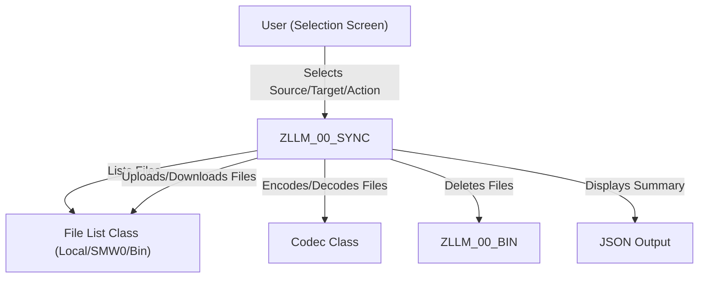

# PROG Documentation

This file contains all unique PROG documentation files.
Total files: 2

---

## PROG.ZLLM_00_ONBOARD.DOCUMENT.MD

# ABAP Component Documentation: ZLLM_00_ONBOARD

## 1. Component Overview

- **Type**: ABAP Report (Executable Program)
- **Technical Category**: LLM (Large Language Model) Onboarding, Configuration, and Testing Utility
- **System Role**: 
  - Entry point for onboarding and managing Azure OpenAI LLM configurations in the SAP system.
  - Provides a user interface for configuring, testing, and saving environment files for multiple LLM variants.
  - Bridges SAP and Azure OpenAI LLMs for downstream code intelligence, automation, or AI-driven features.

---

## 2. Technical Analysis

### 2.1 Core Functionality

**ZLLM_00_ONBOARD** is a utility report designed to streamline the onboarding and management of Azure OpenAI LLM configurations within SAP. Its main functions are:

- **Multi-LLM Configuration**: Supports up to four LLM variants (Default, Mini, Maxi, Deep), each with its own URL, API key, and enablement flag.
- **Interactive Testing**: Allows users to test connectivity and basic functionality of each enabled LLM by sending a sample prompt and displaying the response.
- **Environment File Generation**: Generates and saves `.env`-style configuration files for each enabled LLM, storing them in a binary repository for later use by other components.
- **Validation**: Performs input validation for URLs and API keys, ensuring only valid configurations are tested or saved.
- **User Interface**: Provides a selection screen with grouped parameters, function keys for batch actions, and dynamic field enablement based on user choices and expert mode.
- **Expert Mode**: Allows advanced users to access and edit additional LLM configurations.

### 2.2 Technical Architecture

#### Interfaces

- **Selection Screen**: 
  - Parameters for each LLM variant (URL, API key, enablement checkbox).
  - Test prompt input.
  - Binary storage key for environment files.
  - Function keys for batch actions (Test All, Save All, Test & Save All, Expert Mode).

- **Local Classes**:
  - `lcl_llm_tester`: Handles LLM connectivity and test execution.
  - `lcl_env_manager`: Manages creation and saving of environment files.
  - `lcl_config_manager`: Maps screen parameters to internal configuration structures.
  - `lcl_main`: Orchestrates validation, testing, and saving operations.

#### Dependencies

- **ZLLM_00* Classes**: 
  - `zcl_llm_00_llm_lazy`, `zcl_llm_00_dotenv`, `zcl_llm_00_cache_never`, `zcl_llm_00_step_lazy`, `zcl_llm_00_pat`, `zcl_llm_00_file_list_bin`, `zcl_llm_00_file_mock` (see [RELATED] section for details).
- **SAP Standard**: 
  - `cl_demo_output` for output display.
  - `sscrfields` for dynamic screen manipulation.
- **Custom Exception**: 
  - `zcx_s` for error handling.

#### Data Flow

1. **User Input**: User enters LLM URLs, API keys, and enables desired variants.
2. **Validation**: Inputs are validated for format and completeness.
3. **Testing**: For each enabled LLM, a test prompt is sent and the response is displayed.
4. **Saving**: For each enabled and valid LLM, an environment file is generated and saved to the binary repository.
5. **UI Feedback**: Results and errors are displayed using `cl_demo_output` and SAP messages.

### 2.3 Implementation Details

- **Design Patterns**:
  - **Factory/Builder**: Local classes use `new` methods for instantiation.
  - **Separation of Concerns**: Testing, environment management, configuration mapping, and orchestration are handled by separate classes.
  - **Table-driven**: LLM configurations are managed as an internal table (`tt_llm_configs`), enabling easy extension to more variants.

- **Screen Logic**:
  - Dynamic enablement/disablement of parameter fields based on checkboxes and expert mode.
  - Function keys mapped to main actions.
  - User-specific restrictions for binary storage field.

- **Validation**:
  - Checks for placeholder values (`<...>`) in URLs and API keys.
  - Ensures API key contains only allowed characters.
  - Ensures URL contains required Azure OpenAI path.

- **Error Handling**:
  - Uses TRY/CATCH blocks for all major operations.
  - Errors are displayed via `cl_demo_output` and SAP messages.

- **Integration Points**:
  - Relies on ZLLM_00* classes for LLM interaction, environment file handling, and binary storage.
  - Designed to work with the ZLLM_00 data model (see [RELATED]).

- **Security**:
  - API keys are handled as plain strings; ensure secure storage and transmission.
  - Binary storage access is restricted for certain users.

---

## 3. Business Context

### 3.1 Business Purpose

- **Onboarding**: Simplifies the process of connecting SAP to Azure OpenAI LLMs by providing a guided UI for configuration and validation.
- **Governance**: Ensures only valid and tested LLM configurations are saved and used in production, reducing risk of misconfiguration.
- **Enablement**: Supports multiple LLM variants for different business scenarios (e.g., simple tasks, complex tasks, deep reasoning).

### 3.2 Process Integration

- **Initial Setup**: Used by administrators or technical users to onboard new LLM endpoints.
- **Ongoing Maintenance**: Allows periodic testing and updating of LLM configurations as endpoints or credentials change.
- **Downstream Consumption**: Environment files generated by this report are consumed by other ZLLM_00 components for runtime LLM access.

### 3.3 Operational Impact

- **Reliability**: Reduces runtime errors by ensuring only tested and valid configurations are used.
- **Flexibility**: Supports rapid switching or addition of LLM variants for evolving business needs.
- **Auditability**: Centralizes LLM configuration management for easier review and compliance.

---

## 4. Support & Maintenance

### 4.1 Configuration

- **Environment Files**: Saved in binary storage (`ZLLM_00_BIN`) with user-specific keys.
- **Parameter Defaults**: Placeholders must be replaced with actual Azure OpenAI URLs and API keys.
- **User Restrictions**: Binary storage field is editable only for authorized users.

### 4.2 Monitoring

- **Test Results**: Output of LLM tests is displayed interactively; failures are clearly indicated.
- **Environment File Saves**: Success/failure of file saves is reported via SAP messages.

### 4.3 Common Issues

- **Invalid API Keys/URLs**: Placeholders or incorrect formats will prevent testing/saving.
- **Binary Storage Access**: Unauthorized users may not be able to save environment files.
- **LLM Connectivity**: Network or credential issues will be surfaced during test execution.

---

## 5. Additional Information

- **Author**: [Not specified in code]
- **Last Updated**: [Not specified in code]
- **Version**: [Not specified in code]

---

## 6. Related Components and Data Model

### 6.1 Key Dependencies

- **ZLLM_00_NODE / ZLLM_00_EDGE**: Core graph data model for code intelligence (see [RELATED]).
- **ZLLM_00_BIN**: Binary storage for environment files.
- **ZCL_LLM_00_LLM_LAZY**: LLM interaction class.
- **ZCL_LLM_00_DOTENV**: Environment file parser/creator.
- **ZCL_LLM_00_STEP_LAZY**: LLM step execution.
- **ZCL_LLM_00_PAT**: Pattern/prompt management.
- **ZCL_LLM_00_FILE_LIST_BIN / ZCL_LLM_00_FILE_MOCK**: File abstraction for binary storage.

### 6.2 Data Model Context

- **Temporary/Analytical Focus**: All ZLLM_00 tables are temporary, supporting analytical and onboarding workflows.
- **Extensibility**: Designed to support future LLM variants and additional configuration parameters.

---

## 7. Example Usage Scenario

1. **Administrator launches ZLLM_00_ONBOARD**.
2. **Enters Azure OpenAI URLs and API keys** for up to four LLM variants.
3. **Enables desired variants** via checkboxes.
4. **Enters a test prompt** (e.g., "Tell me a joke about a killeroo. (Mighty-Boosh)").
5. **Presses F1 (Test All)**: Each enabled LLM is tested; results are displayed.
6. **Presses F2 (Save All ENV)**: Environment files for each enabled and valid LLM are saved.
7. **Presses F3 (Test & Save All)**: Tests all, then saves if at least one test is successful.
8. **Other ZLLM_00 components** consume the saved environment files for runtime LLM access.

---

## 8. Security Considerations

- **API Key Handling**: API keys are visible in the UI and stored in environment files; ensure proper authorization and secure storage.
- **User Access**: Restrict access to onboarding report and binary storage as appropriate.
- **Audit Logging**: Consider logging configuration changes for compliance.

---

## 9. Maintenance Recommendations

- **Regularly review and update** LLM URLs and API keys.
- **Test all configurations** after any change to Azure OpenAI deployments.
- **Clean up unused environment files** from binary storage to avoid clutter.
- **Monitor for SAP and Azure OpenAI API changes** that may require updates to validation logic or environment file structure.

---

## 10. References

- **ZLLM_00 Data Model Analysis**: See [RELATED] section for detailed breakdown of supporting tables and their roles.
- **SAP Help**: For selection screen and dynamic screen modification techniques.
- **Azure OpenAI Documentation**: For correct URL and API key formats.

---

**In summary**, ZLLM_00_ONBOARD is a robust, user-friendly onboarding utility for managing Azure OpenAI LLM configurations in SAP, ensuring only valid and tested endpoints are used, and providing a foundation for advanced AI-driven features in the SAP landscape.

---

## PROG.ZLLM_00_SYNC.DOCUMENT.MD

# ABAP Component Documentation: ZLLM_00_SYNC

## 1. Component Overview

- **Type**: Report (Executable Program)
- **Technical Category**: File Synchronization Utility (Folder <-> SAP Bin/Package)
- **System Role**: Developer/Administrator Tool for synchronizing files between local folders, SAP MIME repository (SMW0), and custom binary storage (ZLLM_00_BIN)

### Summary

`ZLLM_00_SYNC` is a utility report in the $ZLLM_00 package designed to synchronize files between a local folder, SAP package (SMW0), and a custom binary table (ZLLM_00_BIN). It provides a flexible interface for uploading, downloading, and deleting files, supporting various file types and masks, and is intended for technical users managing LLM (Lightweight LLM Module) artifacts or related files in SAP.

---

## 2. Technical Analysis

### 2.1 Core Functionality

- **Purpose**: Synchronize files between a local folder, SAP MIME repository (SMW0), and a custom binary storage table (ZLLM_00_BIN).
- **Modes**: Supports both upload (local → SAP) and download (SAP → local) operations, as well as deletion from the binary table.
- **File Filtering**: Allows filtering files by masks (e.g., *.env, *sys.md, *usr.md, *pat.md).
- **Codec Support**: Optionally encodes/decodes files using a codec class for binary compatibility.
- **User Interaction**: Provides a selection screen with radio buttons and parameters for flexible operation modes.

### 2.2 Technical Architecture

#### Interfaces

- **Selection Screen**: Multiple blocks for input/output configuration, file masks, and action selection.
- **Local Class (`lcl_`)**: Encapsulates file listing, upload, and deletion logic.
- **File List Interfaces**: Uses `zif_llm_00_file_list` and its implementations for file operations.

#### Dependencies

- **Classes**:
  - `zcl_llm_00_codec`, `zcl_llm_00_codec_mock`: For file encoding/decoding.
  - `zcl_llm_00_file_list_local`, `zcl_llm_00_file_list_smw0`, `zcl_llm_00_file_list_bin`: For handling files in different storage backends.
  - `zcl_llm_00_list`, `zcl_llm_00_json`: For list and JSON operations.
- **Tables**:
  - `ZLLM_00_BIN`: Custom binary storage for files.
- **SAP Standard**:
  - `SMW0`: SAP MIME repository for file storage.

#### Data Flow

- **Input**: User specifies source and target (folder, package, or bin), file masks, and action (copy/delete).
- **Processing**:
  - Files are listed from the selected source using the appropriate file list class.
  - Files are uploaded to the selected target using the corresponding file list class.
  - Optionally, files can be deleted from the binary table based on mask and bin.
- **Output**: JSON summary of the operation is displayed using `cl_demo_output=>display`.

### 2.3 Implementation Details

#### Selection Screen

- **Blocks**:
  - **B01**: Input configuration (source folder, package, namespace, bin, radio buttons).
  - **B05**: Output configuration (target folder, package, namespace, bin, radio buttons).
  - **B15**: Action selection (copy/delete, bin, mask).
- **Parameters**: Allow detailed control over source/target, file masks, and codec usage.

#### Local Class (`lcl_`)

- **Methods**:
  - `new`: Instantiates the class and initializes the codec.
  - `start`: Main entry point; handles copy/delete logic based on user selection.
  - `get_fl_in` / `get_fl_out`: Returns file list objects for input/output, depending on selected mode (folder, package, bin).
  - `upload_to_fl`: Loops through input files and saves them to the output location.
  - `delete`: Deletes files from the binary table based on mask and bin.

#### Dynamic Screen Logic

- **AT SELECTION-SCREEN OUTPUT**: Dynamically enables/disables input fields based on selected radio buttons for source/target type.

#### Initialization

- **INITIALIZATION Event**: Sets default values for folder and bin parameters, appending system ID and user name for uniqueness.

#### Execution

- **AT SELECTION-SCREEN**: Triggers the main operation (`start`) when the user executes the report.

#### Error Handling

- Minimal explicit error handling; relies on standard ABAP exceptions and the robustness of called classes.

#### Performance

- Designed for batch operations; performance depends on the number and size of files, and the efficiency of underlying file list classes.

#### Security

- **File Access**: Local folder access is subject to SAP kernel and OS-level permissions.
- **SAP Package/Bin Access**: Requires appropriate authorizations for SMW0 and custom tables.
- **No explicit authorization checks** in the report; should be run by trusted users.

---

## 3. Business Context

### 3.1 Business Purpose

- **Domain**: Technical administration, DevOps, and LLM (Lightweight LLM Module) artifact management in SAP.
- **Objective**: Simplify the process of synchronizing code, configuration, and model files between local development environments and SAP systems.

### 3.2 Process Integration

- **Supported Scenarios**:
  - Uploading new or updated LLM artifacts (e.g., patterns, environment files) from a developer's machine to SAP.
  - Downloading files from SAP to local for backup or analysis.
  - Cleaning up obsolete files from the custom binary table.
- **Integration Points**:
  - Works in conjunction with other $ZLLM_00 components for LLM-based code intelligence and analytics.

### 3.3 Operational Impact

- **Efficiency**: Reduces manual effort in file management for technical users.
- **Consistency**: Ensures that local and SAP file repositories are synchronized.
- **Maintainability**: Supports lifecycle management of LLM-related files.

---

## 4. Support & Maintenance

### 4.1 Configuration

- **Parameterization**: Highly configurable via selection screen; no hard-coded paths or packages.
- **Masks**: File masks allow fine-grained control over which files are processed.
- **Codec**: Option to use real or mock codec for compatibility.

### 4.2 Monitoring

- **Output**: JSON summary of processed files is displayed at the end of each operation.
- **Logs**: No explicit logging; consider adding application log integration for auditability.

### 4.3 Common Issues

- **Authorization Errors**: Ensure users have permissions for file access, SMW0, and ZLLM_00_BIN.
- **File Path Issues**: Local folder paths must be accessible from the SAP application server.
- **Mask Mismatches**: Incorrect file masks may result in missing or extra files being processed.
- **Codec Compatibility**: Ensure the correct codec is selected for the file types in use.

---

## 5. Additional Information

- **Author**: Not specified in code; likely SAP technical team or LLM module developers.
- **Last Updated**: Not specified; check transport or version management for details.
- **Version**: Not specified; part of $ZLLM_00 package.

---

## References and Related Components

- **$ZLLM_00 Data Model**: See [Related Components] for details on ZLLM_00_BIN and other supporting tables.
- **File List Classes**: `zcl_llm_00_file_list_local`, `zcl_llm_00_file_list_smw0`, `zcl_llm_00_file_list_bin`
- **Codec Classes**: `zcl_llm_00_codec`, `zcl_llm_00_codec_mock`
- **Other Reports**: `ZLLM_00_FLOW_DEMO`, `ZLLM_00_ONBOARD`, `ZLLM_00_PREDICTOKEN_DEMO`, `ZLLM_00_REPL`

---

## Example Usage

**To upload files from a local folder to SAP:**
1. Set `P_FOLD_I` to the source folder.
2. Set `P_PACK_O` and `P_NS_O` to the target SAP package and namespace.
3. Select the appropriate radio buttons for source and target.
4. Click "Execute" to start the synchronization.

**To delete files from the binary table:**
1. Select "Delete" action in block B15.
2. Specify `P_BIN_D` and `P_MASK` as needed.
3. Click "Execute".

---

## Security Considerations

- Only authorized users should run this report due to its ability to manipulate files in SAP and on the server.
- No explicit checks for file content or type; ensure only trusted files are synchronized.
- Consider implementing additional logging or authorization checks for production use.

---

## Maintenance Recommendations

- Periodically review and clean up ZLLM_00_BIN to avoid storage bloat.
- Monitor for changes in file list or codec class interfaces.
- Update file masks as new artifact types are introduced.

---

## Diagram: High-Level Data Flow

---

**In summary, `ZLLM_00_SYNC` is a robust, flexible tool for synchronizing files between local and SAP environments, supporting the technical needs of LLM module management and broader DevOps scenarios within SAP.**

---

