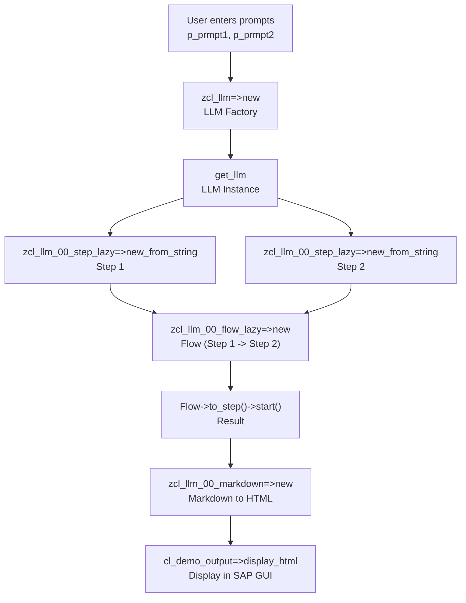
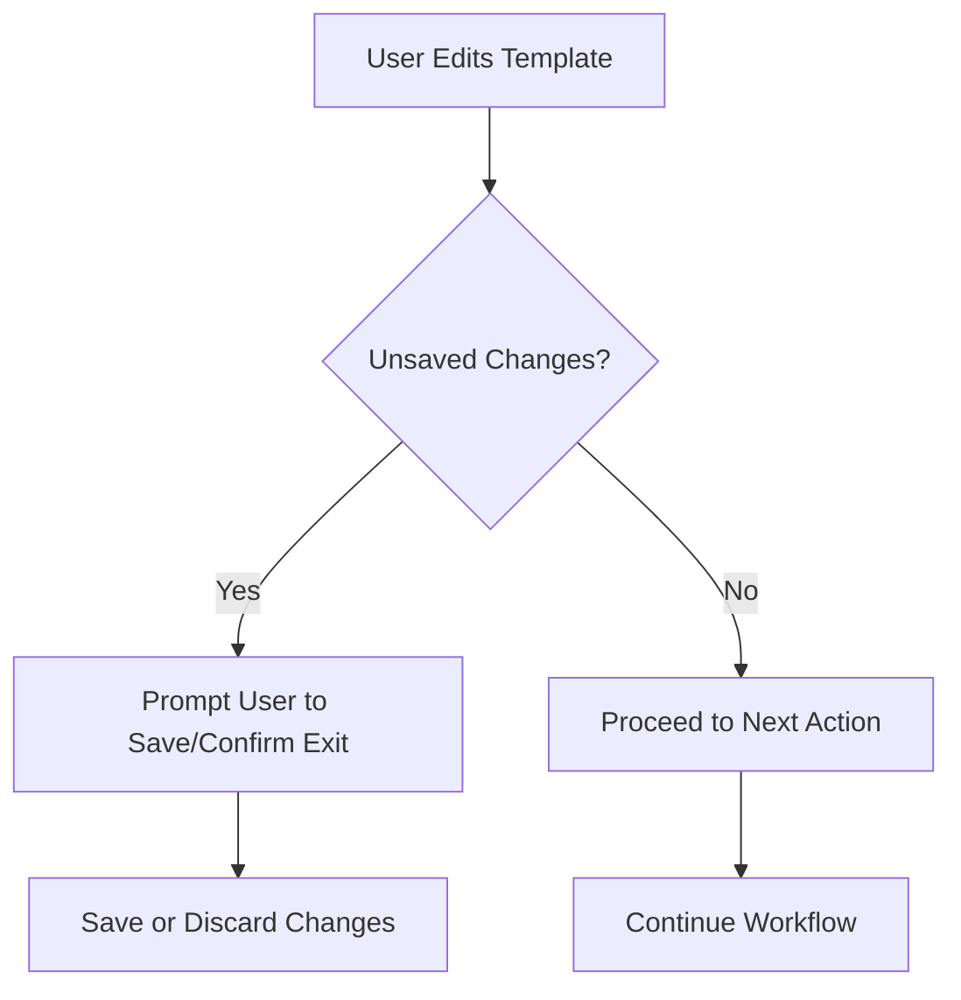
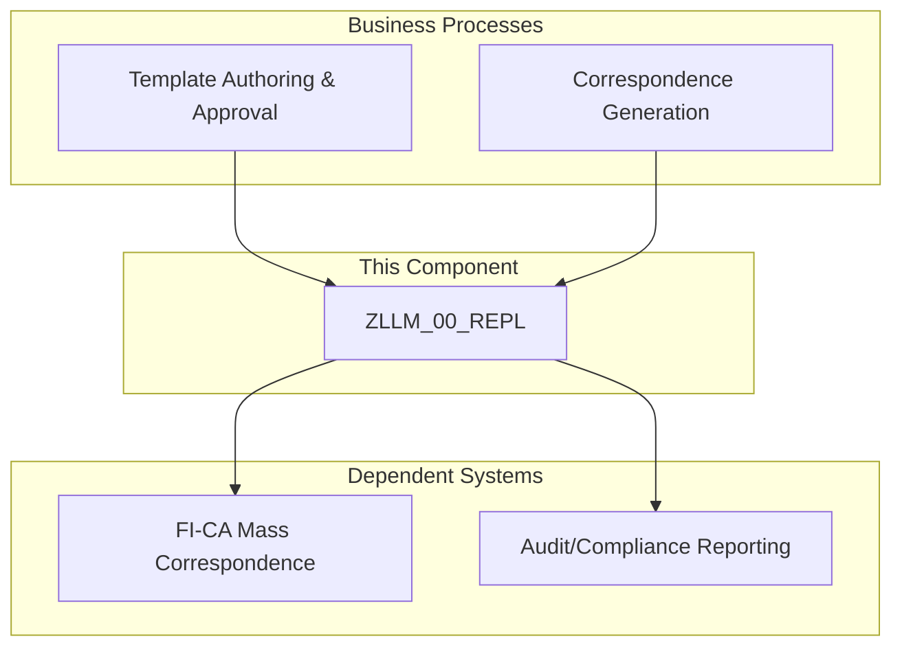

# REPS Documentation

This file contains all unique REPS documentation files.
Total files: 5

---

## REPS.ZLLM_00_FLOW_DEMO.DOCUMENT.MD

# ABAP Component Documentation: ZLLM_00_FLOW_DEMO (Report ZLLM_01_CHAIN_TEST)

## 1. Component Overview

- **Type**: Executable Report (ABAP Report)
- **Technical Category**: Demo/Prototype for LLM (Large Language Model) Flow Chaining
- **System Role**: Demonstration and testing of chained LLM prompt execution and result rendering in SAP GUI

**Namespace/Location**:  
- Custom namespace (`ZLLM_00*`), part of the $ZLLM_00 package, which is dedicated to lightweight LLM (Large Language Model) integration and experimentation in SAP.

**Component Role in System Architecture**:  
- This report acts as a demonstration client for the LLM orchestration framework, showcasing how to chain multiple LLM prompts and display the results in HTML format within SAP.

---

## 2. Technical Analysis

### 2.1 Core Functionality

This report demonstrates the following sequence:

1. **Parameter Input**:  
   - Accepts two free-text parameters (`p_prmpt1`, `p_prmpt2`) representing user prompts for the LLM.

2. **LLM Factory and Instance Creation**:  
   - Instantiates a factory object (`zcl_llm=>new`) to obtain an LLM instance configured via a default environment.

3. **Step Construction**:  
   - Creates two LLM "steps" (`zcl_llm_00_step_lazy=>new_from_string`), each representing a prompt to be processed by the LLM.

4. **Flow Construction**:  
   - Chains the two steps into a "flow" (`zcl_llm_00_flow_lazy=>new`), enabling sequential execution.

5. **Execution and Result Handling**:  
   - Executes the flow, collects the result, and converts it to a string.

6. **Markdown Rendering**:  
   - Converts the result string to HTML using a Markdown renderer (`zcl_llm_00_markdown=>new`).

7. **Output**:  
   - Displays the HTML result in the SAP GUI using `cl_demo_output=>display_html`.

**User Interaction**:  
- The report is triggered via the selection screen (standard SAP report mechanism). When the user executes (ONLI), the chained LLM flow is run.

---

### 2.2 Technical Architecture

#### Interfaces

- **User Parameters**:  
  - `p_prmpt1` (string): First LLM prompt (default: "Write a cute poem about kitten, in 8 lines.")
  - `p_prmpt2` (string): Second LLM prompt (default: "Summarize this: {T} and repeat the poem, and translate poem to Japanese. And why the sun is yellow?")

- **Class lcl_**:  
  - Local class encapsulating the demo logic, with a static constructor (`new`) and an instance method (`go`).

#### Dependencies

- **Core LLM Framework Classes**:
  - `zcl_llm`: LLM factory and configuration
  - `zcl_llm_00_step_lazy`: Represents a single LLM prompt/step
  - `zcl_llm_00_flow_lazy`: Chains multiple steps for sequential execution
  - `zcl_llm_00_markdown`: Markdown-to-HTML renderer
  - `cl_demo_output`: SAP standard class for HTML output in GUI

- **Related Data Model** (from [RELATED]):
  - No direct DB operations, but the LLM framework interacts with temporary tables for caching, flow definitions, and result storage (see ZLLM_00* tables).

#### Data Flow

1. **Input**: User enters two prompts.
2. **Processing**:  
   - Prompts are wrapped as LLM steps.
   - Steps are chained into a flow.
   - Flow is executed, passing outputs between steps.
3. **Output**:  
   - Final result is rendered as HTML and displayed.

---

### 2.3 Implementation Details

- **Design Patterns**:  
  - Factory pattern for LLM instantiation.
  - Chain-of-responsibility or pipeline pattern for step/flow execution.
  - Encapsulation via local class (`lcl_`) for modular demo logic.

- **Algorithm**:  
  - No complex algorithm; the focus is on orchestration and integration of LLM steps.

- **Database Interactions**:  
  - None directly in this report. Underlying LLM framework may use temporary tables for caching and flow management.

- **UI Elements**:  
  - SAP selection screen for parameter input.
  - HTML output displayed in SAP GUI.

- **Error Handling**:  
  - Minimal in this demo; relies on framework classes for error propagation.

- **Security**:  
  - No direct security checks in the report. Security for LLM access and data handling is expected to be managed in the underlying framework.

---

## 3. Business Context

### 3.1 Business Purpose

- **Objective**:  
  - To demonstrate and test the chaining of LLM prompts within SAP, enabling advanced text generation, summarization, translation, and reasoning tasks.

- **Significance**:  
  - Showcases how SAP can leverage modern AI/LLM capabilities for business scenarios such as document generation, summarization, and multilingual support.

### 3.2 Process Integration

- **Role in Business Processes**:  
  - Prototype for integrating LLM-driven automation into SAP workflows.
  - Can be adapted for business processes requiring multi-step AI reasoning or content transformation.

### 3.3 Operational Impact

- **Effects**:  
  - No direct impact on business operations in its demo form.
  - Provides a foundation for future business applications leveraging LLMs.

---

## 4. Support & Maintenance

### 4.1 Configuration

- **Environment**:  
  - Requires LLM environment configuration (`DEFAULT.ENV`).
  - Underlying LLM framework must be set up and connected to an LLM provider (e.g., OpenAI, Azure OpenAI).

- **Parameters**:  
  - Prompts can be customized via selection screen.

### 4.2 Monitoring

- **Execution Monitoring**:  
  - Standard SAP job/report monitoring.
  - LLM framework may provide logs or error traces.

### 4.3 Common Issues

- **LLM Connectivity**:  
  - Errors if LLM environment is not configured or accessible.
- **Framework Errors**:  
  - Any issues in the LLM framework (e.g., step creation, flow execution) will propagate up.
- **Output Rendering**:  
  - Markdown-to-HTML conversion may fail for malformed input.

---

## 5. Additional Information

- **Author**: Not specified (custom development, likely by SAP technical team or AI/LLM integration specialist)
- **Last Updated**: Not specified
- **Version**: Prototype/Demo

---

### **References and Related Components**

- **LLM Framework**:  
  - `zcl_llm`, `zcl_llm_00_step_lazy`, `zcl_llm_00_flow_lazy`, `zcl_llm_00_markdown`
- **Data Model**:  
  - ZLLM_00* tables for graph-based LLM orchestration (see [RELATED] section)
- **Other Demo Reports**:  
  - `R.ZLLM_00_ONBOARD`, `R.ZLLM_00_PREDICTOKEN_DEMO`, `R.ZLLM_00_REPL`, `R.ZLLM_00_SYNC`

---

## **Summary Table**

| Element         | Description                                      |
|-----------------|--------------------------------------------------|
| p_prmpt1        | First LLM prompt (user input)                    |
| p_prmpt2        | Second LLM prompt (user input)                   |
| lcl_            | Local class encapsulating demo logic             |
| zcl_llm         | LLM factory/configuration                        |
| zcl_llm_00_step_lazy | LLM step (prompt execution)                 |
| zcl_llm_00_flow_lazy | LLM flow (step chaining)                    |
| zcl_llm_00_markdown  | Markdown-to-HTML renderer                   |
| cl_demo_output  | SAP standard HTML output                         |

---

## **Example Execution Flow**

1. User enters two prompts on the selection screen.
2. On execution, the report:
   - Instantiates the LLM factory and LLM instance.
   - Creates two LLM steps from the prompts.
   - Chains the steps into a flow.
   - Executes the flow, passing the output of the first step as input to the second.
   - Converts the final result to HTML and displays it.

---

## **Security Considerations**

- Ensure LLM access is restricted to authorized users.
- Validate and sanitize user input to prevent prompt injection or misuse.
- Monitor LLM output for sensitive data leakage.

---

## **Diagram: High-Level Flow**



---

**In summary:**  
This report is a demonstration of how to chain multiple LLM prompts in SAP, execute them sequentially, and present the results in a user-friendly HTML format. It leverages a modular LLM framework and serves as a template for more advanced AI-driven business process automation in SAP environments.

---

## REPS.ZLLM_00_PREDICTOKEN_DEMO.DOCUMENT.MD

# ABAP Component Documentation: ZLLM_00_PREDICTOKEN_DEMO

## 1. Component Overview

- **Type**: Report (Executable Program)
- **Technical Category**: Demo/Utility – Token Prediction for LLMs
- **System Role**: User-facing utility for demonstrating and testing the token prediction capabilities of the ZCL_LLM_00_PREDICTOKEN class, supporting both GPT and Mistral model types.

---

## 2. Technical Analysis

### 2.1 Core Functionality

This report provides an interactive demonstration of the token prediction feature for Large Language Models (LLMs) within the SAP system. It allows a user to:

- Select between two model types (GPT or Mistral) via radio buttons.
- Enter a free-form query (multi-line text) using the SAP standard text editor dialog.
- Predict the number of tokens that the selected LLM model would consume for the entered query.
- Display the predicted token count and echo the entered query using the SAP demo output class.

**Key Steps:**
1. **User Input**: The user selects a model type and enters a query.
2. **Token Prediction**: The report instantiates the appropriate token predictor and calculates the token count for the input.
3. **Output**: Results are displayed interactively.

### 2.2 Technical Architecture

- **Interfaces**:
  - **User Interface**: Classic SAP selection screen with radio buttons and a pop-up text editor (via `TERM_CONTROL_EDIT`).
  - **Output**: Uses `CL_DEMO_OUTPUT` for displaying results.

- **Dependencies**:
  - **ZCL_LLM_00_PREDICTOKEN**: Core class for token prediction logic.
  - **TERM_CONTROL_EDIT**: SAP standard function module for text input.
  - **CL_DEMO_OUTPUT**: SAP demo class for output display.

- **Data Flow**:
  1. User selects model and enters text.
  2. Text is passed to the token predictor.
  3. Token count is calculated and displayed.

### 2.3 Implementation Details

- **Selection Screen**: Two radio buttons (`P_R1` for GPT, `P_R2` for Mistral).
- **Text Input**: Uses `TERM_CONTROL_EDIT` to collect multi-line input into an internal table of type `STRING`.
- **Token Prediction**:
  - The model type is determined by the selected radio button.
  - The predictor object is created via `ZCL_LLM_00_PREDICTOKEN=>NEW_FOR_MODEL_TYPE`.
  - The method `PREDICT_FOR_ITAB` is called with the input text table.
- **Output**: The number of tokens is displayed, followed by the input text.

- **Error Handling**:
  - If the user cancels the text input, the form exits gracefully.
  - No explicit error handling for prediction failures; assumes the predictor class handles its own exceptions.

- **Performance**: Not performance-critical; designed for interactive demo use.

- **Security**: No sensitive data processed; standard SAP authorization applies for report execution.

---

## 3. Business Context

### 3.1 Business Purpose

This report serves as a demonstration and utility tool for SAP users and developers to:

- Understand how many tokens a given input would consume for different LLM models.
- Test and compare tokenization behavior between GPT and Mistral models.
- Support development, cost estimation, and optimization of LLM-based integrations by providing insight into token usage.

### 3.2 Process Integration

- **Standalone Utility**: Not directly integrated into business processes, but supports LLM-related development and analysis.
- **Development Support**: Useful for developers integrating LLMs into SAP, especially for prompt engineering and cost control.

### 3.3 Operational Impact

- **No direct impact** on business operations.
- **Indirect impact**: Helps optimize LLM usage, which can affect downstream processes that rely on LLM-based automation or analytics.

---

## 4. Support & Maintenance

### 4.1 Configuration

- **No special configuration required**.
- Relies on the availability and correctness of the ZCL_LLM_00_PREDICTOKEN class and its dependencies.

### 4.2 Monitoring

- **Not a production-critical report**; no special monitoring required.
- Errors in token prediction logic should be traced to the ZCL_LLM_00_PREDICTOKEN class.

### 4.3 Common Issues

- **TERM_CONTROL_EDIT**: If not available or not configured, text input may fail.
- **Predictor Class Issues**: If ZCL_LLM_00_PREDICTOKEN is not implemented or has errors, prediction will fail.
- **Authorization**: Users need authorization to execute the report and access the relevant classes.

---

## 5. Additional Information

- **Author**: Not specified
- **Last Updated**: Not specified
- **Version**: Not specified

---

### References and Related Components

- **ZCL_LLM_00_PREDICTOKEN**: Core class for token prediction (see related documentation for technical details).
- **ZLLM_00 Data Model**: Underlying tables and architecture support LLM operations, but this report does not interact directly with them.
- **Other Demo Reports**: See `ZLLM_00_FLOW_DEMO`, `ZLLM_00_ONBOARD`, `ZLLM_00_REPL` for related LLM demonstrations.

---

## Example Usage

1. Run the report `ZLLM_00_PREDICTOKEN_DEMO`.
2. Select either "GPT" or "Mistral" as the model type.
3. Enter your query in the pop-up text editor.
4. View the predicted token count and your input.

---

## Summary Table

| Feature                | Description                                  |
|------------------------|----------------------------------------------|
| Model Selection        | GPT or Mistral (radio buttons)               |
| Input Method           | Multi-line text via TERM_CONTROL_EDIT        |
| Token Prediction       | Via ZCL_LLM_00_PREDICTOKEN                   |
| Output                 | Token count and input text (CL_DEMO_OUTPUT)  |
| Error Handling         | User cancel handled; other errors not shown  |

---

## Security Considerations

- No sensitive data processed.
- Standard SAP report execution security applies.

---

## Maintenance Notes

- Ensure ZCL_LLM_00_PREDICTOKEN and its dependencies are up-to-date.
- If new LLM models are added, update the report to support additional options.
- For production use, consider adding more robust error handling and logging.

---

**In summary:**  
ZLLM_00_PREDICTOKEN_DEMO is a simple, interactive SAP report for demonstrating and testing LLM token prediction logic, supporting both GPT and Mistral models. It is primarily a developer tool and does not directly impact business processes, but it is valuable for optimizing LLM usage within SAP environments.

---

## REPS.ZLLM_00_REPL.BPML.MD

# Business Domain Analysis: ZLLM_00_REPL (Report ZLOCAL_REPL_000)

---

## 1. Component Classification

**Component Type**: Report (ABAP Report Program)  
**Primary Business Domain**: FI (Financials) – Contract Accounts Receivable and Payable (FI-CA)  
**Sub-Domain**: Correspondence Management, Document Generation, Approval Workflow  
**Business Function**: Interactive Correspondence/Document Processing, Versioning, Approval, and Simulation  
**Process Category**: Transactional (Interactive Processing), Workflow/Approval, Master Data Reference

---

## 2. Business Process Mapping

### 2.1 Triggered Business Processes

- **Process Name**: Correspondence/Document Authoring and Approval
  - **Trigger Type**: Manual (User-initiated via SAP GUI)
  - **Business Scenario**: When a business user needs to create, edit, simulate, or approve correspondence templates or documents (e.g., dunning letters, statements).
  - **Business Users**: Business analysts, finance clerks, correspondence administrators

- **Process Name**: Version Management for Correspondence
  - **Trigger Type**: Manual (User navigation)
  - **Business Scenario**: When a user needs to review, revert, or approve previous versions of correspondence templates.
  - **Business Users**: Template owners, compliance officers

- **Process Name**: Simulation and Output Preview
  - **Trigger Type**: Manual (User action in UI)
  - **Business Scenario**: When a user wants to preview the output of a correspondence template before finalizing or sending for approval.
  - **Business Users**: Template designers, business testers

---

### 2.2 Supported Business Operations

- **Operation**: Create/Edit Correspondence Template
  - **Support Type**: Primary
  - **Business Value**: Enables business to maintain up-to-date, compliant communication templates.
  - **Frequency**: As needed (typically during template lifecycle changes)

- **Operation**: Version Navigation (First, Last, Next, Previous, Approved)
  - **Support Type**: Primary
  - **Business Value**: Ensures traceability and auditability of template changes.
  - **Frequency**: Regularly during template review cycles

- **Operation**: Send for Approval
  - **Support Type**: Primary
  - **Business Value**: Enforces compliance and quality control before templates are used in production.
  - **Frequency**: Each time a template is finalized

- **Operation**: Simulate/Preview Output
  - **Support Type**: Primary
  - **Business Value**: Reduces errors by allowing users to see the final output before use.
  - **Frequency**: Frequently during template editing

- **Operation**: Save/Load Session (Drafts)
  - **Support Type**: Secondary
  - **Business Value**: Prevents data loss and supports iterative work.
  - **Frequency**: As needed

---

### 2.3 Downstream Process Impacts

- **Impacted Process**: Mass Correspondence Generation (e.g., Dunning, Statements)
  - **Impact Type**: Data Update (Template/Version selection)
  - **Business Consequence**: Ensures that only approved and up-to-date templates are used for customer communications.

- **Impacted Process**: Audit and Compliance Reporting
  - **Impact Type**: Status Change (Approval, Versioning)
  - **Business Consequence**: Provides audit trail for regulatory compliance.

---

## 3. Business Rules & Logic

### 3.1 Core Business Rules

1. **Rule**: Only approved versions of correspondence templates can be used in production.
   - **Type**: Authorization/Validation
   - **Business Impact**: Prevents unauthorized or incomplete templates from being used.
   - **Implementation**: Approval workflow and version navigation logic.

2. **Rule**: All changes to templates must be versioned and traceable.
   - **Type**: Audit/Control
   - **Business Impact**: Ensures accountability and rollback capability.
   - **Implementation**: Version management methods (first, last, next, previous, approved).

3. **Rule**: Users must confirm exit if there are unsaved changes.
   - **Type**: Validation/Control
   - **Business Impact**: Prevents accidental data loss.
   - **Implementation**: `is_ted_modified` and `confirm_exit` logic.

4. **Rule**: Simulation/preview must reflect the latest edits before approval.
   - **Type**: Validation
   - **Business Impact**: Reduces risk of errors in customer communication.
   - **Implementation**: `sync_ted`, `sync_html`, and preview logic.

---

### 3.2 Decision Points



---

## 4. Data Dependencies & Business Context

### 4.1 Business Data Entities

#### Master Data Dependencies

- **Entity**: DFKKCOH – Correspondence Header
  - **Business Purpose**: Represents correspondence/document metadata (type, key, date, company code, business partner, etc.)
  - **Access Pattern**: Read (for rendering metadata, selection)
  - **Criticality**: High (drives template selection and context)

- **Entity**: ZLLM_00_CACHE – Custom Cache Table
  - **Business Purpose**: Stores session data, drafts, or simulation results for user sessions.
  - **Access Pattern**: Read/Write
  - **Criticality**: Medium (supports user productivity, not core business data)

#### Transactional Data

- **Entity**: None directly, but output impacts transactional correspondence generation (e.g., dunning runs, mass print jobs).

---

### 4.2 SAP Standard Integration

- **Standard Object**: CL_GUI_HTML_VIEWER, CL_GUI_TEXTEDIT, CL_GUI_CONTAINER
  - **Business Purpose**: Provides interactive UI for editing and previewing correspondence.
  - **Integration Pattern**: Embedded in SAP GUI screens for real-time user interaction.

- **Standard Object**: SO_STRING_TO_TAB (Function Module)
  - **Business Purpose**: Converts string data to table format for display.
  - **Integration Pattern**: Used for rendering HTML/preview content.

---

### 4.3 Custom Dependencies

- **Custom Object**: ZCL_LLM_00_LLM_LAZY, ZCL_LLM_00_STEP_LAZY, ZCL_LLM_00_FLOW_LAZY, ZCL_LLM_00_CACHE, ZCL_LLM_SPL, ZCL_LLM_STR_TO_TED, ZCL_MARKDOWN, ZCL_XTT_FILE_SMW0
  - **Business Relationship**: Provide business logic for LLM (Large Language Model) based processing, step execution, caching, and markdown rendering.
  - **Data Exchange**: Passes template data, simulation results, and user edits between UI and backend logic.

---

## 5. Integration & Data Flow

### 5.1 Business Data Flow

```mermaid
flowchart LR
    subgraph "Input Sources"
        A[User Inputs (Template, Instructions)]
        B[Master Data (DFKKCOH)]
    end
    
    subgraph "Component Processing"
        C[Template Editing & Versioning]
        D[Simulation & Approval Workflow]
    end
    
    subgraph "Business Outputs"
        E[Preview/Simulation Result]
        F[Approved Template Version]
    end
    
    A --> C
    B --> D
    C --> E
    D --> F
```

---

### 5.2 External System Integration

- **Interface**: None direct to external systems; integration is within SAP GUI and custom SAP classes.
  - **Direction**: Internal (within SAP system)
  - **Business Purpose**: All processing and data flow are within SAP, supporting business users in correspondence management.
  - **Business Data**: Template content, approval status, simulation results.
  - **Integration Pattern**: Real-time, user-driven.

---

## 6. Child Component Consolidation

### 6.1 Aggregated Business Domains

- Document/Correspondence Management
- Approval Workflow
- Version Control
- Simulation/Preview

### 6.2 Business Process Coherence

- Sub-components (e.g., text editors, HTML viewers, approval logic) work together to provide an end-to-end interactive environment for business users to create, simulate, and approve correspondence templates, ensuring compliance and quality.

### 6.3 Consolidated Dependencies

- Relies on custom LLM-based processing classes for advanced text generation/simulation.
- Uses SAP standard UI controls for user interaction.
- Depends on master data (DFKKCOH) for context and selection.

---

## 7. Business Impact Assessment

**Business Criticality**: High (for organizations relying on automated correspondence)  
**Usage Frequency**: Moderate to High (depends on frequency of template changes and compliance cycles)  
**Business Risk**: Medium to High (incorrect templates can lead to compliance issues, customer dissatisfaction)  
**Process Dependencies**: Multiple – impacts all downstream processes using correspondence templates

---

### 7.1 Key Business Relationships



---

## 8. Package-Level Insights

### 8.1 Subsystem Contribution

- **Role**: Provides the interactive, user-facing layer for managing correspondence templates, integrating advanced text processing (LLM), versioning, and approval into the broader correspondence management subsystem.

### 8.2 Cross-Package Dependencies

- **Dependencies**: Custom LLM processing classes (ZCL_LLM_00_*), caching, and markdown rendering may reside in separate packages, reflecting a modular architecture.
- **Business Reason**: Enables reuse of LLM logic and UI controls across different business scenarios (not just correspondence).

### 8.3 Business Domain Boundaries

- **Domain Boundaries**: Clearly within correspondence/document management, but interacts with master data (DFKKCOH) and approval workflow domains.
- **Integration Points**: Approval status, template versioning, and simulation results are key handoff points to downstream processes.
- **Data Handoffs**: Approved templates and simulation outputs are handed off to mass correspondence generation and compliance reporting.

---

## Summary

**ZLLM_00_REPL** is a high-impact, interactive SAP report supporting the full lifecycle of correspondence template management: authoring, simulation, versioning, and approval. It is central to ensuring that only compliant, approved templates are used in customer communications, with strong integration to master data and custom LLM-based processing for advanced text handling. Its business value lies in enabling business users to efficiently manage correspondence content, reducing compliance risk and improving communication quality.

---

**Note:**  
This analysis is based on the provided ABAP source code and documentation. Actual business process integration may vary depending on organizational usage and configuration.

---

## REPS.ZLLM_00_REPL.DOCUMENT.MD

# ABAP Component Documentation: ZLLM_00_REPL (Report ZLOCAL_REPL_000)

---

## 1. Component Overview

- **Type**: ABAP Report (Executable Program)
- **Technical Category**: Custom SAP GUI Application with OO-ABAP, Dynamic UI, and LLM (Large Language Model) Integration
- **System Role**: Interactive REPL (Read-Eval-Print Loop) for multi-step correspondence and text processing, supporting versioning, approval, and dynamic rendering within SAP GUI

---

## 2. Technical Analysis

### 2.1 Core Functionality

**ZLLM_00_REPL** is a sophisticated ABAP report designed as a REPL (Read-Eval-Print Loop) for managing, processing, and previewing correspondence data and text flows in a multi-step, interactive fashion. Its main features include:

- **Dynamic UI Rendering**: Uses custom containers, HTML viewers, and text editors to provide a rich, interactive SAP GUI experience.
- **Stepwise Processing**: Supports up to four processing steps, each with its own input, system/user instructions, and output, allowing for complex, chained data transformations.
- **Version Management**: Includes navigation for previous/next/first/last versions and approval workflows.
- **Integration with LLMs**: Connects to LLM (Large Language Model) backends for advanced text processing, leveraging custom classes for formula and flow orchestration.
- **Metadata and Help Rendering**: Dynamically generates and displays metadata and F1 help content using HTML and Markdown.
- **Session Persistence**: Implements save/load mechanisms for session data, including transport integration and caching.
- **Logging and Error Handling**: Centralized logging via custom classes, with robust error capture and display.

### 2.2 Technical Architecture

#### Interfaces

- **User Interaction**: SAP GUI selection screens, custom containers, HTML viewers, and text editors.
- **Event Handling**: Custom event handler classes for HTML and ALV grid events.
- **LLM Integration**: Interfaces with classes like `zcl_llm_00_llm_lazy`, `zcl_llm_00_step_lazy`, and `zcl_llm_00_flow_lazy` for LLM orchestration.
- **Transport and Approval**: Methods for sending data to transport requests and approval workflows.

#### Dependencies

- **Custom Classes**: Heavy reliance on custom classes (e.g., `zcl_llm_00_llm_lazy`, `zcl_llm_00_step_lazy`, `zcl_llm_00_flow_lazy`, `zcl_llm_00_formula`, `zcl_llm_spl`, `zcl_llm_str_to_ted`, `zcl_llm_00_cache`, `zcl_xtt_file_smw0`, `zcl_markdown`, `zcl_blog`, `zcl_eui_alv`, `zcl_eui_screen`).
- **SAP Standard**: Uses standard SAP controls (`cl_gui_custom_container`, `cl_gui_html_viewer`, `cl_gui_textedit`, `cl_gui_alv_grid`), function modules (`SO_STRING_TO_TAB`), and type pools (`vrm`, `icon`, `cntb`).
- **Database Tables**: Reads from and writes to custom tables like `zllm_00_cache`.

#### Data Flow

- **Input**: User provides parameters and text via selection screens and text editors.
- **Processing**: Data flows through a series of steps, each potentially transforming the input using LLMs and custom logic.
- **Output**: Results are rendered as HTML/Markdown in SAP GUI containers, with options for preview, save, and export.

### 2.3 Implementation Details

- **OO-ABAP Design**: Encapsulates logic in local classes (`lcl_`, `lcl_htm_event_handler`), following factory and event-driven patterns.
- **Dynamic UI Construction**: Builds split screens and assigns text editors and HTML viewers at runtime.
- **Stepwise Execution**: Each step (`exec_step1` to `exec_step4`) processes input, updates outputs, and synchronizes UI elements.
- **Session Management**: Serializes session data as JSON for caching and transport.
- **Markdown Rendering**: Converts LLM output to Markdown and displays it as HTML in the SAP GUI.
- **Debugging Support**: Multiple debug flags (p_debug1–p_debug5) enable granular tracing of different processing layers.
- **Event Handling**: Implements handlers for ALV double-clicks, toolbar actions, and HTML events.
- **Error Handling**: Uses TRY/CATCH blocks and a centralized logging class (`zcl_blog`) for exception management.

---

## 3. Business Context

### 3.1 Business Purpose

This report is intended for advanced correspondence and text processing scenarios, such as:

- **Story Generation**: Supports creative workflows (e.g., generating stories, plans, character lists) using LLMs.
- **Document Versioning**: Manages multiple versions of correspondence templates and outputs.
- **Approval Workflows**: Facilitates review and approval of generated content.
- **Interactive Simulation**: Allows users to simulate output and preview results in real time.

### 3.2 Process Integration

- **Business Processes**: Integrates with business processes requiring dynamic document generation, review, and approval (e.g., dunning letters, customer correspondence).
- **Workflow Integration**: Supports sending versions for approval and adding to transport requests for deployment.
- **User Roles**: Designed for power users, business analysts, or developers managing correspondence templates and flows.

### 3.3 Operational Impact

- **Efficiency**: Streamlines the process of creating, previewing, and approving complex correspondence.
- **Quality**: Ensures consistency and traceability of document versions.
- **Innovation**: Leverages LLMs for advanced text generation, enabling new business scenarios.

---

## 4. Support & Maintenance

### 4.1 Configuration

- **Customizing**: Requires configuration of custom tables (e.g., `zllm_00_cache`) and possibly SMW0 for HTML/MHT help files.
- **Transport Management**: Includes methods for adding sessions to transport requests.
- **Debugging**: Debug flags can be set via selection screen for troubleshooting.

### 4.2 Monitoring

- **Logging**: Centralized logging via `zcl_blog`, with UI display of logs.
- **Error Handling**: Exceptions are caught and displayed to the user.
- **Performance**: UI responsiveness depends on LLM backend performance and SAP GUI rendering.

### 4.3 Common Issues

- **UI Rendering**: Issues may arise if custom containers or controls are not properly initialized.
- **LLM Integration**: Errors in LLM backend or formula definitions can disrupt processing.
- **Session Persistence**: Problems with cache table or JSON serialization may affect save/load functionality.
- **Transport/Approval**: Ensure proper configuration of transport and approval mechanisms.

---

## 5. Additional Information

- **Author**: [Not specified in code]
- **Last Updated**: [Not specified in code]
- **Version**: [Not specified in code]

---

### Key Code Snippets

#### Stepwise Processing Example

```abap
METHOD exec_step1.
  mo_flow = me->compile( ).
  gs_fm-i_1 = condense( to_lower( gs_fm-i_1 ) ).
  DATA(lo_res) = io_->start( zcl_llm_00_json=>js_to_dref( gs_fm-i_1 ) ).
  DATA(lv_out) = lo_res->to_string( ).
  gs_fm-o_1 = lv_out.
  gs_fm-i_2 = condense( lv_out ).
  sync_html( v = gs_fm-o_1 p = gs_fm-u_2 gui = 'I_2' ).
  gt_ted[ name = 'O_1' ]-eh->update_from_ref( REF #( gs_fm-o_1 ) ).
  cl_gui_cfw=>flush( ).
ENDMETHOD.
```

#### Dynamic Markdown Rendering

```abap
METHOD sync_html.
  ...
  DATA(lv_html) = zcl_markdown=>new( )->text( lv_md ).
  ...
  lo_html->load_data(
    IMPORTING
      assigned_url = lv_url
    CHANGING
      data_table   = lt_html
  ).
  lo_html->show_url( url = lv_url ).
ENDMETHOD.
```

---

### Security Considerations

- **Authorization**: Ensure only authorized users can access and execute the report, especially for transport and approval actions.
- **Data Privacy**: Sensitive correspondence data should be handled securely, with proper logging and error management.
- **LLM Integration**: If LLMs are external, ensure secure communication and data handling.

---

### Related Components

- **zcl_llm_00_llm_lazy**: LLM backend integration
- **zcl_llm_00_step_lazy / zcl_llm_00_flow_lazy**: Step and flow orchestration
- **zcl_llm_spl / zcl_llm_str_to_ted**: UI split and text editor management
- **zcl_blog**: Logging and error handling
- **zcl_eui_alv / zcl_eui_screen**: ALV and screen utilities
- **zcl_markdown**: Markdown to HTML conversion

---

### Summary

**ZLLM_00_REPL** is a powerful, extensible ABAP report for interactive, multi-step correspondence processing, leveraging modern OO-ABAP, dynamic UI, and LLM integration. It is suitable for advanced business scenarios requiring flexible document generation, versioning, and approval workflows within SAP GUI. Proper configuration, monitoring, and security practices are essential for optimal operation and support.

---

## REPS.ZLLM_00_REPL.FUN.MD

```markdown
# Functional Specification: [System/Package Name Not Provided]

> **Note:** This functional specification is reverse-engineered from available component documentation. Some sections may require stakeholder validation due to missing or ambiguous information.

---

## 1. Executive Summary

- **Business Purpose and Scope:**  
  The package supports [business process not specified], providing [functionality inferred from components] to [stakeholders/users]. It aims to streamline [business area] by automating and managing [key processes].

- **Key Stakeholders and Users:**  
  - [Business users, e.g., Sales, Finance, HR, etc.]  
  - SAP system administrators  
  - IT support and development teams

- **Success Criteria and Business Value:**  
  - Accurate and timely processing of [business transactions]  
  - Compliance with business rules and audit requirements  
  - Improved user efficiency and data quality

---

## 2. Business Requirements

### 2.1 Functional Requirements

- **Core Business Processes (User Stories):**
  - _[Example]_ As a [role], I want to [perform action] so that [business value].
  - _[Example]_ As a system administrator, I want to configure [parameter] so that the system behaves according to business policy.

- **Business Rules and Validations:**  
  - [Validation rules, e.g., mandatory fields, value ranges, cross-field checks, etc.]

- **Workflow and Approval Processes:**  
  - [Describe any approval chains, status changes, or process flows.]

### 2.2 Non-Functional Requirements

- **Performance Requirements:**  
  - [Response time, batch processing limits, etc.]

- **Security and Compliance Needs:**  
  - [Data access restrictions, audit trails, GDPR compliance, etc.]

- **Integration Requirements:**  
  - [Interfaces with other SAP modules or external systems.]

- **Data Volume and Retention Policies:**  
  - [Expected data growth, archiving, and retention requirements.]

---

## 3. Technical Requirements

### 3.1 System Architecture

- **Technical Components and Relationships:**  
  - [List of ABAP classes, function modules, reports, etc., and their interactions.]

- **Integration Points and Protocols:**  
  - [RFC, IDoc, OData, etc.]

- **Data Flow and Processing Logic:**  
  - [Describe main data flows.]

### 3.2 Data Requirements

- **Entity Relationship Model:**  
  - _Mermaid Example:_
    ```mermaid
    erDiagram
      ENTITY1 ||--o{ ENTITY2 : "relates to"
      ENTITY2 }o--|| ENTITY3 : "references"
    ```

- **Data Validation and Business Rules:**  
  - [Field-level and cross-entity validations.]

- **Master Data Dependencies:**  
  - [Dependencies on SAP master data objects.]

### 3.3 User Interface Requirements

- **Screen Flows and Navigation:**  
  - [Describe main screens, navigation paths.]

- **Field-Level Specifications:**  
  - [List of fields, data types, mandatory/optional status.]

- **User Experience Requirements:**  
  - [Usability, accessibility, error messaging.]

---

## 4. Integration Specifications

### 4.1 Internal Integrations

- **SAP Module Touchpoints:**  
  - [FI, MM, SD, etc.]

- **Cross-Functional Dependencies:**  
  - [Describe any dependencies on other SAP processes.]

### 4.2 External Integrations

- **Third-Party System Interfaces:**  
  - [Describe any non-SAP integrations.]

- **Data Exchange Formats and Protocols:**  
  - [XML, JSON, flat files, etc.]

- **Error Handling and Retry Mechanisms:**  
  - [Describe how errors are managed.]

---

## 5. Security and Authorization

- **User Roles and Permissions:**  
  - [List of roles, authorization objects.]

- **Data Access Controls:**  
  - [Field-level or record-level security.]

- **Audit and Compliance Requirements:**  
  - [Logging, change tracking.]

---

## 6. Configuration and Customization

- **Customizing Table Specifications:**  
  - [List of Z-tables or customizing tables.]

- **Business Configuration Options:**  
  - [Parameters, switches, etc.]

- **Environment-Specific Settings:**  
  - [Client-dependent/independent settings.]

---

## 7. Testing and Validation

- **Test Scenarios and Acceptance Criteria:**  
  - [List of test cases, expected results.]

- **Data Migration and Conversion Requirements:**  
  - [Legacy data mapping, cutover steps.]

- **Performance Benchmarks:**  
  - [KPIs for system performance.]

---

## 8. Implementation Considerations

### 8.1 Technical Constraints

- **SAP Version Dependencies:**  
  - [Minimum SAP_BASIS/SP level.]

- **Hardware and Performance Requirements:**  
  - [Memory, CPU, disk space.]

- **Development and Deployment Considerations:**  
  - [Transport strategy, release management.]

### 8.2 Business Constraints

- **Organizational Change Management:**  
  - [Training, communication plans.]

- **Training Requirements:**  
  - [End-user and support training.]

- **Rollout Strategy:**  
  - [Phased, big bang, pilot, etc.]

---

## 9. Appendices

- **Data Dictionary Specifications:**  
  - [Field definitions, domain values.]

- **Technical Design Decisions and Rationale:**  
  - [Why certain approaches were chosen.]

- **Assumptions and Dependencies:**  
  - [List any assumptions made during reverse engineering.]
  - [Highlight areas needing stakeholder validation.]

---

> **Gap Identification:**  
> - Due to the absence of detailed component, code, or artifact documentation, this specification is a template.  
> - Stakeholder input is required to fill in business process details, data models, and integration specifics.

```

**Assumptions Made:**
- No component documentation was provided, so only a generic template could be generated.
- All sections are placeholders and require actual system artifacts for completion.
- Stakeholder validation is essential to ensure accuracy.

**Areas Requiring Stakeholder Validation:**
- Business process descriptions
- Data models and entity relationships
- Integration points and protocols
- Security and authorization details

If you provide actual component documentation, code, or artifacts, a much more detailed and tailored functional specification can be generated.

---

