# ZLLM Architecture Documentation

This document provides detailed architectural diagrams and component documentation for the ZLLM Framework.

## Table of Contents
1. [System Overview](#system-overview)
2. [Component Architecture](#component-architecture)
3. [Data Flow Diagrams](#data-flow-diagrams)
4. [Class Relationships](#class-relationships)
5. [Security Architecture](#security-architecture)
6. [Database Schema](#database-schema)

## System Overview

ZLLM is a multi-layered framework that brings LLM orchestration capabilities to SAP/ABAP systems. The architecture follows a modular design with clear separation of concerns.

### High-Level Architecture

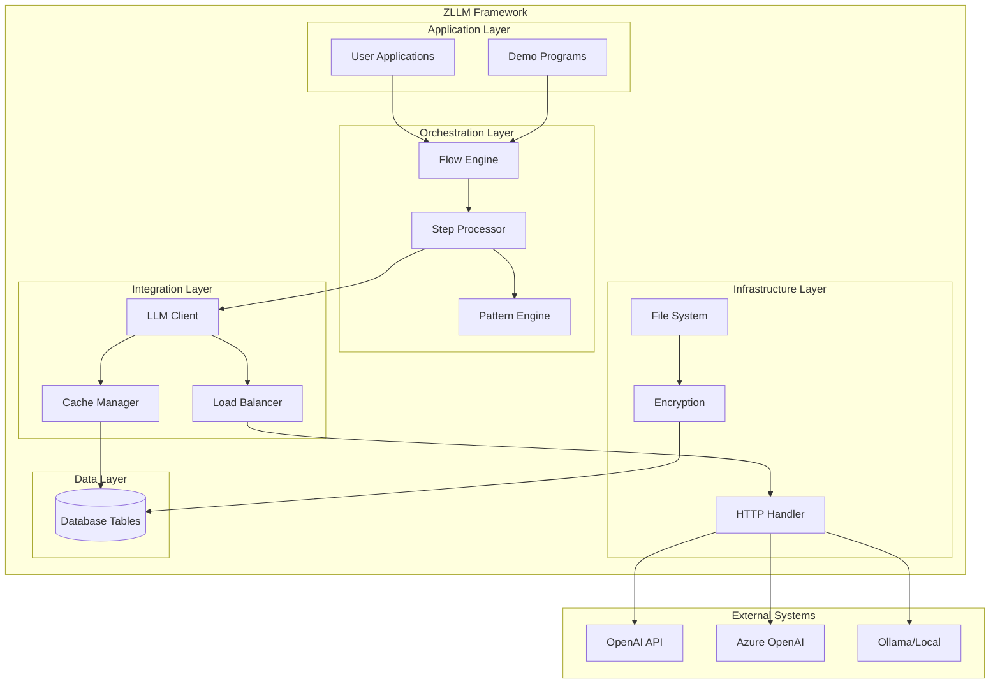

## Component Architecture

### Core Components Interaction

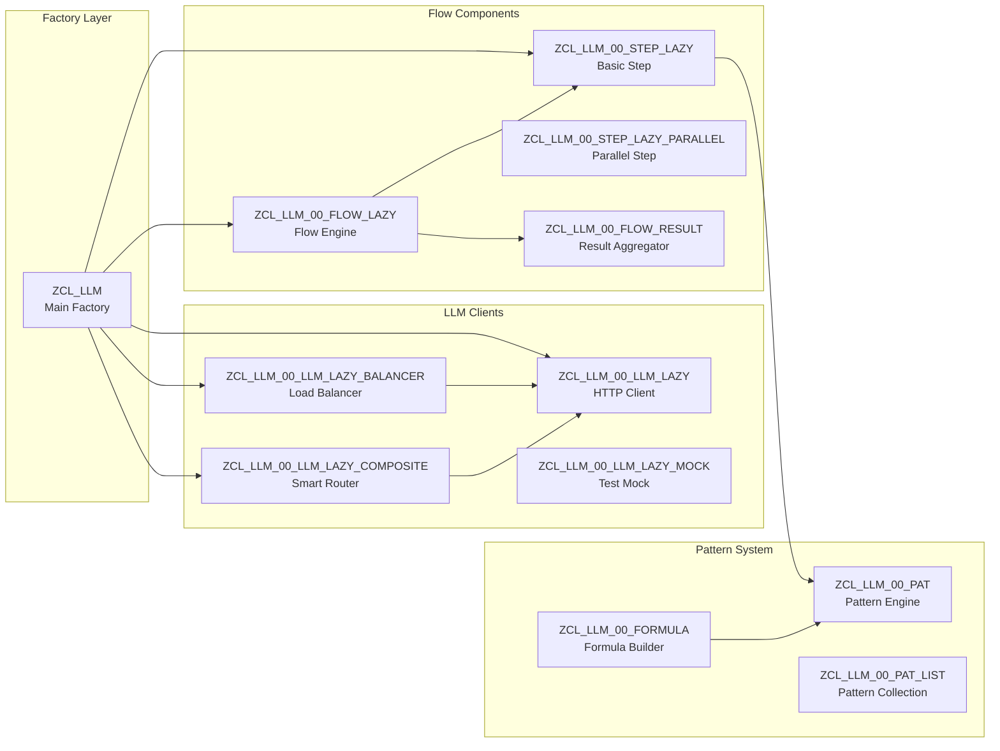

### Supporting Infrastructure

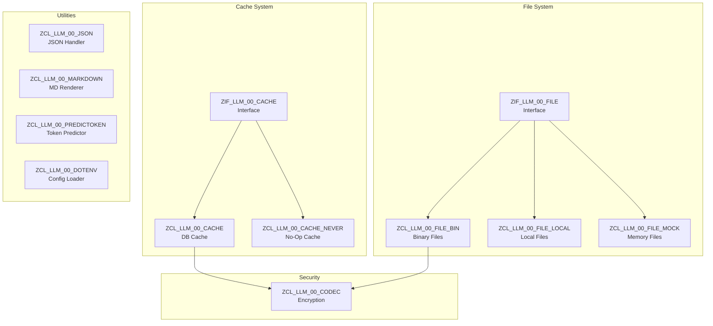

## Data Flow Diagrams

### Request Processing Flow

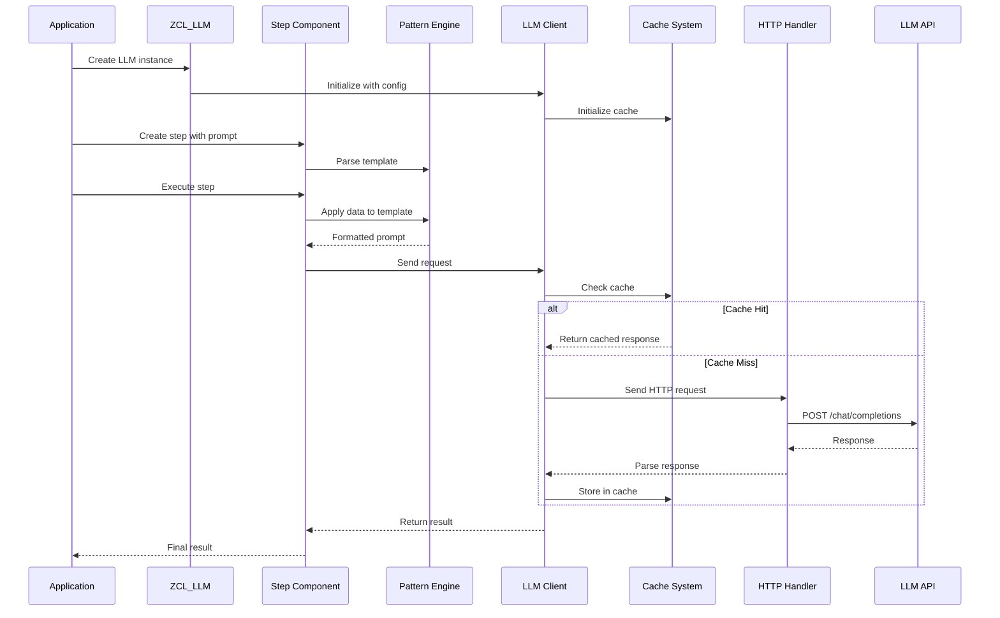

### Flow Orchestration

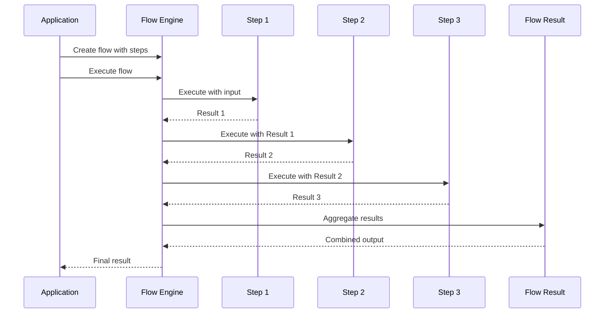

## Class Relationships

### Interface Hierarchy

```mermaid
classDiagram
    class ZIF_LLM_00_LLM_LAZY {
        <<interface>>
        +q(io_json) llm_response
        +a(io_response) string
        +get_config() config
    }
    
    class ZIF_LLM_00_STEP_LAZY {
        <<interface>>
        +start(ir_data) step_result
        +exec(ir_data) data
        +collect(io_result) data
    }
    
    class ZIF_LLM_00_PAT {
        <<interface>>
        +apply(ir_data) string
        +get_name() string
    }
    
    class ZIF_LLM_00_CACHE {
        <<interface>>
        +get(key) string
        +put(key, value)
        +invalidate(key)
        +clear()
    }
    
    class ZIF_LLM_00_FILE {
        <<interface>>
        +get_string() string
        +get_xstring() xstring
        +get_name() string
    }
    
    ZCL_LLM_00_LLM_LAZY ..|> ZIF_LLM_00_LLM_LAZY
    ZCL_LLM_00_LLM_LAZY_BALANCER ..|> ZIF_LLM_00_LLM_LAZY
    ZCL_LLM_00_LLM_LAZY_COMPOSITE ..|> ZIF_LLM_00_LLM_LAZY
    ZCL_LLM_00_LLM_LAZY_MOCK ..|> ZIF_LLM_00_LLM_LAZY
    
    ZCL_LLM_00_STEP_LAZY ..|> ZIF_LLM_00_STEP_LAZY
    ZCL_LLM_00_STEP_LAZY_PARALLEL ..|> ZIF_LLM_00_STEP_LAZY
    
    ZCL_LLM_00_PAT ..|> ZIF_LLM_00_PAT
    
    ZCL_LLM_00_CACHE ..|> ZIF_LLM_00_CACHE
    ZCL_LLM_00_CACHE_NEVER ..|> ZIF_LLM_00_CACHE
    
    ZCL_LLM_00_FILE_BIN ..|> ZIF_LLM_00_FILE
    ZCL_LLM_00_FILE_LOCAL ..|> ZIF_LLM_00_FILE
    ZCL_LLM_00_FILE_MOCK ..|> ZIF_LLM_00_FILE
```

### Component Dependencies

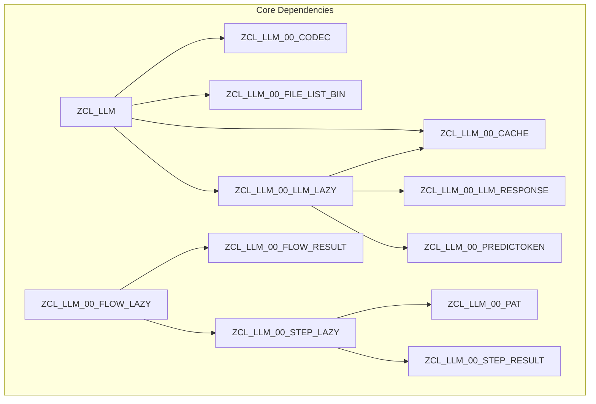

## Security Architecture

### Encryption and Storage Flow

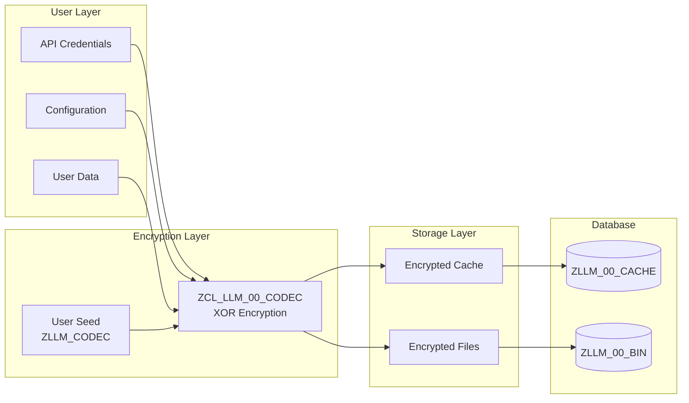

### Security Features

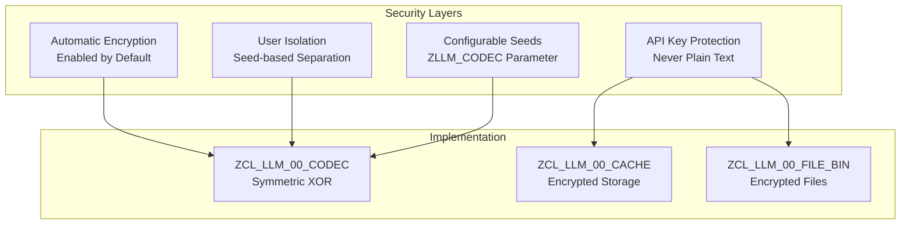

## Database Schema

### Table Relationships

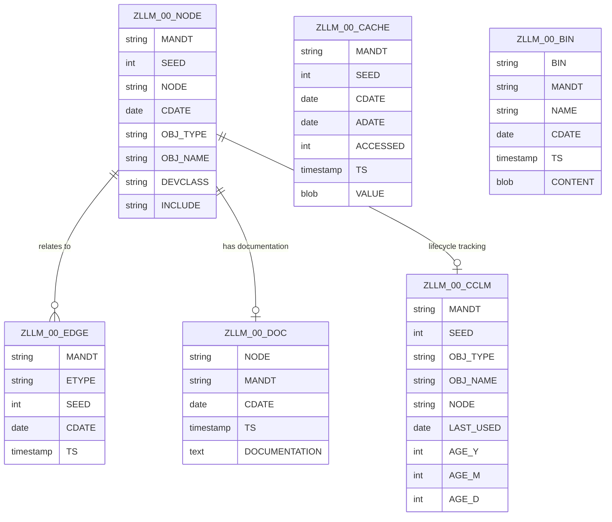

### Data Storage Architecture

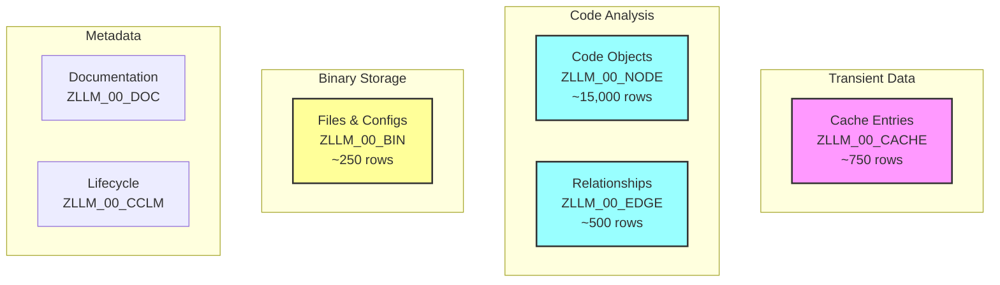

## Performance Considerations

### Caching Strategy

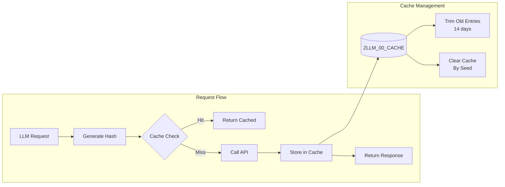

### Token Prediction Flow

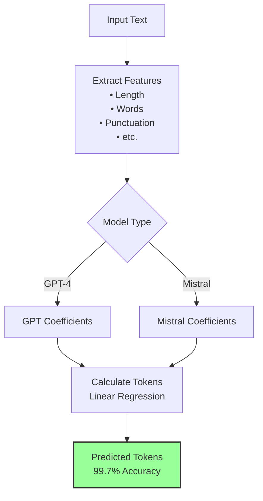

## Deployment Architecture

### Package Structure

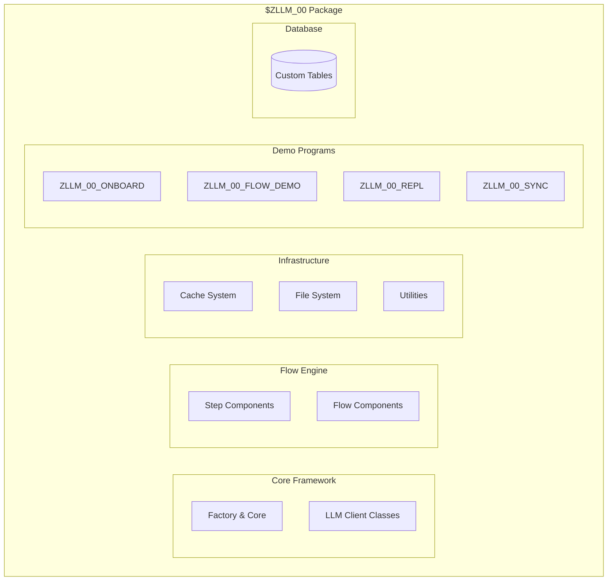

## Summary

The ZLLM Framework architecture is designed with:

1. **Modularity**: Clear separation between layers and components
2. **Security**: Built-in encryption and user isolation
3. **Performance**: Smart caching and token prediction
4. **Flexibility**: Multiple LLM provider support
5. **Extensibility**: Interface-based design for easy extension
6. **Enterprise-Ready**: Robust error handling and monitoring

This architecture enables developers to build sophisticated LLM-powered applications within SAP/ABAP environments while maintaining security, performance, and maintainability standards.