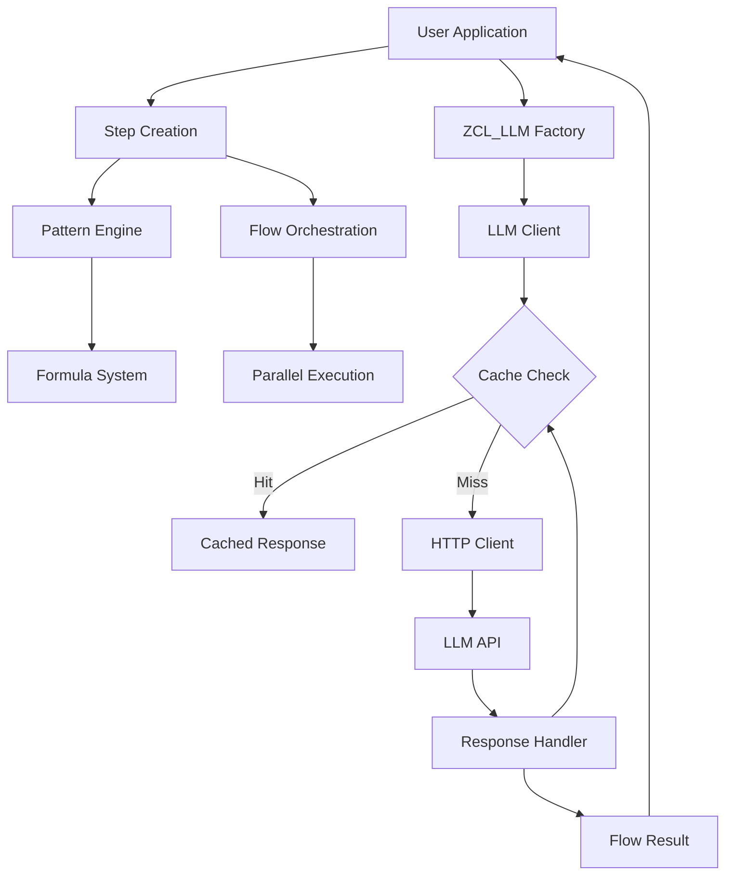

# ZLLM Framework Guide

## Table of Contents
1. [Introduction](#introduction)
2. [Architecture Overview](#architecture-overview)
3. [Quick Start](#quick-start)
4. [Core Concepts](#core-concepts)
5. [Template Engine](#template-engine)
6. [Steps and Flows](#steps-and-flows)
7. [Advanced Features](#advanced-features)
8. [Demo Programs](#demo-programs)
9. [Component Reference](#component-reference)
10. [Best Practices](#best-practices)

## Introduction

The ZLLM Framework is a sophisticated "LangChain-lite" implementation for ABAP/SAP systems. It provides a complete toolkit for building LLM-powered applications with features like:

- **Lazy Execution**: Non-blocking async operations
- **Flow Orchestration**: Chain multiple LLM calls with result propagation
- **Template Engine**: Powerful pattern system for prompt engineering
- **Cache System**: Built-in caching for performance
- **Load Balancing**: Intelligent routing between multiple LLM models
- **Parallel Processing**: Execute multiple operations concurrently

## Architecture Overview

The ZLLM Framework is built on a modular architecture consisting of several interconnected layers:

### Core Architecture Layers

```
┌─────────────────────────────────────────────────────────────┐
│                    Application Layer                         │
│  (Demo Programs: ONBOARD, FLOW_DEMO, REPL, SYNC)           │
├─────────────────────────────────────────────────────────────┤
│                    Flow Orchestration Layer                  │
│  (Steps, Flows, Formulas, Patterns)                        │
├─────────────────────────────────────────────────────────────┤
│                    LLM Integration Layer                     │
│  (LLM Client, Load Balancer, Response Handler)             │
├─────────────────────────────────────────────────────────────┤
│                    Support Services Layer                    │
│  (Cache, File System, JSON, Token Prediction)              │
├─────────────────────────────────────────────────────────────┤
│                    Data Model Layer                          │
│  (Graph Storage, Binary Storage, Cache Tables)             │
└─────────────────────────────────────────────────────────────┘
```

### Key Components and Their Relationships

#### 1. **Core LLM Client Architecture**
- **ZCL_LLM**: Main factory class for creating LLM instances
- **ZCL_LLM_00_LLM_LAZY**: HTTP-backed LLM client with caching and throttling
- **ZCL_LLM_00_LLM_LAZY_BALANCER**: Load balances across multiple LLM instances
- **ZCL_LLM_00_LLM_LAZY_COMPOSITE**: Routes to different models based on token count
- **ZCL_LLM_00_LLM_RESPONSE**: Wraps HTTP responses with retry logic

#### 2. **Flow and Step Components**
- **ZCL_LLM_00_STEP_LAZY**: Basic unit of LLM interaction
- **ZCL_LLM_00_STEP_LAZY_PARALLEL**: Parallel execution of steps
- **ZCL_LLM_00_FLOW_LAZY**: Chains multiple steps sequentially
- **ZCL_LLM_00_FLOW_RESULT**: Aggregates results from flow execution

#### 3. **Pattern and Template System**
- **ZCL_LLM_00_PAT**: Pattern/template for prompt generation
- **ZCL_LLM_00_PAT_LIST**: Manages collections of patterns
- **ZCL_LLM_00_FORMULA**: Combines system and user patterns

#### 4. **Supporting Infrastructure**
- **ZCL_LLM_00_CACHE**: Database-backed cache with encoding
- **ZCL_LLM_00_CODEC**: Symmetric XOR-based encoding for security
- **ZCL_LLM_00_PREDICTOKEN**: Token count prediction without API calls
- **ZCL_LLM_00_MARKDOWN**: Markdown to HTML rendering

#### 5. **File System Abstraction**
- **ZCL_LLM_00_FILE_LIST_BIN**: Binary file storage management
- **ZCL_LLM_00_FILE_LIST_LOCAL**: Local file system access
- **ZCL_LLM_00_FILE_BIN**: Individual binary file handling
- **ZCL_LLM_00_FILE_MOCK**: In-memory file mock for testing

### Data Flow Architecture



### Database Schema

The framework uses several custom tables for persistence:

- **ZLLM_00_NODE**: Graph nodes representing code objects (15,604 rows)
- **ZLLM_00_EDGE**: Relationships between nodes (499 rows)
- **ZLLM_00_CACHE**: Key-value cache with encoding support (747 rows)
- **ZLLM_00_BIN**: Binary file storage (250 rows)
- **ZLLM_00_CCLM**: Code lifecycle management
- **ZLLM_00_DOC**: Node documentation

### Security Architecture

- **Encoded Storage**: All files use symmetric XOR encoding
- **Configurable Seeds**: Custom encryption seeds via ZLLM_CODEC parameter
- **User Isolation**: Each user's data encoded separately
- **API Key Protection**: Credentials never stored in plain text

## Quick Start

### Basic LLM Query

```abap
" Create LLM instance
DATA(lo_llm) = zcl_llm=>new( 'DEFAULT.ENV' ).

" Create a simple step
DATA(lo_step) = zcl_llm_00_step_lazy=>new_from_string(
  iv_usr = 'Explain quantum computing in simple terms'
  io_llm = lo_llm
).

" Execute and get result
DATA(lr_result) = lo_step->exec( ).
```

### Two-Step Flow

```abap
" Step 1: Generate content
DATA(lo_step1) = zcl_llm_00_step_lazy=>new_from_string(
  iv_usr = 'Write a haiku about programming'
  io_llm = lo_llm
).

" Step 2: Analyze previous result
DATA(lo_step2) = zcl_llm_00_step_lazy=>new_from_string(
  iv_usr = 'Explain the meaning of this haiku: {T}'
  io_llm = lo_llm
).

" Create flow
DATA(lo_flow) = zcl_llm_00_flow_lazy=>new(
  VALUE #( ( lo_step1 ) ( lo_step2 ) )
).

" Execute flow
DATA(lo_result) = lo_flow->exec( ).
```

## Core Concepts

### 1. Lazy Execution Model

The framework uses lazy evaluation for optimal performance:

```abap
" Start operation (non-blocking)
DATA(lo_result) = lo_step->start( ir_input ).

" Do other work...

" Collect result when needed (blocking)
DATA(lr_data) = lo_result->collect( ).
```

### 2. Steps

Steps are the basic unit of LLM interaction:

```abap
" From string
DATA(lo_step) = zcl_llm_00_step_lazy=>new_from_string(
  iv_usr = 'Your prompt'
  iv_sys = 'System prompt (optional)'
  io_llm = lo_llm
).

" From pattern
DATA(lo_pattern) = zcl_llm_00_pat=>new( 'Process this data: {T-FIELD}' ).
DATA(lo_step) = zcl_llm_00_step_lazy=>new_from_pat(
  io_pat_usr = lo_pattern
  io_llm     = lo_llm
).

" From formula (combines system and user prompts)
DATA(lo_formula) = zcl_llm_00_formula=>new_from_usr_and_sys(
  iv_user   = 'User prompt with {T}'
  iv_system = 'You are an expert assistant'
  iv_name   = 'my_formula'
).
DATA(lo_step) = zcl_llm_00_step_lazy=>new_from_formula(
  io_ = lo_formula
  io_llm = lo_llm
).
```

### 3. Flows

Flows chain multiple steps together:

```abap
" Sequential flow
DATA(lo_flow) = zcl_llm_00_flow_lazy=>new(
  VALUE #(
    ( lo_step1 )
    ( lo_step2 )
    ( lo_step3 )
  )
).

" From pattern list
DATA(lo_pat_list) = zcl_llm_00_pat_list=>new( ).
lo_pat_list->add( zcl_llm_00_pat=>new( 'First prompt' ) ).
lo_pat_list->add( zcl_llm_00_pat=>new( 'Second prompt using {T}' ) ).

DATA(lo_flow) = zcl_llm_00_flow_lazy=>new_from_pat_list(
  io_pat_list = lo_pat_list
  io_llm      = lo_llm
).
```

### 4. Composability

Flows can be used as steps in higher-order flows:

```abap
" Create sub-flows
DATA(lo_analysis_flow) = zcl_llm_00_flow_lazy=>new( VALUE #(
  ( lo_extract_entities )
  ( lo_sentiment_analysis )
) ).

DATA(lo_summary_flow) = zcl_llm_00_flow_lazy=>new( VALUE #(
  ( lo_summarize )
  ( lo_translate )
) ).

" Compose into main flow
DATA(lo_main_flow) = zcl_llm_00_flow_lazy=>new( VALUE #(
  ( lo_analysis_flow->to_step( ) )
  ( lo_summary_flow->to_step( ) )
  ( lo_final_report )
) ).
```

## Template Engine

The template engine is the heart of result propagation between steps.

### Basic Substitution

```abap
DATA(lo_pat) = zcl_llm_00_pat=>new( 'Hello {T}!' ).
DATA(lv_result) = lo_pat->apply( REF #( 'World' ) ).
" Result: Hello World!
```

### Structure Access

```abap
" For structure: BEGIN OF ls_data, name TYPE string, age TYPE i, END OF ls_data.
DATA(lo_pat) = zcl_llm_00_pat=>new( 'Name: {T-NAME}, Age: {T-AGE}' ).
DATA(lv_result) = lo_pat->apply( REF #( ls_data ) ).
```

### Deep Structure Navigation

```abap
" Nested structures
DATA(lo_pat) = zcl_llm_00_pat=>new( 
  'Customer: {T-CUSTOMER-NAME}, Order: {T-ORDER-ID}' 
).

" JSON paths
DATA(lo_pat) = zcl_llm_00_pat=>new(
  'Characters: {T-CHARACTERS-NAME}, {T-CHARACTERS-ROLE}'
).
```

### Table Processing

The template engine automatically handles tables:

```abap
" Pattern with table placeholders
DATA(lo_pat) = zcl_llm_00_pat=>new( '| {T-COL1} | {T-COL2} |' ).

" Applied to table produces:
" | Value1A | Value2A |
" | Value1B | Value2B |
" | Value1C | Value2C |
```

### JSON Integration

Complex structures are automatically converted to JSON:

```abap
DATA(lo_step) = zcl_llm_00_step_lazy=>new_from_string(
  iv_usr = 'Analyze this data: {T}'
  io_llm = lo_llm
  iv_detect_json = 'X'  " Auto-detect and format JSON
).
```

## Steps and Flows

### Sequential Processing

```abap
" Step 1: Extract information
DATA(lo_extract) = zcl_llm_00_step_lazy=>new_from_string(
  iv_usr = 'Extract key points from this text: {T}'
  iv_sys = 'Return as JSON array'
  io_llm = lo_llm
).

" Step 2: Expand each point
DATA(lo_expand) = zcl_llm_00_step_lazy=>new_from_string(
  iv_usr = 'For each point in {T}, provide detailed explanation'
  io_llm = lo_llm
).

" Step 3: Generate summary
DATA(lo_summary) = zcl_llm_00_step_lazy=>new_from_string(
  iv_usr = 'Create executive summary from: {T}'
  io_llm = lo_llm
).

" Create flow
DATA(lo_flow) = zcl_llm_00_flow_lazy=>new(
  VALUE #( ( lo_extract ) ( lo_expand ) ( lo_summary ) )
).
```

### Parallel Processing

```abap
" Process multiple items in parallel
DATA(lo_parallel) = zcl_llm_00_step_lazy_parallel=>new(
  io_step = lo_analysis_step
  io_llm  = lo_llm
).

" Execute on table of inputs
DATA(lo_result) = lo_parallel->start( REF #( lt_documents ) ).
```

### Conditional Flows

```abap
" Dynamic flow construction based on conditions
DATA(lt_steps) = VALUE zif_llm_00_step_lazy=>tt_steps( ).

IF lv_need_translation = abap_true.
  APPEND lo_translate_step TO lt_steps.
ENDIF.

IF lv_need_summary = abap_true.
  APPEND lo_summary_step TO lt_steps.
ENDIF.

DATA(lo_flow) = zcl_llm_00_flow_lazy=>new( lt_steps ).
```

## Advanced Features

### 1. Cache System

```abap
" Create cache with custom seed
DATA(lo_cache) = zcl_llm_00_cache=>new( iv_seed = 12345 ).

" Create cached LLM
DATA(lo_llm_cached) = zcl_llm=>new( 
  iv_config = 'DEFAULT.ENV'
  io_cache  = lo_cache
).

" Subsequent identical requests will use cache
```

### 2. Load Balancing

Route requests to different models based on complexity:

```abap
" Create models
DATA(lo_llm_mini) = zcl_llm=>new( 'MINI.ENV' ).   " For simple tasks
DATA(lo_llm_maxi) = zcl_llm=>new( 'MAXI.ENV' ).   " For complex tasks

" Create composite with threshold
DATA(lo_llm_smart) = zcl_llm_00_llm_lazy_composite=>new(
  io_llm       = lo_llm_mini
  io_llm_exp   = lo_llm_maxi
  iv_threshold = 1000  " Token threshold
).

" Automatically routes to appropriate model
```

### 3. Token Prediction

Estimate token usage without calling LLM:

```abap
" Get token prediction
DATA(lv_tokens) = zcl_llm_00_predictoken=>predict_tokens_gpt4( lv_text ).

" Use for routing decisions
IF lv_tokens < 500.
  lo_llm = lo_llm_mini.
ELSE.
  lo_llm = lo_llm_maxi.
ENDIF.
```

### 4. Environment Configuration

ZLLM supports multiple LLM providers through flexible .env configuration files. The framework automatically detects the endpoint type based on the configuration parameters.

#### OpenAI-Compatible Endpoints (Ollama, LM Studio, etc.)

```env
# For local Ollama instance
API_MODEL=devstral
API_URL=http://192.168.8.107:11434/
API_KEY=ollama
API_MAX_TOKEN=64000
API_TOKEN_SPLIT_LIMIT=24000
```

```env
# For OpenAI API
API_MODEL=gpt-4o-mini
API_URL=https://api.openai.com/v1/
API_KEY=sk-your-openai-api-key
API_MAX_TOKEN=16384
API_TOKEN_SPLIT_LIMIT=12000
```

#### Azure OpenAI Endpoints

```env
# Azure OpenAI Configuration
API_AZURE_FULL_URL=https://yourdomain.openai.azure.com/openai/deployments/gpt-4o/chat/completions?api-version=2024-01-01-preview
API_KEY=your-azure-api-key

# Token Limits (optional, uses defaults if not specified)
#API_MAX_TOKEN=4000
#API_TOKEN_SPLIT_LIMIT=3000

# Optional: Override model name (defaults to deployment name from URL)
#API_MODEL=gpt-4o

# Optional: Embedding deployment
#API_DEP_EMBED=ada-002
```

#### Configuration Parameters

| Parameter | Description | Required | Default |
|-----------|-------------|----------|---------|
| `API_MODEL` | Model name/ID | Yes (except Azure) | - |
| `API_URL` | Base URL for OpenAI-compatible APIs | Yes (non-Azure) | - |
| `API_AZURE_FULL_URL` | Full Azure OpenAI endpoint URL | Yes (Azure only) | - |
| `API_KEY` | API authentication key | Yes | - |
| `API_MAX_TOKEN` | Maximum tokens per request | No | Model default |
| `API_TOKEN_SPLIT_LIMIT` | Token limit for splitting large inputs | No | 75% of max |
| `API_DEP_EMBED` | Azure embedding deployment name | No | - |
| `TEMPERATURE` | LLM temperature setting | No | 0.7 |

#### Usage in ABAP

```abap
" Load from .env file
DATA(lo_dotenv) = zcl_llm_00_dotenv=>new( 'DEFAULT.ENV' ).

" Access configuration
DATA(lv_model) = lo_dotenv->get( 'API_MODEL' ).
DATA(lv_key)   = lo_dotenv->get( 'API_KEY' ).
DATA(lv_limit) = lo_dotenv->get( 'API_MAX_TOKEN' ).

" Create LLM with specific config
DATA(lo_llm) = zcl_llm=>new( 'OLLAMA.ENV' ).     " Local Ollama
DATA(lo_llm) = zcl_llm=>new( 'AZURE.ENV' ).      " Azure OpenAI
DATA(lo_llm) = zcl_llm=>new( 'OPENAI.ENV' ).     " OpenAI API
```

#### Multiple Configurations

Create different .env files for various use cases:

```bash
DEFAULT.ENV      # Your primary configuration
MINI.ENV         # Fast, lightweight model for simple tasks
MAXI.ENV         # Powerful model for complex tasks
DEEP.ENV         # Low temperature for analytical tasks
LOCAL.ENV        # Local Ollama for development
PROD.ENV         # Production Azure deployment
```

### 5. Custom Patterns

```abap
" Create pattern with custom delimiters
DATA(lo_pat) = zcl_llm_00_pat=>new(
  iv_             = 'Process <<T-DATA>>'
  iv_start_string = '<<'
  iv_end_string   = '>>'
  iv_root         = 'T'
).
```

### 6. Virtual Filesystem Security

ZLLM includes a virtual filesystem for storing configurations, patterns, and cached data. All files are automatically encoded for security.

#### Encoding Mechanism

Files in the virtual filesystem are protected using a lightweight symmetric encryption:
- **Algorithm**: Multiple random XOR operations
- **Configurable**: Set your own seed via the `ZLLM_CODEC` parameter
- **Automatic**: Encoding/decoding happens transparently

#### Configuration

```abap
" Set custom codec seed (optional)
SET PARAMETER ID 'ZLLM_CODEC' FIELD '12345'.

" The codec is automatically applied when using file operations
DATA(lo_file_list) = zcl_llm_00_file_list_bin=>new_from_bin( '$ZLLM' ).
DATA(lo_file) = lo_file_list->get( 'DEFAULT.ENV' ).
" File content is automatically decoded when read
```

#### Security Benefits

- **Protection at Rest**: Configuration files and API keys are never stored in plain text
- **User Isolation**: Each user's files are encoded with their specific seed
- **Lightweight**: Minimal performance impact while providing basic security
- **Transparent**: No code changes needed - encoding happens automatically

#### Custom Codec Implementation

```abap
" Create custom codec with specific seed
DATA(lo_codec) = zcl_llm_00_codec=>new( iv_seed = 42 ).

" Use with cache for encoded storage
DATA(lo_cache) = zcl_llm_00_cache=>new(
  iv_seed  = 42
  io_codec = lo_codec
).
```

**Note**: This is lightweight encoding, not enterprise-grade encryption. For highly sensitive data, use additional security measures.

## Demo Programs

### 1. ZLLM_00_ONBOARD - Setup and Testing

The onboarding program is your starting point for configuring and testing ZLLM. It provides a comprehensive interface for managing multiple LLM configurations.

#### Main Features

**Configuration Management**:
- Configure up to 4 different LLM variants simultaneously:
  - **Default**: Your primary LLM configuration
  - **Mini**: Lightweight model for simple tasks (1000 token limit)
  - **Maxi**: Powerful model for complex tasks (8000 token limit)
  - **Deep**: Analytical model with low temperature (0.1) for precise reasoning

**Function Keys**:
- **F1 (Test All)**: Tests all enabled LLM configurations
- **F2 (Save All)**: Saves all enabled configurations as .env files
- **F3 (Test & Save)**: Tests first, then saves if successful
- **F4 (Expert Mode)**: Toggle visibility of advanced configurations

#### Expert Mode

By default, only the Default configuration is visible. Press **F4** to enable Expert Mode, which reveals:
- Mini, Maxi, and Deep configuration options
- Ability to configure multiple LLM endpoints
- Advanced testing scenarios

This simplified interface helps new users get started quickly while providing power users with full control.

#### Configuration Process

1. **Basic Setup** (Non-Expert Mode):
   - Enter your Azure OpenAI URL and API key in the Default section
   - Check the "Enable" checkbox
   - Press F3 to test and save

2. **Advanced Setup** (Expert Mode):
   - Press F4 to enable Expert Mode
   - Configure multiple variants with different models/deployments
   - Each variant can have different token limits and settings
   - Test all configurations simultaneously with F1

#### Generated .env Files

The program creates environment files with appropriate settings:

```env
# Default configuration
DEFAULT.ENV         # Standard configuration

# Expert mode variants
DEFAULT-MIN.ENV     # Mini model (1000 tokens, fast)
DEFAULT-MAX.ENV     # Maxi model (8000 tokens, powerful)
DEFAULT-DEEP.ENV    # Deep thinking (low temperature)
```

#### Testing

The program includes a test question field that sends a query to each enabled LLM:
- Default: "Tell me a joke about a killeroo. (Mighty-Boosh)"
- Validates connectivity and response
- Shows success/failure for each configuration

#### File Storage

Configurations are stored in a binary object (SMW0 or similar) with user-specific namespacing:
- Format: `$ZLLM_<username>`
- Allows multiple users to maintain separate configurations
- Persists across sessions

### 2. ZLLM_00_FLOW_DEMO - Basic Flow Example

Simple two-step flow demonstration:
- Generates creative content
- Processes and transforms it

### 3. ZLLM_00_REPL - Interactive Development

Advanced interactive environment:
- Four-step story generation workflow
- Pattern testing and debugging
- Cache integration
- HTML preview

### 4. ZLLM_00_SYNC - File Synchronization

Virtual filesystem sync with local folders. This utility enables:
- Synchronization between local folders and SAP MIME repository (SMW0)
- Binary file management in ZLLM_00_BIN table
- Support for various file masks and filtering
- Bidirectional sync (upload/download)

## Component Reference

### Core Classes

#### ZCL_LLM - Main Factory
```abap
" Create LLM instances with various configurations
DATA(lo_llm) = zcl_llm=>new( 'DEFAULT.ENV' ).
" Methods: get_llm( ), get_flow( ), get_step( ), get_predictoken( )
```

#### ZCL_LLM_00_LLM_LAZY - LLM Client
- HTTP-based LLM client with built-in features
- Supports multiple providers (OpenAI, Azure, Ollama)
- Automatic retry on 429 (rate limit)
- Configurable throttling
- Debug/trace capabilities

#### ZCL_LLM_00_STEP_LAZY - Step Execution
- Basic unit of LLM interaction
- Supports lazy execution model
- JSON detection and formatting
- Result collection and propagation

#### ZCL_LLM_00_FLOW_LAZY - Flow Orchestration
- Chains multiple steps sequentially
- Automatic result propagation between steps
- Composable (flows can be steps)
- Support for complex workflows

#### ZCL_LLM_00_PAT - Pattern Engine
- Template/pattern for dynamic prompts
- Deep structure navigation
- Table iteration support
- Configurable delimiters

#### ZCL_LLM_00_CACHE - Caching System
- Database-backed persistent cache
- Automatic encoding/decoding
- Seed-based isolation
- Access tracking and aging

#### ZCL_LLM_00_PREDICTOKEN - Token Prediction
- 99.7% accuracy (R² > 0.997)
- Sub-millisecond performance
- Support for GPT-4 and Mistral models
- No API calls required

### Interface Reference

#### ZIF_LLM_00_LLM_LAZY
```abap
INTERFACE zif_llm_00_llm_lazy.
  METHODS:
    q IMPORTING io_ TYPE REF TO zif_llm_00_json
      RETURNING VALUE(ro_) TYPE REF TO zif_llm_00_llm_response,
    a IMPORTING io_ TYPE REF TO zif_llm_00_llm_response
      RETURNING VALUE(rv_) TYPE string,
    get_config RETURNING VALUE(rs_) TYPE ts_config.
ENDINTERFACE.
```

#### ZIF_LLM_00_STEP_LAZY
```abap
INTERFACE zif_llm_00_step_lazy.
  METHODS:
    start IMPORTING ir_ TYPE REF TO data OPTIONAL
          RETURNING VALUE(ro_) TYPE REF TO zif_llm_00_step_result,
    exec IMPORTING ir_ TYPE REF TO data OPTIONAL
         RETURNING VALUE(rr_) TYPE REF TO data,
    collect IMPORTING io_ TYPE REF TO zif_llm_00_step_result
            RETURNING VALUE(rr_) TYPE REF TO data.
ENDINTERFACE.
```

#### ZIF_LLM_00_PAT
```abap
INTERFACE zif_llm_00_pat.
  METHODS:
    apply IMPORTING ir_ TYPE REF TO data
          RETURNING VALUE(rv_) TYPE string,
    get_name RETURNING VALUE(rv_) TYPE string.
ENDINTERFACE.
```

### Utility Classes

#### ZCL_LLM_00_JSON - JSON Handling
- Serialization/deserialization
- Type detection
- Nested structure support

#### ZCL_LLM_00_MARKDOWN - Markdown Rendering
- Full CommonMark support
- Safe mode for untrusted content
- HTML output generation

#### ZCL_LLM_00_SPL - GUI Splitter Management
- Dynamic container splitting
- Complex layout support
- Symbolic split notation

#### ZCL_LLM_00_DOTENV - Environment Configuration
- .env file parsing
- Configuration management
- Multi-environment support

### Data Types

#### Common Types
```abap
TYPES: BEGIN OF ts_env,
         api_key TYPE string,
         api_url TYPE string,
         api_model TYPE string,
         api_max_token TYPE i,
         api_token_split_limit TYPE i,
       END OF ts_env.

TYPES: BEGIN OF ts_llm_config,
         model TYPE string,
         max_token TYPE i,
         split_limit TYPE i,
       END OF ts_llm_config.
```

## Best Practices

### 1. Error Handling

```abap
TRY.
    DATA(lr_result) = lo_step->exec( ).
  CATCH zcx_llm INTO DATA(lx_error).
    " Handle error
    MESSAGE lx_error->get_text( ) TYPE 'E'.
ENDTRY.
```

### 2. Pattern Design

- Use meaningful placeholder names: `{T-CUSTOMER_NAME}` not `{T-X}`
- Keep patterns readable and maintainable
- Test patterns with sample data before using in flows

### 3. Performance Optimization

- Use caching for repeated queries
- Leverage parallel processing for batch operations
- Choose appropriate models based on task complexity
- Monitor token usage with prediction

### 4. Flow Design

- Keep steps focused on single responsibilities
- Use meaningful step names for debugging
- Test steps individually before combining
- Consider reusability when designing flows

### 5. Debugging

```abap
" Enable debug mode in REPL
" Use trace interfaces for execution monitoring
" Check step results at each stage
```

## Conclusion

The ZLLM Framework provides a powerful, enterprise-ready solution for integrating LLMs into SAP systems. Its lazy execution model, sophisticated template engine, and composable architecture make it ideal for building complex AI-powered workflows while maintaining clean, maintainable code.

For more examples, explore the demo programs and experiment with different patterns and flows to discover the full potential of the framework.