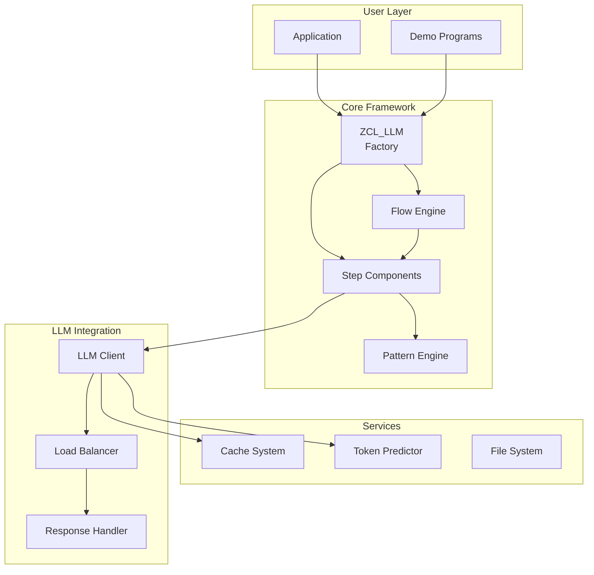

# ZLLM: A LangChain-lite for ABAP

ZLLM is a sophisticated "LangChain-lite" framework that brings the power of Large Language Model (LLM) orchestration to SAP/ABAP systems. Think of it as LangChain's enterprise-ready cousin, specifically designed for ABAP developers who need to build complex AI-powered workflows within their SAP landscape.

## Why "LangChain-lite for ABAP"?

Like LangChain, ZLLM provides:
- **Chain Composition**: Build complex workflows by chaining multiple LLM calls
- **Prompt Templates**: Sophisticated template engine for dynamic prompt generation
- **Memory & State**: Result propagation between steps maintains context
- **Modular Design**: Steps and flows are composable building blocks

But optimized for enterprise ABAP:
- **Native ABAP**: No external dependencies, runs entirely within SAP
- **Lazy Execution**: Non-blocking async operations for better performance
- **Enterprise Features**: Built-in caching, load balancing, and error handling
- **SAP Integration**: Seamless integration with ABAP structures and tables

For a deep-dive into the framework and its capabilities, please see the [GUIDE.md](GUIDE.md).

## Core Features

### 🔗 Chaining & Orchestration
- **Sequential Flows**: Chain multiple LLM calls with automatic result propagation
- **Parallel Execution**: Process multiple inputs concurrently
- **Nested Flows**: Compose flows within flows for complex workflows
- **Lazy Evaluation**: Start operations without blocking, collect results when needed

### 🎯 Advanced Template Engine
- **Deep Structure Navigation**: Access nested ABAP structures with dot notation (`{T-CUSTOMER-NAME}`)
- **Table Processing**: Automatically iterate over internal tables
- **JSON Integration**: Seamless conversion between ABAP structures and JSON
- **Pattern Substitution**: Dynamic prompt generation with result propagation

### ⚡ Performance & Reliability
- **Built-in Cache System**: Intelligent caching reduces API calls and costs
- **Load Balancer**: Route requests to different models based on complexity
- **Token Prediction**: Estimate token usage without API calls (99.7% accuracy)
- **Error Recovery**: Robust error handling with retry mechanisms

### 🔐 Security Features
- **Encoded Storage**: Encryption is ENABLED by default - all virtual filesystem files are automatically encoded using symmetric encryption
- **Configurable Seeds**: Set custom encryption seeds via `ZLLM_CODEC` parameter
- **API Key Protection**: Credentials are never stored in plain text
- **User Isolation**: Each user's data is encoded with their specific seed

### 🛠️ Developer Experience
- **Simple API**: Intuitive interfaces for common tasks
- **REPL Environment**: Interactive development and testing
- **Multiple LLM Support**: Easy switching between different models
- **Environment Config**: Manage configurations with .env files

## Quick Start

### Simple Query
```abap
" Create LLM instance and execute a simple query
DATA(lo_llm) = zcl_llm=>new( 'DEFAULT.ENV' ).
DATA(lo_step) = zcl_llm_00_step_lazy=>new_from_string(
  iv_usr = 'Explain cloud computing in simple terms'
  io_llm = lo_llm
).
DATA(lr_result) = lo_step->exec( ).
```

### Chained Workflow
```abap
" Create a two-step flow: generate content, then summarize it
DATA(lo_step1) = zcl_llm_00_step_lazy=>new_from_string(
  iv_usr = 'Write a detailed explanation of quantum computing'
  io_llm = lo_llm
).

DATA(lo_step2) = zcl_llm_00_step_lazy=>new_from_string(
  iv_usr = 'Summarize this in 3 bullet points: {T}'  " {T} contains result from step1
  io_llm = lo_llm
).

DATA(lo_flow) = zcl_llm_00_flow_lazy=>new(
  VALUE #( ( lo_step1 ) ( lo_step2 ) )
).

DATA(lo_result) = lo_flow->exec( ).
```

### Using Templates with ABAP Data
```abap
" Process structured data with templates
DATA: BEGIN OF ls_customer,
        name TYPE string VALUE 'ACME Corp',
        revenue TYPE p VALUE '1000000',
        industry TYPE string VALUE 'Technology',
      END OF ls_customer.

DATA(lo_pattern) = zcl_llm_00_pat=>new( 
  'Analyze this customer: Name: {T-NAME}, Revenue: ${T-REVENUE}, Industry: {T-INDUSTRY}'
).

DATA(lo_step) = zcl_llm_00_step_lazy=>new_from_pat(
  io_pat_usr = lo_pattern
  io_llm     = lo_llm
).

DATA(lr_result) = lo_step->exec( REF #( ls_customer ) ).
```

## Advanced Features

### 🚀 Parallel Processing
```abap
" Process multiple documents in parallel
DATA(lo_parallel_step) = zcl_llm_00_step_lazy_parallel=>new(
  io_step = lo_analysis_step
  io_llm  = lo_llm
).

DATA(lo_result) = lo_parallel_step->start( REF #( lt_documents ) ).
```

### 💾 Smart Caching
```abap
" Caching is ENABLED by default - all LLM responses are automatically cached
DATA(lo_llm) = zcl_llm=>new( 'DEFAULT.ENV' ).  " Uses default cache

" To disable caching, inject a dummy cache:
DATA(lo_cache_never) = zcl_llm_00_cache_never=>new( ).
DATA(lo_llm_no_cache) = zcl_llm=>new( 
  iv_config = 'DEFAULT.ENV'
  io_cache  = lo_cache_never  " This disables caching
).

" To use custom cache with specific seed:
DATA(lo_cache_custom) = zcl_llm_00_cache=>new( iv_seed = 42 ).
DATA(lo_llm_custom) = zcl_llm=>new( 
  iv_config = 'DEFAULT.ENV'
  io_cache  = lo_cache_custom
).
```

### ⚖️ Load Balancing
```abap
" Route to different models based on complexity
DATA(lo_llm_composite) = zcl_llm_00_llm_lazy_composite=>new(
  io_llm       = lo_llm_mini      " For simple queries (<1000 tokens)
  io_llm_exp   = lo_llm_maxi      " For complex queries
  iv_threshold = 1000
).
```

## PREDICTOKEN - Intelligent Token Prediction

ZLLM includes PREDICTOKEN, a sophisticated token prediction system that estimates token counts without API calls:

```abap
" Predict tokens before making expensive API calls
DATA(lv_predicted_tokens) = zcl_llm_00_predictoken=>predict_tokens_gpt4( lv_text ).

" Use prediction for smart routing
IF lv_predicted_tokens < 500.
  lo_llm = lo_llm_mini.  " Use cheaper model
ELSE.
  lo_llm = lo_llm_maxi.  " Use more capable model
ENDIF.
```

| Method | R² Score | Accuracy | Speed | Cost |
|--------|----------|----------|-------|------|
| Simple heuristics | 0.70-0.83 | ±15-23% | Instant | Free |
| **PREDICTOKEN** | **0.997** | **±3%** | **<1ms** | **Free** |
| Actual tokenizer | 1.000 | Perfect | Network latency | API cost |

## Configuration

ZLLM supports multiple LLM providers through flexible .env configuration files:

### OpenAI-Compatible APIs (Ollama, LM Studio, OpenAI)
```env
# Local Ollama
API_MODEL=devstral
API_URL=http://192.168.8.107:11434/
API_KEY=ollama
API_MAX_TOKEN=64000
API_TOKEN_SPLIT_LIMIT=24000
```

### Azure OpenAI
```env
# Azure OpenAI Configuration
API_AZURE_FULL_URL=https://yourdomain.openai.azure.com/openai/deployments/gpt-4o/chat/completions?api-version=2024-01-01-preview
API_KEY=your-azure-api-key
#API_MAX_TOKEN=4000
#API_MODEL=gpt-4o  # Optional: Override deployment name
```

### OpenAI Direct
```env
API_MODEL=gpt-4o-mini
API_URL=https://api.openai.com/v1/
API_KEY=sk-your-api-key
API_MAX_TOKEN=16384
```

## Getting Started

1. **Run the Onboarding Program**: `ZLLM_00_ONBOARD`
   - Start with basic setup (single LLM configuration)
   - Press F4 for Expert Mode to configure multiple model variants
   - Use F3 to test and save your configurations automatically
2. **Try the Demo**: `ZLLM_00_FLOW_DEMO` - See basic chaining in action
3. **Explore the REPL**: `ZLLM_00_REPL` - Interactive development environment
4. **Read the Guide**: [GUIDE.md](GUIDE.md) - Comprehensive documentation with examples

## Architecture Overview

ZLLM is built on a sophisticated multi-layered architecture designed for enterprise-grade LLM orchestration:

### System Architecture

```
┌─────────────────────────────────────────────────────────────┐
│                    Application Layer                         │
│  • Demo Programs (ONBOARD, FLOW_DEMO, REPL, SYNC)          │
│  • User Applications and Custom Workflows                   │
├─────────────────────────────────────────────────────────────┤
│                Flow Orchestration Layer                      │
│  • Steps (Lazy, Parallel) • Flows • Formulas • Patterns    │
├─────────────────────────────────────────────────────────────┤
│                 LLM Integration Layer                        │
│  • LLM Client • Load Balancer • Composite Router           │
│  • Response Handler • Retry Logic • Throttling             │
├─────────────────────────────────────────────────────────────┤
│                Support Services Layer                        │
│  • Cache System • File Abstraction • JSON Processing       │
│  • Token Prediction • Markdown Rendering • Encoding        │
├─────────────────────────────────────────────────────────────┤
│                   Data Model Layer                          │
│  • Graph Storage (NODE/EDGE) • Binary Storage (BIN)        │
│  • Cache Tables • Code Analytics • Documentation           │
└─────────────────────────────────────────────────────────────┘
```

### Core Design Principles

- **Lazy Execution**: Operations start immediately but don't block, allowing parallel execution
- **Composable Design**: Steps and flows can be nested infinitely
- **Template Engine**: Powerful pattern system that handles deep structures, tables, and JSON
- **Error Resilience**: Built-in retry logic and error handling
- **Zero Dependencies**: Pure ABAP implementation, no external libraries needed
- **Secure Storage**: Virtual filesystem with automatic encoding using configurable symmetric encryption

### Key Component Interactions



### Database Schema

The framework leverages custom tables for persistence and analytics:

| Table | Purpose | Typical Size |
|-------|---------|--------------|
| ZLLM_00_NODE | Graph nodes for code objects | 15,000+ rows |
| ZLLM_00_EDGE | Relationships between nodes | 500+ rows |
| ZLLM_00_CACHE | Persistent cache with encoding | 750+ rows |
| ZLLM_00_BIN | Binary file storage | 250+ rows |
| ZLLM_00_CCLM | Code lifecycle management | Analytics |
| ZLLM_00_DOC | Documentation storage | Metadata |

## Key Components

### Core Framework Classes

- **ZCL_LLM**: Main factory class for creating LLM instances and components
- **ZCL_LLM_00_LLM_LAZY**: HTTP-backed LLM client with caching, throttling, and retry logic
- **ZCL_LLM_00_LLM_LAZY_BALANCER**: Intelligently routes requests across multiple LLM instances
- **ZCL_LLM_00_LLM_LAZY_COMPOSITE**: Routes to different models based on token complexity

### Flow Orchestration

- **ZCL_LLM_00_STEP_LAZY**: Basic unit of LLM interaction with lazy execution
- **ZCL_LLM_00_STEP_LAZY_PARALLEL**: Enables parallel processing of multiple inputs
- **ZCL_LLM_00_FLOW_LAZY**: Chains steps sequentially with automatic result propagation
- **ZCL_LLM_00_FLOW_RESULT**: Aggregates and manages flow execution results

### Pattern & Template System

- **ZCL_LLM_00_PAT**: Powerful template engine for dynamic prompt generation
- **ZCL_LLM_00_PAT_LIST**: Manages collections of patterns
- **ZCL_LLM_00_FORMULA**: Combines system and user patterns for complex prompts

### Supporting Infrastructure

- **ZCL_LLM_00_CACHE**: Database-backed persistent cache with automatic encoding
- **ZCL_LLM_00_CODEC**: Symmetric XOR-based encoding for secure storage
- **ZCL_LLM_00_PREDICTOKEN**: High-accuracy token prediction without API calls
- **ZCL_LLM_00_MARKDOWN**: Full-featured Markdown to HTML renderer
- **ZCL_LLM_00_JSON**: Advanced JSON serialization/deserialization
- **ZCL_LLM_00_DOTENV**: Environment configuration management

### File System Abstraction

- **ZCL_LLM_00_FILE_LIST_BIN**: Binary file storage in database
- **ZCL_LLM_00_FILE_LIST_LOCAL**: Local file system access
- **ZCL_LLM_00_FILE_BIN**: Individual binary file handling
- **ZCL_LLM_00_FILE_MOCK**: In-memory file mock for testing

## Documentation

- **[GUIDE.md](GUIDE.md)** - Comprehensive usage guide with examples and component reference
- **[IMPLEMENTATION.md](IMPLEMENTATION.md)** - Technical implementation details of PREDICTOKEN
- **[ARCHITECTURE.md](ARCHITECTURE.md)** - Detailed architecture diagrams and component documentation

## Package Structure

```
$ZLLM_00/                       # Main package
├── Core/                       # Core framework classes
│   ├── ZCL_LLM                # Main factory
│   └── ZCL_LLM_00_*          # Core components
├── Flow/                       # Flow orchestration
│   ├── *_STEP_*              # Step components
│   └── *_FLOW_*              # Flow components
├── Pattern/                    # Template system
│   ├── *_PAT*                # Pattern engine
│   └── *_FORMULA*            # Formula system
├── Infrastructure/             # Supporting services
│   ├── *_CACHE*              # Cache system
│   ├── *_FILE_*              # File abstraction
│   └── *_PREDICTOKEN*        # Token prediction
└── Demo/                       # Demo programs
    ├── ZLLM_00_ONBOARD       # Setup wizard
    ├── ZLLM_00_FLOW_DEMO     # Basic examples
    ├── ZLLM_00_REPL          # Interactive env
    └── ZLLM_00_SYNC          # File sync utility
```

## License

MIT License - see [LICENSE](LICENSE.md) file for details.
